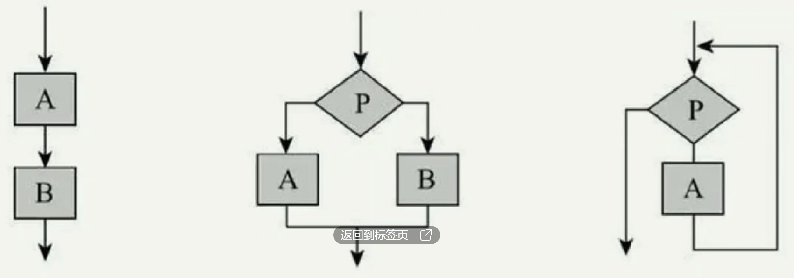

# 【信息】高中信息学考

> 我 OI 都拿省一了怎么都不免学考！/fn /zhh

## 考生端界面


## 常考内容

### Python 变量命名规则

- 特殊符号只能有下划线。
- 大写字母和小写字母不同。
- 不能以数字开头。
- 不能用专有名词（和 C++ 类似）。

### 五次信息革命

概括：语文造电网。

- 语：出现语言；
- 文：出现文字；
- 造：出现造纸术和印刷术，有了纸质书籍；
- 电：出现电报、广播等；
- 网：有了网络。

### 二进制与十进制互相转化

OI 学过了，略过。

### 算法的三种描述方式

语（自然语言）、数（流程图）、英（伪代码）。

## 常识内容

### 数据、信息和知识

【数据】是信息的载体。

【信息】是数据所表达的意义。特征：依附性、价值性、时效性、共享性、真伪性、可处理、可传递。

【知识】是人们在社会实践中获得的认识和经验的总和。

> 数据和信息的区别：信息一般都有主语，描述了谁是什么或谁怎么了；数据没有主语。
>
> 信息和知识的区别：课本上学的内容（定理等）都属于知识。

### 数字化过程

总结而言，数字化的过程是 采样 $\to$ 量化 $\to $ 编码。

模拟信号：是连续的，有波峰有波谷，一般在**物理**设备中处理，如磁带。

数字信号：是离散的，不连续，一般在**电子**设备中处理，如手机。

示例——家庭局域网结构图：


这里的电话线一般是光纤信号，属于模拟信号。

调制解调器（MODEM）的作用：模拟信号与数字信号的转换。**调**制成**模**拟信号，**解**调成**数**字信号。

### 数据处理

一般过程：数据采集、数据整理、数据分析、数据可视化表达。

数据采集的主要环节：明确数据需求（找什么）、确定数据来源（去哪找）、选择采集方法（怎么找）、实施数据采集（找）。

### 常见文件格式

> 带字母 v 的除了 wav 是声音，其余都是视频格式。

文字：txt、doc(x)。

图片：jpg、gif、png、bmp。

声音：mp3、wma、**wav**、mid。

视频：avi、wmv、mov、flv、mpg。

网页：html。

### 图片大小与音频大小计算

图片大小 $=$ 分辨率 $\times$ 量化位数（颜色深度）。

图片大小的单位一般是 $\mathrm b$。

声音大小 $=$ 采样频率（$\pu{Hz}$）$\times$ 时间（$\pu s$）$\times$ 量化位数（颜色深度）$\times$ 声道数。

### 储存容量计算

$\mathrm{bit}$：位（1 个二进制位），计算机储存的最小单位。

$\mathrm{Byte}$：字节（8 个连续的二进制位），计算机储存的基本单位。

单位换算：
$$
\pu{1 B(Byte) = 8 bit}\\
\pu{1 KB(KiB) = 1024 B}(2^{10} \mathrm B)\\
\pu{1 MB(MiB) = 1024 KB}\\
\pu{1 GB(GiB) = 1024 MB}\\
\pu{1 TB(TiB) = 1024 GB}\\
\pu{1 PB(PiB) = 1024 TB}
$$
网速的单位是 $\pu{Mbps = Mb/s}$，因此百兆网速的下载速度最高可达 $\pu{100 Mbps}$，即 $\pu{100 Mb/s}$，而计算中的兆一般指 $\pu{MB}$，转化单位得到百兆网下载速度最高为 $\pu{12.5 MB/s}$。

> 一般情况下，U 盘或硬盘中存储单位转化是**千进制**，所以若标称 $\pu{10 GB}$，则实际容量 $< \pu{10 GB}$。

一般情况下，一个英文字符占用一字节，即 $\pu{1B}$，一个汉字占用两字节，即 $\pu{2 B}$，一个中文标点占据三字节，即 $\pu{3 B}$。

### 字符编码

**字符**：是任与计算机交互过程中不可或缺的重要内容，它是多种文字和符号的总称。

**ASCII**（英文编码）：在早期的计算机系统应用中，计算机只能处理**英文字母，数字和常用的英文标点符号**，这时期基础的标准编码规则是美国信息交换标准码（ASCII）。

**GB 码**（中文编码）：例如 GB1906，GB2005 等。

**unicode**（统一码）：为了扩充 ASCII 编码，以用于**显示更多语言文字**，国际标准化组织在 1991 年和 Unicode 组织联合指定**统一编码规则**Unicode。

范围：unicode > GB 码 > ASCll 码。

### 大数据特征

巨量，多样，讯变，价值。

具体而言，数据体量大、数据种类多、数据生成速度快、处理快、价值密度低。

### 算法特征

有输入、有输出、有穷性、可行性、确定性。

> 输入不是必须的，可以没有，其它特征必须有。

### 计算机语言

低级语言：包含机器语言和汇编语言。

高级语言：例如 C、VB、Java、python 等。

python 是一个动态的、面向对象的、通用的脚本编程语言。

### 处理问题过程

计算机处理问题过程：分析、设计、编程、调试运行。

信息系统处理问题过程：分析、设计、实施、运行维护。

### 运算优先级

括号（）优先级最高，其次是算术运算（加减乘除乘方模等），然后是关系运算（大于小于和等于），最后是逻辑运算（not and or，其中 not > and > or）。

### Python 中的运算

% 是取模运算，与 C++ 相同；// 是「整除」运算，相当于 C++ 中的 /。

其他的基本上跟 C++ 差不多。不做赘述。

### IP 地址

IPV4 地址：是二进制下 32 位表示法。

十进制表示法：将二进制表示法下，从左到右将每八位转化为第一个十进制数字，整体上转化成四个十进制数字，用「.」分割。那么每个数字都在 0~255 之间。

十进制表示法中，第一个十进制数的大小表示是哪一类地址：若 $< 128$，则是 A 类；$> 191$，则是 C 类：反之是 B 类。

二进制表示法中，一般通过开头几位数字判断是哪一类地址：A 类 0，B 类 10，C 类 110，D 类 1110，E 类 11110。

主机号越多，可支持上网的电脑越多。生活中常用的是 C 类地址，一个网络号最多可支持 254 个电脑上网（0 和 255 表示网段和广播地址，不能用。主机号可以用 1~254。如：192.168.0.1 - 192.168.0.254）。


如上图所示，A 类可支持上网的电脑最多（网络号 $\pu{1 B}$，主机号 $\pu{3 B}$），其次是 B 类（主机号网络号都是 $\pu{2 B}$），最后是 C 类（网络号 $\pu{3 B}$，主机号 $\pu{1 B}$）。

### 域名

域名的本质就是 IP 地址，通过 DNS 解读域名后可以知道 IP 地址。可以使人更方便地访问互联网，而不用去记住能够被机器直接读取的 IP 地址。


常见域名后缀：`.com`（商业机构）、`.edu`（教育机构）、`.gov`（政府机构）、`.org`（非营利组织）、`.cn`（中国）、`.us` （美国）。

www 开头的网址服务器名就是万维网 www。

### 计算机病毒

计算机病毒是**人为的**，具有**破坏性**。

预防：

- 信息加密。一般情况下有三种常见的方式：账号密码、唯一信物、生物特征（人脸识别指纹识别等）。
- 私钥加密，也叫**对称**加密。可以理解为锁门和开门用的钥匙相同。
- 公钥加密，也叫**非对称**加速。可以理解为锁门和开门用的钥匙不同。

### 信息系统的组成要素

组成要素：人、信息技术（硬件、软件和网络）、数据、过程。

信息系统的功能：对信息的输入、处理、储存、控制、传输和输出，以支持组织（人）做出快速合理的决策。

信息社会的特征：数字生活、信息经济、网络社会、在线政府。总结为：数信网在（站）。

### 人工智能

判断是否是人工智能，可以看其是否具有独立思考、得出结论和学习能力。

相关知识点：

- 人工智能：是指以机器（计算机）为载体，模仿、延伸和扩展人类智能，其与人类或其它动物所呈现的生物只能有着重要区别。
- 图灵测试：是测试机器是否具有智能的一种方法。
- 机器学习：是当前人工智能的核心技术之一，目的是使计算机能模拟或实现人类的学习行为，获取新的知识或技能，重新组织已有的知识结构，从而不断完善自身的性能。
- 神经网络：神经网络是目前人工智能领域的研究热点之一，是一种模仿动物神经网络行为特征，进行并行信息处理的算法模型。
- 深度学习：是机器学习中一种基于对数据进行表征学习的方法。

人工智能的识别类型：

- 看到图象/视频 $\to$ 图像识别。
- 用到声音/麦克风 $\to$ 语音识别。

### 数据存储和安全

数据存储主要有两种方式：**本地存储**和**第三方「云端」存储**。云端存储必须有**网络**和**硬件**，二者缺一不可。

数据安全威胁：分为人为因素和非人为因素。主要包括计算机病毒、黑客攻击、数据存储介质损坏（非人为因素），个人事务，非法数据交易。

## 编程内容

### 进制

OI 里面都学了，没啥好说的，需要注意的就是表示时，除了可以括号右下角标进制，例如 $(10010)_2$ 之外，还可以用字母表示，例如 $10010\mathrm B$，二进制用 B 表示，八进制用 O 表示，十进制用 D 表示，十六进制用 H 表示。

十六进制是四个常用进制中唯一一个有字母表示的，含有 $a,b,c,d,e,f$ 六个小写字母。

### 流程图

|                             图形                             |   名称    |            功能            |
| :----------------------------------------------------------: | :-------: | :------------------------: |
|  | 开始/结束 |    表示算法的开始或结束    |
|  | 输入/输出 | 表示算法中变量的输入或输出 |
|  |   处理    | 表示算法中变量的计算与赋值 |
|  |   判断    |    表示算法中的条件判断    |
|  |  流程线   |      表示算法中的流向      |
|  |  连接点   |      表示算法中的转接      |

主要记平行四边形和菱形。

### 数据类型

| 数据类型 | 类型标识符 |                        类型说明及示例                        |
| :------: | :--------: | :----------------------------------------------------------: |
|   整型   |    int     | Python 中的整数理论上可以任意大，即不存在计算机位数不够的情况 |
|  浮点型  |   float    |                    可以使用浮点型表示小数                    |
| 字符串型 |    str     |      字符串通常是用一对单引号或双引号括起来表示一串字符      |
|  布尔型  |    bool    | 布尔类型通常用于逻辑判断，只有两个值：True 和 False，分别代表真和假 |
|   列表   |    list    | 列表是用来存放一组数据的序列。列表中存放的元素可以是各种类型的数据，<br />它们被防止在一对中括号中，以逗号分隔，如：[1,2,3,'A',5]。 |

### 三种结构

分为顺序结构（下图左 1）、选择结构（下图左 2）、循环结构（下图左 3）。



毕竟学过 OI，其它的什么不赘述了。

### Python 常用函数

- `input()` 输入，`print()` 输出。`a=input()` 表示输入 $a$。`a = input("请输入年份：")` 表示先输出 `请输入年份：`，再输入 $a$。
- `int()` 转整型，`float()` 转浮点型。
- `len()` 计算长度，`abs()` 返回绝对值。
- `def` 自定义函数，`import` 导入库。常用库：import turtle 绘制图形、import time 处理时间、import math 数学运算。
- `range(a,b,c)` 相当于 C++ 的 `for(int i=a;i<b;i+=c)`，注意中间是 `i<b` 而非 `i<=b`。
- `range(n)` 表示 $0$ 到 $n-1$ 循环，`range(a,b)` 表示 $a$ 到 $b-1$ 循环。

- `print(i,end=" ")` 表示输出 $i$ 加空格。

有关输出的一些知识：

```python
#把小括号里面的值打印成一行
print(a)
#如果逗号隔开那么打印时会用空格隔开
print(1,"abc",10) #会打印成一行出来 "1 abc 10"
#默认把内容打印后会用换行符结束来实现输出一行，可以自定义成不要用换行结束
print(1,2,3,end=",") #会打印 "1 2 3," 并且不会换行
```

### 解题技巧

- 循环结构 for 语句的结构是 `for i in range()`。
- 生成满足条件的一个列表是 `s=[]`，将 `i` 放入列表是 `s.append(i)`。
- python 把 C++ 中，if 结构不满足需要多次选择结构时的 `else if` 变成了 `elif`。`else` 不变。
- 其它的曾经搞 OI 学 C++ 学过，懒得说了。

## 一些容易混的知识点

计算机处理问题过程：分析、设计、编程、调试运行。

信息系统处理问题过程：分析、设计、实施、运行维护。

用计算机解决问题的过程：提出问题，分析问题，设计方案，编程调试，解决问题。

数据处理的一般过程：数据采集，数据整理，数据分析，数据可视化表达。

数据采集的主要环节：明确数据需求，确定数据来源，选择采集方法，实施数据采集。

信息系统是一种**存储、加工、呈现信息**的系统。

信息系统开发的四个阶段：系统分析、系统设计、系统实施、系统运行与维护。

信息系统的工作过程：输入、处理、输出。

信息系统的关键要素：人、信息技术、数据（大数据）、过程。

信息系统的基本构成：基础设施层、资源管理层、业务逻辑层、应用表现层。

信息社会的基本特征：信息经济、网络社会、在线政府、数字生活。

大数据技术：对巨量数据进行**采集**、**提取**、**存储**、**分析**和**表达**的技术。一般包括**大数据采集**、**大数据预处理**、**大数据存储与管理**、**大数据分析与挖掘**及**大数据可视化与应用**等技术。

信息的特征：依附性、价值性、时效性、共享性、真伪性、可处理、可传递。

大数据的特征：巨量性、多样性、讯变性、价值性。

算法的特征：有输入（也可以没有输入）、有输出、有穷性、可行性、确定性。

算法的描述方法：自然语言、流程图、伪代码、程序代码。

数据安全的威胁：计算机病毒、黑客攻击、数据存储介质损坏、个人失误。

数据保护的方法：数据备份、数据加密。

冯·诺依曼计算机体系结构的五大部件：控制器、运算器、存储器、输入设备、输出设备。

数据交换技术：电路交换、报文交换、分组交换。

声音编码产生的过程：采样、量化、编码。

数据压缩的两种途径：无损压缩、有损压缩。

**音频所占存储容量(Byte)=采样频率(Hz)×量化位数(位)×声道数×时长(秒)/8**

**无压缩图片所占存储容量(Byte)=水平像素×垂直像素×颜色深度(位)/8**

百兆网理论下载速度为 $\pu{100 Mb/s} =\pu{ \dfrac{100}{8} MB/S = 12.5 MB/s}$，即 $\pu{100 \times 1024 \times 1024 bit/s}$。

CPU 的主要技术参数有：**主频（比如 2.5Ghz，表示每秒 2.5G 次指令运算）**、通用寄存器的数据宽度（32 位 / 64 位）、高速缓存大小、指令集。
