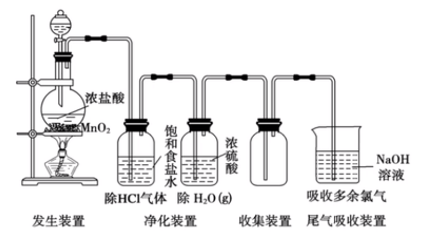

# 【化学】必修一：非金属及其化合物

## 硅及其化合物

### 硅单质

#### 物理性质

1. 单晶硅的结构与金刚石类似，为正四面体的立体网状结构。晶体中每个硅原子与其他四个硅原子相连接。$1\mathrm{mol}$ 硅单质还有 $\mathrm{2N_A}$ 个 $\mathrm{Si-Si}$ 键

2. 单晶硅是带有金属光泽的灰黑色固体，熔点高，硬度大，有脆性，在常温下化学性质不活泼；

3. 导电性介于导体和绝缘体之间，是良好的半导体材料。常见半导体材料：$\mathrm{Te,Sb,B,Ge,As,Si}$。

4. 高纯硅的制备：

	
	$$
	\mathrm{SiO_2+2C\xlongequal{1800℃ \sim 2000℃}Si+2CO↑}\\
	\mathrm{Si+3HCl\xlongequal{300℃}SiHCl_3+H_2}\\
	\mathrm{SiHCl_3+H_2\xlongequal{1100℃}Si+3HCl}
	$$

#### 化学性质

1. 常温条件下：
	$$
	\mathrm{Si+2F_2=SiF_4}\\
	\mathrm{Si+4HF=SiF_4↑+2H_2↑}\\
	\mathrm{Si+2NaOH+H_2O=Na_2SiO_3+2H_2↑}\\
	$$
	注：跟碱反应生成氢气的物质里，非金属是硅，金属是铝。

2. 加热（高温）条件下：
	$$
	\mathrm{Si+2Cl_2\xlongequal{\triangle}SiCl_4}\\
	\mathrm{Si+O_2\xlongequal{\triangle}SiO_2}\\
	\mathrm{Si+C\xlongequal{高温}SiC}(碳化硅,俗称金刚砂)
	$$
	

### 二氧化硅

1. 物理性质：硬度大，熔沸点高，常温下为固体、难溶于水、不导电。$\mathrm{1mol~SiO_2}$ 含有 $4\mathrm{N_A}$ 个 $\mathrm{Si-O}$ 键。

2. 化学性质：
	- 与氢氟酸反应：$\mathrm{SiO_2+4HF=SiF_4↑+2H_2O}$，与其它酸均不反应，所以不是碱性氧化物。
	
	- 与强碱（$\mathrm{NaOH}$）反应：$\mathrm{SiO_2+2NaOH=Na_2SiO_3+H_2O}$，所以二氧化硅是酸性氧化物。
	
	- 与碱性氧化物反应：$\mathrm{CaO+SiO_2\xlongequal{高温}CaSiO_3}$

	- 与盐反应：
		$$
		\mathrm{SiO_2+Na_2CO_3\xlongequal{高温}Na_2SiO_3+CO_2}\\
			  \mathrm{SiO_2+CaCO_3\xlongequal{高温}CaSiO_3+CO_2}
		$$
	
	- 与碳反应：$\mathrm{SiO_2+2C\xlongequal{高温}Si+2CO}$，即工业制备高纯硅的第一部反应。
	
3. 补充考点：

	- 石英坩埚和瓷坩埚主要成分是 $\mathrm{SiO_2}$，不能用来加热氢氧化钠等强碱性物质。（铝坩埚也不行）
	- 因为氢氧化钠与二氧化硅反应十分缓慢，且玻璃瓶内壁光滑，更不容易发生反应，因此可以用玻璃瓶盛放氢氧化钠溶液，但不能用**带磨口玻璃塞的玻璃瓶盛放**，因为磨口增大了接触面积，促进了反应进行，会使得瓶塞与瓶口黏结在一起；
	- 氢氟酸可以较快腐蚀玻璃，可用**氢氟酸刻蚀玻璃**。

### 硅酸

1. 是一种很弱的酸（酸性比碳酸还弱），溶解度很小（不同于大部分酸，所以放入紫色石蕊溶液中自然电离出的氢离子很少，遇石蕊）；

2. 不稳定性：热稳定性很差，发生反应：$\mathrm{H_2SiO_3\xlongequal{\triangle}SiO_2+H_2O}$，可以类比碳酸或氢氧化铝加热分解记忆；

3. 硅酸浓度大时在水中易聚合形成透明、胶冻状的硅酸凝胶，硅酸凝胶经过干燥脱水后得到多空的硅酸干凝胶，成为“硅胶”。**硅胶是多孔状，吸附水分子能力强，常用作干燥剂。**（生石灰也可以作为食品干燥剂，不能防氧化，防氧化要用铁粉）

4. 向硅酸盐溶液中加入盐酸或通入 $\mathrm{CO_2}$，可制得硅酸胶体（凝胶）或沉淀。
	$$
	\mathrm{Na_2SiO_3+2HCl=H_2SiO_3(胶体)+2NaCl}\\
	\mathrm{Na_2SiO_3+CO_2+H_2O=H_2SiO_3↓+Na_2CO_3}
	$$
	制备硅酸的原理是“强酸制弱酸”，这一原理可以来设计酸性强弱的比较实验，如：证明盐酸 $>$ 碳酸 $>$ 硅酸，实验装置如下：

	

	第一步碳酸钙和稀盐酸反应生成二氧化碳和水：证明 $\mathrm{HCl>H_2CO_3}$；

	第二步用饱和碳酸氢钠溶液除杂：将杂质 $\mathrm{HCl}$ 转化成需要的 $\mathrm{CO_2}$；

	第三部硅酸钠与二氧化碳发生反应生成硅酸：出现白色沉淀，说明生成硅酸，证明 $\mathrm{H_2CO_3>H_2SiO_3}$。

	**注意：不可以用此实验验证非金属性，因为盐酸不是 $\mathbf{Cl}$ 最高价氧化物的水化物。只能验证非金属性 $\mathbf{C>Si}$。**

### 硅酸盐

1. 物理性质：白色，可溶于水的粉末状固体，其水溶液俗称**水玻璃**，是一种矿物胶，有很强的的粘合性。
2. 可以与酸（盐酸、碳酸等）反应生成硅酸凝胶；
3. 用途：制备硅胶，作木材、纺织品的防腐剂、防火剂。

### 硅的重要用途归纳

1. 硅单质-晶体硅：半导体、芯片、太阳能电池（光感电池，光能转化为电能，**不是**氧化还原反应）；
2. 二氧化硅：石英、水晶、玛瑙、玻璃、光导纤维（与导电性无关，是由于其光学性能）；
3. 硅酸盐：玻璃、陶瓷（主要原料是黏土）、水泥（三大传统无机非金属材料）；
4. 硅胶：食品或药物的干燥剂。
5. 硅酸钠：玻璃胶，耐热防火阻燃的材料。
6. 合成纤维是有机高分子材料，光导纤维是新型非金属材料。
7. 二氧化硅不能一步加水得到硅酸，只能先加氢氧化钠等强碱生成硅酸钠然后再加盐酸或二氧化碳。

### 无机非金属材料

1. 传统无机非金属材料：

  1. 简介：

     许多无机非金属材料含有**硅、氧元素**，具有耐高温、抗腐蚀、硬度高等特点，以及特殊的光学电学性能。

     无机非金属材料成为航天、航空、信息和新能源等高技术淋雨必须的材料。

     传统无机非金属材料主要成分硅酸盐，三大无机非金属材料是陶瓷、水泥、玻璃。

     硅酸盐材料大多数具有硬度高、熔点高、难溶于水、化学性质稳定、耐腐蚀等特点。

  2. 陶瓷：

     1. 主要原料：黏土（主要成分为含水的铝硅酸盐）；
        2. 反应原理：高温烧结而成；
        3. 主要成分：$\mathrm{Al_2O_3\cdot 2SiO_2\cdot 2H_2O}$；
        4. 特点：抗氧化、抗酸碱腐蚀、耐高温、绝缘；
        5. 用途：用于生产建筑材料，绝缘材料，日用器皿、卫生洁具等。

  3. 玻璃：

        1. 主要原料：石英砂（主要成分 $\mathrm{SiO_2}$）、纯碱、石灰石；
        
        2. 反应原理：
        	$$
        	\mathrm{Na_2CO_3+SiO_2\xlongequal{高温}Na_2SiO_3+CO_2↑}\\
        	\mathrm{CaCO_2+SiO_2\xlongequal{高温}CaSiO_3+CO_2↑}
        	$$
        3. 主要成分：$\mathrm{Na_2SiO_3、CaSiO_3、SiO_2}$
        4. 用途：建筑材料、光学仪器、各种器皿；光学玻璃；加入硼酸盐用于实验室使用的玻璃仪器；加入金属氧化物或盐制成彩色玻璃，用于建筑和装饰。

  4. 水泥：

	1. 主要原料：黏土、石灰石。其中，黏土同时为陶瓷和水泥的原料，石灰石同时是玻璃和水泥的原料。
	2. 特点：具有水硬性，与水参合搅拌并静置后，容易凝固变硬；
	3. 用途：可以与沙子碎石等与水混合后得到混凝土，用于建设工程。

4. 新型无机非金属材料：

	1. 突破了传统硅酸盐体系，一部分是高纯度含硅材料，如单晶硅、二氧化硅是现代信息技术的基础材料；

	2. 一些是含有碳、氮等元素，在航空航天、能源医疗等具有广泛应用。

	3. 晶体硅：

	   高纯硅广泛应用于信息技术、新能源技术等领域；

	   利用其半导体性能可以制成计算机、通讯设备和家用电器等的芯片，以及光伏电站、人造卫星和电动汽车等硅太阳能电池（光电效应，不涉及化学反应）。

	4. 二氧化硅：

	   可以用来生产光导纤维，抗干扰性能好，能够有效提高通行效率。
	
	5. 新型陶瓷：
	
	   不限于硅酸盐体系，在光热电磁等方面具有新的特性和功能；
	
	  1. 碳化硅（$\mathrm{SiC}$）：俗称金刚砂，具有类似金刚石的结构，硬度很大，可用作砂纸和砂轮的磨料，具有高熔点，优异的高温抗氧化性能，是耐高温结构材料，耐高温半导体材料；
	  2. 氮化硅（$\mathrm{Si_3N_4}$）：具有润滑性、耐磨损、抗腐蚀、能力强，高温时抗氧化。
	  3. 压电陶瓷：能实现机械能和电能的相互转化；
	  4. 透明陶瓷：
	  5. 生物陶瓷：主要是氧化铝陶瓷，不易变质、腐败，不易产生有毒物质，可以做人工关节、骨骼等。
	
	6. 碳纳米材料：
	
	  

## 氯及其化合物

### 氯气

#### 物理性质

1. 颜色：黄绿色；
2. 状态：气体；
3. 气味：刺激性气味，有毒。
4. 毒性：有毒；
5. 溶解性：可溶于水，$1$ 体积水溶解 $2$ 体积氯气。

#### 化学性质

1. 与氢气的反应：
  - 操作：在空气中点燃氢气，然后把导管缓慢伸入到盛满氯气的集气瓶中；
  - 实验现象：① $\mathrm{H_2}$ 在 $\mathrm{Cl_2}$ 中安静的燃烧；②火焰呈苍白色；③ 瓶口上方出现白雾；
  - 化学方程式：$\mathrm{H_2+Cl_2\xlongequal{点燃}2HCl}$；

2. 与金属的反应：

  氯气表现氧化性。

   |      金属      |                 $\mathbf{Na}$                  |                   $\mathbf{Fe}$                   |                 $\mathbf{Cu}$                  |
   | :------------: | :--------------------------------------------: | :-----------------------------------------------: | :--------------------------------------------: |
   |  **实验现象**  |              产生黄色火焰、冒白烟              |                  产生棕褐色的烟                   |                 产生棕黄色的烟                 |
   | **化学方程式** | $\mathrm{2Na+Cl_2\xlongequal{\triangle}2NaCl}$ | $\mathrm{2Fe+3Cl_3\xlongequal{\triangle}2FeCl_3}$ | $\mathrm{Cu+Cl_2\xlongequal{\triangle}CuCl_2}$ |

3. 与水的反应：

	常温下：溶于水的部分氯气与水反应：
	$$
	\mathrm{Cl_2+H_2O\rightleftharpoons HCl+HClO}\\
	\mathrm{Cl_2+H_2O=H^++Cl^-+{HClO}}
	$$
	**注意：由于是可逆反应，所以 $\mathbf{1mol}$ 氯气与水反应不能转移 $\mathbf{1mol}$ 电子。**

4. 常温下与 $\mathrm{NaOH}$ 溶液反应（歧化反应）：
	$$
	\mathrm{Cl_2+2NaOH=NaCl+NaClO+H_2O}\\
	  \mathrm{Cl_2+2OH^-=Cl^-+ClO^-+H_2O}\\
	$$
	应用：
	
	- 实验室吸收多余的 $\mathrm{Cl_2}$；
	
	- 工业制漂白液（84 消毒液），有效成分为 $\mathrm{NaClO}$。
	
	- 84 消毒液不能与洁厕灵（主要成分 $\mathrm{HCl}$）混用：
		$$
		\mathrm{ClO^-+2H^++Cl^-=Cl_2↑+H_2O}
		$$
	
5. 与冷的石灰乳 $\mathrm{Ca(OH)_2}$ （不是澄清石灰水）反应：
	$$
	\mathrm{2Cl_2+2Ca(OH)_2=CaCl_2+Ca(ClO)_2+2H_2O}
	$$
	次氯酸钙是漂白粉的有效成分。

	漂白粉的起效和失效：

	起效：
	$$
	\mathrm{Ca(ClO)_2+CO_2+H_2O=CaCO_3+2HClO}
	$$
	失效：
	$$
	\mathrm{2HClO\xlongequal{光照}2HCl+O_2↑}
	$$

6. 工业制备氯气：电解 $\mathrm{NaCl}$ 溶液。
	$$
	\mathrm{2NaCl+2H_2O\xlongequal{通电}2NaOH+H_2↑+Cl_2↑}
	$$

### 新制氯水

#### 新制氯水的成分

1. 三分：$\mathrm{H_2O>Cl_2>HClO}$

2. 四离：$\mathrm{H^+>Cl^->ClO^->OH^-}$

#### 新制氯水的性质

1. $\mathrm{Cl_2}$：黄绿色、强氧化性。

   实例：

   负二价硫：硫化氢，硫氢根离子等都可以被氯气氧化成硫单质；

   正四价硫：二氧化硫，亚硫酸亚硫酸氢根被氯气氧化为正六价硫酸根；
   $$
   \mathrm{SO_2+Cl_2+2H_2O=H_2SO_4+2HCl}\\
       \mathrm{2I^-+Cl_2=I_2+2Cl^-}\\
       \mathrm{2Br^-+Cl_2=Br_2+2Cl^-}\\
       \mathrm{2Fe^{2+}+Cl_2=2Fe^{3+}+2Cl^-}
   $$
   可以将碘离子还原成碘单质，溶液呈黄色；将溴离子还原成溴单质，溶液呈橙黄色。

2. $\mathrm{H^+}$：强酸性。

   实例：与镁反应放出 $\mathrm{H_2}$，与 $\mathrm{CaCO_3}$ 反应放出 $\mathrm{CO_2}$。

3. $\mathrm{HClO}$：弱酸性、强氧化性。

	实例：

	1. 漂白、杀菌、消毒；
	2. 氯气可以使湿润的有色布条褪色，不能使干燥的有色布条褪色，说明氯气没有漂白性，而是次氯酸起漂白作用；
	3. 滴入紫色石蕊溶液，先变红，后褪色。

  1. $\mathrm{Cl^-}$：沉淀反应。实例：$\mathrm{Ag^++Cl^-=AgCl↓}$

### 久置氯水

1. 反应方程式：$\mathrm{2HClO\xlongequal{光照}2HCl+O_2↑}$
2. 成分：$\mathrm{HCl}$；
3. 性质：有酸性（比新制氯水强），无氧化性、无漂白性；
4. 实验室中氯水需**现用现配**，且避光、密封保存在**棕色试剂瓶**中。

### 氯气的实验室制法

1. 反应原理（不浓不热不反应）：
	$$
	\mathrm{MnO_2+4HCl(浓)\xlongequal{\triangle}MnCl_2+Cl_2↑+2H_2O}\\
	\mathrm{MnO_2+2Cl^-+4H^+\xlongequal{\triangle}Mn^{2+}+Cl_2↑+2H_2O}
	$$
	
2. 反应装置（固液加热型）：

	

	实验仪器的作用：

	1. 分液漏斗：控制反应速率。

	2. 饱和食盐水：除去 $\mathrm{HCl}$ 气体。氯化氢极易溶于水，饱和食盐水中有大量氯离子，可以降低氯气与水的反应，保留了我们需要的氯气，除去了氯化氢气体。

	3. 浓硫酸：干燥气体。

	4. 收集装置：向上排空气法，$\mathrm{\rho_{\mathrm{Cl_2}}}>\rho_{\mathrm{H_2O}}$。

	5. 氢氧化钠溶液：吸收尾气。

	易错点：

	1. 饱和食盐水和浓硫酸位置不能互换：如果先干燥，通过饱和食盐水时又会产生水；
	2. 尾气吸收装置不能用氢氧化钙溶液，因为氢氧化钙微溶于水，不能完全吸收尾气。
	3. 若加入验满装置：用湿润的 $\mathrm{KI}$ 淀粉溶液靠近瓶口，若试纸立刻变蓝，则证明氯气已收集满。

### 氯离子的检验

方法：先向溶液中滴加硝酸酸化（排除 $\mathrm{CO_3}^{2-}$ 的干扰），再加入过量硝酸银，若出现白色沉淀则说明溶液中一定有氯离子。

## 硫及其化合物

### 硫单质

#### 物理性质

1. 俗称硫磺，黄色晶体，质脆，易研成粉末。
2. 硫难溶于水，微溶于酒精，易溶于二硫化碳（硫可以用二硫化碳清洗）。
3. 自然界中的存在形式有硫单质、硫化物和硫酸盐等。

#### 化学性质

硫单质既有氧化性，又有还原性。（处于最高价态和最低价态之间）

1. 与 $\ce{H2}$ 反应：$\ce{H2 + S\xlongequal{\triangle}H2S}$

2. 与 $\ce{O2}$ 反应：$\ce{S + O2\xlongequal{点燃}SO2}$，无论氧气是否过量，都生成 $\ce{SO2}$ 而不生成 $\ce{SO3}$；

3. 与金属：
   $$
   \ce{Fe + S\xlongequal{\triangle}FeS}\\
   \ce{2Cu + S\xlongequal{\triangle}Cu2S}\\
   \ce{Hg + S = HgS}
   $$
   对于实验室洒落的水银，可以立刻用硫粉覆盖。

4. 相关还原性顺序：
   $$
   \ce{S^2- > S^4+ > I- > Fe^2+ > Br- > Cl- > Mn^2+}
   $$
   口诀：留点铁生锈（溴）了长绿（氯）毛（锰）。

### 浓硫酸

#### 物理性质

1. 纯硫酸是无色，粘稠的油状液体，沸点高，难挥发。常用浓硫酸中 $\ce{H2SO4}$ 的质量分数是 $98\%$，物质的量浓度是 $18.4 ~\mathrm{mol \cdot L^{-1}}$，密度为 $\pu{1.84 g* cm-1}$。

#### 化学性质

1. 难挥发性：用于制备难挥发性酸（如 $\ce{HCl}、\ce{HNO3}$）：
   $$
   \ce{NaCl + H2SO4(浓)\xlongequal{微热}NaHSO4 + HCl}
   $$

2. 强酸性：用于制磷酸（强酸制弱酸）：
   $$
   \ce{Ca3(PO4)2 + 3H2SO4(浓) = 3CaSO4 + 2H3PO4}
   $$

3. 制备亚硫酸：一般用 $70\%$ 的浓硫酸（$98\%$ 的浓硫酸反应速率过慢氢离子浓度太低）：
   $$
   \ce{Na2SO3 + H2SO4(浓) = Na2SO4 + SO2↑+H2O}
   $$

4. 吸水性：具有强烈的吸水能力，能吸收空气中的水分，甚至能吸收结晶水合物的水（可以脱去水合硫酸铜中的水，使其由蓝色变为白色粉末），故浓硫酸常作干燥剂，干燥一些不与浓硫酸反应的气体。可以干燥一些**不与浓硫酸反应**的气体。

   比如：可以干燥 $\ce{O2、H2、N2、CO2、Cl2、HCl、CO2、CO、CH4}$ 等气体，但不能干燥 $\ce{NH3、H2S、HI、HBr}$ 等气体。（氨气是因为水溶液呈碱性发生中和反应，后三个是因为强氧化性会将他们氧化为对应单质）

   **注意：氯化氢气体不会与硫酸发生反应，可以用浓硫酸干燥。**

5. 脱水性：具有很强的腐蚀性，能够将氢、氧原子按照 $2:1$ 的比例脱去纸、棉布、木条等有机物中的氢、氧元素。

   如蔗糖的脱水实验：
   $$
   \ce{C12H22O11 ->[浓 H2SO4]12C + 11H2O}\\
   \ce{C + 2H2SO4(浓)\xlongequal{\triangle}CO2↑+2SO2↑+2H2O}
   $$
   前者体现脱水性，后者体现强氧化性。

   浓硫酸具有强腐蚀性与脱水性有很大关系，如浓硫酸会使得蓝色石蕊试纸**先变红，后变黑**。

   【脱水性和吸水性的区别】脱水性对应物质本身没有水，只是将氢、氧原子按照 $2:1$ 的比例脱去，而吸水性是吸去物质本身中的水分子。

6. 强氧化性：硫元素处于最高价态，可以与很多物质发生氧化反应，是常见的氧化剂。（但是稀硫酸不具有氧化性）

   【酸的氧化性】酸中具有 $\mathrm{H^+}$，可以与活泼金属反应氧化活泼金属。这是酸的通性。

   【氧化性的酸】指的是酸根具有氧化性，比如浓硫酸中的硫可以得电子，作为氧化剂。

   与铜反应：$\ce{Cu + 2H2SO4(浓)\xlongequal{\triangle}CuSO4 + SO2↑+2H2O}$，其中浓硫酸同时体现了氧化性和酸性。

   与木炭反应：$\ce{C + 2H2SO4(浓)\xlongequal{\triangle}CO2↑+2SO2↑+2H2O}$

7. 常温下与铁和铝反应生成了致密、坚固的氧化膜，阻止金属与浓硫酸接触，保护了金属。常温下可以用铁或者铝制容器盛放浓硫酸。

8. 金属单质或低价金属的盐与浓硫酸反应时，浓硫酸既显氧化性又显酸性。

### 二氧化硫

#### 物理性质

无色，有刺激性气味的有毒气体，密度比空气大，易溶于水。（$1$ 体积的水能溶解约 $40$ 体积的二氧化硫）。

**注意：$\ce{SO2}$ 是形成酸雨的主要气体，但不是光化学烟雾的主要气体（$\ce{NO2}$）。**

#### 化学性质

1. 酸性氧化物，具有酸性氧化物的通性。

2. 与水：$\ce{SO2 + H2O\rightleftharpoons H2SO3}$

3. 与碱反应：

   - 少量二氧化硫通入氢氧化钠溶液：$\ce{SO2 + 2OH- = SO3^2- +H2O}$
   - 过量二氧化硫通入氢氧化钠溶液：$\ce{SO2 + OH- = HSO3^-}$

4. 还原性：

   二氧化硫中硫是 $+4$ 价，处于中间价态，所以既有氧化性又有还原性，以还原性为主。

   - 二氧化硫在适当的温度并且有催化剂存在的条件下，可以被氧气氧化，生成三氧化硫，也是一种酸性氧化物，溶于水时与水发生剧烈反应，生成硫酸。
     $$
     \ce{2SO2 + O2 <=>[催化剂(V2O5)][\triangle]2SO_3}\\
     \ce{SO3 + H2O = H2SO3}
     $$

   - 能被 $\ce{H2O2、Cl2、Br2、I2、Fe^{3+}、KMnO4、HNO3、H2O2、ClO-} $ 等强氧化剂氧化生成 $\ce{SO4^2-}$。**注意不是生成三氧化硫，因为三氧化硫会被水迅速氧化为硫酸。**
     $$
     \ce{SO2 + H2O2 = H2SO4}\\
     \ce{SO2 + Cl2 + 2H2O = H2SO4 + 2HCl}\\
     \ce{SO2 + Br2 + 2H2O = H2SO4 + 2HBr}\\
     \ce{SO2 + I2 + 2H2O = H2SO4 + 2HI}\\
     \ce{SO2 + 2Fe^3+ + 2H2O = SO4^2- + 2Fe^2+ + 4H^+}\\
     \ce{5SO2 + 2MnO4- +2H2O = 2Mn^2+ + 5SO4^2- + 4H+}
     $$
     说明：虽然二氧化硫具有还原性，浓硫酸具有还原性，但两者不反应。因为前者硫是 $+4$ 价，后者是 $+6$ 价。两者之间没有中间价态可以归中。

5. 氧化性：

   与 $\ce{H2S}$ 反应：生成淡黄色的硫单质。
   $$
   \ce{SO2 + H2S = 3S + 2H2O}\\
   $$
   葡萄酒中加入适量 $\ce{SO2}$ 可以起到抗氧化、杀菌的效果。

6. 漂白性：

   - 具有漂白作用，能够使得品红溶液褪色。

   - 原理：与有色物质结合形成**不稳定**的无色物质，加热后可以复原。

   - 能够漂白品红、鲜花等有机色素，**不能漂白酸碱指示剂**（只会变红不会褪色）。二氧化硫通入含有酚酞的氢氧化钠溶液中颜色会从红色变成无色，原因是它的酸性氧化物特性，**不是**漂白性。

   - 氯水漂白原理与二氧化硫不同，次氯酸具有强氧化性，可以将有色物质氧化为无色物质，且**褪色后不能恢复为原来的颜色**。二氧化硫与氯水混合反而不会增强漂白效果，会失效。方程式：
     $$
     \ce{SO2 + Cl2 + 2H2O = H2SO4 +2HCl}
     $$

   - 二氧化硫能使溴水、高锰酸钾褪色 ，是因为其还原性而不是漂白性。

### 硫酸的工业制法

工业上一般用硫磺或其它含硫矿物（如黄铁矿）为原料制备硫酸，金属冶炼时产生的含二氧化硫废气经回收后也可用于制备硫酸。

主要方程式：
$$
\ce{4FeS2 + 11O2\xlongequal{高温}2Fe2O3+8SO2}\\
\ce{2SO2 + O2 <=>[V2O5][\triangle]2SO3}\\
\ce{SO3 + H2O = H2SO4}
$$
一般用浓硫酸吸收三氧化硫，不能用水直接吸收，因为与水反应大量放热会形成酸雾，会影响吸收效果。

反应流程图：

### 硫酸根离子的检验

1. 检验原理：溶液中，硫酸根可以与钡离子反应，生成不溶于稀盐酸的白色 $\ce{BaSO4}$ 沉淀。
2. 操作方法：
   - 取少量待测液于洁净试管中，先加足量稀盐酸酸化；
   - 无明显现象（若有沉淀，则静置后取上层清液），滴加 $\ce{BaCl2}$ 溶液；
   - 若有白色沉淀生成，则说明待测液中含有 $\ce{SO4^2-}$；
   - 若无白色沉淀生成，则说明待测液中不含 $\ce{SO_4^2-}$。
3. 注意事项：
   - 不能只加 $\ce{BaCl2}$ 溶液，且盐酸和 $\ce{BaCl2}$ 顺序不能颠倒。（若颠倒，则有可能是 $\ce{Ag^+}$）
   - 不能只引入硝酸根，例如不可以加 $\ce{HNO3}$ 酸化或者加入 $\ce{Ba(NO3)2}$。（若溶液中只有亚硫酸根，则容易与硝酸发生氧化还原反应生成硫酸根，容易造成干扰。）
   - 若溶液中含有 $\ce{SO3^2-}$ 且没有被氧化，则加入含钡离子的溶液后，亚硫酸根可以变成亚硫酸钡沉淀。所以若要检验溶液中含有的亚硫酸根离子是否被氧化，必须加入稀盐酸酸化，因为在酸性溶液中，硝酸根离子的氧化性就会显现，即亚硫酸钡沉淀会溶解。

### 不同价态含硫物质通过氧化还原反应相互转化

一般规律：

1. $\ce{S^2-}$ 是硫的最低化合价，只有还原性。$\ce{S^{6+}}$ 是硫的最高化合价，只有氧化性。中间价态的硫既有氧化性又有还原性。
2. $\ce{S^2-}$ 和 $\ce{S^{4+}}$ 互相反应，会生成 $0$ 价的硫。例：$\ce{2H2S + SO2 = 3S + 2H2O}$；
3. $\ce{S}$ 和 $\ce{S^{6+}}$ 互相反应，会生成 $+4$ 价的硫。例：$\ce{S + 2H2SO4(浓) \xlongequal{\triangle}3SO2↑+2H2O}$；
4. $\ce{S^{5+}}$ 和 $\ce{S^6+}$ 不能反应，因为没有 $\ce{S^5+}$。

### 硫及其化合物的相互转化

注意：

1. $\ce{SO2}$ 与 $\ce{BaCl2}$ 不反应，如果被氧化成 $+6$ 价的硫酸根，就可以与 $\ce{BaCl2}$ 反应生成硫酸钡沉淀。
2. 在 $\ce{SO3^2-}$ 中通入二氧化硫，最终会产生 $\ce{HSO3-}$。

### $\ce{CO2}$ 和 $\ce{SO2}$ 的鉴别&除杂

1. $\ce{SO2}$ 中的碳元素已经处于最高价态，所以没有还原性，所以可以用 $\ce{H2S}$、酸性 $\ce{KMnO4}$ 溶液、溴水等强氧化性溶液检验二者；
2. 可以用 $\ce{Ba(NO3)2}$ 溶液检验，不能用 $\ce{BaCl2}$ 溶液检验。因为硝酸根离子具有氧化性，可以把二氧化硫氧化成硫酸根离子生成白色沉淀，而硫酸钡不能和二氧化碳反应生成碳酸钡沉淀，因为碳酸酸性弱于硝酸，弱酸不能制强酸。将两种气体通入氯化钡溶液中均无沉淀，所以不能鉴别。
3. 可以用品红溶液鉴别，因为二氧化硫具有漂白性，可以使得品红溶液褪色，而二氧化碳没有漂白性；
4. 不可以用澄清石灰水、蓝色石蕊试纸等鉴别，两者在这些溶液中具有相同现象。
5. $\ce{CO2}$ 中混有 $\ce{SO2}$ 气体，可以用饱和 $\ce{NaHCO3}$ 溶液除杂，可以将 $\ce{SO2}$ 转化为 $\ce{CO2}$。

### $\ce{SO2}/\ce{SO3}/\ce{CO2}$ 的检验

【实验装置图】

【步骤】

1. 鉴别 $\ce{SO3}$：先将混合气体通入 $\ce{BaCl2}$ 溶液，若有白色沉淀，则说明有 $\ce{SO3}$；反之，则没有；
2. 鉴别 $\ce{SO2}$：再将剩余气体通入品红溶液中，若溶液褪色，则说明有 $\ce{SO2}$；反之则没有；
3. 除杂 $\ce{SO2}$：将剩余气体通入酸性 $\ce{KMnO4}$ 溶液，除去 $\ce{SO2}$，防止对 $\ce{CO2}$ 的检验造成干扰；
4. 确认 $\ce{SO2}$ 是否除尽：再次通入品红溶液，若没有褪色，则说明已经除尽 $\ce{SO2}$。
5. 鉴别 $\ce{CO2}$：最后通入澄清石灰水，若出现白色沉淀，则说明有 $\ce{CO2}$；反之则没有。

【注意事项】

步骤 2 可以没有，因为单纯用酸性高锰酸钾溶液也可以检验二氧化硫，因为只有二氧化硫可以使得酸性高锰酸钾溶液褪色。

### $\ce{SO2}$ 气体的制备与性质检验

#### 常温型

1. 反应原理：强酸制弱酸。
   $$
   \ce{Na2SO3 + H2SO4(浓) = Na2SO4 + SO2↑+H2O}
   $$

2. 注意事项：

   必须使用质量分数为 $70\%$ 的浓硫酸，因为 $98\%$ 的浓硫酸水分子太少，稀硫酸 $\mathrm{H^+}$ 浓度太少。使用质量分数为 $70\%$ 的浓硫酸既能加快反应速率，又有利于生成 $\ce{SO2}$ 的溢出。

#### 加热型

反应原理：
$$
\ce{Cu + 2H2SO4(浓)\xlongequal{\triangle}CuSO4 + SO2↑+ 2H2O}
$$

### 浓硫酸与金属的计算题型

1. 浓硫酸与铜反应遵循：不浓不热不反应。而浓硫酸与锌反应在起初与浓硫酸反应结束后，浓硫酸变为稀硫酸，锌仍然可以与稀硫酸反应。

2. 浓硫酸与铜反应遵循：$\ce{n(CuSO4) = n(Cu)}$，$\ce{n_始(SO4^2-) - n_末(SO4^2-) = n(SO2)}$。
3. 浓硫酸与锌反应遵循：最终溶液中 $\ce{n(H2SO4) = 0.5n(H+)}$。反应转移的电子数等于锌元素转移的总电子数。
4. 计算时，可以考虑设出对应物质反应的物质的量，然后建立方程求解。

## 氮及其化合物

### 氮气

氮气分子内两个氮原子间以共价三键（$\ce{N\equiv N}$）结合，断开该化学键需要较多能量，所以氮气的化学性质较稳定。但在高温、放电条件下，氮气能够与镁、氧气、氢气等物质发生化合反应。

- 与 $\ce{O2}$ 反应：$\ce{N2 + O2\xlongequal{放电/高温}2NO}$；
- 与 $\ce{Mg}$ 反应：$\ce{Mg + N2\xlongequal{点燃}Mg3N2}$（所以镁在空气中燃烧既有氧化镁生成又有氮化镁生成）

### 工业合成氨与氮肥

1. 反应原理：$\ce{N2 + 3H2<=>[催化剂][高温高压]2NH3}$；
2. 主要用途：以合成氨为基础的化肥工业对粮食增产的贡献率占 $50\%$ 左右。
3. 化学氮肥：主要包括铵态氮肥（主要成分 $\ce{NH4+}$）、硝态氮肥（主要成分 $\ce{NO3-}$）和有机氮肥（尿素）。工业上用氨气和二氧化碳在一定条件下合成尿素，肥效高，易保存，使用方便，是目前使用量很大的一种氮肥。

### 氮的固定

1. 概念：将大气中游离态的氮转化为氮的化合物的过程；

2. 分类：自然固氮和人工固氮。

   - 自然固氮：

     - 高能固氮：大自然通过闪电释放的能量将空气中的氮气转化为含氮化合物。（雷雨发庄稼）
       $$
       \ce{N2 + O2 \xlongequal{放电}2NO}\\
       \ce{2NO + O2 = 2NO2}\\
       \ce{3NO2 + H2O =2 HNO3 +NO}
       $$

     - 生物固氮：豆科植物的根瘤菌将氮气转化为氨

   - 人工固氮：如工业合成氨。

### 氮的循环

### 一氧化氮与二氧化氮

|          物质          |     $\mathbf{NO}$      |        $\mathbf{NO_2}$         |
| :--------------------: | :--------------------: | :----------------------------: |
|      **颜色气味**      |       无色、无味       |       红棕色、刺激性气味       |
|        **毒性**        |          有毒          |              有毒              |
|       **溶解性**       |        不溶于水        |       溶于水并且与水反应       |
| **与 $\ce{O2}$ 反应**  | $\ce{2NO + O2 = 2NO2}$ |               /                |
| **与 $\ce{H2O}$ 反应** |           /            | $\ce{3NO2 + H2O = 2HNO3 + NO}$ |

补充说明：

1. 红棕色物质：气体：$\ce{NO2}$；液体：$\ce{Br2}$；固体：$\ce{Fe2O3}$；

2. 实验室制法：

   - $\ce{NO}$：

     【试剂】$\ce{Cu}$ 和稀硝酸。

     【反应原理】$\ce{3Cu + 8HNO3(稀) = 3Cu(NO3)2 +2NO↑+4H2O}$

     【收集】只能用**排水法**，因为在空气中会迅速变为红棕色 $\ce{NO2}$；

     【尾气吸收】混合 $\ce{O2}$ 通入氢氧化钠溶液。

   - $\ce{NO2}$：

     【试剂】$\ce{Cu}$ 和浓硝酸。

     【反应原理】$\ce{Cu + 4HNO3(浓) = Cu(NO3)2 + 2NO2↑+2H2O}$

     【收集】只能用**向上排空气法**，因为在水中会直接发生反应得到 $\ce{NO}$。

     【尾气吸收】$\ce{2NO2 + 2NaOH = NaNO3 + NaNO2 + H2O}$

3. 转化：
   $$
   \ce{NO <=>[O2][NO]NO2}
   $$
   除去一氧化氮中的二氧化氮可通入水中。

4. $\ce{NO2}$ 双聚：$\ce{NO2}$ 会发生双聚：$\ce{2NO2 <=> N2O4}$，所以收集到的 $\ce{NO2}$ 不是纯洁的二氧化氮。

   **注意：$\ce{2mol NO}$ 与 $\ce{1mol O2}$ 在密闭容器中充分反应后分子数不是 $\ce{2 N_A}$，因为产生的二氧化碳可能双聚产生 $\ce{N2O4}$，所以最后得到的分子数小于 $\ce{2 N_A}$。**

### 人类活动对氮循环和环境的影响

#### 酸雨

1. 正常雨水中由于溶解了 $\ce{CO2}$，其 $\ce{pH}$ 为 $5.6$，酸雨的 $\ce{pH}$ 小于 $5.6$

2. 成因：主要是大气中的 $\ce{SO2}$ 和 $\ce{NO}_x$ 以及它们在大气中发生反应后的生成物溶于水形成的。

   

3. 防治：

   - 二氧化硫：加入生石灰。
     $$
     \ce{2CaO + 2SO2 + O2 \xlongequal{高温}2CaSO4}
     $$
     或利用氨水吸收二氧化硫，回收液可以回收再利用。

   - 氮氧化物：机动车尾气加入尾气处理装置（一些催化剂），如：
     $$
     \ce{2NO + 2CO \xlongequal{催化剂}N2 + 2CO2}
     $$

4. 危害：

   - 直接损伤农作物，破坏森林和草原，使土壤、湖泊酸化；
   - 加速建筑物、桥梁、工业设备、运输工具及电缆的腐蚀；

#### 光化学烟雾

1. 形成：以一氧化氮和二氧化氮为主的氮氧化物是形成光化学烟雾、雾霾以及酸雨的一个重要原因。汽车尾气中的氮氧化物与碳氢化合物经紫外线照射发生反应形成有毒烟雾，成为光化学烟雾；
2. 防治：安装汽车尾气净化装置。含有钯（$\ce{Pd}$）登金属元素催化剂，尾气通过净化装置后，其中的有害气体一氧化氮和一氧化碳转化为无害气体氮气和二氧化碳；

#### 水体富营养化

过度施肥导致肥料流入湖泊等，藻类生长迅速，大量消耗氧气，阻碍湖泊里的植物接触到氧气和光照，造成水体污染。是过度使用氮元素造成的环境污染。

### 氨

#### 物理性质

1. 无色，有刺激性气味的气体，密度比空气小。
2. 氨很容易液化，液化时放热，汽化时吸收大量的热，使得周围温度急剧降低，可用作制冷剂；
3. 极易溶于水，在常温常压下，$1$ 体积水可溶解 $700$ 体积氨气（所以只能用**向下排空气法**收集）。

#### 化学性质

1. 与水的反应：极易溶于水，也容易与水反应。（类似于二氧化碳与水反应和二氧化硫与水反应）
   $$
   \ce{NH3 + H2O <=> NH3\cdot H2O <=> NH4+ + OH-}
   $$
   

2. 与酸反应：生成铵盐。
   $$
   \ce{NH3(g) + HCl(g) = NH4Cl(s)}\\
   \ce{2NH3 + H2SO4 = (NH4)2SO4}\\
   \ce{NH3 + HNO3 = NH4NO3}
   $$
   说明：

   1. 将玻璃棒蘸取浓氨水，另一只玻璃棒蘸取浓盐酸，有白烟生成。因此浓氨水和氯化氢可以互相检验。上方第一个反应方程式）
   2. 在推断题中若出现：一个元素的气态氢化物和最高价氧化物对应水化物可以生成盐，则这个元素是氮元素。（上方第三个反应方程式）

3. 与氧气反应：氨中氮元素的化合价为 $-3$ 价（最低化合价），具有还原性，在加热和有催化剂的条件下，能被氧气氧化成一氧化氮和水。氨的催化氧化是制取硝酸的基础。
   $$
   \ce{4NH4 + 5O2\xlongequal[\triangle]{催化剂} 4NO + 6H2O}
   $$
   （化学反应计量数：4 5 4 6）

### 铵盐

1. 大多数为无色晶体，绝大多数铵盐都**易溶于水**（高中阶段不会遇到不溶的），易于被农作物吸收，因此广泛用于化肥中。（与氮肥有关的化肥主要成分大都是铵盐）

2. 受热易分解：
   $$
   \ce{NH4Cl\xlongequal{\triangle}NH3↑+HCl↑}\\
   \ce{NH4HCO3\xlongequal{\triangle}NH3↑+H2O +CO2↑}
   $$
   由于铵盐受热易分解的性质，在储存铵态氮肥时，应密封包装并放在阴凉通风处；施肥时，应将其埋在土中以保持肥效。

3. 与碱反应会放出氨：
   $$
   \ce{Ca(OH)2 + 2NH4Cl\xlongequal{\triangle}CaCl2 +2NH3↑+2H2O}
   $$
   因此铵态氮肥不能与碱性物质如草木灰等混合使用。（可能产生氨气，逸散出土壤，会减少氨的含量）

### 硝酸

#### 物理性质

无色，易挥发（在空气中形成白雾），有刺激性气味的液体。

#### 化学性质

1. 不稳定性：$\ce{4HNO3\xlongequal{\triangle/光照}4NO2↑+O2↑+2H2O}$，化合价：氮降氧升。

   浓硝酸一般呈现黄色，是由于硝酸分解产生的 $\ce{NO2}$ 溶于硝酸的缘故。

   硝酸浓度越大，越容易分解，因此，浓硝酸应放在棕色瓶（避光）在阴凉处保存（避免受热分解（这一点和次氯酸受热分解相同）），用玻璃塞而不能用橡皮塞（硝酸腐蚀橡皮）。

2. 与金属的反应：

   - 铜+稀硝酸：$\ce{3Cu + 8HNO3(稀) = 3Cu(NO3)2 + 2NO↑+4H2O}$（化学计量数：38324）

     既体现了硝酸的氧化性也体现了硝酸的酸性。

   - 铜+浓硝酸：$\ce{Cu + 4HNO3(浓) = Cu(NO3)2 + 2NO2↑+2H2O}$（化学计量数：14122）

     **注意：铜与浓硫酸常温下不反应，只有加热下才反应，而铜与浓硝酸常温下即可反应。**

   - 常温下，浓硝酸或浓硫酸使铁、铝钝化（金属表面生成一层致密的氧化物薄膜，阻碍酸与内层金属的进一步反应）。故常温下，可以用铝或铁质容器盛放浓硫酸/浓硝酸。

3. 与非金属单质反应：加热条件下，可与木炭等非金属单质发生氧化还原反应。
   $$
   \ce{C + 4HNO3(浓)\xlongequal{\triangle}CO2↑ + 4NO2↑+2H2O}
   $$
   **注意：向浓硝酸中插入红热的炭，产生红棕色气体，不能证明炭可与浓硝酸反应生成 $\ce{NO2}$，因为浓硝酸自己受热分解也可以产生二氧化氮。**

4. 酸性：一元强酸，具有酸的通性，能与碱性氧化物、碱、盐等反应。

   浓硝酸滴入到紫色石蕊溶液先变红，后褪色，因为其氧化性很强，可以使得石蕊溶液褪色（与新制氯水的现象相同）。

5. 工业制法：

   
   $$
   \begin{array}{}
   (1)&\ce{N2 + 3H2 <=>[高温高压][催化剂]2NH3}\\
   (2)&\ce{4NH3 + 5O2 \xlongequal[\triangle]{催化剂} 4NO + 6H2O}\\
   (3)&\ce{2NO + O2 = 2NO2}\\
   (4)&\ce{3NO2 + H2O = 2HNO3 +NO}
   \end{array}
   $$

### 氨与铵盐的重要实验

#### 氨溶于水的喷泉实验

1. 操作：在干燥的圆底烧瓶里充满 $\ce{NH3}$，用带有玻璃管和胶头滴管（预先吸入水）的橡胶塞塞紧瓶口。倒置烧瓶，使玻璃观察入盛有水的烧杯中（预先在水里滴入少量酚酞溶液），打开弹簧夹，挤压胶头滴管，使水进入烧瓶。

2. 反应装置：

   

3. 实验现象：观察到红色的喷泉。

4. 检验原理：① 氨气极易溶于水；② 氨气溶于水呈碱性。

#### 铵根离子的检验

1. 操作步骤：取少量固体样品或溶液于试管中，再加入浓的 $\ce{NaOH}$ 溶液，加热；
2. 实验现象：产生能使湿润的红色（不是蓝色）石蕊试纸变蓝的气体（或将蘸有浓盐酸的玻璃棒靠近管口，又白烟产生），证明固体样品或溶液中含有 $\ce{NH4+}$.
3. 检验原理：① 氨气能使湿润的红色石蕊试纸变蓝；② 铵盐能够和碱反应放出氨。
4. 注意事项：必须是浓氢氧化钠（或过量氢氧化钠溶液），必须加热（一水合氨受热分解才能使得氨气逸散，浓度越大气体挥发性越强）。

#### 氨的实验室制法

1. 反应原理：铵盐与强碱反应供热放出氨气。
   $$
   \ce{Ca(OH)2 + 2NH4Cl \xlongequal{\triangle}CaCl2 +2NH3↑ +2H2O}
   $$

2. 反应装置（固固加热型）：

   

3. 注意事项：

   - 不建议采用氯化铵和氢氧化钠共热：氢氧化钠碱性过强，会和玻璃反应，腐蚀玻璃。（所以使用碱性稍弱的氢氧化钙）
   - 不能用氯化铵加热分解制取氨气，因为生成的氨气和氯化氢又会在导管中重新化合成为氯化铵。

4. 干燥氨气：

   

   说明：

   - 碱石灰粗进细出；
   - 不能使用酸性干燥剂，其中五氧化二磷遇到水形成磷酸。
   - 防倒吸装置中倒扣小漏斗必须平贴水面。

5. 其它制取方法（优点：无需加热）：

   

   - 浓氨水+固体 $\ce{NaOH}$：氢氧化钠溶于水放热，促使氨水分解，且 $\ce{OH-}$ 浓度的增大有利于 $\ce{NH3}$。

   - 浓氨水+固体 $\ce{CaO}$：$\ce{CaO}$ 与水反应，使溶剂（水）减少；反应放热，促使氨水分解。
     $$
     \ce{NH3\cdot H2O + CaO = NH3↑+Ca(OH)2}
     $$

### 不同价态含氮物质通过氧化还原反应的相互转化

1. 对于 $\ce{氢化物 ->[O2]某种物质 ->[O2]某种物质->[H2O] 强酸}$，则可能是 $\ce{NH3->[O2]NO->[O2]NO2->[H2O]HNO3}$，也可能是 $\ce{H2S->[O2]SO2->[O2]SO3->[H2O]H2SO4}$。
2. 对于 $\ce{单质 ->[O2]某种物质 ->[O2]某种物质->[H2O] 强酸}$，则可能是 $\ce{N2->[O2]NO->[O2]NO2->[H2O]HNO3}$，也可能是 $\ce{S->[O2]SO2->[O2]SO3->[H2O]H2SO4}$；

### 氮氧化物溶于水的相关计算题型

#### $\ce{NO2}$ 溶于水/ $\ce{NO2}+\ce{NO}$ 溶于水/ $\ce{NO2}+\ce{N2}$ 溶于水

相关反应及计算依据：
$$
\ce{3NO2 + H2O = 2HNO3 + NO}
$$
反应前后气体物质的量变化 $\Delta n=\ce{2 份}$，体积变化 $\Delta V=2 份$。

#### $\ce{NO2 + O2}$ 溶于水

相关反应及计算依据：
$$
\ce{3NO2 + H2O = 2HNO3 +NO}\\
\ce{2NO + O2 = 2NO2}
$$
两式合并：
$$
\ce{4NO2 + 2H2O +O2 = 4HNO3}
$$
类似于硝酸分解的反应物与生成物互换。其中 $n(\ce{NO2}):n(\ce{O2})=4:1$。

所以设 $x=\dfrac{V(\ce{NO2})}{V(\ce{O2})}$，则：

1. 当 $0<x<4$，即 $\ce{O2}$ 过量，剩余气体为 $\ce{O2}$；
2. 当 $x=4$，即恰好完全反应，无气体剩余；
3. 若 $x>4$，即 $\ce{NO2}$ 过量，剩余气体为 $\ce{NO}$。（注意不是 $\ce{NO2}$）

计算技巧：若题目告诉最后剩余气体与原混合气体之比，可以分类讨论剩余的气体是谁，设出原先气体（怎么方便计算怎么设），然后求解。

#### $\ce{NO + O2}$ 溶于水

相关反应及计算依据：
$$
\ce{2NO + O2 = 2NO2}\\
\ce{3NO2 + 4H2O = 2HNO2 + NO}
$$
两式合并：
$$
\ce{4NO + 3O2 + 2H2O = 4HNO3}
$$
其中 $n(\ce{NO}):n(\ce{O2})=4:3$。

设 $x=\dfrac{V(\ce{NO})}{V(\ce{O2})}$，则：

1. 当 $0<x<\dfrac{4}{3}$，即 $\ce{O2}$ 过量，剩余气体为 $\ce{O2}$；
2. 当 $x=\dfrac{4}{3}$，即恰好完全反应，无气体剩余；
3. 当 $x>\dfrac{4}{3}$，即 $\ce{NO}$ 过量，剩余气体为 $\ce{NO}$。

计算技巧：若题目告诉最后剩余气体与原混合气体之比，可以分类讨论剩余的气体是谁，设出原先气体（怎么方便计算怎么设），然后求解。

#### $\ce{NO + NO2 + O2}$ 溶于水

相关反应及计算依据：
$$
\ce{4NO2 + O2 + 2H2O = 4HNO3}\\
\ce{4NO + 3O2 + 2H2O = 4HNO3}
$$
计算技巧：若题目告诉最后剩余气体与原混合气体之比，可以分类讨论剩余的气体（只有可能氧气或一氧化氮）是谁，设出原先气体（怎么方便计算怎么设），然后求解。

### 金属与硝酸的计算题型

1. 善用化合价升降解题：

   在未知金属和反应方程式的情况下，观察题目中已知生成的硝酸盐的价态和金属与硝酸反应的物质的量，先写出大概方程式，再根据前后化合价升降求解。

   例：已知某金属 $\mathrm{M}$ 与稀硝酸反应得到 $+2$ 价硝酸盐，反应时 $n(\ce{M}):n(\ce{HNO3})=5:12$，求 $\ce{HNO3}$ 的还原产物。

   可以先直接写出大概方程式：$\ce{5M + 12HNO3 -> 5M(NO3)2 +?}$，观察发现电子变化数为 $10\ce{e-}$，有两份硝酸根参与氧化还原，十份硝酸根显酸性，所以说明两份硝酸根总共 $-10$ 价，说明一份硝酸根 $-5$ 价，即氮元素 $=5-5=0$ 价。说明还原产物是 $\ce{N2}$。

2. 善用电子得失守恒解题：

   有时候只需要观察起点和终点剩余物质的情况，直接根据电子得失守恒计算即可。

3. 电子得失守恒+原子守恒解题：

   将以上两种方法结合起来。

   - 刚开始投入的金属的物质的量可以转化为生成气体的物质的量来计算。例如：将一定质量的镁、铜合金加入到稀硝酸溶液中生成的 $\ce{NO}$ 的物质的量已知，那么可以根据求出镁铜合金总物质的量（二者相等）。
   - $0.5~n(未被还原的硝酸根)=n(硝酸盐)=n(对应金属)$。
   - 计算前后的固体质量时，可以直接求出增加对应的原子团/元素的物质的量然后乘上其对应的相对原子质量。

