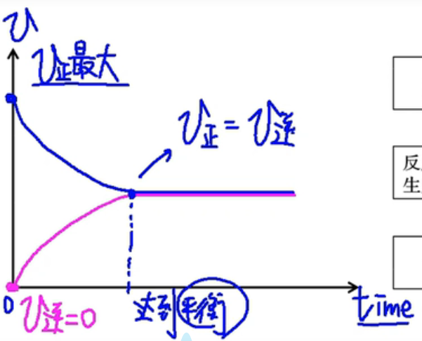

# 【化学】必修二：化学反应与能量

> 注：本文只含有新教材必修二化学反应与能量的部分，未涉及到选必一及后面更难更深的知识点。

## 化学反应与热能

### 吸热反应与放热反应

#### 概念及常见的放热/吸热反应

1. 概念：

   放热反应：释放热量的化学反应；

   吸热反应：吸收热量的化学反应。

2. 常见的放热反应：金属与水或酸的反应、燃烧反应、大多数化合反应、中和反应、缓慢氧化等；

3. 常见的吸热反应：

   氢氧化钡晶体与氯化铵的反应，盐酸与碳酸氢钠的反应、碳与二氧化碳在高温条件下反应，碳与水蒸气在高温条件下反应生成一氧化碳和氢气，大多数分解反应。

#### 放热反应

1. 实验操作：

   

2. 实验现象：

   - 看到有气泡产生；
   - 永寿触摸反应后的试管，手感到发烫；
   - 温度计指示溶液温度升高。

3. 实验结论：该反应放出热量。

#### 吸热反应

1. 实验操作：

   

2. 实验原理：$\ce{Ba(OH)2\cdot 8H2O + 2NH4Cl = 2NH3↑+BaCl2 + 10H2O}$

3. 实验现象：

   - 闻到**刺激性气味**；
   - 用手触摸杯壁下部，有冰凉的感觉；
   - 用手拿起烧杯，木片**粘结到烧杯的底部**；
   - 烧杯内反应物呈糊状。

4. 实验结论：该反应吸热。

### 化学反应的本质与特征

1. 本质：化学反应的过程，本质上是旧化学键断裂（吸热）和新化学键形成（放热）的过程。
2. 特征：
   - 物质变化：生成新物质，遵循质量守恒定律；
   - 能量变化：释放能量或吸收能量，遵循能量守恒定律；
3. 吸热反应与放热反应的本质：
   - 吸热反应：断键吸收能量 $>$ 成键放出能量；
   - 放热反应：断键吸收热量 $<$ 成键放出热量；

### 化学反应的能量变化图像

## 化学反应与电能

### 火力发电

我们日常使用的电能主要来自火力发电。

火力发电是通过化石燃料燃烧时发生的氧化还原反应，使化学能转化为热能，加热水使之气话为蒸气以推动蒸汽轮机，带动发电机发电。

火力发电是经过一系列能量转化过程。间接转化为电能。
$$
\ce{化学能 ->[燃料燃烧]热能 ->[蒸汽轮机]机械能 ->[发电机]电能}
$$
缺点：发电过程中能量有较多损耗；燃烧煤电等化石燃料会导致空气污染；

### 原电池相关的两种实验

【实验一】

1. 实验操作：

   

2. 实验原理：$\ce{Zn + H2SO4 = ZnSO4 + H2↑}$

3. 实验现象：铜片上：无明显现象；锌片上：锌片逐渐溶解，有气泡产生。

4. 实验结论：锌能与稀硫酸发生反应生成氢气，而铜不能。

【实验二】

1. 实验操作：

   

2. 实验现象：铜片上：有气泡产生；锌片上：锌片逐渐溶解；电流表：指针发生偏转。

3. 实验结论：锌与稀硫酸反应生成氢气，导线中有电流通过。

4. 拓展：若将锌跟铜分别放置到两个容器中，发电效率比上述装置更高。

5. 实验一没有实验二反应速率快，因为实验一中存在 $\ce{Zn^2+}$ 阻碍 $\ce{H+}$ 与电子结合，实验二中，电子直接通过外电路流入 $\ce{Cu}$ 片所在电极，更容易与 $\ce{H+}$ 结合。

### 原电池

1. 定义：利用氧化还原反应原理，将化学能转化为电能的装置；

2. 电极名称：

   - 负极：电子流出，发生氧化反应；
   - 正极：电子流入，发生还原反应。

3. 装置：

   

4. 构成条件：理论上，自发的氧化还原反应均可构成原电池。

   具体条件：

   - 具有活动性不同的两个电极（金属与金属或金属与能导电的非金属）；
   - 溶液：两电极均插入电解质溶液中；
   - 导线：两电极用导线相连，形成闭合回路。

5. 注意事项：电子是从负流向正。电流从正流向负。

### 化学电池

1. 概念：根据原电池原理，将化学能转变为电能的装置；
2. 分类：可分为一次电池、二次电池和燃料电池；
   - 一次电池：放电后不能再充点使其复原的电池（内部氧化还原反应无法逆向进行）；
   - 二次电池：又称为充电电池或蓄电池，放电后可以再充电，可以多次重复使用；
   - 燃料电池：利用燃料和氧化剂之间发生氧化还原反应，能连续地将燃料和氧化剂的化学能直接转化成电能的化学电池，如氢氧燃料电池，甲醇燃料电池。

#### 一次电池——锌锰干电池

1. 石墨棒：只导电不反应；氧化剂：二氧化锰
2. 在石墨周围填充 $\ce{NH4Cl、ZnCl2}$ 和淀粉糊作电解质，还填上 $\ce{MnO2}$ 和炭黑；
3. 将电解质氯化铵换成 $\ce{KOH}$ 就变成了碱性锌锰电池（电流较稳定）；
4. 干电池属于一次性电池，放电后不能再充电。

#### 二次电池——铅酸蓄电池

放电时所进行的氧化还原反应在充电时可以逆向进行，使生成物恢复原状，如此充、放电可以循环使用。

铅蓄电池是最常见的二次电池。（负极付钱（负铅））

电极反应式：

- 放电（负极）：$\ce{Pb - 2e- + SO4^2- = PbSO4}$
- 放电（正极）：$\ce{PbO2 + 2e- + SO4^2- +4H^+ = PbSO4 +2H2O}$

总方程式：$\ce{Pb + PbO2 + 2H2SO4 <=>[放电][充电] 2PbSO4 + 2H2O}$

放电过程：两极质量增加；电解液：$c(\ce{H2SO4})$ 减少；充电刚好相反。

**注意：由于硫酸铅是白色沉淀，所以负极上质量会增加而非减少。**

#### 燃料电池——氢氧燃料电池

将燃料（如氢气、甲烷、乙醇）和氧化剂（如氧气）具有清洁、安全、高效等特点。

|    种类    |             酸性             |             碱性             |
| :--------: | :--------------------------: | :--------------------------: |
| 负极反应式 |    $\ce{H2 - 2e- = 2H+}$     | $\ce{H2 - 2e- +2OH- = 2H2O}$ |
| 正极反应式 | $\ce{O2 + 4e- + 4H+ = 2H2O}$ | $\ce{O2 +4 e- +2H2O = 4OH-}$ |

电池总反应式：$\ce{2H2 + O2 = 2H2O}$

### 原电池电极反应式的书写

#### 书写步骤

1. 负极：$\ce{物质-?e- -> 新的物质}$；

   正极：$\ce{物质 + ?e- -> 新的物质}$。

   根据化合价变化确定得失电子数。

   例如：常见情况是，碳在酸性条件下变 $\ce{CO2}$，碱性条件下变 $\ce{CO3-}$。

2. 调平电荷：$\ce{H+/OH-/CO3^2-/O2-/Li+\cdots}$

3. 看 $\ce{H}$ 补水，用 $\ce{O}$ 检查；看 $\ce{C}$ 补 $\ce{C}$；看 $\ce{N}$ 补 $\ce{N}$。

#### 甲烷燃料电池

【酸性水溶液】

负极：$\ce{CH4 - 8e- +2H2O = CO2 +8H+}$

正极：$\ce{O2 + 4e- + 4H+ = 2H2O}$

总反应式：$\ce{CH4 + 2O2 = CO2 + 2H2O}$

【$\ce{NaOH}$ 水溶液】

负极：$\ce{CH4 - 8e- +10OH-= CO3^2- + 7H2O}$

正极：$\ce{O2 + 4e- +2H2O = 4OH-}$

总反应式：$\ce{CH4 + 2O2 + 2NaOH = Na2CO3 + 3H2O}$

【判断原电池电极的方式】阳离子往正极移动，阴离子往负极移动。

#### 非水溶液电解质

某种熔融碳酸盐燃料电池（说明需要用 $\ce{CO3^2-}$ 调平电荷）以 $\ce{Li2CO3、K2CO3}$ 为电解质，以 $\ce{CH4}$ 为燃料，工作原理如图所示：

负极：$\ce{CH4 - 8e- + 4CO3^2- = 5CO2 + 2H2O}$

正极：$\ce{O2 + 4e- + CO2 = 2CO3^2-}$

负极：$\ce{2NO2 - 2e- +2NO3- = 2N2O5}$

正极：$\ce{O2 + 4e- + 2N2O5 = 4NO3-}$

#### 锂离子电池

放电时电池总反应为 $\ce{Li_{1-x} CoO2 + Li_xC6 = LiCoO2 + C6(x<1)}$

注意：$\ce{Li_xC6}$ 只能视为锂单质镶嵌在 $\ce{C6}$ 围成的空隙里，不是化合物。

负极：$\ce{xLiC6 - }x\ce{e- = xLi+ +C6}$

负极逆反应：$x\ce{e- + xLi+ +C6 = Li_xC6}$

正极=总 - 负极 = 总 + 负极逆反应，即：

$\ce{Li_{1-x}CoO2 + xLi+ +}x\ce{e- = LiCoO2}$

## 化学反应速率

### 含义与表示方法

1. 定义：化学反应速率是用来衡量化学反应进行快慢程度的物理量。

2. 表示方法：通常用单位时间内反应物浓度的减少量或生成物浓度的增加量（均区正值）来表示。

3. 计算公式与单位：$v=\dfrac{\Delta c}{\Delta t}$，单位：$\ce{mol\cdot L^{-1}\cdot S^{-1}}$ 或 $\ce{mol\cdot L^{-1}\cdot min^{-1}}$；
4. 固体、纯液体的浓度视为定制（在一定温度下），不因其质量或物质的量的增减而变化，所以**不能用固体和纯液体的浓度变化表示反应速率**。

### 换算与比较

1. 对于同一反应而言，用不同物质来表示该反应的速率时，其数值可能不同，但表达的意义是相同的。因此，表示化学反应的速率时，必须指明是用反应体系中的哪种物质作标准。

2. 在同一反应中用不同的物质来表示反应速率时，其数值之比等于各物质的化学计量数之比。

   例如化学反应 $\ce{mA(g) + nB(g) <=> pC(g) + qD(g)}$ 的速率关系为：

   $v_A:v_B:v_c:v_d = m:n:p:q$ 或 $\dfrac{v_A}{m}=\dfrac{v_B}{n}=\dfrac{v_c}{p}=\dfrac{v_d}{q}$。

3. 速率单位的换算：$\ce{1mol\cdot L^{-1}\cdot s^{-1}}=\ce{60mol\cdot L^{-1}\cdot {min^{-1}}}$

### 影响反应速率的因素

#### 温度

#### 反应物浓度

#### 催化剂

**注意：催化剂对反应速率的影响 $>$ 温度和反应物浓度。**

#### 固体反应物表面积

在其它条件相同时，增大固体反应物的表面积（如从块状变成粉末状），反应速率增大；减小反应物表面积，反应速率减小。如图中产生气泡的快慢：甲 $<$ 乙。

#### 压强

**对于有气体参加的反应（对于只有固体/液体参加的反应几乎无影响）**：改变压强对反应速率的影响实质是改变体积，使反应物的浓度改变。

1. 压缩体积或充入气态反应物，使压强增大，加快化学反应速率。

2. 充入非反应气体（无关气体如稀有气体）：

   - 恒温恒容：压强增大，但各物质的浓度不变，所以反应速率不变；
   - 恒温恒压（透过改变容器体积来维持恒压）：压强不变，体积增大，各物质浓度减小，反应速率减慢。

   注意：反应物的浓度等于反应物的物质的量除以**容器**体积，而非**气体**体积。

## 化学反应的限度

### 可逆反应

1. 定义：在相同条件下能向正反应方向进行同时又能向你反应方向进行的反应；

   在可逆反应的化学方程式中用“$\ce{<=>}$”代替“$\ce{=}$”。

2. 特征：

   - 双向性：分为方向相反的两个反应（正逆反应）；
   - 双同性：指正、逆反应是同一条件下、同时进行的；
   - 共存性：指反应物的转化率小于 $100\%$，反应物与生成物共存。

3. 可逆反应不能进行到底，**存在一定的化学反应限度**。

### 化学平衡的建立过程

### 化学平衡状态

如果外界条件（温度、浓度、压强等）不发生改变，当可逆反应进行到一定程度时，正反应速率与逆反应速率相等，反应物与生成物的浓度不再改变，达到一种表面静止的状态，称为“化学平衡状态”，简称化学平衡。

判断：

1. 定义：$v_正=v_逆$；

2. 变量不变，即达平衡。

   特定条件的标志：

   【恒温恒容】

   - 气体体积前后改变：压强不变可作为平衡标志；
   - 气体体积前后不变：压强不变不可作为平衡标志；
   - 有非气体物质参加：气体密度不变是可作为平衡标志；

   【恒温恒压】

   气体体积前后改变：气体密度不变是平衡标志。

### 化学反应条件的控制

1. 意义：

   - 促进有利反应：提高反应物的转化率即原料的利用率，加快反应速率等；
   - 抑制有害反应：减缓反应速率，减少甚至消除有害物质的产生，控制副反应的发生等。

2. 方法：

   - 改变化学反应速率；
   - 改变可逆反应的限度。

3. 例子：

   【合成氨工业反应条件的控制】

   合成氨的生产在温度较低时，氨的产率较高；压强越大，氨的产率越高。

   但温度低，反应速率小，生产成本高，工业上通常选择 $400\sim 500\mathrm{℃}$；

   压强越大，对动力和生产设备要求越高，采用的压强通常为 $10\sim 30\mathrm{MPa}$。

   【煤燃烧反应条件的控制】

   - 将固体煤粉碎以增大接触面积，同时空气适当过量，以提高转化率；
   - 炉膛材料尽量选择保温性能较好的，烟道废气中的任亮用来加热水、发电等，以提高热量利用率。

   
