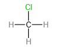

# 【化学】必修二：有机化合物

## 烃的概念和分类

1. 概念：只含碳、氢两种元素的有机化合物，也称为烃类。

2. 分类：

   - 根据**碳原子间成键方式**的不同。

     > 碳原子的成键类型：
     >
     > 1. 单键：两个碳原子共用一对电子，形成碳碳单键，即;
     > 2. 双键：两个碳原子共用两对电子，形成碳碳双键，即 ；
     > 3. 三键：两个碳原子共用三对电子，形成碳碳三键，即 。

     

     饱和烃：全部都是 $\ce{C-C}$ 单键，不能再增加碳原子。
   
     不饱和烃：不全为 $\ce{C-C}$ 单键，可以再增加碳原子。
   
   - 根据**碳骨架**的不同。
   
     

## 甲烷

最简单的有机化合物，分子中的碳原子以最外层的 $4$ 个电子与 $4$ 个氢原子的电子形成 $4$ 个 $\ce{C-H}$ 共价键，电子式:结构式：。

### 物理性质

无色无味气体，密度比空气小，极难溶于水。

### 化学性质

通常情况下，甲烷性质比较稳定，与强酸、强碱、强氧化剂都不反应。

但在特定的条件下，甲烷也会发生某些反应。

- 氧化反应：

  甲烷在空气中燃烧：$\ce{CH4 + 2O2 ->[点燃] CO2 + 2H2O}$。

  现象：安静地燃烧，火焰呈淡蓝色。

- 甲烷与 $\ce{Cl2}$ 的取代反应：

  

  【实验现象】

  A 装置：试管内气体颜色逐渐变浅，试管壁出现油状液滴，试管中有少量白雾，试管内液面上升，水槽中有固体析出。

  B 装置：无明显现象。

  【实验结论】
  $$
  \ce{CH4 + Cl2 ->[光照] CH3Cl + HCl}\\
  \ce{CH3Cl + Cl2 ->[光照] CH2Cl2 + HCl}\\
  \ce{CH2Cl2 + Cl2 ->[光照] CHCl3 + HCl}\\
  \ce{CHCl3 + Cl2 ->[光照] CCl4 + HCl}
  $$
  说明：

  1. 反应一相当于甲烷中的一个氢原子被氯原子替换掉，最终变成一氯甲烷和氯化氢。
  2. 取代反应特点：有进有出，产物混合。
  3. 数量关系：$\ce{1mol~CH4}$ 需要 $\ce{4mol~Cl2}$ 才能被完全取代变成 $\ce{1mol~CCl4}$。每取代 $\ce{1mol}$ 氯原子，消耗 $\ce{1mol~Cl2}$，生成 $\ce{1mol~HCl}$。
  4. 生成物中，$\ce{CH3Cl}$ 在常温常压和标准情况下都是气体，其它均不是气体。$\ce{CHCl3}$ 俗名叫氯仿。
  5. 甲烷与氯气反应生成四种有机物和一种无机物氯化氢。反应后，物质的量最多的是 $\ce{HCl}$。氯化氢极易溶于水，所以会让 A 装置中液面上升。除一氯甲烷外，其它有机物均为液体，所以试管壁出现的油状液滴就是 $\ce{CH2Cl2,CHCl3,CCl4}$ 的混合物。
  6. 连锁反应：甲烷中的氢原子被氯原子逐步取代，各步反应同时进行，即第一步反应一旦开始，后续反应立即进行。

## 烷烃

### 命名

|        碳原子数        |                           命名方法                           |                实例                 |
| :--------------------: | :----------------------------------------------------------: | :---------------------------------: |
| $1\le N(\ce{C})\le 10$ | 以甲、乙、丙、丁、戊、己、庚、辛、壬、癸依次表示碳原子数，后面加“烷”称为“某烷”。 | $\ce{C3H8}$ 丙烷，$\ce{C6H14}$ 己烷 |
|     $N(\ce{C})>10$     |        用中文数字表示碳原子数，后面加“烷”称为”某烷“。        |        $\ce{C17H36}$ 十七烷         |

### 结构简式

1. 含义：为了书写方便，有机物通常用结构简式表示，如正十一烷的结构简式为 $\ce{CH3(CH2)9CH3}$。
2. 书写方法：
   - 省略 $\ce{C-H}$ 键，把同一碳原子上的 $\ce{H}$ 合并；
   - 在上述基础上省略横向碳链上的 $\ce{C-C}$ 键中的“$\ce{-}$”（注意只省略单键不省略双键和三键）。
   - 在上述基础上将支链并入横向碳链中；
   - 在上述基础上，合并相同的原子团。

### 物理性质

1. 熔沸点：较低，递变性：随着分子中碳原子数增加，逐渐升高。**注意：烷烃的同分异构体中，支链越多，沸点越低。**
2. 密度：密度比水小（是烃则轻，液态烃与水形成分层），递变性：随着分子中碳原子数的增加，逐渐增大。
3. 状态：气态（甲烷、乙烷、丁烷）$\to$ 液态（$5\sim 12$ 个碳）$\to$ 固态，常温常压下，分子中碳原子数 $n\le 4$ 的烷烃为气态（常温常压下，新戊烷为气态）。
4. 溶解性：难溶于水，易溶于汽油等有机溶剂。

### 化学性质

1. 通常较稳定，不能被酸性高锰酸钾等强氧化剂氧化，也不能与强酸、强碱发生反应。

2. 完全燃烧的通式：
   $$
   \ce{C_nH_{2n+2}(链状烷烃) + \dfrac{3n+1}{2}O2 ->[点燃] n CO2 + ($n$ + 1)H2O}
   $$

3. 在光照条件下，烷烃与 $\ce{Cl2、Br2}$ 等卤素单质的气体发生取代反应。

   生成多种卤代产物和相应的卤化氢气体。

   烷烃与卤素单质发生一卤代反应的通式为：
   $$
   \ce{C_nH_{2n+2} + X2 ->[光照] C_nH_{2n+1}X + HX}
   $$
   **注意：烷烃虽然可以跟溴单质发生取代反应，但不能跟溴水中的溴发生反应，因为其中含有的溴太少。**

4. 有关烃类燃烧的计算：

   假设某烃类化学式是 $\ce{C_xH_y}$，则 $\ce{1mol}$ 该烃中， 有 $x~\ce{mol~C}$ 原子和 $y~\ce{mol~H}$ 原子，由于烃类完全燃烧的产物只有 $\ce{CO2}$ 和 $\ce{H2O}$，相当于每个碳原子结合了两个氧原子，每两个氢原子共同结合一个氧原子，所以反应的总方程式为：
   $$
   \ce{C_xH_y +}\begin{pmatrix}x+\dfrac{y}{4}\end{pmatrix}\ce{O2 ->[点燃] x CO2 + \dfrac{y}{2} H2O}
   $$
   所以比较等物质的量烃类燃烧的耗氧量需要比较 $x+\dfrac{y}{4}$ 的大小，也相当于比较碳原子个数的大小。

   根据计算可知，若比较等质量的烃类燃烧耗氧量，需要比较 $\dfrac{y}{x}$ 的大小，$\dfrac y x$ 越大，耗氧量越大。

   若题目中要求具体的 $x$ 和 $y$，可以根据题目找到等量关系列方程求解。

## 同分异构体

1. 概念：化合物具有相同的分子式，但具有不同结构的现象称为**同分异构现象**，具有同分异构现象的化合物互称为**同分异构体**。

2. 分类：碳链异构（如 $\ce{C5H12}$ 碳的三种排列方式），位置异构（所含取代基或官能团位置不同），官能团异构（官能团不同，如 $\ce{C2H6O}$ 官能团不同时可以形成乙醇或甲醛等不同物质）。

3. 易错点：和不互为同分异构体，他们是同一种物质。因为甲烷是正四面体结构，他们的取代物中，不同于碳原子的其它原子位置等效。

   

   上三幅图是同一种物质，因为他们可以一笔画且无分支。

   

   上两幅图也互为同分异构体。

### 直链烷烃（$\ce{C_nH_{2n+2}}$）的同分异构体

| $n$ 值 |  1   |  2   |  3   |  4   |  5   |  6   |  7   |
| :----: | :--: | :--: | :--: | :--: | :--: | :--: | :--: |
| 异构数 |  1   |  1   |  1   |  2   |  3   |  5   |  9   |

【$\ce{C4H10}$】

【$\ce{C5H12}$】

【$\ce{C6H14}$】

> 注：上图第四幅图是 $2,2-$ 二甲基丁烷，第五幅图是 $2,3-$ 二甲基丁烷，图有误。

定义主碳链 $\ce{C}$ 个数最多的链。

书写方式可以首先考虑以主碳链上碳的个数分类，如上图中正己烷主碳链 $6$ 个碳，$2-$ 甲基戊烷和 $3-$ 甲基戊烷主碳链 $5$ 个碳……

然后对于主碳链上 $<n$ 个碳，首尾碳上不能再加碳，以主链中心为对称轴，只在左边摆碳。

且要满足：**辅助链上增加碳后总碳数不能超过主碳链。 **

【$\ce{C7H16}$】

注意同分异构体的命名方法：碳的位置 $-$ 碳的个数 $+$ 甲基个数 $+$ 乙基个数 $+\cdots + $ $x$ 烷。

### 烷基（$\ce{-C_nH_{2n+1}}$）的同分异构体

| $n$ 值 | $1(\ce{-CH3})$ | $2(\ce{-C2H5})$ | $3(\ce{-C3H7})$ | $4(\ce{-C4H9})$ | $5(\ce{-C5H11})$ |
| :----: | :------------: | :-------------: | :-------------: | :-------------: | :--------------: |
| 异构数 |       1        |        1        |        2        |        4        |        8         |

链状烷烃的一卤代物异构数 $=$ 烷基的异构数。

### 链状烷烃的二卤代物 同分异构体

可以转化为对应 $\ce{C_nH_{2n}}$ 的同分异构体，然后考虑剩下的两个元素的位置，分类讨论然后加起来计算。

例如：求分子式为 $\ce{C4H8BrCl}$ 的有机物的同分异构体，可以先分为正丁烷和异丁烷，然后分别考虑溴的位置，然后再求出对应的氯的位置有几种情况最后相加。

需要注意的是当剩余的两个元素相同时，需要再之后讨论时，排除与之前相同的位置。

## 同系物

### 定义

结构相似，在分子组成上相差一个或若干个 $\ce{CH2}$ 原子团的化合物互称为同系物。如 $\ce{CH3CH3、CH3CH2CH3、CH3CH2CH2CH3}$ 互为同系物。

### 结构特点

1. 结构相似：主要看组成元素、碳原子成键类型、碳链的结构；
1. 分子组成通式相同：同系物一定具有相同的分子组成通式，但是具有相同分子组成通式的物质不一定互为同系物；
1. 分子组成相差一个或多个 $\ce{CH2}$ 原子团：同系物一定在分子组成上相差一个或多个 $\ce{CH2}$ 原子团，但是分子组成相差一个或多个 $\ce{CH2}$ 原子团的物质不一定互为同系物。

## 乙烯

### 分子组成与结构

1. 分子式：$\ce{C2H4}$；
2. 电子式：；
3. 结构式：；乙烯的官能团：碳碳双键。
4. 结构简式：$\ce{CH2 = CH2}$；
5. 球棍模型：；
6. 空间充填模型：。

从球棍模型/空间充填模型可以看出，乙烯的留个院子共平面。

### 物理性质

无色、稍有气味的气体，难溶于水，密度比空气略小。可以作为植物生长的调节剂 ，促进植物生长。

### 化学性质

由于乙烯的官能团【碳碳双键】中的一个键（$\ce{\pi}$ 键）易断裂，因而乙烯的性质比较活泼，能发生加成、加聚和氧化反应（加加氧），能使溴水和酸性高锰酸钾溶液褪色。（能被酸性高锰酸钾溶液氧化，说明有机物中含有碳碳不饱和键。）

1. 氧化反应：
   $$
   \ce{CH2 = CH2  + 3O2 ->[点燃] 2CO2 +2H2O}
   $$
   实验现象：火焰明亮，伴有黑烟。

   注意：可以用燃烧鉴别甲烷和乙烯。

   除此之外，乙烯遇到高锰酸钾会最终被氧化成 $\ce{CO2}$，使得酸性高锰酸钾褪色。

2. 加成反应：

   乙烯的 $\pi$ 键容易断裂，当该键断裂时，碳可以接其它原子，乙烯从不饱和的碳碳双键变成饱和的碳碳单键的过程就是加成反应。

   定义：有机物分子中的不饱和碳原子与其他原子或原子团直接结合生成新的化合物的反应。
   $$
   \ce{CH2 = CH2 + H2 ->[催化剂][\Delta] CH3 - CH3(乙烷)}\\
   \ce{CH2 = CH2 + Br2 -> CH2Br - CH2Br(1,2- 二溴乙烷)}\\
   \ce{CH2 = CH2 + HCl ->[催化剂][\Delta] CH3CH2Cl(氯乙烷)}\\
   \ce{CH2 = CH2 + H2O ->[加热加压][催化剂] CH3 - CH2OH(乙醇)}
   $$
   说明：

   - 乙烯可以和氢气，卤素单质，氯化氢等发生取代反应。

   - 乙烯和氢气、氯化氢、水在常温下都不能反应，必须要在加热&催化剂的条件下才能反应。

   - 加成反应特性：只进不出，产物单一。（与取代反应对比）

   - 当乙烯通入溴的四氯化碳中，溶液褪色，溶液不分层，可以说明 $1,2-$ 二溴乙烷溶于四氯化碳；若通入到水中，溶液依然褪色，但溶液不分层，因为 $1,2-$ 二溴乙烷不溶于水。

   - 当 $\ce{C2H6}$ 中混入 $\ce{C2H4}$ 杂质：

     不能加入酸性高锰酸钾溶液，因为会引入新的杂质 $\ce{CO2}$；

     也不能用 $\ce{H2}$，因为气体杂质不能用气体除杂试剂，因为无法控制量；

     应该使用溴水进行洗气。最好不要使用溴的四氯化碳，因为四氯化碳是有机溶剂，会损耗/溶解一些乙烷。

   - 如果要制备氯乙烷：可以通过加成反应，最好不要通过乙烷的取代反应生成混合物，获得的不只是氯乙烷。

   - 上述反应四同样也是工业制备乙醇的一种方式。

   - 若已知一种烯烃与氢气发生加成反应后产物的结构式，要求烯烃可能得结构有几种：根据加成反应的特点，只要产物中一个位置上既有 $\ce{H}$ 原子，又有 $\ce{C}$ 原子，那么这个位置就有可能发生过碳键断裂。所以问题转化为**找图中有多少个碳碳单键端点上同时包含 $\ce{H}$ 原子和 $\ce{C}$ 原子**。

3. 加成聚合反应：

   多个乙烯小分子中碳碳双键的 $\ce{\pi}$ 键断裂后，断裂后的电子结合后发生加成聚合反应生成碳碳单键。

   所以加成聚合反应的条件之一是必须要有碳碳双键/碳碳三键。

   $\ce{n CH2 = CH2(乙烯单体) ->[催化剂] }$ (聚乙烯)

   其中聚乙烯重复的单元 $\ce{CH2 - CH2}$ 叫做链节；$n$ 叫做聚合度。

   形成的聚乙烯已经没有碳碳双键，所以不能使酸性高锰酸钾溶液褪色。
   
   **注意：乙烯容易发生加成聚合反应形成聚乙烯，但是聚乙烯因为碳碳单键很稳定，很难再讲解变成乙烯。**
   
   相同质量的乙烯和聚乙烯完全燃烧，因为碳、氢质量比相等，但由于聚乙烯是固体，乙烯是气体，故消耗 $\ce{O2}$ 的量相同，但乙烯燃烧更决剧烈。
   
   聚乙烯由于是高分子，是混合物，所以没有固定的熔点和沸点。

## 有机高分子材料

1. 分类（根据来源不同）：

   - 天然有机高分子材料：如棉花、羊毛、天然橡胶等；
   - 合成有机高分子材料：如塑料、合成纤维、合成橡胶、粘合剂、涂料等。

   **注意：同一种高分子中的分子链所含的链节数目并不相同，所以高分子实质上是由许多链节相同而聚合度不同的分子所组成的混合物。**

2. 三大合成高分子材料：塑料、橡胶和纤维。

   特性：名字都是聚xxx，xxx树脂，xxx纶。

   - 塑料：

     主要成分：合成树脂，还可以根据需要加入一些具有特定作用的添加剂。

     

     说明：

     1. 丙烯的结构简式：$\ce{CH2 = CH - CH3}$。丙烯上由于含有甲基，具有类似甲烷的四面体结构，所以其所有原子不可能在同一个平面上。

     2. 生成聚丙烯的方程式：

        $n$  $\ce{->[催化剂]}$

     3. 用途：

        

        除此之外，聚丙烯还可以作为口罩的熔喷布；聚乙烯在自然界中很难讲解，容易导致“白色污染”。

   - 橡胶：

     1. 主要成分：聚异戊二烯，结构简式；

        其单体（异戊二烯）：；

     2. 硫化橡胶：工业上用硫与橡胶作用进行硫化，使线型的高分子链之间通过硫原子形成化学键，产生交联，形成网状结构，从而提高强度，韧性，和化学稳定性；

     3. 常见合成橡胶有丁苯橡胶，顺丁橡胶，氯丁橡胶，还有耐酸碱腐蚀的氟橡胶、耐高温和严寒的硅橡胶等特种橡胶；

     4. 主要用途：制轮胎，在航空航天国防也有广泛应用。

   - 纤维：

     

     1. 天然纤维又分为植物纤维和动物纤维，植物纤维主要成分是纤维素，如：棉麻布纸，燃烧无色无味；动物纤维主要成分是蛋白质，如毛皮羽丝，燃烧有刺激性气味。
     2. 常见的合成纤维：聚丙烯纤维（丙纶）；聚氯乙烯纤维（氯纶）；聚丙烯腈纤维（腈纶）；聚对苯
        二甲酸乙二酯纤维（涤纶）;和聚酰胺纤维（锦纶、芳纶）等。
     3. 合成纤维性能：强度高、弹性好、耐磨、耐化学腐蚀、不易虫蛀等。
     4. 主要用途：制衣料、绳索、渔网等，广泛应用于工农业领域。

## 乙醇

### 烃的衍生物

1. 定义：烃分子中氢原子被其他原子或原子团所取代而生成的一系列化合物称为烃的衍生物。
2. 常见烃的衍生物：
   - 乙醇：可以看做是乙烷分子（$\ce{C2H6}$）中的一个氢原子被羟基取代后形成的化合物；
   - 卤代烃：如 $\ce{CH3Cl、CH2Cl2、BrCH2CH2Br}$ 等，可以看成是烷烃分子中的一个或几个氢原子被卤素原子取代后形成的化合物。
3. 性质
   - 不同于母体化合物，如 $\ce{CH4}$ 与 $\ce{CCl4}$ 性质明显不同。
   - 主要取决于取代基团的性质，如 $\ce{CH3CH2OH}$ 与 $\ce{CH3CH3}$ 的性质不同，主要是 $\ce{-OH}$ 与 $\ce{-H}$ 性质不同。

### 官能团

决定有机化合物特性（包括化学特性与物理特性）的原子或原子团叫做官能团。例如，碳碳双键和碳碳三键分别是烯烃和炔烃的官能团。

### 分子组成与结构

|    分子式    |     官能团      |                            结构式                            |        结构简式        |                           球棍模型                           |
| :----------: | :-------------: | :----------------------------------------------------------: | :--------------------: | :----------------------------------------------------------: |
| $\ce{C2H6O}$ | $\ce{-OH}$ 羟基 |  | $\ce{CH3CH2OH/C2H5OH}$ |  |

**注意：$\ce{C2H6O}$ 还可以写出结构简式 $\ce{CH3OCH3}$，即 $\ce{C2H6O}$ 有两种同分异构体。**

### 物理性质

说明：

1. 能够与水任意比例互溶的原因，是因为乙醇可以与水形成氢键；
2. 沸点小于水，可以作为一些固体的干燥剂；
3. 可以通过蒸馏的方法，来提高乙醇的浓度（与水沸点不同）；

### 化学性质

1. 与钠反应：

   

   【实验现象】

   无水乙醇中放入金属钠后，试管中有气泡产生，放出的气体可在空气中安静地燃烧，火焰呈淡蓝色；烧杯壁上有水珠生成，迅速倒转烧杯后向其中加入澄清石灰水，石灰水未变浑浊。

   【乙醇与钠反应的化学方程式（置换反应）】
   $$
   \ce{2C2H5OH + 2Na -> 2C2H5ONa +H2 ^}
   $$
   【说明】

   - 选用无水乙醇的原因：水本身可以与钠发生反应。
   - 学到的火焰呈现淡蓝色的气体：$\ce{H2,CO,CH4}$，烧杯壁上有水珠生成排除 $\ce{CO}$，迅速倒转烧杯后将其中加入澄清石灰水，未变浑浊说明无 $\ce{CO2}$ 生成，所以生成气体是氢气。
   - 由于钠的还原性很强，所以可以还原乙醇中的氢。
   - 含有 $\ce{-OH}$ 的有机物都能与 $\ce{Na}$ 发生反应，如 $\ce{CH3OH}$（甲醇），（乙二醇) 等，$\ce{1mol ~-OH\sim\dfrac{1}{2}mol~H2}$，该关系式常用于确定有机物分子中 $\ce{-OH}$ 的个数。
   - $\ce{C2H5OH}$ 的同分异构体 $\ce{CH3-O-CH3}$ 不能跟钠发生化学反应。

   【水、乙醇中的羟基氢原子的活泼性比较】

   |          |                          水与钠反应                          |                         乙醇与钠反应                         |
   | :------: | :----------------------------------------------------------: | :----------------------------------------------------------: |
   | 钠的变化 |  钠粒浮于水面，熔成闪亮的小球， 并快速地四处游动，很快消失   |           钠粒沉于试管底部，未熔化， 最终慢慢消失            |
   | 声的现象 |                         有“嘶嘶”声响                         |                            无声响                            |
   | 实验结论 | 钠的密度小于水，熔点低。钠与水剧烈反应，生成氢气。**水分子中 $\ce{-OH}$ 上的氢原子比较活泼** | 钠的密度比乙醇的大。钠与乙醇反应较慢，生成氢气。**乙醇中羟基上的氢原子不如 $\ce{H2O}$ 中的活泼** |
   | 定量关系 |        $\ce{2Na + 2H2O = 2NaOH + H2 ^$$2Na\sim H2 ^}$        | $\ce{2C2H5OH + 2Na -> 2C2H5ONa +H2 ^$ $2Na\sim 2C2H5OH \sim H2 ^}$ |
   | 反应实质 |                      水中的氢原子被置换                      |                乙醇分子中羟基上的氢原子被置换                |

   水中羟基之所以和乙醇中中羟基活泼性不同，是因为与水中羟基相连的是氢原子，乙醇中与羟基相连的是乙基（$\ce{-CH2CH3}$），因此羟基活泼性不同的原因是分子中与羟基相连的原子或原子团不同。

2. 氧化反应：

   - 燃烧反应：
     $$
     \ce{C2H5OH + 3O2 ->[点燃] 2CO2 + 3H2O}
     $$

   - 催化氧化反应：

     

     【实验现象】

     红色光亮的铜丝灼烧后又变为黑色，趁热插入乙醇中，铜丝又变成红色。

     重复几次实验后，闻到试管中的液体有刺激性气味。

     【反应方程式】

     分步：
     $$
     \ce{2Cu + O2 \xlongequal{\Delta} 2CuO}\\
     \ce{CuO + C2H5OH ->[\Delta] CH3CHO(乙醛) + Cu + H2O}
     $$
     总反应方程式：
     $$
     \ce{2C2H5OH + O2 ->[Cu][\Delta] 2CH3CHO + 2H2O}
     $$
     【说明】

     - $\ce{CHO}$ 是醛基，$\ce{CH3CHO}$ 是乙醛，常温下是有刺激性气味的无色气体。
     - 对于第二步反应，在反应时会有一个 $\ce{C-H}$ 键和一个 $\ce{H-O}$ 键断裂，其中第二个碳上的一个氢和跟氧相连的氢会与氧结合变成水，自身变成，形成醛基。
     - 在有机反应中，如果加氧/去氢说明一般是氧化反应，相当于碳氧单键边碳氧双键，化合价升高，碳氢单键失去，碳的化合价升高；如果是去氧/加氢一般是还原反应。
     
   - 与强氧化剂反应：

     【乙醇的连续氧化】
     $$
     \ce{C2H5OH ->[Cu/Ag、\Delta、O2] CH3CHO ->[Cu/Ag、\Delta、O2]CH3COOH}\\
     \ce{C2H5OH ->[KMnO4(H+),K2Cr2O7(H+)] CH3COOH}
     $$
     乙醇遇到铜或银，在加热和有氧气的条件下会被连续氧化成乙醛然后被氧化成乙酸；

     遇到紫色的酸性高锰酸钾溶液或橙色的酸性重铬酸钾溶液会直接被一步被氧化成乙酸。

     乙醇可以使得酸性高锰酸钾溶液褪色，变成接近无色的二氧化锰；也可以使得酸性重铬酸钾变色，变成绿色的 $\ce{Cr^3+}$（所以重铬酸钾可以作为酒驾测试的仪器）。

### 用途

1. 乙醇可以作燃料；
2. 是重要的化工原料和溶剂，可以作为萃取剂；
3. 医疗上用体积分数为 $\ce{75\%}$ 的乙醇溶液作消毒剂（并不是利用乙醇的强氧化性，与次氯酸钠不同，而是浸入细菌内部，使其蛋白质失去活性）。**注意：并不是说乙醇浓度越大，杀菌效果越好**。

### 无色乙醇的制备

新煅烧的 $\ce{CaO}$ 置于 $95\%$ 的乙醇中，使酒精中的水喝氢氧化钙反应生成不挥发的氢氧化钙来出去水分，再蒸馏，可得无水乙醇（并非完全无水，质量分数为 $99.5\%$）。

## 乙酸

### 分子组成与结构

|    分子式     |                            官能团                            |                            结构式                            |    结构简式    |                           球棍模型                           |
| :-----------: | :----------------------------------------------------------: | :----------------------------------------------------------: | :------------: | :----------------------------------------------------------: |
| $\ce{C2H4O2}$ | $\ce{-COOH}$ 或羧基 |  | $\ce{CH3COOH}$ |  |

### 物理性质

是一种有强烈的刺激性气味的无色液体，易溶于水和乙醇。当温度低于熔点时（$\ce{16.6\mathrm{℃}}$），会凝结成类似冰一样的晶体，所以纯净的乙酸又叫冰醋酸。

### 化学性质

1. 电离方程式：
   $$
   \ce{CH3COOH <=> CH3COO- + H+ }
   $$
   可以使得紫色石蕊溶液变红。

   推断题：可以使得指示剂变色的先想到羧基。

2. 与碱（如氢氧化钠）发生中和反应：
   $$
   \ce{CH3COOH + OH- → CH3COO- + H2O
   }
   $$

3. 与碳酸钠/碳酸氢钠反应：
   $$
   \ce{Na2CO3 ->[-COOH] NaHCO3 ->[-COOH] CO2 ^}\\
   \ce{NaHCO3 ->[-COOH] CO2 ^}
   $$
   推断题：能够与碳酸钠/碳酸氢钠反应且生成二氧化碳的一般都是羧基。

4. 与活泼金属反应：
   $$
   \ce{Zn ->[-COOH] H2 ^}\\
   \ce{Na ->[-COOh] H2 ^}
   $$
   推断题：与锌/铁等反应产生氢气的是羧基，与钠反应产生氢气的还有羟基。

5. 酯化反应：

   【定义】

   醇与羧酸在浓硫酸的催化加热下，转化为另一种有机物酯和水的反应。

   【特点】

   - 酯化反应一般很慢，需要加热，并加入浓硫酸等催化剂，提高反应速率。
   - 可逆反应，乙酸乙酯会与水发生水解反应生成乙酸和乙酯。
   - 酯化反应也是取代反应。

   【反应装置】

   

   【反应方程式】
   $$
   \ce{CH3COOH + C2H5OH <=>[浓硫酸][\Delta] CH3COOC2H5(乙酸乙酯) + H2O}
   $$
   【说明】

   - A 酸 $+$ B 醇 得到 A 酸 B 酯。

   - 乙酸乙酯具有香味。

   - 用酒精灯加热的目的：加快反应速率；将生成的乙酸乙酯及时蒸出，有利于乙酸乙酯的生成。

   - 用小火均匀加热的目的：减少反应物的挥发，增大产率。

   - 反应的大试管倾斜 $45°$：增大受热面积。

   - 在加热前加入碎瓷片的目的：为了防止暴沸。

   - 浓硫酸的密度大于乙酸和乙醇的密度 ，而且混合时会放出大量的热，为了防止暴沸，实验中先加入乙醇，然后边振荡试管边缓慢的加入浓硫酸和乙酸。如果先加入浓硫酸，由于乙醇密度小于浓硫酸所以在上层，然后沸点低会导致暴沸，液体会溅出。同时由于乙酸浓度较大，所以后加入反应更充分。

   - 当观察到试管中油状液滴不再增多或有大量油状液体出现时，可认为反应完成。

   - 导管末端不能深入饱和 $\ce{Na2CO3}$ 溶液中，防止实验产生倒吸现象。

     浓硫酸在反应中起到催化剂和吸水剂的作用。

   - 饱和碳酸钠溶液在实验中的作用为：

     - 吸收挥发出来的乙酸；
     - 溶解挥发出来的乙醇；
     - 降低乙酸乙醇的溶解度，有利于液体分层，便于观察。
     
   - 可以使用分液漏斗分层，其中水在下层，酯液在上层，水从下面出，酯从分液漏斗上面出。下先出上后出。

   - 用含示踪原子 $\ce{^{18}O}$ 的乙醇参与反应，生成的产物中，只有乙酸乙酯中含有 $\ce{^{18}O}$，反应原理如下：

     

     反应中，乙酸断裂的是 $\ce{C-O}$ 单键，乙醇断裂的是 $\ce{O-H}$ 单键。即**酸脱羟基醇脱氢**。

   - 目前学过的有机反应类型有：取代反应、加成反应、聚合反应、加聚反应、氧化反应、酯化反应、水解反应。

   - 该实验中，乙醇显示了两种化学性质：①与乙酸发生酯化反应；②燃烧放热，为酯化反应提供热能。

6. 酸性

   - 用食醋清除水壶中的水垢：

     酸性：$\ce{CH3COOH > H2CO3}$，$\ce{CH3COOH}$ 可与 $\ce{CaCO3}$ 发生复分解反应，生成可溶于水的 $\ce{(CH3COO)2Ca}$，达到除垢目的。
     $$
     \ce{2CH3COOH + CaCO3 = (CH3COO)2Ca + CO2 ^ +H2O}\\
     \ce{2CH3COOH + CaCO3 = 2CH3COO- + Ca^2+ +CO2 ^ + H2O}
     $$

   - 比较乙酸与碳酸、盐酸的酸性强弱：

     【实验操作】

     1. 从同一个水壶中取下一些水垢，平均分成两份，分别放在两支试管中；
     2. 取同为 $\ce{0.1~mol/L}$ 的盐酸和乙酸溶液各 $\ce{5 mL}$；
     3. 将盐酸和乙酸溶液同时分别倒入两支盛水垢的试管中，观察试管中产生气泡的快慢。

     【实验现象】

     两只试管中都产生气泡，但加盐酸者比加乙酸溶液者产生气泡快。

     【实验结论】
     $$
     \ce{2HCl + CaCO3 = CaCl2 + CO2 ^ + H2O}\\
     \ce{2CH3COOH + CaCO3 = (CH3COO)2Ca + CO2 ^ +H2O}
     $$
     酸性：$\ce{HCl > CH3COOH > H2CO3}$。

## 酯

1. 含义：酯是酸和醇发生脱水反应生成的一类有机物。乙酸乙酯是脂类物质中的一种，乙酸乙酯属于有机物，有机物中的酯简称“有机酯“；

2. 有机酯的官能团：结构式是，结构简式是 $\ce{-COOR}$，名称是酯基；

3. 通式：分子里只有一个酯基的有机酯，叫做一元有机酯。通式为（或 $\ce{RCOOR'}$，$\ce{R}$ 和 $\ce{R'}$ 为不同或相同的烃基，$\ce{R}$ 也可以为 $\ce{H}$)；

4. 命名：根据酸和醇的名称命名为“某酸某酯”。

5. 物理性质：相对分子质量比较小的酯又称低级酯，乙酸乙酯和很多一元有机酯都是低级酯。低级酯密度比水小，难溶于水，易溶于有机溶剂，有一定的挥发性，有芳香气味。

6. 化学性质：

   【燃烧】低级有机酯在空气或氧气中易燃烧，完全燃烧时生成 $\ce{CO2}$ 和 $\ce{H2O}$。

   【水解反应】

   - 酯的水解反应与酯化反应互为互逆反应。如乙酸和乙醇生成乙酸乙酯的酯化反应的逆反应就是乙酸乙酯的水解反应。

   - 酯在酸性或中性条件下水解生成酸和醇。
     $$
     \ce{RCOOR' + H2O ->[催化剂][\Delta] RCOOH +R'OH}
     $$

7. 用途：

   - 用作香料，如作饮料、香水等中的香料；
   - 用作溶剂，如作指甲油、胶水中的溶剂。

## 官能团对有机物性质的作用

### 决定作用

官能团 $\ce{-OH}$ 决定了对应物质能够与 $\ce{Na}$ 反应，同时可以发生催化氧化反应和酯化反应；

官能团 $\ce{-COOH}$ 决定了对应物质能发生酯化反应。

### 常见有机物类别、官能团和代表物

|  类别  |                            官能团                            |                     代表物名称、结构简式                     |
| :----: | :----------------------------------------------------------: | :----------------------------------------------------------: |
|  烷烃  |                              /                               |                       甲烷 $\ce{CH4}$                        |
|  烯烃  | 碳碳双键 |                    乙烯 $\ce{H2C = CH2}$                     |
|  炔烃  |                  $\ce{- C # C -}$ 碳碳三键                   |                     乙炔 $\ce{HC # CH}$                      |
| 芳香烃 |                              /                               | 苯  |
| 卤代烃 | 碳卤键（$\ce{-X}$ 卤素原子) |                     溴乙烷 $\ce{C2H5Br}$                     |
|   醇   |                       $\ce{-OH}$ 羟基                        |                      乙醇 $\ce{C2H5OH}$                      |
|   醛   | 醛基 |                      乙醛 $\ce{CH3CHO}$                      |
|  羧酸  | 羧基 |                     乙酸 $\ce{CH3COOH}$                      |
|   酯   | 酯基 |                 乙酸乙酯 $\ce{CH3COOCH2CH3}$                 |

## 基本营养物质

### 简介

1. 生命活动需要一系列复杂的化学过程来维持，食物中的营养物质是这些过程的物质和能量基础。
2. 营养物质主要包含**糖类、蛋白质、油脂、维生素、无机盐和水**；
3. 除了水，人们每天摄入量较大的是**糖类、蛋白质、油脂**这三类有机物，它们既是人体必须的基本营养物质，也是食品工业的重要原料。

### 糖类

1. 组成：由 $\ce{C、H、O}$ 三种元素组成，可以用通式 $\ce{C_n(H2O)_m}$ 表示，也称为碳水化合物。

2. 分类（依据是否水解及水解产物的不同进行分类）

   |     类别     |          单糖          |             二糖             |             多糖             |
   | :----------: | :--------------------: | :--------------------------: | :--------------------------: |
   |     特点     | 不能再水解成更简单的糖 | 一分子二糖能水解成两分子单糖 | 一分子多糖能水解成多分子单糖 |
   |    代表物    |      葡萄糖、果糖      |         蔗糖、麦芽糖         |         淀粉、纤维素         |
   | 代表物分子式 |     $\ce{C6H12O6}$     |       $\ce{C12H22O11}$       |      $\ce{(C6H10O5)_n}$      |

#### 葡萄糖

1. 结构：分子式为 $\ce{C6H12O6}$，结构简式为 $\ce{CH2OH(CHOH)4CHO}$，或 $\ce{CH2OH-CHOH-CHOH-CHOH-CHOH-CHO}$，葡萄糖和果糖分子式相同而结构不同，互为**同分异构体**。

   

   其中，$\ce{1~mol}$ 葡萄糖含有羟基 $\ce{5~N_A}$，醛基 $\ce{1~N_A}$，果糖中含有的羟基数目与葡萄糖相同，但含有羰基 $\ce{1~N_A}$。

2. 化学性质：

   【和新制 $\ce{Cu(OH)2}$ 悬浊液反应】

   

   说明：

   - 将 $5$ 滴悬浊液滴入 $\ce{10\%~NaOH}$ 溶液的目的：配置 $\ce{Cu(OH)2}$ 悬浊液。注意：必须保证氢氧化钠过量；
   - 氢氧化铜悬浊液会将葡萄糖中的醛基氧化，葡萄糖具有还原性。

   【和银氨溶液反应】

   

    说明：

   - 得到的银氨溶液中含有 $\ce{[Ag(NH3)2]+}$；
   - 银氨溶液使得葡萄糖中的醛基被氧化，葡萄糖具有还原性。

#### 蔗糖和麦芽糖

1. 组成：蔗糖和麦芽糖的分子式是 $\ce{C12H22O11}$，两者互为同分异构体。

2. 水解：
   $$
   \ce{C12H22O11(蔗糖) + H2O ->[催化剂] C6H12O6(葡萄糖) + C6H12O6(果糖)}\\
   \ce{C12H22O11 + H2O(麦芽糖) ->[催化剂] 2C6H12O6(葡萄糖)}
   $$
   葡萄糖、果糖、麦芽糖都是还原糖，可以使得新制氢氧化铜悬浊液产生砖红色沉淀，也可以与银氨溶液发生银镜反应。但是蔗糖不是还原糖，所以鉴别前三者与蔗糖可以用银氨溶液或氢氧化铜悬浊液鉴别。

   蔗糖的水解产物是还原糖，可以使得新制氢氧化铜悬浊液产生砖红色沉淀，也可以与银氨溶液发生银镜反应。我们可以通过蔗糖产物是否发生以上反应来检验蔗糖是否发生水解。

#### 淀粉和纤维素

1. 组成：分子式都为 $\ce{(C6H10O5)_n}$，但两者**不是**同分异构体，因为他们的 $n$ 不同，他们均属于天然高分子化合物。

2. 化学性质：淀粉遇单质碘变蓝。

   

   说明：

   - **注意：纤维素不能被人体水解！人体内没有能水解纤维素的酶，它在人体内的主要作用是刺激肠道蠕动，有通便功能。**
   - 稀硫酸是催化淀粉水解的催化剂。
   - 假如氢氧化钠溶液的目的：中和之前加入的稀硫酸。只有中和后才能加入氢氧化铜悬浊液，因为如果直接加入氢氧化铜悬浊液，其可能会直接与硫酸反应，导致实验失败。
   - 除了可以加新制的氢氧化铜悬浊液，还可以加入银氨溶液产生银镜反应，同时也要提前加入氢氧化钠溶液。

   - 淀粉水解程度的判断检验：

     

     实验现象及结论：

     | 情况 |    现象 A    |   现象 B   |   结论   |
     | :--: | :----------: | :--------: | :------: |
     |  ①   |  溶液呈蓝色  | 未产生银镜 |  未水解  |
     |  ②   |  溶液呈蓝色  |  出现银镜  | 部分水解 |
     |  ③   | 溶液不变蓝色 |  出现银镜  | 完全水解 |

### 蛋白质

1. 存在：蛋白质是构成细胞的基本物质，存在于各类生物体内；

2. 组成：由碳、氢、氧、氮、硫灯元素组成；是一类非常复杂的天然有机高分子。

3. 水解
   $$
   \ce{蛋白质 ->[酸、碱或酶等催化剂][水解反应] 多肽 ->[水解反应] 氨基酸(最终产物)}
   $$
   几种常见的氨基酸：

   

   其中 $\ce{-NH2}$ 是氨基。

4. 变性：

   - 向鸡蛋清溶液中滴加基地醋酸铅溶液，现象：产生白色沉淀；
   - 定义：蛋白质在一些化学试剂或一些物理因素作用下，失去生理活性，溶解度下降而析出的过程。
   - 变性条件：
     1. 某些化学试剂如重金属盐、强酸、强碱、乙醇、甲醛等；
     2. 一些物理因素：如加热、紫外线等。
   - 蛋白质的盐析（假如硫酸铵溶液）是可逆的，但变性是不可逆的。

5. 特征反应：

   

6. 蛋白质在生产、生活中的作用：

   - 蛋白质存在于一切细胞中，是人类必需的营养物质；

   - 毛和蚕丝的成分都为蛋白质，可以制作服装；

   - 从动物皮、骨中提取的明胶可作食品增稠剂，阿胶可作中药材等；

   - 绝大多数酶（不是所有）也是蛋白质，是重要的催化剂。

### 油脂

1. 组成元素：碳、氢、氧；

2. 分类：根据室温下的油脂状态，油脂分为油（液体）和脂肪（固体）；

3. 结构：

   

4. 特点：

   是高级脂肪酸和甘油（丙三醇 $\ce{CH2OH-CH2OH-CH2OH}$）形成的酯，$\ce{R1、R2、R3}$ 可以相同也可以不同，若不同则是混甘油酯；相同则是单甘油酯。

   天然油脂大都为混甘油酯，且动植物体内的油脂大都为多种混甘油酯的混合物，无固定熔沸点。

5. 高级脂肪酸：

   根据长碳链中是否含有碳碳双键：

   - 饱和脂肪酸（不含有）：软脂酸 $\ce{C15H31COOH}$、硬脂酸 $\ce{C17H35COOH}$；
   - 不饱和脂肪酸（含有）：油酸 $\ce{C17H33COOH}$、亚油酸 $\ce{C17H31COOH}$。

   

   记忆口诀：

   软十五，硬十七

   油酸不饱十七烯

   亚油再多一个烯

   另外均含一羧基

6. 硬脂酸甘油酯的形成过程：

   

   酸脱羟基醇脱氢。

7. 物理性质：在室温下 ，植物油通常呈现液态，动物油脂通常呈现固态，密度比小，黏度较大，难溶于水，易溶于有机溶剂；

8. 化学反应：

   - 氧化——加成反应：

     工业上常将液体植物油在一定条件下和氢气发生加成反应（降低不饱和度，使得碳碳双键变成碳碳单键），生成固态氢化植物油。

   - 油酸甘油酯的氢化反应：

     

   - 水解（在酶、酸、碱条件下）

     

     

     硬脂酸钠是肥皂的的主要成分。（可以理解为硬脂酸甘油酯跟氢氧化钠中和）

     得到的是皂化液，是混合物，我们通常会加入饱和食盐水（目的：盐析）使得钠盐溶解度降低，析出肥皂固体，过滤后可以获得固体肥皂。

   - 油脂和矿物油的比较：

     

     矿物油中含有 $\ce{C、H}$ 较多，而油脂中含有酯基。

     矿物油中加入氢氧化钠溶液溶液分层。

     可以用纯碱进行洗涤油脂，用有机溶剂（如四氯化碳）进行洗涤矿物油。
   
   
