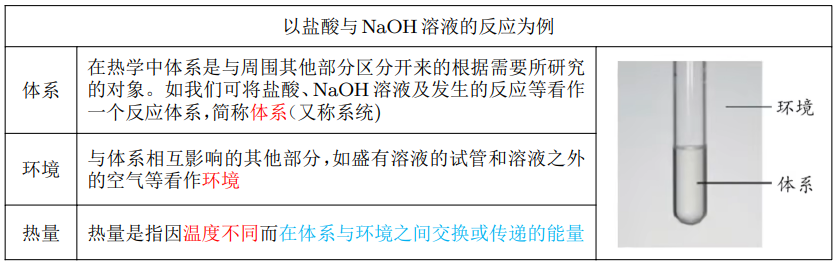
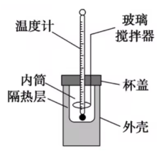
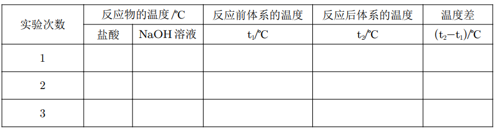
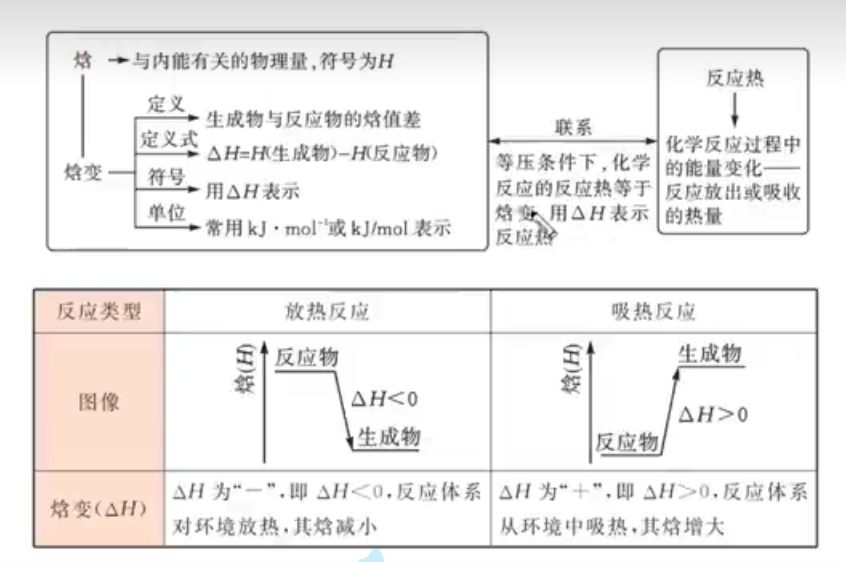
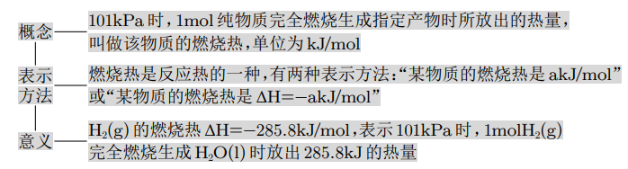
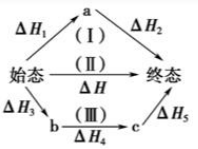

# 【化学】选必一：化学反应的热效应

## 反应热与焓变

### 反应热及其测定

热量的释放和吸收是化学反应中能量变化的常见形式。例如，燃料的燃烧、酸碱中和反应等会放出热量，属于放热反应。而有些反应，如工业上煅烧石灰石的反应等会吸收热量，属于吸热反应。在实际应用中，我们通过**反应热**来定量的描述化学反应过程中释放或吸收的热量。

### 体系和环境

在研究反应热时，需要明确体系和环境。

下面以研究盐酸与 $\ce{NaOH}$ 溶液的反应为例：

### 化学反应热效应（反应热）

1. 在等温条件下，化学反应体系向环境释放或从环境吸收的热量，称为化学反应的热效应，简称**反应热**；

2. 许多反应热快快要通过量热计直接测定。

   例如，盐酸与 $\ce{NaOH}$ 溶液反应的过程中会放出热量，导致体系与环境之间的温度产生差异. 在反应前后，如果环境的温度没有变化，则反应放出的热量就会使体系的温度升高，这时可以根据测得的体系的温度变化和有关物质的比热容等来计算反应热。

### 中和反应反应热的测定实验

#### 操作步骤

请按照下列步骤，用简易量热计（如图）测量盐酸与 $\ce{NaOH}$ 溶液反应前后的温度。

1. 反应物温度的测定

   【测量步骤】

   - 用量筒量取 $\ce{50 mL 0.50mol/L}$ 盐酸，打开杯盖，倒入量热计的内筒，盖上杯盖，插入温度计，测量并记录盐酸的温度。用水把温度计上的酸冲洗干净，擦干备用。
   - 用另一个量筒量取 $\ce{50 mL 0.55mol/L NaOH}$ 溶液，用温度计测量并记录 $\ce{NaOH}$ 溶液的温度。

   【注意事项】

   - 内筒和外层之间有一个隔热层，避免热量逸散。
   - 装置层中大小烧杯口必须相平。
   - $\ce{NaOH}$ 稍加过量，是为了让盐酸完全反应。

2. 反应后体系温度的测量

   【测量步骤】

   打开杯盖，将量筒中的 $\ce{NaOH}$ 溶液**迅速倒入**量热计的内筒，**立即**盖上杯盖，插入温度计，用搅拌器匀速搅拌。密切关注温度变化，将**最高温度**记为反应后体系的温度 （$t_2$）。

   【注意事项】

   - 迅速倒入&立即盖上杯盖是为了避免热量逸散。
   - 记录的温度是反应过程中的最高温度。
   - 不要用温度计或玻璃棒搅拌，也不应该震荡烧杯，应该直接用玻璃搅拌器搅拌。

3. 重复上述步骤 1 至步骤 2 两次。

#### 数据处理

1. 取盐酸浓度和 $\ce{NaOH}$ 溶液温度的平均值记为反应前体系的温度（$t_1$）。计算温度差 $t_2-t_1$。

   将数据填入下表：

   

2. 取三次测量所得温度差的平均值作为计算依据。**注意：这一步需要舍去与其他数据差距过大的数据。**

3. 根据温度差和比热容等计算反应热。

4. 实验数据处理。

**注意：在计算数据时要考虑到单位，比如中和热只能是 $\mathrm{kJ/mol}$，所以要换算单位。**

#### 数据处理计算

1. 反应原理：$Q=cm\Delta t$。其中：$Q$ 是中和反应放出的热量；$m$ 是反应混合液的质量；$c$ 是反应混合液的比热容；$\Delta t$ 是反应前后溶液温度的差值。

2. 为了计算鉴别， 可以近似的认为实验所用酸、碱稀溶液的密度、比热容与水相同，并忽略量热计的比热容。

   **注意：由于忽略了酸碱溶液的密度，所以尽量用与水接近的稀溶液进行实验。**

#### 提高测定准确度的措施

1. 隔热层、杯盖等的使用是为了减少热量散失，降低实验误差；
2. 要用同一支温度计，避免仪器误差。注意测定一种溶液后必须用水冲洗干净并用滤纸擦干。
3. 使用不同的量筒分别量取酸碱溶液。防止之前使用过的量筒内有残余溶液；
4. 正确读取体积和温度，多次试验求平均值时，若有某一组的实验数据有明显误差，应该舍去；
5. 操作时动作要快，尽量减少热量散失；
6. 为了保证盐酸完全被中和，采用稍过量的 $\ce{NaOH}$ 溶液。

### 中和热

#### 概念

大量实验测得，在 $\ce{25\mathrm{℃}}$ 和 $\ce{101 kPa}$ 下，强酸的稀溶液与强碱的稀溶液发生中和反应生成 $\ce{1mol H2O_{(l)}}$ 时，放出 $\ce{57.3 kJ}$ 的热量。

说明：

1.  对同一反应来说，中和反应的反应热大小与所用酸、碱溶液的用量有关；
2. 而中和热是指生成 $\ce{1mol H2O_{(l)}}$ 时的反应热，故酸、碱溶液的用量对中和反应反应热的测定结果没有影响。

易错点：

1. 酸、碱溶液中若有浓溶液，生成 $\ce{1mol H2O_{(l)}}$ 时反应放出的热量大于 $\ce{57.3 kJ}$；
2. 酸、碱中若有弱酸或弱碱，电离需要吸热，生成 $\ce{1mol H2O_{(l)}}$ 时反应放出的热量小于 $\ce{57.3 kJ}$；
3. 若酸与碱反应生成 $\ce{1mol H2O_{(l)}}$ 的同时还有沉淀生成，则反应放出的热量大于 $\ce{57.3 kJ}$。如稀硫酸与 $\ce{Ba(OH)2}$ 溶液反应生成 $\ce{1mol H2O_{(l)}}$ 时，反应放出热量一定大于 $\ce{57.3 kJ}$（$\ce{SO4^{2-}}$ 和 $\ce{Ba^2+}$ 反应生成 $\ce{BaSO4}$ 时会放热）。

### 化学反应的内能变化与焓变

#### 化学反应的内能变化

化学反应的能量变化是由物质所具有的内能不同引起的。

内能是体系内物质所含各种微观粒子的能量总和，内能的大小除了与物质的种类、数量及聚集状态 (即气态、 液态或固态等) 有关外，还与体系的温度、压强有关，因为上述因素都可以影响物质内部微观粒子的能量。内能的符号为 $U$. 化学反应中内能的变化可以写作：
$$
\Delta U=U(反应产物)-U(反应物)
$$
式中：$U(反应产物)$ 和 $U(反应物)$ 分别表示反应体系中反应产物的内能和反应物的内能，如果 $U(反应产物)>U(反应物)$，则反应吸收能量；反之，若 $U(反应产物)<U(反应物)$，则反应吸收能量；反之，若 $U(反应产物)<U(反应物)$，则反应释放能量。

化学反应体系与环境进行能量交换可以以热和功两种形式呈现。根据能量守恒定律，化学反应中内能的变化等于反应热和功的加和，即：
$$
\Delta U=Q+W
$$
迄今为止，科学家还无法通过理论计算或实验测定得知物质内能的绝对值，但根据上式，我们可以通过反应热和反应过程中体系做的功计算出反应体系内能的变化值。

如果反应过程中体系没有做功 (如反应前后体系体积不变且没有做电功等其他功)，则：
$$
\Delta U=Q
$$
即化学反应的反应热等于化学反应前后体系内能的变化。如果反应后体系的内能是增加的，即 $U (反应产物)>U(反应物)$，则 $Q>0$，反应吸热；反之，反应放热。

在实验室里或在生产中，化学反应大多是在压强不变的条件下进行的，如在敞口容器中进行。由于大气压强通常变化很小，此时反应体系的压强可以近似看作不变。在反应前后压强不变的条件下 发生的化学反应称为等压反应。在等压反应中，可能伴随着反应体系体积的改变而有体积功存在，因 此反应热不一定等于反应体系内能的变化。经过长期研究，科学家定义了一个称为“焓”的物理量，符号为 $H$，单位为 $\ce{J}$ 或 $\mathrm{kJ}$，用它的变化来描述等压反应的反应热。

焓与内能一样，其大小也取决于物质的种类、数量、聚集状态并受体系的温度、压强等因素的影响。研究表明，**在等压反应中，如果反应中物质的能量变化没有与电能、光能等其他形式的能量发生转化，则该反应的反应热等于反应前后体系的焓的变化**，其数学表达式为：
$$
Q_p=\Delta H
$$
式中：$Q_p$ 代表等压条件下化学反应的反应热；$ΔH$ 为反应产物的焓与反应物的焓之差，称为反应焓变。
$$
\Delta H=H(反应产物)-H(反应物)
$$

## 热化学方程式 燃烧热

### 热化学方程式

1. 概念：能表明反应所释放或吸收的热量的化学方程式。
2. 意义：热化学方程式不仅表明了化学反应中的物质变化，也表明了化学反应中的能量变化，还说明了物质的量与能量之间的关系。
3. 物质所具有的能量与她们的**聚集状态**有关。即化学反应放热量的多少与反应物、产物的状态有关。

### 书写热化学方程式的注意事项

1. 需注明反应条件：反应热与测定条件（温度、压强灯）有关。绝大多数反应是在 $\ce{25\mathrm{℃}、101 kPa}$ 下进行的，可不特别注明。
2. 需注明反应物和生成物的聚集状态：因为物质的聚集状态不同，它们具有的内能、焓也不同。常用 $\ce{s、l、g、aq}$ 分别表示固体、液体、气体、水溶液。
3. 热化学方程式一般不标注**气体符号**以及“加热”“点燃”灯反应条件。
4. 注意符号单位：$\ce{\Delta H}$ 应包含包含正负、数字和单位（$\mathrm{kJ/mol}$）。
5. 注意热化学方程式的化学计量数：各物质化学式前面的化学计量数仅表示该物质的物质的量，可以是整数，也可以是分数。但**化学计量数必须与 $\ce{\Delta H}$ 相对应**，所以如果化学计量数加倍，则 $\ce{\Delta H}$ 也要加热。
6. 若正反应为放热反应 $\ce{\Delta H <0}$，则逆反应为吸热反应 $\ce{\Delta H >0}$，可逆反应的两个反应反应热的数值相同。
7. 注意可逆反应的 $\ce{\Delta H}$ 和实际吸收或放出热量的区别：不论化学反应是否可逆，热化学反应方程式中的反应热 $\ce{\Delta H}$ 都表示反应进行到底时的能量变化。由于可逆反应不会彻底进行，所以它们实际放出/吸收的热量小于反应热的数值。

### 燃烧热

1. 概念：在 $\ce{25\mathrm{℃}、101 kPa}$ 时，$\ce{1mol}$ 纯物质**完全**燃烧生成**指定产物**时所**放出**的热量（只能为正值），燃烧的单位是 $\mathrm{kJ\cdot mol^{-1}}$。**注意用文字表示燃烧热只能为正，燃烧热对应的反应热为负。**
2. 意义：例如，甲烷的燃烧热为 $\ce{\Delta H = -890.31 kJ\cdot mol^{-1}}$，它表示 $\ce{25\mathrm{℃}、101 kPa}$ 时，$\ce{1mol CH4}$ 完全燃烧生成 $\ce{CO2}$ 和液态 $\ce{H2O}$ 时放出 $\ce{890.31 kJ}$ 的热量。
3. 注意事项：
   - 反应条件是 $\ce{25 \mathrm{℃}、101 kPa}$（默认情况下）；
   - 物质燃烧热的要求是**纯物质**，且物质的量为 $\ce{1mol}$。
   - “完全燃烧生成制定产物”是指单质或化合物燃烧后变为最稳定的物质。完全燃烧时，下列物质要生成对应的物质为：$\ce{C -> CO2(g),H -> H2O(l),S ->SO2(g),N ->N2(g)}$ 等。
   - **生成的水为液态**不能是气态，$\ce{C -> CO}$ 不是完全燃烧，而 $\ce{S ->SO3}$，$\ce{SO3}$ 不是燃烧产物。
   - 文字叙述燃烧热时，用“正值”，但用 $\ce{\Delta H}$ 必须注明符号。

## 盖斯定律

1. 简介：在科学研究和工业生产中，常常需要了解反应热。

   许多反应热可以通过实验直接测定，但是有些反应热无法直接测定。例如 $\ce{C(s)+ \dfrac{1}{2}O2(g) = CO(g)}$。

   我们可以利用盖斯定律来计算反应的反应热。

2. 内容：一个化学反应，不管是一步完成还是几步完成，其反应热是相同的。

   - 化学反应的反应热，只与化学反应体系的始态、终态有关，与反应进行的途径无关。（与物理中的重力势能类似）

   - 反应热总值一定，如图表示始态到终态的反应热。

     

     则 $\ce{\Delta H = \Delta H1 + \Delta H2 = \Delta H3 + \Delta H4 +\Delta H5}$。

   - 意义：在无法测量某个反应反应热时，可以通过盖斯定律计算出反应热。

     例如：

     $\ce{C(s) + \dfrac{1}{2} O2(g) = CO(g)}$ 反应的 $\ce{\Delta H}$ 无法直接测得。

     但以下两个反应的 $\ce{\Delta H}$ 可以直接测得：
     $$
     \ce{C(s) + O2(g) = CO2(g)~~~~~~\Delta H = -393.5 kJ\cdot mol^{-1}}\\
     \ce{CO(g) + \dfrac{1}{2} O2(g) = CO2(g)~~~~~~\Delta H = -283.0 kJ\cdot mol^{-1}}
     $$
     则在此温度下 $\ce{C(s) + \dfrac{1}{2} O2(g) = CO(g)}$ 反应的 $\ce{\Delta H = \Delta H1 - \Delta H2 = -110.5 kJ\cdot mol^{-1}}$。

     只需要将目标方程式用已知方程式凑出即可。

     对于较为复杂的目标方程式，可以先找出只出现一次且可以直接确定的参与反应的物质，作为突破口。

     题目中给定的已知反应式不一定都用得着。

     判断两个反应的反应热大小，可以考虑把两个反应方程式相加或者相减判断结果方程式 $\ce{\Delta H}$ 是正是负。

## 有关反应热的重难点题型

1. 能量图像+盖斯定律结合：一般步骤是先根据图像写出方程式，然后根据写出的方程式通过各种加减运算得到目标方程式。

2. 利用键能计算反应热：$\ce{\Delta H} = 反键 - 生键$。

3. 盖斯定律+利用反应热计算键能：可以设出对应的键能然后根据 $\Delta H = 反键 - 生键$ 列方程求解。

4. 利用燃烧热的 $\ce{\Delta H}$ 计算反应热：$\ce{\Delta H = 反燃 - 生燃}$。

   >  注意：
   >
   >  - 这里的反燃和生燃都是燃烧热对应的 $\ce{\Delta H}$，而非燃烧热本身，因为燃烧热是正的，但是燃烧热对应的 $\ce{\Delta H}$ 为负。
   >  - 代入公式时，$\ce{CO2}$ 和 $\ce{O2}$ 的燃烧热为 $0$。

5. 标准摩尔生成焓题型：$\ce{\Delta H = 生生 - 反生}$。
