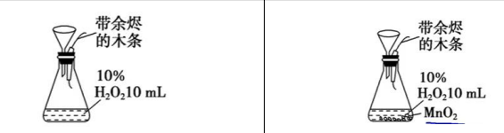

# 【化学】选必一：化学反应速率

## 化学反应速率的相关概念及计算

### 概念及数学表达式

1. 概念：化学反应速率是定量描述化学反应进行快慢的物理量。通常用单位时间内**反应物浓度的减小**或**生成物浓度的增加**来表示。
2. 数学表达式：$v=\dfrac{\Delta c}{\Delta t}$。由于速率一定是正值，所以浓度变化量也一定是正值（大减小）。
3. 单位：$\ce{mol \cdot L^{-1}\cdot s^{-1}}$ 或 $\ce{mol/(L\cdot s)}$，注意分母中的 $\ce{L\cdot s}$ 要带括号；$\ce{mol \cdot L^{-1}\cdot min^{-1}}$ 或 $\ce{mol /(L\cdot min)}$。 换算：$\ce{1mol\cdot L^{-1}\cdot s^{-1} = 60 mol \cdot L^{-1}\cdot min^{-1}}$
4. 注意：
   - 化学反应速率是一段时间内的平均速率，而不是瞬时速率。
   - 无论用反应物还是生成物均取正值；
   - 不用纯液体或固体来表示化学反应速率，因为固体和纯液体的浓度可以看做一个常数。
   - 化学反应速率不一定必须用单位时间内反应物或生成物的浓度变化量来表示。

### 化学反应速率与化学计量数的关系

1. 同一反应用不同物质表示化学反应速率时，其数值的大小可能不同，但表示的意义相同。
2. 对于反应 $\ce{m A(g) + n B(g) = p C(g) + q D(g)}$，当单位相同时，化学反应速率的数值之比等于方程式中各物质的化学计量数之比，即 $\ce{v(A):v(B):v(C):v(D)} = m:n:p:q$ 或 $\dfrac{v(A)}{m}=\dfrac{v(B)}{n}=\dfrac{v(C)}{p}=\dfrac{v(D)}{q}$。
3. 计算/比较反应速率时一般将不同物质所表示的反应速率换算成统一的物质所表示，一般选用反应方程式中计量数比较大的为基准。

### 反应速率计算——三段式法

对于比较复杂的化学反应速率的计算，常采用“三段式法”进行计算：

例如：
$$
\begin{array}{}
& \ce{mA} & + & \ce{n B}& \ce{<=>}&\ce{p C}\\
起始浓度/(\ce{mol\cdot L^{-1}})& a& &b&&c\\
转化浓度/(\ce{mol\cdot L^{-1}})&-x&&-\dfrac{n}{m}x&& +\dfrac{p}{m}x\\
t ~时刻浓度/(\ce{mol\cdot L^{-1}})&a-x&&b-\dfrac{n}{m}x&&c+\dfrac{p}{m}x
\end{array}
$$
计算中注意以下量的关系：

- 对反应物：$c(起始)-c(转化)=c(某时刻)$；
- 对生成物：$c(起始)+c(转化)=c(某时刻)$。

当题目中已知前后压强的变化（温度不变时）或前后物质的量的变化，可以考虑设转化的物质的量，然后根据反应前后压强/物质的量变化的关系建立关于未知数的方程，然后求解。

## 影响反应速率的因素+碰撞理论

### 化学反应速率的测定

1. 通过实验测定。
2. 可用于测定化学反应速率的物质的性质：该物质的性质容易测定且与化学反应速率成正比或反比。例如，气体体积、体系压强、颜色深浅、光的吸收、导电能力等性质。

### 探究浓度对反应速率的影响

1. 原理：
   $$
   \ce{Na2S2O3 + H2SO4 = Na2SO4 + SO2 ^ + S v + H2O}\\
   \ce{S2O3^{2-} + 2H+  = SO2 ^ + S v + H2O}
   $$

2. 实验步骤：

   

3. 实验现象：两支试管中的溶液均变浑浊，滴加 $\ce{0.5 mol \cdot L^{-1} H2SO4}$ 溶液的试管先变浑浊；

4. 结论：若其它条件相同，增大反应物浓度，反应速率加快；降低反应物浓度，反应速率减慢。

### 探究温度对反应速率的影响

1. 原理：
   $$
   \ce{Na2S2O3 + H2SO4 = Na2SO4 + SO2 ^ + S v + H2O}\\
   \ce{S2O3^{2-} + 2H+  = SO2 ^ + S v + H2O}
   $$

2. 实验步骤

   

3. 出现黄色浑浊的时间：加入热水的烧杯出现的时间较短；加入冷水的烧杯出现的时间较长。

4. 结论：若其他条件相同，升高温度，反应速率加快；降低温度，反应速率减慢。

### 探究催化剂对化学反应速率的影响

1. 原理：$\ce{2H2O2 \xlongequal{MnO2} 2H2O + O2 ^}$

2. 实验步骤：

   

3. 实验现象：前者余烬未复燃，后者余烬复燃；

4. 解释：前者 $\ce{H2O2}$ 分解速率慢，后者加入 $\ce{MnO2}$，分解速率快。

5. 结论：催化剂可以改变化学反应速率。

### 影响化学反应速率的因素

1. 内因：参加反应物质的结构（化学性质、化学键强弱等），此为影响速率的**主要因素**。如常温下 $\ce{F2}$ 和 $\ce{H2}$ 反应很快，$\ce{N2}$ 和 $\ce{H2}$ 反应很困难。

2. 外因：

   - 浓度：有气体参加或溶液中发生的反应，增大浓度，化学反应速率加快，减小浓度，化学反应速率减慢。对于纯固体或纯液体的反应物，改变它们的量**不会改变**化学反应速率。但固体反应物与溶液或气体接触的表面积越大，反应速率越大。

   - 压强（一般通过改变体积来改变压强）：

     ①对于只涉及液体和固体的反应，压强的改变对反应速率几乎没有影响；

     ②**恒温恒容**时充入“无关气体”：容器总压强增大，但各反应物的浓度不变，反应速率不变。

     ③**恒温恒压**时充入“无关气体”：引起体积增大，各反应物浓度减小，反应速率减慢。

3. 温度：升高温度，无论是吸热反应还是放热反应速率都增大；降低温度，无论是吸热反应还是放热反应，速率都减小。（温度每升高 $\ce{10 \mathrm{℃}}$，化学反应速率通常增大为原来的 $2\sim 4$ 倍）

4. 催化剂：催化剂能改变化学反应速率，但在反应前后本身的质量和化学性质不变的物质，反应历程中必定既包含有催化剂参与的反应，又包括使催化剂再生产的反应。催化剂通过参与反应改变反应历程、**改变反应的活化能**来改变反应速率。

### 化学反应的历程

1. 基元反应：研究发现，大多数化学反应并不是经过简单碰撞就能完成的，而往往经过多个反应步骤才能实现。

   例如，$\ce{2HI = H2 + I2}$，实际上是经过下列两步反应完成的：①$\ce{2HI -> H2 + 2I .}$；②$\ce{2I . -> I2}$。（其中 $\ce{I .}$ 表示的是碘的自由基，活性很大，非常不稳定）

   每一步反应称为基元反应，这两个先后进行的基元反应反应了 $\ce{2HI = H2 + I2}$ 的反应历程（又称反应机理）。

2. 碰撞理论的中心内容：基元反应发生的先决条件是反应物的分子必须发生碰撞，反应速率的大小与单位时间内的反应物分子间的碰撞次数成正比。**能发生化学反应的碰撞**称为有效碰撞，单位时间内**有效碰撞**次数越多，则反应速率越大。

3. 活化分子：把能够发生有效碰撞的分子叫做活化分子。活化分子具有比普通分子（非活化分子）更高的能量。

4. 活化能：活化分子平均能量和普通反应物分子平均能量的**差值**。

   

5. 合适取向：分子间的自由碰撞必然有不同的碰撞取向。有效的分子碰撞，分子除了要有足够的能量，还要有合适的碰撞取向。**活化分子按照合适的取向所发生的有效碰撞才能发生化学反应**。

   所以从这个角度讲，发生化学反应的有效碰撞需要满足以下两点：①活化分子；②合适的取向。

   

### 利用碰撞理论解释外界条件对化学反应速率的影响

在一定条件下，活化分子在反应物分子中所占的百分数是固定不变的。活化分子百分数越大，或单位体积内的活化分子越多，单位时间内的有效碰撞次数就越多，反应速率就越快。

1. 浓度效应：增大反应物浓度 $\to$ 单位体积内的活化分子的数目增多 $\to $ 单位时间内有效碰撞次数增多 $\to $ 化学反应速率增大。（属于改变**单位体积内的活化分子数目**：不改变体积，改变同一体积下的活化分子数目）

   

2. 压强效应：对于有**气体**参加的化学反应，若其他条件不变，增大压强 $\to $ 体积减小 $\to $ 反应物浓度增大 $\to $ 单位体积内的活化分子数增多 $\to $ 单位时间内的有效碰撞次数增多 $\to $ 化学反应速率增大；压强减小 $\to $ 体积增大 $\to $ 化学反应速率减小。压强对于**无气体参加**的反应的化学反应速率无影响。（属于改变**单位体积内的活化分子数目**：不改变活化分子数目，改变体积）

   

3. 温度效应：温度升高 $\to $ 反应物分子的能量增加 $\to $ 一部分原来能量较低的非活化分子变成活化分子 $\to $ 活化分子百分数增加 $\to $ 单位时间内有效碰撞的次数增多 $\to $ 化学反应速率增大。（属于改变**活化分子百分数**：不改变活化能，改变反应物分子的能量）

   

4. 催化剂效应：使用催化剂 $\to $ 改变反应历程 $\to $ 改变反应活化能 $\to $ 使更多的反应物分子称为活化分子 $\to $ 增大活化分子百分数 $\to$ 增大化学反应速率。（属于改变**活化分子百分数**：不改变反应物分子的能量，改变活化能）

   

|          条件变化          | 分子总数 | 活化分子数目 | 活化分子百分数 | 单位体积内活化分子数目 | 单位时间/体积内有效碰撞次数 | 化学反应速率 |
| :------------------------: | :------: | :----------: | :------------: | :--------------------: | :-------------------------: | :----------: |
|   浓度（恒容、增大浓度）   |   增大   |     增大     |      不变      |          增大          |            增大             |     增大     |
| 压强（压缩体积、增大压强） |   不变   |     不变     |      不变      |          增大          |            增大             |     增大     |
|        温度（升高）        |   不变   |     增大     |      增大      |          增大          |            增大             |     增大     |
|       催化剂（使用）       |   不变   |     增大     |      增大      |          增大          |            增大             |     增大     |

## 基元反应+反应历程+活化能+催化原理

### 基元反应与反应历程

1. 基元反应：由反应物**只经一步**就转化成生成物的反应；
2. 非基元反应（复杂反应）：由**多步完成**，其中每一步都是一个基元反应。
3. 反应历程（反应机理）：化学反应所经过的步骤。反应历程使用一系列的基元反应来描述的，基元反应的总和称为总反应，平时写的化学方程式一般是总反应的化学方程式，只能表示嘴出的反应物和最终的生成物之间的化学计量关系。
4. 中间产物：中间出现过，下一个反应消耗掉。

### 浓度对反应速率的影响

#### 化学反应速率与反应物浓度的关系式

在 $\ce{298 K}$ 时，实验测得溶液中的反应 $\ce{H2O2 + 2HI = 2H2O + I2}$ 在反应物浓度不同时的反应速率见下表。

由上述实验数据可以发现：在 $\ce{HI}$ 浓度一定时，$\ce{H2O2}$ 浓度每增大一倍，反应速率就提高一倍；在 $\ce{H2O2}$浓度一定时，$\ce{HI}$ 浓度没增大一倍，反应速率也提高一倍。上述关系可表示为：
$$
v=kc(\ce{H2O2})\cdot c(\ce{HI})
$$
即反应速率 $v$ 与 $c(\ce{H2O2})$ 和 $c(\ce{HI})$ 成正比。

其中 $k$ 称为**反应速率常数**，表示单位浓度下的反应速率。反应速率常数与浓度**无关**，但受**温度**、**催化剂**、固体表面性质等因素的影响。通常，反应速率常数越大，反应进行的越快。反应速率常数可以通过上述等式列方程/直接计算求解。

 根据化学反应速率与反应物浓度的关系式，可以清楚地判断反应物浓度的改变对化学反应速率的影响。但是，**一个化学反应的速率与参与反应的物质的浓度的关系式是实验测定的结果，不能随意根据反应的方程式直接写出**。对于很多反应，这种关系式中浓度的方次与化学方程式中各物质化学式前的系数并无确定关系。

复杂反应中的速率控制步骤往往决定了该反应的速率，控制步骤中反应速率**最慢**的基元反应是决定整个反应速率的关键步骤。

#### 基元反应的化学反应速率与反应物浓度的关系式

当实验已经判定反应是基元反应时，反应速率方程很容易按化学方程式的计量数直接写出。基元反应的速率常数和平衡常数的关系是一目了然的，例如对于反应 $\ce{CO + NO2 = CO2 + NO}$ 而言：
$$
v_正 = k_正\cdot c(\ce{CO})\cdot c(\ce{NO2})\\
v_逆 = k_逆\cdot c(\ce{CO2})\cdot c(\ce{NO})
$$
当达到平衡时，$v_正 = v_逆$，浓度项都是平衡浓度。
$$
k_正 \cdot c(\ce{CO})\cdot c(\ce{NO2}) = k_逆\cdot c(\ce{CO2})\cdot c(\ce{NO})\ce{->} \dfrac{k_正}{k_逆} = \dfrac{c(\ce{CO2})\cdot c(\ce{NO})}{c(\ce{CO})\cdot c(\ce{NO2})}=K
$$
其中 $K$ 表示化学反应平衡常数。

> 注意：该公式只限于基元反应，非基元反应的速率方程必须由实验测定反应级数及反应速率常数后才能确定。

### 温度对反应速率的影响

对大部分反应而言，温度升高，化学反应速率加快，但加快程度不同。

以反应 $\ce{H2 + Cl2 = 2HCl}$ 所包含的一个基元反应 $\ce{H2 + Cl . -> HCl + H .}$ 为例。基元反应 $\ce{H2 + Cl . -> HCl + H.}$ 是 $\ce{Cl.}$ 与 $\ce{H2}$ 分子碰撞，导致 $\ce{H-H}$ 键断裂，$\ce{H-Cl}$ 形成的过程。研究表明，这个过程需要经历一个高能量的中间状态，此时形成一种旧键没有完全断裂、新建没有完全形成的过渡态 $\ce{H\cdots H\cdots Cl}$，如图所示。过渡态的能量与反应物的平均能量只差 $E_{a}$ 称为该基元反应的活化能。活化能的存在是化学反应通常需要获得能量才能实际发生的原因。不同的基元反应活化能大小不同，因此化学反应速率不同。显然，活化能越高，反应越难发生。

### 对活化能本质的认识

基元反应的过渡态理论：基元反应从反应物到产物的变化过程中要经历一个中间状态，这个状态称为过渡态。
$$
\begin{array}{}
\ce{AB + C}&\ce{->} &\ce{[A\cdots B\cdots C]}&\ce{->}&\ce{A + BC}\\
反应物&& 过渡态&& 反应产物
\end{array}
$$
过渡态是反应过程中具有最高能量的一种结构状态，过渡态能量与反应物的平均能量的差值相当于活化能。实验研究已证实过渡态确实存在。

### 阿伦尼乌斯公式

阿伦尼乌斯公式提出的反应速率常数与温度之间关系的经验公式：
$$
k=A\mathrm{e}^{-\frac{E_a}{RT}}
$$
式中，$k$ 为反应速率常数；$A$ 为比例常数；$\mathrm{e}$ 为自然对数的底；$R$ 为理想气体常数；$E_a$ 为活化能，单位为 $\ce{J . mol^{-1}}$ 或 $\pu{kJ*mol-1}$。

该经验公式表明，当 $E_a>0$ 时，升高温度，反应速率常数增大，反应速率随之提高。由该公式还可知，$E_a$ 值越大，改变温度对反应速率的影响程度就越大。这就是升高相同温度时，不同化学反应的速率提高的倍数不同的原因。对于一个 $E_{a正}> E_{a逆}$ 的反应，若温度升高，正逆反应的速率均增大，但是 $k_正$ 增大的幅度更大，所以 $v_正$ 增大的倍数也更大，所以反应正向移动，同时化学平衡常数 $K$ 也增大。

### 催化剂对反应速率的影响

1. 催化剂是能改变化学反应速率而在反应前后本身的质量和化学性质不变的物质；
2. 由于催化剂的质量和化学性质在反应前后不变，反应历程中必定既包含有催化剂参与的反应，又包括使得催化剂在生成的反应。催化剂通过参与反应改变反应历程、改变反应的活化能来改变化学反应速率。
3. 催化剂**不能改变**化学反应的平衡常数（因为根据阿伦尼乌斯公式无法改变 $k_正$ 和 $k_逆$），也不能改变化学平衡的转化率。
4. 催化剂是加入的物质然后参与反应最后又被生成，而中间产物是被生成的物质然后又被消耗，注意区分两者。
5. 催化剂具有**选择性**，对于某一反应活性很强的催化剂对于另外的反应不一定具有催化作用。根据这一特性，工业上可以用于选择恰当的催化剂来调控反应，提高生产效率。例如：乙烯和氧气有两个反应，一个生成环氧乙烷，一个生成二氧化碳和水，我们可以通过加入银催化剂，加快第一个反应的反应速率，但不改变第二个反应的反应速率，从而使得生成环氧乙烷的速率加快。
6. 催化剂的活性与自身成分、粒径、合成方法等因素以及反应温度、压强等条件的影响。通常情况下，催化剂发挥作用需要控制在**活性温度**范围内。有些物质的存在可能会使催化剂明显失效，这种现象称为催化剂中毒。

