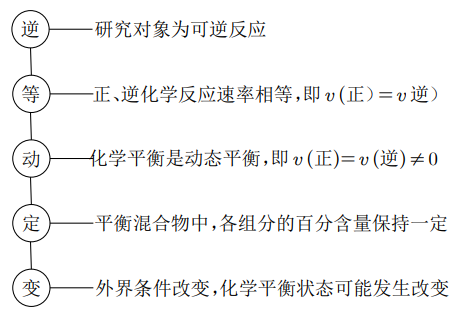
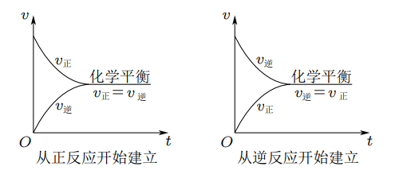
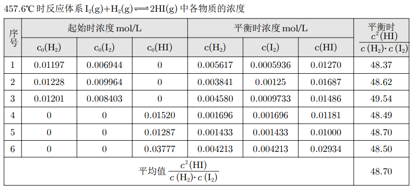
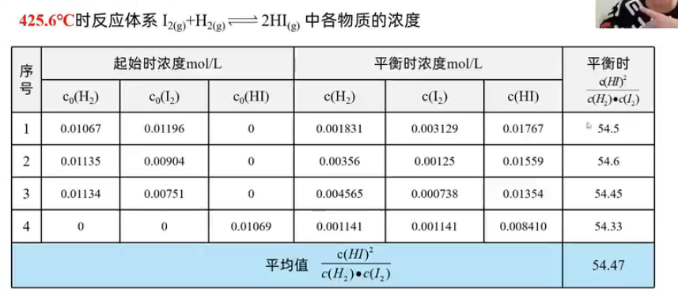

---

---

# 【化学】选必一：化学平衡

## 化学平衡状态

### 可逆反应

1. 概念：在相同条件下，既能向正反应方向进行，同时又能向逆反应方向进行的反应；
2. 符号：化学方程式中用“$\ce{<=>}$”表示。
3. 特征：
   - 双向性：分为方向相反的两个反应——正反应和逆反应；
   - 双同性：在同一条件下，正、逆反应同时进行；
   - 共存性：反应物的转化率小于 $100\%$，反应物与生成物共存。

### 化学平衡状态

1. 概念：在一定条件下的可逆反应中，**当正、逆两个方向的反应速率相等**，反应体系中所有参加反应的物质的质量或浓度保持恒定时，这个状态叫化学平衡状态。

   

2. 建立：

   - 反应开始时：反应物的浓度最大，$v(正)$ 最大，生成物的浓度为 $0$，$v(逆)$ 为 $0$；
   - 反应进行时：反应物的浓度逐渐减小 $\ce{->}$ $v(正)$ 逐渐减小；生成物的浓度由 $0$ 逐渐增大 $\ce{->}$ 从 $0$ 逐渐增大；
   - 达到平衡时：$v(正)=v(逆)$，反应混合物中各组分的你攻读保持不变。

   

3. 判断方法：

   可逆反应达到化学平衡状态由两个主要特征：

   - 正逆反应速率相等，即 $v_正 = v_逆$；
   - 变量不变，即达平衡，即某个平衡前变化的物理量（例如浓度、压强等）保持不变后，达到化学平衡。**注意：原来不变的量不变不能说明达到化学平衡，例如气体体积前后不变时，不能说明气体体积不变时达到平衡的依据**。

   以反应 $\ce{m A(g) + n B(g) <=> p C(g) + q D(g)}$ 为例：

   【混合物体系中各成分的含量】

   - 当各物质的物质的量或物质的量分数一定时，达到平衡；
   - 当各物质的质量或质量分数一定时，达到平衡；
   - 当各气体的体积或体积分数一定时，达到平衡；
   - 总体积、总压强、总物质的量一定时，不一定达到平衡。

   【正、逆反应速率的关系】

   - 在单位时间内消耗了 $\pu{m mol A}$，同时生成了 $\pu{m mol A}$，达到平衡；
   - 在单位时间内消耗了 $\pu{n mol B}$，同时生成了 $\ce{q mol D}$，达到平衡；
   - $v(\ce{A}):v(\ce{B}):v(\ce{C}):v(\ce{D}):m:n:p:q$，不一定达到平衡（没有强调是 $v_正$ 还是 $v_逆$）；
   - 在单位时间内生成了 $\pu{n mol B}$，同时消耗了 $\ce{q mol D}$，不一定达到平衡；
   - 单位时间内，同一物质断裂的化学键数与生成的化学键数相等时，达到平衡；

   【压强】

   - 恒温恒容且 $m+n \ne p+q$，当总压强一定时，达到平衡；
   - 恒温恒容且 $m+n = p+q$，当总压强一定时，不一定达到平衡。

   【**混合气体**的平均相对分子质量（$\overline{M}$）】注意不考虑固体。

   - $\overline{M}$ 一定，且 $m+n \ne p+q$ 时，达到平衡；
   - $\overline{M}$ 一定，且 $m+n = p+q$ 时，不一定达到平衡。

   【温度】在**绝热**体系中，当体系温度一定时，达到平衡。

   【体系的密度】恒温恒容条件下，当密度一定时，不一定达到平衡。（因为 $\rho = \dfrac{m}{v}$，纯气体反应体系中，总质量和体积都不变，所以密度无论是否达到平衡都始终不变）

   【颜色】含有**有色物质**的体系，当颜色不再变化时，达到平衡。

## 化学平衡常数

### 化学平衡体系中的反应物浓度与生成物浓度的关系

结论一：$\dfrac{c^2(\ce{HI})}{c(\ce{H2})\cdot c(\ce{I2})}$ 为常数；

结论二：常数与反应物的起始浓度大小无关；与正向建立还是逆向建立平衡无关。

结论三：温度改变，该常数发生变化。

### 化学平衡常数

1. 概念：在一定温度下，当一个可逆反应达到化学平衡时，生成物浓度幂之积与反应物浓度幂之积与反应物浓度幂之积的比值是一个常数，用符号 $K$ 表示。

2. 表达式：对于反应 $\ce{m A(g) + n B(g) <=> p C(g) + q D(g)}$，在**一定温度下**达到平衡。

   平衡常数：
   $$
   K = \dfrac{c^p(\ce{C}) \cdot c^q(\ce{D})}{c^m({\ce{A}})\cdot c^n(\ce{B})}
   $$
   其中，$c$ 为各组分的平衡浓度，温度一定，$K$ 为定值。

3. 注意事项：

   - 对于由纯固体或纯液体参与的反应，纯固体或纯液体不列入平衡常数的表达式中；

     例如：对于稀薄水溶液中的水，水的浓度不变，不需要写入平衡常数。

   - 平衡常数是指某一具体反应的平衡常数。

     1. 若反应方向改变，则平衡常数改变（例如正逆反应的平衡常数互为倒数，即 $K_1= \dfrac{1}{K_2}$）；

     2. 若化学反应方程式中各物质的化学计量数等倍扩大或缩小，尽管是同一反应，平衡常数**也会改变**。系数变为原来的几倍，平衡常数变为原来的几次方，即对于一个反应若其平衡常数为 $K_1$，扩大 $n$ 倍，最终新的平衡常数 $K_2=(K_1)^n$。

        | 方程式 |  $\ce{\Delta H}$   |   $K$    |
        | :----: | :----------------: | :------: |
        |  逆写  | 等值异号（相反数） |   倒数   |
        | $n$ 倍 |       $n$ 倍       | $n$ 次方 |
        |  相加  |        相加        |   相乘   |

     3. 平衡常数表达式中 $c(\ce{A})、c(\ce{B})、c(\ce{C})、c(\ce{D})$ 是指平衡时各物质的物质的量浓度，不可使用**物质的量**数据，且不可使用**任意时刻**的物质的量浓度数据。

     4. 有水参加或生成的反应的平衡常数表达式的书写：

        ①稀薄水溶液中的反应，如有水参加或生成，水的浓度不必写入平衡常数表达式。

        ②水为气态 $\ce{[H2O(g)]}$ 需要写入平衡常数表达式中。

        ③非水溶液中进行的反应中，若有水参加或生成，则水的浓度应该出现在平衡常数的表达式中。例如：有机液体的反应 $\ce{CH3COOH(l) + C2H5OH(l) <=> CH3COOC2H5(l) + H2O(l)}$。

4. 意义：

   - 化学平衡常数是指在一定温度下一个反应本身固有的内在性质的定量表现，是表示可逆反应进行程度（限度）的一个特征值（注意是**定量**不是**定性**）；
   - $K$ 越大，说明平衡体系中生成物所占的比例越大，正反应进行的程度越大，即该反应进行的越完全，平衡时反应物的转化率越大；$K$ 越小，该反应进行的越不完全，平衡时反应物的转化率越小。
   - 一般来说，如果一个反应的平衡常数数值大于 $10^5$，通常认为该反应可以进行的较完全；相反，如果一个反应的平衡常数数值小于 $10^{-5}$，则认为这个反应很难进行。

5. 利用化学平衡常数判断平衡移动方向

   对于一般的可逆反应 $\ce{m A(g) + n B(g) <=> p C(g) + q D(g)}$，在**任意状态**（不是平衡）时，生成物与反应物的浓度幂之积的比值称为**浓度商**，用 $Q$ 表示：
   $$
   Q=\dfrac{c^p(\ce{C})\cdot c^q(\ce{D})}{c^m(\ce{A})\cdot c^n(\ce{B})}
   $$
   用任意状态的浓度幂之积的比值 $Q$ 与 $K$ 比较，可判断可逆反应是否达到平衡状态和反应进行的方向，即：

   - 当 $Q<K$，反应向正方向移动；
   - 当 $Q=K$，反应处于平衡状态；
   - 当 $Q>K$，反应向逆方向移动。

### 化学平衡转化率

用平衡常数表示反应限度有时不够直观，因此实际应用中常用平衡转化率（$\alpha$）来表示一定条件下的反应限度：
$$
某反应物的平衡转化率（\alpha）= \dfrac{该反应物平衡时已转化的量}{该反应物的起始总量}\times 100\% = \dfrac{该反应物的起始浓度 - 该反应物的平衡浓度}{该反应物的起始浓度}\times 100\%
$$
