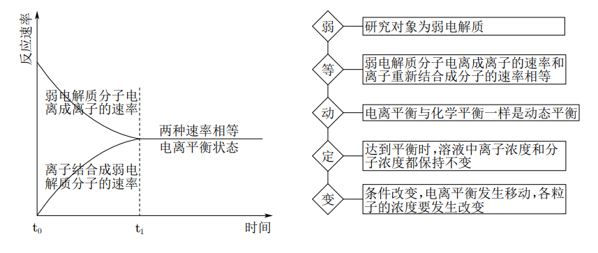

# 【化学】选必一：水溶液中的离子反应与平衡

## 强电解质与弱电解质

### 强电解质

1. 概念：在水溶液中能全部电离的电解质（无电离平衡）；
2. 电解质在溶液中存在形式：只有阴、阳离子；
3. 化合物类型：离子化合物、部分共价化合物；
4. 实例：①多数盐（包括难溶性盐）；②强酸，如 $\ce{HClO4、HI、H2SO4、HBr、HCl、HNO3}$ 等；③强碱，如 $ \ce{KOH、Ca (OH)2、NaOH、Ba (OH)2}$ 等。

### 弱电解质

1. 概念：在水溶液中只能部分电离的电解质（有电离平衡）；
2. 电解质在溶液中的存在形式：既有阴、阳离子，又有电解质分子；
3. 化合物类型：共价化合物；
4. 实例：①弱酸，如 $\ce{CH3COOH}、\ce{HClO}$ 等；②弱碱，如 $\ce{NH3*H2O}$ 等；③水。
5. 常见误区：
   - 电解质的强弱由物质的内部结构决定，强、弱电解质的主要区别是溶于水的部分能否**完全电离**；
   - 电解质的强弱与溶液的导电能力没有必然联系：强电解质溶液的导电能力不一定强，弱电解质溶液的导电能力不一定弱。对于其他条件相同（例如物质的量浓度）时的两种电解质溶液，强电解质溶液的导电能力大于弱电解质溶液。
   - 电解质的强弱与化学键没有必然联系。一般强电解质含有离子键或强极性键，但**含有强极性键的化合物不一定是强电解质**，例如 $\ce{HF}$ 是弱电解质。
   - 电解质的强弱与溶解度无关。有些难溶的物质如硫酸钡，虽然难溶，但溶于水的部分完全电离，故硫酸钡是强电解质。

## 弱电解质的电离平衡

在一定条件（如温度、浓度）下，弱电解质分子电离成离子的速率与离子结合成弱电解质分子的速率相等，溶液中各分子和离子的浓度都不再发生变化，电离过程就达到了电离平衡状态。

## 电离方程式的书写

1. 强电解质：完全电离，在写电离方程式时，用 “$=$”；

2. 弱电解质：部分电离，在写电离方程式时，用 “$\ce{<=>}$"；

   【一元弱酸、弱碱】一步电离。

   $\ce{CH3COOH}$：$\ce{CH3COOH <=> CH3COO- + H+}$；

   $\ce{NH3*H2O}$：$\ce{NH3*H2O <=> NH4+ + OH-}$。

   【多元弱酸】分布电离，必须分步写出，**不可合并**（其中以第一步电离为主）。

   $\ce{H2CO3}$：$\ce{H2CO3 <=> H+ + HCO3-}$、$\ce{HCO3- <=> H+ + CO3^2-}$。

   【多元弱碱】分布电离（较复杂），在中学阶段要求一步写出。

   $\ce{Fe(OH)3 <=> Fe^3+ + 3OH-}$。

## 影响电离平衡的因素

> 注意：弱电解质溶液的电离一般都是**吸热反应**。

实例（稀溶液）：以 $\ce{CH3COOH <=> CH3COO- + H+}\quad \Delta H>0$ 为例：

|       改变条件        | 平衡移动方向 | 电离程度 | $\ce{n(H+)}$ | $\ce{c(H+)}$ | 导电能力 |
| :-------------------: | :----------: | :------: | :----------: | :----------: | :------: |
|       加水稀释        |   正向移动   |   增大   |     增大     |     降低     |   减弱   |
|    加入少量冰醋酸     |   正向移动   |   减小   |     增大     |     增大     |   增强   |
|   加 $\ce{HCl(g)}$    |   逆向移动   |   减小   |     增大     |     增大     |   增强   |
|   加 $\ce{NaOH(s)}$   |   正向移动   |   增大   |     减小     |     减小     |   增强   |
| 加 $\ce{CH3COONa(s)}$ |   逆向移动   |   减小   |     减小     |     减小     |   增强   |
|       加入镁粉        |   正向移动   |   增大   |     减小     |     减小     |   增强   |
|       升高温度        |   正向移动   |   增大   |     增大     |     增大     |   增强   |

说明：

1. 导电能力主要与溶液中**能够自由移动离子的浓度**有关，浓度越大，导电能力越强。
2. 加水稀释时，虽然 $\ce{n(H+)}$ 增大，但稀释会让体积增大，或者可以理解为稀释让体积增大的**倍数**比让氢离子数目增大的倍数**大**（这一点可以利用化学平衡中**勒夏特列原理对“减弱”的理解**来理解），相当于溶液中酸性降低，即 $\ce{c(H+)}$ 降低。
3. 加水稀释导致电离正向移动，可以概括为**越稀越电离**。
4. 加入少量冰醋酸时，溶液中**已经存在**的**醋酸根离子**会阻止醋酸继续向右电离，加入的冰醋酸电离程度反而降低。
5. 加入少量冰醋酸时，冰醋酸是固体，体积可以忽略不计，加入后相当于溶液的体积无变化，又由于平衡向右移动，所以 $\ce{n(H+)}$ 增大，当体积不变时，$\ce{c(H+)}$ 减小。
6. 通入氯化氢**气体**时，相当于前后溶液体积不变。
7. 通入氯化氢气体，会使得 $\ce{c(H+)}$会阻止醋酸电离，使得平衡逆向移动，被称为**同离子效应**。
8. 加入氢氧化钠**固体**同样也相当于前后溶液体积不变。
9. 加入氢氧化钠固体后，由于平衡正向移动且加入的是强电解质，所以导电能力增强。
10. 加入醋酸钠固体，会使得 $\ce{c(CH3COO-)}$ 增大，根据同离子效应，会使得平衡逆向移动。
11. 加入醋酸钠固体后，少部分醋酸钠变成醋酸分子，大部分仍然以离子的形态在溶液中，根据勒夏特列原理，醋酸钠是强电解质所以会使得导电能力增强。
12. 加入镁粉后，镁会和氢离子反应，使得氢离子物质的量和浓度都降低；
13. 加入镁粉后，溶液反应会得到醋酸镁，是强电解质，溶液由弱电解质变成强电解质， 导电能力增强。
14. 加入氢氧化钠和镁粉后虽然溶液浓度会升高，但最终会冷却到原本的温度，所以不需要考虑温度对溶液造成的影响。

## 电离平衡常数

1. 定义：在一定条件下，当弱电解质的电离达到平衡时，溶液中弱电解质的电离所生成的各种离子浓度的乘积，与溶液中为电离分子的浓度之比是一个常数，这个常数就叫做电离平衡常数，简称电离常数，酸用 $K_a$ 表示、碱用 $K_b$ 表示。

2. 表示方法：

   【一元弱酸 $\ce{HA}$】根据 $\ce{HA <=> H+ + A-}$，$K_a=\dfrac{c(\ce{H+})\cdot c(\ce{A-})}{c(\ce{HA})}$。

   【一元弱碱 $\ce{BOH}$】根据 $\ce{BOH <=> B+ + OH-}$，$K_b=\dfrac{c(\ce{B+})\cdot c(\ce{OH-})}{c(\ce{BOH})}$。

   【多元弱酸】每一步电离都有对应的电离常数，可以分别表示为 $K_{a1}、K_{a_2}$ 等。

   以 $\ce{H2CO3}$ 为例：

   根据 $\ce{H2CO3 <=> H+ + HCO3- ->} K_{a_1}=\dfrac{c(\ce{H+})\cdot c(\ce{HCO3-})}{c(\ce{H2CO3})}$；

   根据 $\ce{HCO3- <=> H+ + CO3^2- ->} K_{a_2} = \dfrac{c(\ce{H+})\cdot c(\ce{CO3^2-})}{c(\ce{HCO3-})}$。

3. 意义：表示弱电解质的电离能力。

   相同条件下，$K_a$ 越大，弱酸的酸性相对越强；$K_b$ 越大，弱碱的碱性相对越强。

   多元弱酸是分步电离的，每一级电离都有乡音的电离平衡常数，且 $K_{a_1}\gg K_{a_2} \gg K_{a_3}$，其酸性主要由第一步电离决定。一般情况下，第一步电离得到的氢离子会对第二步电离造成抑制，即**同离子效应**。

4. 影响因素：

   【内因】同一温度下，不同的弱电解质的电离常数不同，说明电离常数首先由物质的本性决定。

   【外因】对于同一弱电解质，电离平衡常数只与温度有关，由于电离为吸热过程，所以平衡常数随着温度升高而增大。

## 电离度及其应用

1. 定义弱电解质在水中的电离达到平衡状态时，已电离的溶质的分子数占原有溶质分子总数（包括已电离的和未电离的）百分率，成为电离度，通常用 $\alpha$ 表示。

2. 计算：
   $$
   \alpha = \dfrac{已电离的弱电解质的物质的量浓度}{溶液中原有弱电解质的总物质的量浓度}\times 100\%=\dfrac{已电离的弱电解质的物质的量}{溶液中原有弱电解质的总物质的量}\times 100\%
   $$

3. 意义：电离度实质上是一种平衡转化率，表示弱电解质在水中的电离程度。温度和浓度相同时，一元弱酸的 $\alpha$  越大，$K_a$ 越大，酸性越强。

4. 影响因素：

   【温度】升高温度，电离度增大，降低温度，电离度减小（与电离平衡常数相同）。

   【浓度】电离度随着溶液浓度的增大而减小，随着溶液浓度的减小而增大。

## 电离度与电离常数的关系

以 $\ce{CH3COOH <=> CH3COO- + H+}$ 为例：

$\pu{25 ^\circ C}$，$ c~\pu{mol *L-1}$ 的 $\ce{CH3COOH}$：
$$
\begin{array}{}
&\ce{CH3COOH}&\ce{<=>}&\ce{CH3COO-}&+&\ce{H+}\\
起始浓度/\pu{mol*L-1}&c&&0&&0\\
变化浓度/\pu{mol*L-1}&x&&x&&x\\
平衡浓度/\pu{mol*L-1}&c-x&&x&&x\\
\end{array}
$$
平衡常数 $K_a=\dfrac{c(\ce{CH3COO-})\cdot c(\ce{H+})}{c(\ce{CH3COOH})}=\dfrac{x^2}{c-x}\approx\dfrac{x^2}{c}$，$x=\sqrt{K_ac}$，则：$c(\ce{H+})=\sqrt{K_ac}$，电离度 $\alpha=\dfrac{x}{c}=\dfrac{\sqrt{K_ac}}{c}=\sqrt{\dfrac{K_a}{c}}$（越稀越电离）。

注意：在计算平衡常数时，只有 $x$ 相对 $c$ 非常小可以忽略，如果较大不能忽略。一般来说弱酸（比如酸性比醋酸弱的）可以忽略这个 $x$，中强酸不能忽略。

## 水的电离

精确的导电性实验表明，纯水大部分以 $\ce{H2O}$ 的形式存在，但其中也存在着极少量的水合氢离子 $\ce{H3O+}$ 和 $\ce{OH-}$。这表明水是一种极弱的电解质，能发生微弱的电离：
$$
\ce{H2O + H2O <=> H3O+ + OH-}
$$
 上述水的电离方程式可简写为：$\ce{H2O <=> H+ + OH-}$。

> 注意：这里的水指的是纯水，水中**几乎无离子**；但自来水中有多种杂质，会有多种电解质。

### 水的离子积常数

1. 定义：当水的电离达到平衡时，电离产物 $\ce{H+}$ 和 $\ce{OH-}$ 浓度之积是一个常数，记作 $K_w$，表达式：$K_w = c(\ce{H+})\cdot c(\ce{OH-})$。

   其中 $K_w$ 叫做水的离子积常数，简称水的离子积。

2. 实验测得：$\pu{25 ^\circ C}$，$\pu{1L}$ 的纯水中只有 $\pu{1E-7 mol}$ 的水分子发生电离，故 $\pu{25 ^\circ C}$ 时纯水中，$c(\ce{H+})=c(\ce{OH-})= \pu{1E-7 mol*L-1}$。此时，$K_w=\pu{1E-14}$。

3. 影响因素：只与温度有关，温度不变，$K_w$ 不变；升高温度，$K_w$ 增大。

### 外界条件对水的电离平衡的影响

电离方程式：$\ce{H2O <=> H+ + OH-} \quad \Delta H >0$。

|       改变条件        | 平衡移动方向 | $c_平(\ce{H+})$ | $c_平(\ce{OH-})$ | 水的电离程度 | $c(\ce{H+})_{\ce{H2O}}$ | $c(\ce{OH-})_{\ce{H2O}}$ | $K_w$ |
| :-------------------: | :----------: | :-------------: | :--------------: | :----------: | :---------------------: | :----------------------: | :---: |
|       升高温度        |   正向移动   |      增大       |       增大       |     增大     |          增大           |           增大           | 增大  |
|       降低温度        |   逆向移动   |      减小       |       减小       |     减小     |          减小           |           减小           | 减小  |
|  加入 $\ce{HCl(g)}$   |   逆向移动   |      增大       |       减小       |     减小     |          减小           |           减小           | 不变  |
|  加入 $\ce{NaOH(s)}$  |   逆向移动   |      减小       |       增大       |     减小     |          减小           |           减小           | 不变  |
| 加入 $\ce{NaHSO4(s)}$ |   逆向移动   |      增大       |       减小       |     减小     |          减小           |           减小           | 不变  |
|  加入金属 $\ce{Na}$   |   正向移动   |      减小       |       增大       |     增大     |            /            |           增大           | 不变  |

说明：

1. 加入氯化氢气体后，由于氯化氢本身电离出来的氢离子会产生同离子效应，所以平衡逆向移动。
2. 加入氯化氢气体后，由于勒夏特列原理，虽然平衡逆向移动，但 $c_平(\ce{H+})$ 由于氯化氢在溶液中的电离反而会增大。
3. 加入氯化氢气体后，由于平衡逆向移动或根据 $K_w$ 的计算式，$c_平(\ce{H+})$ 增大，但 $c_平(\ce{OH-})$ 减小。
4. 加入氯化氢气体后，由于平衡逆向移动，虽然 $c_平(\ce{H+})$ 增大，但 $c(\ce{H+})_{\ce{H2O}}$ 降低。
5. 加入氯化氢气体后，$c_平(\ce{OH-})=c(\ce{OH-})_{\ce{H2O}}$。
6. 加入氢氧化钠固体的影响同理于加入氯化氢气体，这里不做赘述。
7. 加入硫酸氢钠固体的影响与氯化氢气体相同，同样不做赘述。
8. 加入金属钠后，由于金属钠会和水反应不断消耗氢离子使其还原，会降低溶液中的氢离子，使得平衡正向移动，从而增大溶液中的氢氧根离子，增大水的电离程度。
9. 加入金属钠后，由于平衡的正向移动，所以水在**电离过程中**电离出来的氢离子浓度是不断**增大**的，但**反应结束后**，由于**钠对氢离子的不断消耗**，**溶液中剩余的**水电离出来的氢离子浓度是相比原平衡**减小**。

### 水的离子积表达式的应用

在（稀薄）水溶液中，均存在水的电离平衡，即水的离子积表达式在一切稀薄水溶液中均适用。

因此在表达式中，$c(\ce{H+})$、$c(\ce{OH-})$ 表达整个溶液中总物质的量浓度，则 $K_w = c(\ce{H+})_{溶液} \cdot c(\ce{OH-})_{溶液}$。

【纯水中】$K_w = c(\ce{H+})_水\cdot c(\ce{OH-})_{水}$。

【酸溶液中】

$K_w = [c(\ce{H+})_酸 + c(\ce{H+})_水] \cdot c(\ce{OH-})_{水}$，当 $c(\ce{H+})_酸 \gg c(\ce{H+})_水$，可以忽略水电离出的 $\ce{H+}$，即 $K_w = c(\ce{H+})_酸 \cdot c(\ce{OH-})_{水}$，但由水电离出来的 $c(\ce{H+})_水 = c(\ce{OH-})_水$。

例如：在 $\pu{25 ^\circ C}$ 中，$\pu{0.1 mol*L-1}$ 的 $\ce{HCl}$ 中，$c(\ce{H+})_酸 = \pu{0.1 mol*L-1}$，$c(\ce{H+})_水 = c(\ce{OH-})_水 = \dfrac{K_w}{c(\ce{H+})_酸} = \dfrac{\pu{1E-14}}{0.1} = \pu{1E-13 mol*L-1}$。同时也可以看出，水的电离被 $\ce{HCl}$ 大幅度抑制，$\ce{HCl}$ 浓度越大，抑制程度就越大。

【碱溶液中】

$K_w = c(\ce{H+})_水\cdot [c(\ce{OH-})_碱 + c(\ce{OH-})_{水}]$，当 $c(\ce{OH-})_碱 \gg c(\ce{OH-})_水$，可以忽略水电离出的 $\ce{OH-}$，即 $K_w = c(\ce{H+})_水 \cdot c(\ce{OH-})_碱$，但由水电离出来的 $c(\ce{H+})_水 = c(\ce{OH-})_水$。

例如：在 $\pu{25 ^\circ C}$ 中，$\pu{0.1 mol*L-1}$ 的 $\ce{NaOH}$ 中，$c(\ce{OH-})_碱 = \pu{0.1 mol*L-1}$，$c(\ce{H+})_水 = c(\ce{OH-})_水 = \dfrac{K_w}{c(\ce{OH+})_碱} = \dfrac{\pu{1E-14}}{0.1} = \pu{1E-13 mol*L-1}$。同时也可以看出，水的电离被 $\ce{NaOH}$ 大幅度抑制，$\ce{NaOH}$ 浓度越大，抑制程度就越大。

【总结】

某稀薄水溶液中，加入 $\pu{0.1 mol*L-1}$ 的 $\ce{HCl}$ 或 $\ce{NaOH}$，两者对水的电离抑制效果相同，即若加入前水的电离相同，则加入后两者水的电离依然相同，即 $c(\ce{H+})_{\ce{H2O}}$ 相同。

> 注意：加入 $\pu{0.1 mol*L-1}$ 的 $\ce{HCl}$ 和 $\ce{H2SO4}$ 效果不同，因为两种分子中氢原子的计量数不同，后者的抑制效果更强。

## 溶液的酸碱性与 $\ce{pH}$

### 溶液的 $\ce{pH}$

1. 定义：溶液的 $\ce{pH}$ 指的是 $c(\ce{H+})$ 的负对数，即 $\ce{pH} = -\lg c(\ce{H+})$。常用来表示溶液中酸碱性强弱。
2. 意义：$\ce{pH}$ 越大，溶液碱性越强，$c(\ce{H+})$ 越小；$\ce{pH}$ 越小，溶液酸性越强，$c(\ce{H+})$ 越大。
