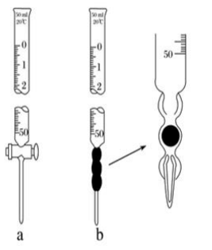

# 【化学】选必一：水溶液中的离子反应与平衡

## 强电解质与弱电解质

### 强电解质

1. 概念：在水溶液中能全部电离的电解质（无电离平衡）；
2. 电解质在溶液中存在形式：只有阴、阳离子；
3. 化合物类型：离子化合物、部分共价化合物；
4. 实例：①多数盐（包括难溶性盐）；②强酸，如 $\ce{HClO4、HI、H2SO4、HBr、HCl、HNO3}$ 等；③强碱，如 $ \ce{KOH、Ca (OH)2、NaOH、Ba (OH)2}$ 等。

### 弱电解质

1. 概念：在水溶液中只能部分电离的电解质（有电离平衡）；
2. 电解质在溶液中的存在形式：既有阴、阳离子，又有电解质分子；
3. 化合物类型：共价化合物；
4. 实例：①弱酸，如 $\ce{CH3COOH}、\ce{HClO}$ 等；②弱碱，如 $\ce{NH3*H2O}$ 等；③水。
5. 常见误区：
   - 电解质的强弱由物质的内部结构决定，强、弱电解质的主要区别是溶于水的部分能否**完全电离**；
   - 电解质的强弱与溶液的导电能力没有必然联系：强电解质溶液的导电能力不一定强，弱电解质溶液的导电能力不一定弱。对于其他条件相同（例如物质的量浓度）时的两种电解质溶液，强电解质溶液的导电能力大于弱电解质溶液。
   - 电解质的强弱与化学键没有必然联系。一般强电解质含有离子键或强极性键，但**含有强极性键的化合物不一定是强电解质**，例如 $\ce{HF}$ 是弱电解质。
   - 电解质的强弱与溶解度无关。有些难溶的物质如硫酸钡，虽然难溶，但溶于水的部分完全电离，故硫酸钡是强电解质。

## 弱电解质的电离平衡

在一定条件（如温度、浓度）下，弱电解质分子电离成离子的速率与离子结合成弱电解质分子的速率相等，溶液中各分子和离子的浓度都不再发生变化，电离过程就达到了电离平衡状态。

## 电离方程式的书写

1. 强电解质：完全电离，在写电离方程式时，用 “$=$”；

2. 弱电解质：部分电离，在写电离方程式时，用 “$\ce{<=>}$"；

   【一元弱酸、弱碱】一步电离。

   $\ce{CH3COOH}$：$\ce{CH3COOH <=> CH3COO- + H+}$；

   $\ce{NH3*H2O}$：$\ce{NH3*H2O <=> NH4+ + OH-}$。

   【多元弱酸】分布电离，必须分步写出，**不可合并**（其中以第一步电离为主）。

   $\ce{H2CO3}$：$\ce{H2CO3 <=> H+ + HCO3-}$、$\ce{HCO3- <=> H+ + CO3^2-}$。

   【多元弱碱】分布电离（较复杂），在中学阶段要求一步写出。

   $\ce{Fe(OH)3 <=> Fe^3+ + 3OH-}$。

## 影响电离平衡的因素

> 注意：弱电解质溶液的电离一般都是**吸热反应**。

实例（稀溶液）：以 $\ce{CH3COOH <=> CH3COO- + H+}\quad \Delta H>0$ 为例：

|       改变条件        | 平衡移动方向 | 电离程度 | $\ce{n(H+)}$ | $\ce{c(H+)}$ | 导电能力 |
| :-------------------: | :----------: | :------: | :----------: | :----------: | :------: |
|       加水稀释        |   正向移动   |   增大   |     增大     |     降低     |   减弱   |
|    加入少量冰醋酸     |   正向移动   |   减小   |     增大     |     增大     |   增强   |
|   加 $\ce{HCl(g)}$    |   逆向移动   |   减小   |     增大     |     增大     |   增强   |
|   加 $\ce{NaOH(s)}$   |   正向移动   |   增大   |     减小     |     减小     |   增强   |
| 加 $\ce{CH3COONa(s)}$ |   逆向移动   |   减小   |     减小     |     减小     |   增强   |
|       加入镁粉        |   正向移动   |   增大   |     减小     |     减小     |   增强   |
|       升高温度        |   正向移动   |   增大   |     增大     |     增大     |   增强   |

说明：

1. 导电能力主要与溶液中**能够自由移动离子的浓度**有关，浓度越大，导电能力越强。
2. 加水稀释时，虽然 $\ce{n(H+)}$ 增大，但稀释会让体积增大，或者可以理解为稀释让体积增大的**倍数**比让氢离子数目增大的倍数**大**（这一点可以利用化学平衡中**勒夏特列原理对“减弱”的理解**来理解），相当于溶液中酸性降低，即 $\ce{c(H+)}$ 降低。
3. 加水稀释导致电离正向移动，可以概括为**越稀越电离**。
4. 加入少量冰醋酸时，溶液中**已经存在**的**醋酸根离子**会阻止醋酸继续向右电离，加入的冰醋酸电离程度反而降低。
5. 加入少量冰醋酸时，冰醋酸是固体，体积可以忽略不计，加入后相当于溶液的体积无变化，又由于平衡向右移动，所以 $\ce{n(H+)}$ 增大，当体积不变时，$\ce{c(H+)}$ 减小。
6. 通入氯化氢**气体**时，相当于前后溶液体积不变。
7. 通入氯化氢气体，会使得 $\ce{c(H+)}$会阻止醋酸电离，使得平衡逆向移动，被称为**同离子效应**。
8. 加入氢氧化钠**固体**同样也相当于前后溶液体积不变。
9. 加入氢氧化钠固体后，由于平衡正向移动且加入的是强电解质，所以导电能力增强。
10. 加入醋酸钠固体，会使得 $\ce{c(CH3COO-)}$ 增大，根据同离子效应，会使得平衡逆向移动。
11. 加入醋酸钠固体后，少部分醋酸钠变成醋酸分子，大部分仍然以离子的形态在溶液中，根据勒夏特列原理，醋酸钠是强电解质所以会使得导电能力增强。
12. 加入镁粉后，镁会和氢离子反应，使得氢离子物质的量和浓度都降低；
13. 加入镁粉后，溶液反应会得到醋酸镁，是强电解质，溶液由弱电解质变成强电解质， 导电能力增强。
14. 加入氢氧化钠和镁粉后虽然溶液浓度会升高，但最终会冷却到原本的温度，所以不需要考虑温度对溶液造成的影响。

## 电离平衡常数

1. 定义：在一定条件下，当弱电解质的电离达到平衡时，溶液中弱电解质的电离所生成的各种离子浓度的乘积，与溶液中为电离分子的浓度之比是一个常数，这个常数就叫做电离平衡常数，简称电离常数，酸用 $K_a$ 表示、碱用 $K_b$ 表示。

2. 表示方法：

   【一元弱酸 $\ce{HA}$】根据 $\ce{HA <=> H+ + A-}$，$K_a=\dfrac{c(\ce{H+})\cdot c(\ce{A-})}{c(\ce{HA})}$。

   【一元弱碱 $\ce{BOH}$】根据 $\ce{BOH <=> B+ + OH-}$，$K_b=\dfrac{c(\ce{B+})\cdot c(\ce{OH-})}{c(\ce{BOH})}$。

   【多元弱酸】每一步电离都有对应的电离常数，可以分别表示为 $K_{a1}、K_{a_2}$ 等。

   以 $\ce{H2CO3}$ 为例：

   根据 $\ce{H2CO3 <=> H+ + HCO3- ->} K_{a_1}=\dfrac{c(\ce{H+})\cdot c(\ce{HCO3-})}{c(\ce{H2CO3})}$；

   根据 $\ce{HCO3- <=> H+ + CO3^2- ->} K_{a_2} = \dfrac{c(\ce{H+})\cdot c(\ce{CO3^2-})}{c(\ce{HCO3-})}$。

3. 意义：表示弱电解质的电离能力。

   相同条件下，$K_a$ 越大，弱酸的酸性相对越强；$K_b$ 越大，弱碱的碱性相对越强。

   多元弱酸是分步电离的，每一级电离都有乡音的电离平衡常数，且 $K_{a_1}\gg K_{a_2} \gg K_{a_3}$，其酸性主要由第一步电离决定。一般情况下，第一步电离得到的氢离子会对第二步电离造成抑制，即**同离子效应**。

4. 影响因素：

   【内因】同一温度下，不同的弱电解质的电离常数不同，说明电离常数首先由物质的本性决定。

   【外因】对于同一弱电解质，电离平衡常数只与温度有关，由于电离为吸热过程，所以平衡常数随着温度升高而增大。

## 电离度及其应用

1. 定义弱电解质在水中的电离达到平衡状态时，已电离的溶质的分子数占原有溶质分子总数（包括已电离的和未电离的）百分率，成为电离度，通常用 $\alpha$ 表示。

2. 计算：
   $$
   \alpha = \dfrac{已电离的弱电解质的物质的量浓度}{溶液中原有弱电解质的总物质的量浓度}\times 100\%=\dfrac{已电离的弱电解质的物质的量}{溶液中原有弱电解质的总物质的量}\times 100\%
   $$

3. 意义：电离度实质上是一种平衡转化率，表示弱电解质在水中的电离程度。温度和浓度相同时，一元弱酸的 $\alpha$  越大，$K_a$ 越大，酸性越强。

4. 影响因素：

   【温度】升高温度，电离度增大，降低温度，电离度减小（与电离平衡常数相同）。

   【浓度】电离度随着溶液浓度的增大而减小，随着溶液浓度的减小而增大。

## 电离度与电离常数的关系

以 $\ce{CH3COOH <=> CH3COO- + H+}$ 为例：

$\pu{25 ^\circ C}$，$ c~\pu{mol *L-1}$ 的 $\ce{CH3COOH}$：
$$
\begin{array}{}
&\ce{CH3COOH}&\ce{<=>}&\ce{CH3COO-}&+&\ce{H+}\\
起始浓度/\pu{mol*L-1}&c&&0&&0\\
变化浓度/\pu{mol*L-1}&x&&x&&x\\
平衡浓度/\pu{mol*L-1}&c-x&&x&&x\\
\end{array}
$$
平衡常数 $K_a=\dfrac{c(\ce{CH3COO-})\cdot c(\ce{H+})}{c(\ce{CH3COOH})}=\dfrac{x^2}{c-x}\approx\dfrac{x^2}{c}$，$x=\sqrt{K_ac}$，则：$c(\ce{H+})=\sqrt{K_ac}$，电离度 $\alpha=\dfrac{x}{c}=\dfrac{\sqrt{K_ac}}{c}=\sqrt{\dfrac{K_a}{c}}$（越稀越电离）。

注意：在计算平衡常数时，只有 $x$ 相对 $c$ 非常小可以忽略，如果较大不能忽略。一般来说弱酸（比如酸性比醋酸弱的）可以忽略这个 $x$，中强酸不能忽略。

## 水的电离

精确的导电性实验表明，纯水大部分以 $\ce{H2O}$ 的形式存在，但其中也存在着极少量的水合氢离子 $\ce{H3O+}$ 和 $\ce{OH-}$。这表明水是一种极弱的电解质，能发生微弱的电离：
$$
\ce{H2O + H2O <=> H3O+ + OH-}
$$
 上述水的电离方程式可简写为：$\ce{H2O <=> H+ + OH-}$。

> 注意：这里的水指的是纯水，水中**几乎无离子**；但自来水中有多种杂质，会有多种电解质。

### 水的离子积常数

1. 定义：当水的电离达到平衡时，电离产物 $\ce{H+}$ 和 $\ce{OH-}$ 浓度之积是一个常数，记作 $K_w$，表达式：$K_w = c(\ce{H+})\cdot c(\ce{OH-})$。

   其中 $K_w$ 叫做水的离子积常数，简称水的离子积。

2. 实验测得：$\pu{25 ^\circ C}$，$\pu{1L}$ 的纯水中只有 $\pu{1E-7 mol}$ 的水分子发生电离，故 $\pu{25 ^\circ C}$ 时纯水中，$c(\ce{H+})=c(\ce{OH-})= \pu{1E-7 mol*L-1}$。此时，$K_w=\pu{1E-14}$。

3. 影响因素：只与温度有关，温度不变，$K_w$ 不变；升高温度，$K_w$ 增大。

### 外界条件对水的电离平衡的影响

电离方程式：$\ce{H2O <=> H+ + OH-} \quad \Delta H >0$。

|       改变条件        | 平衡移动方向 | $c_平(\ce{H+})$ | $c_平(\ce{OH-})$ | 水的电离程度 | $c(\ce{H+})_{\ce{H2O}}$ | $c(\ce{OH-})_{\ce{H2O}}$ | $K_w$ |
| :-------------------: | :----------: | :-------------: | :--------------: | :----------: | :---------------------: | :----------------------: | :---: |
|       升高温度        |   正向移动   |      增大       |       增大       |     增大     |          增大           |           增大           | 增大  |
|       降低温度        |   逆向移动   |      减小       |       减小       |     减小     |          减小           |           减小           | 减小  |
|  加入 $\ce{HCl(g)}$   |   逆向移动   |      增大       |       减小       |     减小     |          减小           |           减小           | 不变  |
|  加入 $\ce{NaOH(s)}$  |   逆向移动   |      减小       |       增大       |     减小     |          减小           |           减小           | 不变  |
| 加入 $\ce{NaHSO4(s)}$ |   逆向移动   |      增大       |       减小       |     减小     |          减小           |           减小           | 不变  |
|  加入金属 $\ce{Na}$   |   正向移动   |      减小       |       增大       |     增大     |            /            |           增大           | 不变  |

说明：

1. 加入氯化氢气体后，由于氯化氢本身电离出来的氢离子会产生同离子效应，所以平衡逆向移动。
2. 加入氯化氢气体后，由于勒夏特列原理，虽然平衡逆向移动，但 $c_平(\ce{H+})$ 由于氯化氢在溶液中的电离反而会增大。
3. 加入氯化氢气体后，由于平衡逆向移动或根据 $K_w$ 的计算式，$c_平(\ce{H+})$ 增大，但 $c_平(\ce{OH-})$ 减小。
4. 加入氯化氢气体后，由于平衡逆向移动，虽然 $c_平(\ce{H+})$ 增大，但 $c(\ce{H+})_{\ce{H2O}}$ 降低。
5. 加入氯化氢气体后，$c_平(\ce{OH-})=c(\ce{OH-})_{\ce{H2O}}$。
6. 加入氢氧化钠固体的影响同理于加入氯化氢气体，这里不做赘述。
7. 加入硫酸氢钠固体的影响与氯化氢气体相同，同样不做赘述。
8. 加入金属钠后，由于金属钠会和水反应不断消耗氢离子使其还原，会降低溶液中的氢离子，使得平衡正向移动，从而增大溶液中的氢氧根离子，增大水的电离程度。
9. 加入金属钠后，由于平衡的正向移动，所以水在**电离过程中**电离出来的氢离子浓度是不断**增大**的，但**反应结束后**，由于**钠对氢离子的不断消耗**，**溶液中剩余的**水电离出来的氢离子浓度是相比原平衡**减小**。

### 水的离子积表达式的应用

在（稀薄）水溶液中，均存在水的电离平衡，即水的离子积表达式在一切稀薄水溶液中均适用。

因此在表达式中，$c(\ce{H+})$、$c(\ce{OH-})$ 表达整个溶液中总物质的量浓度，则 $K_w = c(\ce{H+})_{溶液} \cdot c(\ce{OH-})_{溶液}$。

【纯水中】$K_w = c(\ce{H+})_水\cdot c(\ce{OH-})_{水}$。

【酸溶液中】

$K_w = [c(\ce{H+})_酸 + c(\ce{H+})_水] \cdot c(\ce{OH-})_{水}$，当 $c(\ce{H+})_酸 \gg c(\ce{H+})_水$，可以忽略水电离出的 $\ce{H+}$，即 $K_w = c(\ce{H+})_酸 \cdot c(\ce{OH-})_{水}$，但由水电离出来的 $c(\ce{H+})_水 = c(\ce{OH-})_水$。

例如：在 $\pu{25 ^\circ C}$ 中，$\pu{0.1 mol*L-1}$ 的 $\ce{HCl}$ 中，$c(\ce{H+})_酸 = \pu{0.1 mol*L-1}$，$c(\ce{H+})_水 = c(\ce{OH-})_水 = \dfrac{K_w}{c(\ce{H+})_酸} = \dfrac{\pu{1E-14}}{0.1} = \pu{1E-13 mol*L-1}$。同时也可以看出，水的电离被 $\ce{HCl}$ 大幅度抑制，$\ce{HCl}$ 浓度越大，抑制程度就越大。

【碱溶液中】

$K_w = c(\ce{H+})_水\cdot [c(\ce{OH-})_碱 + c(\ce{OH-})_{水}]$，当 $c(\ce{OH-})_碱 \gg c(\ce{OH-})_水$，可以忽略水电离出的 $\ce{OH-}$，即 $K_w = c(\ce{H+})_水 \cdot c(\ce{OH-})_碱$，但由水电离出来的 $c(\ce{H+})_水 = c(\ce{OH-})_水$。

例如：在 $\pu{25 ^\circ C}$ 中，$\pu{0.1 mol*L-1}$ 的 $\ce{NaOH}$ 中，$c(\ce{OH-})_碱 = \pu{0.1 mol*L-1}$，$c(\ce{H+})_水 = c(\ce{OH-})_水 = \dfrac{K_w}{c(\ce{OH+})_碱} = \dfrac{\pu{1E-14}}{0.1} = \pu{1E-13 mol*L-1}$。同时也可以看出，水的电离被 $\ce{NaOH}$ 大幅度抑制，$\ce{NaOH}$ 浓度越大，抑制程度就越大。

【总结】

某稀薄水溶液中，加入 $\pu{0.1 mol*L-1}$ 的 $\ce{HCl}$ 或 $\ce{NaOH}$，两者对水的电离抑制效果相同，即若加入前水的电离相同，则加入后两者水的电离依然相同，即 $c(\ce{H+})_{\ce{H2O}}$ 相同。

> 注意：加入 $\pu{0.1 mol*L-1}$ 的 $\ce{HCl}$ 和 $\ce{H2SO4}$ 效果不同，因为两种分子中氢原子的计量数不同，后者的抑制效果更强。

## 溶液的酸碱性与 $\ce{pH}$

### 溶液的 $\ce{pH}$

1. 定义：溶液的 $\ce{pH}$ 指的是 $c(\ce{H+})$ 的负对数，即 $\ce{pH} = -\lg c(\ce{H+})$。常用来表示溶液中酸碱性强弱。
2. 意义：$\ce{pH}$ 越大，溶液碱性越强，$c(\ce{H+})$ 越小；$\ce{pH}$ 越小，溶液酸性越强，$c(\ce{H+})$ 越大。
3. 说明：
   - 酸性（碱性）溶液不一定含酸（碱）；
   - 判断溶液的酸碱性不能根据 $c(\ce{H+})$ 和 $c(\ce{OH-})$ 绝对大小，而应该比较二者相对大小，且不受温度影响；
   - 溶液的酸碱性不能根据 $\ce{pH}$ 来判断，如：$\ce{pH=7}$ 的溶液不一定是中性溶液，只有常温下 $\ce{pH=7}$ 才是；
   - 当 $c(\ce{H+})$ 或 $c(\ce{OH-})$ 大于 $\pu{1mol*L-1}$ 时，通常用 $c(\ce{H+})$ 或 $c(\ce{OH-})$ 直接表示；当 $c(\ce{H+})$ 或 $c(\ce{OH-})$ 小于或等于 $\pu{1mol*L-1}$ 通常用 $\ce{pH}$ 表示。

### 溶液的酸碱性判断

溶液的酸碱性取决于溶液中 $c(\ce{H+})$ 和 $c(\ce{OH-})$ 的相对大小。

- 酸性溶液：$c(\ce{H+})>c(\ce{OH-})$，常温下，$\ce{pH<7}$；
- 中性溶液：$c(\ce{H+})=c(\ce{OH-})$，常温下，$\ce{pH=7}$；
- 碱性溶液：$c(\ce{H+})<c(\ce{OH-})$，常温下，$\ce{pH>7}$。

>  注意：给定 $K_w$ 和 $c(\ce{H+})$ 等数值必须要有温度，但**比较大小**不需要温度。

### 溶液酸碱性的测定方法

#### 定性测量——酸碱指示剂法

缺点：只能粗略测定溶液的 $\ce{pH}$ 范围，不能准确测定出 $\ce{pH}$ 的具体值。

#### 定量测量

1. $\ce{pH}$ 试纸法：

   - 定义：是将试纸用多种酸碱指示剂的混合溶液浸透，经晾干制成的。它对不同 $\ce{pH}$ 的溶液能显示出不同的颜色，可用于迅速测定溶液的 $\ce{pH}$。

   - 种类：

     【广泛 $\ce{pH}$ 试纸】其 $\ce{pH}$ 范围是 $1\sim 14$（最常用），可以识别的 $\ce{pH}$ 差约为 $1$。

     【精密 $\ce{pH}$ 试纸】可判别 $0.2$ 或 $0.3$ 的 $\ce{pH}$ 差值；

     【专用 $\ce{pH}$ 试纸】用于酸性、中性或碱性溶液。

   - 使用方法：取一小块试纸放在干净的玻璃板上，用干净的玻璃棒蘸取溶液点在试纸的中央，等待显色后，与标准比色卡进行对比，得出溶液的 $\ce{pH}$。

   - 注意事项：①测定溶液的 $\ce{pH}$ 时，不能将试纸用水润湿。（将溶液稀释，导致所测定的 $\ce{pH}$ 不准确）；②用广泛 $\ce{pH}$ 试纸测得的 $\ce{pH}$ 是**整数**，不会有小数。

2. $\ce{pH}$ 计法：

   $\ce{pH}$ 计，又叫酸度计，通过电子仪器，把仪器的探棒放入溶液即可在显示屏上读出数据，可用来精密测量溶液的 $\ce{pH}$。

### $\ce{pH}$ 的应用

1. 医疗上：血液中的 $\ce{pH}$ 是诊断疾病的一个重要参数，而利用药物调控血液的 $\ce{pH}$ 是辅助治疗的重要手段之一。
2. 生活中：人们使用的护发素的主要功能也是调节头发的 $\ce{pH}$，使之达到适宜的酸碱度。
3. 环保领域：酸性和碱性废水的处理常利用中和反应，处理过程中可利用 $\ce{pH}$ 自动测定仪进行检测和控制。
4. 农业生产中：各种农作物生长都对土壤的 $\ce{pH}$ 范围有一定的要求。
5. 科学实验和工农业生产中：溶液 $\ce{pH}$ 的控制常常是影响实验结果或产品质量、产量的一个关键因素。如在用于测定酸碱溶液浓度的酸碱中和反应滴定中，溶液 $\ce{pH}$ 的变化是判断滴定终点的依据。

## 强酸与强碱的中和滴定

### 酸碱中和滴定的概念和原理

1. 概念：依据中和反应，用已知浓度的酸（或碱）来测定未知浓度的碱（或酸）的实验方法。

2. 原理：
   $$
   \ce{H+ + OH- = H2O}
   $$
   在中和反应中，酸提供的 $\ce{H+}$ 与碱提供的 $\ce{OH-}$ 物质的量相等。

   将 $a\ \pu{mol*L-1}\ V_1\ \pu{mL}$ $n$ 元酸 $\ce{H_nA}$ 与 $b\ \pu{mol*L-1}\ V_2\ \pu{mL}\ m$ 元碱 $\ce{B(OH)_m}$ 恰好完全中和，则 $n(\ce{H+})=n(\ce{OH-})$，即 $a\times (V_1\times 10^{-3})\times n = b\times (V_2\times 10^{-3})\times m$。

### 酸碱中和滴定的仪器与操作

1. 主要试剂：标准溶液（已知浓度）、待测浓度（未知浓度）、指示剂（判断是否恰好中和）、蒸馏水；

2. 主要实验仪器：酸式滴定管、碱式滴定管、滴定管夹、铁架台、锥形瓶等。

   

3. 认识滴定管

   - 构造：管身是内径均匀、带有刻度的细长玻璃管，酸式滴定管的下端是玻璃活塞，碱式滴定管的下端是由橡皮管喝玻璃球构成的阀。

   - 使用要求：

     **酸式滴定管**不能盛放碱液、水解呈碱性的溶液和氢氟酸（和玻璃反应），可以装酸液、氧化性溶液和中性溶液（一般用于量取溶液，比量筒更精准，精确到小数点后两位），因为酸性和氧化性物质易腐蚀橡胶管；

     **碱式滴定管**不能盛放酸液、强氧化性溶液，可以装碱液和中性溶液，因为碱性物质易腐蚀玻璃，致使活塞无法打开。

   - 规格：最小分度是 $\pu{0.1 mol*L-1}$，实验室中常用的滴定管规格有 $\pu{25 mL}$ 和 $\pu{50 mL}$ 两种。

   - 精密度：取到小数点后两位，读数时应估读至 $\pu{0.01 mL}$；如：$\pu{24.00 mL}、\pu{23.38 mL}$。

   - 读数方法：$0$ 刻度在上，从上往下读。

   - 用途：滴定管主要是用来精确测量一定体积的液体。

     

4. 滴定管的使用方法：

   - 检查仪器（检漏）：使用滴定管前，首先要检查活塞是否漏水。

   - 润洗仪器：在加入酸、碱之前，洁净的酸式滴定管和碱式滴定管要分别用所要盛装的酸或碱润洗 $2\sim 3$ 次。

   - 加入反应液：分别将酸、碱加到酸式滴定管和碱式滴定管中，**使页面位于滴定管 $0$ 刻度以上 $2\sim 3\ \pu{mL}$ **，并将滴定管垂直固定在滴定管夹上。

   - 调节起始读数：在滴定管下放一烧杯，调节活塞，**使滴定管尖嘴部分充满溶液**，并使页面处于 $0$ 或 $0$ 以下刻度，准确记录读数。

   - 排气泡——快速放液的方法：

     【酸式滴定管】将酸式滴定管垂直夹持在滴定管夹上，旋转活塞，使溶液快速流出的同时使气泡排出；

     【碱式滴定管】将碱式滴定管垂直夹持在滴定管夹上，使尖嘴向上，并捏住小球后上部的橡皮管，使溶液快速流出的同时使气泡排出。

     

### 实验操作

以用 $\ce{HCl}$ 标准液滴定 $\ce{NaOH}$ 溶液为例：

1. 查漏：使用前先检查滴定管活塞是否漏水；

2. 洗涤：

   - 锥形瓶：只能用蒸馏水洗涤，不能用待测溶液润洗；
   - 滴定管洗涤：应先用自来水，再用蒸馏水，然后再用标准溶液（或待测溶液）润洗 $2\sim 3$ 次，以避免溶液被滴定管内壁上附着的蒸馏水稀释而导致浓度变小；
   - 洗涤的原则：少量多次；
   - 洗涤的标准：管内壁不挂水珠；

3. 取液：

   - 向润洗过的碱式滴定管中加入待测浓度的 $\ce{NaOH}$ 溶液，赶出气泡、调节液面至 $0$ 刻度线后，用碱式滴定管向锥形瓶中滴入 $\pu{25.00 mL}$ 待测溶液，再向其中滴加 $2$ 滴酚酞溶液（注意不是 $\pu{2 mL}$）；
   - 向润洗过的酸式滴定管中加入标准盐酸，赶出气泡、调节液面至 $0$ 刻度后准确记录度数为 $V_1\ \pu{mL}$。

4. 滴定：在锥形瓶下垫一张白纸，左手控制滴定管的活塞，向锥形瓶先快后慢地加入标准盐酸（后面逐滴加入、接近终点使，改成滴加半滴酸，利用锥形瓶内壁承接尖嘴处悬挂的半滴溶液），右手摇晃锥形瓶，眼睛观察锥形瓶内溶液的变化。

   

5. 滴定终点判断：**当加入最后半滴标准盐酸，溶液由粉红色变为无色，且半分钟内不变色**，停止滴定。平时滴定管凹液面最低点，读取溶液体积为 $V_2\ \pu{mL}$。

6. 计算：以 $V_2 - V_1$ 为小号的标准盐酸的体积，取 $2\sim 3$ 次实验结果的平均值，依据 $c(\ce{NaOH})=\dfrac{c(\ce{HCl})\cdot V(\ce{HCl})}{V(\ce{NaOH})}$ 计算待测 $\ce{NaOH}$ 溶液的物质的量浓度。

### 指示剂的选择

1. 中和滴定曲线：以滴加酸（或碱）的量为横坐标，以溶液的 $\ce{pH}$ 为纵坐标绘制出一条溶液的 $\ce{pH}$ 随着酸（或碱）的滴加量而变化的曲线。

   

2. 指示剂选择的依据：在酸、碱中和滴定过程中，溶液的 $\ce{pH}$ 在接近滴定终点时有一个突变过程，在此范围内，滴加很少的酸（或碱），溶液的 $\ce{pH}$ 就有很大变化，能使指示剂的颜色发生明显变化，有利于确定滴定终点，所以即使酚酞、甲基橙的变色不在恰好中和的 $\ce{pH = 7}$ 的点上，但体积差距很小，可以忽略不计。所以我们在选择指示剂的时候，需要选择指示剂变色范围在该突变范围内的指示剂。

   

   

3. 指示剂的选择：一般不选择石蕊，变色现象不明显。强酸滴弱碱：甲基橙；强碱滴弱酸：酚酞；两强互滴：甲基橙，酚酞都可以。

   

### 实验误差分析

【实例说明】

标准 $\ce{HCl}$ 溶液：物质的量浓度 $c_标$、达到滴定终点时耗去体积 $V_标$。

待测 $\ce{NaOH}$ 溶液：物质的量浓度 $c_标$、滴定时量取的体积 $V_待$.

达到化学计量点时：
$$
c_标 \cdot V_标 = c_待 \cdot V_待
$$
【解题要领】$c_标$ 与 $v_待$ 确定，只需要分析出不正确操作引起 $V_标$ 的变化，即分析出结果。

【误差分析】

以标准算溶液滴定未知浓度的碱（酚酞作指示剂）为例：

1. 洗涤：
   - 酸式滴定管未用标准溶液润洗：酸被稀释，酸浓度减小，$V_标$ 偏大，$c_待$ 偏大。
   - 碱式滴定管未用待测溶液润洗：碱被稀释，碱浓度减小，$V_标$ 偏小，$c_待$ 偏大。
   - 锥形瓶用待测溶液润洗：碱物质的量增大，$V_标$ 偏大，$c_待$ 偏大。
   - 锥形瓶洗净后还留有蒸馏水：碱物质的量不变，$V_标$ 不变，$c_待$ 不变。
2. 取液：
   - 放出碱液的滴定管开始有气泡，放出液体后气泡消失：碱物质的量减小，$V_标$ 偏小，$c_待$ 偏小。
3. 滴定：
   - 酸式滴定管滴定前有气泡，滴定终点时气泡消失：$V_标$ 偏大，$c_待$ 偏大。
   - 震荡锥形瓶时部分液体溅出，碱物质的量减小：$V_标$ 偏小，$c_待$ 偏小；
   - 部分酸液滴出锥形瓶外：$V_标$ 偏大，$c_待$ 偏大。
   - 溶液颜色较浅时滴入酸液过快，停止滴定后反加半滴 $\ce{NaOH}$ 溶液无变化：$V_标$ 偏大，$c_待$ 偏大。
4. 读数：
   - 酸式滴定管滴定前读数正确，滴定后俯视读数（或前仰后俯）：若开始时仰视则读数偏大，结束时液面读数时偏小，$V_标$ 偏小，$c_待$ 偏小。
   - 酸式滴定管滴定前读数正确，滴定后仰视读数（或前俯后仰）：若开始时俯视则读数偏小，结束时液面读数时偏大，$V_标$ 偏大，$c_待$ 偏大。

## $\ce{pH}$ 计算

### 数学定义

$$
c(\ce{H+}) = a\times 10^{-b}\ \pu{mol*L-1} \ce{->[\ce{pH} = -\lg c(\ce{H+})]} \ce{pH} = b-\lg a
$$

一些常见的 $\lg$ 值：
$$
\begin{aligned}{}
&\lg 2 = 0.3\\&\lg 3 =0.48\\
&\lg 4 = \lg 2^2 = 2\lg 2 =0.6\\
& \lg 5 = \lg \dfrac{10}{2} = \lg 10 - \lg 2 = 1-0.3=0.7\\
& \lg 6 = \lg (2\times 3) = \lg 2 + \lg 3 =0.78\\
& \lg 8 = \lg 2^3 = 3\lg 2 = 0.9\\
& \lg 9 = \lg 3^2 = 2\lg 3 = 0.96\\
& \lg 10 = 1
\end{aligned}
$$

### 常考题型

#### 单一溶液

常温下，对于 $a\ \pu{mol*L-1}$ 的 $\ce{H_nA}$ 溶液：
$$
c(\ce{H+}) = a\times n\ \pu{mol*L-1}=c\times 10^{-d}\ \pu{mol*L-1}\ce{->}\ce{pH} = d-\lg c
$$
对于 $a\ \pu{mol*L-1}$ 的 $\ce{B(OH)_m}$ 溶液：
$$
c(\ce{OH}) = a \times n\ \pu{mol*L-1} = c\times 10^{-d}\ \pu{mol*L-1} \ce{->} \ce{pOH} = d-\lg c \ce{->[pH + pOH = 14]} \ce{pH = 14 - pOH}
$$

#### 溶液加水稀释

前提条件：常温下，忽略溶液体积变化。

重要性质：溶液的 $n$ 不变。

对于 $\ce{pH} = a$ 的强酸 $\ce{HA}$ 稀释 $10^b$ 倍后，有两种情况：

- $a+b < 7$：稀释后 $\ce{pH} = a+b$；
- $a+b \ge 7$：稀释后的 $\ce{pH}$ 还要考虑水电离出来的 $c(\ce{H+})$，不能单纯相加计算。

例：$\ce{pH = 12}$ 的 $\ce{NaOH}$ 与等体积的水混合，求其 $\ce{pH}$。
$$
\ce{pH = 12 -> pOH = 14 - 12 = 2 ->} c(\ce{OH-}) = \pu{10^{-2} mol*L-1} \ce{->[$V$ -> 2$V$][c -> \frac{1}{2}c]}\\ c'(\ce{OH-}) = \pu{5E-3 mol*L-1} \ce{->} \ce{pOH = 3 -\lg 5 = 2.3 -> pH = 14-2.3 = 11.7} 
$$

#### 同类混合（酸+酸 或 碱+碱）

前提条件：常温下，忽略溶液体积变化。

解题思路：

例：有 $a\ \pu{mol*L-1}\ b\ \pu{L}\ \ce{HCl}$ 和 $c\ \pu{mol*L-1}\ d\ \pu{L}\ \ce{H2SO4}$ 混合，则：
$$
c(\ce{H+}) = \dfrac{ab + 2cd}{b+d} \pu{mol*L-1}
$$
其中，分母上面的是混合后溶液的 $n(\ce{H+})$，下面是混合溶液后的体积。

#### 不同类混合（酸+碱）

前提条件：常温下，忽略溶液体积变化。

解题思路：先确定混合后溶液是酸性还是碱性，酸性根据 $c(\ce{H+})$ 计算，碱性根据 $c(\ce{OH-})$ 计算。

例：常温下，将 $\ce{pH = 5}$ 的盐酸与 $\ce{pH = 9}$ 的 $\ce{NaOH}$ 溶液以体积比 $11:9$ 混合，求溶液 $\ce{pH}$ 值。

因为盐酸的 $\ce{pH = 5}$，所以 $c(\ce{H+}) = \pu{1E-5 mol*L-1}$；因为 $\ce{NaOH}$ 的 $\ce{pH = 9}$，所以其 $\ce{pOH = 14-9 = 5}$，即 $c(\ce{OH-}) = \pu{1E-5 mol*L-1}$，所以：
$$
c(\ce{H+}) = \dfrac{10^{-5}\times 11 - 10^{-5} \times 9}{11+9} = \pu{10^{-6} mol*L-1}\ce{->pH = 6}
$$

#### 已知 $K_a$，求溶液 $\ce{pH}$ 值

前提条件：常温下。

解题思路：写出电离平衡方程式，利用三段式，最后代入 $K_a$ 求解。

例：$\pu{0.5 mol*L-1}$ 的 $\ce{CH3COOH}$ 溶液，求其 $\ce{pH}$ 值。（已知 $\ce{CH3COOH}$ 的电离常数 $K_a = \pu{1.8E-5}$）

根据题意有：
$$
\begin{array}{}
&\ce{CH3COOH}&\ce{<=>}&\ce{CH3COO-}&+&\ce{H+}\\
初始浓度(\pu{mol*L-1})&0.5&&0&&0\\
变化量(\pu{mol*L-1})&-x&&+x&&+x\\
最终浓度(\pu{mol*L-1})&0.5-x&&x&&x
\end{array}
$$
则：
$$
K_a=\dfrac{c(\ce{CH3COO-})\cdot c(\ce{H+})}{c(\ce{CH3COOH})}=\dfrac{x^2}{0.5-x}=\pu{1.8E-5}
$$
在比 $\ce{CH3COOH}$ 还弱的酸中，由于电离程度极小，分母的 $x$ 几乎可以忽略，所以
$$
\dfrac{x^2}{0.5} = 1.8\times 10^{-5}\ce{->} x= 3\times 10^{-3} = c(\ce{H+}) \ce{->pH = 3 -\lg 3}=2.52
$$
 同理，若题目已知溶液 $\ce{pH}$ 值求 $K_a$，就是上述过程的逆运算。

## 一元强酸与一元弱酸

### 比较

|              试验温度都是常温下               | 浓度均为 $\pu{0.01 mol*L-1}$ 的强酸 $\ce{HA}$ 与弱酸 $\ce{HB}$ | $\ce{pH}$ 均为 $2$ 的同体积强酸 $\ce{HA}$ 与弱酸 $\ce{HB}$ |
| :-------------------------------------------: | :----------------------------------------------------------: | :--------------------------------------------------------: |
|                 $c(\ce{H+})$                  |                        $\ce{HA > HB}$                        |                       $\ce{HA = HB}$                       |
|           $\ce{pH}$ 或物质的量浓度            |                      $\ce{pH:HA < HB}$                       |                 $c(\ce{HA}) < c(\ce{HB})$                  |
|                 溶液的导电性                  |                        $\ce{HA > HB}$                        |                       $\ce{HA = HB}$                       |
|                 水的电离程度                  |                        $\ce{HA < HB}$                        |                       $\ce{HA = HB}$                       |
|       加水稀释 $10$ 倍后 $\ce{pH}$ 变化       |                   $\ce{\Delta pH:HA > HB}$                   |                  $\ce{\Delta pH:HA > HB}$                  |
|          与 $\ce{Zn}$ 反应的初始速率          |                        $\ce{HA > HB}$                        |       $\ce{HA = HB}$，反应一段时间后 $\ce{HA < HB}$        |
| 体积相同时过量活泼金属反应产生 $\ce{H2}$ 的量 |                        $\ce{HA = HB}$                        |                       $\ce{HA < HB}$                       |
|     体积相同时与过量的碱反应时消耗碱的量      |                        $\ce{HA = HB}$                        |                       $\ce{HA < HB}$                       |
|      $c(\ce{A-})$ 与 $c(\ce{B-})$ 的大小      |                        $\ce{HA > HB}$                        |                       $\ce{HA = HB}$                       |

说明：

1. 相同浓度下的强酸完全电离，弱酸部分电离，所以强酸中的 $c(\ce{H+})$ 大于弱酸。
2. $\ce{pH}=2$ 意味着任意溶液中 $c(\ce{H+})$ 均为 $2$。
3. 相同浓度下的强酸完全电离，弱酸部分电离，所以强酸中 $\ce{pH}$ 小于弱酸。
4. $\ce{pH}$ 相同的强酸和弱酸电离出来的氢离子浓度相同，但由于强酸完全电离，弱酸部分电离，即电离出同样氢离子浓度的弱酸**需要的量更多**，所以体积相同的原溶液中强酸的物质的量浓度小于弱酸。
5. 溶液的导电性取决于溶液中的「可自由移动离子」。浓度相同的强酸和弱酸中，由于强酸的电离程度大，所以 $\ce{H+}$ 和 $\ce{A-}$ 多，所以 $\ce{HA > HB}$。
6. 同 $\ce{pH}$ 的强酸和弱酸，由于其氢离子浓度相同，所以溶液中可自由移动的离子数目相同，即导电性相同。
7. 氢离子浓度越大，根据同离子效应，对水的电离抑制越显著，所以相同浓度下的强酸和弱酸水的电离程度 $\ce{HA < HB}$。
8. 浓度为 $\pu{0.01 mol*L-1}$ 的强酸 $\ce{HA}$ 加水稀释十倍后，由于强酸完全电离，所以其 $c(\ce{H+})$ 也变为原来的 $\dfrac{1}{10}$；而同样浓度的弱酸由于未完全电离，所以加水稀释十倍后，氢离子浓度会先变为原来的 $\dfrac{1}{10}$，但又由于越稀越电离，所以弱酸会继续电离，所以氢离子浓度会增大，总的来说会比原来的十分之一大。相同 $\ce{pH}$ 同理。
9. 相同浓度下的强酸和强碱，由于强酸中 $c(\ce{H+})$ 更大，所以与 $\ce{Zn}$ 反应的初始速率也越大。同理，相同 $\ce{pH}$ 的两种溶液，与 $\ce{Zn}$ 反应的初始速率相同；但反应一段时间后，强酸由于完全电离，所以氢离子浓度不变，弱酸由于不完全电离，随着氢离子的消耗，溶液浓度降低，即越稀越电离，所以弱酸会继续电离，从而增大反应速率。
10. 相同浓度、体积下的强酸和弱酸「可电离的氢离子数目」相同，所以与**过量**的碱反应，消耗碱的物质的量相同。活泼金属同理。
11. 由于 $\ce{pH}$ 相同的强酸和弱酸，弱酸的**分子浓度**大（$c(\ce{HB})$ 大，4 中详细说明），所以弱酸中，「可电离的氢离子数目」多，即与**过量**的碱反应，消耗碱的物质的量大。活泼金属同理。
12. 比较溶液中酸根离子的浓度，可以直接比较溶液电离出来的氢离子浓度 $c(\ce{H+})$，其中 $c(\ce{H+})$ 越大，酸根离子的浓度就越大。

> 对 10 11 中「可电离氢离子数目」的说明：
>
> 与这里的「可电离」概念相对的是「自电离」，「自电离」指的是在外界无干预的情况下，酸停止电离时（强酸完全电离，弱酸部分电离或达到电离平衡），电离出来的氢离子数目，即**相同体积**下，由于 $n=c\cdot v$，强酸「自电离氢离子数目」大于弱酸「自电离氢离子数目」。
>
> 但当外界有干预时，例如：与过量的碱反应时，相同体积下的强酸和弱酸，强酸仍然是完全电离，其电离出来的氢离子数目等于「自电离氢离子数目」，弱酸不完全电离，但由于碱过量，第一次电离消耗氢离子会导致溶液变稀，从而促进弱酸继续电离，在过量条件下（即碱永远用不完的情况下），会**无休止地促进弱酸继续电离**，从而让弱酸达到**完全电离**。在此情况下，相同浓度、体积的强酸和弱酸所电离出来的氢离子物质的量相同，其电离出来的氢离子数目就是「可电离氢离子数目」。

### 判断方法

- 测 $\pu{0.01 mol*L-1}\ \ce{HA}$ 的 $\ce{pH}$：若 $\ce{pH = 2}$，$\ce{HA}$ 为强酸；若 $\ce{pH > 2}$，$\ce{HA}$ 为弱酸。
- 室温下测 $\ce{NaA}$ 溶液的 $\ce{pH}$：若 $\ce{pH = 7}$，$\ce{HA}$ 为强酸；若 $\ce{pH > 7}$，$\ce{HA}$ 为弱酸。
- 想通条件下，测相同浓度的 $\ce{HA}$ 和 $\ce{HCl}$ 溶液导电性：导电性相同，则 $\ce{HA}$ 为强酸；导电性比 $\ce{HCl}$ 弱，则 $\ce{HA}$ 为弱酸。
- 测定同 $\ce{pH}$ 的 $\ce{HA}$ 与 $\ce{HCl}$ 稀释相同倍数前后的 $\ce{pH}$ 变化：若 $\ce{\Delta pH(HA) = \Delta pH(HCl)}$，$\ce{HA}$ 为强酸；$\ce{\Delta pH(HA) < \Delta pH(HCl)}$，$\ce{HCl}$ 为弱酸。
- 测定等体积、等 $\ce{pH}$ 的 $\ce{HA}$ 和盐酸分别与足量锌反应，产生 $\ce{H2}$ 的快慢以及反应结束时 $\ce{H2}$ 的量：若反应过程中 $\ce{HA}$ 产生较快，且最终产生 $\ce{H2}$ 较多，则 $\ce{HA}$ 为弱酸。
- 测定等体积、等 $\ce{pH}$ 的 $\ce{HA}$ 和盐酸，完全中和消耗的碱量：若与 $\ce{HCl}$ 耗碱量相同，则 $\ce{HA}$ 为强酸，若 $\ce{HA}$ 耗碱量大，则 $\ce{HA}$ 为弱酸。

## 弱酸弱碱的稀释题型

解题思路：先考虑主要电离，再考虑次要电离，计算推理时以主要电离为主。

### 弱酸稀释问题

例：一定温度下，将浓度为 $\pu{0.1mol*L-1}$ 的 $\ce{HF}$ 溶液加水不断稀释，则其中涉及两个电离平衡：
$$
\ce{HF <=> H+ + F-}\\
\ce{H2O <=> H+ + OH-}
$$
其中，前者是主要电离，后者是次要电离。

先从主要电离出发：加水不断稀释 $\ce{->}$ $c(\ce{HF})$ 降低 $\ce{->}$ $\ce{HF}$ 电离出来的 $c(\ce{H+})$ 降低，$c(\ce{F-})$ 降低 $\ce{->}$ 抑制水的电离程度降低 $\ce{->}$ 由水电离出来的 $c(\ce{H+})$ 升高，$c(\ce{OH-})$ 升高。

注意：$K_a(\ce{HF})$ 稀释前后均不变，因为电离平衡常数只与温度有关。

遇到与化学平衡常数看起来很像的某个表达式的大小判断，可以通过 $K_a$ 判断。例如上题中若判断 $\dfrac{c(\ce{H+})}{c(\ce{HF})}$ 的大小，由于 $K_a = \dfrac{c(\ce{H+})\cdot c(\ce{F-})}{c(\ce{HF})}$，$c(\ce{F-})$ 减小，所以 $\dfrac{c(\ce{H+})}{c(\ce{HF})}$ 增大。

### 强碱与弱碱稀释曲线图问题

解题突破口：

1. 判断强碱与弱碱曲线分别是哪个：利用稀释过程中 $\ce{pH}$ 变化量来判断；
2. 同 $\ce{pH}$ 时一元弱碱与一元强碱的浓度大小：$c(\ce{强碱}) < c(\ce{弱碱})$；
3. 同 $\ce{pH}$、等体积的强碱和弱碱，两溶液中中和相同浓度盐酸的能力：强碱 $<$ 弱碱。

### 弱酸稀释曲线图问题

解题突破口：

1. 将数学转化为化学上的意义，例如稀释前溶液体积为 $V_0$，稀释后溶液体积为 $V$，若 $\lg \dfrac{V}{V_0} = a$，则溶液被稀释了 $10^a$ 倍。
2. 一元强酸 $\ce{HCl}$ 初始时 $\ce{pH = 2}$，稀释 $10^n$ 倍后，$\ce{pH} = 2+n$，其中 $2+n <7$。
3. 若两种酸，第一种酸的酸性大于第二种，则不一定第一种是强酸，只有通过数值计算后才能确定是否为强酸。
4. 同一种酸溶液，加水稀释前后，溶液中「可电离氢离子数目」不变。
5. 外加酸（或碱）会抑制水的电离，酸（或碱）电离出的 $\ce{H+}$（或 $\ce{OH-}$）浓度越大，水电离程度越小。
6. $\ce{pH}$ 相同、体积相同的两种酸溶液，由于电离出来的氢离子浓度相同，所以溶液中可自由移动的离子数目相同，水的电离程度相同。

### 稀释+导电图像问题

例：在一定温度下，将一定质量的冰醋酸加水稀释的过程中，溶液的导电能力变化如图所示。

其中，从 $O$ 点到 $b$ 点，由于加水使得醋酸电离，从而增强了溶液的导电能力；从 $b$ 点到 $c$ 点，纯醋酸溶液被不断稀释，所以溶液的导电能力降低。

由于越稀越电离，所以 $a,b,c$ 三点醋酸的电离程度：$c>b>a$，所以醋酸的导电能力与电离程度没有必然联系。

## 由水电离出的氢离子变化图

解题思路：考虑在题目条件下，水的电离是被促进还是被抑制。

抑制水电离的条件：外加酸/碱/$\ce{NaHSO4}$。

促进水电离的条件：加可水解的盐。可以夺去水电离出来的氢离子，使得氢离子变少，根据同离子效应，可促进水电离。

例：常温下，向 $\pu{10mL ~ 0.1 mol*L-1}$ 氨水中滴加同浓度的盐酸，溶液中由水电离的请离子浓度随加入盐酸体积的变化如图所示。

- $a$ 点由于加入氨水，抑制了水的电离，所以 $c_水(\ce{H+}) < \pu{1E-7 mol*L-1}$；
- $a$ 点到 $c$ 点，不断加入盐酸，与氨水中和得到氯化铵，作为可水解盐促进了水的电离，从而使得 $c_水(\ce{H+}) > \pu{1E-7 mol*L-1}$。
- 当**完全中和**时，达到 $c$ 点，此时溶液是氯化铵水溶液，$c(\ce{H+})>\pu{1E-7 mol*L-1}$，水电离出来的氢氧根离子一部分被氯化铵中的铵根“夺走”，所以溶液为酸性。（存疑）
- $b$ 点包含的溶质有：$\ce{NH3.H2O}、\ce{NH4Cl}$。其中，一水合氨**抑制**水电离的程度与氯化铵**促进**水电离的程度相同，所以水的电离程度与初始时相同，即 $c_水(\ce{H+})=\pu{1E-7 mol*L-1}$；又由于一水合氨电离出来的氢氧根离子被氯化铵中的铵根“夺走”，所以电离出来的铵根不会对溶液有影响，所以 $c(\ce{H+}) = \pu{1E-7 mol*L-1}$，溶液为中性。（存疑）
- $d$ 点包含的溶质有：$\ce{HCl}、\ce{NH4Cl}$。其中，盐酸**抑制**水电离的程度与氯化铵**促进**水电离的程度相同，所以水的电离程度与初始时相同，即 $c_水(\ce{H+}) = \pu{1E-7 mol*L-1}$；又由于盐酸同样电离出氢离子，所以最终溶液的 $c(\ce{H+}) > \pu{1E-7 mol*L-1}$，即溶液呈酸性。（存疑）
- 从 $a$ 点到 $d$ 点，溶液的酸碱性是从碱性逐渐变成中性再变成酸性的。

