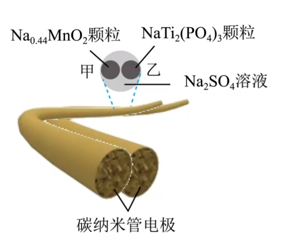

# 【化学】电化学——原电池

## 思维导图

## 基本概念

### 能量转化

将化学能转化为电能的装置。

### 本质

将一个可以自发进行氧化还原反应分开在两个区域进行，将两个区域用导线连接起来，电子则定向的由发生氧化反应的负极流向发生还原反应的正极，从而实现化学能向电能的转化的装置。

## 工作原理

### 原理

氧化还原为中心，两极一液成回路。

- 负极：**失**电子，发生**氧化**反应。
- 正极：**得**电子，发生**还原**反应。
- 电子移动：电子由负极经外电路流向正极。（由负到正）注意：电流是由正到负。
- 离子移动：阳离子往正极移动，阴离子往负极移动。（正正负负）

### 示例

以锌铜电池为例：

【电极反应】

负极：$\ce{Zn - 2e- = Zn^2+}$，氧化反应。

正极：$\ce{Cu^2+ + 2e- = Cu}$，还原反应。

总反应：$\ce{Zn + Cu^2+ = Cu + Zn^2+}$。

【盐桥的组成和作用】

组成：盐桥中装有含 $\ce{KCl}$ 饱和溶液的琼胶。

作用：

- 连接**内电路**，形成闭合回路。**注意：外电路是电子的移动，内电路是离子的移动。**
- 平衡电荷，使原电池不断产生电流。

离子移向：阴离子向负极，阳离子向正极。

## 原电池正负极的判断

### 方法一

可根据电极反应或总反应方程式进行判断：

- 负极：作还原剂、失电子、化合价升高、发生氧化反应。口诀：升 失 氧化 还原剂。
- 正极：作氧化剂、得电子、化合价降低、发生还原反应。

### 方法二

根据外电路中电子流向或电流方向来判断：

- 电子流出/电流流入的一极是负极。
- 电子流入/电流流出的一极是正极。

### 方法三

根据内电路（电解质溶液中）离子的迁移方向来判断：

- 阳离子向正极移动。
- 阴离子向负极移动。

### 方法四

根据原电池的两电极材料来判断：两种金属（或金属与非金属）组成的电极：

- 若它们都与（或都不与）电解质溶液单独能反应，则较活泼的金属作负极。
- 若只有一中电极与电解质溶液能反应，则能反应的电极作负极。

### 方法五

根据电极现象来判断：

- 工作后，电极质量减少，说明该电极金属溶液，失去电子变成金属离子，该电极为负极。
- 电极质量增加或不变，说明溶液中的阳离子在该电极放电生成金属单质或溶液中的阳离子得电子，该电极为正极。

## 应用

### 加快氧化还原反应的速率

一个自发进行的氧化还原反应，设计成原电池时反应速率加快。

例如：纯铁单独不能腐蚀，但当钢铁中存在碳时，会构成原电池，使得钢铁更容易腐蚀。

### 比较金属活动性的强弱

【方法】

**一般情况**下，负极的金属活动性比正极的金属活动性强。

特殊情况：

- 当 $\ce{Mg}$ 与 $\ce{Al}$ 构成原电池，电解质是 $\ce{NaOH}$ 时，$\ce{Mg}$ 单质与 $\ce{NaOH}$ 不反应，但 $\ce{Al}$ 会与 $\ce{NaOH}$ 反应，所以 $\ce{Al}$ 是负极，但是金属活动性 $\ce{Mg > Al}$。
- 当 $\ce{Fe}$ 与 $\ce{Cu}$ 构成原电池，电解质是浓硝酸（常温下）时，铁会发生钝化，$\ce{Cu}$ 与 $\ce{HNO3}$ 发生反应，所以 $\ce{Cu}$ 是负极，但是金属活动性 $\ce{Fe > Cu}$。

【常见规律】

- 电极质量较少，作负极，较活泼。
- 有气体生成，电极质量不断增加或不变作正极，较不活泼。

例如：有两种金属 $A$ 和 $B$，用导线将 $A$ 和 $B$ 连接后，插入到稀硫酸中，一段时间后，若观察到 $A$ 溶解，而 $B$ 上有气体放出（$\ce{2H+ + 2e- = H2 ^}$），则说明 $A$ 作负极，$B$ 作正极，即可判定金属活动性：$A > B$。

### 设计原电池

【依据】已知一个氧化还原反应，首先分析找出氧化剂、还原剂，一般还原剂为负极材料（或在负极上被氧化）、氧化剂（电解质溶液中的阳离子）在正极上被还原。

【选择材料】

- 电极材料：电极材料必须导电。负极材料一般选择较活泼的金属材料，或者在该氧化还原反应中，本身失去电子的材料。
- 电解质溶液：电解质溶液一般能与负极反应。

例如：根据 $\ce{2Fe^3+ + Cu = 2Fe^2+ + Cu^2+}$ 设计电池如下。

### 金属的防护——牺牲阳极法

【原理】利用原电池原理，让被保护金属做正极，一种活泼性较强的金属做负极，用导线相连。

【实例】要保护一个钢闸门，可用导线将其与一块锌块相连，使锌作原电池的负极。如图所示。

## 化学电源

### 一次电池

#### 定义

放电后不可再充电的电池。一次电池中电解质溶液制成胶状，不流动，也叫做干电池。常见的一次电池有普通锌锰干电池、碱性锌锰干电池、纽扣式银锌电池等。

#### 酸性锌锰电池

【结构】石磨棒作正极，锌筒作负极，电解液溶液（氯化铵和氯化锌混合液）用淀粉糊固定化。

【电极反应】

- 负极：$\ce{Zn - 2e- = Zn^2+}$。
- 正极（存疑）：$\ce{2MnO2 + 2NH4+ + 2e- = Mn2O3 + 2NH3*H2O}$。

【特点】

- 优点：制作简单、价格低廉。
- 缺点：易发生自放电而导致存放时间短，放电后电压下降迅速。

#### 碱性锌锰干电池

【结构】负极是 $\ce{Zn}$，正极是 $\ce{MnO2}$，电解质溶液是 $\ce{KOH}$ 溶液。

【电极反应】

- 负极：$\ce{Zn + 2OH- -2e- = Zn(OH)2}$。
- 正极：$\ce{2MnO2 + 2H2O + 2e- =2MnO(OH) + 2OH-}$。
- 总反应：$\ce{Zn + 2MnO2 + 2H2O = 2MnO(OH) + Zn(OH)2}$。

【特点】比能量较高，储存时间较长，可适用于大电流和连续放电。

#### 纽扣式锌银电池

【结构】以锌为负极、银的氧化物为正极，氢氧化钾（或钠）溶液为电解质的纽扣状微型原电池。

【电极反应】

- 负极：$\ce{Zn + 2OH- - 2e- = Zn(OH)2}$。
- 正极：$\ce{Ag2O + H2O + 2e- = 2Ag + 2OH-}$。
- 总反应：$\ce{Zn + Ag2O + H2O = Zn(OH)2 + 2Ag}$。

【特点】比能量大、电压稳定、储存时间长。

### 二次电池

#### 定义

二次电池又称为可充电电池或蓄电池。充电电池在放电时所进行的氧化还原反应，在充电时又可以逆向进行，生成物重新转化为反应物，使充电、放电可在一定时期内循环进行。常见的二次电池有铅蓄电池、镉镍电池、锂离子电池等蓄电池。

#### *铅酸蓄电池

【结构】铅酸蓄电池由两组栅状极板交替排列而成，正极板上覆盖有 $\ce{PbO2}$，负极板上覆盖有 $\ce{Pb}$，稀硫酸作电解质溶液。

口诀：负（付）铅（钱）。

【电极反应】

总反应：
$$
\ce{Pb + PbO2 + 2H2SO4 <=>[放电][充电] 2PbSO4 + 2H2O}
$$
放电时（原电池角度）：

- 负极反应：$\ce{Pb - 2e- + SO4^2- = PbSO4}$。
- 正极反应：$\ce{PbO2 + 2e- + SO4^2- +4H+ = PbSO4 + 2H2O}$。

充电时（电解池角度）：

- 阴极反应（被充电电池的负极）：$\ce{PbSO4 + 2e- = Pb + SO4^2-}$。
- 阳极反应（被充电电池的正极）：$\ce{PbSO4 + 2H2O - 2e- = PbO2 + SO4^2- + 4H+}$。

> 电解池中，被充电电源的正极接外电源正极，被充电电源的负极接外电源负极。（正正负负） 

【特点】常作汽车电瓶，电压稳定，使用方便安全。

#### 锂离子电池

【结构】负极是嵌锂石墨 $\ce{Li_xC_y}$（不是化合物），正极是钴酸锂 $\ce{LiCoO2}$。

【电极反应】

总反应：
$$
\ce{Li_xC_y + Li_{1-x} CoO2 <=>[放电][充电] LiCoO2 + C_y}
$$

- 负极：$\ce{Li_xC_y - $x$e- = xLi+ + C_y}$。
- 正极：$\ce{Li_{1-x}CoO2 + $x$e- + x Li+ = LiCoO2}$。

【反应过程】

放电时，$\ce{Li+}$ 从石墨中脱嵌移向正极，嵌入钴酸锂晶体中，充电时，$\ce{Li+}$ 从钴酸锂晶体中脱嵌，由正极回到负极，嵌入石墨中。这样在放电和充电时，锂离子往返于电池的正极负极之间完成化学能与电能的相互转化。

### 燃料电池

#### 定义

燃料电池是一种连续地将燃料（如氢气、甲烷、乙醇）和氧化剂（如氧气）的化学能直接转化为电能的电化学反应装置，具有清洁、安全、高效等特点。燃料电池的能量转化率可以达到 $80\%$ 以上。

#### 氢氧燃料电池

【结构】负极是 $\ce{H2}$，正极是 $\ce{O2}$（负氢正氧）。

【电极反应】

总反应：
$$
\ce{2H2 + O2 = 2H2O}
$$
$\ce{H2SO4}$ 溶液中：

- 负极：$\ce{H2 - 2e- = 2H+}$。
- 正极：$\ce{O2 + 4e- + 4H+ = 2H2O}$。

$\ce{KOH}$ 溶液中：

- 正极：$\ce{H2 - 2e- -2OH- = 2H2O}$。
- 负极：$\ce{O2 - 4e- + 2H2O = 4OH-}$。

## 电极反应式书写方式

### 第一步

根据题目信息写出电极反应式「架构」，即：

- 负极：$\ce{A - $n$e- -> B}$。
- 正极：$\ce{C + $n$e- -> D}$。

通过化合价变化确认得失电子数，并且需要先搞定「变价元素的原子守恒」。例如，$\ce{C2H5OH}$ 作为正极生成 $\ce{CO2}$，碳元素从 $-2$ 价变成 $+4$ 价，失去六个电子，根据元素守恒可知：
$$
\ce{C2H5OH - 12e- + 3H2O = 2CO2 ^ + 12H+}
$$

### 第二步

调平电荷：

酸性溶液用 $\ce{H+}$、碱性溶液用 $\ce{OH-}$、熔融碳酸盐用 $\ce{CO^2-}$、氧化物电解质用 $\ce{O^2-}$、锂离子电池用 $\ce{Li+}$ 等，按照题目信息灵活调整。

> 在有些题目中可以考虑先「调平电荷」，再「确定得失电子」。

### 第三步

- 水溶液电解质：看 $\ce{H}$ 补 $\ce{H2O}$ 用 $\ce{O}$ 检查。
- 熔融碳酸盐：看 $\ce{C}$ 补 $\ce{CO2}$。

按照题目灵活调整。

### 示例

以 $\ce{C2H6 - O2}$ 燃料电池为例。

在酸性电解液（如 $\ce{H2SO4}$ 溶液）中时：

负极反应如下：
$$
\ce{C2H6 - 14e- + 4H2O = 2CO2 + 14H+}
$$
思路：由于 $\ce{C2H6}$ 最终变为 $\ce{CO2}$，碳元素从 $-3$ 价升到 $+4$ 价，根据元素守恒可知需要失去 $14$ 个电子。同时由于在酸性溶液中，所以用 $\ce{H+}$ 调平电荷，再看氢补水，用 $\ce{O}$ 检查。

正极反应如下：
$$
\ce{O2 + 4e- + 4H+ = 2H2O}
$$
思路：首先可以想到 $\ce{O2}$ 发生还原反应后得到的生成物中含氧物质中氧元素应该是 $-2$ 价，所以有可能是 $\ce{H2O、OH- 、O^2-}$，此时由于在水溶液中且是酸性，所以只有可能是 $\ce{H2O}$，再根据元素守恒调平电荷即可。

总反应：负极反应 $+$ 正极反应消掉电子（即上下电子取最小公倍数再相加）。

---

在碱性电解质（如 $\ce{KOH}$ 溶液）中时：

负极反应如下：
$$
\ce{C2H6 - 14e- + 18OH- = 2CO3^2- + 12H2O}
$$
思路：主要与酸性溶液中负极反应相同。需要注意的是：①$\ce{C2H6}$ 发生氧化反应得到的 $\ce{CO2}$ 会和溶液中的 $\ce{OH-}$ 结合，得到 $\ce{CO3^2-}$ 离子。②调平电荷时，可以知道等式左边带了 $14$ 个正电荷，右边只带了 $4$ 个负电荷，可根据此利用 $\ce{OH-}$ 调平电荷。

正极反应如下：
$$
\ce{O2 + 4e- + 2H2O = 4OH-}
$$
总反应：正极反应 $+$ 负极反应消掉电子。

> 一般题目中给定的「质子交换膜」指的是允许 $\ce{H+}$ 通过的膜，可以理解为电解质溶液是**酸性**。

### 二次电池电极反应式的书写

二次电池在放电状态时，从「原电池」的角度来分析：正极、负极、离子移动是正正负负。

二次电池在充电状态时，从「电解池」的角度来分析：阴极、阳极、离子移动是阴阳相吸。

> 注意：放电时的负极是充电时的阴极。负极失电子，阴极得电子。正极与阳极同理。

若已经写出放电时的电极反应式，则：

- 充电时的阳极反应式：放电时的正极反应式的「逆反应」（反应物与生成物对调，$\ce{+e-}$ 改为 $\ce{- e-}$）
- 充电时的阴极反应式：放电时的负极反应式的「逆反应」（反应物与生成物对调，$\ce{- e-}$ 改为 $\ce{+e+}$）

> 注意：有些题目中二次电池充电时的电极反应式不是放电时电极反应式的「逆反应」，所以一定要根据题目来分析，不能固化思维。所以需要学会融会贯通，除了学习大招所教的普遍性原则，还需要注意题目的特殊情况。

## 原电池原理题型

### 解题技巧及考点

1. 锌铜原电池中，$\ce{Zn^2+}$ 向 $\ce{Cu}$ 电极方向移动，$\ce{Cu}$ 电极附近的 $\ce{H+}$ 由于被消耗所以浓度减小。
2. 锌锰干电池中，锌筒作负极，会发生氧化反应，锌筒变薄。
3. 在 $\ce{N2H4 - O2}$ 清洁燃料电池中，$\ce{N2H4}$ 作为负极，考虑到清洁问题，其生成物应该是 $\ce{N2}$，而不是 $\ce{NO,NO2}$。所以此时，总的电极反应方程式为 $\ce{N2H4 + O2 = N2 + 2H2O}$。所以此时反而不会消耗**电解质溶液**。
4. 题目中涉及到有关「等质量燃料放电量大小比较」的问题，可转化为「等质量对应电极转移电子的物质的量的大小比较」。
5. 锂 - 海水电池中，海水中溶解的氧气作为正极，海水作为电解质溶液。
6. 锂 - 海水电池中，**玻璃陶瓷**具有传导离子和防水的功能。其中传导离子是为了维持电荷守恒，防水是为了防止 $\ce{Li}$ 和水反应，降低放电效率。
7. 以**中性溶液**作为电解质溶液，写电极反应式时，需要遵循「水出酸碱」，即反应后的溶液酸/碱性会越来越强。例如，当 $\ce{O2}$ 为正极，海水作为电解质溶液（近似中性）时，正极反应式为：$\ce{O2 + 4e- + 2H2O = 4OH-}$。最后生成 $\ce{OH-}$ 而非 $\ce{H+}$ 的原因是由于正极失去电子，调平电荷只能用 $\ce{OH-}$。
8. 做电化学题目时，需要关注对应电化学装置的目的，装置的目的可以帮助我们判断正负极、阴阳极，以及对应的电极反应方程式书写。（例如下方例 2）
9. 解决溶液中是否有电解质溶液消耗的问题，可以考虑把正负极总反应方程式写出然后根据方程式判断。

### 例题

例 1：如图所示。

如图所示，该原电池中电子由铁电极流向石墨电极，所以盐桥中的阳离子进入石墨电极溶液中。

根据题目可写出电极反应式：

正极：$\ce{Fe - 2e- = Fe^2+}$。

负极：$\ce{Fe^3+ + e- = Fe^2+}$。

所以电池反应一段时间后，测得铁电极溶液中 $c(\ce{Fe^2+})$ 增加了 $\pu{0.02 mol*L-1}$。石墨电极上未见 $\ce{Fe}$ 析出。由于当 $c(\ce{Fe^2+})$ 增加 $\pu{0.02 mol*L-1}$ 时转移了 $\ce{2e-}$，而根据电极反应可知，当转移电子为 $\ce{2e-}$ 时，负极生成的 $c(\ce{Fe^2+})$ 是正极生成的两倍，所以此时负极溶液中新生成的 $c(\ce{Fe^2+})$ 是 $\pu{0.04 mol*L-1}$，与原溶液中 $c(\ce{Fe^2+})$ 相加可知，此时石墨电极溶液中的 $c(\ce{Fe^2+}) = \pu{0.09 mol*L-1}$。

由实验结果可知，$\ce{Fe^2+}$ 氧化性小于 $\ce{Fe^3+}$（负极体现氧化性的是 $\ce{Fe^3+}$ 而非 $\ce{Fe^2+}$），还原性小于 $\ce{Fe}$（正极体现还原性的是 $\ce{Fe}$ 而非 $\ce{Fe^2+}$）。

---

例 2（多选）（2023 山东卷）：利用热再生氨电池可实现 $\ce{CuSO4}$ 电镀废液的浓缩再生。电池装置如图所示，甲、乙两室均预加相同的 $\ce{CuSO4}$ 电镀废液，向甲室加入足量氨水后电池开始工作。下列说法正确的是（）

A. 甲室 $\ce{Cu}$ 电极为正极

B. 隔膜为阳离子膜

C. 电池总反应为：$\ce{Cu^2+ + 4NH3 = [Cu(NH3)4]^2+}$

D. $\ce{NH3}$ 扩散到乙室将电池电势能产生影响

---

解析：

- A 选项：由于目的是实现 $\ce{CuSO4}$ 浓缩再生，且电解质溶液时氨水，所以甲室中的 $\ce{Cu}$ 应该失电子得到 $\ce{Cu^2+}$，$\ce{Cu^2+}$ 与氨水反应，生成 $\ce{[Cu(NH3)4]^2+}$，所以甲室中的 $\ce{Cu}$ 电极为负极。
- B 选项：若隔膜为阳离子膜，根据离子移动方向是「正正负负」，会使得甲室中的 $\ce{Cu^2+}$ 到乙室，无法浓缩再生 $\ce{CuSO4}$ 溶液，所以隔膜不应该是阳离子膜， 而应该是阴离子膜，使得乙室中的 $\ce{SO4^2-}$ 到甲室，与 $\ce{[Cu(NH3)4]^2+}$ 搭配，促进 $\ce{CuSO4}$ 的浓缩再生。
- C 选项：由题意可知：正极反应：$\ce{Cu^2+ + 2e- = Cu}$，负极反应：$\ce{Cu - 2e- + 4NH3 = [Cu(NH3)4]^2+}$，两式合并可得，总反应为：$\ce{Cu^2+ + 4NH3 = [Cu(NH3)4]^2+}$。
- D 选项：$\ce{NH3}$ 扩散到乙室后，会与 $\ce{Cu^2+}$ 反应得到 $\ce{[Cu(NH3)4]^2+}$，会对电池电动势产生影响。

---

例 3（2023 辽宁省名校联盟 3 月联考）：现为电池的发明为可穿戴电子设备的发展奠定了基础。一种纤维状钠离子电池放电的总反应式为：
$$
\ce{Na_{0.44}MnO2 + NaTi2(PO4)3 = Na_{0.44-x}MnO2 + Na_{1+x}Ti2(PO4)3}
$$
其结构简图如下，下列说法错误的是（）

A. 放电时，$\ce{SO4^2-}$ 向乙极移动

B. 该电池充电时甲极应该与电源的负极相连

C. 放电时乙极的反应式为 $\ce{NaTi2(PO4)3 + xNa+ + $x$e- = Na_{1+x}Ti2(PO4)3}$

D. 工作一段时间后溶液中 $\ce{Na+}$ 浓度几乎不变

---

解析：

首先整体分析，由于 $\ce{Na}$ 的化合价在化合物中只能是 $+1$ 价，且前后 $\ce{O}$ 的化合价不变，所以当 $\ce{Na}$ 下标降低时，$\ce{Mn}$ 的化合价一定升高。所以 $\ce{Na_{0.44}MnO2}$ 发生氧化反应，是负极，所以 $\ce{NaTi2(PO4)3}$ 是正极。

- A 选项：根据负的离子向负极移动，所以 $\ce{SO4^2-}$ 应该向甲极移动。
- B 选项：由于甲极是负极，所以与电源负极相连。
- C 选项：根据题意得 C 选项正确。
- D 选项：正极反应式为：$\ce{Na_{0.44}MnO2 - $x$e- = Na_{0.44-x}MnO2 + xNa+}$，与负极反应式结合发现 $n(\ce{Na+})$ 不变，$V_溶$ 不变，所以 $c(\ce{Na+})$ 几乎不变。

## 二次电池题型强化

### 解题技巧及考点

1. 题目中涉及到的空穴 $\ce{h+}$ 的解释：阳极反应失去 $x$ 个电子，会新增 $x$ 个空穴。
2. 一般情况下，失电子质量减小，得电子质量增加。

---

### 例题

例 1（2022 广东）：科学家基于 $\ce{Cl2}$ 易溶于 $\ce{CCl4}$ 的性质，发展了一种无需离子交换膜的新型电池，可作储能设备（如图）。充电时电极 $a$ 的反应为
$$
\ce{NaTi2(PO4)3 + 2Na+ + 2e- = Na3Ti2(PO4)3}
$$
下列说法正确的是（）

A. 充电时电极 $b$ 是阴极

B. 放电时 $\ce{NaCl}$ 溶液的 $\ce{pH}$ 减小

C. 放电时 $\ce{NaCl}$ 溶液的浓度增大

D. 每生成 $\pu{1mol}~\ce{Cl2}$，电极 $a$ 的质量理论上增加 $\pu{23 g}$。

---

解析：

- A 选项：由于充电时电极 $a$ 得到电子，所以充电时电极 $a$ 是阴极，电极 $b$ 是阳极。
- B 选项：放电时，电极 $b$ 是正极，正极反应为 $\ce{Cl2 + 2e- = 2Cl-}$，根据离子移动的方向是「正正负负」可知，此时生成 $\ce{Cl-}$ 向右移动与 $\ce{NaCl}$ 溶液中的 $\ce{Na+}$ 结合，从而使得 $c(\ce{NaCl})$ 增大。但由于 $\ce{NaCl}$ 是中兴溶液，增大浓度不影响 $\ce{pH}$，所以放电时 $\ce{NaCl}$ 溶液的 $\ce{pH}$ 不变。
- C 选项：根据 B 选项的分析可知，C 选项正确。
- D 选项：根据题意可知，只有当充电时，阳极才会生成 $\ce{Cl2}$。由于充电时，阳极的反应式为 $\ce{2Cl- - 2e- = Cl2}$，所以每转移 $\ce{2e-}$ 就会生成 $\ce{1mol Cl2}$。同时，每转移 $\ce{2e-}$ 时，阴极增加 $\ce{2mol Na+}$，所以每生成 $\ce{1mol Cl2}$，电极 $a$ 质量理论增加 $\ce{46 g}$。

---

例 2：钠离子电池的工作原理与锂离子电池相似，工作示意图如图所示，该电池的总反应为
$$
\ce{Na_xTMO2 + Na_{1-x}C <=>[放电][充电] NaTMO2 +C}
$$
下列说法正确的是（）

A. 放电时，电子从铜箔电极流入铝箔电极，将过渡金属还原到低价

B. 放电时，$\ce{Na+}$ 从负极材料中脱出，经过电解质嵌回正极材料

C. 充电时，铝箔电极与外接电源的正极相连

D. 充电时，阳极反应式为 $\ce{Na_{1-x}C -  (1 - $x$)e- = (1 - $x$)Na+ + C}$

---

解析：

首先整体分析，题目中给定化学方程式中的 $\ce{Na_{1-x}C}$ **并非化合物**，而是 $\ce{Na}$ 镶嵌在碳中，所以这里的 $\ce{Na}$ 是单质，化合价是 $0$ 价。所以放电时，负极的反应式为 $\ce{Na_{1-x}C - (1 - $x$)e- = (1 - $x$)Na+ + C}$；正极可通过 $\ce{Na+}$ 调平电荷，得到反应式 $\ce{NaxTMO2 + (1 - $x$)e- + (1 - $x$)Na+ = NaTMO2}$。

- A 选项：由于铜箔电极是负极，氯铂电极是正极，电子由负极流向正极，过渡金属得电子，被还原到低价态。A 选项正确。
- B 选项：根据放电时溶液中离子移动方向是「正正负负」，所以 $\ce{Na+}$ 由负极移到正极。B 选项正确。
- C 选项：充电时被充电电池的正极与外电源正极相接。C 选项正确 。
- D 选项：充电时，阳极反应式为 $\ce{NaTMO2 - (1 - $x$)e- = Na_xTMO2 + (1 - $x$)Na+}$。D 选项错误。
