# 【化学】选必一：电化学——电解池

## 基本概念

### 能量转化

将电能转变为化学能的装置。

> 电解、电镀和充电都发生在电解池上。

### 工作原理

- 阴极：发生**还原**反应，**得**电子，与外电源**负极**相接。口诀：降 得 还原 氧化剂。
- 阳极：发生**氧化**反应，**失**电子，与外电源**正极**相接。
- 离子移动：阴离子向阳极移动，阳离子向阴极移动。（阴阳相吸）

> 电解池是非自发反应，需要接**外接电源/原电池**，而原电池是自发反应，不需要接外接电源。

## 电解规律

### 阴极产物的判断

#### 考虑谁「得电子」

阳离子或水中的 $\ce{H+}$。注意：$\ce{H2O}$​ 是在水溶液中需要考虑的，其他状态（例如熔融态）不需要考虑。

#### 得电子的顺序（氧化性顺序）

$$
\ce{Ag+ > Fe^3+ > Cu^2+ > H+(酸) > Fe^2+ > Zn^2+ > H+(H2O) > K+,Ca^2+,Na+,Mg^2+,Al}
$$

例如：同时含有 $\ce{Fe^2+,H+}$ 和 $\ce{Cu^2+}$ 的溶液中，先得电子的是 $\ce{Cu^2+}$，再是 $\ce{H+}$，最后是 $\ce{Fe^2+}$​。

对于 $\ce{Fe^3+}$，在溶液中得电子会先还原为 $\ce{Fe^2+}$，$\ce{Fe^2+}$ 再还原成 $\ce{Fe}$​。

对于 $\ce{H+(酸) > H+(H2O)}$ 的理解（拿 $\ce{Fe^2+}$ 作为中间离子举例）：

- 对于 $\ce{H2SO4}$ 和 $\ce{FeSO4}$ 的混合溶液，此时 $\ce{H+}$ 浓度较大，**酸**中的 $\ce{H+}$ 会先得电子，$\ce{Fe^2+}$ 再得电子。
- 对于 $\ce{FeSO4}$ 水溶液，溶液中虽然有极少量**水**电离出的 $\ce{H+}$，但依然是 $\ce{Fe^2+}$ 先得电子，水中的 $\ce{H+}$ 再得电子。

若是电解水溶液中的 $\ce{K+/Ca^2+/Na+/Mg^2+/Al^3+}$，等同电解水（即其中水的 $\ce{H+}$ 得电子最多，其他可忽略不计）。

此时的电极方程式为：
$$
\ce{2H2O + 2e- = H2 ^ + 2OH-}
$$
这就是「放氢生碱」的化学方程式。

### 阳极产物的判断

#### 考虑谁「失电子」

阴离子或水中的 $\ce{OH-}$ 或**电极材料**。

原则：一般情况下，**优先**考虑电极材料。

若是**活性**电极（除 $\ce{Pt,Au}$ 和石墨外）：则金属单质失电子。

若是**惰性**电极（$\ce{Pt,Au}$ 和石墨）：电极材料只导电，不反应。

#### 失电子顺序（还原性顺序）

> 主要是对于惰性电极而言 。

$$
\ce{S^2- > I- > Fe^2+ > Br- > Cl- > H2O(OH-) > 最高价含氧酸根(NO3-,SO4^2-,ClO4- )}
$$

口诀：留（硫）点（碘）铁生锈长氯锰（毛）。**电解池中一般不考虑锰离子。**

若是电解**最高价含氧酸根**（$\ce{NO3-,SO4^2-,ClO4-,PO4^3-,MnO4-}$ 等），等同电解水。

此时的电极方程式为：
$$
\ce{2H2O - 4e- = O2 ^ + 4H+}
$$
这就是「放氧生酸」的方程式。

> 有关电解水：
>
> 阳极是「放氧生酸」，方程式：
> $$
> \ce{2H2O - 4e- = O2 ^ + 4H+}
> $$
> 阴极是「放氢生碱」，方程式：
> $$
> \ce{2H2O + 2e- = H2 ^ + 2OH-}
> $$
> 口诀：「负氢正氧」或「阴氢阳氧」。理解：负极电解水生成氧气，阴极电解水生成氢气。

## 惰性电极电解电解质溶液的四大类型

### 电解水型

总的电解反应式都是电解水方程式的类型。

#### $\ce{H2SO4}$ 溶液

阴极可以得电子的有酸电离的 $\ce{H+}$ 和水电离的 $\ce{H+}$，根据优先顺序可知，此处以酸电离出的 $\ce{H+}$ 得电子为主。

阴极反应式：
$$
\ce{2H+ + 2e- = H2 ^}
$$
阳极可以失电子的有阴离子 $\ce{SO4^-}$ 和水电离的 $\ce{OH-}$，由于 $\ce{SO4^2-}$ 属于**最高价含氧酸根**，所以其失电子可忽略不计。所以整体上相当于以水电离出的 $\ce{OH-}$ 失电子为主。

阳极反应式：
$$
\ce{4H2O - 4e- = O2 ^ + 4H+}
$$
将阴阳极反应式合并得到电解方程式：
$$
\ce{2H2O \xlongequal{电解} 2H2 ^ + O2 ^}
$$

#### $\ce{NaOH}$ 溶液

阴极可以得电子的有阳离子 $\ce{Na+}$ 和水电离的 $\ce{H+}$，由于电解 $\ce{Na+}$ 等同电解水，所以相当于水电离的 $\ce{H+}$ 得电子。

阴极反应式：
$$
\ce{2H2O + 2e- = H2 ^ + OH-}
$$
阳极可以失电子的有 $\ce{NaOH}$ 电离的 $\ce{OH-}$ 和水电离的 $\ce{OH-}$，水电离的 $\ce{OH-}$ 很少，所以主要以 $\ce{NaOH}$ 电离的 $\ce{OH-}$ 失电子为主。

阳极反应式：
$$
\ce{4OH- - 4e- = O2 +2H2O}
$$
将阴阳极反应式合并得到电解方程式：
$$
\ce{2H2O \xlongequal{电解} 2H2 ^ + O2 ^}
$$

#### $\ce{KNO3}$ 溶液

阴极可以得电子的有阳离子 $\ce{K+}$ 和水电离的 $\ce{H+}$，由于电离 $\ce{K+}$ 等同电解水，所以相当于水电离的 $\ce{H+}$ 得电子。

阴极反应式：
$$
\ce{2H2O + 2e- = H2 ^ + 2OH-}
$$
阳极可以失电子的有阴离子 $\ce{NO3^2-}$ 和水电离的 $\ce{OH-}$，由于 $\ce{NO3^2-}$ 属于**最高价含氧酸根**，所以其失电子可忽略不计。所以整体上相当于以水电离出的 $\ce{OH-}$ 失电子为主。

阳极反应式：
$$
\ce{2H2O - 4e- = O2 ^ + 4H+}
$$
将阴阳极反应式合并得到电解方程式：
$$
\ce{2H2O \xlongequal{电解} 2H2 ^ + O2 ^}
$$

#### 总结

电解带有最高价含氧酸根的酸， 其总的电解方程式等价于电解水。

电解大部分强酸，其总的电解方程式也等价于电解水。

#### 电解对象

水。

#### 浓度变化

电解水使得水的含量减少，电解质溶液中溶质浓度增大。

#### $\ce{pH}$ 变化

电解质是酸性，电解后 $\ce{pH}$ 减小。

电解质是碱性，电解后 $\ce{pH}$ 增大。

电解质是中性，电解后 $\ce{pH}$​ 不变。

#### 恢复电解质溶液所加物质

由于水被电解，所以应该加水。

### 电解电解质型

电解质本身被消耗的类型。

#### $\ce{HCl}$ 溶液

同理 $\ce{H2SO4}$ 溶液可知，阴极反应式为：
$$
\ce{2H+ + 2e- = H2 ^}
$$
阳极可以失电子的有阴离子 $\ce{Cl-}$ 和 $\ce{H2O}$ 电离的 $\ce{OH-}$，主要以 $\ce{Cl-}$ 失电子为主。

阳极反应式：
$$
\ce{2Cl- - 2e- = Cl2 ^}
$$
将阴阳极反应式合并得到电解方程式：
$$
\ce{2HCl \xlongequal{电解} H2 ^ + Cl2 ^}
$$

#### $\ce{CuBr2}$ 溶液

阴极可以得电子的有阳离子 $\ce{Cu^2+}$ 和水电离的 $\ce{H+}$，主要以 $\ce{Cu^2+}$ 得电子为主。

阴极反应式：
$$
\ce{Cu^2+ + 2e- = Cu}
$$
同理 $\ce{HCl}$ 溶液可知，阳极反应式为：
$$
\ce{2Br- + 2e- = Br2}
$$
将阴阳极反应式合并得到电解方程式：
$$
\ce{CuBr2 \xlongequal{电解} Cu + Br2}
$$

#### 电解对象

对应电解质。

#### 浓度变化

对应电解质浓度降低。

#### $\ce{pH}$ 变化

酸性电解质溶液 $\ce{pH}$​ 升高。

碱性电解质溶液 $\ce{pH}$ 降低。

中性电解质溶液 $\ce{pH}$ 不变。

#### 恢复电解质溶液所加物质

对应电解质。

### *放氢生碱型

#### $\ce{NaCl}$ 溶液

同理 $\ce{NaOH}$ 溶液可知，阴极反应式：
$$
\ce{2H2O - 2e- = H2 ^ + 2OH-}
$$
同理 $\ce{HCl}$ 溶液可知，阳极反应式：
$$
\ce{2Cl- + 2e- = Cl2 ^}
$$
电解方程式：
$$
\ce{2NaCl + 2H2O \xlongequal{电解} Cl2 ^ + H2 ^ + 2NaOH}
$$
电解对象：$\ce{NaCl}$ 和 $\ce{H2O}$。更加严谨的说，应该是 $\ce{NaCl}$ 中的 $\ce{Cl-}$ 和 $\ce{H2O}$ 电离的 $\ce{H+}$。

浓度变化：$c(\ce{NaOH})$​ 增加。

$\ce{pH}$ 变化：$\ce{pH}$ 增大。

恢复电解质溶液所加物质：根据电解方程式，相当于 $\ce{H:Cl}$ 按照 $\ce{1:1}$ 离开溶液，所以应该加入 $\ce{HCl}$ 恢复电解质溶液。

### *放氧生酸型

#### $\ce{CuSO4}$ 溶液

同理 $\ce{CuBr2}$ 溶液可知，阴极方程式为：
$$
\ce{Cu^2+ + 2e- = Cu}
$$
同理 $\ce{H2SO4}$ 溶液可知，阳极方程式为：
$$
\ce{4H2O - 4e- = O2 ^ + 4H+}
$$
电解方程式：
$$
\ce{2CuSO4 + 2H2O \xlongequal{电解} 2Cu + O2 ^ + 2H2SO4}
$$
电解对象：$\ce{CuSO4}$ 和 $\ce{H2O}$。更严谨的说，应该 $\ce{CuSO4}$ 中的 $\ce{Cu^2+}$ 和 $\ce{H2O}$ 电离出的 $\ce{H+}$。

浓度变化：$c(\ce{H2SO4})$ 增加。

$\ce{pH}$ 变化：$\ce{pH}$​ 降低。

恢复电解质溶液所加物质：

根据电解方程式，相当于 $\ce{Cu:O}$ 两种原子按照 $1:1$ 离开溶液，所以应该加入 $\ce{CuO}$​​ 恢复电解质溶液。

> 注意：
>
> - 加入 $\ce{CuCO3}$ 是可以的，其可以拆解成 $\ce{CuO}$ 和 $\ce{CO2}$，遇到酸会直接反应生成 $\ce{CO2}$​ 离开溶液。
> - 不能加入 $\ce{Cu(OH)2}$，会多引入氢原子和氧原子。

## 电解的应用

### *氯碱工业

> 前置知识——粗盐提纯：
>
> 在含有 $\ce{MgCl2}$ 和 $\ce{CaCl2}$ 的粗盐中提纯 $\ce{NaCl}$：
>
> 先加入过量 $\ce{NaOH}$，使得 $\ce{Mg^2+}$ 沉淀；再加入过量 $\ce{BaCl2}$ 使得 $\ce{SO4^2-}$ 沉淀；最后加入过量 $\ce{Na2CO3}$ 使得 $\ce{Ca^2+}$ 沉淀。最后加入适量盐酸，除去过量的 $\ce{NaOH}$ 和 $\ce{Na2CO3}$。最后可以得到精致饱和 $\ce{NaCl}$ 溶液。
>
> 注意 $\ce{BaCl2}$ 必须在 $\ce{Na2CO3}$ 之前加入。

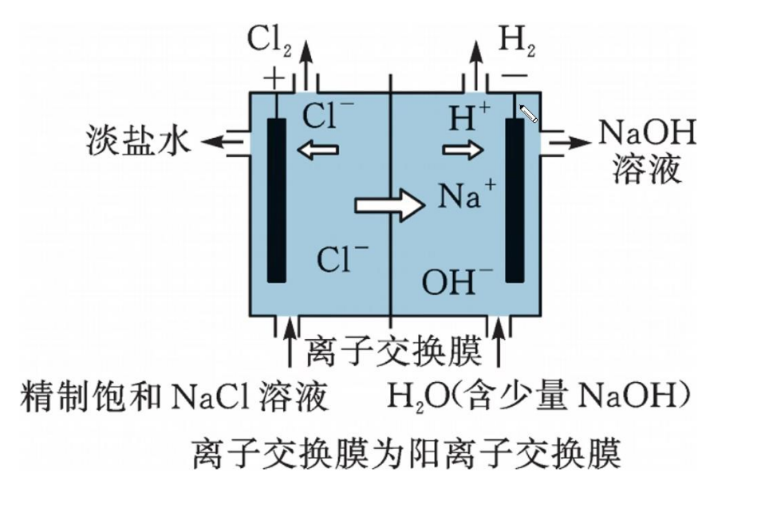

阳极反应式：
$$
\ce{2Cl- - 2e- = Cl2 ^}
$$
阴极反应式：
$$
\ce{2H2O + 2e- = H2 ^ + 2OH-}
$$
注意：虽然水溶液中含有少量 $\ce{NaOH}$，但由于其碱含量不足，所以失电子的主要还是水电离的 $\ce{OH-}$。

总电解方程式：
$$
\ce{2NaCl + 2H2O \xlongequal{电解} H2 ^ + Cl2 ^ + 2NaOH}
$$
注意：这里的「离子交换膜」只能用阳离子交换膜，即只能让 $\ce{Na+}$ 向阴极移动。不能用阴离子交换膜，如果使用阴离子交换膜，会使得 $\ce{OH-}$ 向阳极移动，$\ce{Cl-}$ 会直接跟 $\ce{OH-}$ 发生歧化反应，$\ce{Cl-}$ 就不能失电子产生 $\ce{Cl2}$ 了。如果需要得到 $\ce{HClO}$ 可以使用阴离子交换膜。

所以「离子交换膜」的类型与装置的**目的**有关。

### 电镀

> 以用铁做「待镀金属」，铜做「镀层金属」为例。

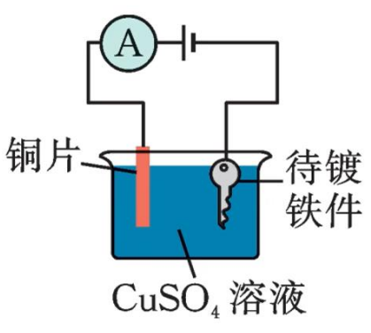

【阴阳极】

待镀金属作阴极，镀层金属作阳极，用含镀层金属离子的电解质溶液作电镀液。

口诀：阳镀阴被镀。

【特点】

一增：阴极质量增加。

一碱：阳极质量减少。

一不变：电解质溶液浓度不变（不考虑水的挥发）。

且阴极增加的质量与阳极减少的质量相等。

### 电解精炼铜

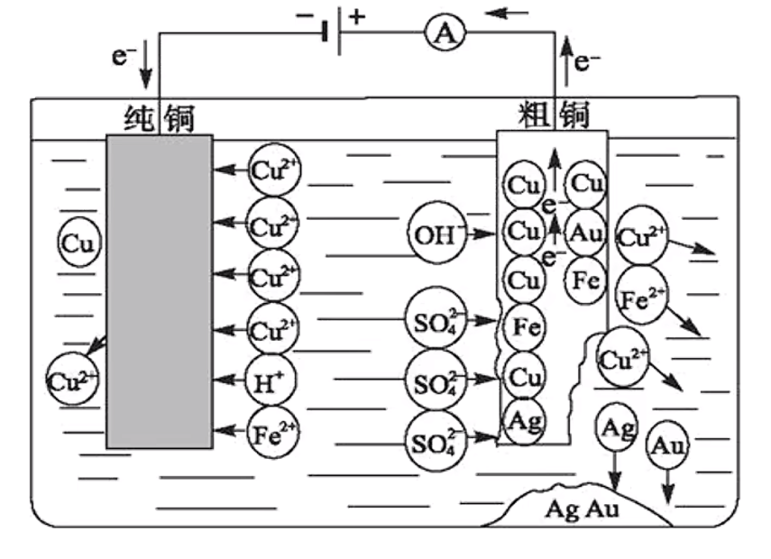

【目的】提纯粗铜。

【电极材料】阳极为粗铜，阴极为纯铜。口诀：阴纯阳粗。

【电解质溶液】含 $\ce{Cu^2+}$ 的盐溶液，如 $\ce{CuSO4}$。

【阴阳极反应】

阳极：

第一阶段：
$$
\ce{Zn - 2e- = Zn^2+}\\
\ce{Fe - 2e- = Fe^2+}\\
\ce{Ni - 2e- = Ni^2+}\\
$$
第二阶段：
$$
\ce{Cu - 2e- = Cu^2+}
$$

> 注意：
>
> - 阳极减少的质量，不是只有 $\ce{Cu}$，还有 $\ce{Zn,Fe}$ 等。
> - 阳极的铜溶解之后，比铜更不活泼的 $\ce{Ag,Au}$ 等金属就会再阳极形成沉积，我们称它为「阳极泥」。

阴极：
$$
\ce{Cu^2+ + 2e- = Cu}
$$

### 电冶金

|        |           阴极           |           阳极            |                          总反应                           |
| :----: | :----------------------: | :-----------------------: | :-------------------------------------------------------: |
| 冶炼钠 | $\ce{2Na+ + 2e- = 2Na}$  | $\ce{2Cl- - 2e- = Cl2 ^}$ |     $\ce{2NaCl(熔融) \xlongequal{电解} 2Na + Cl2 ^}$      |
| 冶炼镁 | $\ce{Mg^2+ + 2e- = Mg}$  | $\ce{2Cl- - 2e- = Cl2 ^}$ |      $\ce{MgCl2(熔融) \xlongequal{电解} Mg + Cl2 ^}$      |
| 冶炼铝 | $\ce{Al^3+ +  3e- = Al}$ | $\ce{2O^2- - 4e- = O2 ^}$ | $\ce{2Al2O3(熔融) \xlongequal[冰晶石]{电解} 4Al + 3O2 ^}$ |

> 注意：
>
> - 冶炼钠和冶炼镁必须是**熔融**状态下的 $\ce{NaCl}$ 和 $\ce{MgCl2}$，如果是**水溶液**，$\ce{Na+}$ 无法在水中得电子得到钠单质。
> - 不能通过熔融状态下的 $\ce{AlCl3}$ 来冶炼铝，因为共价化合物熔融态不导电。
> - 主要选择氯化物来冶炼金属是因为氯化物成本较低。
> - 冰晶石的化学式是 $\ce{Na3AlFe6}$。

## 电解池电极判断

|      |  与外接电源的接法  | 电极反应 | 电子流向 |  离子移向  |
| :--: | :----------------: | :------: | :------: | :--------: |
| 阳极 | 与外接电源正极相连 | 氧化反应 |   流出   | 阴离子移向 |
| 阴极 | 与外接电源负极相连 | 还原反应 |   流入   | 阳离子移向 |

口诀：「阴阳相吸」，即阴离子移向阳极，阳离子移向阴极。

判断技巧：

1. 阴极的电极反应与阴极的电极材料无关，但**阳极的电极反应必须优先考虑电极材料**，若为活性电极，则金属电极本身失去电子；若为惰性电极（如 $\ce{Pt,Au}$ 和石墨等），则电极只导电，不反应。书写电解池的电极反应式时，一定要优先看阳极的电极材料。

2. 若题目已经给出反应物与生成物信息，则按照「阳极、氧化、化合价升高，阴极、还原、化合价降低」确定阴阳极的放电物质。

3. 电解水溶液中的 $\ce{K+,Ca^2+,Na+,Mg^2+,Al^3+}$ 等，阴极的电极反应等同于电解水：
   $$
   \ce{2H2O + 2e- = H2 ^ + 2OH-}
   $$
   即「放氢生碱」，化学计量数：2 2 1 2。

   若用惰性电极电解水溶液中的 $\ce{SO4^2-,NO3-,ClO4-}$ 等最高价含氧酸根离子，阳极的电极反应等同于电解水：
   $$
   \ce{2H2O - 4e- = O2 ^ + 4H+}
   $$
   即「放氧生酸」，化学计量数：2 4 1 4。

## 电解池电极反应式书写

### 第一步

根据题目信息写出电极反应式「架构」。

阳极：
$$
\ce{A - $n$ e- -> B}
$$
阴极：
$$
\ce{C + $n$ e- -> D}
$$
通过化合价变化确认得失电子数，并且需要先搞定「变价元素的原子守恒」。

### 第二步

调平电荷：

酸性溶液用 $\ce{H+}$、碱性溶液用 $\ce{OH-}$、熔融碳酸盐用 $\ce{CO3^2-}$、氧化物电解质用 $\ce{O^2-}$、锂离子用 $\ce{Li+}$ 等，按照题目灵活调整。

### 第三步

配平：

水溶液电解质：看 $\ce{H}$ 补 $\ce{H2O}$，用 $\ce{O}$ 检查；

熔融碳酸盐：看 $\ce{C}$ 补 $\ce{CO2}$.

按照题目灵活调整。

### 示例

以熔融电解池捕获二氧化碳的装置为例。

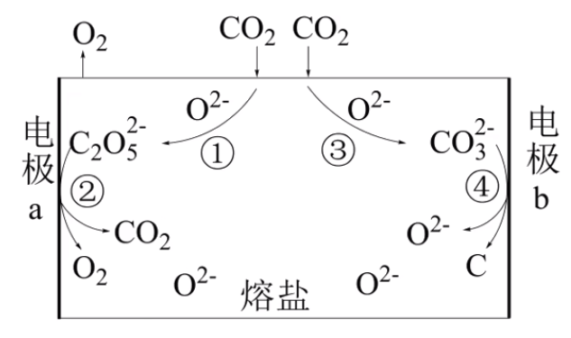

由于 $\ce{CO3^2-}$ 失电子变成 $\ce{C}$，$\ce{C2O5^2-}$ 得电子变成 $\ce{CO2}$，所以电极 $a$ 是阳极，电极 $b$ 是阴极。

阴极反应式：
$$
\ce{CO3^2- + 4e- = C + 3O^2-}
$$
阳极反应式：
$$
\ce{2C2O5^2- - 4e- = 4CO2 ^ + O2 ^}
$$

### 例题

用惰性电极电解硝酸工业的尾气 $\ce{NO}$ 可制备 $\ce{NH4NO3}$，其工作原理如图所示。

为使电解产物全部转化为 $\ce{NH4NO3}$，需向电解产物中补充适量 $\ce{NH3}$。

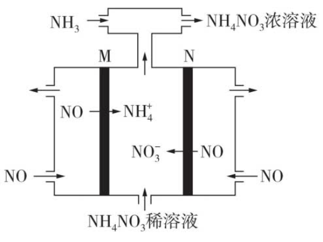

当实际参加反应的 $\ce{NO}$ 为 $\pu{8 mol}$ 时，要将电解产生的硝酸全部转化为硝酸铵，还应至少通入多少 $\pu{mol}$ $\ce{NH3}$？

---

分析：

一般此类计算题需要通过总的电解反应方程式配合「关系式关系量」求解。

阴极反应式：
$$
\ce{NO + 5e- + 6H+ = 3NH4+ + 3H2O}
$$
阳极反应式：
$$
\ce{NO - 3e- + 2H2O = NO3- + 4H+}
$$
合并得到总电解方程式为：
$$
\ce{8NO + 7 H2O \xlongequal{电解} 3NH4NO3 + 2HNO3}
$$
根据 $\ce{8 NO \sim 2HNO3 \sim 2NH3}$ 可知，需要通入 $\ce{2 mol NH3}$。

## 电解池题型强化

### 解题技巧

1. 一般题目中有外接电源就说明是电解池，「通入一定电流」等字眼说明要从电解池角度考虑。
2. 海水中主要含有的离子：$\ce{Na+、Cl-、Mg^2+}$ 等。
3. 涉及到有关电解过程中某离子量的变化问题（包含 $\ce{pH}$ 变化问题），可以考虑根据等物质的量电子的转移时，阴阳极对应离子量的变化来判断。
4. 有机反应中，加 $\ce{H}$ 或去 $\ce{O}$ 发生还原反应。
5. 求电解过程中产生某气体的**体积**，必须知道**温度压强**。只有在标况下，$\pu{1mol}$ 气体的体积才是 $\pu{22.4 L}$。
6. 涉及到离子交换膜通过离子的问题，需要考虑**电解池的目的**，通过电解目的分析反应。
7. 去离子水发生电解等同于电解水。

### 例题

例 1（2022 广东）：以熔融盐为电解液，以含 $\ce{Cu、Mg}$ 和 $\ce{Si}$ 等的铝合金废料为阳极进行电解，实现 $\ce{Al}$ 的再生。该过程中（）

A. 阴极发生的反应为 $\ce{Mg - 2e- = Mg^2+}$

B. 阴极上 $\ce{Al}$ 被氧化

C. 在电解槽底部产生含 $\ce{Cu}$ 的阳极泥

D. 阳极和阴极的质量变化相等

---

分析：

首先考虑整个流程，阳极含有 $\ce{Cu、Mg}$ 等各种杂质，由于单质还原性：
$$
\ce{Mg > Al > Cu}
$$
离子还原性：
$$
\ce{Mg^2+ < Al^3+ < Cu^2+}
$$
所以 $\ce{Mg}$ 会优先于 $\ce{Al^3+}$ 在阳极溶解，但由于氧化性 $\ce{Mg^2+ < Al^3+}$ 所以可以控制电解环境，使得 $\ce{Al^3+}$ 被还原，但 $\ce{Mg^2+}$ 不还原。

$\ce{Cu^2+}$ 氧化性高于 $\ce{Al^3+}$，所以溶液中的 $\ce{Cu^2+}$ 会优先于 $\ce{Al^3+}$ 在阴极还原，为了只让 $\ce{Al^3+}$ 还原，应该控制电解环境使得 $\ce{Cu}$ 在阳极始终不溶解。

- A 选项：只有阳极才会失电子，A 错误。
- B 选项：阴极上 $\ce{Al}$ 被还原，B 错误。
- C 选项：由于 $\ce{Cu}$ 在阳极上始终没有溶解，所以最后在电解槽底部会产生含 $\ce{Cu}$ 的阳极泥，C 正确。
- D 选项：由于阳极上 $\ce{Mg}$ 和 $\ce{Al}$ 都溶解，但阴极上只有 $\ce{Al^3+}$ 被还原为 $\ce{Al}$，所以阴阳极质量变化不相等，D 错误。

---

例 2（2021 全国乙）沿海电厂采用海水为冷却水，但在排水管中生物的附着和滋生会阻碍冷却水排放并降低冷却效率。为解决这一问题，通常在管道口设置一对惰性电极（如图所示），通入一定的电流。下列叙述错误的是（）

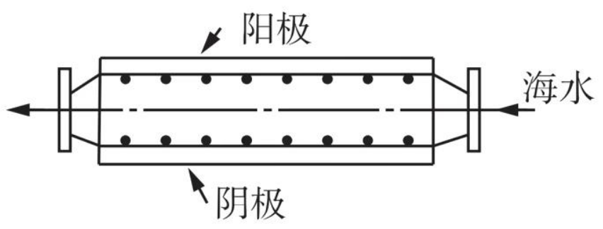

A. 阳极发生将海水中的 $\ce{Cl-}$ 氧化生成 $\ce{Cl2}$ 的反应

B. 管道中可以生成氧化灭杀附着生物的 $\ce{NaClO}$

C. 阴极生成的 $\ce{H2}$ 应及时通风稀释安全地排入大气

D. 阳极表面形成的 $\ce{Mg(OH)2}$ 等积垢需要定期清理

---

分析：

海水中主要的离子有 $\ce{Cl- 、Na+、Mg^2+}$，具体分析如下：

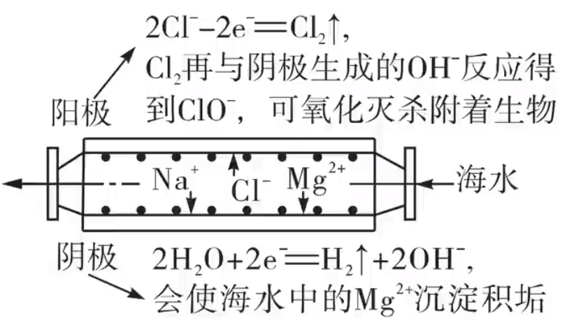

生成的 $\ce{Cl2}$ 与 $\ce{OH-}$ 反应：
$$
\ce{Cl2 + 2OH- = Cl- + ClO- + H2O}
$$
也可以视为：
$$
\ce{Cl2 + 2NaOH = NaCl + NaClO + H2O}
$$

- A 选项：根据上图可以看出 A 正确。

- B 选项：根据上述方程可知 B 正确。

- C 选项：该装置是密闭装置，氢气过量会爆炸，所以 C 选项正确。

- D 选项：阴极产生的 $\ce{OH-}$ 与海水中的 $\ce{Mg^2+}$ 结合生成 $\ce{Mg(OH)2}$，不是阳极，所以 D 错误。

---

例 3（2021 辽宁）利用有机物 $\ce{Q}$ 和 $\ce{QH2}$ 电解转化法从烟气中分离 $\ce{CO2}$ 的原理如图，已知气体可选择通过膜电极，溶液不能通过，下列说法错误的是（）

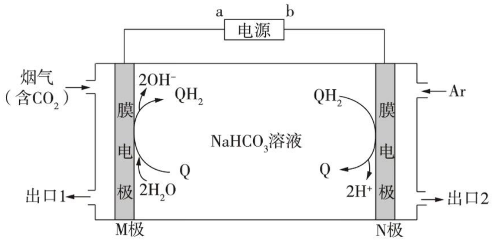

A. $a$ 为电源负极

B. 溶液中 $\ce{Q}$ 的物质的量保持不变。

C. $\ce{CO2}$ 在 $\mathrm{M}$ 极被还原

D. 分离出的 $\ce{CO2}$ 从出口 $2$ 排除。

---

其 他选项容易判断，这里只分析 C D 中涉及 $\ce{CO2}$ 的分离过程。

有下图分析：

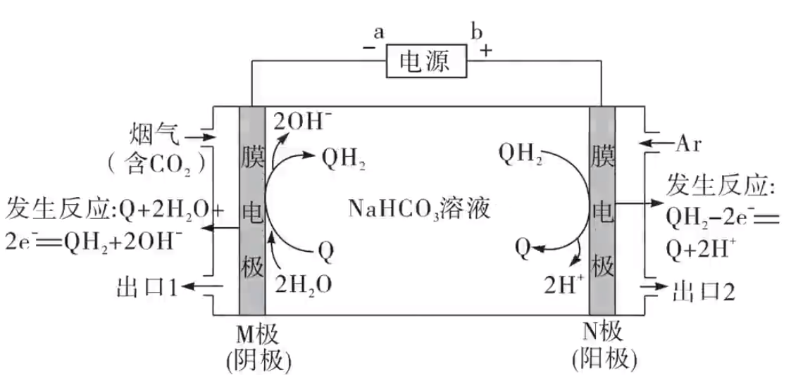

当含有 $\ce{CO2}$ 的烟气从右侧入口进入时，会通过膜电极，与阴极的 $\ce{OH-}$ 反应，生成 $\ce{HCO3-}$，根据「阴阳相吸」，$\ce{HCO3-}$ 离子向右移动会与阳极的 $\ce{H+}$ 反应，生成 $\ce{CO2}$ 和 $\ce{H2O}$，所以 $\ce{CO2}$ 没有被还原，对应分离出的 $\ce{CO2}$ 会从出口 $2$ 排出。

---

例 4（2022 浙江 6 月选考）通过电解废旧锂电池中的 $\ce{LiMn2O4}$ 可获得难溶性的 $\ce{Li2CO3}$ 和 $\ce{MnO2}$，电解示意图如下（其中滤布的作用时阻挡固体颗粒，但离子可自由通过。电解过程中溶液的体积变化忽略不计）。下列说法不正确的是（）

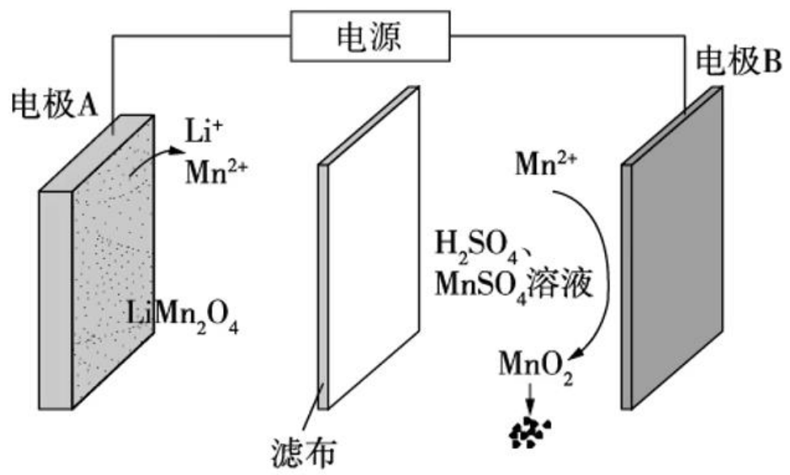

A. 电极 $\mathrm{A}$ 为阴极，发生还原反应

B. 电极 $\mathrm{B}$ 的电极反应：$\ce{2H2O + Mn^2+ - 2e- = MnO2 + 4H+}$

C. 电解一段时间后溶液中 $\ce{Mn^2+}$ 浓度保持不变

D. 电解结束，可通过调节 $\ce{pH}$ 除去 $\ce{Mn^2+}$，再加入 $\ce{Na2CO3}$ 溶液以获得 $\ce{Li2CO3}$。

---

分析：

根据对应离子前后价态变化可知：电极 $\mathrm{A}$ 为阴极，电极 $\mathrm{B}$ 为阳极。

阳极反应式：
$$
\ce{Mn^2+ - 2e- + 2H2O = MnO2 v + 4H+}
$$
由于在 $\ce{H2SO4}$ 溶液中，所以阳极反应式应该用 $\ce{H+}$ 调平电荷。这里的沉淀符号可以不写。

阴极反应式：
$$
\ce{LiMn2O4 + 3e- + 8H+ = 2Mn^2+ + Li+ + 4H2O}
$$
由于 $\ce{Mn(OH)2}$ 是白色沉淀，所以 $\ce{Mn^2+}$ 不能与 $\ce{OH-}$ 在溶液中大量共存，所以应该用 $\ce{H+}$ 调平电荷。

这里反应物中 $\ce{H+}$ 是从阳极反应生成经过滤布（离子交换膜）到阴极的。

- A 选项：根据上述分析可知 A 正确。
- B 选项：根据上述分析可知 B 正确。
- C 选项：阴极生成 $\ce{2Mn^2+}$ 转移 $\ce{3 e-}$，阳极消耗 $\ce{Mn^2+}$ 转移 $\ce{2e-}$，所以转移等量电子，$\ce{Mn^2+}$ 离子的量增加，C 错误。
- D 选项：可通过增加溶液中的 $c(\ce{H+})$ 使得 $\ce{Mn^2+}$ 沉淀为 $\ce{Mn(OH)2}$；再加入 $\ce{Na2CO3}$ 就可以使得 $\ce{Li+}$ 变为 $\ce{Li2CO3}$ 沉淀，D 正确。

---

例 5（2021 湖北）$\ce{Na2Cr2O7}$ 的酸性水溶液随着 $\ce{H+}$ 浓度的增大会转化为 $\ce{CrO3}$。电解法制备 $\ce{CrO3}$ 的原理如图所示。下列说法错误的是（）

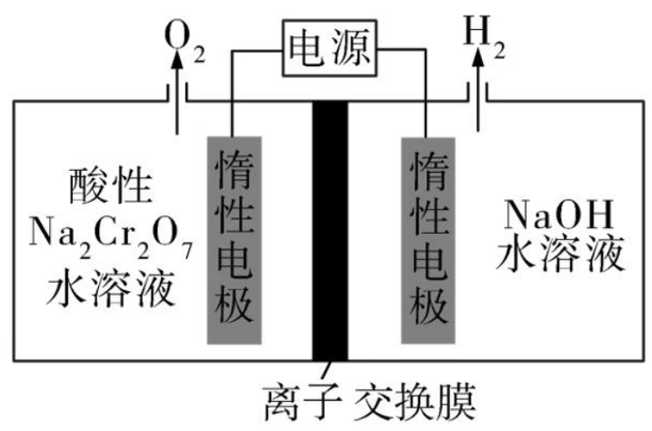

A. 电解时只允许 $\ce{H+}$ 通过离子交换膜

B. 生成 $\ce{O2}$ 和 $\ce{H2}$ 的质量比是 $8:1$

C. 电解一段时间后阴极区溶液 $\ce{OH-}$ 的浓度增大

D. $\ce{CrO3}$ 的生成反应为 $\ce{Cr2O7^2- + 2H+ = 2CrO3 + H2O}$

---

分析：

由于 $\ce{NaOH}$ 和 $\ce{Na2Cr2O7}$ 水溶液的电解反应相当于电解水，且根据「负氢正氧」可知，左边是阳极，右边是阴极。

所以阴极的电解反应式是「放氢生碱」，阳极的电解反应式是「放氧生酸」。

- A 选项：根据题意可知，阳极会生成 $\ce{H+}$，从而使得阳极水溶液 $c(\ce{H+})$ 增大转化为 $\ce{CrO3}$。根据「阴阳相吸」，若 $\ce{H+}$ 通过离子交换膜，会达到阴极，从而使得阳极水溶液 $c(\ce{H+})$ 减小，不能达到目的，A 错误。
- B 选项：电解池总的电解方程式为 $\ce{2H2O \xlongequal{电解} 2H2 ^ + O2 ^}$，所以生成的 $n(\ce{O2}) : n(\ce{H2}) = 8:1$，所以 $m(\ce{O2}) : m(\ce{H2}) = 1\times 32 : 2 \times 2 = 8:1$，B 正确。
- C 选项：由于阴极「放氢生碱」，所以 C 正确。
- D 选项：根据上述分析写出方程式调平电荷可知，D 正确。

---

例 6（2019 全国 II）环戊二烯（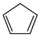)是重要的有机化工材料，广泛用于农药、橡胶、塑料等生产。环戊二烯可用于制备二茂铁[$\ce{Fe(C5H5)2}$，结构简式为 ]，后者广泛应用于航天，化工等领域中。二茂铁的电化学制备原理如图所示，其中电解液为溶解有溴化钠（电解质）和环戊二烯的 $\ce{DMF}$ 溶液（$\ce{DMF}$ 为惰性有机溶剂）。

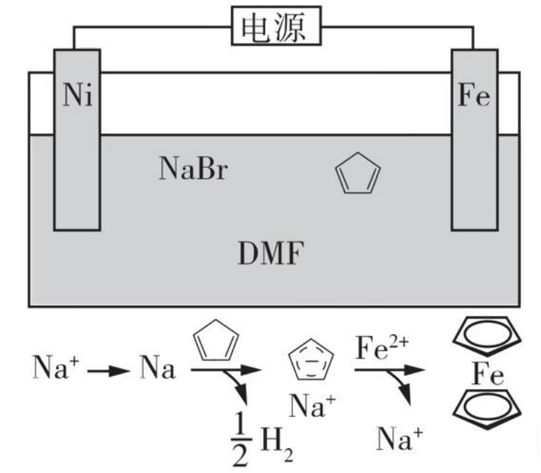

该电解池的阳极是什么，总反应是什么？

电解制备需要在无水条件下进行，原因是什么？

---

分析：

根据图示可知，$\ce{Ni}$ 电极溶液的 $\ce{Na+}$ 会得电子变成 $\ce{Na}$，然后进入环戊二烯的 $\ce{DMF}$ 溶液中，间接氧化为 $\ce{Na+}$，使得环戊二烯还原为负一价离子。同时 $\ce{Fe}$ 在阳极氧化成 $\ce{Fe^2+}$ 与环戊二烯形成的负一价离子反应生成二茂铁。

整体上相当于 $\ce{Fe^2+}$ 失去电子，将电子移向 $\ce{Ni}$ 使得 $\ce{Na+}$ 得电子，再在溶液中氧化，间接还原环戊二烯。即铁丢电子最终给了环戊二烯。

根据分析可知，阳极为 $\ce{Fe}$，总反应为：

$\ce{Fe + 2}$  $\ce{\xlongequal{电解}}$ 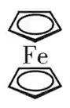$\ce{+ H2 ^}$ 

如果在**有水**条件下进行反应，间接转移电子的 $\ce{Na+}$ 就会与水反应，从而阻碍中间产物 $\ce{Na}$ 的生成。同时在水中 $\ce{Fe^2+}$ 会水解产生 $\ce{Fe(OH)2}$，消耗 $\ce{Fe^2+}$，导致二茂铁的产量大幅降低。

所以原因有两点：

- 有水会使得 $\ce{Na+}$ 直接与水反应，阻碍中间产物 $\ce{Na}$ 的产生；
- $\ce{Fe^2+}$ 会与水反应被消耗，使得二茂铁的产量降低。

