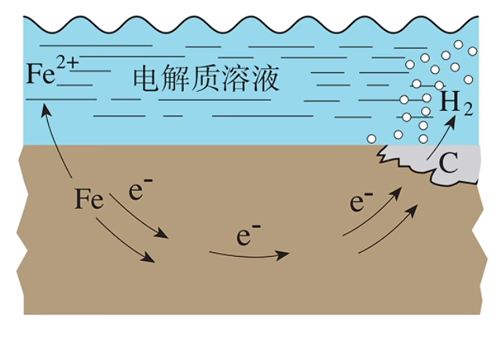
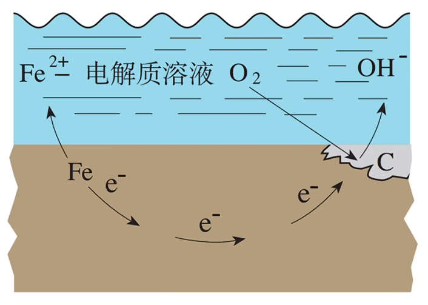
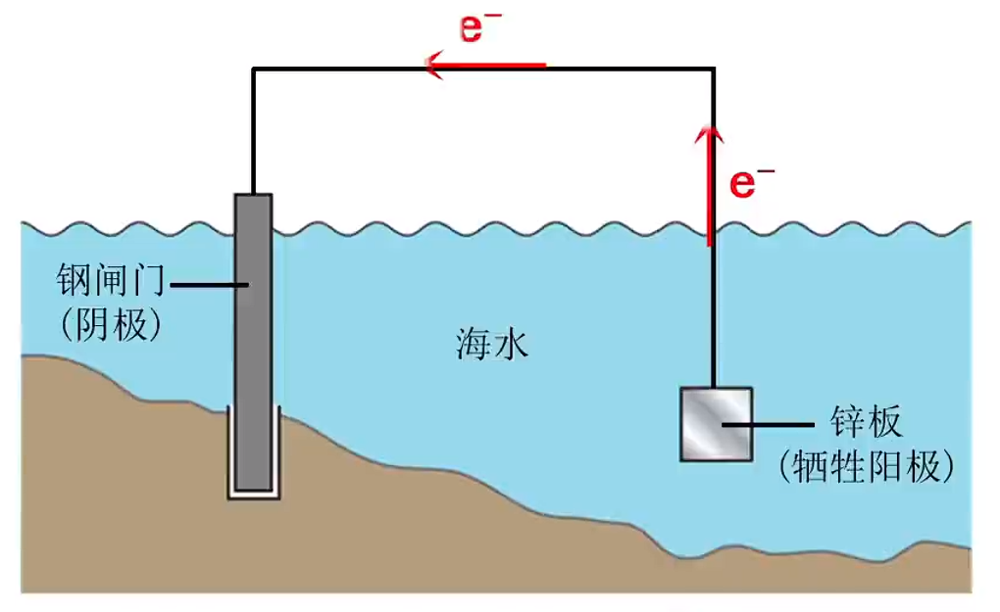
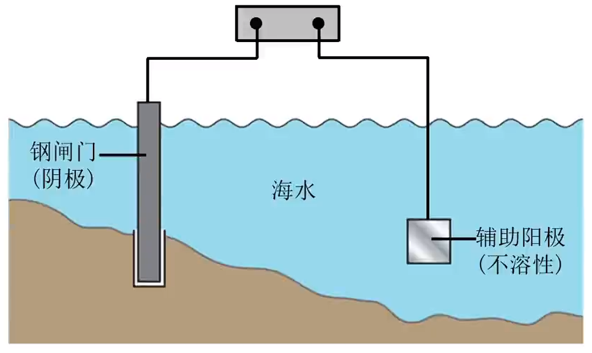

# 【化学】选必一：金属的腐蚀与防护

## 金属的腐蚀

### 定义

金属或合金与周围的气体或液体发生**氧化还原反应**而引起的损耗现象。

### 实质

金属原子失去电子，被氧化，即：
$$
\ce{M - ne- = M^n+}
$$
例如：铁的腐蚀指铁单质失去电子变成二价铁；铜腐蚀形成铜绿（碱式碳酸铜 $\ce{Cu2(OH)2CO3}$）。

> 注意：电化学中铁的腐蚀一般指 $\ce{Fe -> Fe^2+}$，被氧气氧化是 $\ce{Fe -> Fe^3+}$。

### 分类

由于与金属接触的气体或液体物质不同，发生腐蚀的情况也不同，一般可分为**化学腐蚀**和**电化学腐蚀**。

电化学腐蚀和化学腐蚀往往同时发生，但电化学腐蚀更普遍，腐蚀速率更快，危害也更严重。

#### 化学腐蚀

定义：金属与其表面接触的一些物质（如 $\ce{O2 、Cl2 、SO2}$ 等）**直接**反应而引起的腐蚀。

特点：无电流产生。

影响因素：与金属本性、接触物质的氧化性及温度有关。

#### 电化学腐蚀

定义：不纯金属接触到电解质溶液发生原电池反应，比较活泼的金属发生氧化反应而被腐蚀。

特点：有微弱电流产生。

## *钢铁的电化学腐蚀

### 析氢腐蚀

发生条件：**水膜酸度较高**的特殊环境（如某些工厂附近的酸性气氛）。

负极（$\ce{Fe}$）：
$$
\ce{Fe - 2e- = Fe^2+}
$$
正极（$\ce{C}$）：
$$
\ce{2H+ + 2e- = H2 ^}
$$
总反应：
$$
\ce{Fe + 2H+ = Fe^2+ + H2 ^}
$$

### 吸氧腐蚀

发生条件：在钢铁表面吸附的**水膜酸性很弱或呈中性**，但溶有一定量的**氧气**，此时会发生**吸氧腐蚀**。

负极（$\ce{Fe}$）：
$$
\ce{Fe - 2e- = Fe^2+}
$$
正极（$\ce{C}$）：
$$
\ce{O2 + 4e- + 2H2O = 4OH-}
$$
总反应：
$$
\ce{2Fe + O2 + 2H2O = 2Fe(OH)2 v }
$$

> 注意：电极反应不写 $\ce{Fe(OH)2}$ 的原因是刚开始反应是溶液中的 $\ce{OH-}$ 不够高，$\ce{Fe^2+}$ 大多不会与 $\ce{OH-}$ 结合。而随着反应的进行，$\ce{Fe^2+}$ 会与 $\ce{OH-}$ 生成 $\ce{Fe(OH)2}$ 沉淀。

后续反应：
$$
\ce{4Fe(OH)2 + O2 + 2H2O = 4Fe(OH)3 -> Fe2O3*nH2O}
$$
其中 $\ce{Fe2O3*nH2O}$ 是铁锈的化学式。

## 金属的防护

### 改变金属材料组成

例如，铁加入铬和镍等金属，可以制成不锈钢盆、不锈钢高压锅，加入钛金属可以制成钛合金炒锅。

###  在金属表面覆盖保护层

例如，包裹材料、涂矿物性油脂、搪瓷、喷漆、镀铬、发蓝处理等。

### 电化学保护法

金属在发生电化学腐蚀时，总是作为原电池负极（阳极）的金属被腐蚀，作为正极（阴极）的金属不被腐蚀。如果能使被保护的金属称为阴极，则该金属就不易被腐蚀。

#### 牺牲阳极法

原理：**原电池**原理。

电极要求：被保护的金属作**正极**，活泼性更强的金属作**负极**。

应用：锅炉内壁、船舶外壳安装镁合金或锌块。

> 注意：
>
> - 牺牲锌块来保护钢闸门，锌块必须定期更换。
> - 如果在铁上镀锡，由于金属活动性 $\ce{Fe > Sn}$，所以如果镀锡铁出现缺口，水膜产生直接形成原电池，铁作阳极会直接加速被腐蚀。

#### 外加电流法

原理：**电解池**原理。

点击要求：被保护的金属作**阴极**，与电源的负极相连。

应用：钢铁闸门，地下管道连接电源负极。

## 金属的腐蚀与保护题型

### 解题技巧&注意事项

1. 利用牺牲阳极，在铁上镀锌后，若镀层有破损，则将有破损的镀锌铁片直接放入到电解质溶液中会直接形成原电池，由于金属活动性 $\ce{Zn > Fe}$，所以锌做负极，铁做正极，牺牲锌来保护铁。

2. 淀粉碘化钾可以检验溶液中 $\ce{Fe^3+}$ 的存在。根据反应：
   $$
   \ce{2Fe^3+ + 2I- = 2Fe^2+ + I2 }
   $$
   可知若溶液中含有 $\ce{Fe^3+}$ 则加入碘化钾后生成碘单质，遇到淀粉溶液变蓝。

3. 加入铁氰化钾 $\ce{K3[Fe(CN)6]}$ 可以验证溶液中是否存在 $\ce{Fe^2+}$，两者反应会生成 $\ce{KFe[Fe(CN)6]}$ 蓝色沉淀。

4. 原电池不可能让化学能**全部**转化为电能。

5. 钢铁设施在海水中腐蚀速率会比在河水中快，因为海水中含有的电解质比河水中多，电解质浓度增大会加速电子的转移速率，从而加大腐蚀速率。

6. 铁棒浸润在水中，在水与空气的交界处腐蚀最快。

7. 将铁氰化钾 $\ce{K3[Fe(CN)6]}$ 直接加入到含有铁棒的溶液中，由于铁氰化钾中的铁是正三价，所以有可能直接与铁单质发生氧化还原反应生成蓝色沉淀，所以不能验证铁是否被腐蚀；应该取出少量的 $\ce{Fe}$ 附近的溶液滴加 $\ce{K3[Fe(CN)6]}$ 来验证铁是否被腐蚀。

8. 在外加电流法中，如果铁没有被保护，那么会失去电子，使得其表面腐蚀，有微弱电流通过；外加电流后， 会保护铁不被腐蚀（氧化）从而使得铁表面腐蚀电流接近于 $0$。

9. 若题目中涉及到**惰性辅助电极**，则说明该电极不会直接参与氧化反应，不会被损耗。

10. 在不同的电解环境中，铁腐蚀的程度不同，所以在外加电流法中，通入的保护电流应该根据环境条件变化进行调整。

