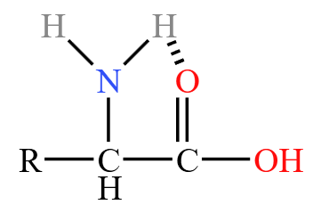

# 【化学】选必三：合成高分子&生物大分子

## 加聚反应

### 基本概念

#### 聚合反应

由小分子化合物合成高分子化合物的反应叫聚合反应。

分类：

- 加成聚合反应：由分子间通过加成反应生成高分子的反应，简称**加聚反应**。
- 缩合聚合反应：由分子间通过缩合反应生成高分子的反应，简称**缩聚反应**。
- 开环聚合反应。

#### 高分子化合物

概念：高分子化合物一般是指由成千上万个原子以**共价键**连接形成的、相对分子质量很大（$10^4\sim 10^6$ 甚至更大）的化合物，又称大分子化合物，简称高分子或大分子。高分子多是由小分子通过聚合反应而生成的，因此也称**高聚物或聚合物**。

分类：分为**线型高分子**和**体型高分子**。

特点：高分子化合物均为**混合物**。

基本知识：

以聚乙烯 PE  为例：

- 单体：形成高分子化合物的小分子化合物。聚乙烯中的单体是乙烯 $\ce{CH2=CH2}$。
- 链节：重复结构单元。聚乙烯中的链节是 $\ce{-CH2-CH2 -}$。注意：单体和链节之间必须是对应的。
- 聚合度：链节数目 $n$。$n$ 不是一个确定的数值，而是一个范围，所以高分子一定是混合物。

### 单体加聚

#### 合成热塑性材料

塑料的分类：

- 热塑性材料：可以反复加热熔融加工，如聚乙烯、聚丙烯、聚氯乙烯。
- 热固性材料：不能加热熔融，只能一次成型，如酚醛树脂，聚氨酯。

常见的热塑性材料加聚：

丙烯加聚得到聚丙烯：

由于聚丙烯循环部分外两端不再连有其它东西，所以属于「无端基」的加聚。

氯乙烯加聚得到聚氯乙烯 PVC：

曾经经常用于制作塑料袋。

聚苯烯加聚得到聚苯乙烯 PS：

上文提过的甲基丙烯酸甲酯，在一定条件下可以聚合为聚甲基丙烯酸甲酯 PMMA：

PMMA 是**有机玻璃**的主要成分，即亚克力材料，加入玻璃纤维可以得到复合材料。

#### 合成橡胶

$1,3-$ 丁二烯加成，遵循「$1,4-$ 加成，$2,3-$ 双键」得到 $\ce{CH3-CH=CH-CH3}$，再发生加聚反应，得到**顺丁橡胶**，如下：

> 注：
>
> - 顺丁橡胶是顺反异构中的顺式。
> - 由于顺丁橡胶中含有碳碳双键，比较稳定，能保持键角基本不变，被弯曲压缩后容易恢复原形，所以具有很好的弹性，所以可以做橡胶。
> - 装高锰酸钾的玻璃瓶不能用橡胶塞，碱式滴定管不能装酸性高锰酸钾，因为高锰酸钾会腐蚀橡胶。

异戊二烯发生加聚反应得到**顺式聚异戊二烯**，是**合成橡胶**的主要成分。

> 注意：天然橡胶中不存在顺式聚异戊二烯这种结构。天然橡胶一般是**反式**。

**异戊二烯**也能发生加聚反应得到**反式聚异戊二烯**，是**杜仲胶**的主要成分。

> 注意：杜仲胶是天然橡胶，属于反式异构。

#### 合成纤维

丙烯腈聚合得到**聚丙烯腈**，是**腈纶**的主要成分，如下：

甲醛中的碳氧键可以加聚，得到**人造象牙**的主要成分，表面具有光泽，如下：

$3$​ 个甲醛可以加聚成环，如下：

> 注：
>
> - 三聚反应主要会成**六元环**。
> - 加聚成环类似的还有**乙炔**加聚得到**聚炔**，是导电高分子。三个乙炔也可以加聚得到环状物质**三炔电门**。

氰胺中碳氢三键加聚会得到**三聚氰胺**，多用于涂料，如下：

### 多种单体加聚（共聚）

乙烯和丙烯共聚：

> 注意： 和  两种结构实际上等价，因为从链的角度来说，它们都是**每隔三个碳连一个甲基**。

### 题型——判断单体

模型：给定一个聚合物，问它是哪些单体加聚而成的。

求解：一般情况下，链节大部分有两个碳或四个碳，所以可以根据此判断高聚物是由哪些单体加聚得到的。

## 缩聚反应

### 酚醛树脂

#### 相关知识

酚醛树脂属于**热固性材料**，不能加热熔融，只能一次成型。

酚醛树脂是最早生产和使用的合成树脂，不易燃烧，具有良好的电绝缘性，被广泛用来生产电灯开关等电器用品，例如锅把、电灯的开关等，俗称电木或电玉。

#### 合成线性酚醛树脂

【实验操作】

【实验原理】

在 $\ce{H+}$​​ 的催化作用下，等物质的量的苯酚与甲醛反应，苯酚邻位或对位的氢原子与甲醛的羰基加成生成羟甲基苯酚，然后羟甲基苯酚之间相互脱水缩合形成线型高分子。

> 注意：为了防止苯酚邻对位上有多个位置与甲醛反应被取代，必须**严格控制苯酚与甲醛的物质的量之比为 $1:1$**。

【反应方程式】

**邻羟甲基苯酚缩合**

加成：

根据电负性和键的极性，氢会和氧加成，苯环会和碳加成，如下：

缩聚：

总反应：

**对羟甲基苯酚缩合**

加成：

缩聚：

在实际情况下，一般对、邻羟甲基会互相缩聚，一般不会存在单独只有对羟甲基苯酚缩合的情况。

> 缩聚实例——对苯甲酚与丙醛发生缩聚反应：
>
> 
>
> 注意：
>
> - 这里不存在对位加成，因为 $\ce{-OH}$​ 的对位只有甲基，没有氢。
> - 生成物中 $\ce{CH2CH3}$ 必须连在 $\ce{CH}$ 下面，即支链上，不能连在主链上，因为 $\ce{H}$ 与 $\ce{O}$ 结合到的 $\ce{OH}$ 必须连在最外面（需要脱水缩合），如果将 $\ce{CH2CH3}$ 连在主链内部从键的角度上不存在这种物质。
> - 书写的时候，可以先写出苯环和两边的 $\ce H$​，再补其它物质。
> - 计算 $\ce{H2O}$ 的化学计量数，可以通过前面反应物中一共有 $2n$ 个氧（对苯甲酚有 $n$ 个，丙醛有 $n$ 个），生成物的缩聚物**链节**中一共有 $n$ 个氧，**链节外部**有 $1$ 个氧，所以水中有 $2n - (n + 1) = n-1$ 个氧，即 $n-1$ 个水。

#### 合成网状酚醛树脂

【实验操作】

【实验原理】

在 $\ce{OH-}$ 催化下，苯酚与过量的甲醛反应，生成羟甲基苯酚的同时，还生成而羟甲基苯酚、三羟甲基苯酚等，继续反应可生成网状酚醛树脂。

【化学方程式】

加成：

脱水缩合后得到网状酚醛树脂：

> 注：
>
> - 这种网状酚醛树脂**不溶于乙醇**，化学性质很稳定。
> - 通过得到的有机高分子区分加聚和缩聚：一般有端基的是脱水缩合，即缩聚得到；无端基的是加聚反应得到。
> - 区分酸催化和碱催化得到的酚醛树脂：酸合成的是**线型的**，可以溶于乙醇；碱合成的是**体型的**，不能溶于乙醇。

> 拓展——脲醛树脂：
>
> 脲醛树脂一般用于接线板上的塑料，是使用**尿素**和**甲醛**缩聚而成的，如下：
>
> 
>
> 实际上将酚醛树脂中的苯酚改成尿素，就是脲醛树脂。二者考法完全一致。糠醛树脂同理。

### 聚酯和聚酰胺

#### 纤维的分类

纤维是指天然或人工合成的细丝状物质。

说明：

- 天然纤维主要指的是**棉麻毛丝**，其中**棉麻**的主要成分是**糖类**，**毛丝**的主要成分是**蛋白质**。
- 人造纤维介于天然纤维和合成纤维之间。
- 合成纤维中的六大纶指的是**腈丙涤氯维锦**。

#### 聚酯纤维的合成

聚酯纤维中含有的主要官能团是**脂基**。

合成纤维中产量最大的是聚酯纤维中的**涤纶** PET，学名是聚对苯二甲酸乙二酯。

> 注意：类似以上 $2+2$ 系列的聚酯纤维，可以先酯化得到一个然后再脱水缩合，脱水缩合时遵循「酸脱羟基醇脱氢」。

> 用途：涤纶可用于制作饮料瓶。

乳酸单独也可以缩聚形成聚酯纤维，可以使得羟基羧基共线，然后加上括号如下：

有的时候不一定是「酸脱羟基醇脱氢」，例如下面的方程式是「酰氯脱氯醇脱氢」。

> 注意：如果一个物质同时具有羧基和氢（或氯和氢），就可以发生缩聚反应生成聚酯纤维。

> 注：上述方程式可以形成**氯纶**。

#### 聚酰胺纤维的合成

聚酰胺纤维中含有的主要官能团是**酰胺基**。

聚酰胺纤维中的**锦纶**是较早面世的合成纤维之一，锦纶 66（尼龙 66，聚己二酰己二胺）的合成如下：

遵循了「酸脱羟基氨脱氢」。

> 注：同样地，如果一个物质中同时含有羧基和氨基，就可以发生缩聚反应「酸脱羟基氨脱氢」得到聚酰胺纤维。

#### 维纶的合成

聚乙烯醇 PVA 和甲醛反应可用于生成维纶（聚乙烯醇缩甲醛）。

**合成聚乙烯醇**

乙烯醇很不稳定（在讲乙炔水化时讲过乙烯醇「烯醇式重排」会形成乙醛），所以不能利用乙烯醇单体制备聚乙烯醇。

可通过如下的方法合成聚乙烯醇。

【醋酸乙烯酯加聚】

加聚后，生成的高分子链节中的 $\ce{CH3COO -}$ 实际上可以发生水解反应，生成聚乙烯醇。

【酯交换反应】

根据「酯脱 $\ce{OR}$ 醇脱氢」，可生成聚乙烯醇 PVA，如下：

**合成维纶**

前置知识——半缩醛反应：

醛 $\ce{RCHO}$ 上的氧被称为羰基氧，一般容易结合两个活泼的氢，例如醛可以使得乙二醇的两个羟基上的氢离去生成水，如下：

得到的生成物可以通过某些条件水解回到反应物。

> 酮也会有类似的反应。

那么用聚乙烯醇和甲醛可以生成维纶：

> 拓展：
>
> - 如果合成的聚乙烯醇是 ，那么根据上述方程式可知需要的甲醛应该是 $\dfrac n 2$ 份，即**每两个链节用一个甲醛**，同样生成的维纶角标也应该是 $\dfrac n 2$ 份，生成的水也是 $\dfrac n 2$。
> - 得到维纶的每一个链节中都含有一个六元环。一般情况下，若题目中已知高聚物的角标是 $\dfrac n 2 $，且链节中含有一个六元环，那么一定是类似维纶的结构。
> - 除了甲醛外，也可以使用其它醛进行半缩醛反应，得到 PVB 等不同的高聚物，但结构都很相似。

> 一个实例：
>
> 
>
> 这是**聚碳酸酯**，根据结构式可以看出，它是酯交换反应得到的，即「酯脱 $\ce{OR}$ 醇脱氢」，同时链接内部，从下图所示箭头方向断开，可以看出它是 $2+2$ 发生酯化得到的。所以是先**酯化**再**酯交换**得到的。
>
> 

> 拓展——开环聚合：
>
> 
>
> 按照箭头所示的方向断开碳氧键，然后开环聚合。
>
> 开环聚合的过程中没有脱去小分子，也没有端基，是**绿色化学**的主要反应。
>
> 开环聚合发生的条件：是一个**环酯**或**环酰胺**。

## 糖类物质

### 组成和分类

#### 组成

糖类一般由 $\ce{C、H、O}$ 三种元素组成，大多数可用通式 $\ce{C_m(H2O)_n}$ 来表示。

> 注意：糖不一定符合通式 $\ce{C_m(H2O)_n}$，例如脱氧核糖 $\ce{C5H10O4}$，符合通式 $\ce{C_m(H2O)_m}$ 的也不一定是糖，例如甲醛 $\ce{HCHO}$。

#### 结构

从分子结构上看，糖类是多羟基醛，多羟基酮和它们的脱水缩合物。

#### 分类

根据水解情况，糖类分为单糖、寡糖和多糖。

- **不能水解**的糖称为**单糖**，例如葡萄糖 $\ce{C6H12O6}$，果糖 $\ce{C6H12O6}$，核糖 $\ce{C5H10O5}$，脱氧核糖 $\ce{C5H10O4}$。
- $\pu{1 mol}$ 糖水解后能产生 $\pu{2\sim 10 mol}$ 单糖的称为**寡糖**或**低聚糖**，如蔗糖、麦芽糖、乳糖（分子式都是 $\ce{C12H22O11}$）。
- $\pu{1 mol}$ 糖水解后能产生 $\pu{10 mol}$ 以上单糖的称为**多糖**，如淀粉、纤维素（分子式都可表示为 $\ce{(C6H10O5)_n}$）。

> 注意：
>
> - 葡萄糖酿酒的过程**不是葡萄糖水解**，它是单糖，不能水解，酿酒属于葡萄糖的无氧呼吸。
> - 寡糖中的**蔗糖**和**麦芽糖**都是**二糖**，即 $\pu{1 mol}$ 糖水解后产生 $\pu{2 mol}$ 单糖。

### 单糖

#### 葡萄糖和果糖的结构

葡萄糖和果糖互为**同分异构体**。

葡萄糖分子中含有一个醛基和五个羟基，是一种六碳醛糖。

果糖是自然界中甜度最高的单糖，是一种六碳酮糖。

#### 葡萄糖的化学性质

**还原性**

【与弱氧化剂反应】

葡萄糖作为醛，与银氨溶液反应，得到葡萄糖酸铵；与氢氧化铜悬浊液反应，得到葡萄糖酸钠。
$$
\ce{CH2OH(CHOH)4CHO + 2 Ag(NH3)2OH ->[\Delta] H2O + 2 Ag v + 3 NH3 + CH2OH(CHOH)4COONH4}\\
\ce{CH2OH(CHOH)4CHO + 2 Cu(OH)2 + NaOH ->[\Delta] Cu2O v + CH2OH(CHOH)4COONa + 3 H2O}
$$
【呼吸作用】

有氧呼吸：
$$
\ce{C6H12O6 + 6 O2 ->[酶] 6CO2 + 6H2O}
$$
相当于 $6$ 个 $0$ 价的碳（后面的氢和氧整体相当于 $6$ 个水，所以前面是 $6$ 个 $0$ 价的碳），变成 $6$ 个 $+4$ 价的碳，$12$ 个 $0$ 价的氧变成 $12$ 个 $-2$ 价的氧。

无氧呼吸：
$$
\ce{C6H12O6 ->[酒化酶] 2C2H5OH + 2 CO2}
$$
即在酒化酶的作用下，生成乙醇。

同时无氧呼吸在人体内形成乳酸 $\ce{C3H6O3}$，结构为 $\ce{CH3CHOHCOOH}$。

**酯化反应**

根据葡萄糖的结构可知，$\pu{1 mol}$ 葡萄糖与乙酸发生酯化反应，最多消耗 $\pu{5 mol}\ \ce{CH3COOH}$。

**氧环式结构**

葡萄糖分子中的羟基和醛基相互作用会形成氧环式结构。

葡萄糖水溶液中，存在链式结构与两种氧环式结构的平衡：

其中 $\alpha-D-$ 葡萄糖和 $\beta - D -$ 葡萄糖互为同分异构体，两种氧环式结构可以互相转换。

### 双糖

双糖又称二糖，常见的有麦芽糖和蔗糖。

麦芽糖含有醛基，蔗糖不含醛基。麦芽糖是还原性糖，蔗糖不是。

#### 还原性糖

含有游离醛基或酮羰基的单糖（例如葡萄糖、果糖）、含有游离醛基的二糖（例如麦芽糖）都具有还原性。

> 注意：蔗糖不是还原性糖。高中阶段三大还原性糖是「麦果葡」。还原糖都能发生银镜反应。

#### 水解反应

蔗糖水解：
$$
\ce{C12H22O11(蔗糖) + H2O ->[酸或酶][\Delta] C6H12O6(葡萄糖) + C6H12O6(果糖)}
$$
即一分子蔗糖水解得到一分子葡萄糖和一分子果糖。

麦芽糖水解：
$$
\ce{C12H2O11(麦芽糖) + H2O ->[酸或酶][\Delta] 2C6H12O6(葡萄糖)}
$$
即一分子麦芽糖水解得到两分子葡萄糖。

### 多糖

常见的多糖有淀粉和纤维素，它们都属于天然有机高分子化合物，通式为 $\ce{(C6H10O5)_n}$，**没有甜味**且不溶于水。

> 注意：
>
> - 嚼馒头有甜味不是淀粉本身有甜味，而是水解出其它糖。
> - 淀粉和纤维素**不互为**同分异构体，因为它们的聚合度不同。

#### 水解反应

$$
\ce{(C6H10O5)_n + H2O->[酸或酶][\Delta] n C6H12O6(葡萄糖)}
$$

多糖的最终产物是葡萄糖，但中间可能经历多个中间产物。

**实验**

向适量淀粉溶液中加入少量稀硫酸，加热约 $\pu{5 min}$。

【证明淀粉是否水解】

由于淀粉的水解过程是 淀粉 $\to$ 糊精 $\to$ 麦芽糖 $\to$ 葡萄糖。

所以检验是否水解就是检验葡萄糖或是否含有还原性糖。

考虑到葡萄糖中有醛基，可以使用银氨溶液或氢氧化铜悬浊液检验。同时这两种反应都需要在**碱性环境**。

所以我们应该**首先加入 $\ce{NaOH}$ 将溶液调至碱性，再加入银氨溶液或氢氧化铜悬浊液**，观察是否有银镜或砖红色沉淀生成，若有，说明淀粉已经水解。

【证明淀粉是否水解完全】

相当于检验是否存在淀粉即可，根据淀粉遇碘单质变蓝，可以加入碘水 $\ce{I2}$，若溶液变蓝，则说明没有水解完全，反之水解完全。

> 注意：淀粉是遇到碘单质变蓝，**而不是遇到碘离子变蓝**，所以不能加入 $\ce{KI}$ 溶液检验。

#### 酯化反应

淀粉、纤维素的每个葡萄糖单元一般仍有 $3$ 个羟基，其结构可以表示为 $\ce{[C6H7O2(OH)3]_n}$，故可以发生酯化反应。

纤维素跟硝基酯化可以得到硝化纤维 $\ce{[C6H7O2(ONO2)]_n}$，即纤维素硝酸酯，是玻片、乒乓球的主要材料。

与醋酸酯化可以得到三醋酸纤维素酯，是有些衣服物料的主要成分。

淀粉酯化也可以得到各种各样的材料，广泛用于工业。

#### 用途

1. 淀粉是食物的重要成分，也是重要的工业原料。
2. 人体内没有能使纤维素水解的酶，无法吸收和利用纤维素。但食物中的纤维素能刺激肠道蠕动，有助于消化。
3. 木材、秸秆等富含纤维素（天然纤维），经处理、纺丝可制成再生纤维——黏胶纤维。 黏胶纤维中的长纤维称为人造丝，短纤维称为人造棉。

> 注意：人造丝、人造棉属于**再生纤维**，而不是**合成纤维**，在前面「纤维的分类」提到过。

## 油脂

> 注：油脂在新高考人教版化学课本中属于「烃的衍生物 - 羧酸衍生物」中的内容，实际上**不属于生物大分子**，但由于它和糖类、氨基酸、蛋白质等物质都属于人体的六大营养物质，且学习逻辑非常类似，所以油脂也就放在这里来写了。

### 结构和分类

#### 结构

油脂是高级脂肪酸的甘油酯（甘油三酯）。

> 高级脂肪酸指的是碳数多。

红框部分连上三个氢，即为甘油，由于是三个羧酸与甘油形成的酯，所以叫甘油酯。

其中 $\ce{R_1,R_2,R_3}$ 都是很长的碳链，所以是高级脂肪酸，最常考的有三种：

- 硬脂酸 $\ce{C17H35COOH}$，也叫十八酸，不饱和度为 $0$，所以叫**饱和高级脂肪酸甘油酯**。
- 软脂酸 $\ce{C15H31COOH}$，也叫十六酸，也属于**饱和高级脂肪酸甘油酯**。
- 油酸 $\ce{C17H33COOH}$，不饱和度 $\Omega = 1$，所以也叫**不饱和高级脂肪酸甘油酯**。

> 碳数多的叫硬脂酸，碳数少的叫软脂酸，油酸在硬脂酸的基础上少了两个 $\ce H$。

#### 分类

根据**状态**可分为**油**和**脂肪**，其中油常温条件下为液态，而脂肪常温条件下为固态。

根据**油脂的结构中 $\ce{R_1,R_2,R_3}$ 是否相同**将油脂分为**单甘油酯**和**混甘油酯**，若 $\ce{R1,R2,R3}$ 相同则是单甘油酯，若 $\ce{R1,R2,R3}$ 不同则是混甘油酯。

> 注意：天然油脂大多数都是混甘油酯形成的混合物。

### 物理性质

难溶于水，密度比水小，易溶于有机溶剂，无固定熔沸点（即非晶体）。

### 化学性质

#### 水解反应

**酸性水解**

酸性条件下，依照「酸补羟基醇补氢」进行水解，生成丙三醇（甘油）和硬脂酸，如下：

> 酸性水解是可逆的，这里也可以写可逆符号。

**碱性水解（皂化反应）**

碱性条件下水解，生成甘油（丙三醇）和高级脂肪酸钠，如下：

碱性水解又名皂化反应，是用于制造肥皂的反应。

去污原理：

主要利用的是**相似相溶原理**。

高级脂肪酸钠的作用：如下图，高级脂肪酸钠中，$\ce{C17H35}$ 属于链状亲油基，而 $\ce{COONa}$ 是亲水基。其中亲水基和水反应，亲油基和油反应，将油包裹起来，从而达成去污的效果，也叫**乳化反应**。

丙三醇的作用：丙三醇与水以任意比例互溶，因为丙三醇中有大量亲水基，所以它具有很强的稀释作用，一般用于**护肤保湿**。

分离高级脂肪酸钠与丙三醇：通过**盐析**法，加入足够的盐，会使得高级脂肪酸钠析出，可以实现二者的分离。

> 拓展：地沟油作为油脂，通过碱性水解可以制肥皂，同时通过「酯交换反应」，根据「酯脱 $\ce{OR}$ 醇脱氢」可以制备生物柴油。

> 注意：
>
> - 汽油、矿物油是 $5 \sim 11$ 碳的烃类物质，**不是油脂**。
> - 践行水解得到的产物不会分层，而是会混在一起形成**皂化液**。

#### 加成反应（油脂的氢化 / 硬化）

硬脂酸等饱和酸没有双键，不能发生加成，能够发生加成的**一定是不饱和脂肪酸甘油酯**。

油酸甘油酯（油）可以通过氢气加成变成硬脂酸甘油酯（脂肪），如下：

称为油脂的氢化，又由于是将油（液态）变为脂肪（固态），所以也叫油脂的硬化。

通过上述过程可获得人造脂肪，也称硬化油。硬化油不易氧化变质，便于储存和运输，可用作制肥皂和人造奶油的原料。

不饱和脂肪酸甘油酯在氢化的过程中可能会发生一些链节的变化，变成**反式脂肪酸脂肪油**，变成反式之后无法利用，可能会产生有害的后果，所以天然油脂会相对更安全。

一般来说植物的油脂，例如杏仁油等是**不饱和脂肪酸甘油酯**，为了方便运输需要氢化 / 硬化，可能会对人体造成伤害，所以不提倡；动物的油脂大都是**饱和脂肪酸甘油酯**，属于脂肪，一般不需要氢化 / 硬化。

## 氨基酸

### 结构

结构上既有氨基 $\ce{-NH2}$ 又有羧基 $\ce{-COOH}$ 的酸叫做氨基酸，是氨基取代了羧酸分子中的烃基上的氢原子形成的取代羧酸。

蛋白质水解后得到的氨基酸均为 $\alpha - $ 氨基酸，由于氨基酸的主体官能团是羧基，所以羧基上直接相连的碳就叫做 $\alpha - $ 碳 ，$\alpha-$ 碳上连接氨基酸，就叫做 $\alpha-$ 氨基酸，其结构可表示为：

用同样的命名方法，可以知道乳酸 $\ce{CH3CHOHCOOH}$ 属于 $\alpha-$ 羟基酸，一般 $\alpha-$ 羟基酸 / 氨基酸比普通的羧酸更加稳定，具有生命活性。主要是由于羧基上的氧可以和氨基上的氢形成分子内氢键，如下：

常见的 $\alpha-$ 氨基酸：

### 物理性质

天然氨基酸均为无色晶体，熔点较高。

> 注意与油脂区分，油脂**没有固定的熔沸点，不是晶体**。

一般能溶于水，难溶于乙醇、乙醚。

> 解释：
>
> - 氨基酸中的氨基和羧基都是亲水基，可以与水分子形成分子间氢键，所以能溶于水，难溶于乙醇和乙醚。、
> - 氨基酸在水中主要以两性离子的形式存在

### 化学性质

#### 两性

氨基酸是一种两性化合物，既能和酸反应，又能和碱反应，通常以两性离子形式存在。

氨基是一个显碱性且能够与氢反应的官能团，其中 $\ce{N}$ 上有波段电子，可以接纳含有空轨道的 $\ce H$，形成 $\ce{-NH3+}$。羧基是一个显弱酸性的官能团。羧基上的氢可能会与氨基结合，形成上图中的两性离子。

> 根据其可以通过两次电离出氢，可以考分布系数图象之类的题目。

与酸反应：

离子方程式：

化学方程式：

与碱反应：

#### 成肽反应

一个 $\alpha-$ 氨基酸分子的羧基与另一个 $\alpha-$ 氨基酸分子的氨基脱去一分子水形成的酰胺键称为肽键，所生成的化合物称为肽。

方程式如下：

也可以含有 $\ce{R2}$ 的氨基酸脱去羟基，含有 $\ce{R_1}$ 的氨基酸脱去氢，也能形成二肽。

> 拓展——两种氨基酸 $X,Y$ 能形成几种二肽？
>
> 答：四种，分别是 $XX,XY,YY,YX$。

## 蛋白质

### 结构

蛋白质是由多种氨基酸通过肽键等相互连接形成的一类生物大分子，主要由 $\ce{C、N、O、N、S}$ 等元素组成。

形成方式：氨基酸 $\to$ 二肽 $\to$ 多肽 $\to$ 蛋白质。

蛋白质的结构不仅取决于多肽链的氨基酸种类、数目和排列顺序，还与其特定的空间结构有关：

1. $\alpha-$ 氨基酸分子按一定顺序脱水缩合形成多肽，构成蛋白质的一级结构。
2. 在一条多肽链中，不相邻的碳氧双键和单氢键之间可以形成氢键，构成二级结构。
3. 同一条多肽链中的氨基酸残基之间可形成氢键、二硫键等，使得氨基酸进一步扭曲，得到重叠结构，构成三级结构。
4. 几条多肽链组成蛋白质的四级结构。

### 化学性质

#### 水解

蛋白质水解的**最终产物**是氨基酸，**但不能说蛋白质水解得到氨基酸**。

过程：
$$
蛋白质 \ce{->[酸/碱/酶]} 多肽 \to 二肽 \to 氨基酸
$$

> 注意：两种互为同分异构体的二肽，水解产物可能一样，例如甘氨酸和丙氨酸发生成肽反应生成的二肽有两种，这两种二肽互为同分异构体，两种同分异构体水解都能得到甘氨酸和丙氨酸。

#### 盐析

方法：加入 $\ce{Na+,K+,NH4+}$ 等轻金属盐。

特征：属于物理变化，用于降低蛋白质的溶解度，反应可逆。

用途：分离蛋白质。

示例：蛋白质溶液里加入饱和 $\ce{(NH4)2SO4}$ 溶液可提纯蛋白质，不会使得蛋白质变性。

> 高中阶段只考察皂化液盐析和蛋白质盐析。

#### 变性

物理因素：加热、搅拌、紫外线、放射性等。

化学因素：加入强酸、强碱、重金属盐（例如铜银铅离子）、酒精杀菌消毒、甲醛（可使得蛋白质变性营造无菌环境）。

> 注意：
>
> - 医用酒精一般不用质量分数来说，而用体积分数，所以题目中若出现诸如「医用酒精的质量分数为 $95\%$」是错误的。
> - $95\%$ 的酒精对于细菌而言，不能使得蛋白质变性。
> - 一般使用酒精杀毒来使得蛋白质变性时，需要配有一定量的水，因为酒精杀菌消毒的远离是通过氢键的作用使得蛋白质变性。
> - 一般使用体积分数 $75\%$ 的酒精让蛋白质变性。

> 注：若重金属盐中毒，可饮用大量牛奶和豆浆，利用重金属盐和蛋白质的作用来解毒。

特征：属于化学变化，改变了蛋白质的结构，反应不可逆。

#### 显色反应（含苯环的蛋白质）

$$
\ce{蛋白质 + 浓硝酸 -> 白色 v ->[\Delta] 变黄}
$$

可以用该反应来检验蛋白质。

> 拓展——蛋白质的燃烧：
>
> 蛋白质由于含有氮元素和硫元素，所以其燃烧**不可能只生成二氧化碳和水**，例如棉麻毛丝都属于蛋白质，他们完全燃烧的产物不仅仅有二氧化碳和水。其中毛和丝燃烧具有**烧焦的羽毛味**。
