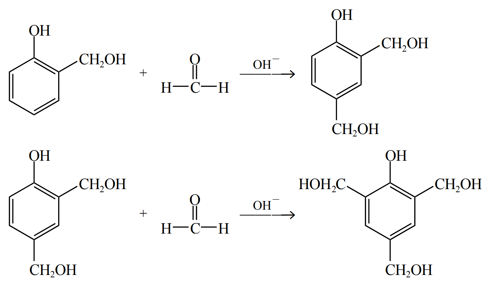

# 【化学】选必三：合成高分子&生物大分子

## 加聚反应

### 基本概念

#### 聚合反应

由小分子化合物合成高分子化合物的反应叫聚合反应。

分类：

- 加成聚合反应：由分子间通过加成反应生成高分子的反应，简称**加聚反应**。
- 缩合聚合反应：由分子间通过缩合反应生成高分子的反应，简称**缩聚反应**。
- 开环聚合反应。

#### 高分子化合物

概念：高分子化合物一般是指由成千上万个原子以**共价键**连接形成的、相对分子质量很大（$10^4\sim 10^6$ 甚至更大）的化合物，又称大分子化合物，简称高分子或大分子。高分子多是由小分子通过聚合反应而生成的，因此也称**高聚物或聚合物**。

分类：分为**线型高分子**和**体型高分子**。

特点：高分子化合物均为**混合物**。

基本知识：

以聚乙烯 PE  为例：

- 单体：形成高分子化合物的小分子化合物。聚乙烯中的单体是乙烯 $\ce{CH2=CH2}$。
- 链节：重复结构单元。聚乙烯中的链节是 $\ce{-CH2-CH2 -}$。注意：单体和链节之间必须是对应的。
- 聚合度：链节数目 $n$。$n$ 不是一个确定的数值，而是一个范围，所以高分子一定是混合物。

### 单体加聚

#### 合成热塑性材料

塑料的分类：

- 热塑性材料：可以反复加热熔融加工，如聚乙烯、聚丙烯、聚氯乙烯。
- 热固性材料：不能加热熔融，只能一次成型，如酚醛树脂，聚氨酯。

常见的热塑性材料加聚：

丙烯加聚得到聚丙烯：

由于聚丙烯循环部分外两端不再连有其它东西，所以属于「无端基」的加聚。

氯乙烯加聚得到聚氯乙烯 PVC：

曾经经常用于制作塑料袋。

聚苯烯加聚得到聚苯乙烯 PS：

上文提过的甲基丙烯酸甲酯，在一定条件下可以聚合为聚甲基丙烯酸甲酯 PMMA：

PMMA 是**有机玻璃**的主要成分，即亚克力材料，加入玻璃纤维可以得到复合材料。

#### 合成橡胶

$1,3-$ 丁二烯加成，遵循「$1,4-$ 加成，$2,3-$ 双键」得到 $\ce{CH3-CH=CH-CH3}$，再发生加聚反应，得到**顺丁橡胶**，如下：

> 注：
>
> - 顺丁橡胶是顺反异构中的顺式。
> - 由于顺丁橡胶中含有碳碳双键，比较稳定，能保持键角基本不变，被弯曲压缩后容易恢复原形，所以具有很好的弹性，所以可以做橡胶。
> - 装高锰酸钾的玻璃瓶不能用橡胶塞，碱式滴定管不能装酸性高锰酸钾，因为高锰酸钾会腐蚀橡胶。

异戊二烯发生加聚反应得到**顺式聚异戊二烯**，是**合成橡胶**的主要成分。

> 注意：天然橡胶中不存在顺式聚异戊二烯这种结构。天然橡胶一般是**反式**。

**异戊二烯**也能发生加聚反应得到**反式聚异戊二烯**，是**杜仲胶**的主要成分。

> 注意：杜仲胶是天然橡胶，属于反式异构。

#### 合成纤维

丙烯腈聚合得到**聚丙烯腈**，是**腈纶**的主要成分，如下：

甲醛中的碳氧键可以加聚，得到**人造象牙**的主要成分，表面具有光泽，如下：

$3$​ 个甲醛可以加聚成环，如下：

> 注：
>
> - 三聚反应主要会成**六元环**。
> - 加聚成环类似的还有**乙炔**加聚得到**聚炔**，是导电高分子。三个乙炔也可以加聚得到环状物质**三炔电门**。

氰胺中碳氢三键加聚会得到**三聚氰胺**，多用于涂料，如下：

### 多种单体加聚（共聚）

乙烯和丙烯共聚：

> 注意： 和  两种结构实际上等价，因为从链的角度来说，它们都是**每隔三个碳连一个甲基**。

### 题型——判断单体

模型：给定一个聚合物，问它是哪些单体加聚而成的。

求解：一般情况下，链节大部分有两个碳或四个碳，所以可以根据此判断高聚物是由哪些单体加聚得到的。

## 缩聚反应

### 酚醛树脂

#### 相关知识

酚醛树脂属于**热固性材料**，不能加热熔融，只能一次成型。

酚醛树脂是最早生产和使用的合成树脂，不易燃烧，具有良好的电绝缘性，被广泛用来生产电灯开关等电器用品，例如锅把、电灯的开关等，俗称电木或电玉。

#### 合成线性酚醛树脂

【实验操作】

【实验原理】

在 $\ce{H+}$​​ 的催化作用下，等物质的量的苯酚与甲醛反应，苯酚邻位或对位的氢原子与甲醛的羰基加成生成羟甲基苯酚，然后羟甲基苯酚之间相互脱水缩合形成线型高分子。

> 注意：为了防止苯酚邻对位上有多个位置与甲醛反应被取代，必须**严格控制苯酚与甲醛的物质的量之比为 $1:1$**。

【反应方程式】

**邻羟甲基苯酚缩合**

加成：

根据电负性和键的极性，氢会和氧加成，苯环会和碳加成，如下：

缩聚：

总反应：

**对羟甲基苯酚缩合**

加成：

缩聚：

在实际情况下，一般对、邻羟甲基会互相缩聚，一般不会存在单独只有对羟甲基苯酚缩合的情况。

> 缩聚实例——对苯甲酚与丙醛发生缩聚反应：
>
> 
>
> 注意：
>
> - 这里不存在对位加成，因为 $\ce{-OH}$​ 的对位只有甲基，没有氢。
> - 生成物中 $\ce{CH2CH3}$ 必须连在 $\ce{CH}$ 下面，即支链上，不能连在主链上，因为 $\ce{H}$ 与 $\ce{O}$ 结合到的 $\ce{OH}$ 必须连在最外面（需要脱水缩合），如果将 $\ce{CH2CH3}$ 连在主链内部从键的角度上不存在这种物质。
> - 书写的时候，可以先写出苯环和两边的 $\ce H$​，再补其它物质。
> - 计算 $\ce{H2O}$ 的化学计量数，可以通过前面反应物中一共有 $2n$ 个氧（对苯甲酚有 $n$ 个，丙醛有 $n$ 个），生成物的缩聚物**链节**中一共有 $n$ 个氧，**链节外部**有 $1$ 个氧，所以水中有 $2n - (n + 1) = n-1$ 个氧，即 $n-1$ 个水。

#### 合成网状酚醛树脂

【实验操作】

【实验原理】

在 $\ce{OH-}$ 催化下，苯酚与过量的甲醛反应，生成羟甲基苯酚的同时，还生成而羟甲基苯酚、三羟甲基苯酚等，继续反应可生成网状酚醛树脂。

【化学方程式】

加成：

脱水缩合后得到网状酚醛树脂：

> 注：
>
> - 这种网状酚醛树脂**不溶于乙醇**，化学性质很稳定。
> - 通过得到的有机高分子区分加聚和缩聚：一般有端基的是脱水缩合，即缩聚得到；无端基的是加聚反应得到。
> - 区分酸催化和碱催化得到的酚醛树脂：酸合成的是**线型的**，可以溶于乙醇；碱合成的是**体型的**，不能溶于乙醇。

> 拓展——脲醛树脂：
>
> 脲醛树脂一般用于接线板上的塑料，是使用**尿素**和**甲醛**缩聚而成的，如下：
>
> 
>
> 实际上将酚醛树脂中的苯酚改成尿素，就是脲醛树脂。二者考法完全一致。糠醛树脂同理。

