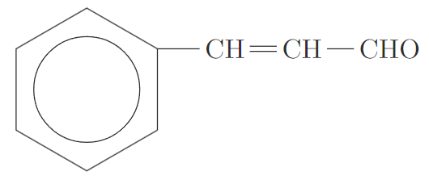
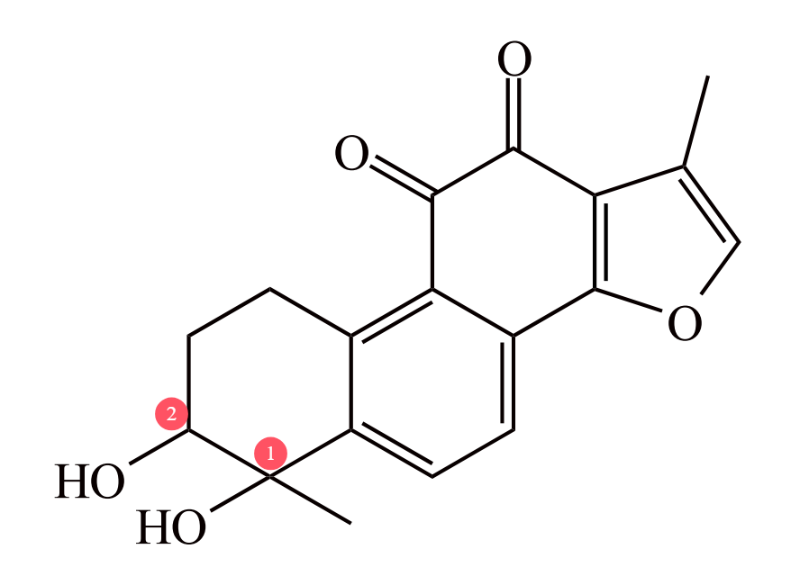

# 【化学】选必三：同分异构体的书写

## 链状烃的取代和插空法

### 取代法

#### 一取代物

**甲烷、乙烷、丙烷、丁烷的种类**

甲烷：只有一种同分异构体，即 。

乙烷：只有一种同分异构体，即 。

丙烷：只有一种同分异构体，即 。

丁烷：有两种同分异构体，即 $\ce{CH3-CH2-CH2-CH3}$ 和 。

戊烷：有三种同分异构体，即正戊烷 $\ce{C-C-C-C-C}$ 、异戊烷  和新戊烷  。

**甲基、乙基、丙基、丁基、戊基的种类**

书写方法：

1. 先分类：画出所有可能的碳骨架。
2. 再分步：考虑每一个不等价的碳，单线箭头取代。

> 先按照碳骨架分类，再对每一个类型每一个可能的碳原子都取代，此种方法可以做到不重不漏的计算出所有的同分异构体。

示例：

甲基：只有一种同分异构体，即 $\ce{-CH3}$。

乙基：只有一种同分异构体，即 $\ce{-CH2-CH3}$。

丙基：有两种同分异构体，即  和 $\ce{-CH2CH2CH3}$。

丁基：由于丁烷有两种可能的碳骨架 $\ce{C-C-C-C}$ 和 ，第一种有两个不同的取代位置 （根据对称性可知另外两个位置等价) ，第二种也有两个不同的取代位置 （根据对称性可知其它位置与 ① 等价），所以丁基总共有 $4$ 种同分异构体，如下图所示。

戊基：同理丁基可知，戊基有 $3 + 4 + 1 = 8$ 种同分异构体。

> 注意：新戊烷位于中间的碳原子上没有氢，不可以被取代。

**例题**

例 1：分子式为 $\ce{C4H9Cl}$ 的有机物共有多少种？

分析：由于该有机物的不饱和度 $\Omega = 4 + 1 - 5 = 0$，所以相当于求**丁基**的同分异构体，即该有机物的同分异构体有 $4$ 种。

---

例 2：分子式为 $\ce{C5H10O2}$ 并能与饱和 $\ce{NaHCO3}$ 溶液反应放出气体的有机物有多少种？

分析：该有机物的不饱和度为 $\Omega = 5 + 1 - 5 = 1$，与碳酸氢钠反应，说明该物质一定属于酸（醇酚都不能和碳酸氢钠反应），那么抛开羧基的一个不饱和度，还剩下丁基，也相当于求丁基的同分异构体，有 $4$ 种。

> 例 1 例 2 的题目完全一致，只不过例 1 是 $\ce{-Cl}$ 取代丁基，例 2 是 $\ce{-COOH}$ 取代丁基。

> 注意：例 2 种，原来有五个碳，扣除一个碳之后还剩四个碳，所以是求**丁基**的同分异构体，而非**戊基**。

---

例 3：含有两个甲基 $\ce{-CH3}$ 结构的戊苯有多少种？

分析：相当于在苯环上接了一个戊基，也可以看作将戊基用苯环取代，那么先分类再分布。当碳骨架为 $\ce{C-C-C-C-C}$ 时，要使得存在两个甲基必须保留两端的碳，有 $2$ 种情况；当碳骨架为  时，需保留两个端点的甲基，有 $2$ 种情况；当碳骨架为  时，无论怎么放置苯，都会有三个甲基，所以不存在。总共有 $4$ 种情况。

#### 二取代物

相同取代基和不同取代基的区别：相同的取代基需要考虑是否重复，而不同的取代基不需要考虑。

**不同取代基**

书写方法：

1. 写出所有可能的碳骨架。
2. 选择一个取代基，然后画出每种碳骨架下所有可能的取代情况。
3. 在上一步得到的所有情况中，判断每种情况下的另一个取代基可能的取代情况，最后将所有情况下取代情况数相加。

例：分子式为 $\ce{C4H8BrCl}$ 的有机物有多少种？

分析：考虑丁烷有两种可能的碳骨架，即 $\ce{C-C-C-C}$ 和 ，两种碳骨架取代氯后有四种：

其中前两种取代溴都有 $4$ 种，第三种 $3$ 种，第四种 $1$ 种，总共有 $12$ 种。

**相同取代基**

思想：定一动一。

基本方法与不同取代基相同，但需要在考虑第二个取代基的取代时，根据「取代基出现过的位置不能再出现」排除与前面重复的情况。

例：分子式为 $\ce{C4H8Cl2}$ 的有机物有多少种？

首先画出两种可能的碳骨架：即 $\ce{C-C-C-C}$ 和 。

然后考虑两种碳骨架上取代一个氯时，有四种情况：

再考虑第二个氯的取代，上图第一种情况，四个碳上都可以加上氯，有 $4$ 种情况；对于第二种情况，由于情况一种已经有氯在两端的情况，为了防止重复，不能在两端的碳上再取代碳骨架，只能在中间的碳上取代，所以有 $2$ 种情况；对于第三种情况，三个碳上都可以取代，有 $3$ 种情况；对于最后一种情况，无论怎么取代都会与情况三的取代重复，有 $0$ 种情况。所以总共有 $9$ 种。

### 插空法

书写方法：

1. 画出碳骨架。
2. 双线箭头插空。

适用范围：醚、酮和酯等原子团两边都要连接碳骨架的物质，以及碳碳双键等含有不饱和度的特殊键的物质。

**例题**

例 1：分子式为 $\ce{C3H8O}$ 的醚有多少种？

分析：丙烷有一种碳骨架 $\ce{C-C-C}$，问题可以看成 $\ce{C-C-C}$，要使得它变成醚，可以在碳碳键之间插入氧，所以问题转化为**有几种不同的碳碳键可以用来插氧**，那么由于 $\ce{C-C-C}$ 种两种碳碳键对称所以二者一致，所以只有一种醚。

---

例 2：分子式为 $\ce{C4H8}$ 的烯烃（不考虑顺反异构）一共有几种？

分析：首先四个碳的碳骨架有两种，即 $\ce{C-C-C-C}$ 和 。然后考虑每一种情况有多少种不同的插入双键的方法，可以发现最终有 $\ce{C=C-C-C}$，$\ce{C-C=C-C}$ 和  三种情况。

> 注意：若是在  上插入双键，有 $0$ 种情况，因为中间的碳上已经连了四个碳，不可能再接入双键。

---

例 3：分子式为 $\ce{C5H10O}$ 的有机物中，属于酮类的有多少种？

分析：该物质除去一个酮羰基后，还剩下四个碳，四个碳的碳骨架有两种，即 $\ce{C-C-C-C}$ 和 。然后考虑每一种情况有多少种不同的插入酮羰基的方法，可以发现最终有 $3$ 种情况。

> 注意：含有 $n$ 个碳的酮除去酮羰基剩下 $n-1$ 个碳，而不是剩下 $n$ 个碳，所以需要画出 $n-1$ 个碳的碳骨架。

---

例 4：分子式为 $\ce{C5H12O}$ 的有机物中，不能和钠反应的有几种？

分析：该物质的不饱和度 $\Omega = 0$，说明不含双键，不含环，不能和钠反应，说明**不含羟基**，所以氧只能插在碳碳键之间。戊烷有三种碳骨架，即 $\ce{C-C-C-C-C}$、 和 ，那么插入氧，有 $2 + 3 + 1 = 6$ 种情况。

> 拓展：若题目问的是**能和钠反应的有几种**，相当于问分子式为 $\ce{C5H12O}$ 的醇有多少种，即戊基的一取代物，有 $8$ 种。

### 例题（比较复杂的同分异构体）

例 1：能与 $\ce{NaHCO3}$ 反应，不含环的 $\ce A$ 的同分异构体（不考虑顺反异构）有几种？

分析：能和 $\ce{NaHCO3}$，说明应该属于羧酸，那么一定含有羧基 $\ce{-COOH}$，考虑从 $\ce A$ 中摘走一个羧基，那么剩下四个碳和一个双键。

四个碳形成的碳骨架有两种，即 $\ce{C-C-C-C}$ 和 ，使用「插空法」让双键插入，则第一种碳骨架有两种插入情况，即 $\ce{C=C-C-C}$ 和 $\ce{C-C=C-C}$，第二种碳骨架有一种插入情况，即 ，所以插入双键总共有三种情况。

然后再使用「取代法」，在碳骨架上取代羧基，上述第一种情况四个碳都可以取代，有 $4$ 种情况；第二种情况根据对称性只能取代两个碳，有 $2$ 种情况；第三种情况也可以取代两个碳（位于中间的碳不能取代，因为已经满键），有 $2$ 种情况，所以总共有 $8$ 种情况。

> 总结：在考试的题目中往往需要同时使用「取代法」和「插空法」，且要分清先后逻辑。

---

例 2：分子式为 $\ce{C6H10O}$ 的有机物中满足下列条件的有多少种（不考虑立体异构）？

① 含有两个甲基；② 含有酮羰基（不含 $\ce{C=C=O}$）；③ 不含有环状结构。

分析：

该有机物的不饱和度为 $\Omega = 6 + 1 - 5 = 2$，酮羰基中含有一个双键，不含有环状结构，所以碳骨架上还需要有一个双键。

考虑双键和酮羰基都可以使用「插空法」。

摘去酮羰基后，含有 $5$ 个碳，五个碳的碳骨架有三种情况，其中新戊烷的情况不能再取代双键，所以有两种有效情况，即 $\ce{C-C-C-C-C}$ 和 。

第一种碳骨架上插入双键，由于需要含有两个甲基，所以不能在两边的碳连的双键上插入，根据对称性可知只有一种情况；第二种碳骨架，为了保证有两个甲基，插入双键有两种情况。

再考虑在上述三种情况中插入酮羰基。由于不含 $\ce{C=C=O}$，所以要将酮羰基作为一个整体看待。

那么对于第一种情况，有三个位置可以插入，对于第二种情况，也有三个位置，第三种情况有两个位置，所以总共有 $3+3+2 = 8$ 种情况，如下图所示。

## 空间立体结构的取代

### 高度对称结构

#### 一氯代物

正四面体烷上四个氢完全等价，只有一种一氯代物。

棱晶烷中三棱柱中间有一条对称轴，上下两个面对称，每个面上三角形对称，所以只有一种等效氢，有一种一氯代物。

立方烷也是完全对称结构，只有一种一氯代物。

#### 二氯代物

方法：定一动一，结构法，步数法。

正四面体烷上，先任意确定一个 $\ce{Cl}$ 的位置，那么这个氯所在的顶点所对的底面三个位置完全等价，所以只有一种一氯代物。

立方烷上，先任意确定一个 $\ce{Cl}$ 的位置，然后剩下一个氯可以与他在一条棱上，也可以与他构成面对角线和体对角线，有三种。如下图所示；也可以考虑从已经确定的 $\ce{Cl}$ 出发，然后能走几步，立方烷中从氯开始走到其它顶点可能有一步两步和三步，所以有三种。

棱晶烷上，先任意确定一个 $\ce{Cl}$ 的位置，在这个氯所在的底面上的两个位置等价，有一种情况；在另一个底面上，一个顶点可以走一步得到，另外两个需要走两步，有两种情况。所以总共有三种情况。如下图所示。

### 金刚烷

#### 一氯代物

金刚烷上有两个等效碳（连有三个氢的和连有两个氢的），所以有两种一氯代物。

金刚烷的立体结构示意图：

#### 二氯代物

方法：定一动一，步数法。

当氯接在一个氢的碳上时：走一步有三个可能的位置，这三个位置等价；走两步有三个可能的位置，这三个位置等价；剩下三个位置需要走三步，可以视为是六元环的三个大对角线，这三个位置等价。所以总共有三种情况。

当氯接在两个氢的碳上时：

首先要排除掉连有一个氢的碳上的取代，防止重复。

走零步，和原氯在同一个碳上，有一种情况；走一步，在上述排除后有 $0$ 种情况；走两步，有四种情况；走三步有 $0$ 种情况；走四步有 $1$ 种情况。如下图所示。

### 螺环烷烃

定义：环之间共用一个碳原子的化合物称为螺环化合物。

#### 一氯代物

螺 $[2,2]$ 戊烷中，四个可以取代的碳完全等价，所以只有一种一氯代物。

> 注意：螺 $[2,2]$ 戊烷不是平面结构，而是立体结构，因为中间的碳是 $\ce{sp^3}$ 杂化，不可能是平面结构。

螺 $[3,3]$ 庚烷中，有一条对称轴，所以两个正方形等价，距离中心碳一步的为一种情况，两步的为另一种情况，所以有两种一氯代物。

#### 二氯代物

螺 $[2,2]$ 戊烷中，任意确定一个氯所取代的碳的位置，由于这个碳和另外两个碳相连，这三个碳共平面，且碳是 $\ce{sp^3}$ 杂化，所以 $\ce{Cl}$ 一定不与气所在的碳共平面。

那么在与已经确定的氯同一个环上，有两种可能的情况：它自身和走一步所到达的碳；在与已经确定的碳不同的环上，有两种可能的情况。所以总共有四种二氯代物。

> 注意：若氯与其所在碳共平面，则在不同环上只有一种情况，因为有对称轴，但当不在同一个平面时破坏了对称性，应该有两种情况。

螺 $[3,3]$ 庚烷中：

当氯接在距离中心碳只有一步的碳上时：同理，也不再具有对称性，所有的可能的位置都能被取代，总共有 $6$ 种情况。

当氯接在距离中心碳有两步的碳上时：首先要排除掉距离中心谈只有一步的碳上的取代，防止重复。同理，只有两种可能性。

所以总共有 $6 + 2 = 8$ 种二氯代物。

> 注：一般高考中只需要知道螺环烷烃的二氯代物多于两种即可，不会考的太复杂。

### 星烷

#### 一氯代物

星烷上的等效碳只有 $\ce{CH2}$ 型和 $\ce{CH}$ 型两种，所以各类星烷的一氯代物都只有两种。

#### 二氯代物

三星烷：

当氯处于左图中的位置时，沿着一个方向向下分别走 $0,1,2,3$ 步，有四种情况，其它方向与该方向等价。

> 注意：从理论上这里的氯也会破坏对称性，所以其他方向与该方向实际上不等价，但高中阶段**星烷一般不考虑这么复杂的情况，所以按照不破坏对称性算**。

当氯处于右图中的位置时，首先排除掉氯在左图上的等效碳的位置。然后计算剩下的碳中哪些可以取代，有 $3$ 种情况。

所以总共有 $7$ 种情况。

*四星烷（仅作了解即可）：

如下图所示，共有 $11$ 种情况。

## 脂类物质

### 甲酸酯

甲酸酯的结构：

将羧基中的 $\ce{COO}$ 镜面翻转就得到了甲酸酯中的**甲酰氧基**。

所以求甲酸酯的种类数可以转化为羧基的种类数，即甲酰氧基的取代数目与羧基的取代数目相同。

特殊性：甲酸酯**既有酯类的化学性质（能发生水解）又有醛的化学性质（能发生银镜反应）**。

基本方法：取代法。

例如：$\ce{CH3CH2CH2COOH}$ 的同分异构体中，既能发生水解反应又能发生发生银镜反应的有几种。

分析：首先能发生水解反应说明不含有羧基，但含有酯基，又能发生银镜反应说明含有醛基，那么说明这种物质是**甲酸酯**，由于求甲酸酯的种类数相当于求羧基种类数，所以相当于求丙基有几种，由于丙基有两种所以答案是两种。两种同分异构体的结构分别为：

> 注：如果文丁酸有几个同分异构体，也相当于问有多少种丙基，只是取代基不同（一个是甲酸酯一个是羧基），二者种类数相同。

### 普通酯

特性：能发生水解但不能发生银镜反应。

基本方法：插空法。

解题步骤：

1. 首先根据酯基左右都与碳骨架相连，利用插空法求出其可能的插空位置。
2. 再判断每个插空的位置酯基镜像对称后两种物质是否相同（可以通过命名判断），若相同，则结果不变；若不同，则这种位置下答案乘 $2$。

**例题**

例 1：$\ce{CH3CH2CH2COOH}$ 的同分异构体中，能发生水解反应但不能发生银镜反应的有几种？

分析：

能发生水解反应说明含有酯基，不能发生银镜反应说明不是甲酸酯，所以属于普通酯。

考虑先摘走物质结构中的酯基，那么变成丙烷的碳骨架，只有 $1$ 种，由于酯基两边都连有碳骨架，所以使用插空法，只有一种插空的位置。

**在此题中，同一个插空的位置，酯基镜像对称有两种情况**，所以插空法得到的种类数需要乘 $2$，所以此题答案为 $2$ 种。

两种同分异构体的碳骨架分别为：

得到的两种物质是乙酸乙酯和丙酸甲酯。

> 注意：只有一种情况不需要乘 $2$，**若酯基镜像对称后得到的两种物质相同，即结构对称，则不需要乘 $2$**。

---

例 2：甲基丙烯酸甲酯的同分异构种，与其含有相同官能团的链状结构（不含顺反异构）有多少种？

分析：

含有相同官能团，说明含有**酯基**和**碳碳双键**。

碳碳双键使用插空法分析，先考虑碳骨架（有 $2$ 种），然后考虑每种碳骨架插空，总共有 $2 + 1 = 3$ 种。

然后考虑酯基，有**甲酸酯**和**普通酯**。

甲酸酯考虑取代法，对于碳碳双键插空后得到的三种情况，有 $4 + 2 + 2 = 8$ 种取代情况；普通酯考虑插空法，对于碳碳双键插空后得到的三种情况，有 $2\times 2 + 1\times 2 + 1\times 2 = 8$ 种情况。

总共有 $16$ 种情况。

由于同分异构体与原物质「含有相同的官能团」且是「链状结构」，所以需要减去自身，所以此题答案应该是 $15$ zhong 。

> 总结：
>
> - 一般涉及到双键和酯基同时都有的同分异构体，一般先考虑双键再考虑酯基会比较容易处理。
> - 在不含有「特性」的酯类物质的同分异构体相关题目中，需要考虑**甲酸酯**和**普通酯**是否都需要考虑。
> - 「含有相同官能团的链状结构」一般说明最后在考虑同分异构种类数时需要减去自身。

### 注意事项

1. 若题目问含有  结构的同分异构体，则**不仅仅有酯类**，**羧基也属于含有酯基结构**。如果题目直接说含有官能团酯基则不需要考虑羧酸。
2. 同时涉及到羟基和双键的题目，**注意羟基和双键不能连在同一个碳上**。
3. 相对分子质量上，$n$ 元酸 $=$ $n+1$ 元醇。

### 例题

例 1：化学式为 $\ce{C5H8O2}$ 的脂肪酸与化学式为 $\ce{C4H10O}$ 的醇发生反应，最多能够生成酯的数量为（不考虑立体异构）多少种？

分析：

**可以通过分别求脂肪酸和醇的同分异构体，然后利用「乘法原理」二者种类数相乘得到**。

$\ce{C5H8O2}$ 的不饱和度为 $\Omega = 2$，所以有 $1$ 个双键，$1$ 个羧基，先考虑双键插空再考虑羧基取代总共有 $8$ 种情况。

$\ce{C4H10O}$ 的不饱和度为 $\Omega = 0$，所以官能团只有一个羟基，那么相当于丁基的同分异构体，有 $4$ 种情况。

根据乘法原理二者相乘为 $32$ 种情况。

> 总结：这道题提供了一种解决酯类同分异构体问题的新思路：即若题目本身有说明该酯是通过哪两个分子式确定的酸和醇酯化得到的，可以考虑直接分别求出酸和醇的同分异构体，然后利用乘法原理二者相乘即为答案。

----

例 2：与苯乙酸 $\ce{C6H5CH2COOH}$ 是同分异构关系且属于芳香酯类的结构有多少种？

分析：

芳香酯类，说明含有苯环，考虑摘去羧基 $\ce{-COOH}$，还剩下一个苯环上有一个甲基。

对于甲酸酯，考虑取代，可以取代在甲基的邻、间、对位和这个甲基本身上，有 $4$ 种情况；对于普通酯，考虑插空，插空只能插在单键上，所以只有甲基和苯环相连的碳骨架中间可以被插空，这里不具有对称性，所以需要乘 $2$，有 $2$ 种情况。

综上，总共有 $6$ 种情况。

> 总结：这道题提供了一种含苯环的同分异构的解决方法。

---

例 3：某有机物 A 的分子式为 $\ce{C4H8O2}$，下列有关分析正确的是（）

A. 若 A 遇稀硫酸能生成两种有机物，则 A 的结构有 $4$ 种

B. 若 A 遇 $\ce{NaHCO3}$ 溶液有气体生成，则 A 的结构有 $4$ 种

C. 若 A 分子中有两个连在不同碳原子上的羟基，则 A 的结构有 $5$ 种

D. 若 A 有特殊香味且不溶于水，则 A 的结构有 $3$ 种

分析：

首先，有机物 A 的不饱和度 $\Omega = 1$。

A 选项，不饱和度为 $1$ 的有机物遇稀硫酸生成两种有机物，说明有机物 A 属于酯类，根据取代法可知甲酸酯有 $2$ 种，根据插空法可知普通酯有 $2$ 种，所以总共有 $4$ 种。A 正确。

B 选项，遇到 $\ce{NaHCO3}$ 溶液有气体生成，说明有机物 A 含有羧基，即属于羧酸，根据取代法可知有 $2$ 种。B 错误。

C 选项，A 分子有两个连在不同碳原子上的羟基，由于羟基没有不饱和度，所以碳骨架上一定还有一个不饱和度，那么有两种情况：

- 当 A 分子是链状有机物，则四个碳的碳骨架上有一个双键，含有双键的四个碳的碳骨架有 $3$ 种情况，然后考虑在碳骨架上取代羟基，注意羟基不能取代在与双键相连的碳上，所以每种情况都恰好只有两个碳能连羟基，总共有 $3$ 种情况。
- 当 A 分子是环状化合物，当有一个四元环时，考虑在环上取代两个 $\ce{-OH}$，有 $2$ 种情况；当有一个三元环时，在环上取代一个 $\ce{-OH}$ 有 $3$ 种情况，考虑对称性和重复，再取代另一个羟基有 $2 + 1 + 1 = 4$ 种情况。

所以总共有 $3 + 2 + 4 = 9$ 种情况。C 错误。

D 选项，A 有特殊香味且不溶于水，说明 A 只能是酯类，所以同理 A 选项可知有机物 A 的结构有 $4$ 种。

> 总结：
>
> - 不饱和度为 $1$ 含氧有机物，「能生成两种有机物」和「有特殊气味且不溶于水」都说明有机物是酯类。
> - C 选项要注意还有环的情况存在，且不一定是四元环，还可能是三元环。

---

例 4：分子式为 $\ce{C9H18O2}$ 的有机物 A 有下列变化关系，其中 B、C 的相对分子质量相等，则 A 的可能结构有几种？

分析：

A 的不饱和度 $\Omega = 1$，有两个氧，与浓硫酸在加热条件下反应生成两种有机物，说明 A 是酯类，生成醇和酸 ，由于 B 可以继续氧化，所以 B 是醇，C 是酸。又由于 $n$ 元酸的相对分子质量和 $n+1$ 元醇相等，所以 B 有 $5$ 个碳，一个羟基，C 有 $4$ 个碳，一个羧基。

由于 B 氧化得到 D，D 在氢氧化铜溶液中可以反应，所以 D 是醛，所以 B 中羟基只能接在**端基**上（如果不接在端基上则羟基所在碳只接了一个氢，反应得到酮而不是醛）。五个碳的碳骨架有三种，羟基在端基上取代总共有 $1 + 2 + 1 = 4$ 种情况。

有机物 C 摘去一个羧基，剩下三个碳的碳骨架，有一种情况，在其上取代羧基，有 $2$ 种情况。

根据「乘法原理」可知 A 的可能结构总共有 $4 \times 2 = 8$ 种情况。

## 含苯环的物质取代

### 苯环的一取代

苯环上的每个碳都是 $\ce{sp^2}$ 杂化，六个碳合起来形成一个大 $\pi$ 键，所以六个碳等效，苯环的一取代物只有一种情况。

### 苯环的二取代

**相同取代基——$\ce{XX}$ 取代**

先考虑取代一个 $\ce X$，因为苯环的一取代物有一种情况，所以取代一个 $\ce X$ 只有一种情况；再第一个 $\ce X$ 取代之后，考虑第二个 $\ce{X}$，有邻、间、对三种情况的位置，，所以总共有三种情况。

实例：二甲苯有邻二甲苯、间二甲苯、对二甲苯三种情况。

**不同取代基——$\ce{XY}$ 取代**

分析后可知与 $\ce{XX}$ 取代完全相同，也只有邻、间和对三种情况。

### 苯环的三取代

**$\ce{XXX}$ 取代**

即三个取代基完全相同。

第一种情况是三个 $\ce X$ 取代的碳相邻，即「连三 $\ce{X}$ 苯」；第二种情况是有两个 $\ce{X}$ 取代的碳相邻，另一个与他们不相邻，根据对称性可知只有一种情况，即「偏三 $\ce{X}$ 苯」；第三种情况是三个 $\ce X$ 取代的碳互不相邻，即「均三 $\ce{X}$ 苯」，如下图所示：

如果要求 $\ce{XXXY}$ 取代的所有情况，那可以在上述三种情况的基础上取代 $\ce Y$，根据对称性可知，有 $2 + 3 + 1 = 6$ 种情况，如下图所示：

**$\ce{XXY}$ 取代**

即三个取代基有两个相同，另一个与这两个不同。

那么先考虑取代两个 $\ce X$，有邻、间、对三种情况，再在这三种情况上取代 $\ce Y$，那么有 $2 + 3 + 1 = 6$ 种情况，如下图所示：

如果要求 $\ce{XXXY}$ 取代的所有情况，那么实际上相当于除了 $\ce{XXX}$ 的三个取代位置，剩下的三个取代位置恰好是 $\ce{HHY}$，与 $\ce{XXY}$ 取代的种类数相同，也是 $6$ 种。

**$\ce{XYZ}$ 取代**

即三个取代基均不相同。

那么先考虑取代 $\ce{XY}$，有邻、间、对三种情况。再考虑取代 $\ce Z$，此时邻、间两种情况中，均不存在对称性，所以 $\ce Z$ 都有 $4$ 种情况，在「对」这种情况中，有一个对称轴，此时 $\ce Z$ 有 $2$ 种取代情况。所以总共有 $4 + 4 + 2 = 10$ 种情况。

### 总结

苯环的两取代一定是 $3$ 种情况，三取代中 $\ce{XXX}$ 也是 $3$ 种情况，$\ce{XXY}$ 是 $6$ 种情况，$\ce{XYZ}$ 是 $10$ 种情况。

### 例题

例 1：水杨酸的同分异构体种，含苯环且能发生银镜反应的有几种？

求解：

首先能发生银镜反应，则说明有机物中含有**醛基**，含有醛基的物质有**醛类物质**和**甲酸酯**。

对于甲酸酯，相当于酚羟基 $\ce{-OH}$ 和甲酰氧基 $\ce{-OCOH}$ 两个取代基取代苯环，即 $\ce{XY}$ 取代，有 $3$ 种情况。

对于醛，可以考虑将原有机物水杨酸中的羧基 $\ce{-COOH}$ 拆分成一个羟基 $\ce{-OH}$ 和一个醛基 $\ce{-CHO}$。那么醛类取代有三个取代基，一个醛基 $\ce{-CHO}$、两个酚羟基 $\ce{-OH}$，是 $\ce{XXY}$ 取代，共有 $6$ 种情况。

所以这道题总共有 $6 + 3 = 9$ 种情况。

> 注意：
>
> - 这里羟基和醛基的元素加起来相比羧基多了一个 $\ce{H}$，但由于拆分之前羧基只需要取代在苯环上的一个碳上，而拆分后两个取代基要取代在苯环的两个碳上，所以势必会多取代一个氢。
> - 拆分的准则是必须保证拆分前后元素守恒（不考虑氢的取代则一般需要保证碳氧守恒）且不饱和度 $\Omega$ 相同。
> - 含有醛基的物质除了醛之外**还有甲酸酯**。

---

例 2：二甲苯总共有三种结构，这些结构的一氯代物共有几种？

求解：

若氯取代在**侧链的甲基 $\ce{-CH3}$ 上**，那么相当于有 $\ce{-CH3}$ 和 $\ce{-CH2Cl}$ 两种取代基取代苯环，属于 $\ce{XY}$ 取代，有 $3$ 种情况。

若氯取代在**苯环**上，那么相当于有两个 $\ce{-CH3}$ 和一个 $\ce{-Cl}$ 三个取代基取代苯环，属于 $\ce{XXY}$ 取代，有 $6$ 种情况。

总共有 $6 + 3 = 9$ 种情况。

> 注意：这里需要考虑 $\ce{-Cl}$ 在侧链甲基上的情况，做题时需要「先分类再分步」保证不重不漏。

---

例 3（2017 国二）： 如下图，L 是 D 的同分异构体，可与 $\ce{FeCL3}$ 溶液发生显色反应，$\pu{1 mol}$ 的 L 可与 $\pu{2 mol}$ 的 $\ce{Na2CO3}$ 反应，L 共有几种情况？其中核磁共振氢谱为四组峰，峰面积比为 $3:2:2:1$ 的结构简式是什么？

求解：

首先与 $\ce{FeCl3}$ 发生显色反应说明 L 中含有酚羟基，与 $\pu{2 mol}$ $\ce{Na2CO3}$ 反应说明有 $2$ 个酚羟基，那么有两个酚羟基和一个甲基三个取代基取代苯，属于 $\ce{XXY}$ 取代，有 $6$ 种情况。

核磁共振氢谱有四组峰，说明**一定存在对称结构**（如果不存在对称结构不可能只有四组等效氢），峰面积比为 $3:2:2:1$ 只有两种情况，如下图所示。

### 【补充】吡啶的取代和同分异构

吡啶：将苯环上的一个碳变成氮得到的物质。

**一取代、二取代**

处理方法：把 $\ce N$ 当作一个取代基。

|     取代     |  $\ce X$ 取代  | $\ce{XX}$ 取代  | $\ce{XY}$ 取代  |
| :----------: | :------------: | :-------------: | :-------------: |
|    种类数    |       3        |        6        |       10        |
| 等价苯环取代 | $\ce{XY}$ 取代 | $\ce{XXY}$ 取代 | $\ce{XYZ}$ 取代 |

**环种类异构**

例：分子式为 $\ce{C6H6ClN}$，结构式种含有六元环的芳香族同分异构体有多少种？

求解：

该有机物的不饱和度为 $\Omega = 4$，且含有氮，所以有**含有吡啶环**和**含有苯环**两种情况。

若含有吡啶环，则：

- 若 $\ce{Cl}$ 在侧链甲基上，则有 $\ce{-CN2Cl}$ 和 $\ce N$ 两个取代基，属于 $\ce{XY}$ 取代，有 $3$ 种情况。
- 若 $\ce Cl$ 在吡啶环上，则有 $\ce{-CH3}$、$\ce{-Cl}$ 和 $\ce N$ 三个取代基，属于 $\ce{XYZ}$ 取代，有 $10$ 种情况。

吡啶环这里总共有 $13$ 种情况。

若含有苯环，那么氮（氨基）连在苯环上，则：

- 若 $\ce{Cl}$ 在氨基 $\ce{-NH2}$ 上，则有 $1$ 种情况，此时苯环侧链取代基为 $\ce{-NHCl}$。
- 若 $\ce{Cl}$ 在苯环上，则有 $\ce{-NH2}$ 和 $\ce{-Cl}$ 两个取代基取代苯环，属于 $\ce{XY}$ 取代，有 $3$ 种情况。

苯环这里总共有 $4$ 种情况。

综上，此题答案为 $17$ 种。

## 顺反异构

### 顺反异构现象

由于碳碳双键不可旋转，会导致发生顺发异构。

例：$\ce{CH3CH=CHCH3}$ 的顺反异构如下：

烯烃顺反异构产生的条件：如下图所示，必须保证 $a\ne b$ 且 $c \ne d$，即双键两侧各不同。

例如：下图是维生素 A，其除了环上之外每个双键上都存在顺反异构。

### 碳碳双键顺反异构体

#### 小分子

顺式：两个碳上的氢都在上方或下方。反式：将顺式左边或右边两个位置上连的取代基互换。

> 注意：在键线式中，若双键在边上则一定没有顺反异构，因为边上的碳连了两个氢，不符合顺反异构产生的条件。

例题：$\ce{CH2=CH-CH=CH2}$ 与氯气发生加成反应得到 $\ce B(\ce{C4H6Cl2})$，则化合物 $\ce B$ 的顺式结构是什么？$\ce B$ 的带有四元环的同分异构体有几种（不考虑立体异构）？

分析：

要使得两个氯加成后的结构具有顺反异构，那么只能 $1,4 - $ 加成，$2,3$ 双键，此时顺式结构为：

$\ce B$ 的不饱和度为 $1$，带有四元环说明除了环上的一个不饱和度之外没有其它不饱和度，那么变成四元环上的氯的二取代，考虑「定一动一」，有 $3$ 种情况（注意第二个氯还可能和第一个氯处于同一个碳上）。

#### 高分子

烯烃加成可以得到高分子，有些高分子也具有顺反异构，例如下图是顺反异构的形成方式。

除此之外，杜仲胶属于高分子反式结构，它的顺式是合成天然橡胶。具体可详见「合成高分子 & 生物大分子」。

### 环状有机物顺反异构体

由于环状键不能旋转，所以其存在顺反异构。

示例：

### 例题

以乙烯为原料合成风信子等香精的定香剂 D 的合成路线如图。

已知：

C 为反式结构，则 C 转变为 D 的化学方程式是什么？

---

分析：

乙烯反应得到的有机物 A 的不饱和度为 $\Omega = 1$，由于 A 可以和醛类发生反应，联系题目给定的已知信息可知 A 一定是醛类，那么可知 A 是乙醛 $\ce{CH3CHO}$。

那么 A 和苯甲醛反应满足已知信息，考虑找出该反应中已知信息里所代表的 $\ce{R_1}$ 和 $\ce{R_2}$，从而推出生成物。若苯甲醛对应 $\ce{R2CH2CHO}$，不能找到 $\ce{CH2CHO}$ 这个反应中对应的部分，所以苯甲醛只能对应 $\ce{R1CHO}$，那么 $\ce{R_1}$ 是苯环，$\ce{R_2}$ 是 $\ce{H}$，所以 A 和苯甲醛反应会得到肉桂醛 。

B 肉桂醛还原后得到 C，C 与乙酸反应得到 D，B 的碳数和乙酸碳数之和等于 D，则 C 与乙酸的反应属于酯化反应，那么 C 是醇。又由于 D 的不饱和度 $\Omega = 6$，排除苯环的 $4$ 个不饱和度和羧基上的 $1$ 个不饱和度，还有 $1$ 个不饱和度，说明 D 中存在双键，那么说明 B 还原为 C 时只还原了醛基而没有还原双键，那么 C 是肉桂醇。

那么 C 是反式结构时，C 转变为 D 的化学方程式为：

## 手性异构和手性碳原子

### 对映异构现象

#### 对映异构体

两分子呈镜像关系，相似但不能完全重叠，互称对映异构体。

对映异构又称为旋光异构、手性异构。

#### 手性原子

手性原子是指与四个各不相同的原子或基团相连的原子，用 $*$ 表示。

手性碳需要满足的条件：① 属于饱和碳，即 $\ce{sp^3}$ 杂化；② 连又四个各不相同的原子或基团。

如下图，中心原子分别时 D- 甘油醛和 L- 甘油醛的手性碳原子。

甘油醛加成氢气后，原来醛基上的 $\ce{C=O}$ 会被加成，从而使得醛基变为 $\ce{-CH2OH}$，从而使得整个有机物中原来的手性碳上连了两个 $\ce{CH2OH}$，不再是手性碳。

---

求环状有机物的手性碳的个数：

1. 首先排除掉连有双键的不饱和碳原子。
2. 再排除掉连了两个 $\ce{H}$ 或三个 $\ce H$ 的碳原子。
3. 然后判断剩下的碳原子中是否含有手性碳，需要判断所连的四个部分**整体**是否一样。若碳原子在环上，若从这个碳出发能找出对称轴，则可对应的两边所含有的基团相同，即不是手性碳原子。

口诀：饱和碳、四不同、整体看。

例：下图的有机物分子中含有几个手性碳？

首先排除掉连有双键的不饱和碳原子，和连了两个 $\ce{H}$ 和三个 $\ce{H}$ 的碳原子，那么只剩下图中的两个标号碳原子。

1 号碳连有一个羟基一个甲基 ，连的剩下两个基团在环上，两边不存在对称性，所以是手性碳；2 号原子连了一个羟基和一个氢，连的剩下两个基团在环上，由于两边不存在对称性，所以也是手性碳。

所以总共有 $2$ 个手性碳。

### 对映异构体判断

方法：考虑将其中一个有机物旋转，若两物质能够形成镜像关系，则是对映异构体。

例：判断下列几种结构哪些是同一物质，哪些是顺反异构体，哪些是对映异构体。

分析：设四种物质分别是 A,B,C,D，则 A 和 B 互为顺反异构体，A 是反式，B 是顺式。B 整个倒过来之后与 D 完全相同，所以二者是同一种物质。C 横着旋转 $180^\circ$ 会和 A 呈镜像关系，所以 A 和 C 是对映异构体。

> 注意：判断一个有机物是否含有顺反异构相当于判断结构内碳碳双键的两个碳所连的两个基团是否相同；判断一个有机物是否含有对映异构体相当于判断结构内是否含有手性碳原子。
