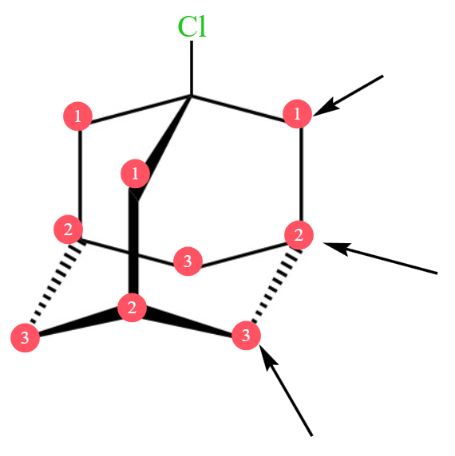
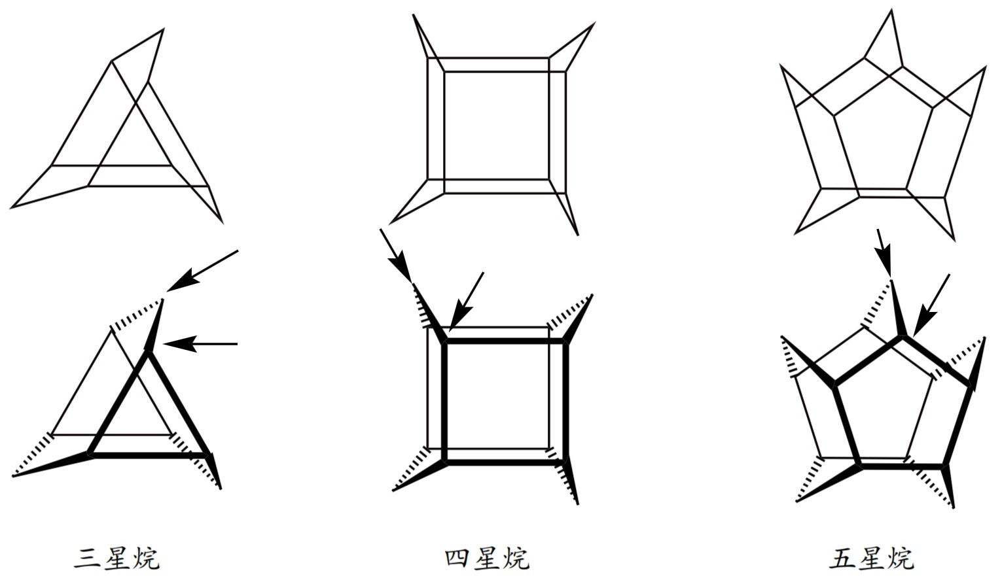

# 【化学】选必三：同分异构体的书写

## 链状烃的取代和插空法

### 取代法

#### 一取代物

**甲烷、乙烷、丙烷、丁烷的种类**

甲烷：只有一种同分异构体，即 。

乙烷：只有一种同分异构体，即 。

丙烷：只有一种同分异构体，即 。

丁烷：有两种同分异构体，即 $\ce{CH3-CH2-CH2-CH3}$ 和 。

戊烷：有三种同分异构体，即正戊烷 $\ce{C-C-C-C-C}$ 、异戊烷  和新戊烷  。

**甲基、乙基、丙基、丁基、戊基的种类**

书写方法：

1. 先分类：画出所有可能的碳骨架。
2. 再分步：考虑每一个不等价的碳，单线箭头取代。

> 先按照碳骨架分类，再对每一个类型每一个可能的碳原子都取代，此种方法可以做到不重不漏的计算出所有的同分异构体。

示例：

甲基：只有一种同分异构体，即 $\ce{-CH3}$。

乙基：只有一种同分异构体，即 $\ce{-CH2-CH3}$。

丙基：有两种同分异构体，即  和 $\ce{-CH2CH2CH3}$。

丁基：由于丁烷有两种可能的碳骨架 $\ce{C-C-C-C}$ 和 ，第一种有两个不同的取代位置 （根据对称性可知另外两个位置等价) ，第二种也有两个不同的取代位置 （根据对称性可知其它位置与 ① 等价），所以丁基总共有 $4$ 种同分异构体，如下图所示。

戊基：同理丁基可知，戊基有 $3 + 4 + 1 = 8$ 种同分异构体。

> 注意：新戊烷位于中间的碳原子上没有氢，不可以被取代。

**例题**

例 1：分子式为 $\ce{C4H9Cl}$ 的有机物共有多少种？

分析：由于该有机物的不饱和度 $\Omega = 4 + 1 - 5 = 0$，所以相当于求**丁基**的同分异构体，即该有机物的同分异构体有 $4$ 种。

---

例 2：分子式为 $\ce{C5H10O2}$ 并能与饱和 $\ce{NaHCO3}$ 溶液反应放出气体的有机物有多少种？

分析：该有机物的不饱和度为 $\Omega = 5 + 1 - 5 = 1$，与碳酸氢钠反应，说明该物质一定属于酸（醇酚都不能和碳酸氢钠反应），那么抛开羧基的一个不饱和度，还剩下丁基，也相当于求丁基的同分异构体，有 $4$ 种。

> 例 1 例 2 的题目完全一致，只不过例 1 是 $\ce{-Cl}$ 取代丁基，例 2 是 $\ce{-COOH}$ 取代丁基。

> 注意：例 2 种，原来有五个碳，扣除一个碳之后还剩四个碳，所以是求**丁基**的同分异构体，而非**戊基**。

---

例 3：含有两个甲基 $\ce{-CH3}$ 结构的戊苯有多少种？

分析：相当于在苯环上接了一个戊基，也可以看作将戊基用苯环取代，那么先分类再分布。当碳骨架为 $\ce{C-C-C-C-C}$ 时，要使得存在两个甲基必须保留两端的碳，有 $2$ 种情况；当碳骨架为  时，需保留两个端点的甲基，有 $2$ 种情况；当碳骨架为  时，无论怎么放置苯，都会有三个甲基，所以不存在。总共有 $4$ 种情况。

#### 二取代物

相同取代基和不同取代基的区别：相同的取代基需要考虑是否重复，而不同的取代基不需要考虑。

**不同取代基**

书写方法：

1. 写出所有可能的碳骨架。
2. 选择一个取代基，然后画出每种碳骨架下所有可能的取代情况。
3. 在上一步得到的所有情况中，判断每种情况下的另一个取代基可能的取代情况，最后将所有情况下取代情况数相加。

例：分子式为 $\ce{C4H8BrCl}$ 的有机物有多少种？

分析：考虑丁烷有两种可能的碳骨架，即 $\ce{C-C-C-C}$ 和 ，两种碳骨架取代氯后有四种：

其中前两种取代溴都有 $4$ 种，第三种 $3$ 种，第四种 $1$ 种，总共有 $12$ 种。

**相同取代基**

思想：定一动一。

基本方法与不同取代基相同，但需要在考虑第二个取代基的取代时，根据「取代基出现过的位置不能再出现」排除与前面重复的情况。

例：分子式为 $\ce{C4H8Cl2}$ 的有机物有多少种？

首先画出两种可能的碳骨架：即 $\ce{C-C-C-C}$ 和 。

然后考虑两种碳骨架上取代一个氯时，有四种情况：

再考虑第二个氯的取代，上图第一种情况，四个碳上都可以加上氯，有 $4$ 种情况；对于第二种情况，由于情况一种已经有氯在两端的情况，为了防止重复，不能在两端的碳上再取代碳骨架，只能在中间的碳上取代，所以有 $2$ 种情况；对于第三种情况，三个碳上都可以取代，有 $3$ 种情况；对于最后一种情况，无论怎么取代都会与情况三的取代重复，有 $0$ 种情况。所以总共有 $9$ 种。

### 插空法

书写方法：

1. 画出碳骨架。
2. 双线箭头插空。

**例题**

例 1：分子式为 $\ce{C3H8O}$ 的醚有多少种？

分析：丙烷有一种碳骨架 $\ce{C-C-C}$，问题可以看成 $\ce{C-C-C}$，要使得它变成醚，可以在碳碳键之间插入氧，所以问题转化为**有几种不同的碳碳键可以用来插氧**，那么由于 $\ce{C-C-C}$ 种两种碳碳键对称所以二者一致，所以只有一种醚。

---

例 2：分子式为 $\ce{C4H8}$ 的烯烃（不考虑顺反异构）一共有几种？

分析：首先四个碳的碳骨架有两种，即 $\ce{C-C-C-C}$ 和 。然后考虑每一种情况有多少种不同的插入双键的方法，可以发现最终有 $\ce{C=C-C-C}$，$\ce{C-C=C-C}$ 和  三种情况。

> 注意：若是在  上插入双键，有 $0$ 种情况，因为中间的碳上已经连了四个碳，不可能再接入双键。

---

例 3：分子式为 $\ce{C5H10O}$ 的有机物中，属于酮类的有多少种？

分析：该物质除去一个酮羰基后，还剩下四个碳，四个碳的碳骨架有两种，即 $\ce{C-C-C-C}$ 和 。然后考虑每一种情况有多少种不同的插入酮羰基的方法，可以发现最终有 $3$ 种情况。

> 注意：含有 $n$ 个碳的酮除去酮羰基剩下 $n-1$ 个碳，而不是剩下 $n$ 个碳，所以需要画出 $n-1$ 个碳的碳骨架。

---

例 4：分子式为 $\ce{C5H12O}$ 的有机物中，不能和钠反应的有几种？

分析：该物质的不饱和度 $\Omega = 0$，说明不含双键，不含环，不能和钠反应，说明**不含羟基**，所以氧只能插在碳碳键之间。戊烷有三种碳骨架，即 $\ce{C-C-C-C-C}$、 和 ，那么插入氧，有 $2 + 3 + 1 = 6$ 种情况。

> 拓展：若题目问的是**能和钠反应的有几种**，相当于问分子式为 $\ce{C5H12O}$ 的醇有多少种，即戊基的一取代物，有 $8$ 种。

### 例题（比较复杂的同分异构体）

例 1：能与 $\ce{NaHCO3}$ 反应，不含环的 $\ce A$ 的同分异构体（不考虑顺反异构）有几种？

分析：能和 $\ce{NaHCO3}$，说明应该属于羧酸，那么一定含有羧基 $\ce{-COOH}$，考虑从 $\ce A$ 中摘走一个羧基，那么剩下四个碳和一个双键。

四个碳形成的碳骨架有两种，即 $\ce{C-C-C-C}$ 和 ，使用「插空法」让双键插入，则第一种碳骨架有两种插入情况，即 $\ce{C=C-C-C}$ 和 $\ce{C-C=C-C}$，第二种碳骨架有一种插入情况，即 ，所以插入双键总共有三种情况。

然后再使用「取代法」，在碳骨架上取代羧基，上述第一种情况四个碳都可以取代，有 $4$ 种情况；第二种情况根据对称性只能取代两个碳，有 $2$ 种情况；第三种情况也可以取代两个碳（位于中间的碳不能取代，因为已经满键），有 $2$ 种情况，所以总共有 $8$ 种情况。

> 总结：在考试的题目中往往需要同时使用「取代法」和「插空法」，且要分清先后逻辑。

---

例 2：分子式为 $\ce{C6H10O}$ 的有机物中满足下列条件的有多少种（不考虑立体异构）？

① 含有两个甲基；② 含有酮羰基（不含 $\ce{C=C=O}$）；③ 不含有环状结构。

分析：

该有机物的不饱和度为 $\Omega = 6 + 1 - 5 = 2$，酮羰基中含有一个双键，不含有环状结构，所以碳骨架上还需要有一个双键。

考虑双键和酮羰基都可以使用「插空法」。

摘去酮羰基后，含有 $5$ 个碳，五个碳的碳骨架有三种情况，其中新戊烷的情况不能再取代双键，所以有两种有效情况，即 $\ce{C-C-C-C-C}$ 和 。

第一种碳骨架上插入双键，由于需要含有两个甲基，所以不能在两边的碳连的双键上插入，根据对称性可知只有一种情况；第二种碳骨架，为了保证有两个甲基，插入双键有两种情况。

再考虑在上述三种情况中插入酮羰基。由于不含 $\ce{C=C=O}$，所以要将酮羰基作为一个整体看待。

那么对于第一种情况，有三个位置可以插入，对于第二种情况，也有三个位置，第三种情况有两个位置，所以总共有 $3+3+2 = 8$ 种情况，如下图所示。

## 空间立体结构的取代

### 高度对称结构

#### 一氯代物

正四面体烷上四个氢完全等价，只有一种一氯代物。

棱晶烷中三棱柱中间有一条对称轴，上下两个面对称，每个面上三角形对称，所以只有一种等效氢，有一种一氯代物。

立方烷也是完全对称结构，只有一种一氯代物。

#### 二氯代物

方法：定一动一，结构法，步数法。

正四面体烷上，先任意确定一个 $\ce{Cl}$ 的位置，那么这个氯所在的顶点所对的底面三个位置完全等价，所以只有一种一氯代物。

立方烷上，先任意确定一个 $\ce{Cl}$ 的位置，然后剩下一个氯可以与他在一条棱上，也可以与他构成面对角线和体对角线，有三种。如下图所示；也可以考虑从已经确定的 $\ce{Cl}$ 出发，然后能走几步，立方烷中从氯开始走到其它顶点可能有一步两步和三步，所以有三种。

棱晶烷上，先任意确定一个 $\ce{Cl}$ 的位置，在这个氯所在的底面上的两个位置等价，有一种情况；在另一个底面上，一个顶点可以走一步得到，另外两个需要走两步，有两种情况。所以总共有三种情况。如下图所示。

### 金刚烷

#### 一氯代物

金刚烷上有两个等效碳（连有三个氢的和连有两个氢的），所以有两种一氯代物。

金刚烷的立体结构示意图：

#### 二氯代物

方法：定一动一，步数法。

当氯接在一个氢的碳上时：走一步有三个可能的位置，这三个位置等价；走两步有三个可能的位置，这三个位置等价；剩下三个位置需要走三步，可以视为是六元环的三个大对角线，这三个位置等价。所以总共有三种情况。

当氯接在两个氢的碳上时：

首先要排除掉连有一个氢的碳上的取代，防止重复。

走零步，和原氯在同一个碳上，有一种情况；走一步，在上述排除后有 $0$ 种情况；走两步，有四种情况；走三步有 $0$ 种情况；走四步有 $1$ 种情况。如下图所示。

### 螺环烷烃

定义：环之间共用一个碳原子的化合物称为螺环化合物。

#### 一氯代物

螺 $[2,2]$ 戊烷中，四个可以取代的碳完全等价，所以只有一种一氯代物。

> 注意：螺 $[2,2]$ 戊烷不是平面结构，而是立体结构，因为中间的碳是 $\ce{sp^3}$ 杂化，不可能是平面结构。

螺 $[3,3]$ 庚烷中，有一条对称轴，所以两个正方形等价，距离中心碳一步的为一种情况，两步的为另一种情况，所以有两种一氯代物。

#### 二氯代物

螺 $[2,2]$ 戊烷中，任意确定一个氯所取代的碳的位置，由于这个碳和另外两个碳相连，这三个碳共平面，且碳是 $\ce{sp^3}$ 杂化，所以 $\ce{Cl}$ 一定不与气所在的碳共平面。

那么在与已经确定的氯同一个环上，有两种可能的情况：它自身和走一步所到达的碳；在与已经确定的碳不同的环上，有两种可能的情况。所以总共有四种二氯代物。

> 注意：若氯与其所在碳共平面，则在不同环上只有一种情况，因为有对称轴，但当不在同一个平面时破坏了对称性，应该有两种情况。

螺 $[3,3]$ 庚烷中：

当氯接在距离中心碳只有一步的碳上时：同理，也不再具有对称性，所有的可能的位置都能被取代，总共有 $6$ 种情况。

当氯接在距离中心碳有两步的碳上时：首先要排除掉距离中心谈只有一步的碳上的取代，防止重复。同理，只有两种可能性。

所以总共有 $6 + 2 = 8$ 种二氯代物。

> 注：一般高考中只需要知道螺环烷烃的二氯代物多于两种即可，不会考的太复杂。

### 星烷

#### 一氯代物

星烷上的等效碳只有 $\ce{CH2}$ 型和 $\ce{CH}$ 型两种，所以各类星烷的一氯代物都只有两种。

#### 二氯代物

三星烷：

当氯处于左图中的位置时，沿着一个方向向下分别走 $0,1,2,3$ 步，有四种情况，其它方向与该方向等价。

> 注意：从理论上这里的氯也会破坏对称性，所以其他方向与该方向实际上不等价，但高中阶段**星烷一般不考虑这么复杂的情况，所以按照不破坏对称性算**。

当氯处于右图中的位置时，首先排除掉氯在左图上的等效碳的位置。然后计算剩下的碳中哪些可以取代，有 $3$ 种情况。

所以总共有 $7$ 种情况。

*四星烷（仅作了解即可）：

如下图所示，共有 $11$ 种情况。

