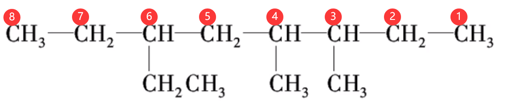

# 【化学】选必三：有机化合物的结构特点与研究方法

## 有机物的分类和表示

### 按碳的骨架分类

#### 有机化合物

$$
有机化合物
\begin{cases}
链状化合物，如丁烷~ \ce{CH3CH2CH2CH3}\\
环状化合物
\begin{cases}
脂环化合物\\
芳香化合物
\end{cases}
\end{cases}
$$

脂环化合物举例：。

芳香化合物举例（含有苯环）：。

#### 烃

只含有碳、氢两种元素的有机物。
$$
烃
\begin{cases}
链状烃(脂肪烃)
\begin{cases}
烷烃:只含有碳碳单键，如~\ce{CH4}\\
烯烃:有碳碳双键存在，如~\ce{CH2=CH2}\\
炔烃:有碳碳三键存在，如~\ce{CH#CH}
\end{cases}\\
环烃
\begin{cases}
脂环烃:分子中不含苯环，而含有其它环状结构的烃\\
芳香烃
\begin{cases}
苯\\
苯的同系物\\
稠环芳香烃
\end{cases}
\end{cases}
\end{cases}
$$
脂环烃举例：环丙烷 。

苯的结构式：。

苯的同系物举例：。

稠环芳香烃：。

### 按官能团分类

#### 官能团的定义

官能团是决定化合物特殊性质的原子或原子团。

#### 有机物的主要类别、官能团和典型代表物

|  类别  |                            官能团                            |                     代表物名称、结构简式                     |
| :----: | :----------------------------------------------------------: | :----------------------------------------------------------: |
|  烷烃  |                           无官能团                           |                       甲烷 $\ce{CH4}$                        |
|  烯烃  | 碳碳双键  |                     乙烯 $\ce{CH2=CH2}$                      |
|  炔烃  | 碳碳三键  |                      乙炔 $\ce{CH#CH}$                       |
| 卤代烃 |                卤代原子 $\ce{-X}$，或叫碳卤键                |       溴乙烷 $\ce{C2H5Br}$，官能团为碳溴键 $\ce{-Br}$        |
|   醇   |                       羟基 $\ce{-OH}$                        |                      乙醇 $\ce{C2H5OH}$                      |
|   酚   |                       羟基 $\ce{-OH}$                        | 苯酚  |
|   醚   | 醚键  |                  乙醚 $\ce{CH3CH2OCH2CH3}$                   |
|   醛   | 醛基  |                      乙醛 $\ce{CH3CHO}$                      |
|   酮   | 羰基  |                     丙酮 $\ce{CH3COCH3}$                     |
|  羧酸  | 羧基  |                     乙酸 $\ce{CH3COOH}$                      |
|   酯   | 酯基  |                 乙酸乙酯 $\ce{CH3COOCH2CH3}$                 |
| 氨基酸 |             氨基 $\ce{-NH2}$，羧基 $\ce{-COOH}$              | 甘氨酸  |
|   胺   |                    只含有氨基 $\ce{-NH2}$                    |                      甲胺 $\ce{CH3NH2}$                      |
|  酰胺  | 酰胺基 ，例如酰氯  | 乙酰胺  |

> 注：
>
> - 卤代烃指的是烃的氢原子被卤族原子代替后形成的产物。
> - 羰基碳氧双键左右都要连碳原子。
> - 酚羟基中，羟基一般与芳香环（大概分为苯环、萘环、$\alpha -$ 甲基萘等）相连，而醇羟基中，羟基一般与碳相连，据此可以根据结构式区分有机物是醇羟基还是酚羟基。

### 有机物常用的表示方法

有机物常见的表示方法有**结构式**、**结构简式**和**键线式**。

【结构式】就是将有机物分子内部所有原子的成键都画出来。

【结构简式】将有机物分子中的**碳碳单键**和**碳氢单键**省略掉所得到的结构，**也可以只省略碳氢键**，得到的结构就叫结构简式。

【键线式】将有机物的碳原子和氢原子全部省略掉，以碳骨架来表示有机物的结构。

【示例】如图所示，下图从左到右，分别是有机物 $2-$ 甲基 $-1-$ 丁烯的结构式、结构简式和键线式的表示方法。

## 有机物命名规则

### 有机物的命名

有机物结构复杂，种类繁多。为了使每一种有机物对应一个名称，需要按照一定的规则和方法，对每一种有机物进行命名。

### 烷烃的命名

#### 烷烃的相关介绍

烷烃是一类有机化合物，分子中的碳原子都以碳碳单键相连，其余的价键都与氢结合而成的化合物，属于饱和烃。分为环烷烃和链烷烃两类。 链烷烃的通式为 $\ce{C_nH_{2n+2}}$，环烷烃的通式为 $\ce{C_nH_{2n}}$，是最简单的一类有机化合物。

#### 习惯命名法

根据碳原子数进行命名：

- 碳原子数在 10 以下：依次用甲、乙、丙、丁、戊、己、庚、辛、壬、癸表示。
- 碳原子数在 10 以上：用中文数字表示。
- 遇到同分异构体，即碳、氢原子数目相同时：用正、异、新等来区别。

  示例：

#### 系统命名法

【命名步骤】

1. 选主链，称「某烷」：含有最多碳原子的链定位主链。具体选取规则见下方【主碳链&主碳链的选取规则】。
2. 编号位，定支链：需要遵循支链编号数字之和最小。具体详见下方【编号位需要遵循的原则】。

【命名架构】

位置编号（用阿拉伯数字表示）- 取代基 - 主碳链。

命名时以阿拉伯数字表示取代基或官能团（支链）的**位置编号**，以中文数字表示**取代基（相同支链）的个数**，阿拉伯数字与汉字间以短横线「$-$」分开，取代基则由碳数少的小取代基先写。

不同基团，命名时简单在前、复杂在后、相同合并，最后写主链名称。先写支链位置，再写支链名称，简单智联写在前（例如甲基写在乙基前面），多个相同侧链用汉字直接描述数目，比如「$2,2-$ 二甲基」，这两个 $2$ 就是支链的位置，「二」指的是同一个位置存在两个甲基。

> 注意：若一个基团上有多个甲基，则每个甲基的位置均需描述出来，例如 $2,2-$ 二甲基，而不是 $2-$ 二甲基。

例如，下面左图的烷烃，用系统命名法命名为 $3 - $ 甲基庚烷；右图的烷烃，用系统命名法命名为 $2,4-$ 二甲基 $- 3 - $ 乙基戊烷。

【常见的烃基（烃分子失去一个氢原子，剩余的基团）】

甲烷 $\ce{CH4}$ 失去一个氢原子，得到甲基 $\ce{-CH3}$，其中 $-$ 代表一个电子，可视为半个共价键。

乙烷 $\ce{C2H6}$ 失去一个氢原子，得到乙基 $\ce{-C2H5}$。

丙烷 $\ce{C3H8}$ 失去一个氢原子，可能得到正丙基 $\ce{C-C-C}-$ 或异丙基 。即正丙基所有碳原子都在主链上，而异丙基有一个碳原子在支链上。

乙烯 $\ce{CH2=CH2}$ 失去一个氢原子，可以得到乙烯基 $\ce{CH2=CH}-$。

苯 $\ce{C6H6}$ 失去一个氢原子，可以得到苯基 ，一般用 $\ce{Ph}-$ 表示。

> 注意：取代基也有同分异构体。

【取代基顺序规则】

- 烷基取代基命名顺序由简到繁，比如先命名丙基，再命名异丙基。
- 其它取代基命名，先比较各支链的第一个原子的原子序数大小，例如 $\ce{-I > -Br > -Cl > -F > -OH > -NH2 > C(烃基)}$，命名时先命名原子序数小的取代基，再命名原子序数大的取代基。当第一个原子先沟通，则比较与之相连的原子，以此类推，例如：溴原子序数大于氢原子，$\ce{-CH2Br > -CH3}$ 先命名甲基。

【主碳链&主碳链的选取规则】

- 以**最长的连续碳链**为主碳链，以此主链决定烷烃的基本名称。

- 支链最简原则：当有几个相同长度的最长碳链时，选择**含支链最多的一个**作为主链。

即选用主碳链时，取代基需要遵循「小而多」，例如，在下图的烷烃中，如果选用左图中标号碳链为主碳链，则取代基有 $3$ 个；而选用有右图，则取代基只有 $2$ 个，所以应该选用右图中的连续碳链作为主碳链。

【编号位需要遵循的原则】

编号位要遵循「近」「简」「小」的原则。

- 首先要考虑「近」，即以离支链较近的一端给主碳链原子编号。例如，下图中的烷烃，距离主碳链两端最近的是距离右端第二个碳上的取代基，所以应该从主碳链右端开始编号，命名为 $2,4 -$ 二甲基己烷。

  

- 同「近」则考虑「简」，即有两个不同的支链，且分别处于距离主链两端同近的位置，则从支链较简单的一端开始编号。例如，下图中的烷烃，距离主链两端的第三个碳上都有一个取代基，左端第三个碳上的乙基支链比右边第三个碳上的甲基简单，所以从左端开始编号，命名为 $3,4-$ 二甲基 $- 6 - $ 乙基辛烷。

  

- 若有两个相同的支链，且分别处于距主链两端同近的位置，而中间还有其它支链，从主链的两个方向编号，可得两种不同的编号序列，两序列中各支链位次和最小者即为正确的编号。例如，下图中的烷烃，主碳链从左向右和从右向左得到的分别是 $2,4,5 - $ 三甲基己烷和 $2,3,5-$ 三甲基己烷，由于 $2 + 4 + 5 < 2 + 3 + 5$，所以应该从左向右编号，命名为 $2,3,5-$ 三甲基己烷。

  

### 烯烃和炔烃的命名

#### 烯烃和炔烃的相关介绍

烯烃是指含有碳碳双键 $\ce{C=C}$ 键的碳氢化合物。属于不饱和烃，分为链烯烃与环烯烃。

炔烃，为分子中含有碳碳三键的碳氢化合物的总称，是一种不饱和的脂肪烃，直链单炔烃的分子通式为 $\ce{C_nH_{2n-2}}$（其中 $n$ 为非 $1$ 正整数），简单的炔烃化合物有乙炔 $\ce{C2H2}$，丙炔 $\ce{C3H4}$ 等。

其中烯烃中含有官能团 ，炔烃中含有官能团 。

#### 命名方法

步骤：

1. 选主链：将含有碳碳双键或碳碳三键的最长碳链作为主链，成为「某烯」或「某炔」。
2. 编序号：从距离碳碳双键或碳碳三键最近的一端对主链上的碳原子进行编号定位。除此之外，编号位仍然满足烷烃的系统命名法中「编号位遵循的规则」。
3. 写名称：将支链作为取代基，写在「某烯」或「某炔」的前面，并用阿拉伯数字标明碳碳双键或碳碳三键的位置，写出有机物的名称。

> 注意：
>
> - 选主链时选择含碳官能团的最长碳链，并且从距离含碳官能团近的一端开始编号，其他规则和烷烃命名一致。这一点不光烯烃或炔烃使用，对于含有醛基羧基等的有机物同样使用。
> - 当含碳官能团在 $1$ 号位命名也可以省略其位置。

示例：

例如，下图中的烷烃，首先选用含有碳碳双键的最长碳链为主链，再从距离碳碳双键最近的一端对主链上的碳原子进行编号定位，命名为 $2,3 - $ 二甲基 $- 1 -$ 丁烯，也可以命名为 $2,3-$ 二甲基丁烯。

同理，下图中的炔烃，命名为 $4,4 -$ 二甲基 $- 2 $ 戊炔。

> 注意：
>
> - 烯烃或炔烃需要用阿拉伯数字写出碳碳双键的位置。
>
> - 选择主碳链时，一定要包含所有的双键，例如下图中的烯烃，只能选用编号链作为主链，同时考虑到要使得取代基乙基的编号较小，所以应该命名为 $2 -$ 乙基 $-1,3-$ 丁二烯。 所以有时候选用的并非原烯烃中最长的链。
>
>   
>
> - 碳碳双键需要考虑顺反异构体。顺反异构，又名几何异构，属于立体异构中的一种。顺反异构是指化合物分子中由于具有自由旋转的限制因素，使各个基团在空间的排列方式不同而出现的非对映异构现象。如图所示，若 $\ce{R_1\ne R_2}$ 且 $\ce{R_3\ne R_4}$ 则存在顺反异构。若相同原子团在同一侧，则称为顺式；若在不同侧，则称为反式。
>
>   
>
>   例如，下面左图中的烯烃由于上面的两个碳原子在同一侧，所以就是顺式，称为顺 $- 2 - $ 丁烯；而右图中烯烃由于碳原子在不同侧，所以就是反式，称为反 $-2-$ 丁烯。
>
>   

### 烃的衍生物命名规则

#### 含有官能团的有机物

【步骤】

1. 选母体：将含有官能团的最长碳链作为主链，称为「某烯」「某醇」等。
1. 编序号：从距离官能团最近的一端对主链碳原子进行编号。例如  这个有机物中，羟基 $\ce{-OH}$ 和甲基与主碳链两端距离相等，但**羟基是官能团，甲基不是官能团，只是取代基**，所以需要从左往右编号。
1. 写名称：将支链作为取代基，写在「母体」名称的前面，并用阿拉伯数字标明支链和官能团的位置。

> 注意：取代基要写在官能团前面。

【总结】含官能团的有机物系统命名时，选主链、编号位要围绕官能团进行，且要注明官能团的位置及数目。

【官能团的数目】

含有两个或两个以上相同官能团的有机物命名要称之为「某二……」「某三……」，不能称之为「二某……」「三某」。如  命名为「乙二醇」，而非「二乙醇」； 命名为「丙三醇」；再如 $\ce{CH2=CH-CH=CH2}$ 命名为「$1,3 -$ 丁二烯」，而不是「$1,3-$ 二丁烯」； 命名为乙二酸，也叫草酸； 命名为 $1,6-$ 己二醇。

【高中常见的官能团优先次序表】

排在前面的是命名较优先的官能团。
$$
\ce{-COOH > -COO- > -CONH2 > -CHO > 醇 -OH > 酚 -OH > -NH2 > 三键 > 双键 》 -Ph(苯基) > 烷基 > -X > -NO2}
$$
简记：羧酯和酰胺，醛醇酚和胺，三双后有苯，烷基卤硝基。

> 除了硝基以外，含有 $\ce{O}$ 元素的官能团优先于含有 $\ce{N}$ 的官能团，含有 $\ce{N}$ 的官能团优先于没有 $\ce{N}$ 的官能团。含有两个 $\ce{O}$ 的羧基和酯基优先于含有一个 $\ce{O}$ 和一个 $\ce{N}$ 的酰胺，又优先于只有一个 $\ce{O}$ 的醛基、醇羟基、酚羟基，再优先于只有一个 $\ce{N}$ 的胺基。

在多官能团分子中，以顺序大为主官能团作为命名的母体类别，并以此确定起点位置，对碳链编号，顺序小的为次官能团，作为取代基进行命名，基本原则与烷烃类似。

例如，下图的有机物，将氨基作为取代基进行命名，称为 $4 -$ 氨基 $-$ 丁酸。

若是碳碳双键（或碳碳三键），组合羧基、醛基、羟基等，可以形成例如烯酸、稀醛、烯醇等，例如 $\ce{CH2=CHCOOH}$ 是丙烯酸。

【酯类命名】

根据 $\ce{A~酸 + B~醇 -> A~酸~B~酯}$，遇到含有酯基的物质（酯类），我们需要先观察出它是由哪个酸和哪个醇得到的，然后命名为 $\ce{A}$ 酸 $\mathrm B$ 酯。

【示例】

例 1：下图中的有机物，应该按照编号作为主碳链，将甲基写在羟基前面，所以命名为 $4 - $ 甲基 $-2-$ 戊醇。

同理，下图中的有机物，应该命名为 $3 -$ 甲基 $- 2 - $ 丁醇。

例 2：下图左边的有机物，对主碳链从左到右编号，羟基在第二个碳上，命名为 $2 - $ 丁醇；右边的有机物，由于存在羧基，所以考虑从羧基开始编号主碳链，那么此时在 $2$ 号碳上有一个乙基，同时由于羧基含有碳，**一定在第一个碳上**，所以**不需要指出羧基的位置编号**，命名为 $2 -$ 乙基戊酸。

例 3：下图中的有机物，由六个碳构成了一个环，所以叫环己醇，那么考虑编号位顺序，从羟基所在的碳开始顺时针编号，则命名为 $2 - $ 溴环己醇。

例 4：对于有机物 $\ce{HOCH2CH2CHO}$，由于优先级 $\ce{-CHO > 醇~-OH}$，所以从含有醛基的一端开始编号，则羟基在 $3$ 号碳上，所以命名为 $3-$ 羟基丙醛。

例 5：下图所示的有机物，由于含有酯基，根据 $\ce{A~酸 + B~醇 -> A~酸~B~酯}$，我们需要将得到该酯的酸和醇找到。按照下图分割可知，它是由 $3,3-$ 二甲基丁酸  和甲醇 $\ce{CH3OH}$ 得到的酯，命名为 $3,3-$ 二甲基丁酸甲酯。

例 6：如图所示的有机物，相当于甲酰胺  中两个氢原子被两个甲基取代，所以可命名为 $\ce{N,N}-$ 二甲基甲酰胺。

### 苯的同系物的命名

#### 苯的同系物相关介绍

苯的同系物一般有两个条件：

1. 结构中只有一个苯环。
2. 侧链只有烷基。

#### 习惯命名法

> 习惯命名法命名时，烷基的「基」可省略。

- 若为**一元烷基取代**（一元取代物），则可根据侧链取代基的名称，直接命名为「某苯」，例如甲苯、乙苯。
- 若苯环上仅有两个取代基（二元取代物）时，可分别用「邻」「间」和「对」来表示两取代基的相对位置，并用「相对位置 + 取代基名称 + 苯」命名。

#### 系统命名法

- 若**烷基相同**，则以其中一个烷基所在的 $\ce{C}$ 为起点，通过顺时针或逆时针编号，需要保证**取代基位置序号之和最小**。

- 若**烷基不同**，则以**最简单的烷基**所在的 $\ce{C}$ 为起点，通过顺时针或逆时针编号，保证取代基位置序号之和最小。同时，习惯上一般让简单的基团所在支链编号较小。例如，下图的有机物，一般命名为 $1,3-$ 二甲基 $-5-$ 乙基苯，而不是 $1,5-$ 二甲基 $-3-$ 乙基苯。

  
  
- 若苯环的侧链**较复杂**时，或**苯环上含有不饱和烃基**时，命名时一般把苯环作取代基，将较长的碳链作主链进行命名。此时选取主碳链的原则与之前烷烃、烯烃和炔烃相同。例如下图中的有机物，命名为 $2,5-$ 二甲基 $-4-$ 乙基 $-3-$ 苯基己烷。

  

#### 示例

|   结构简式   |  |  |  |
| :----------: | :----------------------------------------------------------: | :----------------------------------------------------------: | :----------------------------------------------------------: |
| **习惯名称** |                           邻二甲苯                           |                           间二甲苯                           |                           对二甲苯                           |
| **系统名称** |                        $1,2-$ 二甲苯                         |                        $1,3-$ 二甲苯                         |                        $1,4-$ 二甲苯                         |

> 注意：邻二甲苯也可以命名为邻二甲基苯，但习惯上省略「甲」。

### 含苯结构的有机物命名

根据上文取代基（官能团）的优先等级可知：

- 若苯的侧链为烷基、$\ce{-X}$、$\ce{-NO2}$，由于苯基的优先级高于它们，所以苯环为母体。命名的最后一个字是「苯」。如下图所示，由于烷基的优先级比卤素大，所以母体是甲苯，那么应该命名为 $2-$ 氯甲苯，习惯命名法命名为邻氯甲苯。

  

- 若苯的侧链为其它取代基/官能团，由于其它官能团优先级更高，所以其他官能团为母体，苯为取代基。下图是常见的苯为取代基的有机物。注意：羟基 $\ce{-OH}$ 与苯环相连时，这里的羟基是**酚羟基**而不是**醇羟基**。

  
  
  

> 说明：
>
> 对于对苯二甲酸的命名：首先考虑主体是「甲酸」，由于羧基有两个，所以是「二甲酸」，再考虑到两个羧基在苯环上的位置是相对的，所以应该是「对苯二甲酸」。
>
> 如下图所示，该有机物含有酯基，是酯类，可以发现它是由对苯二甲酸  和甲醇 $\ce{CH3OH}$ 得到的，所以命名为对苯二甲酸甲酯。
>
> 邻羟基苯甲酸的知识：酰基  中若 $\ce R$ 为乙基，则是乙酰基 ，若邻羟基苯甲酸中 $\ce{-OH}$ 由乙酰基替换，则会得到乙酰水杨酸，如下图所示。乙酰水杨酸俗名是阿司匹林，所以阿司匹林显酸性。服用过多阿司匹林可能会对肠胃造成负担。
>
> 
