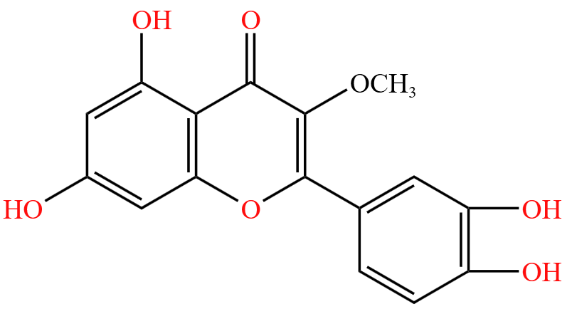

# 【化学】选必三：有机化合物的结构特点与研究方法

## 有机物的六式两模型

### 有机物的「六式」

#### 分子式

定义：用元素符号表示物质分子组成的式子。

例如：甲烷的分子式为 $\ce{CH4}$，乙烷的分子式为 $\ce{C2H6}$，乙炔的分子式为 $\ce{C2H2}$，蔗糖（麦芽糖）的分子式是 $\ce{C12H22O11}$。

> 注意：只有分子才有分子式。

#### 实验式（最简式）

定义：分析实验中，通过燃烧法测定。有机物主要含有 $\ce{C、H、O}$ 三种元素，燃烧之后，$\ce{C}$ 全部变成 $\ce{CO2}$，$\ce{H}$ 全部变成 $\ce{H2O}$，可通过 $\ce{CO2}$ 和 $\ce{H2O}$ 的质量计算出有机物中的 $\ce{C、H、O}$ 最简整数比。

例：$\ce{C2H4、C3H6}$ 的实验式都是 $\ce{CH2}$。

#### 电子式

定义：用 $·$ 或 $\times$ 表示原子最外层电子的成键情况。

例：甲基 $\ce{-CH3}$ 的电子式是 。注意：不能单纯通过电子式中电子的数量来判断电子的数目，它只表示最外层电子的成电情况。比如甲基电子式中虽然只标明了 $7$ 个电子，但它实际上有 $6 + 3 = 9$ 个电子。

#### 结构式

定义：再电子式中用一条短线表示一对共用电子对将每个原子连接起来的式子。即将有机物分子内部所有原子的成键都画出来。

例：甲烷的结构式为 ，丙烯的结构式为 ，而不是 ，它是丙二烯。

#### 结构简式

定义：将有机物分子中的**碳碳单键**和**碳氢单键**省略掉所得到的结构，**也可以只省略碳氢键**，得到的结构就叫结构简式。

书写：先建立碳骨架，然后填入氢。

例：正戊烷从结构式简化到结构简式的过程如下：

> 后两种都是结构简式。

$1-$ 丁烯从结构式简化到结构简式的过程：

乙酸从结构式简化到结构简式的过程：

> 注意：氢氧键可以合并为 $\ce{-OH}$，氮氢键也可以合并为 $\ce{-NH2}$，碳氧键、碳氮键也可以合并在一起，例如 $\ce{CH3CH2OH、CH3NH2}$。

注意事项：

1. 应该先写出主碳链，再补上氢原子与后续官能团。
2. 需要准确表示分子中原子的成键情况。绝大多数情况下，化学键应该写在**成键原子**旁，如 $\ce{-NO2}$ 不能写成 $\ce{NO2 -}$。物质「肼」必须写成 $\ce{H2N-NH2}$，以确保化学键连接的是成键原子 $\ce N$。但对于碳原子而言，由于实在用得太多，人们为了方便书写，可以不精确区分成键原子。如 $\ce{-CH3}$ 与 $\ce{CH3 -}$ 在一般情况下没有区别。同理，$\ce{H2C=CH2}$ 与 $\ce{CH2=CH2}$ 等效。
3. 可以省略的键：醛基 $\ce{-CHO}$ 中各键，羧基 $\ce{-COOH}$ 中各键，氰基 $\ce{-CN}$ 中各键，碳卤键等。
4. 不可省略的键：碳碳双键、碳碳三键。

> 实际上，对于结构简式而言，只要满足**结构的唯一性**，可以任意省略键。

#### 键线式

定义：将有机物的碳原子和氢原子全部省略掉，只表示出碳碳键以及与碳原子项链的官能团，以碳骨架来表示有机物的结构。

通过键线式写出结构简式的方法：先数出碳原子的个数，建立碳骨架；再在碳原子上填入氢。

例： 的结构简式为 $\ce{CH3-CH2-CH2-CH2-CH3}$。

$\ce{HOOC-CH2-CH2-COOH}$ 的键线式为 。

如图所示，下图从左到右，分别是有机物 $2-$ 甲基 $-1-$ 丁烯的结构式、结构简式和键线式的表示方法。

注意事项：

1. 键线式一般之忽略 $2$ 个碳原子以上的有机物。
2. 只忽略 $\ce{C-H}$ 键，其余不能忽略。
3. 只忽略**碳上**的氢原子，官能团的氢原子不省略。
4. 计算分子式时不要忘记顶端碳原子。

### 有机物的「两型」

#### 球棍模型

定义：可以反应分子的**三维空间分布**的模型。主要描述原子大小、成键特性、分子构型。

例： 表示乙烯。

#### 空间填充模型（比例模型）

定义：表示分子中各原子的**实际大小**和**连接情况**。（没有表示出成键特性）

例： 表示乙烯。
注意：判断空间填充模型时，需重点分析原子的半径。例如：$\ce{CCl4}$ 的空间填充模型不能是 ，因为 $\ce{Cl}$ 的原子半径比 $\ce{C}$ 大。

## 有机物的分类方法

### 按元素分类

$$
\begin{cases}
烃:只含~\ce{C、H}，例如~\ce{CH4}\\
烃的衍生物:含~\ce{C、H、O、N、P、S、Cl、Br}~等元素，例如~\ce{CH3Br}
\end{cases}
$$

> 注意：碳酸 $\ce{H2CO3}$，以及 $\ce{HCN、SiC}$ 等属于无机物，而草酸 $\ce{H2C2O4}$ 属于有机物。有机物和无机物并没有特别明确的界限。

### 按碳骨架分类

#### 有机化合物

$$
有机化合物
\begin{cases}
链状化合物
\begin{cases}
脂肪烃:烷烃、烯烃、炔烃等都属于脂肪烃，如丁烷~ \ce{CH3CH2CH2CH3}\\
脂肪烃的衍生物
\end{cases}\\
环状化合物
\begin{cases}
脂环化合物
\begin{cases}
脂环烃:不含苯环(大~\pi~键)的环烃\\
脂环烃的衍生物:例如环己醇
\end{cases}\\
芳香化合物
\end{cases}
\end{cases}
$$

脂肪烃的衍生物举例：。

脂环烃举例：。

脂环烃的衍生物举例：环己醇 ，四氢呋喃 。

芳香化合物举例（含有苯环）：。

#### 烃

只含有碳、氢两种元素的有机物。
$$
烃
\begin{cases}
链状烃(脂肪烃)
\begin{cases}
烷烃:只含有碳碳单键，如~\ce{CH4}\\
烯烃:有碳碳双键存在，如~\ce{CH2=CH2}\\
炔烃:有碳碳三键存在，如~\ce{CH#CH}
\end{cases}\\
环烃
\begin{cases}
脂环烃:分子中不含苯环，而含有其它环状结构的烃\\
芳香烃
\begin{cases}
苯\\
苯的同系物\\
稠环芳香烃
\end{cases}
\end{cases}
\end{cases}
$$
脂环烃举例：环丙烷 。

苯的结构式：。

苯的同系物举例：。

稠环芳香烃：。

### 按官能团分类

#### 官能团的定义

官能团是决定有机化合物特殊性质（主要是化学性质）的原子或原子团。

#### 有机物的主要类别、官能团和典型代表物

|    类别    |                            官能团                            |                     代表物名称、结构简式                     |
| :--------: | :----------------------------------------------------------: | :----------------------------------------------------------: |
|    烷烃    |                           无官能团                           |                       甲烷 $\ce{CH4}$                        |
|    烯烃    | 碳碳双键  |                     乙烯 $\ce{CH2=CH2}$                      |
|    炔烃    | 碳碳三键  |                      乙炔 $\ce{CH#CH}$                       |
|   卤代烃   |                卤代原子 $\ce{-X}$，或叫碳卤键                |       溴乙烷 $\ce{C2H5Br}$，官能团为碳溴键 $\ce{-Br}$        |
|     醇     |                       羟基 $\ce{-OH}$                        |                      乙醇 $\ce{C2H5OH}$                      |
|     酚     |                       羟基 $\ce{-OH}$                        | 苯酚  |
|     醚     | 醚键  |                  乙醚 $\ce{CH3CH2OCH2CH3}$                   |
|     醛     | 醛基  |                      乙醛 $\ce{CH3CHO}$                      |
|     酮     | 酮羰基  |                     丙酮 $\ce{CH3COCH3}$                     |
|    羧酸    | 羧基  |                     乙酸 $\ce{CH3COOH}$                      |
|     酯     | 酯基  |                 乙酸乙酯 $\ce{CH3COOCH2CH3}$                 |
|   氨基酸   |             氨基 $\ce{-NH2}$，羧基 $\ce{-COOH}$              | 甘氨酸  |
|     胺     |                    只含有氨基 $\ce{-NH2}$                    |                      甲胺 $\ce{CH3NH2}$                      |
|    酰胺    | 酰胺基  或酰胺键 ，例如酰氯  | 乙酰胺  |
| 硝基化合物 |                       硝基 $\ce{-NO2}$                       | 硝基苯  |
|     腈     |                       氰基 $\ce{-CN}$                        |                   丙烯腈 $\ce{CH2=CH-CN}$                    |

> 注：
>
> - 卤代烃指的是烃的氢原子被卤族原子代替后形成的产物。
> - 羰基碳氧双键左右都要连碳原子。
> - 酚羟基中，羟基一般与芳香环（大概分为苯环、萘环、$\alpha -$ 甲基萘等）相连，而醇羟基中，羟基一般与脂肪类（脂肪烃、脂环等）相连，据此可以根据结构式区分有机物是醇羟基还是酚羟基。
> - 酮羰基碳原子两边必须连碳。

例：问高聚物（聚酯）  中含有哪些官能团？

高聚物相当于中间框内部分重复 $n$ 次，框外两边部分不变。那么首先考虑框外部分，两边含有羧基 $\ce{-COOH}$ 和羟基 $\ce{-OH}$，将框内部分展开如下：

从而可以看出其中还有酯基。

## 有机物中的共价键

### 有机物碳原子成键特点

有机物碳原子成键特点：（碳碳）单键可以旋转，（碳碳）双键、三键不能旋转。简而言之，$\sigma$ 键可以旋转，但 $\pi$ 键不能旋转。

 ### 甲烷型

#### 成键

甲烷分子中有 $4$ 条 $\ce{C-H}$ 单键。

在甲烷分子中，$\ce{H}$ 原子的 $\ce{1s}$ 轨道与 $\ce{C}$ 原子的一个 $\ce{sp^3}$ 杂化轨道以「头碰头」的形式相互重叠，形成 $\sigma$ 键。

通过 $\sigma$ 键连接的原子或原子团**可绕键轴旋转**而不会导致化学键破坏。

#### 结构

甲烷是正四面体结构。凡是碳原子与 $4$ 个原子形成 $4$ 个共价键时，其空间结构都是四面体形。$5$ 个原子中最多有 $3$ 个原子共平面。

例如：二氯甲烷 $\ce{CH2Cl2}$ 碳上另外四个位置完全等效，所以没有同分异构体。

### 乙烯型

#### 成键

乙烯分子中有 $4$ 条 $\ce{C-H}$ 单键，$1$ 条 $\ce{C-C}$ 双键（一条 $\ce{C-C}$ $\sigma$ 键，一条 $\ce{C-C} ~\pi$ 键）。

乙烯分子中，碳原子以 $\ce{sp^2}$ 杂化轨道与氢原子的 $\ce{1s}$ 轨道及另一个碳原子的 $\ce{sp^2}$ 杂化轨道进行重叠，形成 $4$ 个 $\ce{C-H}$ $\sigma$ 键与一个 $\ce{C-C}$ $\sigma$ 键；两个碳原子未参与杂化的 $\ce p$ 轨道以「肩并肩」的形式从侧面重叠，形成 $\pi$ 键。 

通过 $\pi$ 键连接的原子或原子团**不能绕键轴旋转**。

#### 结构

乙烯为平面结构。与碳碳双键直接相连的 $4$ 个原子与 $2$ 个碳原子共平面。

例：$\ce{CH2=CHCH3}$ 至少有 $6$ 个原子共面（下图中红框中的 $6$ 个原子共面），最多有 $7$ 个原子共平面（在原来 $6$ 个原子的基础上，红框外的三个氢原子通过旋转，使得其中有一个氢原子与红框中的 $6$ 个原子共面）。

### 乙炔型

#### 成键

乙炔分子中有 $2$ 条 $\ce{C-H}$ $\sigma$ 键，$1$ 条 $\ce{C-C}$ $\sigma$ 键和 $2$ 条 $\ce{C-C}$ $\pi$ 键。

乙炔分子中，$\ce C$ 原子以 $\ce{sp}$ 杂化轨道与氢原子的 $\ce{1s}$ 轨道及另一个 $\ce{C}$ 原子的 $\ce{sp}$ 杂化轨道进行重叠，形成 $2$ 个 $\ce{C-H}$ $\sigma$ 键与 $1$ 个 $\ce{C-C}$ $\sigma$ 键；两个 $\ce{C}$ 原子未参与杂化的 $\ce p$ 轨道以「肩并肩」的形式从侧面重叠，形成 $2$ 个 $\pi$ 键。

#### 结构

乙炔为直线结构。与碳碳三键直接相连的 $2$ 个原子与 $2$ 个碳原子共直线。

### 苯型

#### 成键

苯分子中有 $6$ 条 $\ce{C-H}$ $\sigma$ 键，$6$ 条 $\ce{C-C}$ $\sigma$ 键和 $1$ 条环状的离域 $\pi$ 键（大 $\pi$ 键）。

苯分子中，$\ce C$ 原子以 $\ce{sp^2}$ 杂化轨道与 $\ce{H}$ 原子的 $\ce{1s}$ 轨道及另一个 $\ce{C}$ 原子的 $\ce{sp^2}$ 杂化轨道进行重叠，形成 $6$ 个 $\ce{C-H}$ $\sigma$ 键与 $6$ 个 $\ce{C-C}$ $\sigma$ 键。$6$ 个 $\ce{C}$ 原子未参与杂化的 $\ce{p}$ 轨道以「肩并肩」的形式相互重叠且程度相同，由此在环平面的上下形成了离域 $\pi$ 键。

#### 结构

苯为平面六边形结构。

位于苯环上的 $12$ 个原子共平面，位于对角线位置上的 $4$ 个原子共直线。

### 总结

- 一般情况下，有机化合物中的单键是 $\sigma$ 键，双键中含有一个 $\sigma$ 键和一个 $\pi$ 键，三键中含有一个 $\sigma$ 键和两个 $\pi$ 键。
- 共价键的类型与有机反应的类型密切相关：甲烷分子中含有 $\ce{C-H}$ $\sigma$ 键，能发生**取代反应**；乙烯和乙炔分子的双键和三键中含有 $\pi$ 键，能发生**加成反应**。即结构决定性质。

### 共线共面问题

基本思路：

- 问最少：画出构型，判断。
- 问最多：旋转单键，判断。

技巧：只要有 $\ce{sp^3}$ 杂化的碳原子，有机物一定不可能所有原子共平面。

例题：

例 1： 最多有多少个原子共直线，多少个原子共平面？

画出其构型，如下图所示。根据下图可知，最多有 $6$ 个原子共直线，所有原子（$18$ 个原子）共平面。

例 2： 分子中，同一平面内的碳原子至少有多少个？

首先左边的苯环，加上其连着的碳原子，总共有 $7$ 个碳一定共面，然后考虑绕中间轴旋转，则另一个苯环上也一定有 $2$ 个碳原子与其共面，那么同一平面内的碳原子至少有 $9$ 个。

## 同系物和同分异构现象

### 同系物

定义：结构相似、分子组成相差若干个 $\ce{CH2}$ 原子团的有机物互称为同系物。

> 注意：结构相似指有机物的官能团种类、数目必须相同。

> 性质：同系物的不饱和度也一定相同。

判断：

- 首先判断给定两种有机物含有官能团的种类、数目相同。
- 然后再判断两种有机物分子式是否相同：在不含环的情况下，一般只需判断碳数是否一致即可，若碳数不一致，则说明是同系物；否则是同分异构体。

例：

对于烷烃而言，所有不含碳碳双键、三键、环的链状烷烃，都互为同系物。

对于烯烃而言，其同系物中含有碳碳双键的个数一定与原烯烃中含有碳碳双键的个数相同。例如： 是乙烯的同系物，但  不是乙烯的同系物。

> 注意：醇羟基和酚羟基不属于同一种官能团，需要区分。

### 同分异构现象

#### 定义&性质

同分异构现象：化合物具有**相同的分子式**，但具有**不同结构**的现象。

同分异构体：分子式相同而结构不同的有机物互为同分异构体。

性质：互为同分异构体的有机物，**分子式**和**不饱和度**一定相同。

#### 分类

#### 构造异构

定义：化合物中原子及原子团的连接次序不同。

碳骨架异构：碳骨架不同而产生的异构，如下图。

官能团位置异构：官能团位置不同而产生的异构，如下图。

> 注：左图的醇是**端基醇**，右图的图是**非端基醇**。

官能团类型异构：官能团种类不同而产生的异构，如下图。

#### 立体异构

定义：原子或原子团互相连接的次序相同，但在空间的排列方式不同。

顺反异构：

顺反异构，又名几何异构，属于立体异构中的一种。顺反异构是指化合物分子中由于具有自由旋转的限制因素，使各个基团在空间的排列方式不同而出现的非对映异构现象。如图所示，若 $\ce{R_1\ne R_2}$ 且 $\ce{R_3\ne R_4}$ 则存在顺反异构。若相同原子团在同一侧，则称为顺式；若在不同侧，则称为反式。

例如，下面左图中的烯烃由于上面的两个碳原子在同一侧，所以就是顺式，称为顺 $- 2 - $ 丁烯；而右图中烯烃由于碳原子在不同侧，所以就是反式，称为反 $-2-$ 丁烯。

> 顺反异构产生的本质：碳碳双键或氮氮双键 $\ce{N=N}$ 不可旋转。例如  该结构存在顺反异构。
>
> 注意：只含有 $\ce{N-N}$ 键的物质不存在顺反异构。

对映异构（手性异构或旋光异构）：

两分子呈镜像关系，相似但不能完全重叠，互称为对映异构体。

> 手性原子：是指与四个各不相同的原子或基团相连的原子，用星号 * 表示。对于环状物质，不能只看与碳原子相连的最近的原子，例如  该物质中，① 号碳原子，虽然有两个位置都连的是碳原子，但右边经过 $2$ 个碳就到达分叉口了，而左边需要经过 $3$ 个碳，所以两个碳并不等价，所以 ① 号碳仍然是手性碳。

## 不饱和度

### 定义及计算方法

【定义】不饱和度指的是缺氢指数，符号：$\Omega$。它是和**饱和烷烃**相比，每少 $2$ 个氢不饱和度 $+1$。例：对于 $\ce{C4H8}$ 的不饱和度，和 $4$ 个碳的饱和烷烃 $\ce{C4H10}$ 对比，氢原子少了两个，所以不饱和度为 $1$。

【计算不饱和度规则】卤族原子当氢看，氧原子直接忽略，分子式有氮时，需要减掉 $\ce{NH}$ 再算不饱和度。

【计算口诀】碳数加一氢减半，卤加氮减氧不算。例如：$\ce{C7H10}$ 的不饱和度，可以直接碳数 $7+1$ 减一半氢 $-5$，所以不饱和度为 $3$；$\ce{C7H12}$ 的不饱和度，首先遇到氮，减去一个 $\ce{NH}$，得到 $\ce{C7H10Cl2}$，再把 $\ce{Cl}$ 看成氢，得到 $\ce{C7H12}$，碳数 $7+1$ 减一半氢 $-6$，所以不饱和度为 $2$。

【作用】在分子式和结构式之间建立了链接，可以帮助我们快速书写复杂有机物的分子式，也可以判断给定分子式的有机物中可能含有哪些官能团。

> 注意：不饱和度不为 $0$ 的烃不一定是不饱和烃，饱和烃的定义是「分子中的碳原子都以单键相连，其余的价键都与氢结合而成的化合物」，饱和烃的通式为 $\ce{C_nH_{2n}}$。例如，环己烷虽然不饱和度不为 $0$，但它是饱和烃。

### 有机物中特殊结构的不饱和度

双键是 $1$ 个不饱和度，三键是 $2$ 个不饱和度，苯环是 $4$ 个不饱和度，硝基 $\ce{-NO2}$ 是 $1$ 个不饱和度，氨基 $\ce{-NH2}$ 是 $0$ 个不饱和度。环是 $1$ 个不饱和度，例如环丁烷分子式为 $\ce{C4H8}$，相比丁烷少了两个氢，不饱和度为 $1$。立体结构可能存在多个环，**立体结构计算不饱和度方法为环总数（总面数） $-1$**，例如立方烷 ，分子式为 $\ce{C8H8}$，六个面有 $6$ 个环，但是不饱和度为 $5$。

> 当面数不好数时，可以采用最保险的**分子式法**，即根据立体结构写出有机物的分子式，然后根据不饱和度的一般求法解决问题。

所以当有一个不饱和度时，需要考虑分子中可能有醛基 ，羧基 等；当没有氧，有一个不饱和度时，需要考虑分子中可能有碳碳双键，环烷烃等；当不饱和度 $\ge 4$ 时，一般默认分子中含有苯环。

> 苯环 $4$ 个 $\Omega$ 的另一种计算方法：相当于一个环（$1$ 个 $\Omega$）加上三个碳碳双键（$3$ 个 $\Omega$），总共 $4$ 个 $\Omega$。

### 给定有机物结构式求分子式

思路：

1. 根据特殊结构的不饱和度，求出整个有机物分子的不饱和度。
2. 数出有机物结构式中 $\ce C$ 的个数，写出假设只考虑碳氢原子时的分子式。
3. 若题目有其它原子，再替换或增加其他原子：卤素原子要替换掉同等数量的氢原子，氧原子直接加上，有多少个 $\ce{N}$ 就加多少个 $\ce{NH}$。

如下图所示，该有机物有 $1$ 个双键，$1$ 个苯环，$1$ 个碳环，所以不饱和度为 $1 + 4 + 1 = 6$。该有机物中有 $12$ 个 $\ce C$，那么若不考虑卤素原子和氧原子，有机物应该为 $\ce{C12H14}$，考虑把原来的 $\ce{Cl}$ 换回去，并加上氧原子，得到有机物分子式为 $\ce{C12H13ClO}$。

下图的有机物，有 $1$ 个苯环，$1$ 个碳环，所以不饱和度为 $4 + 1 = 5$，有 $11$ 个 $\ce{C}$，只考虑碳氢原子，分子式应为 $\ce{C11H14}$，由于有 $1$ 个氮原子，所以考虑加回来一个 $\ce{NH}$，所以最后有机物的分子式为 $\ce{C11H15N}$。

下图有机物，不饱和度为 $1 + 4 + 2 + 4 = 11$，有 $16$ 个碳，只考虑碳氢原子分子式为 $\ce{C16H12}$，加上氧，有机物分子式为 $\ce{C16H12O7}$。

> 注意：多个苯环相连，若苯环数量为 $n$，则不饱和度为 $4n - n + 1 = 3n + 1$。

### 不饱和度的意义

看待有机物组成的两种视角：

- 传统方法：有机物分子式、有机物结构式。
- 新视角：碳原子数、氧原子数、不饱和度 $\Omega$、官能团。

> 新视角不用数出氢原子个数。

总结：不饱和度 $\Omega$ 是有机物分子式与结构式之间的桥梁，可以确定有机物基本信息。

## 等效氢和等效碳

### 定义

化学环境相同的氢原子/碳原子。「化学环境」可以理解为共价键的电子云环境。

### 识别

#### 情况一

连在同一个碳上且结构相同的碳等效。

如图，$1,2$ 号碳连在同一个碳上且结构相等（都为 $\ce{-CH3}$），他们就是等效碳。同时，**连在同一个碳上的氢等效**，所以 $1,2$ 上接的所有氢均等效。而 $4,5$ 号碳虽然都连在 $3$ 号碳上，但它们结构明显不同，不能通过旋转或对称重合，所以 $4,5$ 号碳并非等效碳。

那么该有机物中，连有氢原子的碳原子一共有 $6$ 种，那么其一氯代物有 $6$ 种情况。

> 有机物分子中有多少非等效碳原子，就有多少氢原子，那么就有多少种情况。

> 注意：高中阶段，$\ce{-OH}$、$\ce{-CHO}$ 和 $\ce{-COOH}$ 等官能团上的氢原子**不考虑取代**。

#### 情况二

可以通过对称轴对称或旋转而重合的碳原子等效。

如下图，单键是可以旋转的，通过旋转：1 和 2、3 和 4 号位碳原子分别可以完全重合，可以完全重合、且结构相同的碳等效。

若 1 号碳多连一个甲基而 2 号碳没有甲基，那么他们不可能等效。

#### 情况三

连在等效碳上的氢原子互相等效。

连在同一个碳上/等效碳上的氢原子，相当于同一种氢原子。所以一个邮寄结构种有几种碳原子（碳上连氢），就有几种氢原子。

例如：甲基 $\ce{-CH3}$ 中三个 $\ce{H}$ 连在同一个碳上，是等效氢；甲烷上四个碳原子等效，所以其一氯代物、二氯代物、三氯代物和四氯代物都只有 $1$ 种情况。

#### 常见的等效氢

- 连在同一个碳原子上的氢原子等效。
- 连载同一个碳原子上的甲基上的氢原子等效。
- 处于对称位置上（中心对称或轴对称）的氢原子等效。

#### 求等效氢的一般方法

- 对于链状物质，先找到分岔口，即连在同一个碳上的官能团/原子，若官能团/原子相同，则两个官能团/原子上的氢原子等效；若官能团/原子不同，则两个官能团/原子上的氢原子均不等效。
- 对于环状物质，先找到对称轴或对称中心，则对称图形上对应点上的氢原子完全等效。

> 注意：对于**烃**来说，有几种等效氢，就有几种一取代物。但是对于其他物质而言，这句话并不成立。例如，下图中的有机物，有 $3$ 种等效氢，但羧基上的氢原子，不能被氯取代，所以它的一氯代物只有 $2$ 种。
>
> 
>
> 再如下图中的有机物，有 $3$ 个等效氢，但羟基上的氢不考虑取代，所以只有 $2$ 种一氯代物。
>
> 

### 例题

例（2021 河北）：苯并降冰片烯是一种重要的药物合成中间体，结构简式如图。关于该化合物，下列说法正确的是（）

A. 是苯的同系物

B. 分子中最多 $8$ 个碳原子共平面

C. 一氯代物有 $6$ 种（不考虑立体异构）

D. 分子中含有 $4$ 个碳碳双键

---

分析：

对于 A 选项，由于含有官能团的数目不同（比苯多了碳碳双键），或不饱和度不同，所以不是苯的同系物，A 选项错误。

对于 B 选项，苯上的 $6$ 个碳一定共平面，除此之外，与苯相连的两个碳一定共平面，其余不可能共平面，如下图所示（红框内共平面），B 选项正确。

对于 C 选项，如下图，按照箭头所在直线为对称轴，等效氢有 $5$ 种，所以有 $5$ 种一氯代物，C 选项错误。 

对于 D 选项，分子中含有一个碳碳双键和**一个大 $\pi$ 键**，不是含有 $4$ 个碳碳双键，D 选项错误。

## 有机物命名规则

### 有机物的命名

有机物结构复杂，种类繁多。为了使每一种有机物对应一个名称，需要按照一定的规则和方法，对每一种有机物进行命名。

### 烷烃的命名

#### 烷烃的相关介绍

烷烃是一类有机化合物，分子中的碳原子都以碳碳单键相连，其余的价键都与氢结合而成的化合物，属于饱和烃。分为环烷烃和链烷烃两类。 链烷烃的通式为 $\ce{C_nH_{2n+2}}$，环烷烃的通式为 $\ce{C_nH_{2n}}$，是最简单的一类有机化合物。

#### 习惯命名法

根据碳原子数进行命名：

- 碳原子数在 10 以下：依次用甲、乙、丙、丁、戊、己、庚、辛、壬、癸表示。
- 碳原子数在 10 以上：用中文数字表示。
- 遇到同分异构体，即碳、氢原子数目相同时：用正、异、新等来区别。

  示例：

#### 系统命名法

【命名步骤】

1. 选主链，称「某烷」：含有最多碳原子的链定位主链。碳数相同时，支链最多的链为主链。具体选取规则见下方【主碳链&主碳链的选取规则】。
2. 编号位，定支链：需要遵循离支链最近的一端定位 $1$，支链编号数字之和最小。具体详见下方【编号位需要遵循的原则】。
3. 写名称：「数字 $-$ 取代基」$+$「X 烷」。

【命名架构】

位置编号（用阿拉伯数字表示）- 取代基 - 主碳链。

命名时以阿拉伯数字表示取代基或官能团（支链）的**位置编号**，以中文数字表示**取代基（相同支链）的个数**，阿拉伯数字与汉字间以短横线「$-$」分开，取代基则由碳数少的小取代基先写。

不同基团，命名时简单在前、复杂在后、相同合并，最后写主链名称。先写支链位置，再写支链名称，简单智联写在前（例如甲基写在乙基前面），多个相同侧链用汉字直接描述数目，比如「$2,2-$ 二甲基」，这两个 $2$ 就是支链的位置，「二」指的是同一个位置存在两个甲基。

> 注意：若一个基团上有多个甲基，则每个甲基的位置均需描述出来，例如 $2,2-$ 二甲基，而不是 $2-$ 二甲基。

例如，下面左图的烷烃，用系统命名法命名为 $3 - $ 甲基庚烷；右图的烷烃，用系统命名法命名为 $2,4-$ 二甲基 $- 3 - $ 乙基戊烷。

【常见的烃基（烃分子失去一个氢原子，剩余的基团）】

甲烷 $\ce{CH4}$ 失去一个氢原子，得到甲基 $\ce{-CH3}$，其中 $-$ 代表一个电子，可视为半个共价键。

乙烷 $\ce{C2H6}$ 失去一个氢原子，得到乙基 $\ce{-C2H5}$。

丙烷 $\ce{C3H8}$ 失去一个氢原子，可能得到正丙基 $\ce{C-C-C}-$ 或异丙基 。即正丙基所有碳原子都在主链上，而异丙基有一个碳原子在支链上。

乙烯 $\ce{CH2=CH2}$ 失去一个氢原子，可以得到乙烯基 $\ce{CH2=CH}-$。

苯 $\ce{C6H6}$ 失去一个氢原子，可以得到苯基 ，一般用 $\ce{Ph}-$ 表示。

> 注意：取代基也有同分异构体。

【取代基顺序规则】

- 烷基取代基命名顺序由简到繁，比如先命名丙基，再命名异丙基。
- 其它取代基命名，先比较各支链的第一个原子的原子序数大小，例如 $\ce{-I > -Br > -Cl > -F > -OH > -NH2 > C(烃基)}$，命名时先命名原子序数小的取代基，再命名原子序数大的取代基。当第一个原子先沟通，则比较与之相连的原子，以此类推，例如：溴原子序数大于氢原子，$\ce{-CH2Br > -CH3}$ 先命名甲基。

【主碳链&主碳链的选取规则】

- 以**最长的连续碳链**为主碳链，以此主链决定烷烃的基本名称。

- 支链最简原则：当有几个相同长度的最长碳链时，选择**含支链最多的一个**作为主链。

即选用主碳链时，取代基需要遵循「小而多」，例如，在下图的烷烃中，如果选用左图中标号碳链为主碳链，则取代基有 $3$ 个；而选用有右图，则取代基只有 $2$ 个，所以应该选用右图中的连续碳链作为主碳链。

【编号位需要遵循的原则】

编号位要遵循「近」「简」「小」的原则。

- 首先要考虑「近」，即以离支链较近的一端给主碳链原子编号。例如，下图中的烷烃，距离主碳链两端最近的是距离右端第二个碳上的取代基，所以应该从主碳链右端开始编号，命名为 $2,4 -$ 二甲基己烷。

  

- 同「近」则考虑「简」，即有两个不同的支链，且分别处于距离主链两端同近的位置，则从支链较简单的一端开始编号。例如，下图中的烷烃，距离主链两端的第三个碳上都有一个取代基，左端第三个碳上的乙基支链比右边第三个碳上的甲基简单，所以从左端开始编号，命名为 $3,4-$ 二甲基 $- 6 - $ 乙基辛烷。

  

- 若有两个相同的支链，且分别处于距主链两端同近的位置，而中间还有其它支链，从主链的两个方向编号，可得两种不同的编号序列，两序列中各支链位次和最小者即为正确的编号。例如，下图中的烷烃，主碳链从左向右和从右向左得到的分别是 $2,4,5 - $ 三甲基己烷和 $2,3,5-$ 三甲基己烷，由于 $2 + 4 + 5 < 2 + 3 + 5$，所以应该从左向右编号，命名为 $2,3,5-$ 三甲基己烷。

  

### 烯烃和炔烃的命名

#### 烯烃和炔烃的相关介绍

烯烃是指含有碳碳双键 $\ce{C=C}$ 键的碳氢化合物。属于不饱和烃，分为链烯烃与环烯烃。

炔烃，为分子中含有碳碳三键的碳氢化合物的总称，是一种不饱和的脂肪烃，直链单炔烃的分子通式为 $\ce{C_nH_{2n-2}}$（其中 $n$ 为非 $1$ 正整数），简单的炔烃化合物有乙炔 $\ce{C2H2}$，丙炔 $\ce{C3H4}$ 等。

其中烯烃中含有官能团 ，炔烃中含有官能团 。

#### 命名方法

步骤：

1. 选主链：将含有碳碳双键或碳碳三键的最长碳链作为主链，成为「某烯」或「某炔」。
2. 编序号：从距离碳碳双键或碳碳三键最近的一端对主链上的碳原子进行编号定位。除此之外，编号位仍然满足烷烃的系统命名法中「编号位遵循的规则」。
3. 写名称：将支链作为取代基，写在「某烯」或「某炔」的前面，并用阿拉伯数字标明碳碳双键或碳碳三键的位置，写出有机物的名称。格式为「数字 $-$ 取代基」$+$「$-$ 数字 $-$ X 烯/炔」。

> 注意：
>
> - 选主链时选择含碳官能团的最长碳链，并且从距离含碳官能团近的一端开始编号，其他规则和烷烃命名一致。这一点不光烯烃或炔烃使用，对于含有醛基羧基等的有机物同样使用。
> - 当含碳官能团在 $1$ 号位命名也可以省略其位置。

示例：

例如，下图中的烷烃，首先选用含有碳碳双键的最长碳链为主链，再从距离碳碳双键最近的一端对主链上的碳原子进行编号定位，命名为 $2,3 - $ 二甲基 $- 1 -$ 丁烯，也可以命名为 $2,3-$ 二甲基丁烯。

同理，下图中的炔烃，命名为 $4,4 -$ 二甲基 $- 2 $ 戊炔。

> 注意：
>
> - 烯烃或炔烃需要用阿拉伯数字写出碳碳双键的位置。
>
> - 选择主碳链时，一定要包含所有的双键，例如下图中的烯烃，只能选用编号链作为主链，同时考虑到要使得取代基乙基的编号较小，所以应该命名为 $2 -$ 乙基 $-1,3-$ 丁二烯。 所以有时候选用的并非原烯烃中最长的链。
>
>   
>
> - 碳碳双键需要考虑顺反异构体。顺反异构，又名几何异构，属于立体异构中的一种。顺反异构是指化合物分子中由于具有自由旋转的限制因素，使各个基团在空间的排列方式不同而出现的非对映异构现象。如图所示，若 $\ce{R_1\ne R_2}$ 且 $\ce{R_3\ne R_4}$ 则存在顺反异构。若相同原子团在同一侧，则称为顺式；若在不同侧，则称为反式。
>
>   
>
>   例如，下面左图中的烯烃由于上面的两个碳原子在同一侧，所以就是顺式，称为顺 $- 2 - $ 丁烯；而右图中烯烃由于碳原子在不同侧，所以就是反式，称为反 $-2-$ 丁烯。
>
>   

### 烃的衍生物命名规则

#### 步骤

1. 选母体：将含有官能团的最长碳链作为主链，称为「某烯」「某醇」「某醛」或「某酸」等。
1. 编序号：从距离官能团最近的一端对主链碳原子进行编号。例如  这个有机物中，羟基 $\ce{-OH}$ 和甲基与主碳链两端距离相等，但**羟基是官能团，甲基不是官能团，只是取代基**，所以需要从左往右编号。
1. 写名称：将支链作为取代基，写在「母体」名称的前面，并用阿拉伯数字标明支链和官能团的位置。

> 注意：
>
> - 取代基要写在官能团前面。
> - 若分子中同时含有双键（三键）和官能团，则选含有官能团和双键（三键）的最长碳链作为主链，根据主链上的碳原子数目称为「某烯（炔）醛」「某烯（炔）酸」。
> - 若芳香环上连有取代基，则从官能团（羧基或醛基）所连的碳原子开始编号，使取代基的位次最小。
> - 二元羧酸（或醛）命名时，选择含有两个羧基的最长碳链作为主链，然后根据主链碳原子的数目称为某二酸（醛）。

【总结】含官能团的有机物系统命名时，选主链、编号位要围绕官能团进行，且要注明官能团的位置及数目。

#### 官能团的数目

含有两个或两个以上相同官能团的有机物命名要称之为「某二……」「某三……」，不能称之为「二某……」「三某」。如  命名为「乙二醇」，而非「二乙醇」； 命名为「丙三醇」；再如 $\ce{CH2=CH-CH=CH2}$ 命名为「$1,3 -$ 丁二烯」，而不是「$1,3-$ 二丁烯」； 命名为乙二酸，也叫草酸； 命名为 $1,6-$ 己二醇。

#### 高中常见的官能团优先次序表

排在前面的是命名较优先的官能团。
$$
\ce{-COOH > -COO- > -CONH2 > -CHO > 醇 -OH > 酚 -OH > -NH2 > 三键 > 双键 > -Ph(苯基) > 烷基 > -X > -NO2}
$$
简记：羧酯和酰胺，醛醇酚和胺，三双后有苯，烷基卤硝基。

> 除了硝基以外，含有 $\ce{O}$ 元素的官能团优先于含有 $\ce{N}$ 的官能团，含有 $\ce{N}$ 的官能团优先于没有 $\ce{N}$ 的官能团。含有两个 $\ce{O}$ 的羧基和酯基优先于含有一个 $\ce{O}$ 和一个 $\ce{N}$ 的酰胺，又优先于只有一个 $\ce{O}$ 的醛基、醇羟基、酚羟基，再优先于只有一个 $\ce{N}$ 的胺基。

在多官能团分子中，以顺序大为主官能团作为命名的母体类别，并以此确定起点位置，对碳链编号，顺序小的为次官能团，作为取代基进行命名，基本原则与烷烃类似。

例如，下图的有机物，将氨基作为取代基进行命名，称为 $4 -$ 氨基 $-$ 丁酸。

若是碳碳双键（或碳碳三键），组合羧基、醛基、羟基等，可以形成例如烯酸、稀醛、烯醇等，例如 $\ce{CH2=CHCOOH}$ 是丙烯酸。

#### 酯类命名

根据 $\ce{A~酸 + B~醇 -> A~酸~B~酯}$，遇到含有酯基的物质（酯类），我们需要先观察出它是由哪个酸和哪个醇得到的，然后命名为 $\ce{A}$ 酸 $\mathrm B$ 酯。

例如， 用习惯命名法命名为**邻苯二甲酸二甲酯**，即它是由邻苯二甲酸和二甲酯得到的。

#### 示例

例 1：下图中的有机物，应该按照编号作为主碳链，将甲基写在羟基前面，所以命名为 $4 - $ 甲基 $-2-$ 戊醇。

同理，下图中的有机物，应该命名为 $3 -$ 甲基 $- 2 - $ 丁醇。

例 2：下图左边的有机物，对主碳链从左到右编号，羟基在第二个碳上，命名为 $2 - $ 丁醇；右边的有机物，由于存在羧基，所以考虑从羧基开始编号主碳链，那么此时在 $2$ 号碳上有一个乙基，同时由于羧基含有碳，**一定在第一个碳上**，所以**不需要指出羧基的位置编号**，命名为 $2 -$ 乙基戊酸。

例 3：下图中的有机物，由六个碳构成了一个环，所以叫环己醇，那么考虑编号位顺序，从羟基所在的碳开始顺时针编号，则命名为 $2 - $ 溴环己醇。

例 4：对于有机物 $\ce{HOCH2CH2CHO}$，由于优先级 $\ce{-CHO > 醇~-OH}$，所以从含有醛基的一端开始编号，则羟基在 $3$ 号碳上，所以命名为 $3-$ 羟基丙醛。

例 5（酯类命名）：下图所示的有机物，由于含有酯基，根据 $\ce{A~酸 + B~醇 -> A~酸~B~酯}$，我们需要将得到该酯的酸和醇找到。按照下图分割可知，它是由 $3,3-$ 二甲基丁酸  和甲醇 $\ce{CH3OH}$ 得到的酯，命名为 $3,3-$ 二甲基丁酸甲酯。

例 6：如图所示的有机物，相当于甲酰胺  中两个氢原子被两个甲基取代，所以可命名为 $\ce{N,N}-$ 二甲基甲酰胺。

### 苯的同系物的命名

#### 苯的同系物相关介绍

苯的同系物一般有两个条件：

1. 结构中只有一个苯环。
2. 侧链只有烷基。

#### 习惯命名法

> 习惯命名法命名时，烷基的「基」可省略。

- 若为**一元烷基取代**（一元取代物），则可根据侧链取代基的名称，直接命名为「某苯」，例如甲苯、乙苯。
- 若苯环上仅有两个取代基（二元取代物）时，可分别用「邻」「间」和「对」来表示两取代基的相对位置，并用「相对位置 + 取代基名称 + 苯」命名。

#### 系统命名法

- 若**烷基相同**，则以其中一个烷基所在的 $\ce{C}$ 为起点，通过顺时针或逆时针编号，需要保证**取代基位置序号之和最小**。

- 若**烷基不同**，则以**最简单的烷基**所在的 $\ce{C}$ 为起点，通过顺时针或逆时针编号，保证取代基位置序号之和最小。同时，习惯上一般让简单的基团所在支链编号较小。例如，下图的有机物，一般命名为 $1,3-$ 二甲基 $-5-$ 乙基苯，而不是 $1,5-$ 二甲基 $-3-$ 乙基苯。

  
  
- 若苯环的侧链**较复杂**时，或**苯环上含有不饱和烃基**时，命名时一般把苯环作取代基，将较长的碳链作主链进行命名。此时选取主碳链的原则与之前烷烃、烯烃和炔烃相同。例如下图中的有机物，命名为 $2,5-$ 二甲基 $-4-$ 乙基 $-3-$ 苯基己烷。

  

#### 示例

|   结构简式   |  |  |  |
| :----------: | :----------------------------------------------------------: | :----------------------------------------------------------: | :----------------------------------------------------------: |
| **习惯名称** |                           邻二甲苯                           |                           间二甲苯                           |                           对二甲苯                           |
| **系统名称** |                        $1,2-$ 二甲苯                         |                        $1,3-$ 二甲苯                         |                        $1,4-$ 二甲苯                         |

> 注意：邻二甲苯也可以命名为邻二甲基苯，但习惯上省略「甲」。

### 含苯结构的有机物命名

根据上文取代基（官能团）的优先等级可知：

- 若苯的侧链为烷基、$\ce{-X}$、$\ce{-NO2}$，由于苯基的优先级高于它们，所以苯环为母体。命名的最后一个字是「苯」。如下图所示，由于烷基的优先级比卤素大，所以母体是甲苯，那么应该命名为 $2-$ 氯甲苯，习惯命名法命名为邻氯甲苯。

  

- 若苯的侧链为其它取代基/官能团，由于其它官能团优先级更高，所以其他官能团为母体，苯为取代基。下图是常见的苯为取代基的有机物。注意：羟基 $\ce{-OH}$ 与苯环相连时，这里的羟基是**酚羟基**而不是**醇羟基**。

  
  
  

> 说明：
>
> 对于对苯二甲酸的命名：首先考虑主体是「甲酸」，由于羧基有两个，所以是「二甲酸」，再考虑到两个羧基在苯环上的位置是相对的，所以应该是「对苯二甲酸」。
>
> 如下图所示，该有机物含有酯基，是酯类，可以发现它是由对苯二甲酸  和甲醇 $\ce{CH3OH}$ 得到的，所以命名为对苯二甲酸甲酯。
>
> 邻羟基苯甲酸的知识：酰基  中若 $\ce R$ 为乙基，则是乙酰基 ，若邻羟基苯甲酸中 $\ce{-OH}$ 由乙酰基替换，则会得到乙酰水杨酸，如下图所示。乙酰水杨酸俗名是阿司匹林，所以阿司匹林显酸性。服用过多阿司匹林可能会对肠胃造成负担。
>
> 

### 有机物命名新规则

根据中国化学会修订的《有机化合物命名规则 2017》，有机物中文名与其英文名大致保持一致。

#### 情况一

不同方向最近支链位次相同时，按照英文字母首字母顺序确定优先级，例如 $\ce{-CH2CH3(ethyl) > -CH3(methyl)}$。

实例：下方有机物用旧命名规则命名为 $3-$ 甲基 $-4-$ 乙基己烷，新命名法命名为 $3-$ 乙基 $-4-$ 甲基己烷，英文命名法为 $3-\mathrm{ethyl}-4-\mathrm{methylhexane}$。

#### 情况二

官能团位次紧挨官能团。例如：$\ce{CH3-CH=CH-CH3}$ 旧命名法为 $2-$ 丁烯，新命名法为 丁 $-2-$ 烯，英文命名法为 $\mathrm{but}-2-\mathrm{ene}$；再如  旧命名法为 $2-$ 丙醇，新命名法为丙 $-2-$ 醇，英文命名法为 $\mathrm{propan} - 2 - \mathrm{ol}$。

## 研究有机化合物的一般方法

### 研究有机化合物的基本步骤

分离、提纯 $\to$ 确定实验式 $\to$ 确定分子式 $\to$ 确定分子结构。

### 有机化合物的分离、提纯

#### 蒸馏

【原理】利用有机物与杂质的**沸点差异**，将有机化合物以蒸汽的形式蒸出，然后冷凝得到产品。

【适用对象】**互相溶解**、**沸点不同**的液态有机混合物。

【适用条件】

1. 有机物的热稳定性较强。
2. 有机物与杂质的沸点相差较大（一般约大于 $\pu{30^\circ C}$）。

【仪器（六件套）】蒸馏烧瓶/圆底烧瓶 + 三通管、酒精灯、温度计、直形冷凝管、尾接管（牛角管）、锥形瓶（接收器）。

【实验装置】

一般将两混合物 $\ce A$ 和 $\ce B$ 加入到如图所示的蒸馏烧瓶中（假设 $\ce A$ 的沸点低），然后加热，控制温度略大于 $\ce A$ 的沸点，通过蒸馏后得到的 $\ce A$ 的纯度会相对较大，含有 $\ce B$ 杂质较少。

【相关考点&注意事项】

1. 蒸馏烧瓶中盛液体的用量不超过 $\dfrac 2 3$，不少于 $\dfrac 1 3$。
2. 蒸馏烧瓶加热时需要石棉网。目的：均匀加热。
3. 碎瓷片或沸石的作用：防止暴沸。
4. 温度计下方小球的位置必须与**蒸馏烧瓶支管口平齐**，严格来说是球的上缘与支管口下缘相切。原因：测的是 $\ce A$ 蒸汽的温度。
5. 冷凝管**必须用直行冷凝管**，不能用**球形冷凝管**。原因：球形冷凝管有很多凹槽，冷凝液体会停在凹槽中，无法收集到锥形瓶中。
6. 冷水从**下口进**，**上口出**。原因：冷水流向与蒸汽流向相逆时，拥有最佳冷凝效果。
7. 收集冷凝后的液体应该用**锥形瓶**，不能用**烧杯**。原因：烧杯口径过大，有可能会使得收集到的液体再次气化。
8. 实验开始时，应该先通冷凝水，后加热；实验结束时，应该先停止加热，后停止通冷凝水。即冷凝水「先进后出」。
9. 蒸馏虽然常用于分离、提纯液体有机物，但**不一定都是液体和液体分离**，还有可能是**固体和液体分离**，例如：无水乙醇的制备中，会有 $\ce{CaO}$ 和水反应生成固体 $\ce{Ca(OH)2}$，是从 $\ce{Ca(OH)2}$ 蒸馏出乙醇。

#### 萃取

【原理】

- 液 - 液萃取：利用待分离组分在两种**不互溶**的溶剂中**溶解性不同**，使待分离组分从**溶解度小**的溶剂中转移到**溶解度较大**的溶剂中。
- 固 - 液萃取：用溶剂从固体物质中溶解出待分离组分。

【萃取剂的选择原则】

1. 与原溶剂互不相溶；
2. 与溶质、原溶剂均不反应；
3. 溶质在萃取剂中的溶解度远大于原溶剂；
4. 萃取剂易于回收，一般沸点不高。

【常用萃取剂】乙醚 $\ce{C2H5OC2H5}$、石油醚、乙酸乙酯（酯类）、苯、$\ce{CCl4}$、环己烷、二氯甲烷等。

【流程】

#### 分液

【定义】将萃取后的两层液体（互不相溶、密度也不同的两种液体）分离开的操作方法。

【主要仪器】分液漏斗。

【实验装置】

操作步骤：检漏 $\to$ 加试剂振荡 $\to$ 静置分层 $\to$ 分液。

【相关考点&注意事项】

1. 分液漏斗使用之前必须检漏。
2. 使用时需将漏斗上口的玻璃塞打开，或使玻璃塞上的凹槽对准分液漏斗上的小孔。原因：为了保证漏斗内外压强相等，液体顺利流出。
3. 漏斗下端管口紧靠烧杯内壁，分液时**下层液体从下口流出，上层液体从上口倒出**。
4. 震荡时，分液漏斗倒置。

#### 重结晶

【原理】利用被提纯物质与杂质在**同一溶剂中**的**溶解度不同**，而将杂质除去。（注意与萃取区分）

【适用对象】固体有机化合物。

【溶剂选择】

- 要求杂质在此溶剂中溶解度**很小**或溶解度**很大**，易于除去。
- 被提纯的有机化合物在此溶剂中的溶解度受温度的影响较大，能够进行冷却结晶。

> 注意：如果重结晶所得的晶体纯度不能达到要求，可以再次进行重结晶以提高产物的纯度。且纯度越高，产率越低。

【示例——重结晶法提纯苯甲酸】

1. 实验目的：提纯含有少量氯化钠和泥沙杂质的苯甲酸。

2. 资料：纯净的苯甲酸为无色结晶，其结构可表示为 。熔点 $\pu{122^\circ C}$，沸点 $\pu{249^\circ C}$。苯甲酸微溶于水，易溶于乙醇等有机溶剂。苯甲酸在水中的溶解度如下。

   

3. 实验操作：粗苯甲酸 $\ce{->[加热溶解]}$ 溶解 $+$ 泥沙 $\ce{->[趁热过滤]}$ 溶液 $\ce{->[冷却结晶]}$ 苯甲酸晶体。

> 趁热过滤的原因：由于苯甲酸在水中的溶解度随着温度升高而升高，所以只有在温度较高时过滤，才能保证过滤出的杂质含有的苯甲酸较少，即**避免苯甲酸因降温析出，影响产率**。

> 注：由于氯化钠溶解度随温度变化很小，苯甲酸溶解度随温度变化很大，那么冷却结晶时，溶液中就会大量析出苯甲酸，一般很少析出氯化钠，从而达到提纯苯甲酸的目的。

#### 色谱法

原理：利用吸附剂对不同物质的吸附作用不同，从而实现分离。

### 有机化合物的实验式确定

#### 元素分析

定性分析：确定有机物的元素组成。

定量分析：确定有机物的实验式。

#### 实验式

有机化合物分子内各元素原子的最简整数比，也称为最简式。

实验式与分子式的关系：分子式 $=$ (最简式)$_n$。

#### 鉴定有机物分子中的元素组成（定性分析）

将某有机物在 $\ce{O2}$ 中充分燃烧后，各元素对应的燃烧产物：$\ce{C -> CO2}$，$\ce{H -> H2O}$，$\ce{N -> N2}$，$\ce{S -> SO2}$。

若将有机物完全燃烧，生成物只有 $\ce{H2O}$（使无水 $\ce{CuSO4}$ 变蓝）和 $\ce{CO2}$（使澄清石灰水变浑浊），则该有机物中一定含有的元素是 $\ce{C、H}$，可能含有的元素是 $\ce{O}$。

#### 测定有机物中各元素的质量分数（定量分析）

实验式的测定步骤（李比希法）：

> 说明：二氧化碳除了用氢氧化钾浓溶液吸收外，还可以用**碱石灰**吸收，此时一定要先放入用于吸收水的 $\ce{CaCl2}$，再放入碱石灰，顺序不可颠倒。原因：如果碱石灰放在前面，则碱石灰会同时吸收掉二氧化碳和水蒸气，无法测出二氧化碳和水分别的增加量，从而无法测出碳氢元素的质量占比。

例 1：假设某种含 $\ce{C、H、O}$ 三种元素的未知物 A，经燃烧分析实验测得其中碳的质量分数为 $\pu{52.16\%}$，氢的质量分数为 $\pu{13.14\%}$。

则氧的质量分数就是 $1- 52.16\% - 13.14\% = 34.70\%$，$\ce{C、H、O}$ 的原子个数比 $\ce{N(C) : N(H) : N(O) = } \dfrac{52.16}{12} : \dfrac{13.14}{1}:\dfrac{34.70}{16} \approx 2:6:1$。所以该未知物 A 的实验式为 $\ce{C2H6O}$。

> 小技巧：计算三者原子个数比时，可以用占比最小的去除以其它两个，比如上述例子中，用氧的含量表达式除以碳的含丽江表达式大约可以计算出碳是氧的两倍。

例 2：$\pu{5.8 g}$ 有机物燃烧，得 $\pu{13.2 g}$ $\ce{CO2}$ 和 $\pu{5.4 g}$ $\ce{H2O}$，求该有机物的实验式。

分析：由题意可得
$$
&
\begin{cases}
n(\ce C) = \dfrac{13.2}{44} = \pu{0.3 mol}\\
m(\ce C) = 0.3 \times 12 = \pu{3.6 g}\\
\end{cases}\\
&\begin{cases}
n(\ce H) = \dfrac{5.4}{18} \times 2 = \pu{0.6 mol}\\
m(\ce H) = 0.6 \times 1 = \pu{0.6 g}
\end{cases}
$$
所以 $m(\ce O) = 5.8 - 3.6 - 0.6 = \pu{1.6 g}$，$n(\ce O) = \dfrac{1.6}{16} = \pu{0.1 mol}$。

所以有机物中 $\ce{C:H:O = 3:6:1}$，实验式为 $\ce{C3H6O}$。

### 有机化合物的分子式确定

#### 质谱法

元素定量分析 $\ce{->[各组成原子的最简整数比]}$ 实验式 $\ce{->[相对分子质量]}$ 分子式。

其中，求相对分子质量最精确、快捷的方法是「质谱法」。

质谱仪用高能电子流等轰击样品，使有机分子失去电子，形成带正电荷的分子离子和碎片离子等。这些离子因质量不同、电荷不同，在电场和磁场中的运动行为不同。计算机对其分析后，得到它们的相对质量与电荷数的比值，即质荷比。

质谱图：以质荷比为横坐标，以各类离子的相对丰度为纵坐标，根据记录结果所建立的坐标图。如下图为某有机物的质谱图：

从图中可知，该未知物 A 的相对分子质量为 $46$，即**质荷比最大的数据**就是样品 A 的相对分子质量。

确定分子式：根据 分子式 $=$ (最简式)$_n$，若 A 的最简式为 $\ce{C2H6O}$，原有机物相对分子质量是 $\ce{C2H6O}$ 的一倍，所以 A 的分子式也为 $\ce{C2H6O}$。

#### 相对密度法

做法：根据 $PV = nRT$ 且 $V = \dfrac{m}{\rho},n = \dfrac m M$ 可知 $PM = \rho RT$，从而推得 $M \propto \rho$，再根据题目已知的有机物与已知相对分子质量的元素之比，求得有机物的相对分子质量，从而求出其分子式。

例：某烃蒸气在相同条件下对氢气的相对密度为 $22$，求该烃的相对分子质量。

分析：

已知 $M_{\ce{H2}} = 2$，根据
$$
PM = \rho RT \implies M \propto \rho \implies \dfrac{\rho_烃}{\rho_{\ce{H2}}} = \dfrac{M_烃}{M_{\ce{H2}}} = 22 \implies M_烃 = \pu{44 g/mol}
$$
同时，根据 $44$ 除以碳的相对分子质量 $12$ 等于 $3$ 余 $8$ 可知，其分子式为 $\ce{C3H8}$。

#### 标况下密度法

做法：根据题目已知的标况下密度，以及标况下气体的摩尔质量为 $\pu{22.4 L/mol}$，通过 $M = \rho V_m$ 可得到相对分子质量（摩尔质量） $M$，从而求得有机物分子式。

例：某烃再标况下密度为 $\pu{1.25 g/L}$，求该烃的相对分子质量。

分析：

由题意可得
$$
M = \rho V_m = \pu{1.25 g/L} \times \pu{22.4 L/mol} = \pu{28g/mol}
$$

### 有机化合物的分子结构（结构式）确定

若确定某有机物分子式为 $\ce{C2H6O}$，则其存在两种可能的结构 $\ce{CH3CH2OH}$ 和 $\ce{CH3OCH3}$，那么为了确定其分子结构，即结构式，我们有以下三种方法。

#### 红外线光谱

作用：初步判断某有机物分子中所含有的化学键或官能团。

原理：不同的化学键或官能团的吸收频率不同，在红外光谱图上将处于不同的位置。

例如：分子式为 $\ce{C2H6O}$ 的红外光谱上发现有 $\ce{O-H}$、$\ce{C-H}$ 和 $\ce{C-O}$ 的吸收峰，可推知该分子的结构简式为 $\ce{C2H5OH}$。

应用：可获得分子中所含有的化学键或官能团的信息，从而明确有机化合物中的分子结构。

#### 核磁共振氢谱

核磁共振氢谱中，峰的组数代表**等效氢的种类数**，而峰面积比代表**具体个数比**。

举例——分子式为 $\ce{C2H6O}$ 的有机化合物：

上图中未知物 A 和 B 的分子式都是 $\ce{C2H6O}$，二者互为同分异构体。

观察图可发现，未知物 A 分子中有 $3$ 种处于不同化学环境的氢原子（等效氢的种类数为 3），对应的核磁共振氢谱图种只有 $3$ 个峰，强度比为 $3:2:1$，所以该有机物中三个不同环境的氢原子个数比也是 $3:2:1$，那么可确定其结构式为 ，其中 $3$ 个 $\ce{H}$ 接在第一个碳上，另外 $2$ 个 $\ce H$ 接在第二个碳上，最后 $1$ 个 $\ce{H}$ 接在氧原子上。

同理，未知物 B 分子中的 $6$ 个氢原子化学环境相同（共处一个化学环境），对应的核磁共振氢谱图只有一个峰。可推知其结构式为 ，即六个 $\ce{H}$ 处于对称的一对碳上，完全等效。

> 其它示例：
>
> 对二甲基苯的结构式为 ，其结构上下左右均对称，有两种不同化学环境下的氢原子，其中六个氢原子接在侧链对称的碳上，这是第一种化学环境，这六个氢原子等价；除此之外，苯环上还接了 $4$ 个 $\ce{H}$，这四个氢原子等价，属于第二种化学环境。

#### X 射线衍射（XRD）

【原理】X 射线是一种波长很短（约 $\pu{E-10 m}$）的电磁波，它和**晶体中**的原子相互作用可以产生衍射图。经过计算可以从中获得分子结构的有关数据，包括**键长、键角**等分子结构信息。

【适用范围】只适用于晶体。

【应用】将 X 射线衍射技术用于有机化合物（特别是复杂的生物大分子）晶体结构的测定，可以获得更为直接而详尽的结构信息。

#### 其它方法

【化学方法】

一般根据有机物的化学性质推出。

例：若烃 A 分子式为 $\ce{C3H6}$ 且能使溴的四氯化碳溶液褪色，则其内含有碳碳双键/三键，所以其结构简式为 $\ce{CH3-CH=CH2}$；实验测得某醇 $\pu{1 mol}$ 与足量钠反应可得 $\pu{1 mol}$ 气体，则说明该醇分子中被置换出了 $\pu{2mol}\ \ce{H2}$，所以该醇分子中含羟基的个数是 $2$。

【有机物的结构特点】

可根据有机物的结构特点判断。

例：已知烃 B 的分子式为 $\ce{C8H18}$，其一氯代烃只有一种，则烃必须高度对称，所以结构简式为 ；实验式分别为 $\ce{CH3、CH3O}$ 的有机物的结构简式分别为 $\ce{CH3CH3}$、$\ce{HOCH2CH2OH}$、$\ce{CH3OCH2OH}$。

【常见官能团特征反应】

|  官能团种类   |                      试剂                       |        判断依据        |
| :-----------: | :---------------------------------------------: | :--------------------: |
| 碳碳双键/三键 |              溴的 $\ce{CCl4}$ 溶液              |       橙红色褪去       |
| 碳碳双键/三键 |             酸性 $\ce{KMnO4}$ 溶液              |        紫色褪去        |
|   卤素原子    | $\ce{NaOH}$ 溶液，$\ce{AgNO3}$ 和稀硝酸的混合液 |       有沉淀产生       |
|    醇羟基     |                       钠                        |       有氢气放出       |
|    酚羟基     |                $\ce{FeCl3}$ 溶液                |         显紫色         |
|    酚羟基     |                     浓溴水                      |     有白色沉淀产生     |
|     醛基      |                    银氨溶液                     |       有银镜产生       |
|     醛基      |           新制 $\ce{Cu(OH)2}$ 悬浊液            |     有红色沉淀产生     |
|     羧基      |               $\ce{NaHCO3}$ 溶液                | 有 $\ce{CO2}$ 气体放出 |

> 注意：醇不和碳酸氢钠反应，只能与钠反应；羧酸酸性大于碳酸，所以羧基可以与碳酸氢钠反应生成 $\ce{CO2}$。高中阶段能与碳酸氢钠反应生成气体的**只有羧基**。

### 总结

谱图法在确定有机物分子结构中的应用：

1. 核磁共振氢谱图：峰的个数即氢原子的种类数，而峰面积之比为各类氢原子个数之比。
2. 红外光谱图：推知有机物分子中含有哪些化学键、官能团，从而确定有机物的结构。
3. X 射线衍射技术：用于有机化合物（特别是复杂的生物大分子）晶体结构的测定。

