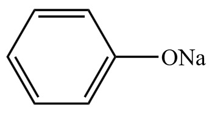

# 【化学】选必三：烃的衍生物

## 卤代烃

### 物理性质

#### 溶解性

不溶于水，易溶于有机溶剂。

#### 状态

**常温**下，卤代烃大多是液体或固体。

> 例外：一氯甲烷 $\ce{CH3Cl}$ 和氯乙烷 $\ce{CH3CH2Cl}$ 为气体。

> 拓展：用溴的四氯化碳和溴水都可以除去乙烯。乙烯可以和溴的四氯化碳发生加成反应生成二溴乙烷，和四氯化碳溶解；乙烯和溴水发生加成反应生成二溴乙烷，**二溴乙烷的密度大于水，会沉在水的下面**，溴水褪色。

#### 密度和沸点

由于卤代烃中含有卤素，相对分子质量更大，所以卤代烃的密度和沸点都高于相应的烃。

随着碳数的增加，卤素 $\ce X$ 数目相同的卤代烃的密度一般逐渐减小。原因：随着碳数的增加，含 $\ce X$ 量逐渐减小，所以卤素的作用逐渐减小，密度就逐渐减小。

随着碳数的增加，卤素 $\ce X$ 数目相同的卤代烃的沸点一般逐渐增大。

> 注意：由上表可以看出，在**常温（$\pu{25^\circ C}$）**下，$\ce{CH3Cl}$ 和 $\ce{CH3CH2Cl}$ 是气态，其它卤代烃是液态。而在**标况（$\pu{0^\circ C}$）**下， 只有 $\ce{CH3Cl}$ 是气态，$\ce{CH3CH2Cl}$ 和其它卤代烃是液态或固态。

> 应用：早期的冰箱一般利用一种沸点较高的卤代烃氟氯烃 $\ce{CCl3F}$ 制成氟利昂制冷，后来发现氟氯烃中自由基太多，可能会逸散到大气中破坏臭氧层，所以不再使用。现在的冰箱一般用环戊烷制冷。

### 化学性质

#### 取代反应（水解反应）

以 $1-$ 溴丙烷的取代反应为例：

【实验用品】

$1-$ 溴丙烷、$5\%\ \ce{NaOH}$ 溶液，$\pu{2 mol*L-1}$ 硝酸、$2\%\ \ce{AgNO3}$ 溶液、试管、试管夹、酒精灯、胶头滴管。

> 实验药品的作用：
>
> - $1-$ 溴丙烷：研究卤代烃取代反应的机理。
> - $5\%\ \ce{NaOH}$ 溶液：使 $1-$ 溴丙烷水解。
> - $\pu{2 mol*L-1}$ 硝酸：让水中的溴离子 $\ce{Br-}$ 被硝酸酸化。
> - $2\%\ \ce{AgNO3}$ 溶液：检验溴离子。

【实验操作】

取一支盛有少量 $1-$ 溴丙烷的试管，假如 $\pu{1 mL}\ 5\%\ \ce{NaOH}$ 溶液，充分振荡，并稍加热一段时间后，冷却、静置，待液体分层后，用滴管小心吸取少量上层液体，移入另一支盛有 $\pu{1 mL}\ \pu{2 mol*L-1}$ 硝酸的试管中，然后假如 $2\sim 3$ 滴 $2\%\ \ce{AgNO3}$ 溶液，观察现象。

【实验现象】

试管中由**淡黄色**沉淀出现。

【实验解释】

$1-$ 溴丙烷的密度一般较大，大于 $\ce{NaOH}$ 溶液，且二者不互溶。所以加入 $\ce{NaOH}$ 溶液后，$1-$ 溴丙烷在试管下层，而 $\ce{NaOH}$ 溶液在上层。$\ce{NaOH}$ 会和 $1-$ 溴丙烷发生反应，使得下层的 $1-$ 溴丙烷中的 $\ce{C-Br}$ 键断裂，$\ce{Br-}$ 进入上层溶液中。在上层液体（水层）中吸取少量液体后，用硝酸酸化 $\ce{Br-}$ 后，若滴入 $\ce{AgNO3}$ 可以产生淡黄色沉淀，证明生成了 $\ce{AgBr}$ 沉淀，即 $\ce{NaOH}$ 成功和 $1-$ 溴丙烷发生加成反应使得 $\ce{C-Br}$ 键断裂。

【反应机理】

$1-$ 溴丙烷和 $\ce{NaOH}$ 发生水解反应，生成**丙醇**和溴化钠，方程式如下：

> 通过这个反应可以看出，碳卤键比碳氢键更容易断裂，即键的极性：$\ce{C-X > C-H > C-C}$。

【其它取代反应】

卤代烃被氢氧化钠水解，断开 $\ce{C-X}$ 键，断开后碳原子与羟基 $\ce{-OH}$ 结合生成醇。

例如：$1,2-$ 二溴乙烷与氢氧化钠反应生成乙二醇和溴化钠，方程式如下：
$$
\ce{Br-CH2-CH2-Br + 2NaOH ->[~~~H2O~~~][\Delta] CH2OHCH2OH +2NaBr}
$$
特例：若卤素直接相连在苯环上，即溴苯  在氢氧化钠溶液加热条件下，几乎不水解。

> 注意：若题目问溴苯与氢氧化钠反应**最多消耗几摩尔氢氧化钠**，则氢氧化钠在**高温高压**的条件下，溴苯会被水解为苯酚 ，由于生成的苯酚具有一定酸性，所以它会和具有碱性的氢氧化钠再次反应，得到的产物实际上是苯酚钠  和溴化钠，所以**最多会消耗 $\pu{2 mol}$ 氢氧化钠**。

【除杂】

- 除去溴苯中混有少量的 $\ce{Br2}$，可以通过 $\ce{NaOH}$ 溶液反萃取除去 $\ce{Br2}$。实验操作：加入 $\ce{NaOH}$ 溶液充分振荡后分液。原因：溴苯中的 $\ce{Br2}$ 会与 $\ce{NaOH}$ 反应生成可溶于水的物质，而 $\ce{NaOH}$ 不会水解溴苯上的溴，所以 $\ce{NaOH}$ 能够除去杂质 $\ce{Br2}$。

- 除去溴乙烷中混有少量的 $\ce{Br2}$，不能通过 $\ce{NaOH}$ 溶液反萃取除去 $\ce{Br2}$。原因：$\ce{NaOH}$ 除了会把杂质 $\ce{Br2}$ 除去之外，溴乙烷也会与 $\ce{NaOH}$ 发生反应，使得溴乙烷水解，$\ce{C-Br}$ 键断裂。拓展：可以通过 $\ce{Na2CO3}$ 之类的物质除杂。

#### 消去反应

**定义**

有机物在一定条件下，从一个分子中脱去一个或几个小分子，而生成含不饱和键的化合物的反应，叫消去反应。

> 注：
>
> - 消去反应类似加成反应的逆反应。
> - 高中阶段学过的消去反应一般都是 $\beta-$ 消去，因为一般情况下是邻碳上的两个分子脱落发生消去反应。具体下面会说到。

**反应条件&结构要求**

反应条件：$\ce{NaOH}$ 醇溶液，加热。

结构要求：$\beta-$ 碳（邻碳）上存在氢。

**反应机理**

$1-$ 溴己烷的消去反应：

我们称与 $\ce{Br}$ 相连的碳为 $\alpha$ 碳，与 $\alpha$ 碳相邻的碳为 $\beta$ 碳，则 $1-$ 溴乙烷和 $\ce{NaOH}$ 反应，$\alpha$ 碳上的 $\ce{Br}$ 和 $\beta$ 碳上的一个 $\ce{H}$ 会脱去形成 $\pi$ 键，得到 $\ce{CH3-CH=CH2}$，而脱去的 $\ce{H}$ 和 $\ce{Br}$ 形成 $\ce{HBr}$ 和 $\ce{NaOH}$ 发生中和反应生成 $\ce{NaBr}$ 和 $\ce{H2O}$。

> 这种邻碳上的分子脱落发生消去反应，就叫做 $\beta -$ 消去。

$2-$ 溴丁烷的消去反应：

上述两种情况都有可能，但一般情况下第一种情况较多，第二种情况较少。即一般谁氢少，就消去谁的氢，属于「扎氏规则」，与「马氏规则」类似。

$1,2-$ 二溴乙烷的消去反应：

即从左到右，$1$ 号碳上的溴和 $3$ 号碳上的氢一同消去，$4$ 号碳上的溴和 $2$ 号碳上的氢一同消去，需要消耗 $\pu{2 mol}\ \ce{NaOH}$，生成乙炔 $\ce{HC#CH}$。

**产物**

卤代烃消去反应，如果只有一个卤素分子，则得到单烯（例如 $1-$ 溴己烷）；若是双卤素分子，可能得到炔（例如 $1,2-$ 二溴乙烷），也可能得到二烯（例如 $2,3-$ 二溴丁烷可能得到 $1,3-$ 丁二烯）。

#### 水解反应和消去反应对比

卤代烃水解反应和消去反应对比如下：

|          |               水解反应               |                    消去反应                     |
| :------: | :----------------------------------: | :---------------------------------------------: |
| 反应条件 |       $\ce{NaOH}$ 水溶液，加热       |            $\ce{NaOH}$ 醇溶液，加热             |
| 结构要求 | 存在 $\ce{R-X}$，其中 $\ce R$ 非苯环 | 邻碳（$\beta-$ 碳）有氢（或有 $\beta - \ce H$） |

### 卤素原子的引入和转化

#### 示例一：氯乙烷

> 氯乙烷是含有一个卤素原子的卤代烃的代表。

氯乙烷作为生成物的反应：

- 甲烷通过**取代反应**，加入氯气，在光照条件下可以生成 $\ce{CH3CH2Cl}$。
- 乙烯通过**加成反应**，加入 $\ce{HCl}$ 和催化剂，可以生成 $\ce{CH3CH2Cl}$。

氯乙烷作为反应物的反应：

- 氯乙烷和 $\ce{NaOH}$ 水溶液，在加热条件下，发生**水解反应**，得到乙醇。
- 氯乙烷和 $\ce{NaOH}$ 醇溶液，在加热条件下，发生**消去反应**，得到乙烯。

如下图所示：

> 注意：如果通过乙烯加成得到氯乙烷，之后氯乙烷一定是和 $\ce{NaOH}$ 水溶液发生水解反应，一般题目中不会再通过消去反应变回乙烯。

#### 示例二：$1,2-$ 氯丙烷

> $1,2-$ 二氯丙烷是邻二卤代烃的代表。

$1,2-$ 二氯丙烷作为生成物：

丙烷通过**取代反应**，加入氯气，可以在光照条件下生成 $\ce{CH3CHClCH3}$，然后再通过**消去反应**，得到 $\ce{CH3-CH=CH2}$，再通过**加成反应**，与溴的四氯化碳反应得到 $\ce{CH3CHBrCH2Br}$。

$1,2-$ 二溴丙烷作为反应物：

- 和 $\ce{NaOH}$ 水溶液，在加热条件下发生**水解反应**，得到丙二醇。
- 和 $\ce{NaOH}$ 醇溶液，在加热条件下发生**消去反应**，得到 $\ce{CH3-C#CH}$。

如下图所示：

#### 总结

卤素原子的引入一般有两种方法：取代反应或加成反应。

卤素原子的转化一般也有两种方法：水解反应（变成醇），消去反应（变成双键或三键）。

### 有机物的高聚物

常见的应用是聚四氟乙烯 ，被称为不粘锅的涂层，是特弗伦材料，性质很稳定。

## 醇

### 物理性质

#### 溶解性

一般情况下，能够和水分子形成氢键的基团，例如羟基 $\ce{-OH}$，我们称为亲水基，而对于烷基等只含碳氢的基团，我们称为疏水基。那么亲水基占比越高，物质溶解性更大，反之更小。

所以羟基数量相同，碳数越多，溶解性越差；碳数相同，羟基越多，溶解性越大。

常温下饱和的一元醇：

- $\ce{C} \le 3$ 能与水以任意比例互溶。
- $4 \le \ce C \le 11$ 是油状液体，仅可部分溶于水。
- $\ce C \ge 12$ 是固体，难溶于水。

#### 熔沸点

饱和一元醇，碳数越多，分子量越大，熔沸点越高。如下图所示。

碳数相同时，羟基越多，分子间作用力更强，熔沸点越高。例如 $\ce{CH2OH-CHOH-CH2OH}$ 的熔沸点高于 $\ce{CH3CH2CH2OH}$。

相对分子质量相近的醇和烷烃、烯烃相比，沸点更高。

### 化学性质

#### 取代反应

**与 $\ce{Na}$ 反应**

羟基 $\ce{-OH}$ 上的氢可以与钠置换，如下：
$$
\ce{2 R-OH + 2 Na -> 2R-ONa + H2 ^}
$$
**与 $\ce{HX}$ 反应**

以和 $\ce{HCl}$ 反应为例：

醇上的羟基被 $\ce{Cl-}$ 取代，$\ce{-OH}$ 和 $\ce{H+}$ 结合生成水，如下：
$$
\ce{R-OH + HCl ->[催化剂] R-Cl + H2O}
$$

> 注意：卤代烃和 $\ce{NaOH}$ 水溶液在加热条件下会发生水解，生成醇；而醇也可以与 $\ce{HX}$ 发生取代反应重新转化为卤代烃。所以二者在一定条件下可以互相转化，一般情况下如果溶液中卤素较多，则转化为卤代烃，若羟基较多则转化为醇。

**酯化反应**

口诀：酸脱羟基醇脱氢。

方程式：
$$
\ce{R-OH + R'COOH <=>[浓~H2SO4][\Delta] R'COOR + H2O}
$$
验证：

使用同位素标记法，将羟基上的氧标记为 $\ce{^{18}O}$，反应后发现 $\ce{^{18}O}$ 在 $\ce{R'COOR}$，即：
$$
\ce{R-^18OH + R'COOH <=>[浓~H2SO4][\Delta] R'CO^18OR + H2O}
$$
说明了酸脱羟基醇脱氢。

> 反应中浓硫酸的作用：①催化剂；②吸水。

**成醚反应**
$$
\ce{R-OH + R'-OH ->[浓~H2SO4][\Delta] R-O-R' + H2O}
$$

#### 消去反应

乙醇的消去反应如下：

我们称与羟基 $\ce{-OH}$ 相连的碳为 $\alpha$ 碳，与 $\alpha$ 碳相邻的碳为 $\beta$ 碳，则 $\alpha$ 碳上的 $\ce{-OH}$ 和 $\beta$ 碳上的 $\ce{H}$ 会脱去，生成 $\pi$ 键，得到乙烯 $\ce{CH2=CH2}$，脱去的 $\ce{-OH}$ 和 $\ce{H}$ 结合得到水 $\ce{H2O}$。

> 注意：
>
> - 控制温度在 $\pu{170^\circ C}$ 时需要使用温度计，使用温度计测量温度时一定要插入到液面以下。
> - 乙醇的消去反应是 $\beta-$ 消去。

检验乙烯：乙醇脱水变乙烯后，乙烯还可能再次在浓硫酸的作用下脱氢，最后被碳化，所以产生的乙烯中可能会混有 $\ce{CO2}$、$\ce{SO2}$ 和 $\ce{H2O}$ 水蒸气。由于 $\ce{SO2}$ 具有还原性，所以能使高锰酸钾和溴水褪色，也能使得溴的四氯化碳褪色，不能使用这三个试剂检验乙烯。所以需要先用 $\ce{NaOH}$ 洗气，除去 $\ce{SO2}$，再检验乙烯。

口诀：浓硫酸一百七，乙醇脱水变乙烯。检验乙烯用碱洗，液面以下温度计。

> 拓展：若温度是 $\pu{140^\circ C}$，则会由副产物，即两个乙醇分子间脱水生成乙醚 $\ce{CH3CH2OCH2CH3}$。

#### 氧化反应

**燃烧**

醇在点燃的条件下会和氧气发生反应生成二氧化碳和水，不做赘述。

**酸性 $\ce{KMnO4}$/酸性 $\ce{K2Cr2O7}$ 氧化**

以高锰酸钾为例：

酸性高锰酸钾氧化 $\ce{R-CH2OH}$ 可使得酸性高锰酸钾溶液褪色。反应的中间产物是醛 $\ce{R-CHO}$，最终产物为羧酸 $\ce{R-COOH}$。如下：
$$
\ce{R-CH2OH ->[KMnO4(H+)] (R-CHO) ->[KMnO4(H+)] R-COOH}
$$
从醇到醛少了两个氢，从醛到酸加了一个氧，即**去氢加氧**。

**催化氧化**

总反应：

分步反应：
$$
\begin{aligned}
& \ce{2 Cu + O2 \xlongequal{\Delta} 2CuO} & (1)\\
& \ce{R-CH2OH + CuO ->[\Delta] R-CHO + Cu + H2O} & (2)
\end{aligned}
$$
即 $\alpha$ 碳上脱去一个 $\ce{H}$，羟基上脱去一个 $\ce{H}$，生成醛，从中可以看出 $\ce{Cu}$ 是催化剂。

> 注：
>
> - 这种氧化叫做 $\alpha -$ 氧化，只有与羟基直接相连的碳（$\alpha$ 碳）上有氢，才能发生 $\alpha-$ 氧化。
> - 若将铜丝在酒精灯**外焰**灼烧，铜丝变黑。原因：与氧气发生反应生成氧化铜。然后将烧黑的铜丝移进酒精灯内焰，发现铜丝再次变红。原因：酒精灯的内焰是乙醇，挥发出的乙醇与氧化铜发生催化氧化生成乙醛，还原回铜。

在上述的基础上，当 $\alpha$ 碳上少去一个氢（只有一个氢）时，反应为：

此时得到羰基，生成酮。

当 $\alpha$ 碳上再少去一个氢，即没有氢时，此时不再发生催化氧化反应。

> 总结：醇的催化氧化得到的产物可能是醛或酮。

乙醇的催化氧化：
$$
\ce{CH3CH2OH ->[Cu~丝][O2,\Delta] CH3CHO}
$$
乙醇在铜丝的作用下，和氧气加热，即烧红的铜丝插入到乙醇里，有刺激性气味生成（乙醛）。

> 注意：**消去反应**的条件是与 $\ce{-OH}$ 直接相连的碳的**邻碳**（即 $\beta$ 碳）上必须有氢，而**催化氧化的条件**是与 $\ce{-OH}$ **直接相连的碳**（$\alpha$ 碳）上必须有氢。

## 酚

### 自然界中的酚

芳香烃上直接接羟基的结构被称为酚。

有些植物中含有丁香酚、麝香草酚、芝麻酚等。如下图所示。

### 苯酚的物理性质

1. **无色**、有特殊气味的**晶体**，长期暴露在空气中会变成粉红色。原因：苯酚在空气中可能会被氧化为对苯醌 。
2. **微溶**于冷水（一般在冷水中是白色浑浊），**易溶**于热水（$\pu{65^\circ C}$ 以上互溶），**易溶**于有机溶剂。
3. 有一定的杀菌能力，可作杀菌消毒剂。
4. 有毒，对皮肤有强烈的腐蚀性。若苯酚进入眼睛，则立刻用乙醇清洗，然后再用清水冲洗。

### 化学性质

#### 弱酸性

与醇类不同，酚类具有弱酸性。

苯酚中，酚羟基中氧的电子云会与苯环肩并肩，有可能电离出很少的 $\ce{H+}$，从而呈弱酸性，如下：

> 注意：虽然苯酚可以电离出 $\ce{H+}$，但这个过程很弱，平衡常数只有 $10^{-10}$ 这个级别。

由于苯酚的弱酸性，它俗称**石炭酸**。苯酚的弱酸性，体现了苯环对羟基的影响。

---

根据下图可知，苯酚的弱酸性介于 $\ce{H2CO3}$ 和 $\ce{HCO3-}$ 之间，即弱酸性 $\ce{H2CO3 > 苯酚 > HCO3-}$。

根据「强酸制弱酸」，苯酚可以与碳酸根反应得到碳酸氢根，但不能和碳酸氢根反应。

---

和醇类似，苯酚也可以与钠发生反应，生成苯酚钠和氢气。同理，苯酚也可以与 $\ce{NaOH}$ 和 $\ce{Na2CO3}$ 反应。反应方程式如下：

由于苯酚的弱酸性介于碳酸和碳酸氢根之间，所以苯酚不能和碳酸氢钠反应。

---

小结：

|    反应物     |   醇   |   酚   | 羧酸 |
| :-----------: | :----: | :----: | :--: |
|   $\ce{Na}$   |  反应  |  反应  | 反应 |
|  $\ce{NaOH}$  | 不反应 |  反应  | 反应 |
| $\ce{Na2CO3}$ | 不反应 |  反应  | 反应 |
| $\ce{NaHCO3}$ | 不反应 | 不反应 | 反应 |

> 注：高中阶段能与**碳酸氢钠**反应的官能团只有羧酸。例如，水杨酸  中既含有羟基又含有羧基，只有羧基能与碳酸氢钠反应，生成 。

#### 取代反应

在苯酚上，酚羟基可以活化苯环邻对位，从而使得邻对位上被溴取代，即：

将**浓溴水**加入到含苯酚的试管中，观察到有白色沉淀生成。这里的白色沉淀是三溴苯酚。如下图所示。

这个反应体现了羟基对苯环的影响，羟基活化了苯环的邻对位。

用途：由于该实验非常灵敏，所以可用于**定量定性检验苯酚**。

> 羟基活化苯环的邻对位体现了羟基对苯环的影响，苯酚具有弱酸性体现了苯环对羟基的影响，所以官能团之间会相互影响。

> 拓展——辨析液溴、溴水和溴的四氯化碳的区别与用途：
>
> - 液溴：深红棕色液体，高中阶段只有与苯环发生**取代**反应生成溴苯中使用了液溴。除此之外高中的有机实验中不使用液溴。
> - 溴的四氯化碳：高中阶段与碳碳双键或三键发生**加成**反应，除此之外没有其他作用。
> - 溴水：高中阶段**取代和加成反应**都会用到，也有一点**氧化性**。取代反应一般是取代苯环邻对位，加成反应一般是与碳碳双键或三键加成。

#### 加成反应

苯酚会和氢气发生加成反应：

体现了苯环可以和氢气加成的特点。

#### 成酯反应

类似于酯化反应，苯酚和乙酰氯反应时，酚脱去羟基中的一个 $\ce H$，乙酰氯脱去 $\ce{-Cl}$，生成乙酰苯酚酯和氯化氢。如下：

两分子乙酸脱水缩合结合生成乙酸酐，乙酸酐与苯酚发生成酯反应，得到乙酰苯酚酯和乙酸。如下：

生成的乙酸回收完后在一定条件下又会重新脱水缩合形成乙酸酐，从而可以循环反应。

> 成酯反应的本质仍是取代，与酯化反应不同的是，酯化反应的对象是酸和醇，酸脱羟基醇脱氢，而成酯反应的对象是酰卤或酸酐和酚反应，酚脱羟基。

#### 氧化反应

1. 苯酚能在氧气中燃烧，生成二氧化碳和水。
2. 苯酚能在空气中氧化，生成粉红色物质苯醌。
3. 苯酚能被酸性 $\ce{KMnO4}$ 氧化。

保护酚羟基：

在含有酚羟基的有机物中，可以先通过某些物质使得酚羟基变为醚或醛，从而保护酚羟基不被酸性高锰酸钾直接氧化，例如下面是制备水杨酸的过程。

#### 显色反应

不同的酚遇到三价铁会显示不同的颜色，苯酚遇到 $\ce{Fe^3+}$ 会显紫色。

用途：检验是否存在酚羟基。
