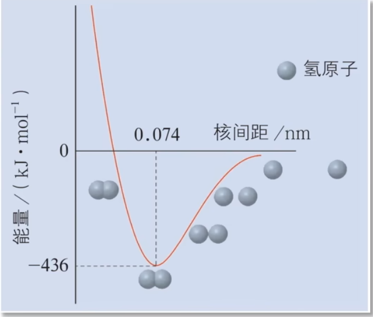
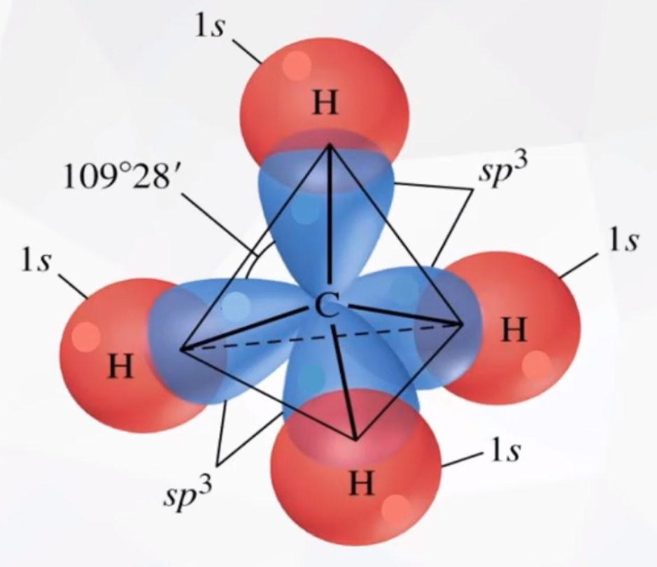
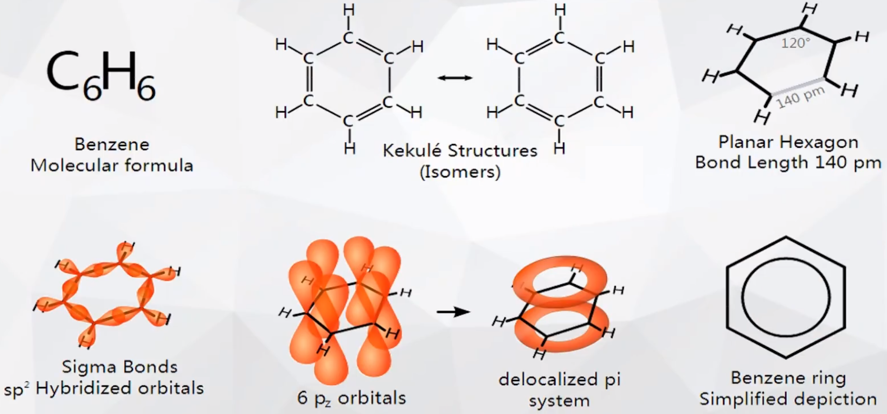
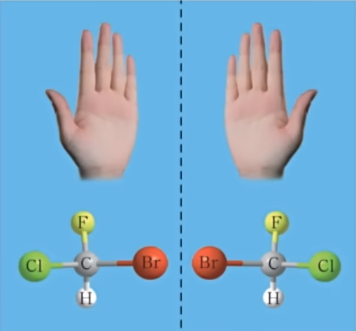
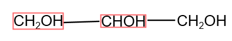

# 【化学】选必二：分子结构

## 共价键

### 概念

原子间通过**共用电子对**所形成的相互作用，叫做**共价键**。

### 成键的粒子

通常是**电负性相同或差值小**的非金属原子或金属原子与非金属原子。

### 本质

原子间通过**原子轨道重叠**，高概率地出现在两个原子核之间地电子与两个原子核之间的电性作用。

> 用原子轨道的概念进一步理解共价键的形成：
>
> 两个氢原子电子自旋方向相反，当它们互相靠近到一定距离时，两个 $\ce{1s}$ 原子轨道发生重叠，核间形成一个电子概率密度较大的区域。电子带负电，因而可以形象地说，核间电子好比在核间架起一座带负电的桥梁，把带正电的两个原子核「黏结」在一起了。

### 形成

根据原子结构的量子力学理论，基态氢原子核外的一个电子处于 $\ce{1s}$ 轨道上。

若两个氢原子**自旋方向相反**，则当两个氢原子**相距很远**时，它们之间的相互作用可以忽略不计，体系的能量**等于两个氢原子的能量之和**；随着两个氢原子**逐渐接近**，它们的原子轨道会相互重叠，使电子在核间区域出现的概率增大，原子核**对两个电子都产生吸引作用**，使体系的**能量逐渐下降**。实验和理论计算均表明，当两个氢原子的核间距为 $\pu{0.074 nm}$ 时体系能量最低，两个氢原子各提供一个电子以**自旋状态不同**的方式相互配对形成氢分子。如果两个氢原子进一步接近，原子核以及电子之间的排斥作用又将导致体系的能量上升，氢分子形成过程中体系的能量变化如图所示。

若两个氢原子核外电子的**自旋方向相同**，则当它们互相接近时，原子间总是**排斥作用占主导地位**。所以带有两个自旋方向相同的电子的氢原子不可能形成氢分子，如图所示。

> 注：图中的 $\pu{74 pm}$ 即为 $\pu{0.074 nm}$。

> 注意：氯化铝属于共价化合物，内部为共价键；铵盐属于离子化合物，铵根和阴离子之间是离子键。

### 特征

#### 饱和性

按照共价键共用电子对理论，一个原子有几个**未成对电子**，便可和几个**自旋状态相反**的电子配对成键，这就是共价键的「饱和性」。

#### 方向性

除 $\ce{s}$ 轨道是球形对称外，其它原子轨道在空间都具有一定的分布特点。在形成共价键时，原子轨道重叠的越多，原子在核间出现的概率越大，所形成的共价键就越牢固，因此共价键将尽可能沿着电子出现概率最大的方向形成，所以共价键具有方向性。

> 注意：并非所有的共价键都有方向性，例如只由 $\ce{s}$ 轨道重叠形成的共价键没有方向性。

### 类型

可以将共价键按照成键原子的原子轨道的重叠方式分类，可以分为 $\sigma$ 键和 $\pi$ 键。

#### $\sigma$ 键

【形成】由两个原子的 $\ce{s}$ 轨道或 $\ce{p}$ 轨道「头碰头」重叠形成。

【类型】

1. $\ce{s-s}$ 型：如下图，为 $\ce{H-H}$ 的 $\ce{s-s}~\sigma$ 键的形成。

   

2. $\ce{s-p}$ 型：如下图，为 $\ce{H-Cl}$ 的 $\ce{s-p}~\sigma$ 键的形成。

   

3. $\ce{p-p}$ 型：如下图，为 $\ce{Cl-Cl}$ 的 $\ce{p-p}~\sigma$ 键的形成。

   

【特征】

1. 轴对称：以形成化学键的两原子核的连线为轴做旋转操作，共价键电子云的图形不变，即始终为**轴对称**图形。
2. 强度：$\sigma$ 键的强度较大。

#### $\pi$ 键

【形成】由两个原子的 $\ce{p}$ 轨道「肩并肩」重叠形成。

【类型】只有 $\ce{p-p}~\pi$ 键，如下图：

【特征】

1. 镜面对称：$\pi$ 键的电子云具有**镜面对称性**，即每个 $\pi$ 键的电子云由两块组成，分别位于由两原子核构成平面的两侧 ，如果以它们之间包含原子核的平面为镜面，则它们互为镜像。
2. 强度：$\pi$ 键**不能旋转**，不如 $\sigma$ 键牢固，**较易断裂**。

> 一般情况下，若形成共价键，会优先考虑形成 $\sigma$ 键，因为其不易断裂，较为牢固，强度较大。

#### $\sigma$ 键与 $\pi$ 键对比

|    类型    |    $\sigma$ 键     |      $\pi$ 键      |
| :--------: | :----------------: | :----------------: |
|  重叠方式  | 沿轴方向「头碰头」 | 平行方向「肩并肩」 |
| 电子云形状 |       轴对称       |      镜像对称      |
|    强度    |   强度大、不易断   |   强度较小、易断   |

【成键判断规律】

- 共价单键是 $\sigma$ 键。
- 共价双键中一个是 $\sigma$ 键，另一个是 $\pi$ 键。
- 共价三键中一个是 $\sigma$ 键，另外两个是 $\pi$ 键。

例如： 中含有 $6$ 个共价单键，$2$ 个共价双键，所以 $\sigma:\pi = 8:2 = 4:1$。

> 所以形成共价键，第一个键一定是 $\sigma$ 键（优先形成 $\sigma$ 键），第二个键由于不能旋转，所以只能「肩并肩」形成 $\pi$ 键。

> 注意：若题目求的是某个共价键的**数目**则应该是该共价键的**个数** $+$ $\ce{N_A}$。「数目」和「个数」的定义不同，例如 $\pu{1 mol}$ 乙醛分子中含 $\sigma$ 键的**数目**为 $\pu{6 N_A}$，而含 $\sigma$ 键的**个数**为 $6$。

### 示例

$\ce{N2}$ 中共价三键 $\ce{N#N}$的形成过程：

- 第一个键沿着 $x$ 轴，两个 $\ce{2p_x}$ 互相重叠，「头碰头」形成 $\sigma$ 键。
- 接着，$2$ 个 $\ce{2p_z}$ 「肩并肩」形成第一个 $\pi$ 键。
- 然后 $2$ 个 $\ce{2p_y}$ 「肩并肩」形成第二个 $\pi$ 键。

如图所示。

结构如下：

## 键参数

### 键能

#### 定义

共价键的强弱可以用键能来衡量。键能是指**气态分子中 $\pu{1 mol}$ 化学键解离成气态原子所吸收的能量**。它通常是 $\pu{298.15 K}$、$\ce{100 kPa}$ 条件下的标准值，单位为 $\pu{kJ*mol-1}$。

例如：$\ce{1mol}$ 气态 $\ce{H-Cl}$ 解离成气态原子 $\ce{H(g)}$ 和 $\ce{Cl(g)}$ 的的整个过程，所吸收的能量，就定义为 $\ce{H-Cl}$ 的键能。它可以认为是断裂 $\ce{1mol}$ 化学键所吸收的能量大小，也可以认为是形成 $\pu{1mol}$ 化学键所释放的能量大小。

#### 应用

1. 判断共价键的稳定性：原子间形成共价键时，原子轨道重叠程度越大，释放能量越多，所形成的共价键键能越大，共价键越稳定。
2. 判断分子的稳定性：一般来说，**结构相似**的分子，共价键的键能越大，分子越稳定。例如分子的稳定性：$\ce{HF > HCl > HBr > HI}$。
3. 利用键能计算反应热：$\ce{\Delta H =}$反应物的总键能 $-$ 生成物的总键能（反键 $-$ 生键）。

#### 常见共价键的键能

这里以人教版新教材数据为例，单位 $\pu{kJ*mol-1}$：

氟氯溴碘四种原子形成的非极性共价键，键能大小为：
$$
\ce{Cl-Cl > Br-Br > F-F > I-I}
$$
注意：其中 $\ce{F-F}$ 键虽然键长最短，但是键能**反而不是最大的**，有可能是因为两个氟原子之间的间距过小，反而因为原子间的排斥力过大 ，使得键能反而不大。

### 键长

#### 定义

构成化学键的两个原子的核间距，因此原子半径决定共价键的键长，原子半径越小，共价键的键长越短。

#### 应用

共价键键长越短，往往键能越大，表明共价键越稳定，反之亦然。

#### 常见共价键的键长

注意：$\ce{F2、Cl2、Br2、I2}$ 它们的键能不符合键长越短，键能越大。

#### 共价半径&范德华半径

共价半径：含有共价键的单质，其共价半径就是两个原子核之间的核间距的**一半**。

范德华半径：对于**稀有气体**这种不会形成单质的**单原子分子**，两个单原子分子原子之间的距离就是范德华半径，同时稀有气体分子中不会形成共价键，所以不存在 $\sigma$ 键。

### 键角

#### 定义

在多原子分子中，两个相邻共价键之间的夹角。

#### 应用

在多原子分子中键角是一定的，这表明共价键具有方向性，因此键角影响着共价分子的空间结构。

#### 常见共价键的键角

## 价层电子对互斥模型（VSEPR）

### 内容

价层电子对互斥模型可以用来预测分子的立体模型。

理论认为，电子的空间构型是中心原子周围的「价层电子对」相互排斥的结果。「价层电子对」是指分子中的中心原子与结合原子间的 **$\sigma$ 键电子对**和**中心原子上的孤电子对**，由于相互排斥作用，尽可能趋向彼此远离，排斥力最小。

孤电子对的排斥力较大，孤电子对越多，排斥力越强，键角越小。

> 注意：「价层电子对」包括**成键的 $\sigma$ 电子对**和**孤电子对**，不包括**成键的 $\pi$ 电子对**。即对于含有多重键的分子只需要考虑 $\sigma$ 键电子对， $\pi$ 键不会影响分子的空间构型，不用再 VSEPR 中进行考虑。

### 分子中心原子上价层电子对数的判断

$\sigma$ 键电子对数：等于中心原子结合的原子数，直接可以通过分子式判断。

中心原子上的孤电子对数：计算公式为 $\dfrac 1 2(a - x b)$。

其中 $a$ 是中心原子的价电子数（阳离子要减去电荷数、阴离子要加上电荷数），$x$ 是与中心原子结合的原子数，$b$ 是与中心原子结合的原子最多能接受的电子数，$\ce{H}$ 为 $1$，其它原子等于 $8 -$ 该原子的价电子数。

### 常见分子/离子的中心原子上孤电子对数

|   分子/离子   | 中心原子 | $a$  | $x$  | $b$  |       中心原子上的孤电子对数       |
| :-----------: | :------: | :--: | :--: | :--: | :--------------------------------: |
|  $\ce{SO2}$   | $\ce{S}$ | $6$  | $2$  | $2$  | $\dfrac{1}{2} (6 - 2 \times 2) =1$ |
|  $\ce{NH4+}$  | $\ce{N}$ | $4$  | $4$  | $1$  | $\dfrac 1 2 (4 - 4 \times 1) = 0$  |
| $\ce{CO3^2-}$ | $\ce{C}$ | $6$  | $3$  | $2$  |  $\dfrac 1 2(6 - 3\times 2) = 0$   |

### 分子立体构型

价电子对数为 $2$，则分子立体构型为直线型，键角为 $180^\circ$。

价电子对数为 $3$，则分子立体构型为平面三角形，键角为 $120^\circ$。

价电子对数为 $4$，则分子立体构型为四面体，键角为 $109^\circ 28'$。

分子立体构型与 VSEPR 模型的区别：VSEPR 考虑加上**孤电子对数**后的模型，而分子立体构型不考虑孤电子对数。

#### $\ce{CO2}$

价层电子数：$2$。$\sigma$ 键电子对数：$2$。孤电子对数：$0$。

结构式：

VSEPR 模型：直线形，如下图。

分子立体构型：直线形。

#### $\ce{BF3}$

价层电子数：$3$。$\sigma$ 键电子对数：$3$。孤电子对数：$0$。

结构式：

VSEPR 模型：平面三角形，如下图。

分子立体构型：平面三角形。

#### $\ce{SO2}$

价层电子数：$4$。$\sigma$ 键电子对数：$2$。孤电子对数：$1$。

结构式：

VSEPR 模型：平面三角形，如下图。

分子立体构型：V 形。

#### $\ce{CH4}$

价层电子数：$4$。$\sigma$ 键电子对数：$4$。孤电子对数：$0$。

结构式：

VSEPR 模型：（正）四面体形，如图所示。

分子立体构型：正四面体形。

#### $\ce{NH3}$

价层电子数：$4$。$\sigma$ 键电子对数：$3$。孤电子对数：$1$。

结构式：

VSEPR 模型：四面体形，如图所示。

分子立体构型：三角锥，如图所示。

#### $\ce{H2O}$

价层电子对数：$4$。$\sigma$ 键电子对数：$2$。孤电子对数：$2$。

结构式：

VSEPR 模型：四面体形，如图所示。

分子立体构型：V 形，如图所示。

## 杂化轨道理论

### 理论简介

甲烷分子中，$\ce{C}$ 的价电子是 $\ce{2s^2 2p^2}$，为使得 $\ce{C}$ 原子四个价电子分别与 $\ce{H}$ 形成 $\sigma$ 键，所以 $\ce{2s}$ 有一个电子会吸收能量从 $\ce{2s}$ 发生电子跃迁到 $\ce{2p}$ 轨道，从而使得碳原子的四个价电子都是未成键电子，排布式为 $\ce{2s^1 2p^3}$。$4$ 个价层原子轨道是 $3$ 个相互垂直的 $\ce{2p}$ 和 $1$ 个球形的 $\ce{2s}$。

根据价键理论，甲烷的 $4$ 个 $\ce{C-H}$ 单键都应该是 $\sigma$ 键，然而，碳原子的 $4$ 个价层原子轨道是 **$3$ 个相互垂直的 $\ce{2p}$ 轨道**和 **$1$ 个球形的 $\ce{2s}$ 轨道**，用它们和 $4$ 个氢原子的 $\ce{1s}$ 原子轨道重叠，**不可能得到正四面体构型的甲烷分子**。

为了解决这一矛盾，鲍林提出了杂化轨道理论。

### 内容

首先基态碳原子的价电子 $\ce{2s^2 2p^2}$ 的 $\ce{2s}$ 轨道中有一个电子跃迁到 $\ce{2p}$ 轨道。形成 $\sigma$ 键之前，$1$ 个 $\ce{s}$ 轨道和 $3$ 个 $\ce{p}$ 轨道**混杂并重新组合**成  $4$ 个能量与形状完全相同的原子轨道，称为杂化，$4$ 个杂化后的原子轨道称为 **$\ce{sp^3}$ 杂化轨道**，如图所示。

$4$ 个 $\ce{sp^3}$ 杂化轨道的能量相同、方向不同，各指向四面体的四个顶角，相互的键角为 $\theta = 109^\circ 28'$，如图所示。

甲烷分子中，碳原子以 $4$ 个 $\ce{sp^3}$ 杂化轨道分别与 $4$ 个氢原子的 $\ce{1s}$ 轨道重叠，形成 $4$ 个 $\ce{C-H}$ $\sigma$ 键，因此呈**四面体形**的空间结构。

### 理解

#### $\ce{sp^2}$ 杂化

以 $\ce{BF3}$ 的杂化过程为例：

#### $\ce{sp}$ 杂化

以 $\ce{BeF2}$ 为例：

#### 中心原子有孤电子对的杂化

$\ce{NH3}$ 的杂化：

基态氮原子的价电子排布式为 $\ce{2s^2 2p^3}$，虽然恰好有 $3$ 个未成对电子，但如果此时这三个电子直接与 $3$ 个氢原子形成 $\sigma$ 键，那么由于 $\ce{2p}$ 的三个轨道互相垂直，所以形成的分子键角应该为 $\ce{90^\circ}$，不符合四面体形。为使价电子轨道均满足能量、形状相同，所以 $1$ 个 $\ce{2s}$ 轨道和 $3$ 个 $\ce{2p}$ 轨道一起混杂并重新组合，形成 $4$ 个 $\ce{sp^3}$ 杂化轨道，如图所示。

$\ce{H2O}$ 的杂化：

## 中心原子杂化类型与分子构型的相互判断

| 分子组成（$\ce{A}$ 为中心原子） | 中心原子的孤电子对数 | 中心原子的杂化方式 | 分子空间构型 |     实例     |
| :-----------------------------: | :------------------: | :----------------: | :----------: | :----------: |
|           $\ce{AB2}$            |         $0$          |   $\ce{sp}$ 杂化   |    直线形    | $\ce{BeCl2}$ |
|           $\ce{AB2}$            |         $1$          |  $\ce{sp^2}$ 杂化  |     V 形     |  $\ce{SO2}$  |
|           $\ce{AB2}$            |         $2$          |  $\ce{sp^3}$ 杂化  |     V 形     |  $\ce{H2O}$  |
|           $\ce{AB3}$            |         $0$          |  $\ce{sp^2}$ 杂化  |  平面三角形  |  $\ce{BF3}$  |
|           $\ce{AB3}$            |         $1$          |  $\ce{sp^3}$ 杂化  |   三角锥形   |  $\ce{NH3}$  |
|           $\ce{AB4}$            |         $0$          |  $\ce{sp^3}$ 杂化  |   四面体形   |  $\ce{CH4}$  |

即：杂化轨道数 $n =$ 与中心原子结合的原子个数 $+$ 中心原子孤电子对数，杂化方式为 $\ce{sp^{n-1}}$。

## 杂化轨道中的 $\pi$ 键与大 $\pi$ 键

### $\pi$ 键

杂化轨道只用于形成 $\sigma$ 键或用来容纳未参与成键的孤电子对，$\ce{sp、sp^2}$ 杂化形式中还有未参与杂化的 $\ce{p}$ 轨道，可用于「肩并肩」形成 $\pi$ 键。

#### $\ce{sp^2}$ 杂化后形成 $\pi$ 键

以乙烯 $\ce{C2H4}$ 的杂化为例：

碳原子用于杂化的原子价层电子排布式为 $\ce{2s^1 2p^3}$，此时 $1$ 个 $\ce{2s}$ 轨道和 $2$ 个 $\ce{2p}$ 轨道会混杂并重新组合成 $3$ 个 $\ce{sp^2}$ 杂化轨道，三个杂化轨道分别与另外一个 $\ce{C}$ 和两个 $\ce{H}$ 形成 $\sigma$ 键，会沿着 $x-y$ 平面形成平面三角形。此时 $\ce{2p}$ 轨道剩下一个**未参与杂化**且与 $x-y$ 平面垂直的 $\ce{p_z}$ 轨道，另一个 $\ce{C}$ 同样也剩下一个未参与杂化且与 $x-y$ 平面垂直的 $\ce{p_z}$ 轨道，二者都有一个电子，会「肩并肩」形成 $\pi$ 键，如图所示。

#### $\ce{sp}$ 杂化后形成 $\pi$ 键

以乙炔 $\ce{C2H2}$ 的杂化为例：

碳原子用于杂化的原子价层电子排布式为 $\ce{2s^1 2p^3}$，此时 $1$ 个 $\ce{2s}$ 轨道和 $1$ 个 $\ce{2p}$ 轨道会混杂并重新组合成 $2$ 个 $\ce{sp}$ 杂化轨道，两个杂化轨道分别与另外一个 $\ce{C}$ 和一个 $\ce{H}$ 形成 $\sigma$ 键，会沿着 $x$ 轴形成直线形空间构型。此时 $\ce{2p}$ 轨道剩下两个**未参与杂化**且与 $x$ 轴垂直的 $\ce{p_y}$ 和 $\ce{p_z}$ 轨道，另一个 $\ce{C}$ 同样也剩下一个未参与杂化且与 $x$ 轴垂直的 $\ce{p_y}$ 和 $\ce{p_z}$ 轨道，二者互相平行，会「肩并肩」形成 $\pi$ 键，如图所示。

### 大 $\pi$ 键

以苯 $\ce{C6H6}$ 为例：

碳原子用于杂化的原子价层电子排布式为 $\ce{2s^1 2p^3}$，此时 $1$ 个 $\ce{2s}$ 轨道和 $2$ 个 $\ce{2p}$ 轨道会混杂并重新组合成 $3$ 个 $\ce{sp^2}$ 杂化轨道，三个杂化轨道分别与相邻的两个 $\ce{C}$ 和一个 $\ce{H}$ 会沿着 $x-y$ 平面形成 $\sigma$ 键。此时 $\ce{2p}$ 轨道剩下一个**未参与杂化**且与 $x-y$ 平面垂直的 $\ce{p_z}$ 轨道，另外两个与之相邻的 $\ce{C}$ 同样也剩下一个未参与杂化且与 $x-y$ 平面垂直的 $\ce{p_z}$ 轨道，它们都剩下一个电子。由于它们剩下的 $\ce{p}$ 轨道互相平行，且彼此之间间距较小，所以它们之间可以互相「肩并肩」形成 $6$ 个 $\pi$ 键，$6$ 个 $\ce{p}$ 轨道融合在一起，就叫做大 $\pi$ 键（离域 $\pi$ 键），用 $\prod_6^6$ 表示，即 $6$ 个碳原子提供了 $6$ 个 $\ce{p}$ 轨道，且这 $6$ 个 $\ce{p}$ 轨道互相平行并且可以「肩并肩」形成 $\pi$ 键，$6$ 个 $\pi$ 键可以共用，构成大 $\pi$ 键，如下图所示。

> 苯较为稳定，不能使高锰酸钾褪色，但是乙烯可以使得高锰酸钾褪色；苯不能使溴水因加成反应而褪色，而乙烯可以。乙烯的 $\pi$ 键较容易断裂，不稳定，而苯不易断裂，不存在碳碳双键，只存在大 $\pi$ 键。

从上图可以看出：

- 苯的大 $\pi$ 键是介于单键与双键之间的特殊的键，既不同于单键又不同于双键；
- 所有的 $\ce{H}$ 与 $\ce{C}$ 总共十二个原子共平面；
- 苯分子的键角虽然是 $120^\circ$，但其分子立体构型是**平面正六边形**，而非**平面三角形**。所以并非所有键角为 $120^\circ$ 的分子，空间结构都是平面三角形。

### 常见的大 $\pi$ 键分子

- $\ce{SO3,NO3-,CO3^2-}$：三者结构类似，互为等电子体，均为 $\ce{sp^2}$ 杂化，$3$ 个 $\sigma$ 键 $+$ $0$ 个孤电子对。它们都是 $4$ 原子 $6$ 电子形成的大 $\pi$ 键 $\prod_4^6$。
- $\ce{SO2,O3,NO2-}$：三者结构相似，互为等电子体，均为 $\ce{sp^2}$ 杂化，$2$ 个 $\sigma$ 键 $+$ $1$ 个孤电子对。它们都是 $3$ 原子 $4$ 电子形成的大 $\pi$ 键 $\prod_3^4$。

> 注意：
>
> - 大 $\pi$ 键分子要么出现在 $\ce{sp^2}$ 杂化，要么出现在 $\ce{sp}$ 杂化，$\ce{sp^3}$ 杂化**不会出现大 $\pi$ 键**，原因是 $\ce{sp^3}$ 的结构上不满足能使得原子某轨道相互平行「肩并肩」。
> - 计算某个分子的大 $\pi$ 键时，应该先将 $\sigma$ 键和孤电子对都确定完之后再考虑剩下的未参与杂化的电子，在有条件「肩并肩」的情况下才有可能形成大 $\pi$ 键。

## 共价键的极性和分子的极性

### 共价键分类

共价键有极性共价键和非极性共价键。

【极性共价键】

由不同原子形成的共价键，电子对会发生偏移。极性键中的两个键合原子，一个呈正电性 $\delta +$，另一个呈负电性 $\delta -$。

在极性共价键中，成键原子吸引电子的能力差别越大，共用电子对偏移程度越大，共价键的极性越强。

【非极性共价键】由相同原子形成的共价键，电子对不发生偏移的共价键。

### 分子的极性

分子可分为极性分子和非极性分子。

【极性分子】极性分子的正电中心和负电中心不重合，使分子的某一个部分呈正电性 $\delta +$，另一部分呈负电性 $\delta -$。例如 $\ce{HCl}$ 分子中，负电中心在 $\ce{Cl}$ 上，正电中心在 $\ce{H}$ 上，所以正电中心和负电中心不重合，$\ce{HCl}$ 就是极性分子。

【非极性分子】非极性分子的正电中心和负电中心重合。例如 $\ce{Cl2}$ 由于 $\ce{Cl-Cl}$ 键是非极性键，所以整个分子的电子均匀分布；$\ce{CCl4}$ 中虽然 $\ce{C-Cl}$ 键是极性键，但是其分子结构是正四面体形，负电荷在四个 $\ce{Cl}$ 上，那么负电中心在四个 $\ce{Cl}$ 的中心，即 $\ce{C}$ 上，同时正电中心也在 $\ce{C}$ 上，所以正电中心和负电中心重合，$\ce{CCl4}$ 是非极性分子。

### 分子的极性判断

#### 向量和法

可以根据分子中**化学键的极性的向量和**来判断分子的极性。

1. 对于**只含非极性键**的分子：一定是非极性分子。
2. 对于含有极性键的分子：
   - 依据分子中极性键的极性的向量和是否等于 $0$ 而定。当分子中各个键的极性的向量和等于零时，是非极性分子；否则，是极性分子。
   - 也可以根据分子的正电中心和负电中心是否重合（定义）来判断它是否是极性分子。

#### 化合价法

对于 $\ce{AB_m}$ 型分子（即单中心原子的分子），中心原子的化合价的绝对值等于该元素的价电子数时，该分子为非极性分子，此时分子的空间结构对称；若中心原子的化合价的绝对值不等于其价电子数，则分子的空间结构不对称，其分子为极性分子。示例如下：

|         分子         | $\ce{BF3}$ | $\ce{CO2}$ | $\ce{PCl5}$ | $\ce{SO3}$ | $\ce{H2O}$ | $\ce{NH3}$ | $\ce{SO2}$ |
| :------------------: | :--------: | :--------: | :---------: | :--------: | :--------: | :--------: | :--------: |
| 中心原子化合价绝对值 |    $3$     |    $4$     |     $5$     |    $6$     |    $2$     |    $3$     |    $4$     |
|   中心原子价电子数   |    $3$     |    $4$     |     $5$     |    $6$     |    $6$     |    $5$     |    $6$     |
|       分子极性       |   非极性   |   非极性   |   非极性    |   非极性   |    极性    |    极性    |    极性    |

#### 分子所含键的类型及分子立体构型法

说明：

1. 对于三原子，直线形分子，只有中心原子两边接的原子相同，才是非极性分子；如果两边接的原子不同，由于两边键的极性不同，所以也是极性分子。例如 $\ce{HCN}$ 就是极性分子。
2. 对于四原子，只有平面**正**三角形才是非极性分子，不是正三角形是极性分子。五原子同理。

### 总结

注意：

- 臭氧 $\ce{O3}$ **虽然是相同原子构成的分子**，但是其中的 $\ce{O-O}$ 键**却是极性键**，所以它是**极性分子**，分子结构为 V 形。
- 过氧化氢 $\ce{H2O2}$ 既有极性键又有非极性键，由于其中的 $\ce{O-O}$ 键可以旋转，所以**认为 $\ce{H2O2}$ 也是极性分子**。

### 键的极性对化学性质的影响

键的极性对物质的化学性质有重要影响。例如：羧酸是一大类含羧基 $\ce{-COOH}$ 的有机酸，羧基可电离出 $\ce{H+}$ 而呈现酸性。

羧酸的酸性可用 $pKa$ 的大小来衡量，$pKa$ 越小，酸性越强。羧酸的酸性大小与其分子的组成和结构有关。如下表所示：

> 注：表格从上到下，酸性由弱变强。

- 三氟乙酸的酸性大于三氯乙酸的原因：由于氟的电负性大于氯的电负性，$\ce{F-C}$ 的极性大于 $\ce{Cl-C}$ 的极性，使 $\ce{F3C-~}$的极性大于 $\ce{Cl3C-~}$的极性，从而使得三氟乙酸的羧基中的羟基的极性更大，更容易电离出氢离子。
- 三氯乙酸的酸性大于二氯乙酸酸性的原因：由于三氯乙酸比二氯乙酸多一个氯原子，使三氯乙酸的极性大于二氯乙酸的极性，导致三氯乙酸的羧基中的羟基的极性更大，更容易电力出氢离子。
- 甲酸的酸性大于乙酸酸性的原因：烃基 $\ce{R-~}$是推电子基团，烃基越长推电子效应越大，使羧基中的羟基的极性越小，羧酸的酸性 越弱。

## 分子间作用力

### 定义

日常生活中，我们经常见到许多由分子聚集成的物质，它们常以液态或固态的形式存在，如汽油、水、冰、干冰等。降温加压时气体会液化，降温是时液体会凝固，这些事实表明分子之间存在的相互作用力。

所以将分子聚集起来的作用力就叫分子间作用力。

### 特征

1. 共价分子间都存在分子间作用力。
2. 分子间作用力本质上是一种静电作用，比化学键弱得多。
3. 范德华力和氢键是两种最常见的分子间作用力。

### 范德华力

#### 命名

范德华是最早研究分子间普遍存在作用力的科学家，因而把这类分子间的作用力称为范德华力。

> 注意：范德华力普遍存在于分子之间，但也必须满足一定的距离要求，若分子间的距离足够大，分子之间也很难产生相互作用，就不会产生范德华力。例如氯化钠由离子构成，其中没有范德华力，只存在离子键。

#### 特点

1. 范德华力**很弱**，比化学键的键能小 $1 \sim 2$ 数量级。
2. 范德华力一般**没有**方向性和饱和性。

#### 影响因素

1. 分子的大小、空间构型以及分子中电荷分布是否均匀（分子极性）。例如：$\ce{CO}$ 是极性分子，其范德华力大于非极性分子 $\ce{Ar}$。
2. 相对分子质量：组成和结构相似的分子，其范德华力一般**随着相对分子质量的增大而增大**。例如：范德华力 $\ce{HI > HBr > HCl > CO}$，是由于它们之间结构相似，相对分子质量依次减小，所以分子间作用力也依次减小。

#### 意义

范德华力主要影响物质的熔点、沸点、溶解度等物理性质。组成和结构相似的分子，相对分子质量越大，范德华力越大，熔沸点越高。

### 氢键

#### 定义

由已经与电负性很强的原子（例如 $\ce{F,O,N}$）形成共价键的氢原子，与另一个分子中电负性很强的原子之间的作用力。

#### 表示

通常用 $\ce{A-H\bond{...}B}$ 表示，其中 $\ce{A、B}$ 为 $\ce{N,O,F}$ 等中的一种，$\ce{-}$ 表示共价键，$\ce{\bond{...}}$ 表示氢键。

原因：氢原子外层只有一个电子，所以当 $\ce{H}$ 与电负性较强的原子形成共价键时，氢原子的那个电子几乎会完全偏移至电负性较强的原子，所以 $\ce{H}$ 会显很强的正电性，而对应电负性较强的原子就会产生比较强的负电性。以 $\ce{HF}$ 为例，当两个 $\ce{HF}$ 分子彼此靠近时，这两个独立的分子之间就会形成一个比较强烈的分子间作用力 $\ce{H-F\bond{...}H-F}$，即氢键。

> 只有氢才会形成氢键的原因：外层只有一个电子，容易被夺去从而产生很强的正电性。

#### 特征

1. 键能：比化学键的键能小，但比范德华力强，**不属于化学键**。
2. 方向性：$\ce{X-H\bond{...}Y}$ 三个原子一般在同一直线上，在这样的方向上成键的两原子电子云之间的排斥力最小，形成的氢键最强，体系最稳定。例如：$\ce{H2O}$ 形成氢键时，必须沿着 $\ce{O-H}$ 键的方向，如下图所示。
3. 饱和性：每一个 $\ce{X-H}$ 只能与 $1$ 个 $\ce{Y}$ 原子（$\ce{F,O,N}$）原子形成氢键，这是因为 $\ce{H}$ 原子半径很小，若再有 一个 $\ce{Y}$ 原子接近，则 $\ce{Y}$ 会受到 $\ce{X}$ 原子电子云的排斥，使得氢键不稳定，容易断裂。例如：平均 $1$ 分子水，有两个氢键；平均 $1$ 分子 $\ce{HF}$ 只有一个氢键，如下图所示。

> 化学键在高中阶段只有**离子键、共价键和金属键**。

#### 分子内氢键与分子间氢键

邻羟基苯甲醛能形成分子内氢键，而对羟基苯甲醛能形成分子间氢键。当对羟基苯甲醛熔融时，需要消耗较多的能量克服分子间氢键，所以对羟基苯甲醛的熔点高于邻羟基苯甲醛。

如果形成分子内氢键，那么会降低物质的熔点，所以邻羟基苯甲醛的熔点 $<$ 对羟基苯甲醛。

#### 氢键对物质物理性质的影响

1. 熔沸点：含有分子间氢键的物质具有较高的熔点、沸点，含有**分子内氢键**的物质具有较低的溶、沸点。如图，沸点 $\ce{H2O > H2Te > H2Se > H2S}$，水的相对分子质量虽然最小，但由于其中含有氢键，氢键的能量 $\gg$ 范德华力的能量，所以水的沸点最大；后面三种物质，没有氢键，相对分子质量越大，范德华力越大，熔沸点越高。都有氢键的 $\ce{H2O,HF}$ 和 $\ce{NH3}$，沸点 $\ce{H2O > HF > NH3}$，这是由于水是双氢键（平均一分子有 $2$ 个氢键），$\ce{HF}$ 和 $\ce{NH3}$ 是单氢键。由于 $\ce{F}$ 的电负性较大，所以电子偏移的极性效果更强，$\ce{HF}$ 形成氢键的作用效果更好，$\ce{HF}$ 是强单氢键，$\ce{NH3}$ 是弱单氢键。

   

2. 粘度：含有分子间氢键的液体一般黏度比较大。例如：浓 $\ce{H2SO4}$ 存在氢键，所以其黏度较大。

3. 溶解度：分子间氢键的存在会使得溶质在水中的溶解度较大。例如：甲醇到丙醇，甲酸到丁酸，对水都是任意比例互溶，是由于它们会形成氢键，分子间的作用力很强，溶解度很强。

4. 物质密度：氢键的存在会使得某些物质的密度反常，如水的密度比冰的密度大。

5. 相对原子质量的测定：例如接近水的沸点的水蒸气的相对分子质量测定值比按化学式 $\ce{H2O}$ 计算出来的相对分子质量大，原因是水分子因氢键而相互缔合。

> 注意：
>
> - 氢键会影响物质的物理性质，但基本**不会影响化学性质**。例如，物质的稳定性属于化学性质，与氢键无关，而与化学键有关。
> - **只有由分子构成的物质**，物质的物理性质才由范德华力与氢键共同决定。

#### 生物大分子中的氢键

例如，氢键是让蛋白质具有生物活性高级结构的重要因素。蛋白质变性，本质上就是氢键被破坏，造成不可逆现象，使蛋白质失去了一些生物活性，如图所示。

双股螺旋 DNA 中有磷酸根离子、含氮碱基，双股螺旋之所以可以固定，也是因为有氢键。如图所示。

## 物质溶解性的影响因素

1. 温度：对于气体而言，温度越小，气体的溶解性越大；温度越大，气体的溶解性越小。对于固体和液体而言，大部分物质随着温度升高溶解度增大，还有一部分物质（例如 $\ce{NaCl}$）随着温度的升高，溶解度不变，还有少数物质（例如 $\ce{Ca(OH)2}$ ）随着温度的升高，溶解度减小 。
2. 相似相溶：非极性溶质一般能溶于非极性溶剂，极性溶质一般能溶于极性溶剂。即结构相似的两种物质更容易互溶，例如 $\ce{Br2}$ 更易溶于 $\ce{CCl4}$ 而非 $\ce{H2O}$，是因为 $\ce{H2O}$ 是极性分子，而 $\ce{CCl4}$ 和 $\ce{Br2}$ 是非极性分子。
3. 氢键：含有氢键的物质溶解性更强。
4. 压强：物质的溶解性也跟压强有一定的关系。

## 分子的手性 

### 概念

1. 手性异构体：具有**完全相同的组成和原子排列的一对分子**，如同左手与右手一样互为镜像，却在三维空间里不能叠合，互称**手性异构体**（或**对映异构体**）。如图所示。

   

   

2. 手性分子：具有手性异构体的分子，例如乳酸  分子。如图所示。

   

> 注意：互为手性异构体的化合物，性质**不一定**相同。例如：手性分子在生命科学和药物方面有着广泛的应用，对于手性药物，一个异构体可能是有效的，而另一个异构体可能是无效甚至有害的。

> 课本补充：2001 年，诺贝尔化学奖授予三位用手性催化剂生产手性药物的化学家，用他们的合成方法，可以只得到或者主要得到一种手性分子，这种独特的合成方法称为手性合成。手性催化剂只催化或者主要催化一种手性分子的合成，可以比喻成握手--手性催化剂像迎宾的主人伸出右手，被催化合成的手性分子像客人，总是伸出右手去握手。

### 手性碳原子的判断

手性碳原子的定义：

有机物分子中连有**四个各不相同**的原子或基团的碳原子。例如  中，$\ce{R1 、R2、R3、R4}$ 互不相同， 即是手性碳原子。例如甘油  的分子中三个碳原子都不是手性碳原子（第二个碳原子两边都接了 $\ce{CH2OH}$ 是相同的原子团）。

由于碳原子连有**四个各不相同**的原子或基团，所以它**一定是** $\ce{sp^3}$ 杂化。

对于仅通过**单键**连接其它原子的碳原子（即 $\ce{sp^3}$ 杂化的碳原子），当其所连接的四个原子或基团均不相同时，例如 $\ce{CHBrClF}$，这碳原子称为**不对称碳原子**。**大多数**手性分子都含有不对称碳原子，因此常用有无不对称碳原子推测分子是否为手性分子，进而判断分子有无旋光性（手性分子的一种特性）。如下两幅图呈现了两种简单的手性分子及其对应异构体，并标出了其中的不对称碳原子，借助有无不对称碳原子推测分子是否为手性分子，是一个简单使用**但并不全面**的判断标准。

> 课本补充：根据教材定义，含有手性异构体的分子称为手性分子；但「含有手性碳原子的分子**不一定叫做手性分子**」，因为「多个手性碳原子」的分子的异构体不一定都是手性分子。

> 注意：含有手性碳原子的分子不一定是手性分子，手性分子也不一定含有手性碳原子。
