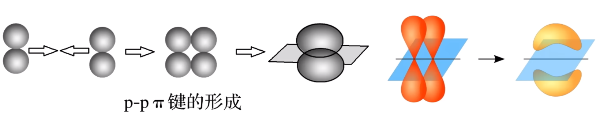

# 【化学】选必二：分子结构

## 共价键

### 概念

原子间通过**共用电子对**所形成的相互作用，叫做**共价键**。

### 成键的粒子

通常是**电负性相同或差值小**的非金属原子或金属原子与非金属原子。

### 本质

原子间通过**原子轨道重叠**，高概率地出现在两个原子核之间地电子与两个原子核之间的电性作用。

> 用原子轨道的概念进一步理解共价键的形成：
>
> 两个氢原子电子自旋方向相反，当它们互相靠近到一定距离时，两个 $\ce{1s}$ 原子轨道发生重叠，核间形成一个电子概率密度较大的区域。电子带负电，因而可以形象地说，核间电子好比在核间架起一座带负电的桥梁，把带正电的两个原子核「黏结」在一起了。

### 形成

根据原子结构的量子力学理论，基态氢原子核外的一个电子处于 $\ce{1s}$ 轨道上。

若两个氢原子**自旋方向相反**，则当两个氢原子**相距很远**时，它们之间的相互作用可以忽略不计，体系的能量**等于两个氢原子的能量之和**；随着两个氢原子**逐渐接近**，它们的原子轨道会相互重叠，使电子在核间区域出现的概率增大，原子核**对两个电子都产生吸引作用**，使体系的**能量逐渐下降**。实验和理论计算均表明，当两个氢原子的核间距为 $\pu{0.074 nm}$ 时体系能量最低，两个氢原子各提供一个电子以**自旋状态不同**的方式相互配对形成氢分子。如果两个氢原子进一步接近，原子核以及电子之间的排斥作用又将导致体系的能量上升，氢分子形成过程中体系的能量变化如图所示。

若两个氢原子核外电子的**自旋方向相同**，则当它们互相接近时，原子间总是**排斥作用占主导地位**。所以带有两个自旋方向相同的电子的氢原子不可能形成氢分子，如图所示。

> 注：图中的 $\pu{74 pm}$ 即为 $\pu{0.074 nm}$。

> 注意：氯化铝属于共价化合物，内部为共价键；铵盐属于离子化合物，铵根和阴离子之间是离子键。

### 特征

#### 饱和性

按照共价键共用电子对理论，一个原子有几个**未成对电子**，便可和几个**自旋状态相反**的电子配对成键，这就是共价键的「饱和性」。

#### 方向性

除 $\ce{s}$ 轨道是球形对称外，其它原子轨道在空间都具有一定的分布特点。在形成共价键时，原子轨道重叠的越多，原子在核间出现的概率越大，所形成的共价键就越牢固，因此共价键将尽可能沿着电子出现概率最大的方向形成，所以共价键具有方向性。

> 注意：并非所有的共价键都有方向性，例如只由 $\ce{s}$ 轨道重叠形成的共价键没有方向性。

### 类型

可以将共价键按照成键原子的原子轨道的重叠方式分类，可以分为 $\sigma$ 键和 $\pi$ 键。

#### $\sigma$ 键

【形成】由两个原子的 $\ce{s}$ 轨道或 $\ce{p}$ 轨道「头碰头」重叠形成。

【类型】

1. $\ce{s-s}$ 型：如下图，为 $\ce{H-H}$ 的 $\ce{s-s}~\sigma$ 键的形成。

   

2. $\ce{s-p}$ 型：如下图，为 $\ce{H-Cl}$ 的 $\ce{s-p}~\sigma$ 键的形成。

   

3. $\ce{p-p}$ 型：如下图，为 $\ce{Cl-Cl}$ 的 $\ce{p-p}~\sigma$ 键的形成。

   

【特征】

1. 轴对称：以形成化学键的两原子核的连线为轴做旋转操作，共价键电子云的图形不变，即始终为**轴对称**图形。
2. 强度：$\sigma$ 键的强度较大。

#### $\pi$ 键

【形成】由两个原子的 $\ce{p}$ 轨道「肩并肩」重叠形成。

【类型】只有 $\ce{p-p}~\pi$ 键，如下图：

【特征】

1. 镜面对称：$\pi$ 键的电子云具有**镜面对称性**，即每个 $\pi$ 键的电子云由两块组成，分别位于由两原子核构成平面的两侧 ，如果以它们之间包含原子核的平面为镜面，则它们互为镜像。
2. 强度：$\pi$ 键**不能旋转**，不如 $\sigma$ 键牢固，**较易断裂**。

> 一般情况下，若形成共价键，会优先考虑形成 $\sigma$ 键，因为其不易断裂，较为牢固，强度较大。

#### $\sigma$ 键与 $\pi$ 键对比

|    类型    |    $\sigma$ 键     |      $\pi$ 键      |
| :--------: | :----------------: | :----------------: |
|  重叠方式  | 沿轴方向「头碰头」 | 平行方向「肩并肩」 |
| 电子云形状 |       轴对称       |      镜像对称      |
|    强度    |   强度大、不易断   |   强度较小、易断   |

【成键判断规律】

- 共价单键是 $\sigma$ 键。
- 共价双键中一个是 $\sigma$ 键，另一个是 $\pi$ 键。
- 共价三键中一个是 $\sigma$ 键，另外两个是 $\pi$ 键。

例如： 中含有 $6$ 个共价单键，$2$ 个共价双键，所以 $\sigma:\pi = 8:2 = 4:1$。

> 所以形成共价键，第一个键一定是 $\sigma$ 键（优先形成 $\sigma$ 键），第二个键由于不能旋转，所以只能「肩并肩」形成 $\pi$ 键。

### 示例

$\ce{N2}$ 中共价三键 $\ce{N#N}$的形成过程：

- 第一个键沿着 $x$ 轴，两个 $\ce{2p_x}$ 互相重叠，「头碰头」形成 $\sigma$ 键。
- 接着，$2$ 个 $\ce{2p_z}$ 「肩并肩」形成第一个 $\pi$ 键。
- 然后 $2$ 个 $\ce{2p_y}$ 「肩并肩」形成第二个 $\pi$ 键。

如图所示。

结构如下：

## 键参数

### 键能

#### 定义

共价键的强弱可以用键能来衡量。键能是指**气态分子中 $\pu{1 mol}$ 化学键解离成气态原子所吸收的能量**。它通常是 $\pu{298.15 K}$、$\ce{100 kPa}$ 条件下的标准值，单位为 $\pu{kJ*mol-1}$。

例如：$\ce{1mol}$ 气态 $\ce{H-Cl}$ 解离成气态原子 $\ce{H(g)}$ 和 $\ce{Cl(g)}$ 的的整个过程，所吸收的能量，就定义为 $\ce{H-Cl}$ 的键能。它可以认为是断裂 $\ce{1mol}$ 化学键所吸收的能量大小，也可以认为是形成 $\pu{1mol}$ 化学键所释放的能量大小。

#### 应用

1. 判断共价键的稳定性：原子间形成共价键时，原子轨道重叠程度越大，释放能量越多，所形成的共价键键能越大，共价键越稳定。
2. 判断分子的稳定性：一般来说，结构相似的分子，共价键的键能越大，分子越稳定。例如分子的稳定性：$\ce{HF > HCl > HBr > HI}$。
3. 利用键能计算反应热：$\ce{\Delta H =}$反应物的总键能 $-$ 生成物的总键能（反键 $-$ 生键）。

#### 常见共价键的键能

这里以人教版新教材数据为例，单位 $\pu{kJ*mol-1}$：

氟氯溴碘四种原子形成的非极性共价键，键能大小为：
$$
\ce{Cl-Cl > Br-Br > F-F > I-I}
$$
注意：其中 $\ce{F-F}$ 键虽然键长最短，但是键能**反而不是最大的**，有可能是因为两个氟原子之间的间距过小，反而因为原子间的排斥力过大 ，使得键能反而不大。

### 键长

#### 定义

构成化学键的两个原子的核间距，因此原子半径决定共价键的键长，原子半径越小，共价键的键长越短。

#### 应用

共价键键长越短，往往键能越大，表明共价键越稳定，反之亦然。

#### 常见共价键的键长

注意：$\ce{F2、Cl2、Br2、I2}$ 它们的键能不符合键长越短，键能越大。

#### 共价半径&范德华半径

共价半径：含有共价键的单质，其共价半径就是两个原子核之间的核间距的**一半**。

范德华半径：对于**稀有气体**这种不会形成单质的**单原子分子**，两个单原子分子原子之间的距离就是范德华半径。

### 键角

#### 定义

在多原子分子中，两个相邻共价键之间的夹角。

#### 应用

在多原子分子中键角是一定的，这表明共价键具有方向性，因此键角影响着共价分子的空间结构。

#### 常见共价键的键角

