# 【化学】选必二：原子结构

## 能层与能级

### 能层（电子层）

多电子原子的核外电子的能量是不同的，离核近的电子能量较低，离核越远，电子的能量越高。根据核外电子的能量不同，可以将核外电子分成不同的能层，并用符号 $\ce{K、L、M、N、O、P、Q}$ 等表示相应离核最近的第一能层，次之的第二能层，以此类推三、四、五、六、七能层。

| 电子层序数 $n$ |    1     |    2     |    3     |    4     |    5     |    6     |    7     |
| :------------: | :------: | :------: | :------: | :------: | :------: | :------: | :------: |
|    符号表示    | $\ce{K}$ | $\ce{L}$ | $\ce{M}$ | $\ce{N}$ | $\ce{O}$ | $\ce{P}$ | $\ce{Q}$ |

电子层序数从小到大时，对应的能量大小也从小到大，距核远近会从近到远。

### 能级

同一个能层中**电子能量相同**的电子亚层又称能级。

实验和量子力学表明，多电子原子中，同一能层的电子，能量可能不同，因此还能再将它们分成若干能级。在每一个能层中，能级符号的顺序是 $\ce{ns、np、nd、nf}\cdots$ （$n$ 表示能层）。

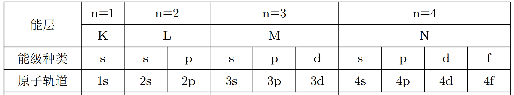

当 $n = 1$ 时，原子轨道数为 $1$。

当 $n = 2$ 时，原子轨道数为 $1 + 3 = 4$。

当 $n = 3$ 时，原子轨道数为 $1 + 3 + 5 = 9$。

当 $n = 4$ 时，原子轨道数为 $1 + 3 + 5 + 7 = 16$。

所以对于第 $n$ 层，其能级个数为 $n$，其原子轨道数（空间运动状态）为 $n^2$，最多可容纳 $2n^2$ 个电子。

## 基态原子、激发态原子和原子光谱

【基态原子】处于最低能量的原子。

【激发态原子】当基态原子的电子吸收能量后，电子会跃迁到较高能级，变成激发态原子。

【原子光谱】不同元素原子发生跃迁，吸收或者发出不同的光，利用原子光谱上的特征谱线来鉴定元素，称为光谱分析。

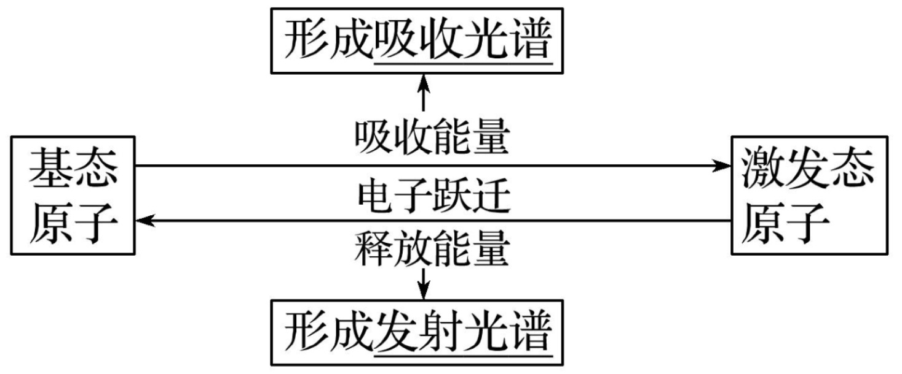

> 焰色试验是金属及其化合物均有的性质，不只是金属单质特有的性质，焰色试验金属被灼烧吸收能量，电子会跃迁到较高能级，变成激发态原子，所以是发射光谱。

## 概率密度

量子力学指出，一定空间运动状态的电子在核外空间各处都可能出现，但出现的概率不同，可用概率密度不同，即
$$
\rho = \dfrac{P}{V}
$$

## 电子云

电子云是处于一定空间运动状态的电子在原子核外空间概率分布的形象化描述。

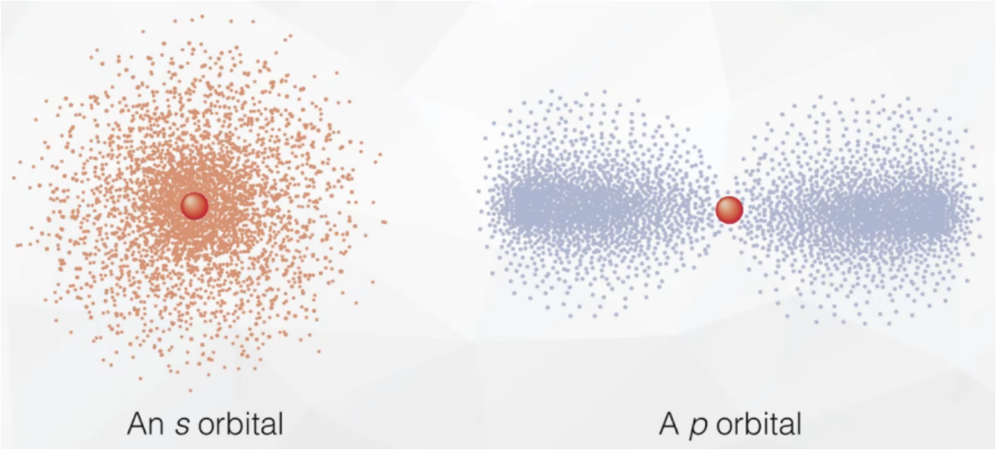

如图所示，则电子云越密集，则电子出现的概率密度越大；电子云越稀疏，则电子出现的概率越低。

> $\ce{4s}$ 的电子能量较高，说明 $\ce{4s}$ 比 $\ce{3s}$ 在离核更远的地方运动的概率更大，而非**总是**在比 $\ce{3s}$ 电子离核更远的地方运动。

## 电子轮廓图

绘制电子轮廓图的目的是表示电子云轮廓的形状，对核外电子的空间状态有一个形象化的简便描述。如图所示。

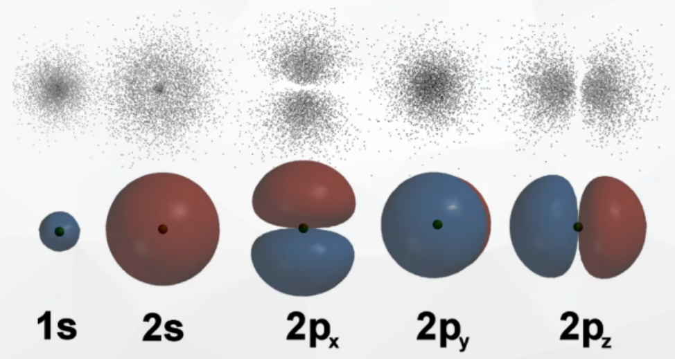

## 原子轨道类型与形状

量子力学把电子在原子核外的一个空间运动状态称为一个原子轨道。

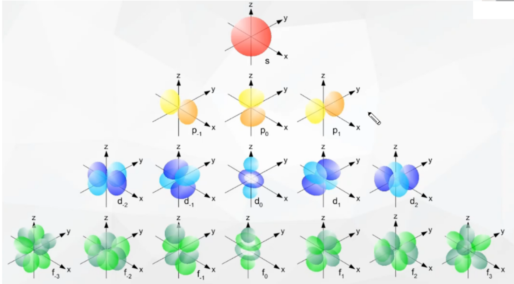

$\ce s$ 轨道：球形，一种空间伸展方向。

$\ce p$ 轨道：哑铃形，三种空间伸展方向。

同一能级的不同轨道能量相同，例如 $p$ 能级的 $\ce{p_x,p_y,p_z}$ 能量相同。

> 注意：一个基态原子的核外电子云不同的伸展方向的种类数为该原子核外电子排布中所涉及的所有种类的轨道的伸展方向之和。例如：基态 $\ce{Al}$ 原子的核外电子排布为 $\ce{1s^2 2s^2 2p^6 3s^2 3p^1}$，包括 $\ce{s}$ 和 $\ce{p}$ 两种轨道，所以其核外电子云（轨道）的伸展方向有 $4$ 种。

## 原子轨道能量高低

相同能层上原子轨道能量的高低：$\ce{ns < np < nd < nf}$。

形状相同的原子轨道能量的高低：$\ce{1s < 2s < 3s < 4s < }\cdots$

同一能层内形状相同而伸展方向不同的原子轨道的能量相等，如 $\ce{np_x,np_y,np_z}$ 轨道的能量相等。

## 构造原理

从氢开始，随核电荷数递增，新增电子填入能级的顺序称为构造原理。

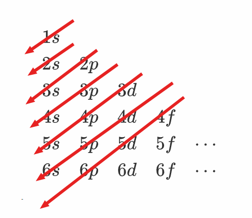

如图所示，电子按照箭头从上到下的电子轨道依次填入。

即：

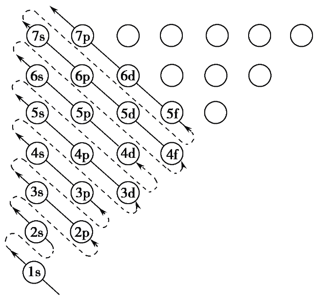

> 注意：构造原理得到的是**最终能量最低的状态**，并不一定按照**能量顺序**填充。

## 电子排布规律

### 能量最低原理

基态原子核外电子优先占据能量最低的原子轨道。如：$\ce{Ga}$ 的电子排布式为 $\ce{1s^2 2s^2 2p^6 3s^2 3p^6 3d^10 4s^2 4p^2}$。

### 泡利不相容原理

量子力学理论提出，电子除空间运动状态外，还有一种状态叫**自旋**。

自旋是微观粒子普遍存在的一种如同电荷、质量一样的内在属性。电子自旋有顺时针和逆时针两种取向，常用上下箭头表示自旋状态相反的电子。

泡利不相容原理：在一个电子轨道里，最多能容纳两个电子，且它们自旋状态相反。

### 洪特规则

核外电子在能量相同的原子轨道上排布时，将尽可能分占不同的原子轨道，并且自旋状态相同。例如若干电子填入 $2p_x,2p_y,2p_z$，则先分别在 $\ce{2p_x,2p_y,2p_z}$ 填入三个电子，即尽量分占不同的原子轨道。

（新人教版：基态原子中，填入简并轨道的电子总是先单独分占，且自旋平行。）

> 注意：洪特规则适用于能量最低的激态，能量较高（非激态）时洪特规则可能会被违反，但泡利不相容原理始终不能违反。例如：基态 $\ce{N}$ 原子的核外电子排布为 $\ce{1s^2 2s^2 2p^3}$，其 $\ce{2p}$ 轨道的 $3$ 个电子排布方式为 ，若为 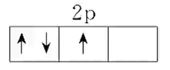 或 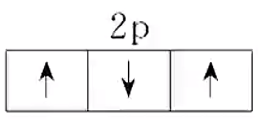，则 $\ce{N}$ 原子为非激态。
>
> 特例：对于某些元素，能量相同的原子轨道在半满或全满状态时，体系的能量最低。

## 核外电子排布

### 原子轨道近似能级图

化学家鲍林基于大量光谱实验数据及近似的理论计算，提出的多电子原子的原子轨道近似能级图。

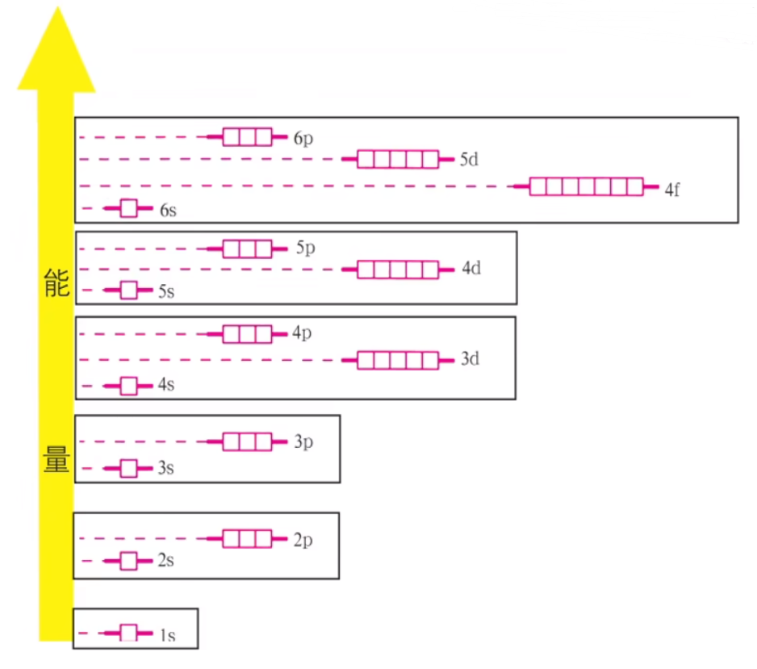

### 能级组

在上图中，将能量相近的原子轨道归为一组，称为**同一能级组**，所得到的能级组按照能量从低到高的顺序与元素周期表中的周期相对应。

不同的能级组之间的能量差较大，同一能级组之间的能量差较小。例如：上图中 $\ce{2s,2p}$ 同处同一个能级组，说明这两个原子轨道能量差较小。

### *价层电子

先看摘取于维基百科上的一段话：

> 价层电子**通常**处于最外层的电子轨道，且**可以在原子间形成化学键的电子**。
>
> 一般而言，主族元素的价层电子就是「最外层电子」，过渡元素的价层电子则**可包括**「次外层电子」，某些元素的倒数第三层也可以成为价层电子。
>
> 普通元素的价电子位于最外层；但是过渡金属的价电子可能也出现在 $\ce{d}$ 轨道。

总结来说，主族和 $0$ 族的价层电子是「最外层电子」，副族和 $\ce{VIII}$ 族的价层电子除了「最外层电子」外，还可能包含「**全部或部分**的次外层电子」。

注意：这里「全部或部分的次外层电子」的理解是，对于某个属于副族、$\ce{VIII}$ 族的元素而言，次外层电子中并不一定全都是价层电子，而是次外层电子中，**可以参与化学反应**的电子。

> 研究表明，通常只有**最外层能级组的电子**才有可能参与化学反应，最外能级组中那些有可能参与化学反应的电子就称为价层电子。

对于 $21 \sim 27$ 号过渡金属元素而言，其价电子排布式为**简化**电子排布式中，**除了原子实**以外的部分（对于 $21\sim 27$ 号元素只包含 $\ce{3d}$ 和 $\ce{4s}$ 轨道），例如：基态 $\ce{Ni}$ 原子的**简化电子排布式**为 $\ce{[Ar] 3d^8 4s^2}$，则其**价电子排布式**为 $\ce{3d^8 4s^2}$。

对于前 $1\sim 37$ 号元素中，除了过渡金属之外的元素，其价电子排布式就是最外层电子的排布式。

## 电子排布式

### 书写方法

将能级上所容纳的电子数表在该能级符号右上角，并按照能层从左到右的顺序排列的式子。如氮原子的电子排布式为：

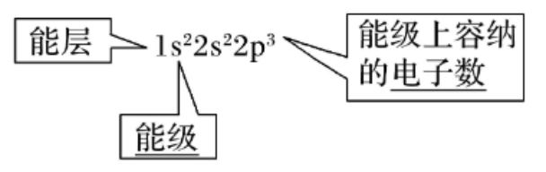

### 电子排布图（轨道表示式）

直观的反映出原子的核外电子的自旋情况以及成对电子对数和未成对的单电子数。例如，氧元素的轨道表示式如下：

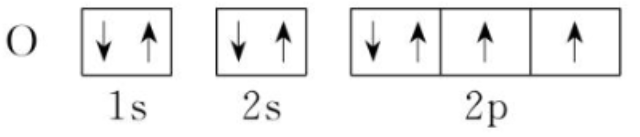

其中，$\ce{2p}$ 轨道中的后两个轨道中的电子均为**未成对电子**，$\ce{1s、2s}$ 以及 $\ce{2p}$ 轨道的第一个轨道中的电子均为**成对电子**，所以成对电子对数为 $3$，未成对的单电子数为 $2$。

> 注意：核外电子排布图指的是核外所有电子的轨道表示式，与价层电子轨道表示式不同。

### 原子实

为了避免电子排布式书写过于繁琐，把内层电子达到稀有气体原子结构的部分以相应的稀有气体元素符号外加方括号表示，作为**简化电子排布式**。表示方法为：[该元素前一周期稀有气体元素符号] $+$ 剩余电子排布式。

### 过渡金属

过渡[金属元素](https://baike.baidu.com/item/金属元素/9491604?fromModule=lemma_inlink)是指[元素周期表](https://baike.baidu.com/item/元素周期表/282048?fromModule=lemma_inlink)中 $\ce{d}$ 区与 $\ce{ds}$ 区（[$\ce{d}$ 区元素](https://baike.baidu.com/item/d区元素/1130278?fromModule=lemma_inlink)包括周期系第 $\ce{III B～VII B,VIII}$ 族的元素。不包括[镧系](https://baike.baidu.com/item/镧系/6968077?fromModule=lemma_inlink)和[锕系元素](https://baike.baidu.com/item/锕系元素/4581308?fromModule=lemma_inlink)。$\ce{ds}$ 区包括周期表第 $\ce{I B～II B}$ 族元素。）的一系列金属元素，又称[过渡金属](https://baike.baidu.com/item/过渡金属/2444178?fromModule=lemma_inlink)，如图所示。

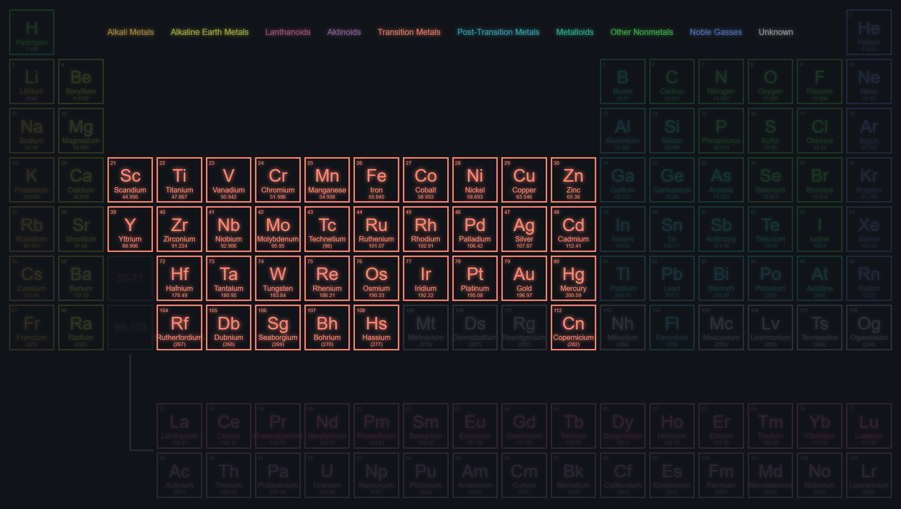

严格来讲，一般过渡金属还**不包含**图中的镧系和锕系，以及 $\ce{109,110,111}$ 号金属。但**高中阶段不做区分，默认镧系锕系和 $109 \sim 111$ 号金属属于过渡金属元素**。

### 常见原子的写法

| 原子序数 | 元素名称 | 元素符号  |                          电子排布式                          |                      价层电子轨道表示式                      |
| :------: | :------: | :-------: | :----------------------------------------------------------: | :----------------------------------------------------------: |
|    1     |    氢    | $\ce{H}$  |                         $\ce{1s^1}$                          | 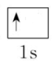 |
|    2     |    氦    | $\ce{He}$ |                         $\ce{1s^2}$                          | 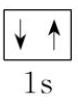 |
|    3     |    锂    | $\ce{Li}$ |                       $\ce{1s^2 2s^1}$                       | 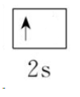 |
|    4     |    铍    | $\ce{Be}$ |                       $\ce{1s^2 2s^2}$                       | 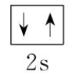 |
|    5     |    硼    | $\ce{B}$  |                    $\ce{1s^2 2s^2 2p^1}$                     | 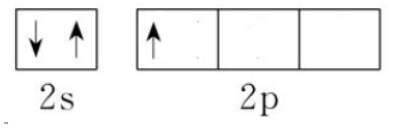 |
|    6     |    碳    | $\ce{C}$  |                    $\ce{1s^2 2s^2 2p^2}$                     | 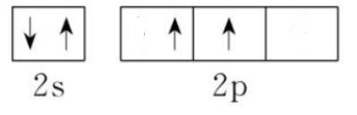 |
|    7     |    氮    | $\ce{N}$  |                    $\ce{1s^2 2s^2 sp^3}$                     | 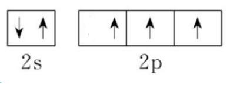 |
| $\cdots$ |          |           |                                                              |                                                              |
|    10    |    氖    | $\ce{Ne}$ |                    $\ce{1s^2 2s^2 2p^6}$                     | 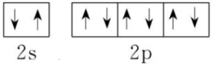 |
|    11    |    钠    | $\ce{Na}$ |                  $\ce{1s^2 2s^2 2p^6 3s^1}$                  | 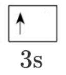 |
| $\cdots$ |          |           |                                                              |                                                              |
|    18    |    氩    | $\ce{Ar}$ |               $\ce{1s^2 2s^2 2p^6 3s^2 3p^6}$                | 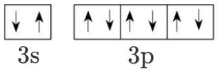 |
|    19    |    钾    | $\ce{K}$  | $\ce{1s^2 2s^2 2p^6 3s^2 3p^6 4s^1}$  或一般写作 $\ce{[Ar] 4s^1}$ | 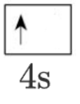 |
| $\cdots$ |          |           |                                                              |                                                              |
|    21    |    钪    | $\ce{Sc}$ |                    $\ce{[Ar] 3d^1 4s^2}$                     | 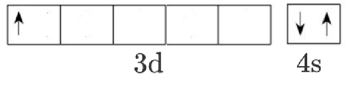 |
| $\cdots$ |          |           |                                                              |                                                              |
|    24    |    铬    | $\ce{Cr}$ |                    $\ce{[Ar] 3d^5 4s^1}$                     | 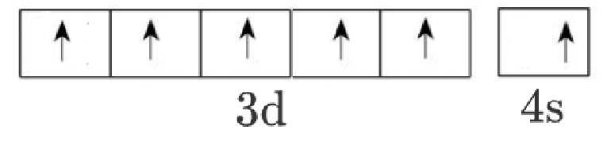 |
| $\cdots$ |          |           |                                                              |                                                              |
|    29    |    铜    | $\ce{Cu}$ |                    $\ce{[Ar] 3d^9 4s^2}$                     | 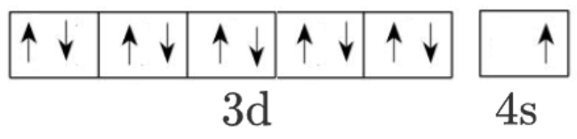 |
| $\cdots$ |          |           |                                                              |                                                              |
|    31    |    镓    | $\ce{Ga}$ |                 $\ce{[Ar] 3d^10 4s^2 4p^1}$                  | 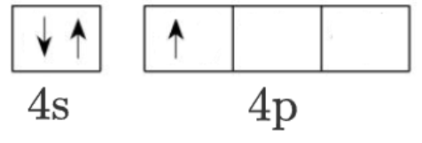 |
| $\cdots$ |          |           |                                                              |                                                              |
|    36    |    氪    | $\ce{Kr}$ |                  $\ce{[Ar]3d^10 4s^2 4p^6}$                  | 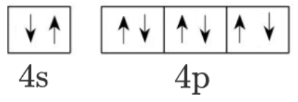 |
|    37    |    铷    | $\ce{Rb}$ |                       $\ce{[Kr] 5s^1}$                       | 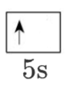 |

说明：

1. 铬是第四周期未成对电子数最多的基态原子。
2. 其中前 $20$ 个元素和第 $31 \sim 37$ 个元素（从镓到铷）的价态电子指的就是最外层电子，所以价态电子轨道表示式就是最外层电子轨道表示式。
3. 第 $21 \sim 30$ 个元素的价态电子指的是最外层电子和次外层电子。
4. 对于 $21 \sim 30$ 号元素：其电子排布式为 $\ce{[Ar] 3d^x 4s^2}$，一般情况下**个位数**是几，$x$ 就等于几。特殊情况：$24$ 号元素铬 $\ce{Cr}$ 和 $29$ 号元素铜 $\ce{Cu}$，这两个元素属于洪特规则的特例，相当于 $\ce{3d}$ 从 $\ce{4s}$ 中抢夺了一个电子从而达到半满状态。
5. 对于 $31 \sim 36$ 号元素：其电子排布式为 $\ce{[Ar] 3d^10 4s^2 4p^x}$，**个位数**是几，$x$ 就等于几。
6. 过渡金属原子；除了 $\ce{Cu}$ 和 $\ce{Cr}$ 原子最外层有 $1$ 个电子外，其余的元素的最外层都有 $2$ 个电子。

### 过渡金属阳离子的写法

先写出对应金属的电子排布式，然后失电子从最外层的电子失去，失去几个电子就从最外层剥去几个。例如：$\ce{Fe}$ 是 $\ce{[Ar] 3d^6 4s^2}$，$\ce{Fe^2+}$ 是 $\ce{[Ar] 3d^6}$，$\ce{Fe^3+}$ 是 $\ce{[Ar] 3d^5}$，此时 $\ce{Fe^3+}$ 中 $\ce{3d}$ 轨道半满，所以此时它相对于 $\ce{Fe^2+}$ 更加稳定。

## 电子运动状态与空间运动状态

基态原子的核外电子不同运动状态的种类数等于核外电子的数目。

核外电子不同**空间**运动状态的种类数等于占据的原子轨道数。

处在同一能级的电子能量相同，所以能量不同的电子种类数等于总的能级个数。

## 元素周期表

### 图示

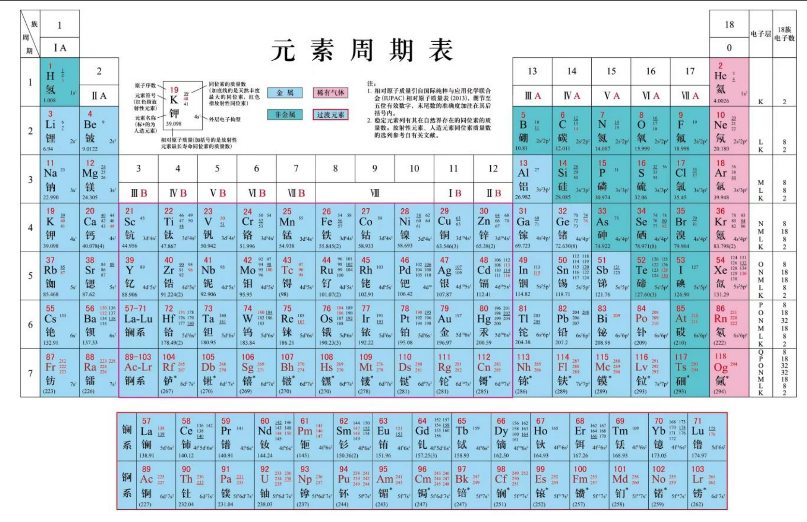

### 结构

元素周期表共有 $7$ 个周期，包含主族（$\ce{I A} \sim \ce{VII A}$ 族）、$0$ 族和副族（人教版中的 $\ce{I B \sim VII B}$ 族和第 $\ce{VIII}$ 族）。

前三周期叫短周期，后四周期是长周期。

由于 $\ce{III B}$ 族包含镧系和锕系，所以它是含有元素最多的一个周期。

类金属：如下图所示，常见的类金属有 $\ce{Te、Sb、B、Ge、As、As、Si}$，口诀：碲（弟）锑（弟）硼（捧）锗（着）砷（神）硅（龟）。

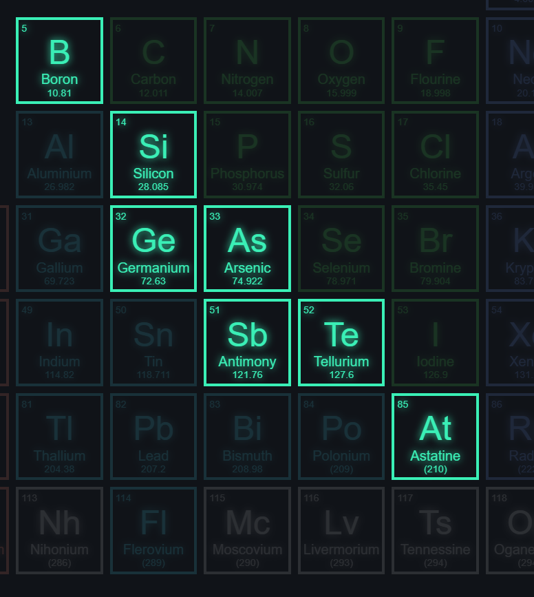

### 价层电子排布与周期的划分

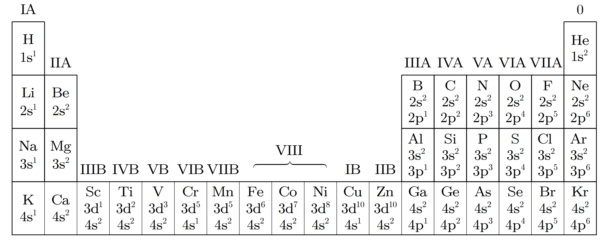

第一周期：上图第一行元素，即 $\ce{H}$ 和 $\ce{He}$。价层电子排布：$\ce{1s^1 -> 1s^2}$。

第二周期：上图第二行元素，即 $3\sim 10$ 号元素。价层电子排布：$\ce{2s^1 -> 2s^2 -> 2s^2 2p^1 ->\cdots -> 2s^2 2p^6}$。

第三周期：上图第三行元素，即 $11 \sim 18$ 号元素。价层电子排布：$\ce{3s^1 -> 3s^2 -> 3s^2 3p^1 ->\cdots -> 3s^2 3p^6}$

第四周期：上图第四行元素，即 $19 \sim 30$ 元素。价层电子排布：$\ce{4s^1 -> 4s^2 -> 3d^1 4s^2 -> \cdots -> 3d^10 4s^2 -> 4s^2 4p^1 -> 4s^2 4p^6}$。

前四周期中，只有**过渡元素价层电子排布涉及到 $\ce{d}$ 轨道**，主族和 $0$ 族元素不涉及。

第五周期的价层电子排布同理第四周期。第六七周期的镧系和锕系夹层电子排布还会涉及到**倒数第三层电子**的原子轨道，会涉及 $\ce{4f}$ 和 $\ce{5f}$.

除第一周期外，其余周期总是从 $\ce{$n$s}$ 能级开始，以 $\ce{$n$s $n$p}$ 能级结束。

其中从第一到第七周期的元素个数分别为：$2、8、8、18、18、32、32$。

一个能级组最多能容纳的电子数等于对应的周期包含的元素种数。

### 各族元素价层电子排布特点

【主族】$\ce{$n$s^1 -> $n$s^2 $n$p^5}$，且主族序数 $=$ 最外层电子数 $=$ 价层电子数，$n$ 为周期。

【$\ce{0}$ 族】$\ce{He}$ 为 $\ce{1s^2}$，其它为 $\ce{$n$s^2 $n$p^6}$。

【过渡元素】全部都是金属元素，且最外层电子数不超过 $2$。

- $\ce{III B \sim VII B}$ 族：$\ce{($n$ -1)d^{1-5} $n$s^{1-2}}$。镧系、锕系（不包含镧和锕）除外。族序数 $=$ 价电子数，且一般等于最高正价。
- $\ce{VIII}$ 族（8、9、10 列）：$\ce{($n$ - 1)d^{6-9} + $n$s^{1-2}}$。$\ce{Pd}$ 是 $\ce{4d^10}$ 除外。
- $\ce{I B \sim II B}$ 族：$\ce{($n$ - 1)d^10 $n$s^{1-2}}$，其中 $\ce{($n$ - 1)d}$ 轨道全满。族序数 $= $ 最外层 $\ce{$n$s}$ 轨道上的电子数 $=$ 最外层电子数。
- 镧系/锕系（仅供了解）：$\ce{($n$ - 2)f^{0-14} ($n$ -1)d^{0-2} $n$s^2}$。

### 分区

按照核外电子排布，可把元素周期表划分为 $5$ 个区—— $\ce{s}$ 区、$\ce{p}$ 区、$\ce{d}$ 区、$\ce{ds}$ 区、$\ce{f}$ 区。

除 $\ce{ds}$ 区外，各区的名称来自按构造原理最后填入电子的能级符号。

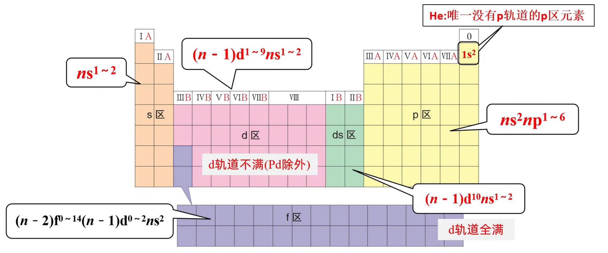

## 元素周期律

### 原子半径

原子半径的大小取决于两个相反的因素：**电子的能层数**和**核电荷数**。

电子能层数越多，原子半径越大；核电荷数越多，原子半径越小。

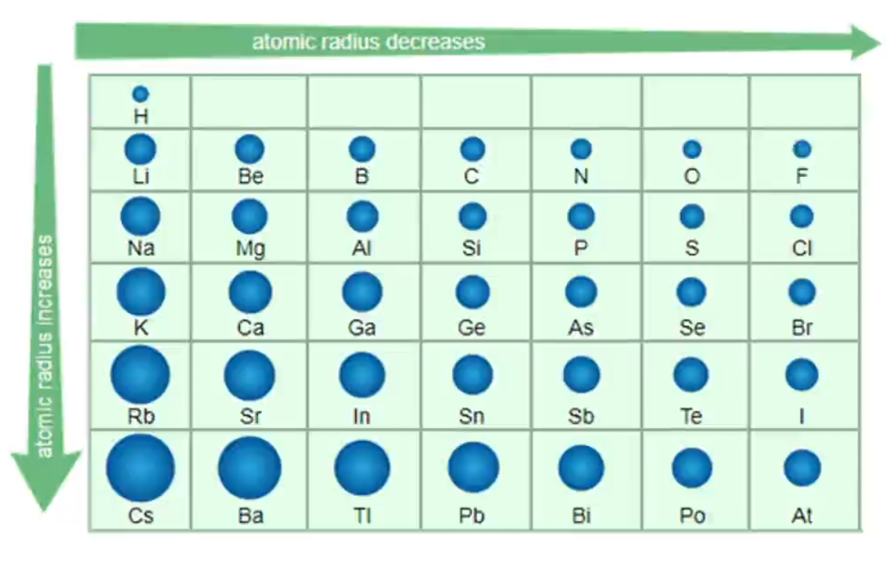

如图所示，一般情况（主族），同一周期，由左向右，原子半径逐渐减小；同一族内，从上到下，原子半径逐渐增大。

第三周期的原子半径普遍大于第二周期（锂除外）。

### 电离能

#### 定义

气态 电中性 基态原子失去一个电子转化为 气态 基态 正离子所需要的**最低能量**叫做该元素的**第一电离能**，用 $\ce{I1}$ 表示。即：
$$
\ce{M(g) - e- -> M+(g)}\qquad \ce{I1}(第一电离能)
$$
保证「能量最低」的条件：①气态；②电中性；③基态；④失去一个电子；

#### 意义

1. 第一电离能可以衡量元素的气态原子失去一个电子的难易程度。第一电离能数值越小，原子越容易失去一个电子；第一电离能数值越大，原子越难失去一个电子。
2. 第一电离能能体现原子最高正价的大小，第一电离能越大，最高正价越大。

#### 影响因素

1. 电子层数：同主族的原子最外层电子数相同，随着原子序数增大，电子层数逐渐增多，原子半径逐渐增大，原子核对核外电子的有效吸引力作用逐渐减弱，第一电离能逐渐减小。
2. 核电荷数：同一周期的主族元素具有相同的电子层数，随着核电荷数增加，原子半径逐渐减小，原子核对核外电子的有效吸引力作用逐渐增大，第一电离能呈现增大趋势。因此对于同周期元素来说，**碱金属的第一电离能最小，稀有气体的第一电离能最大**。
3. 核外电子排布：元素的第一电离能大小还与其原子的核外电子排布（特别是最外围电子排布）有关。通常情况下，当原子核外电子排布在能量相等的轨道上形成全空（$\ce{p^0 、d^0 、f^0}$）、半满（$\ce{p^3 、d^5 、f^7}$）和全满（$\ce{p^6 、d^10 、f^10}$ 结构时，原子的能量较低，该元素具有较大的第一电离能。

第二周期第一电离能大小：
$$
\ce{Li < B < Be < C < O < N < F < Ne}
$$

> 注意：这里相较于原子序数的排序，第 $2$ 和 $3$ 号元素互换了位置，$5$ 和 $6$ 号元素也互换了位置。
>
> 原因：
>
> $\ce{Be}$ 的价层电子排布式是 $\ce{2s^2}$，已经是全满状态，失去一个电子需要破坏 $\ce{2s}$ 全满稳定结构，其第一电离能就会大于不是全满状态下的 $\ce{B}$（$\ce{2s^2 2p^1}$）。
>
> $\ce{N}$ 的价层电子排布式是 $\ce{2s^2 2p^3}$，是半满状态，失去一个电子需要破坏半满稳定结构，其第一电离能大于不是全满&半满状态下的 $\ce{O}$。

第三周期元素第一电离能大小：
$$
\ce{Na < Al < Mg < Si < S < P < Cl < Ar}
$$

> 注意：这里相较于原子序数的排序，第 $12$ 和 $13$ 号元素互换了位置，$15$ 和 $16$ 号元素也互换了位置。

前四周期内第一电离能大小符合：同一周期，$\ce{II A}$ 族元素 $>$ $\ce{III A}$ 族元素，$\ce{V A}$ 族元素 $>$ $\ce{VI A}$ 族元素。

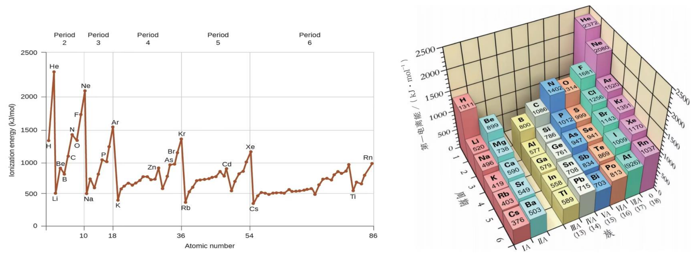

#### 逐级电离能

处于基态的气态原子失去一个电子，生成 $+1$ 价气态阳离子所需要的能量称为第一电离能 $\ce{I1}$。由 $+1$ 价气态阳极再失去一个电子形成 $+2$ 价气态阳离子所需要的能量称为第二电离能 $\ce{I2}$。依次还有第三、四电离能。如下：
$$
\begin{array}{}
&\ce{M(g) = M+ (g) + e-}& \ce{I1}(第一电离能)\\
&\ce{M+ (g) = M^2+(g) + e-}& \ce{I2}(第二电离能)\\
&\ce{M^2+(g) = M^3+(g) + e-}& \ce{I3}(第三电离能)\\
\end{array}
$$
逐级电离能一定越来越大。

#### 示例

下表的数据从上到下是钠、镁、铝逐级失去电子的电离能：

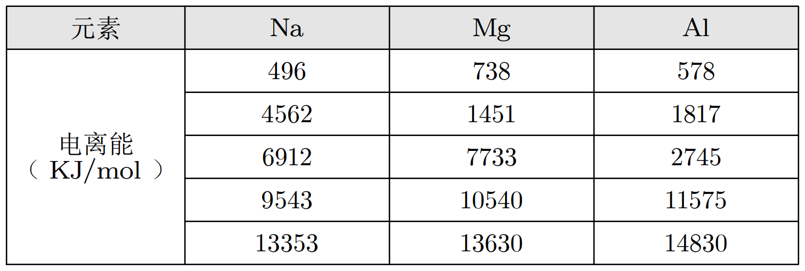

由表格可知：

- 钠的 $\ce{I2 \gg I1}$，所以纳失去第二个电子极为困难，化合价是 $+1$ 价。同理可推出 $\ce{Mg}$ 的化合价是 $+2$ 价，$\ce{Al}$ 的化合价是 $+3$ 价。
- $\ce{I1: Mg > Al > Na}$，虽然同周期由左向右第一电离能呈现渐增趋势，但由于 $\ce{Mg}$ 的价层电子排布式是 $\ce{3s^2}$，是全满稳定结构，失去电子破坏全满结构所需的第一电离能较大。
- $\ce{I2: Na > Al > Mg}$，纳失去第二个电子前的结构是八电子稳定结构，失电子破坏八电子稳定结构，极为困难，所以 $\ce{Na}$ 的第二电离能最大。$\ce{Al}$ 失去第二个电子前的价电子排布式是 $\ce{3s^2}$，$\ce{Mg}$ 是 $\ce{3s^1}$，所以 $\ce{Na > Al > Mg}$。
- $\ce{I3: Mg > Na > Al}$。

口诀：$\ce{I1}$：镁（美）铝（女）钠（呐）；$\ce{I2}$：钠（哪）铝（里）镁（美）；$\ce{I3}$：镁（美）钠（那）铝（里）。

### 电负性

#### 定义

元素相互化合，可理解为原子之间产生化学作用力 ，形象地叫**化学键**，原子中用于形成化学键的电子称为**键合电子**。

为了描述不同元素的原子对键合电子吸引力的相对大小，引入电负性的概念。

**电负性是元素的原子在化合物中，吸引键合电子能力的标度**。

元素电负性越大，表示以其原子在化合物中吸引电子的能力越强；反之，电负性越小，相应原子在化合物中吸引电子的能力越弱。

一般以**氟的电负性为 $4.0$ 和锂的电负性为 $1.0$ 作为相对标准**，得出各元素的电负性。电负性是**相对值**，**没有单位**。

#### 大小

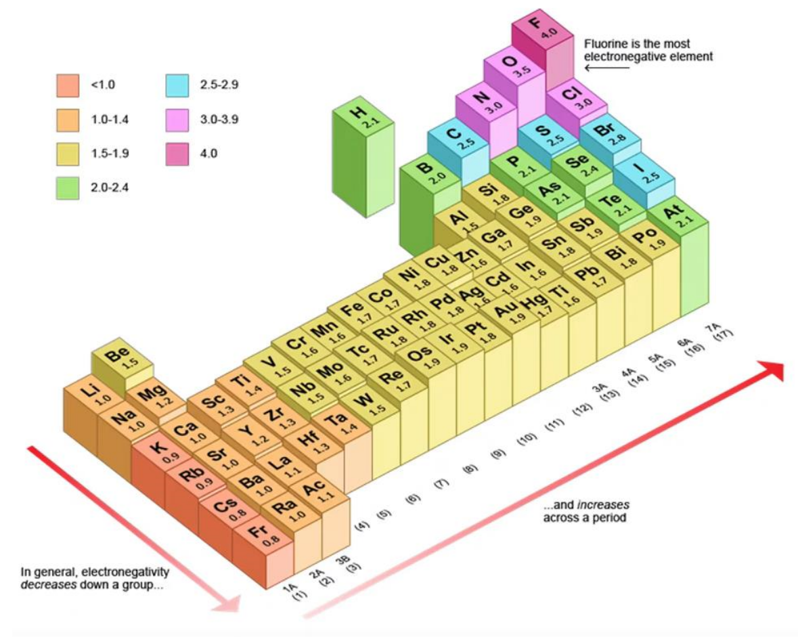

根据图可以看出，「越往右越往上」电负性越大。

同周期主族元素从左到右，元素的电负性逐渐变大。同主族元素从上到下，元素的电负性逐渐变小。

常见电负性比较：
$$
\ce{F > O > N、Cl > Br > I、S、C > P、H > B、Si、Ge(类金属) > 金属}
$$

大小：$\ce{F:4.0}$，$\ce{O : 3.5}$，$\ce{N、Cl:}$ 大约 $3.0$，$\ce{Li : 1.0}$。

#### 用途

1. 判断元素金属性和非金属性强弱的尺度：金属的电负性一般小于 $1.8$，非金属的电负性一般大于 $1.8$，而位于非金属三角区边界的「类金属」（例如锗、锑）的电负性则在 $1.8$ 左右，它们既有金属性，又有非金属性。

2. 判断化学键的类型：一般认为，如果两种成键元素原子间的**电负性差值大于 $1.7$**，它们之间通常形成**离子键**；如果两种成键原子间的**电负性差值小于 $1.7$**，它们之间通常形成**共价键**。如果电负性为 $0$，即相同原子，则形成**非极性共价键**。

   总结来说，电负性从 $0$ 增大到 $1.7$ 以上，成键种类会从**非极性共价键**到**极性共价键**再到**离子键**过渡。

3. 判断化合物中元素的化合价：电负性数值的大小能够衡量元素在化合物中吸引电子能力的大小。**电负性数值小**的元素在化合物中**吸引电子的能力弱**，元素的化合价为**正值**，**电负性数值大**的元素在化合物中**吸引电子的能力强**，元素的化合价为**负值**。

### 对角线规则

对角线规则又称斜线关系，指元素周期表中某一元素及其化合物的性质与它左上方或右下方的另一元素及其化合物的性质相类似，这种现象称为「对角线规则」。在第 $2、3$ 周期中，**具有典型「对角线规则」的元素有三对：锂与镁，铍与铝，硼与硅**。有人从元素的电负性值相近解释「对角线规则」：锂 $1.0$、镁 $1.2$；铍 $1.5$、铝 $1.5$；硼 $2.0$、硅 $1.8$。

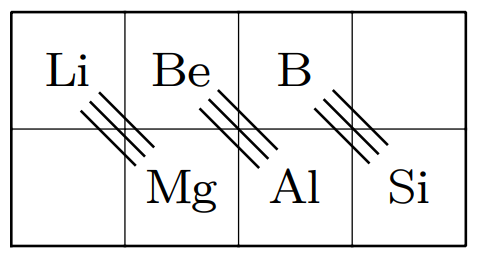

一些科普：

> 注意：以下内容一般情况下非考点，只是为了方便理解。

锂和镁的相似性： 

- 在氧气中燃烧生成氧化物，而其他碱金属则易生成过氧化物、超氧化物。
- 能直接与氮作用，生成氮化物 $\ce{Li3N}$、$\ce{Mg3N2}$，而其他碱金属不与氮直接反应。 
- 氟化物、碳酸盐、磷酸盐都难溶于水，而其他碱金属的相应盐易溶于水等。

铍和铝的相似性：

- 单质在冷的浓硝酸中钝化。
- 氧化物、氢氧化物都有两性。 
- 氯化物都是共价化合物，易汽化，能升华，能溶于有机溶剂等。

硼和硅的相似性：

- 硼和硅的密度分别为 $\pu{2.35g * cm-3}$ 和 $\pu{2.336g * cm-3}$ ，两者相近。 
- 硼和硅的简单气态氢化物都能直接被氧气氧化。
- 最高价氧化物的水化物都是弱酸等。

## 利用原子结构与元素性质推断前四周期元素

### 解题技巧

1. 涉及到与「对角线规则」相关的题目时，考虑将不熟悉的元素相关的问题转化为熟悉（学过）的元素来解决。例如：求 $\ce{Be}$ 与 $\ce{NaOH}$ 溶液反应的化学方程式， 可以通过 $\ce{Al}$ 与 $\ce{NaOH}$ 的化学方程式推出。
2. 周期表中原子半径最小的元素是 $\ce{H}$。
3. 有关成对电子数是未成对电子数的 $n$ 倍的问题，由于成对电子数是偶数，所以成对电子数是 $2$ 和 $n$ 的公倍数。
4. 正三价离子的 $\ce{3d}$ 能级为**半充满**的前四周期元素是 $\ce{Fe}$。
5. 比较元素最高价氧化物的水化物酸性，就是比较非金属性，同周期由左向右，非金属性越来越强。
6. 镁在空气中燃烧除了生成 $\ce{MgO}$，还生成了 $\ce{Mg3N2}$，所以根据「对角线规则」，$\ce{Li}$ 在空气中燃烧生成的产物为 $\ce{Li2O}$ 和 $\ce{Li3N}$。
7. 非金属性越强，简单气态氢化物的稳定性越强。

### 例题

如图是短周期主族元素电负性与第一电离能的关系。回答下列问题：

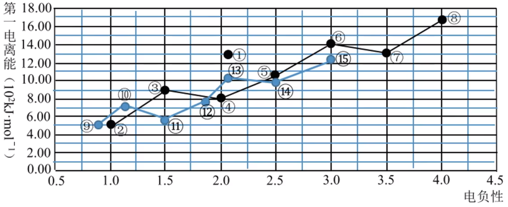

> 注意：下面所说的几号元素，都是上图中对应圈几的元素，而非元素周期表中的对应元素。

1. $3$ 号元素基态原子的电子排布式是什么？$11$ 号元素的离子结构示意图是什么？
2. $1、5、8$ 号元素组成的 $\ce{18}$ 电子的化合物，其空间构型是什么？
3. $8、9、10、14$ 号元素形成的简单离子，其离子半径从小到大的顺序是什么？（用离子符号表示）$6、12、13$ 形成的简单氢化物，熔沸点由低到高的顺序是什么？（用化学式表示）
4. 实验室制备 $15$ 号单质的离子方程式是什么？

---

根据图示，以及在元素周期表中「越往右越往上」电负性越大，以及 $\ce{Li}$ 的电负性为 $1.0$ 可推出，从 $1$ 到 $15$ 号元素，是从 $\ce{H}$ 开始按照元素周期表递增（除去稀有气体元素）。

1. 根据上述分析可知 $3$ 号元素是 $\ce{Be}$，所以其电子排布式为 $\ce{1s^2 2s^2}$，$11$ 号元素是 $\ce{Al}$，它的离子结构示意图略
2. 第 $1、5、8$ 号元素分别是 $\ce{H、C、F}$,它们组成的 $18$ 电子化合物，通过配凑可得是 $\ce{CH3F}$，其空间构型和一氯甲烷 $\ce{CH3Cl}$ 一样是**四面体形**。
3. 第 $8、9、10、14$ 号元素分别是 $\ce{F、Na、Mg、S}$，所以它们形成的离子是 $\ce{F- 、Na+ 、Mg^2+ 、S^2-}$ ，$\ce{S^2-}$ 有三层电子，$\ce{F- 、Na+ 、Mg^2+}$ 有两层电子，电子数目相同。所以 $\ce{S^2-}$ 的离子半径最大，同时电子数目相同，有「序大径小」，那么离子半径从小到大的顺序为 $\ce{Mg^2+ < Na+ < F- < S^2-}$。$6、12、13$ 号元素分别是 $\ce{N、Ni、P}$，对应的简单氢化物分别是 $\ce{NH3、SiH4、PH3}$，由于 $\ce{NH3}$ 内部含有氢键，所以熔沸点最高，$\ce{SiH4}$ 是正四面体的非极性分子，$\ce{PH3}$ 由于是三角锥形，所以是极性分子。所以熔沸点从小到大为 $\ce{SiH4 < PH3 < NH3}$。
4. 第 $15$ 号元素为 $\ce{Cl}$，其对应的单质是 $\ce{Cl2}$，制备它的离子方程式为 $\ce{MnO2 + 2Cl- + 4H+ \xlongequal{\Delta} Mn^2+ + Cl2 ^ + 2H2O}$。
