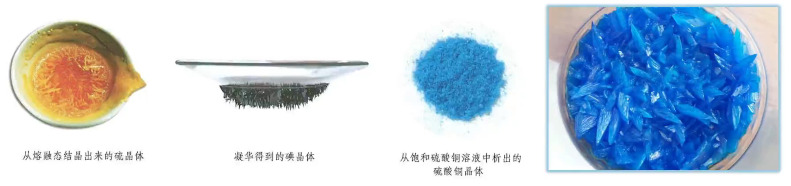

# 【化学】选必二：晶体

## 物质的聚集状态

### 引入

1. 20 世纪前，人们以为分子是所有化学物质能够保持其性质的最小粒子，物质固、液、气三态的相互转化只是分子间距离发生了变化。 
2. 20 世纪初，通过 X 射线衍射等实验手段，发现许多常见的晶体中并无分子，如氯化钠、石墨、二氧化硅、金刚石以及各种金属等。 
3. 气态和液态物质不一定都是由分子构成。如等离子体是由**电子**、**阳离子**和**电中性粒子（分子或原子）**组成的整体上**呈电中性**的**气态物质**；**离子液体**是熔点不高的仅由离子组成的液体物质。
4. 其他物质聚集状态，如晶态、非晶态、塑晶态、液晶态等。

### 基础分类及定义

#### 晶体

【定义】内部微粒在三维空间里呈**周期性有序排列**，而构成的具有**规则几何外形**的固体。例如：冰、碘、硫、硫酸铜等。

【分类】离子晶体、分子晶体、原子晶体（共价晶体）、金属晶体。

#### 非晶体

【定义】内部微粒排列呈**相对无序**状态，**不具有规则几何外形**的固体。例如：玻璃、橡胶、松香等。

## 晶体的特点

### 自范性

#### 定义

在适宜的条件下，晶体能够自发地呈现封闭的、规则的几何多面体外形，这称为晶体的自范性。例如：石英。

> 注意：「自发」不代表一定会发生，**仍需要一定的条件**。

#### 形成条件

晶体生长的速率适当。

熔融态物质冷却凝固，有时得到晶体，但凝固速率过快，常常只得到看不到多面体外形的粉末或没有规则外形的块状物。水晶球是岩浆里熔融态的 $\ce{SiO2}$ 侵入地壳内的空洞冷却形成的。剖开水晶球，它的外层是看不到晶体外形的玛瑙，内层才是呈现晶体外形的水晶。不同的是，玛瑙是熔融态 $\ce{SiO2}$ 快速冷却形成的，而水晶则是熔融态 $\ce{SiO2}$ 缓慢冷却形成的。

#### 本质原因

**晶体的自范性是晶体中原子、分子和离子等微粒在三维空间里呈现周期性有序排列的宏观表现**。相反，非晶体中微粒的排列则相对无序，因而无自范性。

例如：自然界中存在的各种石英晶体（晶体 $\ce{SiO2}$），它们几乎都具有对称的六角形棱柱状的外形，而玻璃、玛瑙（非晶体 $\ce{SiO2}$）等就没有天然的、有规则地外形，如下图所示。

### 各向异性

晶体内部微粒地排列呈现周期性，而不同方向上地微粒排列情况是不同地。因此，在晶体中，不同的方向上具有不同的物理性质，如导电性、导热性、硬度，解离性等，这就称为晶体的各向异性。

例如：石墨在与层平行的方向上的电导率数值约为在与层垂直的方向上的电导率数值的一万倍（所以可以认为在于层垂直方向上几乎不导电）。云母晶体各个方向解离性不同，若沿两层平面的平行方向施加外力就容易解离，若沿着垂直于平面的方向剥离就困难得多。非晶体在各个方向上的物理性质都一致，显各向同性。例如：玻璃的折光率、热膨胀系数等，一般不随测定的方向而改变。

### 其它特点

晶体有**固定的熔点**；外部和内部质点排列的**高度有序性**。

### 晶体和非晶体的辨别

区分晶体和非晶体的最好方法是 X- 射线衍射。如下图。

## 获得晶体的途径

1. 熔融态物质凝固。
2. 气态物质冷却不经液体直接凝固（凝华）。
3. 溶质从溶液中析出。

## 晶胞

### 概念

描述晶体结构的基本单元。

### 晶胞与晶体的关系

一般来说，晶胞都是平行六面体，整块晶体可以看作是数量巨大的晶胞「无隙并置」而成。

其中，「无隙」是指相邻晶胞之间无任何间隙；「并置」是指所有晶胞都是平行排列的，取向相同。

所有晶胞的形状及其内部的原子种类、个数及几何排列是完全相同的。如下图所示。

### 晶胞中粒子数目的计算——均摊法

若晶胞中某个粒子为 $n$ 个晶胞所共用，则该粒子有 $\dfrac 1 n$ 属于这个晶胞。如下图所示。

举例：

如下图，纳晶胞是体心堆积，单位晶胞有 $8 \times \dfrac 1 8 + 1 = 2$ 个钠原子。配位数为 $8$。

如下图，铜晶胞是面心立方**最密**堆积（每一个面的正中心都有一个原子），特征是 $8$ 个顶点 $+$ 上下左右前后 $6$ 个面的中心均有粒子，单位晶胞有 $8 \times \dfrac 1 8 + 6 \times \dfrac 1 2 = 4$ 个铜原子。配位数为 $12$。

如下图，氯化钠晶胞中氯离子是面心立方**最密**堆积，则单位晶胞有 $8 \times \dfrac 1 8 + 6 \times 1 2 = 4$ 个氯离子，同理钠离子也有 $4$ 个。由图可知，与 $\ce{Na+}$ 最近的 $\ce{Cl-}$ 有 $6$ 个，与 $\ce{Na+}$ 最近的 $\ce{Na+}$ 有 $12$ 个；氯离子同理。$\ce{Na+}$ 位于 $\ce{Cl-}$ 的正八面体的中心。

> 由于化学式中钠离子和氯离子个数之比为 $1:1$，所以单位晶胞中钠离子和氯离子之比**一定也为** $1:1$。即由离子组成的物质，单位晶胞中离子个数比一定等于化学式的离子个数比。

金刚石晶胞中，八个顶点上各有一个碳原子，六个面的中心上各有一个碳原子，剩下四个碳原子遵循「上面一前一后，下面一后一前」存在，但由于实际上中间可以有八个碳原子，所以金刚石晶胞的**空隙利用率**是 $50\%$。当中间出现八个碳原子时，空袭利用率是 $100\%$，此时为 $\ce{CaF2}$ 晶胞。金刚石的各个原子的坐标如下图所示。

碳化硅的结构与金刚石几乎相同，如下。

$\ce{CaF2}$ 晶胞中，每个晶胞含有的 $\ce{Ca^2+}$ 为 $8 \times \dfrac 1 8 + 6 \times 1 2 = 4$ 个，由于 $\ce{CaF2}$ 中 $\ce{Ca^2+}$ 与 $\ce{F-}$ 的化学计量数之比为 $1:2$，所以每个晶胞中含有 $8$ 个 $\ce{F-}$。

下图为六方最密堆积，配位数为 $12$。其中，该晶胞的顶点原子被六个晶胞共用，所以它对每一个晶胞的贡献度只有 $\dfrac 1 6$，所以每个晶胞中有 $12 \times \dfrac 1 6 + 2 \times 1 2 + 3 = 6$ 个原子。若晶胞上的原子为 $\ce{Zn}$ 原子，其底面三角形的边长为 $a \ \pu{nm}$，高 $b \ \pu{nm}$，则其密度 $\rho = \dfrac{6 \times 65}{N_{\ce{A}} \times \left(6 \times \dfrac{\sqrt 3}{4} a^2\right) \times b} \times 10^{21} \ \pu{g*cm^-3}$。

## 分子晶体

### 概念

只含**分子**的晶体，或者分子间以**分子间作用力**（范德华力、氢键）结合形成的晶体叫做**分子晶体**。

### 粒子及粒子间的相互作用

> 注意：
>
> - 不是所有的分子晶体都含有共价键，例如稀有气体是**单原子分子**，属于分子晶体，但其中**没有共价键**。
> - 所有晶体都有化学式，但只有分子晶体的化学式可以表示分子式；所有由分子组成的纯净物都可以用化学式表示分子组成。

### 常见的典型分子晶体

1. 所有的非金属氢化物，如 $\ce{H2O、H2S、NH3、CH4、HX(卤化氢)}$ 等。
2. 部分非金属单质，如 $\ce{X2(卤素单质)、O2、H2、S8、P4、C60}$、稀有气体等。
3. 部分非金属氧化物，如 $\ce{CO2、SO2、NO2、P4O6、P4O10}$ 等。
4. 几乎所有的酸，如 $\ce{H2SO4、HNO3、H3PO4、H2SiO3}$ 等。
5. 绝大多数有机物，如苯、四氯化碳、乙醇、冰醋酸、蔗糖等。

### 物理性质

1. 熔沸点较低，硬度很小：破坏范德华力或氢键较为容易。
2. 多数分子晶体在常温时为气态或液态：高中范围内，常温常压下，除了 $\ce{Hg}$ 和离子液体之外，所有的气体或液体都是分子晶体。
3. 分子晶体不导电，部分分子晶体，例如 $\ce{HCl、NH3}$ 等固态不导电，但水溶液能导电。
4. 分子晶体的溶解性一般符合「相似相溶」规律。

### 结构特征

|              |                       分子密堆积                        |                         分子非密堆积                         |
| :----------: | :-----------------------------------------------------: | :----------------------------------------------------------: |
| 微粒间作用力 |                        范德华力                         |                        范德华力和氢键                        |
|   空间特点   | 通常每个分子周围有 $12$ 个紧邻的分子 配位数为 $12$ | 每个分子周围紧邻的分子数 $< 12$，空间利用率不高 配位数 $< 12$ |
|     举例     |         $\ce{C60}$、干冰、$\ce{I2}$、$\ce{O2}$          |                      $\ce{HF、NH3}$、冰                      |

一般而言，结构类似于面心立方最密堆积的晶体是分子密堆积，例如 $\ce{I2}$ 的晶体结构类似于面心立方最密堆积，所以就是分子密堆积，其配位数为 $12$。

一般含有氢键的分子晶体都是分子非密堆积。

常见的分子晶体结构如下图所示（P1 为 $\ce{I2}$ 晶体结构）。

> 注意：分子晶体的结构都是封闭的，不能再通过化学键与其他原子结合，例如下面六副图中，只有 ② 和 ⑤ 可能是分子晶体。
>
> 

### 常见的分子晶体的结构分析

#### 冰晶体

**结构**

冰晶体中，水分子间主要通过氢键形成晶体。由于氢键具有一定的方向性（所以必须沿着水分子 $\ce{sp^3}$ 杂化的方向形成氢键），一个水分子和周围四个水分子结合，这四个水分子也按照同样的规律再与其他的水分子结合。这样，每个 $\ce{O}$ 原子周围都有四个 $\ce{H}$ 原子，其中两个 $\ce{H}$ 原子与 $\ce{O}$ 原子以共价键结合，另外两个 $\ce{H}$ 原子与 $\ce{O}$ 原子以氢键结合，使水分子间构成四面体骨架结构。其结构可用下图表示。

**性质**

由于氢键具有方向性，冰晶体中水分子未采用密堆积方式，这种堆积方式使冰晶体中水分子的空间利用率不高，留有相当大的空隙。所以当冰刚刚融化成液态水时，水分子间的空隙减小，密度反而增大，超过 $\pu{4^\circ C}$ 时，分子密度距离加大，密度逐渐减小。

#### 干冰

**结构**

固态 $\ce{CO2}$ 称为干冰，干冰也是分子晶体。$\ce{CO2}$ 分子内存在 $\ce{C=O}$ 共价键，分子间存在范德华力，$\ce{CO2}$ 的晶胞呈**类**面心立方体形，立方体的每个顶角有一个 $\ce{CO2}$ 分子，每个面上也有一个 $\ce{CO2}$ 分子。每个 $\ce{CO2}$ 分子与 $12$ 个 $\ce{CO2}$ 分子等距离相邻（在三个互相垂直的平面上各 $4$ 个或互相平行的三层上，每层上各 $4$ 个）。$\ce{CO2}$ 晶胞中 $\ce{CO2}$ 分子有 $4$ 种取向。如下图所示。

**性质**

干冰的外观很像冰，硬度也跟冰相似，熔点却比冰低得多（因为冰有氢键），在常压下极易升华，在工业上广泛用作制冷剂，可用于人工降雨；由于干冰中的 $\ce{CO2}$ 之间只存在范德华力不存在氢键，范德华力不具有方向性，所以其密度比冰的高。

## 共价晶体

### 概念

相邻原子间以**共价键**相结合形成共价键三维骨架结构的晶体。

### 粒子及粒子间的相互作用

> 注意：共价晶体和分子晶体**都有共价键**，二者的区别在于基本粒子聚集时的作用力不同，分子晶体聚集时的作用力是**分子间作用力**，而原子晶体聚集时的作用力是**共价键**。

### 典型的共价键

主要由 $\ce{III A,IV A,V A}$ 族的元素形成，一般相比分子晶体较少，可直接记忆。

1. 某些单质，如硼 $\ce{B}$，硅 $\ce{Si}$，锗 $\ce{Ge}$，灰锡 $\ce{Sn}$、金刚石等。
2. 某些非金属化合物，如金刚砂（碳化硅） $\ce{SiC}$、二氧化硅 $\ce{SiO2}$、氮化硼 $\ce{BN}$、氮化硅 $\ce{Si3N4}$ 等。
3. 极少数的金属氧化物，如刚玉 $\ce{\alpha-Al2O3}$ 等。

> 注意：灰锡是共价晶体，但**白锡不是共价晶体**。

### 物理性质

1. 共价晶体中，由于各原子均以强的共价键相结合，因此一般**熔点很高**（例如金刚石 $\pu{3550^\circ C}$，在高中阶段仅次于石墨），**硬度很大**，**难溶于常见溶剂**，**一般不导电**。
2. 结构相似的共价晶体，**原子半径越小，键长越短，键能越大，晶体的熔点越高**。例如：由于键长 $\ce{C-C < Si-C < Si-Si}$，所以键能 $\ce{C-C > Si-C > Si-Si}$，所以熔点 金刚石 $>$ 金刚砂 $\ce{SiC}$ $>$ 单晶硅。

### 常见的典型共价晶体

#### 金刚石 

在金刚石晶体中，每个碳原子周围紧邻的碳原子有 $4$ 个，每个碳原子都采取 $\ce{sp^3}$ 杂化。所有的 $\ce{C-C}$ 键长相等，键角相等，键角为 $109^\circ 28'$，形成正四面体结构。

晶体中，每个碳原子都参与了 $4$ 个 $\ce{C-C}$ 键的形成，而在每个键中的**贡献度只有一半**，故金刚石中 $\pu{1 mol C}$ 原子含 $\ce{C-C}$ 键的数目为 $\ce{2N_A}$。

整块金刚石晶体就是以共价键相连的三维骨架结构。其中最小的环是六元环。由于相邻的两个 $\ce{C-C}$ 键被 $2$ 个六元环共用，所以每个碳原子被 $12$ 个六元环共用，每个共价键被 $6$ 个六元环共用，一个六元环实际拥有 $\dfrac 1 2$ 个碳原子，如下左图所示。

根据下方右图可知，在金刚石晶胞中碳原子数目为 $\dfrac 1 8 \times 8 + \dfrac 1 2 \times 6 + 4 = 8$。

每两个相邻的 $\ce{C-C}$ 键可以形成 $2$ 个六元环，如下图标红色的两个 $\ce{C-C}$ 键，一个碳原子可以形成 $4$ 个 $\ce{C-C}$ 键，那么形成六元环的个数为 $2 \times \mathrm C_4^2 = 12$。

金刚石中有 $8$ 个四面体空隙，$4$ 个八面体空隙，且两个原子最近的距离为体对角线的 $\dfrac 1 4$，碳原子的配位数为 $4$。如下图所示。

#### 二氧化硅

在 $\ce{SiO2}$ 晶体中，每个硅原子均与 $4$ 个氧原子结合，每个氧原子与 $2$ 个硅原子结合，在 $\ce{SiO2}$ **晶体**中硅氧原子个数比为 $1:2$，但是**在 $\ce{Si-O}$ 键**中，硅氧原子的个数比为 $1:4$，即 $\pu{1mol}\ \ce{SiO2}$ 中含有的 $\ce{Si-O}$ 键个数为 $\ce{4N_A}$。**硅原子个数与 $\ce{Si-O}$ 共价键的个数之比为 $1:4$，氧原子个数与 $\ce{Si-O}$ 共价键个数之比为 $1:2$**。

在 $\ce{SiO2}$ 晶体中，每个硅原子形成 $4$ 个共价键，每个氧原子形成 $2$ 个共价键。最小环为十二元环，有 $6$ 个硅原子和 $6$ 个氧原子。每个 $\ce{Si}$ 原子被 $12$ 个十二元环共用，每个 $\ce{O}$ 原子被 $6$ 个十二元环共用。在硅氧四面体中，处于中心的是 $\ce{Si}$ 原子。如图所示。

每个 $\ce{SiO2}$ 晶胞中含有 $8$ 个 $\ce{Si}$ 原子和 $16$ 个 $\ce{O}$ 原子，如下图所示。

## 金属键与金属晶体

### 金属键

#### 概念

【定义】除汞等少数金属外，大多数金属单质具有较高的熔点，说明金属晶体中存在强烈的相互作用。金属阳离子与自由电子之间强烈的相互作用就称为金属键。金属键存在于**金属单质**或**合金**里面。

【成键微粒】**金属阳离子**和**自由电子**。

> 注意：
>
> - 金属晶体的构成粒子是金属离子和自由电子，所以金属晶体中有阳离子，**但没有阴离子**。
> - 虽然离子键无饱和性，但每个离子均有一定的配位数，故一个离子周围**不能吸引任意多个带异性电荷的离子**。

#### 本质

描述金属键本质的最简单理论是「电子气理论」。该理论把金属键形象地描绘为金属原子脱落下来的价电子形成遍布整块晶体的「电子气」，被所有原子所共用，从而把所有的金属原子维系在一起，形成一种「巨分子」。如下图所示。

#### 特征

金属键**无方向性**和**饱和性**。金属晶体里的自由电子不专属于某几个特定的金属离子，而是几乎均匀地分布在整个晶体里，被所有金属阳离子所共用，把所有金属原子维系在一起，所以金属件**没有方向性和饱和性**。

### 电子气理论解释金属的物理性质

#### 金属的延展性

弥漫在金属原子的电子气可以起到类似轴承中滚珠之间润滑剂的作用，当金属晶体受到外力作用时，晶体中的各原子层就会发生相对滑动。如下图所示。

#### 金属的导电性

在金属晶体中，存在许多自由电子，这些电子移动是没有方向的。但是**在外加电场的作用下，自由电子就会发生定向移动，形成电流，使金属表现出导电性。**

当温度升高时，阳离子的振动加剧，对自由电子的定向移动产生了阻碍作用，故导电能力下降。如下图所示。

金属导电的粒子是自由电子，而电解质溶液导电的粒子是自由移动的阴阳离子。

#### 金属的导热性

自由电子在运动时与金属阳离子碰撞，引起两者能量的交换。当金属某部分受热时，那个区域里的自由电子能量增加，运动速度加快，通过碰撞，把能量传递给金属阳离子。自由电子与金属阳离子频繁碰撞，把能量从温度高的部分传递到温度低的部分，从而使整块金属达到相同的温度。如下图所示。

#### 金属光泽

由于金属内部原子以最紧密堆积状态排列（原因是金属键没有方向性和饱和性），且存在自由电子，所以当光线照射到金属表面时，**自由电子可以吸收所有频率的光并迅速释放**，使金属不透明且具有金属光泽。

而金属在粉末状态时，晶格排列不规则，吸收可见光后反射不出去，所以金属粉末常呈暗灰色或黑色。

### 金属晶体熔沸点、硬度比较

金属的熔沸点高低及硬度大小与**金属键的强弱**有关。金属键越强，金属的熔沸点越高，硬度一般也越大。

金属键的强弱主要取决于金属阳离子的半径和离子所带的电荷数。可以认为金属键的强弱（金属阳离子与自由电子的作用力） $E \propto \dfrac Q r$，所以当金属阳离子的半径越小，离子所带的电荷数越大，金属键越强。

所以同周期金属单质，从左到右（如 $\ce{Na,Mg,Al}$），熔沸点逐渐升高；同主族金属单质，从上到下（如碱金属），熔沸点逐渐降低。

例如：

- 第三周期的前三个主族元素 $\ce{Na,Mg,Al}$，他们的阳离子半径大小 $\ce{Na+ > Mg^2+ > Al^3+}$，离子所带电荷数 $\ce{Na+ < Mg^2+ < Al^3+}$，所以三者金属熔沸点的大小 $\ce{Na < Mg < Al}$​。
- 碱金属的阳离子半径大小 $\ce{Li+ < Na+ < K+ < Rb+ < Cs+}$，所带电荷数相同，所以碱金属熔沸点 $\ce{Li > Na > K >Rb > Cs}$。

> 注意：金属晶体熔点差别很大，例如：汞常温为液体，熔点很低，为 $\ce{38.9 ^\circ C}$，而铁等金属熔点很高，为 $\ce{1535 ^\circ C}$，这是由于金属晶体紧密堆积方式、金属键强弱不同而造成的差别。所以**只有在金属晶体结构类似（堆积方式类似）的前提下，才能通过金属阳离子的半径和所带电荷数来判断金属键的强弱**。

## 离子键与离子晶体

### 离子键及其影响因素

【概念】阴阳离子之间通过静电作用形成的化学键。**注意：是「静电作用」，而非「静电吸引作用」，因为还包含「静电排斥作用」。**

【影响因素】离子所带电荷数越多，离子半径越小，离子键越强。

【特征】离子键**没有方向性**和**饱和性**。

> 金属晶体中，金属越活泼，金属键越弱。

### 离子晶体

#### 基本概念

【概念】由阳离子和阴离子相互作用而形成的晶体。

【构成微粒】**阴离子**和**阳离子**。

【微粒间的作用力】离子键。

#### 性质

1. 熔沸点高，难挥发：离子晶体中，阴阳离子之间通过离子键结合，一般离子键的强度较大，要使物质熔化或沸腾，就需要较多的能量。
2. 硬度较大，难以压缩（不具有延展性）：离子晶体中有较强的离子键，所以硬度较大，当晶体受到冲击力作用时，部分离子键发生断裂，导致晶体破碎。
3. 不导电，但是在熔融态或水溶液中可导电：离子晶体中的离子键较强，离子不能自由移动，即无自由移动的离子。离子晶体熔化可以形成自由移动的离子；溶于水时，阴阳离子受到水分子作用变成了自由移动的离子（实质上是水合离子）。当离子变成自由移动的离子后，就能够导电了。
4. 易溶于极性溶剂水，难溶于有机溶剂：大多数离子晶体易溶于极性溶剂水，难溶于有机溶剂（如汽油，苯，$\ce{CCl4}$ 等），遵循「相似相溶」规律。

### 离子液体

离子晶体的熔点，有的很高，例如 $\ce{CaO}$ 的熔点为 $\ce{2613 ^\circ C}$；有的较低，例如 $\ce{NH4NO3}、\ce{Ca(H2PO4)2}$ 的熔点分别为 $\ce{170 ^\circ C、109 ^\circ C}$​。

早在 1914 年就有人发现，引入有机基团可降低离子化合物的熔点，如 $\ce{C2H5NH3NO3}$ 的熔点只有 $\ce{12 ^\circ C}$，比 $\ce{NH4NO3}$ 低了 $\ce{158 ^\circ C}$。一般而言，形成离子液体的阴、阳离子半径较大，离子间的作用力较弱。

到 20 世纪 90 年代，随着室温或稍高于室温时呈液态的离子化合物的优异性质不断被开发利用，才意识到它们的巨大价值，并将它们定义为离子液体。

### 常见离子晶体的结构

#### $\ce{NaCl}$ 晶胞

每个晶胞中实际拥有的 $\ce{Na+}$ 数是 $4$ 个，$\ce{Cl-}$ 数是 $4$ 个，由此可推知晶体的化学式为 $\ce{NaCl}$​。

每个 $\ce{Na+}$ 周围距离最近的 $\ce{Cl-}$ 有 $6$ 个（上下左右前后各 $1$​ 个），构成正八面体；每个 $\ce{Cl-}$ 周围距离最近的 $\ce{Na+}$ 有 $6$ 个（上下左右前后各 $1$​ 个），构成正八面体。$\ce{Cl-}$ 周围的 $6$ 个 $\ce{Na+}$​ 若围成正八面体，则该正八面体的中心是一个氯离子，如上右图所示。

每个 $\ce{Na+}$ 周围距离相等且最近的 $\ce{Na+}$ 有 $12$ 个，每个 $\ce{Cl-}$ 周围距离相等且最近的 $\ce{Cl-}$ 有 $12$​ 个。且最近的距离都等于**面对角线的一半**。

若晶胞参数为 $a\ \pu{pm}$，则氯化钠晶体的密度为 $\dfrac{234}{N_{\ce{A}} \cdot a^3 \times 10^{-30}}\ \pu{g*cm^-3}$。

#### $\ce{CsCl}$ 晶胞

每个晶胞中实际拥有的 $\ce{Cs+}$ 有 $1$ 个，$\ce{Cl-}$ 有 $1$ 个，由此可推知晶体的化学式为 $\ce{CsCl}$。

每个 $\ce{Cs+}$ 在周围距离最近的 $\ce{Cl-}$ 有 $8$ 个，每个 $\ce{Cl-}$ 周围距离最近的 $\ce{Cs+}$ 有 $8$ 个，它们均构成正六面体，由此可推知晶体的化学式为 $\ce{CsCl}$。如上图所示。

每个 $\ce{Cs+}$ 周围距离相等且最近的 $\ce{Cs+}$ 有 $6$ 个，每个 $\ce{Cl-}$ 周围距离相等且最近的 $\ce{Cl-}$ 有 $6$ 个，构成正八面体。

若晶胞参数为 $a\ \pu{pm}$，则氯化铯晶体的密度为 $\dfrac{168.5}{N_{\ce{A}} \cdot a^3 \times 10^{-30}}\ \pu{g*cm-3}$。

#### 立方体 $\ce{ZnS}$ 晶胞

每个晶胞中实际拥有的 $\ce{S^2-}$ 有 $4$ 个，$\ce{Zn^2+}$ 有 $4$ 个，由此可推知晶体的化学式为 $\ce{ZnS}$。

$\ce{S^2-}$ 成面心立方密堆积，$\ce{Zn^2+}$ 被 $\ce{S^2-}$​ 以四面体形式包围着。如上图所示。

每个 $\ce{Zn^2+}$ 在周围距离它最近的 $\ce{S^2-}$ 有 $4$ 个（即 $\ce{Zn^2+}$ 的配位数是 $4$），每个 $\ce{S^2-}$ 在周围距离它最近的 $\ce{Zn^2+}$ 有 $4$ 个（即 $\ce{S^2-}$ 的配位数是 $4$）。

每个 $\ce{Zn^2+}$ 在周围距离它最近的 $\ce{Zn^2+}$ 有 $12$ 个，每个 $\ce{S^2-}$ 在周围距离它最近的 $\ce{S^2-}$ 有 $12$ 个。

若晶胞参数为 $a\ \pu{nm}$，则晶胞中 $\ce{S^2-}$ 与 $\ce{Zn^2+}$ 的最短距离是**体对角线的 $\dfrac 1 4$**，即 $\dfrac{\sqrt 3}{4} a\ \pu{nm}$。

#### $\ce{CaF2}$ 晶胞

> 注：其中小黑球表示 $\ce{Ca^2+}$ 离子，白球表示 $\ce{F-}$ 离子。

每个晶胞中实际拥有的 $\ce{Ca^2+}$ 有 $4$ 个，$\ce{F-}$ 有 $8$ 个，由此可知晶体的化学式为 $\ce{CaF2}$​。

$\ce{Ca^2+}$ 成面心立方密堆积，$\ce{F-}$ 被 $\ce{Ca^2+}$ 以四面体形式包围着。如上图所示。

每个 $\ce{Ca^2+}$ 阳离子在周围距离它最近的 $\ce{F-}$ 有 $8$ 个（即 $\ce{Ca^2+}$ 的配位数是 $8$），每个 $\ce{F-}$ 阴离子在周围距离它最近的 $\ce{Ca^2+}$ 有 $4$ 个（即 $\ce{F-}$ 的配位数是 $4$​）。

> 单位晶胞中配位数之比等于粒子数的反比。

每个 $\ce{Ca^2+}$ 周围距离相等且最近的 $\ce{Ca^2+}$ 有 $12$ 个，每个 $\ce{F-}$ 周围距离相等且最近的 $\ce{F-}$ 有 $6$ 个（上下左右前后各 $1$ 个）。

若晶胞参数为 $a\ \pu{nm}$，则晶胞中 $\ce{Ca^2+}$ 与 $\ce{F-}$ 的最短距离是**体对角线的 $\dfrac 1 4$**，即 $\dfrac{\sqrt 3}{4} a\ \pu{nm}$。

## 过渡晶体

我们将共价晶体，分子晶体，离子晶体，金属晶体称为**典型晶体**。但是纯粹的典型晶体并不多，大多数晶体是它们之间的过渡晶体。

离子晶体和共价晶体的过渡标准是化学键中离子键成分的百分数。离子键成分的百分数大，则作为离子晶体处理；离子键成分的百分数小，则作为共价晶体处理。

例如，第三周期元素的氧化物中，化学键中离子键成分的百分数如下图所示。

上表中，$\ce{Na2O,MgO}$ 中的离子键成分的百分数较大，可以将其视为离子晶体来处理，而 $\ce{Al2O3,SiO2}$ 中的离子键成分的百分数较小，可以将其视为共价晶体来处理。

这些化学键既不是纯粹的离子键，也不是纯粹的共价键；对应的这些晶体既不是纯粹的离子晶体，也不是纯粹的共价晶体，它们只是离子晶体与共价晶体之间的过渡晶体。比如 $\ce{CsF}$ 中 $\ce{Cs}$ 和 $\ce{F}$ 的电负性差距很大，其化学键中离子键成分的百分数为 $92\%$，它仍然不是纯粹的离子晶体，而是属于过渡晶体。

$\ce{Na2O、MgO、Al2O3、SiO2、P2O5、SO3、Cl2O7}$ 七种氧化物中，从左到右，离子键成分的百分数越来越小，其中作为离子晶体处理的是 $\ce{Na2O、MgO}$；作为共价晶体处理的是 $\ce{Al2O3、SiO2}$；作为分子晶体处理的是 $\ce{P2O5、SO3、Cl2O7}$。如下图所示。

四类晶体都有过渡型，偏向某种晶体类型的过渡晶体，就当作该类型的晶体处理。

## 混合型晶体

金刚石和石墨都是由碳原子构成，但由于碳原子排列方式不同，金刚石中只有 $\ce{C-C}$ 单键，而石墨中还有大 $\pi$ 键，二者的结构和物理性质差异很大。如下图所示。

> 石墨熔点比金刚石高的原因：石墨中含有大 $\pi$ 键，不易破坏；而金刚石中只含有相对较弱 $\ce{C-C}$ 键，容易破坏。

石墨晶体是层状结构，在每个二维平面内，$\ce{C-C}$ 形成了多个六元环，无限延伸。层平面内 $\ce{C}$ 原子的配位数是 $3$，共价键的键长很短，键能很大，石墨的熔点很高，类似**共价晶体**。如下图所示。

层与层之间靠微弱的范德华力维系，作用力弱，容易滑动，所以石墨质软，可作润滑剂，类似**分子晶体**。铅笔中的石墨一般是层状结构。如下图所示。

层中每个碳原子均剩余一个未参与杂化的 $\ce{2p}$ 轨道，所有的 $\ce{p}$ 轨道平行重叠，形成离域 $\pi$ 键，这些 $\ce{p}$ 轨道中的电子可在整个层平面中运动。此时石墨**能导电**，类似**金属晶体**。如下图所示。

总之，石墨晶体内既有共价键，又有类似金属键的非定域键，还有范德华力，因此称为**混合型晶体**，兼具共价晶体、分子晶体和金属晶体的特征。

> 在石墨的片层结构中，每个碳原子形成 $3$ 个共价键，而一个 $\ce{C-C}$ 键为两个碳原子所共用， 所以石墨中碳原子数和 $\ce{C-C}$ 键个数之比为 $2:3$。

##  配位键

### 定义

成键原子或离子一方提供**空轨道**，另一方提供**孤电子对**而形成的这类「电子对给予 - 接受」键被称为配位键。例如：$\ce{NH4+}$ 的形成过程是 $\ce{NH3 + H+ -> NH4+}$，在 $\ce{NH3}$ 中，$\ce{N}$ 原子与三个 $\ce{H}$ 原子结合，剩余一个孤电子对，而 $\ce{H+}$ 剩余一个空轨道，所以 $\ce{N}$ 作为给予体，$\ce{H+}$ 作为接受体，形成了 $\ce{NH4+}$，二者形成的键就称为配位键。

### 特点

1. 配位键是一种**特殊的共价键**，同样具有共价键的**饱和性**和**方向性**。
2. 配位键与普通共价键只是形成过程上有所不同。配位键的共用电子对由成键原子单方面提供，普通共价键的共用电子对由成键原子双方共同提供，但它们的实质是相同的，都是由成键原子双方共用。形成 $\ce{NH4+}$ 后，这四个共价键的键长、键角、键能完全相同，表现得化学性质也完全相同，所以 $\ce{NH4+}$ 空间构型为正四面体。

### 形成条件

1. 成键的一方，有能够**提供孤电子对**的原子。
2. 成键的另一方，具有能够**接受孤电子对**的**空轨道**。

### 表示方法

$\ce{A -> B}$ 或 $\ce{A - B}$，其中 $\ce{A}$ 是电子对给予体，$\ce{B}$ 是电子对接受体。

例：

$\ce{NH4+}$：

$\ce{H3O+}$：

$\ce{[Cu(H2O)4]^2+}$：

## 配合物

### 概念

通常把金属离子或原子（称为中心离子或原子）与某些分子或离子（称为配体或配位配位体）以**配位键**结合形成的化合物称为**配位化合物**，简称**配合物**。如 $\ce{[Cu(NH3)4]SO4、[Ag(NH3)2]OH}$ 等均为配合物。

【配位数】直接与中心原子形成配位键的数目。如 $\ce{[Fe(CN)6]^4-}$ 中 $\ce{Fe^2+}$ 的配位数为 $6$。

【配离子】含有配位键的离子。

【配体】提供孤电子对的离子或分子，如 $\ce{CO、NH3、H2O、OH- 、F- 、Cl- 、CN- 、SCN-}$ 等。配体中直接同中心原子配位的原子叫配位原子。配位原子必须是含有孤电子对的原子，如 $\ce{NH3}$ 中的 $\ce{N}$ 原子，$\ce{H2O}$ 中的 $\ce{O}$ 原子等。

【中心原子（离子）】提供空轨道，接受孤电子对。通常是**过渡元素**的原子或离子（空轨道较多），如 $\ce{Fe、Ni、Fe^3+、Cu^2+、Zn^2+、Ag+、Co^3+、Cr^3+}$ 等。许多过渡元素的离子对多种配体具有较强的结合力，因此过渡金属配合物远比主族金属配合物多。

> 注意：并不是所有的中心原子（离子）都是过渡元素的原子或离子。
>
> 例如：下图中，$\ce{Al}$ 作为中心原子，在 $\ce{AlCl3}$ 中，虽然其所有的价电子都与 $\ce{Cl}$ 结合，但外围**仍有空轨道**，$\ce{Cl}$ 周围由于有很多孤电子对，所以二者可以形成 $\ce{Cl -> Al}$ 配位键。
>
> 

### 举例

配合物 $\ce{[Cu(NH3)4]SO4}$ 的组成如图所示：

$\ce{[Cu(NH3)4]SO4}$ 中，铜呈现 $+2$ 价，是中心离子，提供空轨道；$\ce{NH3}$ 是提供孤电子对的配体，其中 $\ce{N}$ 叫配位原子。$\ce{Cu^2+}$ 周围有 $4$ 个 $\ce{N -> Cu}$ 配位键，所以 $\ce{Cu^2+}$ 的配位键是 $4$。$\ce{[Cu(NH3)4]^2+}$ 是配离子，属于内界，而 $\ce{SO4^2-}$ 称为外界。

> 注意：配位数、配位原子数和配体数不一定相同。

> 注：由于 $\ce{Cu^2+}$ 的特殊配位形式，$\ce{[Cu(NH3)4]^2+}$ 是**平面正方形**而不是**正四面体形**。具体原因较为复杂，超出了高中知识的理解范畴，这里不做赘述。

### 常见配合物的形成实验

|                           实验操作                           |                           实验现象                           |                        有关离子方程式                        |
| :----------------------------------------------------------: | :----------------------------------------------------------: | :----------------------------------------------------------: |
|  | 滴加氨水后，试管中首先出现蓝色沉淀， 氨水过量后沉淀逐渐溶解，得到深蓝色的透明溶液， 滴加乙醇后析出深蓝色晶体。 | $\ce{Cu^2+ + 2NH3*H2O = Cu(OH)2 v + 2NH4+}$ $\ce{Cu(OH)2 + 4NH3 = [Cu(NH3)4]^2+ + 2OH-}$ $\ce{[Cu(NH3)4]^2+ + SO4^2- + H2O \xlongequal{乙醇} [Cu(NH3)4]SO4*H2O}$ |
|  |                         溶液变为红色                         |              $\ce{Fe^3+ + 3SCN- <=> Fe(SCN)3}$               |
|  | 滴加 $\ce{AgNO3}$ 溶液后，试管中出现白色沉淀， 再滴加氨水后沉淀溶解，溶液呈无色 | $\ce{Ag+ + Cl- = AgCl v}$ $\ce{AgCl + 2NH3 = [Ag(NH3)2]+ + Cl-}$ |

说明：

1. 实验一中，由于乙醇的极性比水小，所以加入乙醇后会降低溶剂的极性。离子晶体易溶于水，在有机溶剂中溶解度不大，所以乙醇加入后降低了溶解度，会析出蓝色晶体。注意：$\ce{[Cu(H2O)4]^2+}$ 是天蓝色，$\ce{[Cu(NH3)4]^2+}$ 是深蓝色。
2. 实验二中，实际上 $\ce{Fe^2+}$ 也会和 $\ce{SCN-}$ 反应，也会形成配合物，但形成的配合物不显色。有机化学中，苯酚遇到 $\ce{FeCl3}$ 也会发生显色反应，显紫色。
3. 实验三中，实际上 $\ce{Cl-}$ 和 $\ce{NH3}$ 是「竞争关系」，谁更强形成谁对应的配合物。补充：对于比 $\ce{AgCl}$ 溶解度更小的 $\ce{AgBr}$，只能加入**浓氨水**溶解；溶解度更小的 $\ce{AgI}$，可能加入浓氨水也无法溶解。

### 生物体中的配合物

#### 血红蛋白中的配位键

在血液中，氧气的输送是由血红蛋白来完成的。氧气和血红蛋白结合的过程如下：

载氧前，血红蛋白中的 $\ce{Fe^2+}$ 与卟啉环中的四个氮原子和蛋白质上的咪唑环的单原子均通过配位键相连，如下图左 1 所示。此时，$\ce{Fe^2+}$ 没有嵌入卟啉环平面而是位于其下方约 $\pu{0.08 nm}$ 处，如下图左 2 所示。载氧后，氧分子通过配位键与 $\ce{Fe^2+}$ 连接，使 $\ce{Fe^2+}$ 滑入卟啉环中，如下图右 1 所示。

一氧化碳分子也能通过配位键与血红蛋白中的 $\ce{Fe^2+}$ 结合，并且其结合能力比氧气与 $\ce{Fe^2+}$ 的结合能力强得多，因而会导致血红蛋白与一氧化碳结合失去载氧能力。当一氧化碳的浓度超过一定量时，会导致人体因缺氧而中毒。

#### 叶绿素中的配位键

如下图所示，位于中心的 $\ce{Mg^2+}$ 与周围的 $\ce{N}$ 原子通过配位键进行结合。

### 配合物的形成与颜色的改变

我们熟悉的许多物质都是以配合物形式存在的，外界条件的变化往往会影响配合物的存在形式，从而影响溶液的颜色。

例：

1. $\ce{Fe^3+}$ 在水溶液中，由于水解与 $\ce{OH-}$ 形成配位键而显**黄色**。而在酸化抑制水解的情况下，生成的水合铁离子 $\ce{[Fe(H2O)6]^3+}$ 溶液为**无色**（准确的说是非常浅的紫色，肉眼无法识别）。

2. $\ce{FeCl3}$ 溶液中含有 $\ce{[FeCl4]-}$，使溶液呈**黄色**。

3. $\ce{CuCl2}$ 溶液中存在以下平衡：
   $$
   \ce{[Cu(H2O)4]^2+(蓝色) + 4Cl- <=> [CuCl4]^2-(黄色) + 4H2O}\quad \Delta H > 0
   $$
   $\ce{Cl-}$ 和 $\ce{H2O}$ 相互竞争引起平衡移动，从而使溶液颜色发生改变。二者混合为绿色；$\ce{CuCl2}$ 浓度较大，则为黄绿色；浓度较小，则为蓝绿色。如果加水稀释，会导致 $\ce{Cl-}$ 浓度降低，促使平衡逆向移动，溶液由黄绿色变为蓝绿色；如果加热，由于是吸热反应，所以平衡正向移动，溶液由蓝绿色变为黄绿色。

4. $\ce{Cu^2+}$ 在水溶液中与 $\ce{H2O}$ 结合形成水合铜离子 $\ce{[Cu(H2O)4]^2+}$，从而使溶液显**蓝色**。与 $\ce{OH-}$ 相比，$\ce{NH3}$ 与 $\ce{Cu^2+}$ 配位生成的四氨合铜离子 $\ce{[Cu(NH3)4]^2+}$ 呈现更深的蓝色。

有些配合物显现出特征颜色，从而可以用于物质的检验，例如：用 $\ce{SCN-}$ 检验 $\ce{Fe^3+}$ 是因为 $\ce{SCN-}$ 能够以不同的比例通过配位键与 $\ce{Fe^3+}$ 结合生成 $\ce{[Fe(SCN)_n]^{3-n}}(n = 1\sim 6)$ 配合物而呈现**血红色**。$n$ 不同时，配离子颜色的深浅也略有不同。

## 晶体密度计算题型

### 计算公式

$$
\begin{cases}
m = \dfrac{n \times M}{N_{\ce A}}\\
v = a^3
\end{cases}
\implies 
\rho = \dfrac m v = \dfrac{n \times M}{N_{\ce A} \times a^3}
$$

其中，$\rho$ 是密度，单位是 $\pu{g*cm-3}$；$n$ 表示晶胞中完整的原子/离子数目，一般用均摊法计算；$M$ 表示原子/离子的摩尔质量，单位是 $\pu{g*mol-1}$；$N_A$ 是阿伏伽德罗常数， 单位是 $\pu{mol^-1}$；$a$ 表示晶胞参数（边长），基准单位为 $\pu{cm}$（如果是其它单位最后一般需要换算为 $\pu{cm}$）。

> 注意：如果题目给定的 $a$ 单位是 $\pu{nm}$，由于 $\pu{1 cm} = \pu{1E7 nm}$，所以需要在原式整体上乘上 $10^{21}$；如果题目给定的单位是 $\pu{pm}$，由于 $\pu{1 cm} = \pu{1E10 pm}$，所以需要在原式整体上乘上 $10^{30}$。

> 经验：题目中一遍涉及到某个化合物最简式的式量，可以认为是该化学式的摩尔质量。

### 典型类型晶胞密度计算

#### 面心立方最密堆积晶胞

一般情况下，一个面心立方最密堆积的晶胞中有 $4$ 个完整的原子/离子（八个顶点 + 上下左右前后六个面），那么 $\rho = \dfrac{4 M}{N_{\ce A} \times a^3}\ \pu{g*cm-3}$。

#### 以金刚石晶胞为基础的晶胞

一般情况下，一个以金刚石晶胞为基础的晶胞（例如 $\ce{Ge}$ 晶体晶胞）中有 $8 \times \dfrac 1 8 + 6 \times \dfrac 1 2 + 4 = 8$ 个完整的原子/离子（$8$ 个顶点 + 上下左右前后六个面 + 内部 $4$ 个），那么 $\rho = \dfrac{8 M}{N_{\ce A} \times a^3}\ \pu{g*cm-3}$。

例：图是 $\ce{MgCu2}$ 的拉维斯结构，$\ce{Mg}$ 以金刚石方式堆积，八面体空隙和半数的四面体空隙中，填入以四面体方式排列的 $\ce{Cu}$。设阿伏伽德罗常数的值为 $N_{\ce A}$，晶胞参数为 $a\ \pu{pm}$，则 $\ce{MgCu2}$ 的密度是多少 $\pu{g*cm-3}$（列出计算表达式）。

分析：

首先由于 $\ce{Mg}$ 以金刚石的方式堆积，所以每个晶胞中含有 $\ce{Mg}$ 原子的个数为 $8 \times \dfrac 1 8 + 6 \dfrac 1 2 + 4 = 8$ 个，每个晶胞内部有 $4$ 个四面体形的 $\ce{Cu}$，所以每个晶胞中含有 $\ce{Cu}$ 原子的个数为 $16$ 个。

所以密度为：
$$
\rho = \dfrac{16 \times 64 + 8 \times 24}{N_{\ce{A}} \times a^3} \times 10^{30}\ \pu{g*cm-3}
$$

#### 以氟化钙晶胞为基础的晶胞

一般情况下，一个类氟化钙晶胞中，$\ce{Ca^2+}$ 对应的离子有 $8 \times \dfrac 1 8 + 6 \times 1 2 = 4$ 个，$\ce{F-}$ 对应的离子有 $8$ 个（都在内部），假设 $\ce{Ca^2+}$ 对应的离子摩尔质量为 $M_1$，$\ce{F-}$ 对应的离子摩尔质量为 $M_2$，则 $\rho = \dfrac m v = \dfrac{4 \times M_1 + 8 \times M_2}{N_{\ce{A}} \times a^3}\ \pu{g*cm-3}$。

**例题**

例 1：$\ce{Li2O}$ 具有反萤石结构，晶胞如图所示。已知晶胞参数为 $\pu{0.4665 nm}$，阿伏伽德罗常数的值为 $N_{\ce A}$，则 $\ce{Li2O}$ 的密度为多少 $\pu{g*cm-3}$（列出计算式）。

分析：

萤石指的是 $\ce{CaF2}$，因为是「反萤石结构」，所以 $\ce{Ca^2+}$ 阳离子对应的是 $\ce{O^2-}$ 阴离子，$\ce{F^-}$ 同理。

由于 $\ce{O}$ 的摩尔质量为 $\pu{16 g*mol-1}$，$\ce{Li}$ 的摩尔质量为 $\pu{7 g*mol-1}$，所以
$$
\rho = \dfrac m v = \dfrac{4 \times 16 + 8 \times 7}{N_{\ce{A}} \times (0.4665)^3} \times 10^{21}\ \pu{g*cm-3}
$$

---

例 2：四方 $\ce{ZrO2}$ 晶胞如图所示。$\ce{Zr^4+}$ 离子在晶胞中的配位数是多少？晶胞参数为 $a\ \pu{pm}$、$a\ \pu{pm}$、$c\ \pu{pm}$，则晶体密度是多少 $\pu{g*cm-3}$，写出表达式。（$\ce{O} = 16,\ce{Zr} = 91$）

分析：以上表面中心 $\ce{Zr^4+}$ 离子为例，距离它最近的离子是下方晶胞内的同一平面上的四个 $\ce{O^2-}$，同理上方也有四个距离相等的 $\ce{O^2-}$，所以 $\ce{Zr^4+}$ 的配位数是 $8$。根据晶胞的参数可知：
$$
\rho = \dfrac m v = \dfrac{8 \times 16 + 4 \times 91}{6.02 \times 10^{23} \times a^2 c} \times 10^{30}\ \pu{g*cm-3}
$$

#### 六方最密堆积晶胞

如下图所示，一般情况下，一个六方最密堆积晶胞中有 $12 \times \dfrac 1 6 + 2 \times \dfrac 1 2 + 3 = 6$ 个原子。其中有 $12$ 个顶点上的原子，由于六方最密堆积上下底面每个面都是正六边形，所以内角为 $120^\circ$，那么每个顶点上的原子被 $6$ 个晶胞所共用；有 $2$ 个面上的原子， 被 $2$ 个晶胞所共用；除此之外还有内部的 $3$ 个原子。

所以密度为 $\rho = \dfrac{m}{v} = \dfrac{6M}{N_{\ce A} \times \left(6 \times \dfrac{\sqrt{3}}{4} a^2c\right)}\ \pu{g*cm-3}$。

### 例题

例 1（2021 河北省新高考）：分别用小白球、小黑球表示 $\ce{H2PO4-}$ 和 $\ce{K+}$，$\ce{KH2PO4}$ 晶体的四方晶胞如图 $(a)$ 所示，图 $(b)$、图 $(c)$ 分别显示的是 $\ce{H2PO4-}$、$\ce{K+}$ 在晶胞 $xz$ 面、$yz$ 面上的位置。若晶胞底边的边长均为 $a\ \pu{pm}$，高为 $c\ \pu{pm}$，阿伏伽德罗常数的值为 $N_{\ce A}$，晶体的密度是多少 $\pu{g*cm-3}$（写出表达式）。（$\ce{K = 39,P = 31}$）

分析：

对于 $\ce{H2PO4-}$，晶胞的 $8$ 个顶点各有一个离子，然后前后左右四个面上各有一个离子，内部有一个离子，所以每个晶胞内有 $\ce{8 \times \dfrac 1 8 + 4 \times \dfrac 1 2 + 1 = 4}$ 个 $\ce{H2PO4-}$ 离子。

对于 $\ce{K+}$，每个晶胞中，棱上有 $4$ 个离子，面上有 $6$ 个离子（上下左右前后），则每个晶胞内有 $4 \times \dfrac 1 4 + 6 \times \dfrac 1 2 = 4$ 个离子。

由于 $\ce{KH2PO4}$ 的摩尔质量为 $\pu{136 g*mol-1}$，所以晶体密度为：
$$
\rho = \dfrac m v = \dfrac{4 \times 136}{N_{\ce A} \times a^2 c} \times 10^{30}\ \pu{g*cm-3}
$$

---

例 2（2019 全国 II 卷）一种四方结构的超导化合物的晶胞结构如图 1 所示，晶胞中 $\ce{Sm}$ 和 $\ce{As}$ 原子的投影位置如图 2 所示。图中 $\ce{F-}$ 和 $\ce{O^2-}$ 共同占据晶胞的上下底面位置，若两者的比例依次用 $x$ 和 $1 - x$ 代表，则该化合物的化学式表示是什么？通过测定密度 $\rho$ 和晶胞参数，可以计算出该物质的 $x$ 值，请写出 $\rho$ 的表达式。（$\ce{O = 16,F = 19,Fe = 56,As = 75,Sm = 150}$）

分析：

根据晶胞结构图可知，每个晶胞中，分别有 $2$ 个完整的 $\ce{As、O}$ 或 $\ce{F}、\ce{Sm}$ 和 $\ce{Fe}$ 原子。由于 $\ce{F-}$ 和 $\ce{O^2-}$ 两者的比例为 $x : 1 - x$，以金属原子更活泼写在化学式前面的原则，可写出该化合物的化学式为 $\ce{FeSmAsF_xO_{1 - x}}$（注意这里的 $\ce{Sm}$ 是金属元素钐 shān）。

那么有：
$$
\rho = \dfrac m V = \dfrac{2 \times 56 + 2 \times 150 + 2 \times 75 + 2\times 19 x + 2 \times 16(1 - x)}{6.02 \times 10^{23} \times a^2c}\times 10^{30}\ \pu{g*cm-3}
$$

## 配位键与配合物题型

### 解题技巧&经验

1. $\ce{NH4+}$ 和 $\ce{BF4-}$ 中，每 $\pu{1 mol}$ 的这两种物质，都含有 $\pu{1 mol}$ 配位键。$\ce{BF4-}$ 中，$\ce{F+}$ 是提供孤电子对的一方，$\ce{B}$ 是提供空轨道的一方。
2. 在常见配合物形成的与 $\ce{CuSO4}$ 溶液有关的实验中，由于第二步反应的发生，所以 $\ce{NH3}$ 与 $\ce{Cu^2+}$ 间的配位键比 $\ce{H2O}$ 与 $\ce{Cu^2+}$ 间的配位键更强。
3. 配位键从电子云的重叠角度来看，形成的第一根键一定是 $\sigma$ 键。
4. 题目中涉及到配合物在**常温下**是**液体**，则除了特殊的金属晶体 $\ce{Hg}$ 和一些特殊的离子晶体外，**一般都是分子晶体**。原因是分子晶体一般情况下熔沸点偏低，所以常温下最有可能是液体。
5. 对于较为特殊的配合物，例如 $\ce{Fe(CO)5}$，由于 $\ce{Fe}$ 作为中心原子与 $5$ 个 $\ce{CO}$ 成键，所以 $\ce{Fe}$ 的杂化轨道类型**不是 $\ce{sp^3}$ 杂化**。反应 $\ce{Fe(CO)5 = Fe + 5CO ^}$ 中有金属键的生成，即有新的化学键生成。
6. 在 $\ce{CO}$ 中，由于电子共用情况相当于 $\ce{O}$ 原子提供了 $1$ 对孤电子对，所以已经有一个配位键，如图：，所以虽然 $\ce{C}$ 的电负性小于 $\ce{O}$，但是偏**负性**。$\ce{CO}$ 中 $\ce{C}$ 和 $\ce{O}$ 都有一个孤电子对，可以与其它粒子形成配合物。$\ce{CN-}$ 同理，$\ce{C}$ 外部有 $4$ 个电子，$\ce{N}$ 有 $5$ 个电子，所以 $\ce{CN-}$ 整体带的 $-1$ 价电子，会落在 $\ce{C}$ 上，如图：。**但在高中，一般不涉及这方面知识，对于提供孤电子对的是 $\ce{C}$ 原子而不是 $\ce{N}$ 原子的原因解释，只需要说明「$\ce{C}$ 的电负性较小，更容易提供孤电子对形成配位键即可」（虽然是矛盾的）**。
7. 一般情况下，对于中心离子为 $\ce{Hg^2+}$ 等阳离子的配合物，若配位体给出电子能力越强，则配位体与中心原子形成的配位键就越强，配合物也就越稳定。例如 $\ce{HgCl4^2-}$ 和 $\ce{HgI4^2-}$ 由于电负性 $\ce{I < Cl}$，电负性越强，对键合电子吸引力越大，则**给出电子能力越弱**，所以 $\ce{I-}$ 相比 $\ce{Cl-}$ 更容易给出孤电子对与 $\ce{Hg^2+}$ 形成配合物，所以稳定性 $\ce{HgI4^2- > HgCl4^2-}$。
8. $\ce{NF3}$ 与 $\ce{NH3}$ 的空间构型相同，但 $\ce{NF3}$ 不易与 $\ce{Cu^2+}$ 形成配离子，原因是电负性 $\ce{F > H}$，所以 $\ce{F}$ 对键合电子吸引力更大，那么 $\ce{NF3}$ 的氮原子**偏正电性**，而 $\ce{NH3}$ 的氮原子**偏负电性**，所以 $\ce{NH3}$ 的 $\ce{N}$ 更容易与 $\ce{Cu^2+}$ 阳离子形成稳定的配位键（阴阳相吸）。

### 例题

例 1：已知 $\ce{Ti^3+}$ 可形成配位数为 $6$ 的配合物。$\pu{0.01 mol}$ 配合物 $\ce{TiCl3*6H2O}$ 溶于水配成待测水溶液，在水溶液中加入过量硝酸银溶液，充分反应后，产生 $\pu{0.02 mol AgCl}$ 沉淀。此配合物有可能是（）

A. $\ce{[Ti(H2O)6]Cl3}$

B. $\ce{[Ti(H2O)5Cl]Cl2*H2O}$

C. $\ce{[Ti(H2O)4Cl2]Cl*2H2O}$

D. $\ce{[Ti(H2O)3Cl3]*3H2O}$

分析：

解决此题关键要搞清楚配合物中的 $3$ 个 $\ce{Cl}$ 是在内界还是外界，由于 $\ce{0.01 mol}$ 配合物与过量硝酸银反应，产生 $\pu{0.02 mol AgCl}$ 沉淀，由此可知当配合物为 $1$ 份时，电离出来的 $\ce{Cl-}$ 是两份。内界与外界的区别是，外界中的离子**可以被电离出来**，内界不可以。所以说明 $\pu{1 mol}\ \ce{TiCl3*6H2O}$ 中，有 $\pu{2 mol}\ \ce{Cl-}$，所以配合物最有可能是 B。

> 总结：内界的离子不易被电离出来，外界的离子容易被电离。所以可以通过化学实验中有多少离子被电离来判断外界，从而判断配合物的化学式。

---

例 2：配合物 $\ce{CoCl3*4NH3}$ 的化学式是 $\ce{[Co(NH3)4Cl2]Cl}$，它有两种同分异构体，组成相同而颜色不同（分别为绿色和紫色）。已知绿色的配位物界内结构对称，请在下图中用元素符合标出氯离子的位置。

分析：

该配合物的配位结构是**正八面体形**，那么**处于内界**的两个 $\ce{Cl}$ 在空间上就只有两种位置，第一种是夹角为 $90^\circ$，例如图中的 $1$ 和 $2,3,4,5,6$；第二种是夹角为 $180^\circ$，例如图中的 $1$ 和 $4$，或 $3$ 和 $6$。

由于绿色配合物界内结构对称，所以处于内界的两个 $\ce{Cl}$ 夹角只能为 $180^\circ$，所以紫色配合物处于内界的两个 $\ce{Cl}$ 只能是 $90^\circ$，那么可能的氯原子的位置如下。

---

例 3（2019 全国 1 卷）（螯合物题型）：乙二胺 $\ce{H2NCH2CH2NH2}$ 是一种有机化合物，分子中氮、氧的杂化类型分别是什么？乙二胺能与 $\ce{Mg^2、Cu^2+}$ 等金属离子形成稳定环状离子，其原因是什么？

分析：

由于乙二胺的结构式为 ，所以氮、碳的杂化类型都是 $\ce{sp^3}$ 杂化。

乙二胺中的两个 $\ce{N}$ 都有一对孤电子对，两个乙二胺会和有 $4$ 个空轨道的 $\ce{Cu^2+}$ 螯合形成稳定环状离子，结构式如下图所示。所以 $\ce{Mg^2+、Cu^2+}$ 能与乙二胺形成稳定环状离子的原因是 乙二胺配体中的两个 $\ce{N}$ 原子都有孤电子对，可以与 $\ce{Cu^2+}$ 的空轨道形成 $2$ 个配位键。

---

例 4（2020 山东新高考）（螯合物题型）含有多个配位原子的配体与同一中心离子（或原子）通过螯合配位成环而形成的配合物为螯合物。一种 $\ce{Cd^2+}$ 配合物的结构如图所示。求 $\pu{1 mol}$ 该配合物中通过螯合作用形成的配合物有多少 $\pu{mol}$，该配合物中 $\ce{N}$ 的杂化方式有多少种。

分析：

根据螯合物「一个配体中有多个配位原子的特性」，可以看出图中有 $\pu{6 mol}$ 配位键，如下图所示。

图中所有的 $\ce{N}$ 都是 $\ce{sp^2}$ 杂化。

---

例 5（配位键判断）：酞菁铜也是 $\ce{Cu^2+}$ 的一种配合物，被广泛用于墨水生产，其结构如图。请用箭头标出其中的配位键。并求出该分子中氮原子的杂化方式。

分析：

可以发现，对于 ② 和 ③ 号 $\ce{N}$ 原子，其杂化方式为 $\ce{sp^3}$ 杂化，它形成两个共价键，一个大 $\pi$ 键，剩余一个孤电子对与 $\ce{Cu}$ 形成配位键；对于 ① 和 ④ 号 $\ce{N}$ 原子，其杂化方式为 $\ce{sp^2}$ 杂化，它形成两个共价键，剩余 $1$ 个孤电子对和 $1$ 个孤电子，$1$ 个孤电子与 $\ce{Cu}$ 形成共价键（注意不是配位键）；对于 ⑤ 号以及其它 $\ce{N}$ 原子，形成 $2$ 个共价键，一个大 $\pi$ 键，剩余一个孤电子对，所以是 $\ce{sp^2}$ 杂化。

> 注意：$\pi$ 键和大 $\pi$ 键不考虑在杂化轨道中。

则其结构式为：

其中蓝线表示共价键，红色箭头表示配位键。
