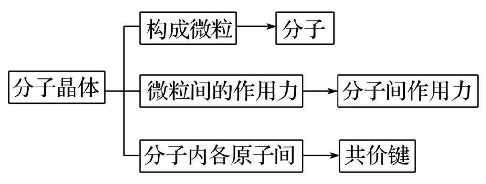

# 【化学】选必二：晶体

## 物质的聚集状态

### 引入

1. 20 世纪前，人们以为分子是所有化学物质能够保持其性质的最小粒子，物质固、液、气三态的相互转化只是分子间距离发生了变化。 
2. 20 世纪初，通过 X 射线衍射等实验手段，发现许多常见的晶体中并无分子，如氯化钠、石墨、二氧化硅、金刚石以及各种金属等。 
3. 气态和液态物质不一定都是由分子构成。如等离子体是由**电子**、**阳离子**和**电中性粒子（分子或原子）**组成的整体上**呈电中性**的**气态物质**；**离子液体**是熔点不高的仅由离子组成的液体物质。
4. 其他物质聚集状态，如晶态、非晶态、塑晶态、液晶态等。

### 基础分类及定义

#### 晶体

【定义】内部微粒在三维空间里呈**周期性有序排列**，而构成的具有**规则几何外形**的固体。例如：冰、碘、硫、硫酸铜等。

【分类】离子晶体、分子晶体、原子晶体（共价晶体）、金属晶体。

#### 非晶体

【定义】内部微粒排列呈**相对无序**状态，**不具有规则几何外形**的固体。例如：玻璃、橡胶、松香等。

## 晶体的特点

### 自范性

#### 定义

在适宜的条件下，晶体能够自发地呈现封闭的、规则的几何多面体外形，这称为晶体的自范性。例如：石英。

> 注意：「自发」不代表一定会发生，**仍需要一定的条件**。

#### 形成条件

晶体生长的速率适当。

熔融态物质冷却凝固，有时得到晶体，但凝固速率过快，常常只得到看不到多面体外形的粉末或没有规则外形的块状物。水晶球是岩浆里熔融态的 $\ce{SiO2}$ 侵入地壳内的空洞冷却形成的。剖开水晶球，它的外层是看不到晶体外形的玛瑙，内层才是呈现晶体外形的水晶。不同的是，玛瑙是熔融态 $\ce{SiO2}$ 快速冷却形成的，而水晶则是熔融态 $\ce{SiO2}$ 缓慢冷却形成的。

#### 本质原因

**晶体的自范性是晶体中原子、分子和离子等微粒在三维空间里呈现周期性有序排列的宏观表现**。相反，非晶体中微粒的排列则相对无序，因而无自范性。

例如：自然界中存在的各种石英晶体（晶体 $\ce{SiO2}$），它们几乎都具有对称的六角形棱柱状的外形，而玻璃、玛瑙（非晶体 $\ce{SiO2}$）等就没有天然的、有规则地外形，如下图所示。

### 各向异性

晶体内部微粒地排列呈现周期性，而不同方向上地微粒排列情况是不同地。因此，在晶体中，不同的方向上具有不同的物理性质，如导电性、导热性、硬度，解离性等，这就称为晶体的各向异性。

例如：石墨在与层平行的方向上的电导率数值约为在与层垂直的方向上的电导率数值的一万倍。云母晶体各个方向解离性不同，若沿两层平面的平行方向施加外力就容易解离，若沿着垂直于平面的方向剥离就困难得多。非晶体在各个方向上的物理性质都一致，显各向同性。例如：玻璃的折光率、热膨胀系数等，一般不随测定的方向而改变。

### 其它特点

晶体有**固定的熔点**；外部和内部质点排列的**高度有序性**。

### 晶体和非晶体的辨别

区分晶体和非晶体的最好方法是 X- 射线衍射。如下图。

## 获得晶体的途径

1. 熔融态物质凝固。
2. 气态物质冷却不经液体直接凝固（凝华）。
3. 溶质从溶液中析出。

## 晶胞

### 概念

描述晶体结构的基本单元。

### 晶胞与晶体的关系

一般来说，晶胞都是平行六面体，整块晶体可以看作是数量巨大的晶胞「无隙并置」而成。

其中，「无隙」是指相邻晶胞之间无任何间隙；「并置」是指所有晶胞都是平行排列的，取向相同。

所有晶胞的形状及其内部的原子种类、个数及几何排列是完全相同的。如下图所示。

### 晶胞中粒子数目的计算——均摊法

若晶胞中某个粒子为 $n$ 个晶胞所共用，则该粒子有 $\dfrac 1 n$ 属于这个晶胞。如下图所示。

举例：

如下图，纳晶胞是体心堆积，单位晶胞有 $8 \times \dfrac 1 8 + 1 = 2$ 个钠原子。配位数为 $8$。

如下图，铜晶胞是面心立方**最密**堆积（每一个面的正中心都有一个原子），特征是 $8$ 个顶点 $+$ 上下左右前后 $6$ 个面的中心均有粒子，单位晶胞有 $8 \times \dfrac 1 8 + 6 \times \dfrac 1 2 = 4$ 个铜原子。配位数为 $12$。

如下图，氯化钠晶胞中氯离子是面心立方**最密**堆积，则单位晶胞有 $8 \times \dfrac 1 8 + 6 \times 1 2 = 4$ 个氯离子，同理钠离子也有 $4$ 个。由图可知，与 $\ce{Na+}$ 最近的 $\ce{Cl-}$ 有 $6$ 个，与 $\ce{Na+}$ 最近的 $\ce{Na+}$ 有 $12$ 个；氯离子同理。$\ce{Na+}$ 位于 $\ce{Cl-}$ 的正八面体的中心。

> 由于化学式中钠离子和氯离子个数之比为 $1:1$，所以单位晶胞中钠离子和氯离子之比**一定也为** $1:1$。即由离子组成的物质，单位晶胞中离子个数比一定等于化学式的离子个数比。

金刚石晶胞中，八个顶点上各有一个碳原子，六个面的中心上各有一个碳原子，剩下四个碳原子遵循「上面一前一后，下面一后一前」存在，但由于实际上中间可以有八个碳原子，所以金刚石晶胞的**空隙利用率**是 $50\%$。当中间出现八个碳原子时，空袭利用率是 $100\%$，此时为 $\ce{CaF2}$ 晶胞。金刚石的各个原子的坐标如下图所示。

碳化硅的结构与金刚石几乎相同，如下。

$\ce{CaF2}$ 晶胞中，每个晶胞含有的 $\ce{Ca^2+}$ 为 $8 \times \dfrac 1 8 + 6 \times 1 2 = 4$ 个，由于 $\ce{CaF2}$ 中 $\ce{Ca^2+}$ 与 $\ce{F-}$ 的化学计量数之比为 $1:2$，所以每个晶胞中含有 $8$ 个 $\ce{F-}$。

下图为六方最密堆积，配位数为 $12$。其中，该晶胞的顶点原子被六个晶胞共用，所以它对每一个晶胞的贡献度只有 $\dfrac 1 6$，所以每个晶胞中有 $12 \times \dfrac 1 6 + 2 \times 1 2 + 3 = 6$ 个原子。若晶胞上的原子为 $\ce{Zn}$ 原子，其底面三角形的边长为 $a \ \pu{nm}$，高 $b \ \pu{nm}$，则其密度 $\rho = \dfrac{6 \times 65}{N_A \times (6 \times \dfrac{\sqrt 3}{4} a^2) \times b} \times 10^{21} \ \pu{g*cm^-3}$。

## 分子晶体

### 概念

只含**分子**的晶体，或者分子间以**分子间作用力**（范德华力、氢键）结合形成的晶体叫做**分子晶体**。

### 粒子及粒子间的相互作用

> 注意：不是所有的分子晶体都含有共价键，例如稀有气体是**单原子分子**，属于分子晶体，但其中**没有共价键**。

### 常见的典型分子晶体

1. 所有的非金属氢化物，如 $\ce{H2O、H2S、NH3、CH4、HX(卤化氢)}$ 等。
2. 部分非金属单质，如 $\ce{X2(卤素单质)、O2、H2、S8、P4、C60}$、稀有气体等。
3. 部分非金属氧化物，如 $\ce{CO2、SO2、NO2、P4O6、P4O10}$ 等。
4. 几乎所有的酸，如 $\ce{H2SO4、HNO3、H3PO4、H2SiO3}$ 等。
5. 绝大多数有机物，如苯、四氯化碳、乙醇、冰醋酸、蔗糖等。

### 物理性质

1. 熔沸点较低，硬度很小：破坏范德华力或氢键较为容易。
2. 多数分子晶体在常温时为气态或液态：高中范围内，常温常压下，除了 $\ce{Hg}$ 和离子液体之外，所有的气体或液体都是分子晶体。
3. 分子晶体不导电。
4. 分子晶体的溶解性一般符合「相似相溶」规律。

### 结构特征

|              |                       分子密堆积                        |                         分子非密堆积                         |
| :----------: | :-----------------------------------------------------: | :----------------------------------------------------------: |
| 微粒间作用力 |                        范德华力                         |                        范德华力和氢键                        |
|   空间特点   | 通常每个分子周围有 $12$ 个紧邻的分子 配位数为 $12$ | 每个分子周围紧邻的分子数 $< 12$，空间利用率不高 配位数 $< 12$ |
|     举例     |         $\ce{C60}$、干冰、$\ce{I2}$、$\ce{O2}$          |                      $\ce{HF、NH3}$、冰                      |

一般而言，结构类似于面心立方最密堆积的晶体是分子密堆积，例如 $\ce{I2}$ 的晶体结构类似于面心立方最密堆积，所以就是分子密堆积，其配位数为 $12$。

一般含有氢键的分子晶体都是分子非密堆积。

常见的分子晶体结构如下图所示（P1 为 $\ce{I2}$ 晶体结构）。

### 常见的分子晶体的结构分析

#### 冰晶体

**结构**

冰晶体中，水分子间主要通过氢键形成晶体。由于氢键具有一定的方向性（所以必须沿着水分子 $\ce{sp^3}$ 杂化的方向形成氢键），一个水分子和周围四个水分子结合，这四个水分子也按照同样的规律再与其他的水分子结合。这样，每个 $\ce{O}$ 原子周围都有四个 $\ce{H}$ 原子，其中两个 $\ce{H}$ 原子与 $\ce{O}$ 原子以共价键结合，另外两个 $\ce{H}$ 原子与 $\ce{O}$ 原子以氢键结合，使水分子间构成四面体骨架结构。其结构可用下图表示。

**性质**

由于氢键具有方向性，冰晶体中水分子未采用密堆积方式，这种堆积方式使冰晶体中水分子的空间利用率不高，留有相当大的空隙。所以当冰刚刚融化成液态水时，水分子间的空隙减小，密度反而增大，超过 $\pu{4^\circ C}$ 时，分子密度距离加大，密度逐渐减小。

#### 干冰

**结构**

固态 $\ce{CO2}$ 称为干冰，干冰也是分子晶体。$\ce{CO2}$ 分子内存在 $\ce{C=O}$ 共价键，分子间存在范德华力，$\ce{CO2}$ 的晶胞呈**类**面心立方体形，立方体的每个顶角有一个 $\ce{CO2}$ 分子，每个面上也有一个 $\ce{CO2}$ 分子。每个 $\ce{CO2}$ 分子与 $12$ 个 $\ce{CO2}$ 分子等距离相邻（在三个互相垂直的平面上各 $4$ 个或互相平行的三层上，每层上各 $4$ 个）。$\ce{CO2}$ 晶胞中 $\ce{CO2}$ 分子有 $4$ 种取向。如下图所示。

**性质**

干冰的外观很像冰，硬度也跟冰相似，熔点却比冰低得多（因为冰有氢键），在常压下极易升华，在工业上广泛用作制冷剂，可用于人工降雨；由于干冰中的 $\ce{CO2}$ 之间只存在范德华力不存在氢键，范德华力不具有方向性，所以其密度比冰的高。

## 共价晶体

### 概念

相邻原子间以**共价键**相结合形成共价键三维骨架结构的晶体。

### 粒子及粒子间的相互作用

> 注意：共价晶体和分子晶体**都有共价键**，二者的区别在于基本粒子聚集时的作用力不同，分子晶体聚集时的作用力是**分子间作用力**，而原子晶体聚集时的作用力是**共价键**。

### 典型的共价键

主要由 $\ce{III A,IV A,V A}$ 族的元素形成，一般相比分子晶体较少，可直接记忆。

1. 某些单质，如硼 $\ce{B}$，硅 $\ce{Si}$，锗 $\ce{Ge}$，灰锡 $\ce{Sn}$、金刚石等。
2. 某些非金属化合物，如金刚砂（碳化硅） $\ce{SiC}$、二氧化硅 $\ce{SiO2}$、氮化硼 $\ce{BN}$、氮化硅 $\ce{Si3N4}$ 等。
3. 极少数的金属氧化物，如刚玉 $\ce{\alpha-Al2O3}$ 等。

> 注意：灰锡是共价晶体，但**白锡不是共价晶体**。

### 物理性质

1. 共价晶体中，由于各原子均以强的共价键相结合，因此一般**熔点很高**（例如金刚石 $\pu{3550^\circ C}$，在高中阶段仅次于石墨），**硬度很大**，**难溶于常见溶剂**，**一般不导电**。
2. 结构相似的共价晶体，**原子半径越小，键长越短，键能越大，晶体的熔点越高**。例如：由于键长 $\ce{C-C < Si-C < Si-Si}$，所以键能 $\ce{C-C > Si-C > Si-Si}$，所以熔点 金刚石 $>$ 金刚砂 $\ce{SiC}$ $>$ 单晶硅。

### 常见的典型共价晶体

#### 金刚石

在金刚石晶体中，每个碳原子周围紧邻的碳原子有 $4$ 个，每个碳原子都采取 $\ce{sp^3}$ 杂化。所有的 $\ce{C-C}$ 键长相等，键角相等，键角为 $109^\circ 28'$。

晶体中，每个碳原子都参与了 $4$ 个 $\ce{C-C}$ 键的形成，而在每个键中的**贡献度只有一半**，故金刚石中 $\pu{1 mol C}$ 原子含 $\ce{C-C}$ 键的数目为 $\ce{2N_A}$。

整块金刚石晶体就是以共价键相连的三维骨架结构。其中最小的环是六元环。如下左图所示。

根据下方右图可知，在金刚石晶胞中碳原子数目为 $\dfrac 1 8 \times 8 + \dfrac 1 2 \times 6 + 4 = 8$。

#### 二氧化硅

在 $\ce{SiO2}$ 晶体中，每个硅原子均与 $4$ 个氧原子结合，每个氧原子与 $2$ 个硅原子结合，在 $\ce{SiO2}$ **晶体**中硅氧原子个数比为 $1:2$，但是**在 $\ce{Si-O}$ 键**中，硅氧原子的个数比为 $1:4$，即 $\pu{1mol}\ \ce{SiO2}$ 中含有的 $\ce{Si-O2}$ 键个数为 $\ce{4N_A}$。**硅原子个数与 $\ce{Si-O}$ 共价键的个数之比为 $1:4$，氧原子个数与 $\ce{Si-O}$ 共价键个数之比为 $1:2$**。

在 $\ce{SiO2}$ 晶体中，每个硅原子形成 $4$ 个共价键，每个氧原子形成 $2$ 个共价键。最小环为十二元环，有 $6$ 个硅原子和 $6$ 个氧原子。如图所示。

