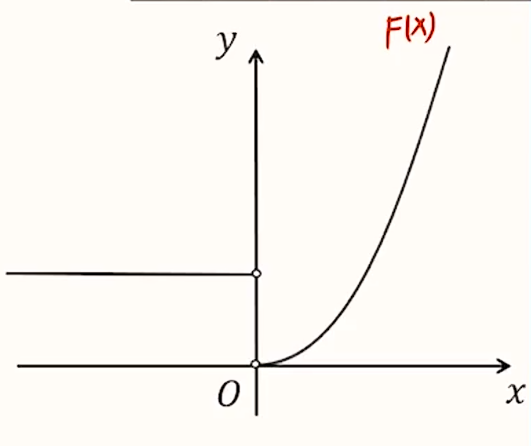

# 【数学】函数

## 概念

【本质】**唯一确定**的**对应**。

【定义】

一般地，设 $A,B$ 是非空的实数集，如果对于集合 $A$ 中的任意一个数 $x$，按照某种确定的对应关系 $f$，在集合 $B$ 中都有唯一确定的数 $y$ 和它对应，那么就称 $f: A\to B$ 为从集合 $A$ 到集合 $B$ 的一个函数，记作
$$
y=f(x),x\in A
$$
其中，$x$ 叫做自变量，$x$ 取值范围 $A$ 叫做函数的**定义域**；与 $x$ 的值相对应的 $y$ 值叫做函数值，函数值的集合 $\{f(x)|x \in A\}$ 叫做函数的值域。

【条件】

1. 对应前后都是数：数集到数集的对应。
2. 任意一个 $x$ 只有唯一确定的 $y$ 与之对应：「一对多」或「多对一」。

> 「一对一」指的是函数中 $x$ 和 $y$ 是**一一对应**的关系。
>
> 「多对一」指的是函数中一个 $x$ 只对应一个 $y$，但一个 $y$ 可能有**多个** $x$ 与之对应。

## 求函数定义域

一般方法：找函数中对**自变量的限制条件**，将其转化为不等式求解定义域。

**常见限制条件**

- 分母不为 $0$：例如在 $\dfrac{1}{x}$ 中，$x \ne 0$。
- **偶次**根号下非负：例如 $\sqrt{x}$ 中，$x \ge 0$。
- $0$ 次方底数不为 $0$：例如 $x^0$ 中，$x \ne 0$。
- 对数后面（真数）大于 $0$：例如 $\log_a x$ 中，$x >0$。
- 正切定义域：例如 $\tan x$ 中，$x \ne \dfrac{\pi}{2} + k\pi,k\in \mathrm{Z}$。

## 判断相同函数

一般方法：**定义域**和**对应法则**均相同。

> 对应法则相同的含义：对于 $\forall x$，都有 $f(x) = g(x)$。

> 注意：相同的函数**值域**也相同。因为当定义域和对应法则相同时，对应的值域也一定相同。

## 求函数值域

### 一般方法

求解方法：

1. 利用函数单调性；
2. 结合图像；
3. 其他情况：转化为 1 2。

> 画函数图像时，需要明确目的。例如求**值域**的函数图像我们只需要知道其**单调性**，即只需要画出开口和对称轴。其他信息可不画。

### 求根式型函数的值域

**只有一个根式**

对于函数中**只有一个根式**的函数，可考虑**换元**。例如 $f(x) = \sqrt{x-2} - 2x + 3$，可考虑令 $t = \sqrt{x-2}$。

一般步骤：

1. 求定义域：求出函数的定义域。
2. 换元：将根式换元，并写出换元后字母的取值范围。
3. 将原函数中其他含有自变量的式子用换元后的字母表示。
4. 将得到的新的函数关系式按照一般方法求解。

> 注意：得到的新的函数是以换元后字母的取值范围为**定义域**求解，而非**原自变量的取值范围**。

> 换元的本质是「升次」，即增加原来的项的次数，所以可以根据函数本身各项的次数推断出换元后函数的类型。例如：$f(x) = \sqrt{x - 2} - 2x +3$ 换元后是一个二次函数。

**含有两个根式**

求解方法：

- 对于函数根号下的自变量 $x$ **互为相反数**的问题，可考虑给函数两边同时平方。此时可转化为**只含一个根号**的函数，可利用只含有一个根式的方法求解，也可先求出根式的取值范围再转化求出函数的取值范围。
- 若函数根号下**不互为相反数**，则求导解决。在此不做赘述。

一般步骤：

1. 求定义域：注意要把题目中隐含的所有对于定义域的不等式全部列出，不要遗漏。
2. 观察函数关系式根据不同情况下的求解方法求解。

### 求分式型函数的值域

求解方法：分离常数（拆分）法。

#### 分离常数具体方法

【方法一】

适用范围：分子分母都为一次（一次比一次）或容易直接配凑拆分。

求解：在分子上凑出分母。

例：
$$
f(x) = \dfrac{2x - 3}{x + 1} = \dfrac{2(x + 1) - 2 - 3}{x + 1} = \dfrac{2(x + 1)}{x + 1} - \dfrac{5}{x + 1} = 2 - \dfrac{5}{x + 1}
$$
然后根据反比例函数图像求解。即：该函数是将 $y = - \dfrac{5}{x}$ 向左平移一个单位，向上平移两个单位得到的函数，则可以画出对应函数图像后求解。

【方法二】

适用范围：分子分母一个二次一个一次（二次比一次或一次比二次）

求解：对分母换元，将分母设为单独的字母 $t$，再将分子中其它字母换成用 $t$ 表示的式子，直接拆分化简即可。

例：

在 $f(x) = \dfrac{2x - 3}{x + 1}$ 中，令 $t = x+1$，则 $x = t - 1$。

所以有：
$$
f(x) = \dfrac{2(t-1)- 3}{t} = \dfrac{2t - 5}{t} = 2 - \dfrac{5}{t}
$$

> 注意：
>
> - 此种方法可不写字母 $t$ 的取值范围，因为 $t$ 在分母上相当于默认 $ t \ne 0$。
> - 对于分母和分子分别是一次和二次的情况，一般谁是一次项谁换元为 $t$。（并不都是把分母换元为 $t$）
> - 对于将分子换元的情况，需要讨论 $t=0$ 的情况。且一般将函数取倒数之后求出倒数的范围，再通过反比例函数转化为对应范围上原函数的值域。

【方法三】

适用范围：分子分母都是二次。

求解：先将分子的二次项拆分，从而转化为 常数 $+$ 一次比二次 的形式，转化为【方法二】求解。

**总结**

$\dfrac{一次}{一次}$：设分母为 $t$，拆分 $\to$ 原式 $= \dfrac{at + b}{t} = a + \dfrac{b}{t}$。

$\dfrac{二次}{一次}$：设分母为 $t$，拆分 $\to$ 原式 $= \dfrac{at ^2 + bt + c}{t} = at + \dfrac{c}{t}+b$。

$\dfrac{一次}{二次}$：设分子为 $t$，拆分 $\to$ 原始 $ = \dfrac{t}{at^2 + bt +c} = \dfrac{1}{\dfrac{at^2+bt + c}{t}} = \dfrac{1}{at + \dfrac{c}{t} + b}$（注意讨论 $t = 0$）。

$\dfrac{二次}{二次}$：拆分 $\to $ 原式 $=$ 常数 $+ \dfrac{一次}{二次}$。

#### 求值域

- 对于得到的新函数只有一个含 $t$ 的代数式，先求化简得到后**反比例函数部分**的值域，再转化为原函数值域。
- 对于新函数中出现形如 $t + \dfrac{a}{t}$ 这样类似于对勾函数的项，可转化为**对勾函数求值域**问题求解。

**对勾函数求值域**

求解思路：画出对勾函数图像，根据基本不等式求解。其中对勾函数在第一象限最低点的横坐标和第三象限最高点的横坐标就是基本不等式的取等条件。

例：求 $f(x) = t + \dfrac{9}{t} +5 $ 的值域。

所以当 $t > 0$ 时，
$$
t + \dfrac{9}{t} \ge 2\sqrt{t \cdot \dfrac{9}{t}} = 6
$$
等号成立 $\iff t = \dfrac{9}{t}$，即 $t = 3$，此时 $t + \dfrac{9}{t} = 6$。

同理，当 $t < 0$ 时，根据对称性可得，$t = -3$，此时 $t + \dfrac{9}{t} = -6$。

所以 $t + \dfrac{9}{t} \ge 6$ 或 $t + \dfrac{9}{t} \le - 6$。那么 $f(x)$ 的值域范围是 $(- \infty,-1] \cup [11,+\infty)$。

> 小结论：对于自变量 $x$ 没有范围，且分子分母都是一次的分式，设其一次项系数之比为 $a$，则函数值域是 $y \ne a$。

## 函数概念的深入理解

**一个题型**

对于「存在函数 $f(x)$ 满足，对任意 $x \in \mathrm{R}$ 都有 $f(t) =k$」类型的问题，其中 $t$ 和 $k$ 是有关自变量的表达式。实际上相当于问是否有一个函数使得 $t$ 和 $k $ 是一一对应的关系，即已知 $t$ 时，$k$ 的值是否唯一确定。

**范围类问题**

求解：求解范围类问题的一个一般方法是转化成函数求解。

## 单调性（增减性）

### 定义

**文字定义**

如果对于定义域 $I$ 内某个区间 $D$ 上的任意两个自变量的值 $x_1,x_2$，当 $x_1 < x_2$ 时，都有 $f(x_1) < f(x_2)$，那么就说函数 $f(x)$ 在区间 $D$ 上是增函数。即：$x_1 - x_2$ 和 $f(x_1) - f(x_2)$ 同号。

如果对于定义域 $I$ 内某个区间 $D$ 上的任意两个自变量的值 $x_1,x_2$，当 $x_1 > x_2$ 时，都有 $f(x_1) > f(x_2)$，那么就说函数 $f(x)$ 在区间 $D$ 上是减函数。即：$x_1 - x_2$ 和 $f(x_1) - f(x_2)$ 异号。

> 注意：单调区间是定义域的子区间。求单调区间必须先求定义域。

**符号定义**
$$
\begin{array}{}
f(x)~递增 &\iff& \dfrac{f(x_1) - f(x_2)}{x_1 - x_2} > 0\\
f(x)~递减 &\iff& \dfrac{f(x_1) - f(x_2)}{x_1 - x_2} < 0\\
f(x)~递增 &\iff& (x_1 - x_2)[f(x_1) - f(x_2)] > 0\\
f(x)~递减 &\iff& (x_1 - x_2)[f(x_1)-f(x_2)] <0
\end{array}
$$

### 常见函数的单调性

#### 一次函数

一次函数 $f(x) = kx+b$ 单调性取决于一次项系数 $k$ 的正负。

- 当 $k>0$ 时，$f(x)$ 在 $\mathrm{R}$ 上单增。
- 当 $k < 0$ 时，$f(x)$ 在 $R$ 上单减。

#### 二次函数

二次函数 $f(x) = ax^2 + bx + c(a \ne 0)$ 单调性取决于对称轴 $+$ 开口方向。

- 当 $a > 0$ 时，$f(x)$ 在 $\left(- \infty,- \dfrac{b}{2a}\right)$ 上递减，在 $\left(-\dfrac{b}{2a},+\infty\right)$ 上递增。
- 当 $a < 0$ 时，$f(x)$ 在 $\left(-\infty,-\dfrac{b}{2a}\right)$ 上递增，在 $\left(-\dfrac{b}{2a},+\infty\right)$ 上递减。

#### 反比例函数

反比例函数 $f(x) = \dfrac{k}{x}(k \ne 0)$ 单调性取决于 $k$ 的正负。

- 当 $k > 0$ 时，$f(x)$ 在 $(-\infty,0)$ 和 $(0,+\infty)$ 上递减。
- 当 $k < 0$ 时，$f(x)$ 在 $(-\infty,0)$ 和 $(0,+\infty)$ 上递增。

#### 根号函数

根号函数 $f(x) = \sqrt{x}$ 在 $[0,+\infty)$ 上递增。（如下图）

#### 幂函数

幂函数 $f(x) = x^n,n \in \mathrm{N^*}$ 的单调性取决于 $n$ 的奇偶性。

- 当 $n$ 为正奇数时，$f(x)$ 在 $R$ 上单调递增。
- 当 $n$ 为正偶数时，$f(x)$ 在 $(-\infty,0)$ 上递减，在 $(0,+\infty)$ 上递增。

#### 指数函数

指数函数 $f(x) = a^x(a > 0 ~且 ~a \ne 1)$ 的单调性取决于 $a$ 的取值范围。

- 当 $a > 1 $ 时，$f(x)$ 在 $\mathrm{R}$ 上递增。（下方图一）
- 当 $0 < a <1$ 时，$f(x)$ 在 $\mathrm{R}$ 上递减。（下方图二）

#### 对数函数

对数函数 $f(x) = \log_a x(a > 0~ 且~ a\ne1)$ 的单调性取决于 $a$ 的范围。

- 当 $a > 1$ 时，$f(x)$ 在 $(0 , +\infty)$ 上递增。（下方图一）
- 当 $0 < a <1$ 时，$f(x)$ 在 $(0 , +\infty)$ 上递减。（下方图二）

### 判断方法

#### 定义法

任取定义域内的 $x_1 < x_2$，计算并判断 $f(x_1) - f(x_2)$ 的正负。

#### 单调性的运算性质

**性质一**
$$
\begin{array}{}
f(x) + a(a~ 为常数) &\ce{<->[单调性相同]}& f(x)\\
af(x)(a > 0) &\ce{<->[单调性相同]}& f(x)\\
af(x)(a < 0) &\ce{<->[单调性相反]}& f(x)
\end{array}
$$
**性质二**

- 增函数 $+$ 增函数 $=$ 增函数。

- 减函数 $+ $ 减函数 $= $ 减函数。

> 注意：函数相减可转化为函数相加。

**性质三**

若 $f(x),g(x) > 0$，$f(x),g(x)$ 均为增（减）函数，则 $f(x)\cdot g(x)$ 是增（减）函数。

> 注意：增 $\times$ 增不一定结果增函数。

#### 复合函数同增异减

对于函数 $y = f(g(x))$：

- 当 $f(x)$ 与 $g(x)$ 增减性相同时，$y = f(g(x))$ 为增函数。
- 当 $f(x)$ 与 $g(x)$ 增减性相反时，$y = f(g(x))$ 为减函数。

步骤：

1. 求定义域：求出原函数的定义域。
2. 拆分：将原函数拆分成几个较为简单的函数。
3. 判断：最后根据拆分得到的每个函数的增减性得到原函数的增减性。

#### 求导

将在导数部分介绍。

#### 分段函数单调性

问题模型：给定某分段函数单调递增/递减，求参数的取值范围。

要求：

1. 每一段的增减性相同（均单增/单减）。 
2. 分段处，前一段的纵坐标 $\le$ 后一段纵坐标（单增）或前一段纵坐标 $\ge$ 后一段纵坐标（单减）。

求解步骤：

1. 根据每一段函数需要满足的要求建立所求参数的不等式。
2. 根据分段处需要满足的要求建立所求参数不等式。
3. 解每一个不等式求**交集**得到所求参数的取值范围。

### 应用

#### 处理含 $f$ 的不等式或方程

问题模型：题目中有关于形如 $f_k > f_t$ 等含有 $f$ 的不等式或方程，一般需考虑利用函数单调性求解。

求解：

- 若 $f(x)$ 递增，则：
  $$
  f(a) > f(b) \iff a > b\\
  f(a) < f(b) \iff a < b\\
  f(a) = f(b) \iff a = b
  $$

- 若 $f(x)$ 递减，则：
  $$
  f(a) > f(b) \iff a < b\\
  f(a) < f(b) \iff a > b\\
  f(a) = f(b) \iff a = b
  $$

例题：

函数 $f(x)$ 是定义在 $\mathrm{R}$ 上的单调函数，$f(f(x) - x + 1) = 1$，则 $f(3)$ 是多少。

由 $f(f(x) - x + 1) = 1$ 且原函数是单调函数，可知：$f(x) - x + 1$ 是常数。

> 证明：
>
> 反证法。
>
> 若 $f(x) - x + 1$ 不是常数，则可设存在两个 $x \in \mathrm{R}$ 使得 $f(x) - x + 1 = a$ 或 $f(x) - x + 1 = b$，代入题目原式得 $f(a) = 1$ 且 $f(b) = 1$，所以 $f(a) = f(b)$。又由于原函数是单调函数，所以 $a = b$，所以 $f(x) - x +1$ 为定值，与「$f(x) - x + 1$ 不是常数」矛盾。所以 $f(x) - x +1$ 是常数。

所以设 $f(x) - x + 1 = a$，所以 $f(x) = x - 1 + a$，又由「证明」得 $f(a) = 1$，所以 $a - 1 + a = 1$，得到 $a = 1$，代入 $f(3)$ 可得 $f(3) = 3 $。

#### 构造函数比大小

问题模型：需要比较的式子/数**结构相同**时，一般通过构造函数来比较大小。

求解：

1. 将不等式左右两边结构相同的式子中不同的部分设成 $x$，构造函数 $f(x)$ 求解。
2. 如果变量同时出现在左右两边，可以通过代数变形的方式将两变量分开，分居左右两侧，再构造函数。
3. 如果初步构造出的函数未知单调性，也可以通过函数变形使得该函数转化为已知单调性函数求解。

> 代数变形的一般方法：
>
> - 遇到变量同时出现在左右两边，且**以乘积的形式**出现时，可以两边同时除以**两个变量的乘积**，例如 $3^{e-2}\pi$ 和 $3\pi^{e-2}$ 比较大小，等价于 $\dfrac{3^{e-2}}{3}$ 和 $\dfrac{\pi^{e-2}}{\pi}$ 比较大小。
> - 若构造函数未知单调性，可利用性质 $\log_a b = \dfrac{1}{\log_b a}$，例如 $\log_{\pi} e$ 和 $\log_{3} e$ 比较大小，等价于 $\dfrac{1}{\ln \pi}$ 和 $\dfrac{1}{\ln 3}$​ 比较大小。
> - 遇到变量同时出现在左右两边，且**出现指数的形式**时，可以两边同时取对数，例如比较 $a^b$ 和 $b^a$，可以两边取 $\ln$，从而比较 $\ln a^b$ 和 $\ln b^a$ 的大小，从而转化为比较 $b \ln a$ 和 $a \ln b$ 的大小。这样做正确的原因是函数 $y = \ln x$ 是单调递增的，且有性质 $\log_a b^n = n \log_a b$。

## 奇偶性

### 定义

**文字定义**

设函数 $y = f(x)$ 的定义域为 $D$，如果对 $D$ 内任意一个 $x$，都有 $-x \in D$，且 $f(-x) = -f(x)$，则这个函数叫做**奇函数**。

设函数 $y = f(x)$ 的定义域为 $D$，如果对 $D$ 内任意一个 $x$，都有 $-x \in D$，且 $f(-x) = f(x)$​，则这个函数叫做**偶函数**。

> 所以证明一个函数是奇函数，可以证明 $f(-x) = -f(x)$，也可以证明 $f(-x) + f(x) = 0$；证明一个函数是偶函数，可以证明 $f(x) = f(-x)$，也可以证明 $f(-x) - f(x) = 0$。

**图像定义**

奇函数的图像**关于原点对称**（如下方图一），偶函数的图像**关于 $y$ 轴对称**（如下方图二）。

### 常见函数的奇偶性

#### 幂函数

幂函数 $f(x) = x^n,n\in \mathrm{Z}$ 的奇偶性取决于 $n$ 的奇偶性。

- 当 $n$ 为奇数时，该函数为奇函数。
- 当 $n$​ 为偶数时，该函数为偶函数。

#### 绝对值函数

绝对值 $f(x) = |x|$​ 是偶函数。

#### 正弦函数

正弦函数 $f(x) = \sin x$​ 是奇函数。

#### 余弦函数

余弦函数 $f(x) = \cos x$ 是偶函数。

#### 其他函数

- 函数 $f(x) = a^x + a^{-x}(a > 0~且~a \ne 1)$​​ 是偶函数。

- 函数 $f(x) = a^x - a^{-x}(a >0~且~a\ne 1)$ 是奇函数。
- 函数 $f(x) = \dfrac{1}{a^x + 1} - \dfrac{1}{2}(a > 0~且~a \ne 1)$ 是奇函数。
- 函数 $f(x) = \log_a\left(\dfrac{m+x}{m-x}\right)(a >0~且~a\ne 1,m \ne 0)$​ 是奇函数。
- 函数 $f(x) = \log_a(a^{2x} + 1) - x(a > 0~且~a\ne 1)$ 是偶函数。 

#### 反双曲正弦函数

反双曲正弦函数 $f(x) = \ln \left(\sqrt{1 + x^2} + x\right)$​​ 是定义域为 $\mathrm{R}$ 的单调递增的奇函数。

证明：

定义域：根据题意有
$$
\sqrt{1 + x^2} + x > \sqrt{x^2} + x = |x| + x \ge 0
$$
所以
$$
\sqrt{1 + x^2} + x >0 \longrightarrow x \in \mathrm{R}
$$
奇偶性：根据题意有
$$
f(-x) = \ln \left(\sqrt{1 + x^2} - x\right)
$$
将 $\sqrt{1 + x^2} - x$ 进行**分子有理化**得
$$
\begin{aligned}
f(-x) &=\ln\left(\sqrt{1 + x^2} - x\right)\\
& = \ln \dfrac{\left(\sqrt{1 + x^2} - x\right)\left(\sqrt{1 + x^2} + x\right)}{\left(\sqrt{1+x^2} + x\right)}\\
& = \ln \dfrac{1+x^2-x^2}{\sqrt{1+x^2}+x}\\
& = \ln \dfrac{1}{\sqrt{1+x^2}+x}
\end{aligned}
$$
根据 $\log_a \dfrac{1}{n} = -\log_a n$ 得
$$
f(-x) = -\ln\left(\sqrt{1+x^2} +x\right) =-f(x)
$$
单调性：

在 $x\in[0,+\infty)$ 上，令 $t = \sqrt{1 + x^2} + x,y = \ln t$，由于 $t$ 和 $y$ 在 $[0,+\infty)$ 上递增，所以 $f(x)$ 在 $[0, + \infty)$​ 上递增。

根据奇函数的对称性，原函数在定义域 $\mathrm{R}$ 上单调递增。

> 拓展：其变形函数函数 $f(x) = \log_a(\sqrt{1 + b^2x^2} + bx)(a > 0~且~a \ne 1)$ 是奇函数。证明方法同理反双曲正弦函数的证明。

### 判断方法

#### 定义法

步骤：

1. 首先看定义域是否关于原点对称：若不对称，则一定是非奇非偶函数；若对称，去 2。
2. 验证 $f(-x)$ 和 $f(x)$ 的关系：
   - 若 $f(-x) = f(x)$，则是偶函数；
   - 若 $f(-x) = - f(x)$，则是奇函数；
   - 否则，是非奇非偶函数。

> 注意：判断分段函数的奇偶性也可以直接使用定义法，先判断定义域，再判断 $f(-x)$ 和 $f(x)$ 的关系。
>
> 例如：
> $$
> f(x) = 
> \begin{cases}
> x^2 + 3x - 4,&x>0\\
> 0,&x=0\\
> -x^2 + 3x + 4,&x<0
> \end{cases}
> \Longrightarrow
> f(-x) =
> \begin{cases}
> -x^2 - 3x + 4,&x>0\\
> 0,&x=0\\
> x^2 - 3x - 4,&x <0
> \end{cases}
> $$
> 由 $f(x)$ 可得定义域 $x \in \mathrm{R}$，计算得到 $f(-x)$，每一段相加得到 $f(x) + f(-x) = 0$，所以 $f(x)$ 是奇函数。

#### 已知奇偶性求参数

- 已知 $f(x)$ 是奇函数求参数：$f(0) = 0,f(a) + f(-a) = 0$。
- 已知 $f(x)$ 是偶函数求参数：$f(a) = f(-a)$。

其中 $a$ 是定义域内任意常数。

> 注意：利用 $f(0) = 0$ 时必须保证 $0$ 在定义域内。且利用此方法得到的参数值由于是**必要不充分条件**，所以若计算得到的是两个值，需要代回到函数内验证是否是奇函数。

#### 奇偶性的运算性质

**性质一**

若奇函数 $f(x)$ 的定义域中含有 $0$，则 $f(0) = 0$​。

> 若已知某个函数是奇函数，求函数中某参数的值，可以利用 $f(0) = 0$ 求出。

**性质二**

对于**多项式函数** $f(x) = a_n x^n + a_{n-1} x^{n-1} + \cdots + a_1 x + a_0$​：

- 若 $f(x)$ 为奇函数，则 $f(x)$ 不含偶次项（包括常数项）。
- 若 $f(x)$ 为偶函数，则 $f(x)$ 不含奇次项。

> 注意：指数函数、对数函数、分段函数等均不属于多项式函数。

**性质三**

函数 $cf(x)$ 与 $f(x)$ 的奇偶性相同（$c$​ 是非零常数）。

**性质四**

- 奇函数 $\pm$ 奇函数 $=$ 奇函数。
- 偶函数 $\pm$ 偶函数 $=$​ 偶函数。
- （非零）奇函数 $\pm$ （非零）偶函数 $=$ 非奇非偶函数。
- 奇函数 $\times $ 奇函数 $=$ 偶函数。
- 偶函数 $\times$ 偶函数 $= $ 偶函数。
- 奇函数 $\times$ 偶函数 $=$ 奇函数。

### 应用

#### 奇偶性的作用

正负转换：即已知 $x<0$ 或 $x>0$ 其中一边的信息，可直接复制出另一边的信息。

命题规律：给定 $x < 0$ 或 $x > 0$ 其中一边的信息，求另一边的信息。注意不要将求另一边的内容直接代入到给定的一边。

例：已知 $f(x)$ 是奇函数 ，$g(x)$ 是偶函数，且 $f(x) - g(x) = e^x$，则 $\dfrac{f(1)}{g(1)}$ 的值是多少。

分别令 $x = 1$ 和 $x = -1$ ，并根据函数奇偶性得：
$$
\begin{cases}
f(1) - g(1) = e&(1)\\
f(-1) - g(-1) = e^{-1} \iff -f(1) - g(1) = \dfrac{1}{e} \iff f(1) + g(1) = - \dfrac{1}{e}&(2)
\end{cases}
$$
$(1) + (2)$ 得：
$$
2f(1) = e - \dfrac{1}{e} ~~~~~~~ (3)
$$
$(2) - (1)$ 得：
$$
2g(1) = -\dfrac{1}{e} - e~~~~(4)
$$
$\dfrac{(3)}{(4)}$ 得：
$$
\dfrac{f(1)}{g(1)} = \dfrac{e - \dfrac{1}{e}}{-\dfrac{1}{e} - e} = \dfrac{e^2-1}{-1 - e^2} = \dfrac{1-e^2}{1+e^2}
$$

#### 偶函数 $+$ 单调性

若 $f(x)$ 为定义在 $\mathrm{R}$ 上的偶函数，且 $f(a) > f(b)$。

- 当 $f(x)$ 开口向上（如下方图一），即 $f(x)$ 在 $[0,+\infty)$ 上递增时，有
  $$
  f(a) > f(b) \iff |a| > |b|
  $$

- 当 $f(x)$ 开口向下（如下方图二），即 $f(x)$ 在 $[0,+\infty)$ 上递减时，有
  $$
  f(a) > f(b) \iff |a| < |b|
  $$

#### 奇函数 $+$ 单调性

若 $f(x)$ 为定义在 $\mathrm{R}$ 上的奇函数，且 $f(a) + f(b) > 0$，则：

- 当 $f(x)$ 递增时，有
  $$
  f(a) + f(b) > 0 \iff a + b > 0
  $$

- 当 $f(x)$ 递减时，有
  $$
  f(a) + f(b) > 0 \iff a + b < 0
  $$

> 注意：
>
> - 若题目中遇到 $f(a) + f(b)$ 型的式子，可以考虑验证 $f(x)$ 是否为奇函数，若是，则可直接求出其单调性求解。
> - 若题目中给定的函数 $f(x)$ 定义域不是 $\mathrm{R}$，则需要代数式 $f(a) + f(b)$ 中的 $a$ 和 $b$ 都满足定义域。

#### 奇偶性 $+$ 单调性

根据题意画出图像求解问题。

> 注意：画图时需要根据题目要求思考画图需要表示的点再求解。

#### 利用奇函数解决最值问题

若函数 $f(x)$ 是奇函数，则 $f(x)_{\max} + f(x)_{\min} = 0$。

例（2012 全国，文 16）：设函数 $f(x) = \dfrac{(x+1)^2 + \sin x}{x^2 + 1}$ 的最大值为 $M$，最小值为 $m$，则 $M+m =~ ?$。

由于
$$
f(x) = \dfrac{(x+1)^2 + \sin x}{x^2 + 1} = \dfrac{x^2 + 1 +2x + \sin x}{x^2 + 1} = 1 + \dfrac{2x + \sin x}{x^2 + 1}
$$
其中 $y=2x$ 和 $y = \sin x$ 是奇函数，所以两者相加也是奇函数，又因为 $y = x^2 + 1$ 是偶函数，所以奇函数除以偶函数得到的 $f(x)-1$ 是奇函数。

所以令 $t = f(x) -1$，则 $t_{\max} + t_{\min} = 0$，所以 $f(x)_{\max} + f(x)_{\min} = t_{\max} + t_{\min} + 2 = 2$。

> 拓展：
>
> 此题也可以直接把 $f(x)$ 当作中心对称函数来看待，对称中心是 $(0,1)$。从而利用「对称性 - 应用 - 求和 - 中心对称」中的解题技巧求解。

## 对称性 

### 轴对称—— $f(x)$ 关于 $x = a$ 对称

两种常见的表示方法：

- 可以表示为 $f(a + x) = f(a - x)$。
- 也可以表示为 $f(x) = f(2a - x)$。

本质特征：横坐标之和为定值 $2a$，纵坐标相等。

对称轴：$x = \dfrac{横坐标之和}{2}$。

### 中心对称—— $f(x)$ 关于 $(a,b)$ 对称

两种表示方法：

- $f(a + x) + f(a - x) = 2b$。
- $f(x) + f(2a - x) = 2b$。

本质特征：横坐标之和为定值 $2a$，纵坐标之和为定值 $2b$。

对称中心：$\left(\dfrac{横坐标之和}{2},\dfrac{纵坐标之和}{2}\right)$。

> 结论：
>
> - 当中心对称函数 $f(x)$ 在对称中心 $x = a$ 上有定义，则 $f(x)$ 经过对称中心 $(a,b)$，即 $f(a) = b$
> - 若 $f(x)$ 关于 $x = a$ 或关于 $(a,b)$ 对称，则可以根据 $f(x_0)$ 求出 $f(2a - x_0)$，这两个函数值在坐标轴上对称。

### 应用

#### **求函数值**

问题模型：某函数关于 $x = a$ 或关于 $(a,b)$ 对称，已知 $x < a$ 或 $x > a$ 其中一边的函数解析式，求某个函数值 $f(t)$。

求解：

- 若 $t$ 在已知函数的一边，则 $f(t)$ 直接代入给定函数解析式求解。
- 若 $t$ 在对称中心（$t=a$）上，则 $f(t) = b$。
- 若 $t$ 在未知函数的一边，则 $f(t)$ 可通过 $$f(a + x) + f(a - x) = 2b$$ 或 $f(x) + f(2a - x) = 2b$ 转化为已知函数的一边求解。

#### **求函数解析式**

**题型一**

问题模型：某函数关于 $x = a$ 或关于 $(a,b)$ 对称，已知 $x < a$ 或 $x > a$ 其中一边的函数解析式，求另一边的函数解析式。

求解：

根据 $f(x) + f(2a - x) = 2b$ 将 $f(x)$ 用 $f(2a- x)$ 表示，即 $f(x) = 2b - f(2a - x)$，再根据 $2a - x$ 在已知定义域的一边从而根据代入题目给定的函数解析式求出 $f(x)$。

**题型二**

问题模型：求解函数 $y = f(x)$ 关于 $x = a$ 或关于 $(a,b)$ 对称的函数。

求解：

- $y = f(x)$ 关于 $x = a$ 对称的函数是 $y = f(2a - x)$。
- $y = f(x)$ 关于 $(a,b)$ 对称的函数是 $y = 2b - f(2a - x)$。

#### 求和

**轴对称**

对于函数 $f(x)$，其对称轴是 $x = a$，那么若 $x_1,x_2,\cdots,x_n$ 两两关于 $a$ 对称，则 $x_1 + x_2 + \cdots + x_n = na$。

> 注意：若题目求解两个对称轴均为 $x = a$ 的函数的交点横坐标之和，依然可以转化为对称性，利用此结论求解。因为两个函数的对称轴都是 $x = a$，那么说明其交点横坐标也是两两关于 $x = a$ 对称的。 

**中心对称**

对于函数 $f(x)$，其对称中心为 $(a,b)$，那么若 $(x_1,y_1),(x_2,y_2),\cdots,(x_n,y_n)$ 关于 $(a,b)$ 对称，则 $(x_1 + y_1) + (x_2 + y_2) + \cdots + (x_m + y_m) = ma + mb$。

#### 对称性 $+$ 单调性解不等式

**中心对称**

问题特征：题目中出现 $f + f$ 型不等式。

思路：先考虑奇函数，再考虑中心对称。

求解：考虑不等式移项，再根据对称性将不等式右边变成一个 $f$ 值，最后根据单调性解不等式。

例：已知定义域为 $\mathrm{R}$ 的函数 $f(x)$ 在 $[2,+\infty)$ 上单调递减，且 $f(4 - x) + f(x) = 6$，则使得不等式 $f(x^2 + x) + f(x+1) < 6$ 成立的实数 $x$ 的取值范围是多少。

根据
$$
f(4 - x) + f(x) = 6 \Longrightarrow 6 - f(x) = f(4 - x) \Longrightarrow 6 - f(x+1) = f(3 - x)
$$
从而
$$
f(x^2 + x) + f(x+1) < 6 \Longrightarrow f(x^2 + x) < 6 - f(x+1) \Longrightarrow f(x^2 + x) < f(3 - x)
$$
由题意可得，$f(x)$ 关于 $(2,3)$ 对称，由于其在 $[2,+\infty)$ 上单调递减，所以 $f(x)$ 在 $\mathrm{R}$ 上单调递减。

所以得到 $x^2 + x > 3- x$，解得 $x < -3$ 或 $x > 1$。

**轴对称**

问题特征：题目中出现 $f < f$ 型不等式。

思路：先考虑偶函数，再考虑轴对称。

求解：利用轴对称（关于 $x = a$ 对称）+单调性解不等式 $f(x_1) < f(x_2)$，去掉 $f$ 后转化为 $|x_1 - a|$ 和 $|x_2 - a|$ 的大小关系。

例：已知 $f(x) = e^{|x+1|} + x^2 + 2x$，解不等式：$f(a + 2) < f(2a - 1)$。

由题意得 $y = x^2 +2x$ 和 $y = e^{|x+1|}$ 均关于 $x = -1$ 对称。

> 证明：
>
> $y = x^2 + 2x$ 直接依照二次函数单调性，不做赘述。
>
> 对于 $g(x) = e^{|x|}$，向左平移一个单位会得到 $y = e^{|x+1|}$。
>
> 由于 $g(x) = e^{|x|}$ 是偶函数（$f(x) = f(-x)$），所以 $f(x)$ 关于 $x = -1$ 对称。

单调性：当 $x \ge -1$ 时，$f(x)$ 单调递增，所以 $f(x)$ 在 $\mathrm{R}$ 上单调递增。

所以
$$
f(a + 2) < f(2a - 1) \Longrightarrow |a+1-(-1)| < |2a - 1 - (-1)| \Longrightarrow (a+3)^2 < (2a)^2 \Longrightarrow a<-1~或~a>3
$$

> 注意：若两个函数的对称轴相同，则他们相加的对称轴也相等，等于两个原函数对称轴。

**总结**

- $f > f$ 且 $f$ 递增或递减：直接去掉 $f$。
- $f > f$ 且 $f$ 有增有减：考虑 $f(x)$ 是偶函数或轴对称。
- $f + f > a$：考虑 $f(x)$ 是奇函数或中心对称函数。

### 三次函数的对称性

问题模型：给定函数 $f(x)$，问其是否是中心对称图形，若是，写出对应对称中心。

#### 思路一

问题转化为：

是否 $\exists ~(a,b)$，使得 $f(a + x) + f(a - x) = 2b$ 对 $\forall x \in \mathrm{R}$ 成立。

将等式 $f(a + x) + f(a - x) = 2b$ 中各种函数值用题目已知函数解析式 $f(x)$ 替换并化简。

再根据恒成立问题的一般步骤「原式关于哪个字母恒成立，就整理成关于这个字母的式子」将化简后的式子整理成关于 $x$ 的式子。

最后让系数等于 $0$ 解出对称中心 $(a,b)$。

> 常见公式：
> $$
> (x \pm y)^3 = x^3 \pm 3x^2y + 3xy^2 \pm y^3
> $$

#### 思路二

性质：任何一个中心对称的函数可以平移得到某个奇函数。

求解：根据此性质可以考虑将原函数变形从而观察出将其平移成奇函数的平移方法，从而得到其对称中心。

例：
$$
\begin{aligned}
f(x) &= x^3 + 3 x^2 - 6x + 1\\
&=(x^3 + 3x^2 + 3x + 1) - 9x\\
&= (x+1)^3 -9(x+1) + 9
\end{aligned}
$$
所以可知，$f(x)$ 是由奇函数 $g(x) = x^3 - 9x$ 向左平移 $1$ 个单位，向上平移 $9$ 个单位得到。

所以 $f(x)$ 关于 $(-1,9)$ 对称。

#### 结论

对于任意**三次函数** $f(x) = ax^3 + bx^2 + cx + d(a \ne 0)$ 的图像是**中心对称**图形，其对称中心是 $\left(-\dfrac{b}{3a},f\left(-\dfrac{b}{3a}\right)\right)$。

## 周期性

### 定义

对于函数 $f(x)$，如果存在一个非零常数 $T$，使得定义域内的每一个 $x$ 都满足 $f(x + T) = f(x)$，那么这个函数 $f(x)$ 就叫做**周期函数**，非零常数 $T$ 叫做这个函数的**周期**。

### 作用

当我们知道了函数 $f(x)$ 一个周期的信息，就可以知道**整个定义域**内的信息。

即，若 $T$ 为 $f(x)$ 的周期，则 $f(x) = f(x + kT),k\in \mathrm{Z}$。

### 应用

#### 给出周期性的其他方式

**方式一**

若 $f(x)$ 满足 $f(x + a) = f(x + b)$，则 $f(x)$ 为周期函数，周期 $T=|a - b|$。

本质特征：纵坐标相等，横坐标之差为定值，其中周期 $=$ 横坐标之差。

> 注意与「对称性」里「轴对称」的本质特征区分：
>
> - 轴对称：横坐标之**和**为定值。
> - 周期性：横坐标之**差**为定值。

**方式二——半周期**

若 $f(x)$ 满足 $f(x + T) = - f(x)$，则 $f(x)$ 为周期函数，周期 $= 2T$。

理解：自变量每增加 $T$，$f(x)$ 都变为原来的相反数，所以增加 $2T$，就会变成他本身，即 $f(x) = f(x + 2T)$。

证明：将题目中等式里所有的 $x$ 换成 $x + T$，那么：
$$
f[(x + T) + T] = - f(x + T) \Longrightarrow f(x + 2T) = -[-f(x)] = f(x)
$$
说明半周期的其它等式：
$$
f(x + T) = \dfrac{1}{f(x)}\\
f(x + T) = -\dfrac{1}{f(x)}\\
f(x + T) = a - f(x)\\
f(x + T) = \dfrac{a}{f(x)}(a \ne 0)\\
f(x + T) = -\dfrac{a}{f(x)}(a \ne 0)\\
f(x + T) = -\dfrac{a}{f(x)}(a \ne 0)
$$

> 当题目遇到 $f(k) + f(t) = a$ 型的等式，且此时自变量 $k - t$ 是定值，那么可以函数 $f(x)$ 可能具有周期性。若题目给定的等式并不能直接表示周期，那么就需要考虑是否表示的是半周期。

> 注意与「对称性」里「中心对称」的本质特征区分：
>
> - 中心对称：横坐标之**和**为定值。
> - 周期性：横坐标之**差**为定值。

> 注意：
>
> - 从「半周期」可以推出「周期」，但不能通过「周期」推出「半周期」。即：已知上面的六个等式，可以推出 $f(x)$ 的周期性，并求出其周期；但已知 $f(x)$ 的周期性/周期，不能推出上面六个等式。
> - 已知半周期，就可以根据 $f(x)$ 求出 $f(x + k\times 半周期),k\in \mathrm{Z}$。即半周期的性质要**强于**周期。

**方式三——双重对称性得到周期性**

1. 若函数 $f(x)(x \in \mathrm{R})$ 的图象有两条对称轴 $x = a,x = b(a \ne b)$，则 $f(x)$ 是周期函数，且 $2|b-a|$ 为它的一个周期。
2. 若函数 $f(x)(x \in \mathrm{R})$ 的图象存在两个对称中心 $(a,0),(b,0)(a \ne b)$，则 $f(x)$ 是周期函数，且 $2|b-a|$ 为它的一个周期。
3. 若函数 $f(x)$ 的图象存在对称轴 $x = a$，对称中心 $(b,0)(a \ne b)$，则 $f(x)$ 为周期函数，且 $4|b-a|$ 为它的一个周期。

> 注意：2 和 3 中给定点的纵坐标变为任意常数 $c$ 依然成立。

> 题目中遇到某函数 $f(x + t)$ 是奇函数，有两种处理方法：
>
> - 判断 $f(x + t)$ 由 $f(x)$ 如何变换得到，根据变换推出 $f(x + t)$ 的对称中心；
> - 根据奇函数的定义令 $g(x) = f(x + t)$，可推出 $g(x) + g(-x) = 0$，将 $g(x)$ 用 $f(x + t)$ 替换（即对于 $g(-x)$ 将 $g(x)$ 表达式中的 $x$ 替换为 $-x$ 其他不变）得到有关 $f(x+t)$ 的等式，再根据其性质求解。 

#### 周期 $+$ 偶函数

问题模型：已知函数 $f(x)$ 是偶函数，周期为 $T$。给出函数在**半个周期**内的信息（解析式），求函数在**整个定义域内**的信息。

求解：

- 首先根据已知的半个周期的信息和偶函数，根据偶函数的性质（关于 $y$ 轴对称），推出一个周期的性质。
- 再根据一个周期的性质，推出函数再整个定义域内的信息。

#### 周期 $+$ 奇函数

问题模型：已知函数 $f(x)$ 是奇函数，周期为 $T$。给出函数在**（近似）半个周期**内的信息（解析式），求函数在**整个定义域内**的信息。

求解：

- 首先根据已知的近似半个周期的信息和奇函数，根据偶函数的性质（关于原点对称），推出近似一个周期的性质。
- 再根据一个周期的性质，推出函数在整个定义域内的信息。

> 注意：奇函数与偶函数不同的是：若 $f(x)$ 为周期为 $T$ 的奇函数，且在 $x = \dfrac{kT}{2}$ 处有定义，则 $f\left(\dfrac{kT}{2}\right) = 0,k \in \mathrm{Z}$。所以只需要知道**近似**半个周期的信息，就可以推出整个周期的信息。（即可以不知道半个周期端点）

#### 半周期 $+$ 奇偶性

问题模型：已知函数 $f(x)$ 是奇函数/偶函数，半周期为 $\dfrac{T}{2}$。给出函数在**$\dfrac{1}{4}$ 个周期内**的信息（解析式），求函数在**整个定义域内**的信息。

求解：

- 首先根据函数的奇偶性推出半个周期内的信息（解析式）。
- 再根据半周期的性质，推出整个周期的信息。
- 再根据一个周期的性质，推出函数在整个定义域内的信息。

## 指数运算与对数运算

### 指数运算

#### 定义

$$
a^n =
\begin{matrix}
\underbrace{a\times a\times \cdots \times a} \\ n ~个
\end{matrix}，n \in \mathrm{N^*}\\
a^0 = 1(a \ne 0)\\
a^{-n} = \dfrac{1}{a^n}(a \ne 0)\\
a^{\frac{n}{m}} = \sqrt[m]{a^n}(a > 0,m,n \in \mathrm{N^*},m>1)
$$

#### 性质

**性质一**

- 当 $n$ 为奇数时，$\sqrt[n]{a^n} = a$。
- 当 $n$ 为偶数时，$\sqrt[n]{a^n} = |a|$。

**性质二**
$$
a^r a^s = a^{r+s} (a > 0,r,s \in\mathrm{R})\\
\dfrac{a^r}{a^s} = a^{r-s}(a> 0,r,s \in\mathrm{R})\\
(a^r)^s = a^{rs}(a > 0,r,s \in\mathrm{R})
$$
其中前两条性质用于处理同底，第三条性质是说「多次乘方运算，优先计算指数」。

例如：
$$
125^{\frac{2}{3}} = (5^3)^{\frac{2}{3}} = 5^2 = 25
$$
**性质三**
$$
(ab)^r = a^r b^r(a,b > 0,r \in\mathrm{R})
$$

> 对于分数指数幂运算：可先利用运算性质化简，再利用定义计算。
>
> 对于带根号的运算：可优先考虑将根号转化为指数运算，再计算。

### 对数运算

#### 定义

$$
a^x = N \iff x = \log_a N(a > 0~且~a\ne 1,N > 0)
$$

其中，$a$ 叫做对数的底数，$N$ 叫做对数的真数。

> 两个小结论：
> $$
> \log_a 1 = 0\\
> \log_a a = 1(a > 0~ 且 ~a\ne 1)
> $$

> 两种特殊对数：
> $$
> \lg a = \log_{10} a\\
> \ln a = \log_e a
> $$
> 一般第二个称为「自然对数」，$e \approx 2.7$。

#### 性质

**性质一**

如果 $a > 0$ 且 $a \ne 1,M > 0,N>0$，那么
$$
\log_a MN = \log_a M + \log_a N\\
\log_a\dfrac{M}{N} = \log_a M - \log_a N\\
\log_a M ^n = n \log_a M(n \in \mathrm{R})\\
\log_a M^n = n \log_a M(n \in\mathrm R)\implies \lg \dfrac{1}{a} =- \lg a\\
\log_{a^n} M = \dfrac{1}{n} \log_a M \implies \log_{\frac{1}{a}} M = -\log_a M
$$
适用范围：

- 前两条性质适用于同底数的对数运算。
- 第三条性质适用于对数里的**真数部分**出现指数的情况。
- 第四条性质适用于对数里的**底数部分**出现指数的情况。

> 注意：涉及到所有性质的 $M$ 和 $N$ **必须为正数**。

**性质二——换底公式**
$$
\log_a b = \dfrac{\log_c b}{\log_c a}(a > 0~且~a\ne 1,b > 0,c > 0~且~c\ne 1)
$$
适用范围：用于处理不同底的对数。

> 一般题目中利用 $e$ 或 $10$ 作为底数换底。

推论：
$$
\dfrac{1}{\log_a b} = \log_b a(a,b > 0,a \ne 1,b\ne 1)
$$
适用范围：对数在分母上，需要对对数取倒数。

**性质三——对数恒等式**
$$
a^{\log_a N} = N (a > 0~且~a\ne 1)
$$
适用范围：当指数上出现对数，可用此公式处理。

> 注意：
>
> - 遇到直接看上去难以直接处理的对数（底数不相等且没有关系），可考虑使用**换底公式**。
> - 将一个对数利用换底公式表示之后，应该将分子分母每一个对数都利用「分解质因数」拆成不可拆分的形式，有利于后续计算。
>
> 例如：设 $a = \log_3 6,b = \log_5 20$，则 $\log_2 15$ 如何用 $a$ 和 $b$ 表示。
>
> 求解：
>
> 根据题意有
> $$
> a = \dfrac{\ln 6}{\ln 3} = \dfrac{\ln 3 + \ln 2}{\ln 3} = 1 + \dfrac{\ln 2}{\ln 3} \Longrightarrow \dfrac{\ln 2}{\ln 3} = a - 1\\
> b = \dfrac{\ln 20}{\ln 5} = \dfrac{\ln 2 + \ln 2 + \ln 5}{\ln 5} = \dfrac{2\ln 2}{\ln 5}+ 1 \Longrightarrow \dfrac{\ln 2}{\ln 5} = \dfrac{b-1}{2}
> $$
> 所以
> $$
> \log_2 15 = \dfrac{\ln 15}{\ln 2} = \dfrac{\ln 3}{\ln 2} + \dfrac{\ln 5}{\ln 2} = \dfrac{1}{a - 1} + \dfrac{2}{b - 1} = \dfrac{2a + b -3}{(a-1)(b-1)}
> $$

### 指对运算比较大小

#### 原理

利用「指对函数的增减性」，即：

- 当 $a > 1$ 时，$y = a^x$ 递增，$y = \log_{a} x$ 递增。
- 当 $0 < a < 1$ 时，$ y = a^x$ 递减，$y = \log_a x$​ 递减。

#### 方法一——同底数/指数比较大小

适用范围：同底数或同指数。

同底数：直接根据对应指对函数单调性比较大小即可。

同指数：先将原式取对数，再根据对应对数函数单调性比较大小。

#### 方法二——借助中间量（常用 $0,1$）比大小

适用范围：直接能看出需要比较式子与某个常数（一般为 $0$ 或 $1$）的关系。

方法：分别判断需要比较的式子与某个常数（一般为 $0$ 或 $1$​）的大小关系，然后再比较大小。

> 注意：虽然常用 $0,1$，但在有时候无法通过 $0,1$ 判断大小关系的时候，可考虑通过「放缩法」等选用其他中间量来进行大小关系的判断，这一点将在下面的例题中体现。

> 结论——快速判断对数正负：
>
> 将实数集 $\mathrm{R}$ 划分为两个区间 $(0,1)$ 和 $(1,+\infty)$。
>
> 对于对数 $\log_a N$：
>
> - 若 $a,N$ 属于同一个区间，则 $\log_a N > 0$。
> - 若 $a,N$ 不属于同一个区间，则 $\log_a N <0$​。

>一些运算技巧：
>$$
>\log_{\frac{1}{n}}{\frac{1}{m}} = \log_{n^{-1}}m^{-1} = \log_n m
>$$
>

例 1（2020 全国 3 文）设 $a = \log_3 2,b = \log_5 3,c = \dfrac{2}{3}$，则 $a,b,c$ 的大小关系是什么。

求解：
$$
\dfrac 3 2 a = \dfrac 3 2\log_3 2 =\log_{3^2}2^3 = \log_9 8 <1 \implies a < \dfrac 2 3\\
\dfrac 3 2 b = \dfrac 3 2\log_5 3 = \log_{5^2}3^3 = \log_{25} 27 > 1 \implies  b > \dfrac 2 3
$$
所以 $ b > c > a$。

> 有关此题的一些总结：
>
> 这道题就是使用非 $0,1$ 中间量的一个体现。主要采用的是「放缩法」，即对需要比较的量同时乘上一个数 $k$，然后再比较新的数与 $1$ 的关系，根据此可以比较出原数与 $\dfrac{1}{k}$ 的关系，此时 $\dfrac{1}{k}$ 即为中间量。
>
> 选用 $\dfrac{2}{3}$ 作为中间量的原因：我们可以发现需要比较的 $c$ 本身就是 $\dfrac{2}{3}$，所以选用 $\dfrac{2}{3}$ 就是把问题转化为直接比较 $a,b$ 和 $c$ 的大小关系。所以一种可能的中间量的选用策略是直接以需要比较的对象为中间量。

---

例 2（2020 全国 3 理）已知 $5^5 < 8^4,13^4 < 8^5$。设 $a = \log_5 3,b = \log_8 5,c = \log_{13} 8$，则 $a,b,c$​ 的大小关系是什么。

求解：
$$
\dfrac 4 3 a = \dfrac 4 3 \log_5 3 = \log_{5^3}{3^4} = \log_{125}81 < 1 \implies a < \dfrac 3 4\\
\dfrac 4 3 b = \dfrac 4 3 \log_8 5 = \log_{8^3}{5^4} = \log_{512}625 > 1 \implies b > \dfrac 3 4\\
\dfrac 5 4 b = \dfrac 5 4 \log_8 5 = \log_{8^4}{5^5} <1 \implies b < \dfrac 4 5\\
\dfrac 5 4 c = \dfrac 4 5 \log_{13}8 = \log_{13^4}{8^5} >1 \implies c > \dfrac 4 5
$$
据此可知 $a < b < c$。

> 关于此题的一些总结：
>
> 这道题比较三个数，选用了两个中间量，选用 $\dfrac{5}{4}$ 可以直接根据题目给定的信息 $5^5 < 8^4,13^4 < 8^5$ 猜测到。
>
> 发现遇到的两个题涉及到的非 $0,1$ 物理量都是分数，并且分子 $= $ 分母 $+1$，这有可能是一个选择中间量的策略，即选择 $\dfrac{n}{n-1}$ 作为中间量进行比较大小。

#### 方法三——底数真数均不相同的对数比较大小

考虑将指数/底数其中一个变成相同的数，然后利用同底数/指数的方法比较大小。

例如：比较 $\log_6 4$ 和 $\log_3 2$ 的大小。

求解：
$$
\log_6 4 = 2\log_6 2 = 2\cdot \dfrac{1}{\log_2 6} = \dfrac{1}{\log_2 \sqrt{6}}\\
\log_3 2 = \dfrac{1}{\log_2 3}
$$
由于 $3 > \sqrt{6}$，所以 $\log_2 3 > \log_2 \sqrt{6}$，所以 $\log_6 4 > \log_3 2$​。

#### 方法四——图象法

对于「方程类」或「函数交点类」比较大小问题，可以考虑画出对应函数的图象找对应交点求解。

> 这里的「方程类」比较大小问题，指的是要比较的数/参数是某个方程的解。
>
> 这里的「函数交点类」比较大小问题，指的是要比较数/参数是某两个函数的交点。

例如：已知实数 $a,b,c$ 满足 $2^a = \log_{\frac{1}{2}} a,\left(\dfrac{1}{2}\right)^b = \log_{\frac{1}{2}}b,\left(\dfrac{1}{2}\right)^c = \log_2 c$，这三个数从小到大排列是什么。

求解：发现题目给定的 $a,b,c$ 无法直接求解得到，且此时需要比较的 $a,b,c$ 恰好是题目给定的三个方程的解或某两个函数的交点，所以考虑画图比较。

发现题目涉及 $y = 2^x,y = \log_{\frac{1}{2}}x,y =\log_2 x,y = \left(\dfrac 1 2\right)^x$ 四个函数，绘制图象如下：

如图所示，可知 $a < b < c$​。

#### 方法五——作差/作商法

对于无法直接借助中间量且无法借助图象比较的题目，可以考虑作差/作商法。

例如：比较 $b = (\lg e)^2$ 和 $c = \lg \sqrt{e}$ 的大小关系。

求解：

方法一——作商法
$$
\dfrac{b}{c} = \dfrac{(\lg e)^2}{\dfrac{1}{2}\lg e} = \dfrac{\lg e}{\dfrac{1}{2}} = 2\lg e = \lg e^2 <1
$$
所以 $ b < c$​。

方法二——作差法
$$
b - c = (\lg e)^2 - \dfrac{1}{2}\lg e =\lg e\left(\lg e - \dfrac{1}{2} \right) = \lg e \cdot \lg \dfrac{e}{\sqrt{10}}
$$
因为 $\dfrac{e}{\sqrt {10}} < 1$，所以 $\lg \dfrac{e}{\sqrt{10}} < 0$，所以 $b < c$​。

#### 比较大小类问题一般步骤

1. 首先考虑估算法。
2. 如果估算法做不出来，看能不能作图，考虑图象法。
3. 图象法做不出来再考虑作差/作商法。

#### 其他

例（2017 全国一卷理）设 $x,y,z$ 为正数，且 $2^x = 3^y = 5^z$，则 $2x,3y,5z$ 的大小关系是什么。

求解：
$$
2^x = 3^y = 5^z \iff \lg 2^x =\lg 3^y = \lg 5^z \iff x \lg 2 = y\lg 3 = z \lg 5
$$
所以
$$
\dfrac{2x}{3y} = \dfrac{2\lg 3}{3\lg 2} = \dfrac{\lg 3^2}{\lg 2^3} = \dfrac{\lg 9 }{\lg 8} > 1 \Longrightarrow 2x>3y
$$
同理可得 $2x < 5z$，所以 $5z > 2x > 3y$。

> 对于此类问题的解法可以考虑对其「代数结构」分析，例如此题需要比较的 $x,y,z$​​ 都不在指数上，而题目已知条件都在指数上，所以可以考虑取对数求解。

## 指数函数与对数函数

### 指数函数

#### 定义

一般地，函数 $y = a^x(a > 0~且~ a \ne 1)$ 叫做指数函数，其中指数 $x$ 是自变量，定义域是 $\mathrm{R}$。

#### 图象

当 $0 < a <1$ 时：

当 $a > 1$ 时：

#### 性质

【单调性】

- 当 $0 < a < 1$ 时，单调递减。
- 当 $a > 1$ 时，单调递增。

【值域】$(0,+\infty)$

【奇偶性】非奇非偶函数。

【渐近线】$x$ 轴（$y=0$）

【定点】过定点 $(0,1)$，即 $x = 0$ 时，$y=1$。

#### 考法

**过定点问题**

问题模型：给定一个指数型函数 $f(x)$，问其过哪个定点。

求解：令指数为 $0$，解得 $x$ 和 $y$。

本质：找定点相当于找到一个合适的 $x$ 将参数消去。

**做指数型函数的图象**

问题模型：给定一个指数型函数，求其图象。

关键点：画出三要素：定点、单调性、渐近线。

求解：判断给定的指数型函数是由哪个指数函数变换得到，根据变换画出指数型函数的对应信息。

**比较大小**

问题模型：给定若干指数函数 $y = a^x,y = b^x,\cdots$ 的图象，问底数 $a,b,\cdots$ 的大小关系。

求解：令 $x = 1$，在图中标注出 $x = 1$ 的图象，根据图象与指数函数图象交点判断 $a,b,\cdots$ 的大小关系。

### 对数函数

#### 定义

一般地，函数 $y = \log_a x(a > 0~且~a\ne 1)$ 叫做对数函数，其中 $x$ 是自变量，定义域是 $(0,+\infty)$。

#### 图象

当 $0 < a < 1$ 时：

当 $a > 1$ 时：

#### 性质

【单调性】

- 当 $0< a <1$ 时，单调递减。
- 当 $a > 1$ 时，单调递增。

【值域】$\mathrm{R}$

【奇偶性】非奇非偶函数。

【渐近线】$y$ 轴（$x = 0$）

【定点】过定点 $(1,0)$，即 $x = 1$ 时，$y = 0$。

#### 考法

**过定点问题**

问题模型：给定一个对数型函数 $f(x)$，问其过哪个定点。

求解：令真数为 $0$，解得 $x$ 和 $y$。

本质：找定点相当于找到一个合适的 $x$ 将参数消去。

**做指数型函数的图象**

问题模型：给定一个对数型函数，求其图象。

关键点：画出三要素：定点、单调性、渐近线。

求解：判断给定的对数型函数是由哪个对数函数变换得到，根据变换画出对数型函数的对应信息。

**比较大小**

问题模型：给定若干对数函数 $y = \log_a x,y = \log_b x,\cdots$ 的图象，问底数 $a,b,\cdots$ 的大小关系。

求解：令 $y = 1$，在图中标注出 $y = 1$ 的图象，根据图象与对数函数图象交点判断 $a,b,\cdots$ 的大小关系。

### 应用

### 指对型复合函数

#### 复合方式

- $ f(x) = \log_{a} g(x),f(x) = a^{g(x)}$。
- $ f(x) = f(a^x),f(x) = f(\log_a x)$，可通过观察题目给定的指数的底数之间有什么关系，通过换元识别。

#### 研究复合函数的性质

- 定义域/奇偶性：直接研究（直接根据定义找到题目的限制条件，然后看 $f(x)$ 和 $f(-x)$ 的关系）。
- 值域：先确定复合方式，再逐层研究。
- 单调性：利用运算性质或复合函数或求导。

### 指对型分段函数

研究思路：分段研究。

#### 求单调性

**方法一——数形结合法**

画出对应函数图象，观察图象，通过数形结合的方法求解。

例：已知 $f(x) = \begin{cases}2^{-x},x \le 0\\1,x > 0\end{cases}$，则满足 $f(x + 1) < f(2x)$ 的 $x$ 的取值范围是什么。

求解：

根据题意可绘制图象如下：

根据图象有：
$$
2x < x + 1 \le 0~或~2x < 0 < x + 1 \implies x \in (-\infty,0)
$$
**方法二——代数法**

例 1：同方法一中例题。

求解：由题意可得
$$
f(x+1) = 
\begin{cases}
2^{-(x+1)},x +1 \le 0\\
1,x+1 > 0
\end{cases}
=
\begin{cases}
2^{-x-1},x \le -1\\
1,x>-1
\end{cases}\\
f(2x) = 
\begin{cases}
2^{-2x},2x \le 0\\
1,2x > 0
\end{cases}
=
\begin{cases}
2^{-2x},x \le 0\\
1,x>0
\end{cases}
$$
所以：
$$
\begin{cases}
x \le -1\\
2^{-x-1}<2^{-2x}
\end{cases}
~或~
\begin{cases}
-1 \le x \le 0\\
1 < 2^{-2x}
\end{cases}
~或~
\begin{cases}
x > 0\\
1 < 1
\end{cases}
$$
解得 $x \in (-\infty,0)$。

### 指对函数实战演练

#### 解题技巧

1. 题目中遇到一个函数时，可以首先判断它的各种性质，有利于解题。
2. 题目已知形如 $\dfrac{f(x_1) - f(x_2)}{x_1 - x_2} > a$  的式子一般是为了说明某个函数增减性。可考虑先去分母，然后将 $x_1,x_2$ 放在不等式两边，观察其表示的是哪个函数增减性，此时需要把所有的 $f(x)$ 都转化为已知单调性的函数。
3. 解对数不等式时，需要考虑定义域。

> 有关第二点的结论：
>
> - 若对 $\forall x_1 \ne x_2$，有 $\dfrac{f(x_1) - f(x_2)}{x_1 - x_2} > a$，则 $g(x) = f(x) - ax$ 单调递增。
> - 若对 $\forall x_1 \ne x_2$，有 $\dfrac{f(x_1) - f(x_2)}{x_1 - x_2} < a$，则 $g(x) = f(x) - ax$ 单调递减。 

#### 例题

例 1：已知 $f(x)$ 的定义域为 $\mathrm{R}$，对于 $x_1 < x_2$，有 $\dfrac{f(x_1) - f(x_2)}{x_1 - x_2} > -1$，且 $f(1)=1$，则不等式 $f(\log_2|3^x - 1|) < 2 - \log_2|3^x - 1|$ 的解集是什么。

求解：由题意可得
$$
\dfrac{f(x_1) - f(x_2)}{x_1 - x_2} > -1 \implies f(x_1) - f(x_2) < -x_1 + x_2 \implies f(x_1) + x_1 < f(x_2) + x_2
$$
令 $g(x) = f(x) + x$，则当 $x_1 < x_2$ 时，$g(x_1) < g(x_2)$，即 $g(x)$ 在 $\mathrm{R}$ 上单调递增。此时 $g(1) = f(1) + 1 = 2$。

所以
$$
\begin{aligned}
&f(\log_2|3^x - 1|) < 2 - \log_2|3^x - 1| \\
\implies & f(\log_2|3^x - 1|) + \log_2|3^x-1| < 2 \\
\implies & g(\log_2|3^x - 1|) < g(1) \\
\implies & \log_2|3^x - 1| < 1\\
\implies &
\begin{cases}
|3^x - 1| > 0\\
|3^x - 1| < 2
\end{cases}\\
\implies & x \in \mathrm{(-\infty,0)\cup (0,1)}
\end{aligned}
$$

---

例 2：已知 $a > 0$ 且 $a \ne 1$，函数 $f(x) = \log_a \left(x + \sqrt{x^2 + b}\right)$ 在 $\mathrm{R}$ 上既是奇函数又是偶函数，则函数 $g(x) = \log_a ||x| - b|$ 的图象是：

求解：

由于 $f(x)$ 是奇函数，所以当 $x = 0$ 时，$f(0) = \log_a \sqrt{b} = 0$，解得 $b = 1$，所以 $g(x) = \log_a ||x| - 1|$。

奇函数在 $[0,+\infty)$ 和 $(-\infty,0]$ 上单调性相同，所以只需要考虑在 $[0,+\infty)$ 上的单调性。

因为 $f(x) = \log_a \left(x + \sqrt{x^2 + 1}\right)$ 相当于由函数 $t = x + \sqrt{x^2 + 1},y = \log_a t$ 复合而成。且 $t =  x + \sqrt{x^2 + 1}$ 单调递增，因为原函数是增函数，所以 $y = \log_a t$ 也单调递增，所以 $a > 1$。

根据选项发现，当 $ x > 1$ 时，函数值 $>0$，当 $0 < x < 1$ 时，函数值 $<0$。所以选 D。

## 函数图像

### 函数图象的变换规律

#### 平移变换

方法：左加右减，上加下减。

用途：可以通过判断某个函数是由哪个已知图象的函数变换得到的，根据变换画出所求函数的函数图象。

#### 对称变换

$$
y = f(x) \ce{->[关于~y~轴对称]} y = f(-x)\\
y = f(x) \ce{->[关于~x~轴对称]} y = -f(x)\\
y = f(x) \ce{->[关于原点对称]} y = -f(-x)
$$

 #### 翻折变换

对 $y$ 加绝对值：

- 函数解析式：$y = f(x) \longrightarrow y = |f(x)|$。
- 图象：$x$ 轴上方保持不变，$x$ 轴下方沿 $x$ 轴翻折到上方。

对 $x$ 加绝对值：

- 函数解析式：$y = f(x) \longrightarrow y = f(|x|)$。
- 图象：$y$ 轴右侧保持不变，$y$ 轴左侧去掉，并把右侧图象沿 $y$ 轴翻折到左侧。

#### 图像变换顺序

当同时遇到多个性质的图象变换时，需要规定顺序。

- 针对 $x$ 的图像变换顺序：与运算顺序相反。例如绘制 $y = \dfrac{1}{|x|-1}$ 的图象，应该先把 $x$ 向右平移一个单位，再加绝对值。
- 针对 $y$ 的图像变换顺序：与运算顺序相同。
- 既有针对 $x$ 的图像变换，又有针对 $y$ 的图像变换：两类变换之间没有先后顺序。

#### 伸缩变换

$$
y = f(x) \ce{->[纵坐标变为原来的~A~倍]} y = Af(x)\\
y = f(x) \ce{->[横坐标变为原来的~\frac{1}{a}]} y = f(ax)
$$

#### 例题

例：$f(x) = \begin{cases}\cos \dfrac{\pi}{2}x,x \le 0\\\log_7x,x>0\end{cases}$ 的图象上关于远点成中心对称的点有几个。

求解：考虑将 $x \le 0$ 的部分关于原点中心对称，然后看新的图象有多少个交点。

将 $f(x) = \cos \dfrac{\pi}{2}x(x\le 0)$ 关于原点对称后，可得到新的函数：
$$
f(x) = 
\begin{cases}
- \cos \dfrac{\pi}{2}x,x \ge 0\\
\log_7x,x >0
\end{cases}
$$
对于 $f(x) = -\cos \dfrac{\pi}{2}x$ 可以考虑采用五点作图法。即当 $\dfrac{\pi}{2} x =0,\dfrac{\pi}{2},\pi,\dfrac{3}{2}\pi,2\pi$ 时，得到 $x = 0,1,2,3,4$ 代入函数解析式中可绘制出 $x \ge 0$ 的图象：

此时 $\log_7 x$ 与该函数下方有一个交点，$x$ 轴上有一个交点。且当 $\log_7 x = 1$ 时，$x = 7$，所以 $\log_7 x$ 与该图象上方有 $3$ 个交点，如图所示：

所以原函数图像上关于原点成中心对称的点有 $5$ 个。

### 图象辨析类问题

#### 方法

解题思路：排除法，即根据函数性质排除掉剩下三个选项，从而选择正确的选项。

一般可以观察四个选项涉及到的不同的性质，再判断对应函数的性质。

常用排除法：①奇偶性；②特殊值；③正负；④定义域；⑤单调性；⑥极限。

**分析极限**

> 下面公式中的 $\to$ 表示无限趋于。

$$
x \to +\infty,x^2 \to +\infty\\
x\to +\infty,\dfrac{1}{x} \to 0\\
x\to +\infty,\dfrac{x}{x^3 + 1}\to 0\\
x \to +\infty,\dfrac{x^2 + 1}{e^x} \to 0
$$

 其中，对于第三条，当 $x \to +\infty$ 时，$x \ll x^3 +1$，所以 $\dfrac{x}{x^3 + 1} \to 0$。 第四条同理。

> 结论：$x \to +\infty$，有 $\ln x < x^n <e^x$，其中 $n \in \mathrm{R^+}$。其中 $\mathrm{R^+}$ 表示正数。

#### 例题

例 1：函数 $y = (2x - 1)e^x$ 的图象大致是（）

解法一：

根据函数解析式得，当 $x < \dfrac{1}{2}$ 时，$f(x) <0$，所以排除 CD。根据增减性求导可知，选 A。

解法二（极限法）：

当 $x\to -\infty$ 时，$2x - 1 \to -\infty$，$e^x = e^{-\infty} = \dfrac{1}{e^{+\infty}}$，其中 $|2x - 1| \ll e^{+\infty}$，所以 $f(x) \to \dfrac{-\infty}{e^{+\infty}} \to 0$，选 A。

---

例 2：函数 $f(x) = (1- \cos x)\sin x$ 在 $[-\pi,\pi]$ 的图象大致为（）

解析：

首先根据奇偶性排除 B。观察发现当 $x$ 为正数且绝对值很小时，A 选项时负数，C 选项为 $< \dfrac{1}{2}$ 的正数，D 选项为 $>\dfrac{1}{2}$ 的正数，代入 $x = \dfrac{\pi}{6}$ 可得选 C。

## 函数零点

### 函数零点存在定理

#### 内容

如果函数 $y = f(x)$ 在区间 $[a,b]$ 上的图象是一条连续不断的曲线，且有 $f(a)f(b) < 0$，那么 $y = f(x)$ 在区间 $(a,b)$ 内至少有一个零点，即存在 $c \in (a,b)$，使得 $f(c) = 0$，这个 $c$ 也就是方程 $f(x) = 0$ 的解。

#### 作用

判断函数 $f(x)$ 有无零点/有几个零点/判断零点所在区间。

具体做法：求出 $f(x)$ 的单调区间，然后根据零点存在性定理和单调区间依次判断每个单调区间上是否有零点。

例：方程 $\left(\dfrac{1}{3}\right)^x = x^{\frac{1}{2}}$ 的解所在的区间是（）

A. $\left(0,\dfrac 1 3\right)$

B. $\left(\dfrac 1 3,\dfrac 1 2\right)$

C. $\left(\dfrac 1 2,\dfrac 2 3\right)$

D. $\left(\dfrac 2 3,1\right)$

---

解析：

首先考虑单调性，根据「减 $+$ 减 $=$ 减」可知，$f(x)$ 在 $[0,+\infty)$ 上单调递减。

然后判断正负：
$$
f(0) = 1 - 0 = 1 > 0\\
f\left(\dfrac{1}{3}\right) = \left(\dfrac{1}{3}\right)^{\frac{1}{3}} - \sqrt{\dfrac{1}{3}} = \left(\dfrac{1}{3}\right)^{\frac{1}{3}} - \left(\dfrac{1}{3}\right)^{\frac{1}{2}} > 0\\
f\left(\dfrac{1}{2}\right) = \left(\dfrac 1 3\right)^{\frac{1}{2}} - \sqrt{\dfrac{1}{2}} = \sqrt{\dfrac{1}{3}} - \sqrt{\dfrac{1}{2}} < 0
$$
所以选 B。

### 处理函数零点的一般方法

1. 将函数转化为对应方程 $=0$ 的解的问题。
2. 首先对于可以直接解出来的方程/可以猜出解的方程 直接解出来求得零点。
3. 对于不能直接解出来的方程，可以考虑将方程变形之后，做对应函数的图象，对应函数交点的横坐标即为所求零点。

> 注意：有些题目变形后，需要做出的对应函数图象是**不确定**的，即「动态函数」，例如 $y = - \dfrac{1}{4}x + a$。这个时候我们可以尽量对原方程变形使得需要做出的「动态函数」尽量水平。即把问题转化为函数 $y = f(x)$ 与水平直线 $y = a$ 相交的问题例如求方程 $2 \sqrt{x} = - \dfrac{1}{4}x + a$ 的根，可以转化为 $y = 2\sqrt{x} - \dfrac{1}{4}x$ 和 $y = a$ 这两个函数的交点。
>
> 原理：当「动态函数」水平时，其对另一个需要作图的函数要求只有两点：
>
> - 单调区间。
> - 单调区间端点处的函数值。

例如：求函数 $f(x) = 2^x + x +1$ 的零点，相当于求方程 $2^x + x + 1 = 0$ 的解。由于该方程不可直接解，那么我们考虑变形画对应函数图象。方程变形得到 $2^x = -x -1 $，考虑绘制 $y = 2^x$ 和 $y = -x - 1$ 的图象如下：

如图所示，交点即为对应零点。

### 例题

例 1：方程 $4 \sin \pi x = \dfrac{2}{1 - x}$ 在 $[-2,4]$ 内根的个数为多少个。

求解：由于该方程不可直接解，考虑变形后绘制函数图象。

变形得到：
$$
2\sin \pi x = \dfrac{1}{1 - x}
$$
则问题可以转化为函数 $y = 2\sin \pi x$ 和 $y = \dfrac{1}{1- x}$ 在区间 $[-2,4]$ 上的交点个数。

首先绘制 $y = 2\sin \pi x$，除了「五点作图法」，这里另外介绍一种方法：

根据函数解析式可知该函数图象与 $y = \sin x$ 形状相同，所以先可绘制对应形状。再根据其最大最小值分别是 $2$ 和 $-2$，周期为 $T = \dfrac{2\pi}{\omega} = 2$，可绘制出对应函数图象：

再根据平移变换绘制出 $y = \dfrac{1}{1 - x}$ 的图象：

发现两个函数图象均关于 $x = 1$ 对称，且所求的区间 $[-2,4]$ 也关于 $x = 1$ 对称，所以 $x = 1$ 右边的交点数的二倍即为整个区间的交点数。

当 $x = \dfrac{3}{2}$ 时，函数 $y = 2 \sin \pi x$ 取到最小值 $-2$，同时函数 $y = \dfrac{1}{1-x}$ 也经过该点，所以 $\left(\dfrac 3 2, - 2\right)$ 是其中一个交点，并根据此可以大致绘制出 $x = 1$ 右侧完整的交点图象如下：

从而可以发现，在 $[1,4]$ 上有 $4$ 个交点，所以在 $[-2,4]$ 上原方程的根的个数为 $8$ 个。

> 注意：这两个函数图象在 $\left(\dfrac 3 2, - 2\right)$ 不可能相切，因为函数 $y = 2\sin \pi x$ 在该点的斜率为 $0$，而函数 $y = \dfrac{1}{1- x}$ 的导数不可能为 $0$，所以这种情况不存在。

---

例 2（2019 年天津卷文）已知函数 $f(x) = \begin{cases}2\sqrt x,0 \le x \le 1\\\dfrac 1 x,x>1\end{cases}$，若关于 $x$ 的方程 $f(x) = -\dfrac 1 4 x + a(a \in \mathrm{R})$ 恰有两个互异的实数解，则 $a$ 的取值范围是多少。

求解：

给定方程可变形为：
$$
f(x) + \dfrac{1}{4} x = a
$$
设
$$
g(x) = f(x) + \dfrac{1}{4}x =
\begin{cases}
2\sqrt{x} + \dfrac{1}{4} x,0 \le x  \le 1\\
\dfrac{1}{x} + \dfrac{1}{4} x,x>1
\end{cases}
$$
所以题目可以转化为 $y = g(x)$ 和 $y = a$ 的交点个数为 $2$ 时，$a$ 的取值范围。

$y = g(x)$ 的图象如图所示：

所以问题可转化为一条水平直线不断平移，何时与上述图象有两个交点。

观察图象可知，$a$ 的取值范围为 $\{1\}\cup\left[\dfrac 5 4,\dfrac 9 4\right]$。

---

例 3：已知函数 $f(x) = \begin{cases}x^2 - ax + 2,x\ge a\\|x+a|,x<a\end{cases}$，若对于任意正数 $x$，关于 $x$ 的方程 $f(x) = k$ 都恰有两个不相等的实数根，则满足条件的实数 $a$ 的个数是多少个。

求解：

题目可以转化为 $f(x)$ 与水平直线 $y=k(k>0)$ 的交点数为 $2$ 时，满足条件的 $a$ 的个数。

可以考虑画图求解。

首先根据分段函数的性质，可以发现当 $a >0$ 和 $a<0$ 时，刚好对应了原函数不同的单调区间和单调性，所以分类讨论。

当 $a = 0$ 时：

当 $k<2$ 时，不符合题意，舍去。

当 $a > 0$ 时：

此时 $x\ge a$ 部分的图象在 $(a,+\infty]$ 上单调递增，左端点 $(a,2)$；

$x < a$ 部分的图象从 $(-\infty,-a]$ 上单调递减，右端点为 $(-a,0)$；从 $(-a,a)$ 上单调递增，右端点是 $(a,2a)$，注意此时右端点取不到。

- 当 $2a <2$ 时，如下图所示：

  

  当 $a\le k<2$ 时，不符合题意，舍去。

- 当 $2a>2$ 时，同理可知不符合题意。

- 当 $2a = 2$ 时，符合题意，此时 $a = 1$。

当 $a<0$ 时：

此时 $x \ge a$ 的部分先在 $\left[a,\dfrac{a}{2}\right]$ 上单调递减，左端点 $(a,2)$，右端点 $\left(\dfrac{a}{2},-\dfrac{a^2}{4}+2\right)$；再在 $\left(\dfrac a 2,+\infty\right)$ 上单调递增。

$x < a$ 的部分在 $(-\infty,a)$ 上单调递减，右端点 $(a,-2a)$，注意此时右端点取不到。

与上一种情况同理分类讨论得到只有当 $-2a = 2$ 且 $-\dfrac{a^2}4 +2 \le 0$ 时符合题意。此时不等式组无解。

> 有关 $-\dfrac{a^2}{4} +2 \le 0$ 的解释：由于对于任意正数 $k$ 均满足有两个交点，所以必须满足最低点 $\le 0$。

---

例 4：已知函数 $f(x) = |\log_2 |x - 1||$，若方程 $f(x) = a (a> 0)$ 的 $4$ 个不同实根从小到大依次为 $x_1,x_2,x_3,x_4$，有以下三个结论：

① $x_1 + x_4 = 2$，且 $x_2 + x_3 =2$；

② 当 $a = 1$ 时，$\dfrac{1}{x_1} + \dfrac{1}{x_2} = 1$，且 $\dfrac{1}{x_3} + \dfrac{1}{x_4} = 1$；

③ $\dfrac{x_2}{x_3} + \dfrac{x_1}{x_4} = 0$。

则其中正确的有哪些？

---

分析：

由于 $f(x)$ 可由 $y = \log_2 x$ 变形得到，可画出其图象如下：

该函数关于 $x = 1$ 对称。

根据对称性可知，① 正确。

代入 $f(x) = 1$ 解得 $x_1 = 1,x_2 = \dfrac 1 2,x_3 = \dfrac 3 2,x_4 = 3$，所以 $\dfrac{1}{x_1} + \dfrac{1}{x_2} = 1,\dfrac{1}{x_3} + \dfrac{1}{x_4} = 1$，② 正确。

由 ① 可知，$x_2 = 2 - x_3,x_1 = 2 - x_4$，代入 ③ 中代数式可得：
$$
\begin{aligned}
&\dfrac{x_2}{x_3} + \dfrac{x_1}{x_4} =0\\
\iff & \dfrac{2 - x_3}{x_3} + \dfrac{2 - x_4}{x_4} =0 \\
\iff & \dfrac{2}{x_3} + \dfrac{2}{x_4} - 2 = 0\\
\iff & \dfrac{1}{x_3} + \dfrac{1}{x_4} = 1\\
\iff &  x_3x_4 = x_3 + x_4
\end{aligned}
$$
所以问题转化为证明 $x_3x_4 = x_3 + x_4$。

由于
$$
\begin{aligned}
& |\log_2 |x_3 - 1|| = |\log_2 |x_4 - 1||\\
\implies & |\log_2(x_3 - 1)| = |\log_2 (x_4 - 1)|\\
\implies & \log_2(x_3 - 1) + \log_2 (x_4 - 1) = 0\\
\implies & \log_2 [(x_3 - 1)(x_4 - 1)] = 0\\
\implies & (x_3 - 1)(x_4 - 1) = 1\\
\implies & x_3x_4 = x_3 + x_4
\end{aligned}
$$
证毕。所以 ③ 正确。

> 总结&技巧：
>
> - 处理 ③ 这样的字母较多的式子时，可以考虑利用已知条件消元、找题目中的等量关系式求解。
> - 对于 ②，若未知 $a$ 的值，也可以考虑**纯代数法**解出（用 $a$ 表示出）$x_1 \sim x_4$ 求解。所以有时除了考虑数形结合还应该考虑纯代数法。

----

例 5（2020 天津高考）已知函数 $f(x) = \begin{cases}x^3,x \ge 0\\-x,x < 0\end{cases}$，若函数 $g(x) = f(x) - |kx^2 - 2x|(k \in \mathrm{R})$ 恰有 $4$ 个零点，则 $k$ 的取值范围是什么。

---

分析：

一种比较容易想到的思路是将问题转化为「函数 $y = f(x)$ 和函数 $y = |kx^2 - 2x|$ 两个函数的图象交点有 $4$ 个，求 $k$ 的取值范围」。

但这两个图象画起来较为复杂，这里提供一种更简单的思路。

同样考虑将 $g(x) = 0$ 转化为 $f(x) = |kx^2 - 2x|$，转化为两函数交点，但发现这两个函数两边都有公因式 $x$，所以考虑两边同时除以 $x$。同时发现由于右边函数带有绝对值，所以需要分类讨论，为了防止分类讨论可以左右两边直接同时除以 $|x|$。

由于两边同时除以 $|x|$ 必须保证 $x \ne 0$，所以需要分类讨论 $x = 0$ 的情况。

当 $x = 0$ 时，$g(0) = f(0) - 0 = 0$，所以 $x = 0$ 是 $g(x)$ 的零点。

所以当 $x \ne 0$ 时，$g(x)$ 有三个零点。

那么有：
$$
\begin{aligned}
& g(x) = 0\\
\iff & \dfrac{f(x)}{|x|} = \dfrac{|kx^2 - 2x|}{|x|}\\
\iff & \begin{cases}x^2,x>0\\1,x<0\end{cases} = |kx - 2|\\
\end{aligned}
$$

所以只需要画出 $F(x) = \begin{cases}x^2,x > 0\\1,x<0\end{cases}$ 和 $G(x) = |kx - 2|$ 的图象，然后判断何时两图像有四个交点即可。

$F(x)$ 的图象绘制如下：

对于 $G(x)$，需要分类讨论 $k = 0$ 和 $k \ne 0$ 的情况：

当 $k = 0$ 时，$G(x) = 2$，对应图象不可能与 $F(x)$ 的图象有三个交点，舍去。

当 $k \ne 0$ 时 ，$G(x)$ 的图象如下：

其中图象与 $x$ 轴交点是 $\left(\dfrac 2 k,0\right)$，分类讨论：

当 $\dfrac 2 k > 0$ 即 $k > 0$ 时，由于 $G(x)$ 经过定点 $(0,2)$，所以在 $y$ 轴左侧无交点，同时 $G(x)$ 的左半部分只与 $F(x)$ 有一个交点，所以右半部分要与 $F(x)$ 有两个交点。联立 $y = x^2$ 和 $y = kx-2$ 得到 $x^2 - kx + 2 = 0$，则该方程的 $\Delta = k^2 - 8 > 0$，可得到 $k > 2\sqrt 2$。

如图所示：

当 $\dfrac 2 k < 0$ 即 $k < 0$ 时，此时 $G(x)$ 在 $y$ 轴左侧与 $F(x)$ 有两个交点，右侧与 $F(x)$ 抛物线部分有一个交点。

如图所示：

综上所述，$k$ 的取值范围时 $(-\infty,0) \cup \left(2\sqrt 2 ,+\infty\right)$。

> 技巧&总结：
>
> 拿到零点问题，不要着急直接画有关函数的图象，可以先观察对应函数是否能变形，尽可能变形出一个最简、最容易画图象的函数，再用函数图象处理。

### 嵌套型零点问题

#### 问题模型&求解思路

问题模型：给定一个函数，求嵌套型函数（例如 $f(f(x))$ 与其他函数图象交点个数/给定交点个数求某参数取值范围/求某嵌套型方程（例如 $f(f(x)) = a$）的零点个数。

求解思路：考虑将对应嵌套型函数（方程）拆成多个函数（方程），从内到外先考虑内层函数再依次考虑外层函数，分别研究每个方程各自解的情况。注意：在研究外层函数时，可能还需要研究某个内层函数对应的范围。

#### 例题

例 1：已知函数 $f(x) = \begin{cases}|4^x - 1|,x < 1\\ \dfrac 6 {x+1} ,x \ge 1\end{cases}$，若方程 $f(f(x)) = a$ 恰有 $5$ 个不同的实数根，则实数 $a$ 的取值范围是什么。

求解：

令 $f(x) = t$，则 $f(t) = a$，考虑将两个方程分别考虑。

对于 $f(x) = t$：考虑绘制 $f(t)$ 的图象，则其与水平直线 $y = t$ 的交点个数即为零点个数。

$f(t)$ 的图象如下：

原函数经过点 $(1,3)$。

将 $y = t$ 上下平移可知：

- 当 $t > 3$，对标 $0$ 个 $x$。
- 当 $t = 3$，对标 $1$ 个 $x$。
- 当 $1 \le t < 3$，对标 $2$ 个 $x$。
- 当 $0 < t < 1$，对标 $1$ 个 $x$。
- 当 $t < 0$，对标 $0$ 个 $x$。

再分析 $f(t) = a$，此方程分析方法与上述相同，如下：

- 当 $a <  0$ 或 $a > 3$，对标 $0$ 个 $t$，此时对应 $0$ 个 $x$，舍去。

- 当 $a = 0$ 或 $a = 3$，对标 $1$ 个 $t$，此时最多对应 $3$ 个 $x$，即最多 $3$ 个实数根，与 $5$ 个实数根相悖，舍去。

- 当 $1 \le a <3$，对标 $2$ 个 $t$，那么唯一的可能是 $1 \le t_1 < 3$，$0 < t_2 < 1$，$t_1$ 对标 $2$ 个 $x$，$t_2$ 对标 $3$ 个 $x$。

  对于 $1 \le t_1 < 3$，由于原函数经过 $\left(3,\dfrac 3 2\right)$，且原函数在 $[1,3)$ 这个定义域上递减，所以 $\dfrac 3 2 < a \le 3$。

  对于 $0 < t_2 < 1$，此时 $0 <a < 3$。

  综上所述，此时 $a$ 的范围是 $\dfrac 3 2 < a < 3$。

- 当 $0 < a < 1$，对标 $3$ 个 $t$，这 $3$ 个 $t$ 需要对标到 $5$ 个 $x$。考虑绘图求解：

  

  如图所示，可以发现 $t_1$ 一定 $<0$，所以 $t_1$ 对标 $0$ 个 $x$，所以 $t_2$ 和 $t_3$ 合起来对标 $5$ 个 $x$，与上一种情况同理，此时算得 $\dfrac 3 2 < a < 3$，与 $0 < a < 1$ 交集为空，所以舍去。

  这里也可以通过找图中 $t_2$ 和 $t_3$ 的范围，即 $0 < t_2 < \dfrac 1 2$，对标 $3$ 个 $x$，$t_3 > 5$，对标 $0$ 个 $x$，不符合 $5$ 个 $x$，舍去。

综上所述，$a$ 的取值范围是 $\left(\dfrac 3 2,3 \right)$。

> 技巧&总结：
>
> 对于嵌套型方程 $f(f(x)) = a$，可以先令 $f(x) = t$，从而将原方程拆分为 $f(x) = t$ 和 $f(t) = a$ 两个方程，先考虑 $f(x) = t$ 对应所有 $t$ 的取值范围下 $x$ 的解的个数，然后再考虑 $f(t) = a$。
>
> 注意此时不仅要考虑 $a$ 的取值范围下对应 $t$ 的个数，还需要考虑每个 $t$ 的范围：
>
> - 当 $t$ 的组合方式唯一时（例如上述分析过程中 $1 \le a < 3$ 的情况）可以先找到 $t$ 的范围，再利用图象等方法求出 $a$ 的范围；
> - 当 $t$ 的组合方式较多时（例如上述分析过程中 $0 < a < 1$ 的情况）可以先根据 $a$ 的范围找到每个 $t$ 的范围，再将其对标到 $x$。

---

例 2：已知函数 $f(x) = \begin{cases}e^x,x<0\\ 4x^3 - 6x^2 + 1,x \ge 0\end{cases}$，其中 $e$ 为自然对数的底数，则对于函数 $g(x) = [f(x)]^2 - f(x) + a$ 有下列四个命题：

命题 1：存在实数 $a$ 使得函数 $g(x)$ 没有零点。

命题 2：存在实数 $a$ 使得函数 $g(x)$ 有 $2$ 个零点。

命题 3：存在实数 $a$ 使得函数 $g(x)$ 有 $4$ 个零点。

命题 4：存在实数 $a$ 使得函数 $g(x)$ 有 $6$ 个零点。

---

分析：

令 $f(x) = t$，则 $g(x) = t^2 - t + a$。

对 $f(x)$ 进行单调性分析可知，当 $x < 0$ 时，$f(x)$ 单调递增；当 $0 < x \le 1$ 时，$f(x)$ 单调递减；当 $x > 1$ 时，$f(x)$ 单调递增。同时函数经过 $(0,1),(1,-1)$。绘制函数图象如下：

对 $t$ 的范围分类讨论如下：

- 当 $t > 1$ 时，对标 $1$ 个 $x$。
- 当 $t = 1$ 时，对标 $2$ 个 $x$。
- 当 $0 < t < 1$ 时，对标 $3$ 个 $x$。
- 当 $-1 < t \le 0$ 时，对标 $2$ 个 $x$。
- 当 $t = -1$ 时，对标 $1$ 个 $x$。
- 当 $t < -1$ 时，对标 $0$ 个 $x$。

再求函数 $t^2 - t + a=0$ 的解的个数。

由于 $\Delta = 1 - 4a$，所以可以分类讨论：

- 当 $\Delta < 0$ 即 $a > \dfrac 1 4$ 时，对标 $0$ 个 $t$，$g(x)$ 无零点。
- 当 $\Delta = 0$ 即 $a = \dfrac 1 4$ 时，$t= \dfrac 1 2$，$g(x)$ 有 $3$ 个零点。
- 当 $\Delta > 0$ 即 $a < \dfrac 1 4$ 时，$t^2 - t + a =0$ 有 $2$ 个解 $t_1,t_2$。

根据上述分析，可判断题目对应命题：

命题 1：当 $a > \dfrac 1 4$ 时正确。

命题 2：唯一可能出现 $2$ 个零点的在 $a < \dfrac 1 4$ 的情况里。此时，根据韦达定理 $t_1 + t_2 = 1,t_1t_2 = a$。此时可以让 $t_1 > 1,t_2 =-1$ 分别对应 $1$ 个 $x$（例如 $t_1 = -1,t_2 = 2$），从而使得 $g(x)$ 有两个零点，命题 2 正确。

命题 3：可以令 $t_1 = 1,t_2 = 0$，分别对标 $2$ 个 $x$，此时 $a = 0$，命题 3 正确。

命题 4：可以令 $t_1 = \dfrac 1 3,t_2 = \dfrac 2 3$（注意不能让两个都为 $\dfrac 1 2$，因为 $t_1,t_2$ 是不相等的实数根），此时 $a = \dfrac 2 9$，命题 4 正确。

## 新定义问题

### 解题要点

1. 理解：理解题目中「新定义」的具体含义。
2. 翻译：一般情况下，需要根据题目中已知的**例子**将抽象的定义翻译的更加具体。
3. 转化：将题目中给定的定义转化为更利于解题的形式。

> 可以多观察题目中的例子，发现「新定义」与函数的某个性质之间的关系（比如值域），有利于解题。

### 例题

已知函数 $y = f(x)$ 和 $y = g(x)$ 的图象关于 $y$ 轴对称，当函数 $y = f(x)$ 和 $y = g(x)$ 在区间 $[a,b]$ 上同时单调递增或同时单调递减时，把区间 $[a,b]$ 叫做函数 $y = f(x)$ 的「不动区间」，若区间 $[1,2]$ 为函数 $f(x) = |2^x + t|$ 的「不动区间」，则实数 $t$ 的取值范围是什么。

求解：

由于 $f(x)$ 与 $g(x)$ 关于 $y$ 轴对称，所以当 $f(x)$ 和 $g(x)$ 在 $[1,2]$ 上单增（单减）时，$f(x)$ 在 $[-2,-1]$ 上单减（单增）。即 $f(x)$ 在 $[1,2]$ 和 $[-2,-1]$ 上一增一减。

函数 $f(x) = |2^x + t|$ 是由 $f(x) = 2^x$ 变形得到，可根据 $f(x) = 2^x$ 图象绘制 $f(x) = |2^x + t|$ 的图象。

当 $t > 0$ 时，其函数如下：

此时 $f(x)$ 在 $\mathrm{R}$ 上单调递增，无法满足在 $[-2,-1]$ 和 $[1,2]$ 上一增一减。

当 $t < 0$ 时，其图象如下：

令 $|2^x + t| = 0$，解得 $ x= \log_2 (-t)$，所以在 $(-\infty,\log_2(-t)]$ 上 $f(x)$ 单调递减，在 $(\log_2(-t),+\infty)$ 上 $f(x)$ 单调递增。

要使得 $f(x)$ 在 $[1,2]$ 和 $[-2,-1]$ 上一增一减，那么 $-1 \le \log_2(-t) \le 1$，解得 $-2 \le t \le - \dfrac 1 2$。所以 $t$ 的取值范围是 $\left[-2,-\dfrac 1 2\right]$。

> 关键：将 $f(x)$ 和 $g(x)$ 的增减性转化到同一个函数的增减性上，会使得题目更简单。
