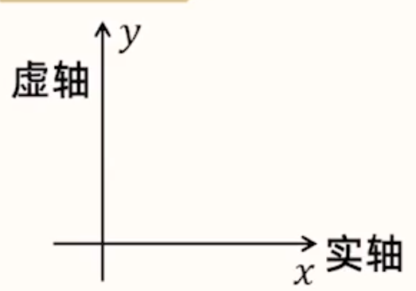
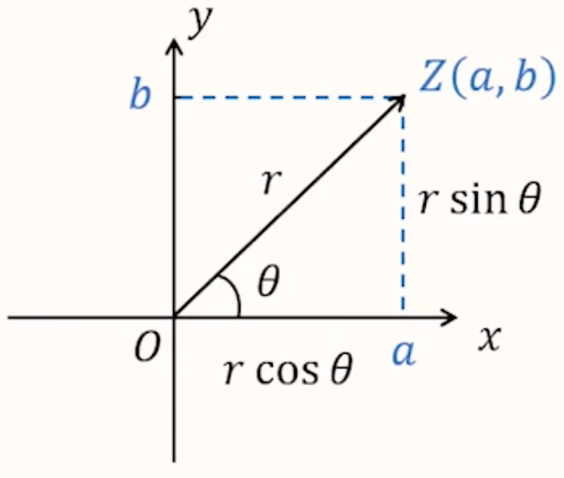

# 【数学】复数

## 定义

规定 $i^2 = -1$，并称 $i$ 为虚数单位。则 $i^3 = -i,i^4 = (i^2)^2 = 1,i^5 = i^4 \cdot i = i$，所以 $i^k$ 具有周期性，周期为 $4$。

复数：
$$
z = a + bi(a,b \in \mathrm R)
$$
其中 $a$ 为实部，$b$ 为虚部。**注意：$a$ 和 $b$ 都是实数**。

所有复数组成的集合就叫做复数集，即：
$$
\mathrm C = \{z|z = a + bi,a,b \in \mathrm R\}
$$

## 四则运算

> 四则运算的结果必须写为 $a + bi$ 的形式。

一般地，设 $z_1 = a + bi,z_2 = c + di(a,b,c,d \in \mathrm R)$，则
$$
z_1 + z_2 = (a + c) + (b + d)i\\
z_1 - z_2 = (a - c) + (b - d)i\\
z_1z_2 = (a + bi)(c + di) = ac + adi + bci + bdi^2 = (ac - bd) + (ad + bc)i\\
\dfrac{z_1}{z_2} = \dfrac{a + bi}{c + di} = \dfrac{(a + bi)(c - di)}{(c + di)(c - di)} = \dfrac{(ac + bd) + (bc - ad)i}{c^2 + d^2}
$$
对于复数的除法，关键是消去分母的 $i$，若分母是 $a + bi$，则可以在分子分母上同乘 $a - bi$，将分母变为 $a^2 + b^2$；若分母是 $ki$，$k \in \mathrm R$则可以分子分母同乘 $i$，将分母变为 $-ki$。

## 运算性质

**实数的所有运算性质，在复数中均成立**。

1. 交换律，结合律和分配律。
2. 完全平方差公式，平方差公式。
3. 等式性质。

## 基本概念

做复数相关题目时，最关键的是要找到 $a$ 和 $b$。

一般来说，复数题会给一个较为复杂的式子，需要化简式子并得到 $a + bi$，然后利用 $a$ 和 $b$ 解题。

若题目给定的是**抽象复数**，即没有给定具体的复数，那么可以考虑设对应复数 $z = a + bi$，根据基本概念表示出题目中相关的量代入求解。

### 分类

$$
复数(a + bi)
\begin{cases}
实数:b=0\\
虚数:b \ne 0
\begin{cases}
纯虚数：a = 0 ~且~ b \ne 0\\
实部不为 ~0~ 的虚数:a,b \ne 0
\end{cases}
\end{cases}
$$

> 注意：纯虚数需要保证 $b \ne 0$。

### 相等复数

实部与虚部都对应相等的复数，即：如果 $a,b,c,d$ 都是实数，则 $a + bi = c + di \iff a = c$ 且 $b = d$。

> 注意：两个复数，如果步全是实数，则无法比较大小。所以若题目给定两个复数的大小关系，则这两个复数**一定都是实数**。

### 复平面

建立了直角坐标系来表示复数的平面也称为复平面，一般对于复数 $z = a + bi$，令 $Z$ 的坐标为 $(a,b)$，则点 $Z$ 是复数 $Z$ 在平面上对应的点的坐标。

### 复数的几何意义

因为平面直角坐标系中的点 $Z(a,b)$ 能**唯一确定**一个以原点 $O$ 为始点，$Z$ 为终点的向量 $\overrightarrow{OZ}$，所以复数也可用向量 $\overrightarrow{OZ}$ 来表示。

因此能在**复数集**与平面直角坐标系中以 $O$ 为始点的向量组成的**集合**之间建立一一对应关系，即 复数 $z = a + bi \iff$ 向量 $\overrightarrow{OZ} = (a,b)$。

### 复数的模

向量 $\overrightarrow{OZ} = (a,b)$ 的长度称为复数 $z = a + bi$ 的模（或绝对值）。复数 $z$ 的模用 $|z|$ 表示 ，因此 $|z| = \sqrt{a^2 + b^2}$。

### 共轭复数

一般地，如果两个复数的实部相等，而虚部互为相反数，则称这两个复数互为共轭复数，复数 $z$ 的共轭复数用 $\overline{z}$ 表示。读作：$z$ 共轭。

当 $z = a + bi(a,b \in \mathrm R)$ 时，有 $\overline z = a - bi$。

【几何特点】复平面内表示两个复数的点关于实轴对称 $\iff$ 两个复数互为共轭复数。

## $|z_1 - z_2|$ 的几何意义

### 内容

首先，$|a-b|$ 表示数轴上 $a,b$ 两点之间的距离。那么类比分析可知，$|z_1 - z_2|$ 表示复平面上 $z_1,z_2$ 两点之间的距离。

例如等式 $|z - 1| = 1$，实际上表示的是与点 $(1,0)$ 距离为 $1$ 的点的集合，即圆心为 $(1,0)$，半径 $r = 1$ 的圆。 

### 例题

例：复数 $z$ 满足 $|z + i| + |z - i| = 2$，则 $|z + i + 1|$ 的最小值是多少。

分析：

由于 $|z + i|$ 和 $|z - i|$ 分别表示平面内距离 $A(0,-1)$ 和 $B(0,1)$ 的点的坐标，设复数 $z$ 在坐标系上对应的点为 $P$。则 $|PA| + |PB| = 2$，又由于 $|AB| = 2 = |PA| + |PB|$，所以点 $P$ 的运动轨迹在线段 $AB$ 上。

又由于 $|z + i + i| = |z -(-1 - i)|$，所以其几何意义为点 $P$ 到 $C(-1,-1)$ 的距离最小值。画图可知，当 $CP \perp AB$，即 $P$ 与 $A$ 共点时，距离最小，此时最小值为 $1$。

> 总结：遇到模长较多的题目，可以考虑将模长翻译成线段长度，从几何上解决问题。

## 复数的性质

### 性质一

内容：
$$
|z_1z_2| = |z_1||z_2|\\
\left|\dfrac{z_1}{z_2}\right| = \dfrac{|z_1|}{|z_2|}(z_2 \ne 0)
$$
作用：若题目中遇到模长的乘除法，则可以分别计算每个部分的模长，再算乘除法。

例如：
$$
\left|\dfrac{3 + 2i}{2 + 3i}\right| = \dfrac{|3 + 2i|}{|2 + 3i|} = 1
$$

> 注意：这种性质只适用于乘除法，不适用于加减法。一般情况下，$|z_1 + z_2| \le |z_1| + |z_2|$。

例题：已知复数 $z$ 满足 $\left(\dfrac{1 + i}{\sqrt 2}\right)^{2019} z = \left(- \dfrac 1 2 + \dfrac{\sqrt 3}{2}i\right)^3$，则 $|z|$ 为多少。

分析：

由题意得：
$$
z = \dfrac{\left(-\dfrac 1 2 + \dfrac{\sqrt 3}{2}i\right)^3}{\left(\dfrac{1 + i}{\sqrt 2}\right)^{2019}}
$$
所以
$$
\begin{aligned}
|z| & = \dfrac{\left|\left(- \dfrac 1 2 + \dfrac{\sqrt 3}{2}i\right)^3\right|}{\left|\left(\dfrac{1 + i}{\sqrt 2}\right)^{2019}\right|}\\
& = \dfrac{\left|- \dfrac 1 2 + \dfrac{\sqrt 3}{2}i\right|^3}{\left|\dfrac{1 + i}{\sqrt 2}\right|^{2019}}\\
& = \dfrac{\left(\sqrt{\left(- \dfrac{1}{2}\right)^2 + \left(\dfrac{\sqrt 3}{2}\right)^2}\right)^3}{\left(\dfrac{|1 + i|}{|\sqrt 2|}\right)^{2019}}\\
& = \dfrac{1}{1} = 1
\end{aligned}
$$

### 性质二

内容：
$$
|z| = |\overline z|\\
z \cdot \overline z= |z|^2
$$
即两个共轭复数它们的模长相等，一个复数和它的共轭复数相乘，结果为该复数模长的平方。

适用范围：当题目中同时出现 $|z|$ 和 $|\overline z|$ 时可以考虑该性质。

## 复数的三角形式

对于复数 $z = a + bi$，其复平面上对应的点为 $Z(a,b)$，设 $|z| = r$，向量 $\overrightarrow{OZ}$ 与 $x$ 轴的夹角为 $\theta$，则复数 $z$ 的三角表示为 $z = r \cdot \cos \theta + r \cdot \sin \theta \cdot i = r(\cos \theta + i\sin \theta)$。如图所示。

这里的 $\theta$ 叫做**辐角**。任何一个非零复数 $z$ 的辐角都有无穷多个。特别地，在 $[0,2\pi)$ 内的辐角称为 $z$ 的**辐角主值**，记作 $\arg z$。