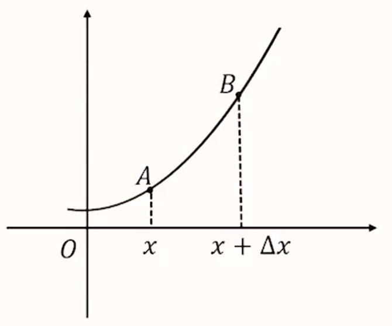
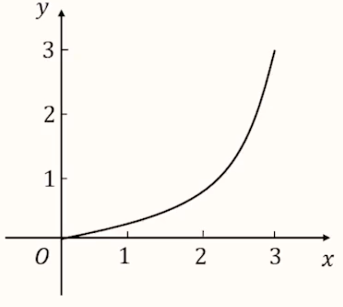

# 【数学】导数

## 极限

### 定义

【描述】

一个变量趋近于一个固定量，趋近的程度小于任何给定的正数，这个固定量就叫做这个变量的极限。

【严格定义】

对于无穷数列 $\{a_n\}$ 及常数 $A$，若对于任意 $\varepsilon > 0$，总存在正整数 $\mathrm N$，使得当 $n > \mathrm N$ 时，总有 $|a_n - A| < \varepsilon$，则称作数列 $\{a_n\}$ 的极限是 $A$，记作 $\lim \limits_{n \to +\infty} = A$。

> 对于极限的理解：
>
> 极限是一个变量（数），是可以无限接近的定值。
>
> 注意：无限接近 $\ne$ 不能取到，即极限可以被取到。

## 导数的概念

### 定义

设函数 $y = f(x)$ 在 $x_0$ 及其附近有意义，如果 $\lim \limits_{\Delta x \to 0} \dfrac{f(x_0 + \Delta x) - f(x_0)}{\Delta x}$ 存在，则称 $f'(x_0) = \lim \limits_{\Delta x \to 0} \dfrac{f(x_0 + \Delta x) - f(x_0)}{\Delta x}$ 为函数 $y = f(x)$ 在 $x_0$ 处的导数。

所以导数就是函数的瞬时变化率。

> 例：已知函数 $f(x) = 2x^2 + 1$，计算 $f'(1)$。
>
> 求解：
> $$
> \begin{aligned}
> f'(1) & = \lim \limits_{\Delta x \to 0} \dfrac{f(1 + \Delta x) - f(1)}{\Delta x}\\
> & = \lim \limits_{\Delta x \to 0} \dfrac{2(1 + \Delta x)^2 + 1 - (2 \times 1^2 + 1)}{\Delta x}\\
> & = \lim \limits_{\Delta x \to 0} \dfrac{4\Delta x + 2(\Delta x)^2}{\Delta x}\\
> & = \lim \limits_{\Delta x \to 0} (4 + 2\Delta x) \\
> & = 4
> \end{aligned}
> $$

### 导函数

如果 $f(x)$ 在区间 $(a,b)$ 上的每一个点 $x$ 处都有导数，导数值记为 $f'(x):f’(x) = \lim \limits_{\Delta x \to 0} \dfrac{f(x + \Delta x) - f(x)}{\Delta x}$，则 $f'(x)$ 构成一个关于 $x$ 的新函数，把这个函数称为 $f(x)$ 的导函数。

一般情况下：导函数简称为导数，所以i题目中计算导函数一般都是计算某个函数的导数。

> 例 1：求函数 $f(x) = \dfrac 3 x$ 的导函数 $f'(x)$。
>
> 求解：
> $$
> \begin{aligned}
> f'(x) & = \lim \limits_{\Delta x \to 0} \dfrac{f(x + \Delta x) - f(x)}{\Delta x}\\
> & = \lim \limits_{\Delta x \to 0} \dfrac{\dfrac{3}{x + \Delta x} - \dfrac 3 x}{\Delta x}\\
> & = \lim \limits_{\Delta x \to 0} \dfrac{-3 \Delta x}{x^2 + x \Delta x} \cdot \dfrac 1 {\Delta x}\\
> & = \lim \limits_{\Delta x \to 0} \dfrac{-3}{x^2 + x \Delta x}\\
> & = - \dfrac 3 {x^2}
> \end{aligned}
> $$
> 例 2：已知 $\lim \limits_{\Delta x \to 0} \dfrac{f(x_0 + 3\Delta x ) - f(x_0)}{\Delta x} = 1$，求 $f'(x_0)$。
>
> 求解：
>
> 由于
> $$
> \begin{aligned}
> f'(x_0) & = \lim \limits_{\Delta x \to 0} \dfrac{f(x_0 + 3 \Delta x) - f(x_0)}{3 \Delta x}\\
> & = \dfrac 1 3 \lim \limits_{\Delta x \to 0} \dfrac{f(x_0 + 3\Delta x) - f(x_0)}{\Delta x}\\
> & = \dfrac 1 3
> \end{aligned}
> $$
> 例 3：已知函数 $f(x)$ 在 $\mathrm R$ 上可导，$\lim \limits_{\Delta x \to 0} \dfrac{f(x_0 + 3 \Delta x) - f(x_0 - \Delta x)}{\Delta x} = 2$，求 $f'(x_0)$。
>
> 求解：
> $$
> \begin{aligned}
> &\lim \limits_{\Delta x \to 0} \dfrac{f(x_0 + 3 \Delta x) - f(x_0 - \Delta x)}{\Delta x} = 2\\
> \iff & \lim \limits_{\Delta x \to 0} \dfrac{f(x_0 + 3\Delta x) - f(x_0) + f(x_0) - f(x_0 - \Delta x)}{\Delta x} = 2\\
> \iff & \lim \limits_{\Delta x \to 0} \dfrac{f(x_0 + 3\Delta x) - f(x_0)}{\Delta x} + \lim \limits_{\Delta x \to 0} \dfrac{f(x_0) - f(x_0 - \Delta x)}{\Delta x} = 2\\
> \iff & 3 \times \lim \limits_{\Delta x \to 0} \dfrac{f(x_0 + 3 \Delta x) - f(x_0)}{3 \Delta x} + \lim \limits_{\Delta x \to 0} \dfrac{f(x_0 - \Delta x) - f(x_0)}{- \Delta x} = 2\\
> \iff & 4f'(x_0) = 2\\
> \iff & f'(x_0) = \dfrac 1 2
> \end{aligned}
> $$
> 计算某点的导数，有两个关键点：
>
> - 将 $x_0$ 作为基准点；
> - 分子分母保持一致（函数值的变化量和自变量的变化量保持一致）。

### 几何意义

如图所示，上图为 $f(x)$ 的图象，则函数的平均变化率就为：
$$
\dfrac{f(x + \Delta x) - f(x)}{\Delta x}
$$
相当于相当于纵坐标的变化量 $\Delta y$ 除以横坐标变化量 $\Delta x$，即 $\dfrac{\Delta y}{\Delta x}$，所以平均变化率的几何意义就是直线 $AB$ 的斜率。

当 $\Delta x$ 无限趋于 $0$ 时，函数的瞬时变化率就是 $f(x)$ 的导数，如下：
$$
f'(x) = \lim_{\Delta x \to 0} \dfrac{f(x + \Delta x) - f(x)}{\Delta x}
$$
即点 $B$ 无限趋于点 $A$，$AB$ 无限趋于函数在点 $A$ 处的切线，$f'(x)$ 就是函数 $f(x)$ 在 $A$ 处的切线斜率。

总结：对于任意可导函数 $y = f(x)$ 来说， $f(x)$ 在 $x_0$ 处的导数，是 $f(x)$ 的图象在 $x_0$ 处切线的斜率，所以通过 $f'(x_0)$ 和 $x_0$ 处点的坐标，可以根据「点斜式」求出切线的方程。

应用：判断某直线是否为某函数 $f(x)$ 的切线，可以通过求出该直线与 $f(x)$ 交点 $O$，在求出函数 $f(x)$ 在 $O$ 点的导数，即为 $f(x)$ 在 $O$ 点的切线斜率，若该斜率等于直线斜率，则该直线是函数 $f(x)$ 的切线。

> 注意：
>
> - 对直线而言，直线对应函数的导数的几何意义是直线的斜率。
> - 如果一个函数在某一点同时存在左极限和右极限，且左极限 $=$ 右极限，则说明该函数在该点极限存在；如果一个函数在某一点左极限和右极限有一个不存在，或左极限 $\ne$ 右极限，则说明该函数在该点极限不存在。

## 计算

### 基本初等函数的导数公式

|                         $f(x)$                          |           $f'(x)$           |
| :-----------------------------------------------------: | :-------------------------: |
|                    $c$（$c$ 为常数）                    |             $0$             |
| $x^\alpha$（$\alpha \in \mathrm Q$，且 $\alpha \ne 0$） |   $\alpha x^{\alpha - 1}$   |
|                        $\sin x$                         |          $\cos x$           |
|                        $\cos x$                         |         $- \sin x$          |
|                          $e^x$                          |            $e^x$            |
|                         $\ln x$                         |        $\dfrac 1 x$         |
|                  $a^x(a > 0,a \ne 1)$                   |         $a^x \ln a$         |
|                $\log_a x(a > 0,a \ne 1)$                | $\dfrac 1 {x \ln a}(x > 0)$ |

> 注：$\mathrm Q$ 是有理数集。
>

### 导数的运算法则

#### 函数和（差）的求导法则

两个函数和（差）的导数等于它们各自的导数再相加（相减），即：
$$
[f(x) \pm g(x)]' = f'(x) \pm g'(x)
$$

#### 函数积的求导法则

两个函数积的导数等于第一个函数乘上第二个函数的导数与第二个函数乘上第一个函数的导数相加，即：
$$
[f(x)g(x)]' = f'(x)g(x) + f(x)g'(x)
$$
口诀：前导后不导 $+$ 前不导后导。

> 推广：
>
> $$
> [cf(x)]' = c'f(x) + cf'(x) = cf'(x)
> $$
> 其中 $c$ 是常数。

#### 函数商的求导法则

两个函数商的求导规则：
$$
\left[\dfrac{f(x)}{g(x)}\right]' = \dfrac{f'(x)\cdot g(x) - f(x)\cdot g'(x)}{g^2(x)}(g(x) \ne 0)
$$
分子口诀：上导下不导 $-$ 下导上不导。

#### 复合函数的求导法则

一般地， 对于由 $y = f(u)$ 和 $u = g(x)$ 复合而成的导数 $y = f(g(x))$，它的导数与函数 $y = f(u),u = g(x)$ 的导数间的关系为
$$
{y_x}' = {y_u}'\cdot {u_x}'
$$
即 $y$ 对 $x$ 的导数等于 $y$ 对 $u$ 的导数与 $u$ 对 $x$ 的导数的乘积。

步骤：

- 将一个函数拆成两个函数复合而成，甚至多个函数复合而成的结果。
- 分别求出每个函数的导数，再相乘。

> 例：求函数 $y = \sin 3x$ 的导数。
>
> 求解：
>
> 令 $t = 3x$，则 $y = \sin t$，那么：
> $$
> \begin{aligned}
> {y_x}' & = {y_t}' \cdot {t_x}'\\
> & = (\sin t)' \cdot (3x)'\\
> & = 3\cos t\\
> & = 3\cos 3x
> \end{aligned}
> $$
> 注意：最后一定要把式中的 $t$ 替换为 $x$，因为求的是 $y$ 关于 $x$ 的函数。

对于比较复杂的函数可以直接从最外层直接计算，例如：求 $y = \sin^3 (2x + 1)$ 的导数。

那么有
$$
\begin{aligned}
y' & = 3 \sin^2 (2x + 1)\cdot \cos (2x + 1) \cdot 2\\
& = 6 \sin^2 (2x + 1)\cdot \cos (2x + 1)
\end{aligned}
$$

#### 函数求导法则的综合运用

策略：化整为零，逐个突破。

步骤：

1. 分析函数的组合方式，
2. 用对应法则拆解函数逐个求导。

例：求函数 $y = \dfrac{\sin 2x}{2^x - 1}$ 的导数。

求解：

首先它整体上是函数商的形式，分子是一个复合函数，分母是函数差的形式，考虑分别求解。
$$
\begin{aligned}
y' & = \dfrac{(\sin 2x)'(2^x - 1) - (\sin 2x)(2^x - 1)'}{(2^x - 1)^2}\\
& = \dfrac{2\cos 2x\cdot (2^x - 1) - \sin 2x \cdot 2^x\ln 2}{(2^x - 1)^2}
\end{aligned}
$$

### 导数计算的相关技巧及注意事项

1. 求导时需要分清自变量与常数，例如 $f(x) = \sin \alpha - \cos x$，这里的 $\alpha$ 是常数，所以 $f(x)$ 中 $\sin \alpha$ 的导数应该是 $0$，而不是 $\cos \alpha$。
2. 遇到形式不熟悉的式子，可以考虑观察其本质再根据一般情况下处理。

---

例：已知函数 $f(x)$ 满足 $f(x) = f'(1) e^{x-1} - f(0)x + \dfrac 1 2 x^2$，求 $f(x)$ 的解析式。

求解：观察式子可以发现，题目中给定的 $f'(1)$ 和 $f(0)$ 实际上是具体的函数值，即其本质是数，所以考虑令 $a = f'(1),b = f(0)$。

则 
$$
f(x) = ae^{x-1} - bx + \dfrac 1 2 x^2
$$
问题转化为求式中的 $a$ 和 $b$。

令 $x = 0$，则
$$
f(0) = ae^{-1} = \dfrac a e \implies b = \dfrac a e \qquad (1)
$$
对 $f(x)$ 求导：
$$
f'(x) = ae^{x-1} - b + x \implies f'(1) = a - b + 1 \implies a = a - b + 1 \implies b = 1 \qquad (2)
$$
结合 $(1)$ 和 $(2)$ 可得 $a = e,b=1$。

所以
$$
f(x) = e^x - x + \dfrac 1 2 x^2
$$

## 导数中的切线问题

### 解题思路&方法

若题目中出现了切线/切线方程，则需要通过题目求出/找出「切点坐标」、「切线斜率」和「切线方程」，这三点是导数切线问题的三要素。

切点坐标：$(x_0,f(x_0))$。若题目已知切点坐标，则直接使用；未知切点坐标，则需要将其设出来之后再使用。

切线斜率：$k = f'(x_0)$。

切线方程：$y - f(x_0) = f'(x_0)(x - x_0)$。

> 注意：
>
> - 题目描述中「**在**某点处的切线方程」与「**过**某点的切线方程」不同，前者表示给定点**必须是切点**，而后者表示给定点**不一定是切点**，一般后者需要设出切点。
> - 对于有些需要解方程的题目，若方程直接不好解，可以考虑猜出它的解，但是对于猜的解需要验证解的个数，或只有这一个解，这时候可以通过判断对应函数单调性来判断解的个数。例如：$\ln x_0 - \dfrac e {x_0} = 0$ 容易猜出 $x_0 = e$ 是原方程的解，同时由于函数 $g(x) = \ln x_0 - \dfrac e {x_0}$ 在 $(0, + \infty)$ 上单调递增，所以有唯一解 $x_0 = e$。
> - 有时候需要会翻译题目条件，例如题目条件是某函数 $f(x)$ 的图像上存在两点，使得函数的图象在这两点处的切线相互垂直，可以翻译条件为：$\exists~ a,b,f'(a)\cdot f'(b) = -1$。

### 例题

例 1：已知函数 $f(x) = \dfrac 1 x,g(x) = x^2$。若直线 $l$ 与曲线 $f(x),g(x)$ 都相切，则直线 $l$ 的斜率是多少。

求解：

根据题意可知直线 $l$ 是曲线 $f(x)$ 和 $g(x)$ 的**公切线**，考虑对于两个函数分别求出切线方程再求解。

对于 $f(x)$：
$$
f'(x) = - \dfrac 1 {x^2}
$$
设切点坐标为 $\left(a, \dfrac 1 a\right)$，则切线斜率 $k_1 = f'(a) = - \dfrac 1 {a^2}$，切线方程为 $y - \dfrac 1 a = - \dfrac 1 {a^2}(x - a)$，化简得 $y = - \dfrac 1 {a^2} x + \dfrac 2 a$。

对 $g(x)$：
$$
g'(x) = 2x
$$
切点坐标为 $(b,b^2)$，则切线斜率 $k_2 = g'(b) = 2b$，切线方程为 $y - b^2 = 2b(x - b)$，即 $y = 2bx - b^2$。

由于直线 $l$ 是两曲线的公切线，所以 $l$ 需要同时满足 $f(x)$ 和 $g(x)$ 的切线方程。

所以考虑「待定系数法」可得：
$$
\begin{cases}
- \dfrac 1 {a^2} = 2b\\
\dfrac 2 a = -b^2
\end{cases}
\implies
\begin{cases}
\dfrac 1 {a^2} = -2b\\
\dfrac 4 {a^2} = b^4
\end{cases}
\implies b^4 = -8 b \implies b = 0~或~-2
$$
由于当 $b = 0$ 时，根据 $\dfrac 1 {a^2} = -2b$ 可知 $a$ 无解，所以 $b = -2$。

此时直线 $l$ 的斜率为 $k_2 = 2b = -4$。

> 总结&技巧：
>
> - 解决两曲线的「公切线」问题，可以单独将两曲线的切线方程表示出来，再通过「待定系数法」求出对应参数的解。
> - 遇到出现**多个根**的情况，需要根据之前的计算/题目条件排除是否存在增根。

---

例 2：$y = f(x)$ 的图象如下，$f'(x)$ 为其导函数，则 $f'(1),f'(2),f(2) - f(1)$ 三者之间的大小关系是什么。

求解：

$f'(1)$ 和 $f'(2)$ 的几何意义是函数 $f(x)$ 在 $x = 1$ 和 $x = 2$ 处的斜率，根据图象可知 $f'(1) < f'(2)$。

$f(2) - f(1)$ 可以可以看做 $x = 2$ 时的纵坐标减去 $x = 1$ 时的纵坐标，考虑将其转化为斜率求解。

图象上 $(1,f(1))$ 和 $(2,f(2))$ 两点的连线斜率 $k$ 恰好等于 $\dfrac{f(2) - f(1)}{2 - 1} = f(2) - f(1)$，根据图象可知 $f'(1) < f(2) - f(1) < f'(2)$。

> 总结&技巧：这道题最关键的就是 $f(2) - f(1)$ 的转化，以后遇到类似形式（两纵坐标之差）可以考虑将其转化为对应的斜率求解。

