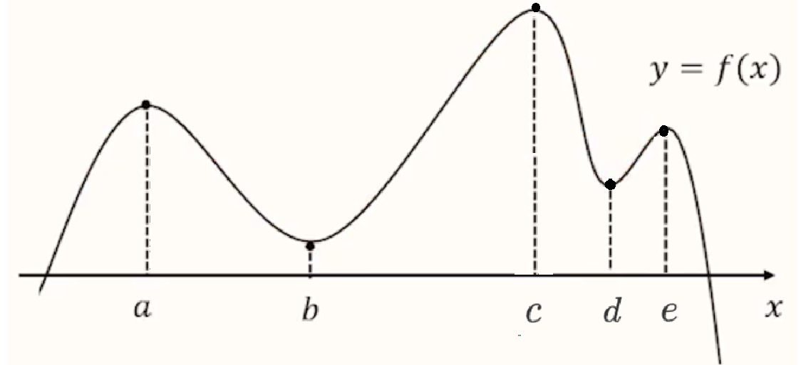
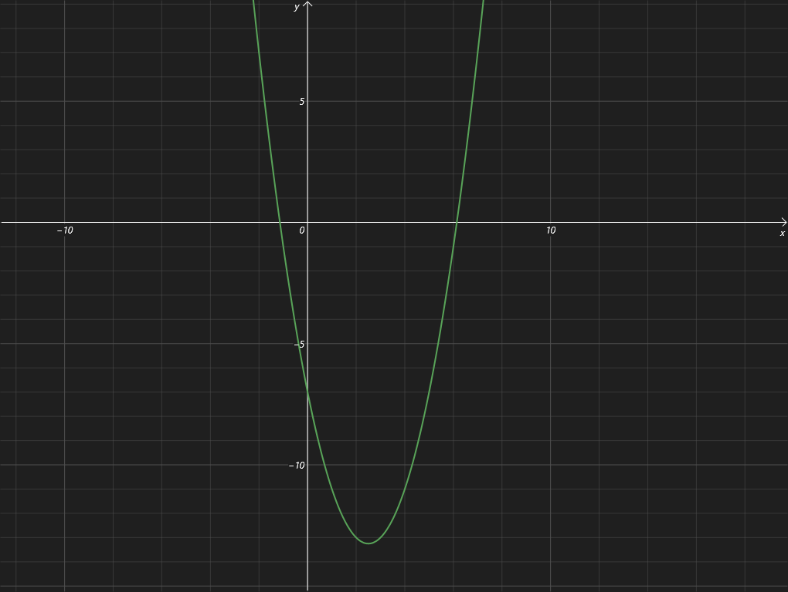
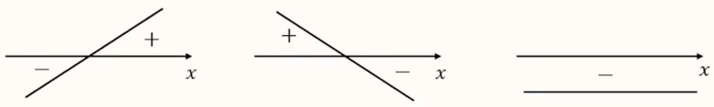
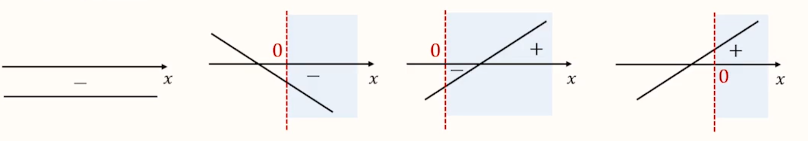
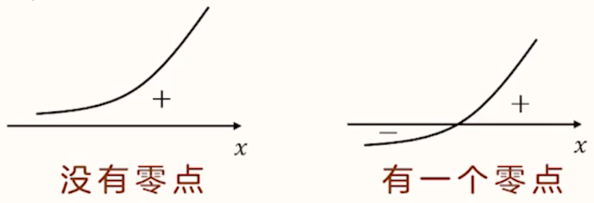
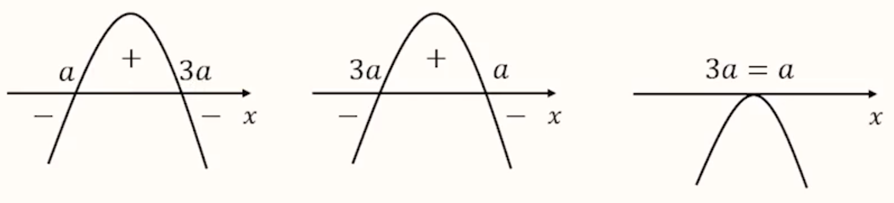
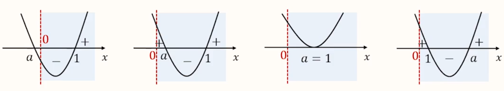

# 【数学】导数

## 极限

### 定义

【描述】

一个变量趋近于一个固定量，趋近的程度小于任何给定的正数，这个固定量就叫做这个变量的极限。

【严格定义】

对于无穷数列 $\{a_n\}$ 及常数 $A$，若对于任意 $\varepsilon > 0$，总存在正整数 $\mathrm N$，使得当 $n > \mathrm N$ 时，总有 $|a_n - A| < \varepsilon$，则称作数列 $\{a_n\}$ 的极限是 $A$，记作 $\lim \limits_{n \to +\infty} = A$。

> 对于极限的理解：
>
> 极限是一个变量（数），是可以无限接近的定值。
>
> 注意：无限接近 $\ne$ 不能取到，即极限可以被取到。

## 导数的概念

### 定义

设函数 $y = f(x)$ 在 $x_0$ 及其附近有意义，如果 $\lim \limits_{\Delta x \to 0} \dfrac{f(x_0 + \Delta x) - f(x_0)}{\Delta x}$ 存在，则称 $f'(x_0) = \lim \limits_{\Delta x \to 0} \dfrac{f(x_0 + \Delta x) - f(x_0)}{\Delta x}$ 为函数 $y = f(x)$ 在 $x_0$ 处的导数。

所以导数就是函数的瞬时变化率。

> 例：已知函数 $f(x) = 2x^2 + 1$，计算 $f'(1)$。
>
> 求解：
> $$
> \begin{aligned}
> f'(1) & = \lim \limits_{\Delta x \to 0} \dfrac{f(1 + \Delta x) - f(1)}{\Delta x}\\
> & = \lim \limits_{\Delta x \to 0} \dfrac{2(1 + \Delta x)^2 + 1 - (2 \times 1^2 + 1)}{\Delta x}\\
> & = \lim \limits_{\Delta x \to 0} \dfrac{4\Delta x + 2(\Delta x)^2}{\Delta x}\\
> & = \lim \limits_{\Delta x \to 0} (4 + 2\Delta x) \\
> & = 4
> \end{aligned}
> $$

### 导函数

如果 $f(x)$ 在区间 $(a,b)$ 上的每一个点 $x$ 处都有导数，导数值记为 $f'(x):f’(x) = \lim \limits_{\Delta x \to 0} \dfrac{f(x + \Delta x) - f(x)}{\Delta x}$，则 $f'(x)$ 构成一个关于 $x$ 的新函数，把这个函数称为 $f(x)$ 的导函数。

一般情况下：导函数简称为导数，所以i题目中计算导函数一般都是计算某个函数的导数。

> 例 1：求函数 $f(x) = \dfrac 3 x$ 的导函数 $f'(x)$。
>
> 求解：
> $$
> \begin{aligned}
> f'(x) & = \lim \limits_{\Delta x \to 0} \dfrac{f(x + \Delta x) - f(x)}{\Delta x}\\
> & = \lim \limits_{\Delta x \to 0} \dfrac{\dfrac{3}{x + \Delta x} - \dfrac 3 x}{\Delta x}\\
> & = \lim \limits_{\Delta x \to 0} \dfrac{-3 \Delta x}{x^2 + x \Delta x} \cdot \dfrac 1 {\Delta x}\\
> & = \lim \limits_{\Delta x \to 0} \dfrac{-3}{x^2 + x \Delta x}\\
> & = - \dfrac 3 {x^2}
> \end{aligned}
> $$
> 例 2：已知 $\lim \limits_{\Delta x \to 0} \dfrac{f(x_0 + 3\Delta x ) - f(x_0)}{\Delta x} = 1$，求 $f'(x_0)$。
>
> 求解：
>
> 由于
> $$
> \begin{aligned}
> f'(x_0) & = \lim \limits_{\Delta x \to 0} \dfrac{f(x_0 + 3 \Delta x) - f(x_0)}{3 \Delta x}\\
> & = \dfrac 1 3 \lim \limits_{\Delta x \to 0} \dfrac{f(x_0 + 3\Delta x) - f(x_0)}{\Delta x}\\
> & = \dfrac 1 3
> \end{aligned}
> $$
> 例 3：已知函数 $f(x)$ 在 $\mathrm R$ 上可导，$\lim \limits_{\Delta x \to 0} \dfrac{f(x_0 + 3 \Delta x) - f(x_0 - \Delta x)}{\Delta x} = 2$，求 $f'(x_0)$。
>
> 求解：
> $$
> \begin{aligned}
> &\lim \limits_{\Delta x \to 0} \dfrac{f(x_0 + 3 \Delta x) - f(x_0 - \Delta x)}{\Delta x} = 2\\
> \iff & \lim \limits_{\Delta x \to 0} \dfrac{f(x_0 + 3\Delta x) - f(x_0) + f(x_0) - f(x_0 - \Delta x)}{\Delta x} = 2\\
> \iff & \lim \limits_{\Delta x \to 0} \dfrac{f(x_0 + 3\Delta x) - f(x_0)}{\Delta x} + \lim \limits_{\Delta x \to 0} \dfrac{f(x_0) - f(x_0 - \Delta x)}{\Delta x} = 2\\
> \iff & 3 \times \lim \limits_{\Delta x \to 0} \dfrac{f(x_0 + 3 \Delta x) - f(x_0)}{3 \Delta x} + \lim \limits_{\Delta x \to 0} \dfrac{f(x_0 - \Delta x) - f(x_0)}{- \Delta x} = 2\\
> \iff & 4f'(x_0) = 2\\
> \iff & f'(x_0) = \dfrac 1 2
> \end{aligned}
> $$
> 计算某点的导数，有两个关键点：
>
> - 将 $x_0$ 作为基准点；
> - 分子分母保持一致（函数值的变化量和自变量的变化量保持一致）。

### 几何意义

如图所示，上图为 $f(x)$ 的图象，则函数的平均变化率就为：
$$
\dfrac{f(x + \Delta x) - f(x)}{\Delta x}
$$
相当于相当于纵坐标的变化量 $\Delta y$ 除以横坐标变化量 $\Delta x$，即 $\dfrac{\Delta y}{\Delta x}$，所以平均变化率的几何意义就是直线 $AB$ 的斜率。

当 $\Delta x$ 无限趋于 $0$ 时，函数的瞬时变化率就是 $f(x)$ 的导数，如下：
$$
f'(x) = \lim_{\Delta x \to 0} \dfrac{f(x + \Delta x) - f(x)}{\Delta x}
$$
即点 $B$ 无限趋于点 $A$，$AB$ 无限趋于函数在点 $A$ 处的切线，$f'(x)$ 就是函数 $f(x)$ 在 $A$ 处的切线斜率。

总结：对于任意可导函数 $y = f(x)$ 来说， $f(x)$ 在 $x_0$ 处的导数，是 $f(x)$ 的图象在 $x_0$ 处切线的斜率，所以通过 $f'(x_0)$ 和 $x_0$ 处点的坐标，可以根据「点斜式」求出切线的方程。

应用：判断某直线是否为某函数 $f(x)$ 的切线，可以通过求出该直线与 $f(x)$ 交点 $O$，在求出函数 $f(x)$ 在 $O$ 点的导数，即为 $f(x)$ 在 $O$ 点的切线斜率，若该斜率等于直线斜率，则该直线是函数 $f(x)$ 的切线。

> 注意：
>
> - 对直线而言，直线对应函数的导数的几何意义是直线的斜率。
> - 如果一个函数在某一点同时存在左极限和右极限，且左极限 $=$ 右极限，则说明该函数在该点极限存在；如果一个函数在某一点左极限和右极限有一个不存在，或左极限 $\ne$ 右极限，则说明该函数在该点极限不存在。

## 计算

### 基本初等函数的导数公式

|                         $f(x)$                          |           $f'(x)$           |
| :-----------------------------------------------------: | :-------------------------: |
|                    $c$（$c$ 为常数）                    |             $0$             |
| $x^\alpha$（$\alpha \in \mathrm Q$，且 $\alpha \ne 0$） |   $\alpha x^{\alpha - 1}$   |
|                        $\sin x$                         |          $\cos x$           |
|                        $\cos x$                         |         $- \sin x$          |
|                          $e^x$                          |            $e^x$            |
|                         $\ln x$                         |        $\dfrac 1 x$         |
|                  $a^x(a > 0,a \ne 1)$                   |         $a^x \ln a$         |
|                $\log_a x(a > 0,a \ne 1)$                | $\dfrac 1 {x \ln a}(x > 0)$ |

> 注：$\mathrm Q$ 是有理数集。
>

### 导数的运算法则

#### 函数和（差）的求导法则

两个函数和（差）的导数等于它们各自的导数再相加（相减），即：
$$
[f(x) \pm g(x)]' = f'(x) \pm g'(x)
$$

#### 函数积的求导法则

两个函数积的导数等于第一个函数乘上第二个函数的导数与第二个函数乘上第一个函数的导数相加，即：
$$
[f(x)g(x)]' = f'(x)g(x) + f(x)g'(x)
$$
口诀：前导后不导 $+$ 前不导后导。

> 推广：
>
> $$
> [cf(x)]' = c'f(x) + cf'(x) = cf'(x)
> $$
> 其中 $c$ 是常数。

#### 函数商的求导法则

两个函数商的求导规则：
$$
\left[\dfrac{f(x)}{g(x)}\right]' = \dfrac{f'(x)\cdot g(x) - f(x)\cdot g'(x)}{g^2(x)}(g(x) \ne 0)
$$
分子口诀：上导下不导 $-$ 下导上不导。

#### 复合函数的求导法则

一般地， 对于由 $y = f(u)$ 和 $u = g(x)$ 复合而成的导数 $y = f(g(x))$，它的导数与函数 $y = f(u),u = g(x)$ 的导数间的关系为
$$
{y_x}' = {y_u}'\cdot {u_x}'
$$
即 $y$ 对 $x$ 的导数等于 $y$ 对 $u$ 的导数与 $u$ 对 $x$ 的导数的乘积。

步骤：

- 将一个函数拆成两个函数复合而成，甚至多个函数复合而成的结果。
- 分别求出每个函数的导数，再相乘。

> 例：求函数 $y = \sin 3x$ 的导数。
>
> 求解：
>
> 令 $t = 3x$，则 $y = \sin t$，那么：
> $$
> \begin{aligned}
> {y_x}' & = {y_t}' \cdot {t_x}'\\
> & = (\sin t)' \cdot (3x)'\\
> & = 3\cos t\\
> & = 3\cos 3x
> \end{aligned}
> $$
> 注意：最后一定要把式中的 $t$ 替换为 $x$，因为求的是 $y$ 关于 $x$ 的函数。

对于比较复杂的函数可以直接从最外层直接计算，例如：求 $y = \sin^3 (2x + 1)$ 的导数。

那么有
$$
\begin{aligned}
y' & = 3 \sin^2 (2x + 1)\cdot \cos (2x + 1) \cdot 2\\
& = 6 \sin^2 (2x + 1)\cdot \cos (2x + 1)
\end{aligned}
$$

#### 函数求导法则的综合运用

策略：化整为零，逐个突破。

步骤：

1. 分析函数的组合方式，
2. 用对应法则拆解函数逐个求导。

例：求函数 $y = \dfrac{\sin 2x}{2^x - 1}$ 的导数。

求解：

首先它整体上是函数商的形式，分子是一个复合函数，分母是函数差的形式，考虑分别求解。
$$
\begin{aligned}
y' & = \dfrac{(\sin 2x)'(2^x - 1) - (\sin 2x)(2^x - 1)'}{(2^x - 1)^2}\\
& = \dfrac{2\cos 2x\cdot (2^x - 1) - \sin 2x \cdot 2^x\ln 2}{(2^x - 1)^2}
\end{aligned}
$$

### 导数计算的相关技巧及注意事项

1. 求导时需要分清自变量与常数，例如 $f(x) = \sin \alpha - \cos x$，这里的 $\alpha$ 是常数，所以 $f(x)$ 中 $\sin \alpha$ 的导数应该是 $0$，而不是 $\cos \alpha$。
2. 遇到形式不熟悉的式子，可以考虑观察其本质再根据一般情况下处理。

---

例：已知函数 $f(x)$ 满足 $f(x) = f'(1) e^{x-1} - f(0)x + \dfrac 1 2 x^2$，求 $f(x)$ 的解析式。

求解：观察式子可以发现，题目中给定的 $f'(1)$ 和 $f(0)$ 实际上是具体的函数值，即其本质是数，所以考虑令 $a = f'(1),b = f(0)$。

则 
$$
f(x) = ae^{x-1} - bx + \dfrac 1 2 x^2
$$
问题转化为求式中的 $a$ 和 $b$。

令 $x = 0$，则
$$
f(0) = ae^{-1} = \dfrac a e \implies b = \dfrac a e \qquad (1)
$$
对 $f(x)$ 求导：
$$
f'(x) = ae^{x-1} - b + x \implies f'(1) = a - b + 1 \implies a = a - b + 1 \implies b = 1 \qquad (2)
$$
结合 $(1)$ 和 $(2)$ 可得 $a = e,b=1$。

所以
$$
f(x) = e^x - x + \dfrac 1 2 x^2
$$

## 导数中的切线问题

### 解题思路&方法

若题目中出现了切线/切线方程，则需要通过题目求出/找出「切点坐标」、「切线斜率」和「切线方程」，这三点是导数切线问题的三要素。

切点坐标：$(x_0,f(x_0))$。若题目已知切点坐标，则直接使用；未知切点坐标，则需要将其设出来之后再使用。

切线斜率：$k = f'(x_0)$。

切线方程：$y - f(x_0) = f'(x_0)(x - x_0)$。

> 注意：
>
> - 题目描述中「**在**某点处的切线方程」与「**过**某点的切线方程」不同，前者表示给定点**必须是切点**，而后者表示给定点**不一定是切点**，一般后者需要设出切点。
> - 对于有些需要解方程的题目，若方程直接不好解，可以考虑猜出它的解，但是对于猜的解需要验证解的个数，或只有这一个解，这时候可以通过判断对应函数单调性来判断解的个数。例如：$\ln x_0 - \dfrac e {x_0} = 0$ 容易猜出 $x_0 = e$ 是原方程的解，同时由于函数 $g(x) = \ln x_0 - \dfrac e {x_0}$ 在 $(0, + \infty)$ 上单调递增，所以有唯一解 $x_0 = e$。
> - 有时候需要会翻译题目条件，例如题目条件是某函数 $f(x)$ 的图像上存在两点，使得函数的图象在这两点处的切线相互垂直，可以翻译条件为：$\exists~ a,b,f'(a)\cdot f'(b) = -1$。

### 例题

例 1：已知函数 $f(x) = \dfrac 1 x,g(x) = x^2$。若直线 $l$ 与曲线 $f(x),g(x)$ 都相切，则直线 $l$ 的斜率是多少。

求解：

根据题意可知直线 $l$ 是曲线 $f(x)$ 和 $g(x)$ 的**公切线**，考虑对于两个函数分别求出切线方程再求解。

对于 $f(x)$：
$$
f'(x) = - \dfrac 1 {x^2}
$$
设切点坐标为 $\left(a, \dfrac 1 a\right)$，则切线斜率 $k_1 = f'(a) = - \dfrac 1 {a^2}$，切线方程为 $y - \dfrac 1 a = - \dfrac 1 {a^2}(x - a)$，化简得 $y = - \dfrac 1 {a^2} x + \dfrac 2 a$。

对 $g(x)$：
$$
g'(x) = 2x
$$
切点坐标为 $(b,b^2)$，则切线斜率 $k_2 = g'(b) = 2b$，切线方程为 $y - b^2 = 2b(x - b)$，即 $y = 2bx - b^2$。

由于直线 $l$ 是两曲线的公切线，所以 $l$ 需要同时满足 $f(x)$ 和 $g(x)$ 的切线方程。

所以考虑「待定系数法」可得：
$$
\begin{cases}
- \dfrac 1 {a^2} = 2b\\
\dfrac 2 a = -b^2
\end{cases}
\implies
\begin{cases}
\dfrac 1 {a^2} = -2b\\
\dfrac 4 {a^2} = b^4
\end{cases}
\implies b^4 = -8 b \implies b = 0~或~-2
$$
由于当 $b = 0$ 时，根据 $\dfrac 1 {a^2} = -2b$ 可知 $a$ 无解，所以 $b = -2$。

此时直线 $l$ 的斜率为 $k_2 = 2b = -4$。

> 总结&技巧：
>
> - 解决两曲线的「公切线」问题，可以单独将两曲线的切线方程表示出来，再通过「待定系数法」求出对应参数的解。
> - 遇到出现**多个根**的情况，需要根据之前的计算/题目条件排除是否存在增根。

---

例 2：$y = f(x)$ 的图象如下，$f'(x)$ 为其导函数，则 $f'(1),f'(2),f(2) - f(1)$ 三者之间的大小关系是什么。

求解：

$f'(1)$ 和 $f'(2)$ 的几何意义是函数 $f(x)$ 在 $x = 1$ 和 $x = 2$ 处的斜率，根据图象可知 $f'(1) < f'(2)$。

$f(2) - f(1)$ 可以可以看做 $x = 2$ 时的纵坐标减去 $x = 1$ 时的纵坐标，考虑将其转化为斜率求解。

图象上 $(1,f(1))$ 和 $(2,f(2))$ 两点的连线斜率 $k$ 恰好等于 $\dfrac{f(2) - f(1)}{2 - 1} = f(2) - f(1)$，根据图象可知 $f'(1) < f(2) - f(1) < f'(2)$。

> 总结&技巧：这道题最关键的就是 $f(2) - f(1)$ 的转化，以后遇到类似形式（两纵坐标之差）可以考虑将其转化为对应的斜率求解。

## 用导数研究单调性

### 导数与单调性的关系

对于函数 $f(x)$，在 $(a,b)$ 上：

- 若 $f'(x) > 0$，则 $f(x)$ 单调递增；
- 若 $f'(x) < 0$，则 $f(x)$ 单调递减。

> 注意：可以通过导数的正负推出对应区间上函数的增减性，但不能通过函数增减性推出导数的正负。例如：$f(x) = x^3$ 在 $\mathrm R$ 上单调递增，但 $f'(0) = 0$。
>
> 正确说法：若 $f(x)$ 单调递增，则 $f'(x) \ge 0$ 且 $f(x)$ 的零点不连续。
>
> 由于一般题目都满足 $f(x)$ 零点不连续，所以当题目已知 $f(x)$ 单调递增（递减）时，相当于告诉 $f'(x) \ge 0$ 或 $f'(x) \le 0$

**例题**

已知函数 $f(x) = \sin 2x + 4 \cos x - ax$ 在 $\mathrm R$ 上单调递减，则实数 $a$ 的取值范围是多少。

求解：

根据题意：
$$
f'(x) = 2\cos 2 x - 4 \sin x - a \le 0 \implies a \ge 2 \cos 2x - 4 \sin x
$$
令 $g(x) = 2 \cos 2x - 4 \sin x$，则 $a \ge g(x)_{\max}$。

由于
$$
\begin{aligned}
g(x) & = 2 \cos 2x - 4 \sin x\\
& = 2(1 - 2\sin^2 x) - 4 \sin x\\
& = -4\sin^2 x - 4\sin x + 2
\end{aligned}
$$
令 $t = \sin x$，则 $t \in [-1,1]$，所以 $g(x) = -4t^2 - 4t + 2$。

所以当 $t = - \dfrac 1 2$ 时，$g(x)_{\max} = 3$，所以 $a \ge 3$。

### 求函数单调区间

求解步骤：

1. 确定函数 $f(x)$ 的定义域。
2. 求出函数 $f(x)$ 的导数 $f'(x)$。
3. 研究导数 $f'(x)$ 的正负求出对应 $x$ 的取值范围，即为单调递增和递减时自变量的范围。

第三步中，对于较简单的函数一般可以直接令 $f'(x) >0$ 或 $f'(x) < 0$ **解不等式**求出对应的单调区间。

而对于较为复杂的导数（不能直接通过解不等式求出），研究导数的正负需要分别研究「导数的单调性」和「导数的零点」。

对于导数的单调性，可利用学习函数中求导数单调性的一般方法来求，也可以二次求导之后根据**二次导数**的正负来求。如果要使用二次导数，不能直接写为 $f''(x)$，一般设 $g(x) = f'(x)$，再用 $g'(x)$ 表示二次导数。

对于导数的零点，可以令 $f'(x) = 0$ 然后解出或猜出方程的解从而求出零点。一般涉及到 $\ln$ 的方程可以猜测方程的解等于 $1$ 之类特殊的解然后代入方程中验证。

若不容易直接猜出方程的解，则有可能方程 $f'(x)$ **恒大于 $0$** 或**恒小于 $0$**，可以考虑根据单调性验证最大/最小的点然后求解。

例如 $f(x) = 1 - \dfrac{\ln x}{x}$ 在 $(0,e)$ 上单减，$(e,+ \infty)$ 上单增，所以 $f(x)_{\min} = f(e) = 1 - \dfrac 1 e > 0$，所以 $f(x) > 0$ 恒成立。

有时候不仅仅需要二次求导，可能还需要三次求导。

总结：研究函数单调性，可以求导，看导数的正负；导数的正负，不能直接判断时，就找单调性和零点。

> 注意：
>
> - 函数的单调区间必须是其**定义域的子区间**，所以最后求得的结果必须跟定义域取交集。
> - 由于单个点上没有单调性，所以高中阶段用导数求得函数的单调区间**统一写成开区间**。
> - 单调区间用「，」或「和」连接，不能写「$\cup$」。

### 导数图象与函数图象转化

基本思路：

1. 明确：明确给定的是函数图象还是导数图象。
2. 分段：如果给定**函数图象**，则按照增减区间分段；如果给定**导数图象**，则按照函数值正负判断。
3. 翻译：将函数的增减（导数的正负）转化为导数的正负（函数的增减）。

## 构造函数判断大小关系

### 问题模型

一般题目会给定有关某个函数导数 $f'(x)$ 不等式，要求解有关 $f(x)$ 的不等式。

### 基本思路

1. 将题目给定的有关 $f'(x)$ 不等式，不等号的右边变为 $0$，左边转化为某函数的导数 $g'(x)$。
2. 再根据导数构造函数 $g(x)$，求出 $g(x)$ 的单调性。
3. 将剩下所有条件都表示称 $g(x)$ 的形式，再解不等式。

### 构造函数的常见类型

#### 类型一 $xf'(x) + nf(x)$ 型

构造函数 $g(x) = x^n f(x)$，则：
$$
g'(x) = x^n f'(x) + nx^{n-1}f(x) = x^{n-1}(xf'(x) + nf(x))
$$
当 $n - 1$ 为偶数时，$x^{n-1} \ge 0$；

当 $n-1$ 为奇数时，需要讨论 $x^{n-1}$ 的正负。

通过 $x^{n-1}$ 的正负和 $xf'(x) + nf(x)$ 从而判断 $g'(x)$ 的正负。

> 注意：
>
> - 这里的 $n$ 不光可以是正整数，还可以是负数或分数。
> - 有时 $f'(x)$ 的系数可以不是 $x$，例如对于 $f(x) + (x + 1)f'(x)$ 也可以构造函数 $g(x) = (x+1)f(x)$。

#### 类型二 $f'(x) + nf(x)$ 型

构造函数 $g(x) = e^{nx} f(x)$，则：
$$
g'(x) = e^{nx} f'(x) + ne^{nx} f(x) = e^{nx}(f'(x) + nf(x))
$$
由于 $e^x > 0$，所以 $g'(x)$ 的正负与 $f'(x) + nf(x)$ 的正负相同。

> 注意：
>
> - 系数 $n$ 在 $f(x)$ 对应的项上。
> - $n$ 除了可以是正整数，还可以是负数/分数。

对于不能直接构造函数的情况，需要先变形再构造函数。

例如 $\dfrac 1 x f(x) + f'(x) > 0,x \in (0,+\infty)$，可先对两边同时乘 $x$ 得到 $f(x) + xf'(x) > 0$。

### 构造函数的通用方法

1. 将题目中给定的不等式中的不等号变成等号：
2. 通过变形（一般是除以 $f(x)$ 的系数）使得得到的等式中 $f'(x)$ 的系数变为 $1$；
3. 找到 $f(x)$ 前的式子是谁的导数。
4. 第三步的结果放到 $e$ 的指数上，再乘 $f(x)$，就是要构造的函数。

例如：对于不等式 $xf'(x) + 2f(x) > 0$，由于
$$
xf'(x) + 2f(x) = 0 \implies f'(x) + \dfrac 2 x f(x) = 0
$$
由于 $2\ln x$ 的导数是 $\dfrac 2 x$，所以构造函数 $g(x) = e^{2\ln x}f(x) = (e^{\ln x})^2 f(x) = x^2 f(x)$。

### 例题

例 1：已知函数 $f(x)$ 为 $\mathrm R$ 上的可导函数，$f(1) = 1,f'(x) > -2$，解不等式 $f(x) > 3 - 2x$。

求解：

根据 $f'(x) > -2$ 可推出 $f'(x) + 2 > 0$。

设 $g(x) = f(x) + 2x$，则 $g'(x) > 0$，所以 $g(x)$ 单调递增。

根据
$$
\begin{aligned}
& f(x) > 3 - 2x\\
\implies & f(x) + 2x > 3\\
\implies & g(x) > g(1) = f(1) + 2\times 1 = 3\\
\implies & x > 1
\end{aligned}
$$

---

例 2：若定义在 $\mathrm R$ 上的函数 $f(x)$ 满足 $f'(x) - 2f(x) - 4 > 0,f(0) = -1$，解不等式 $f(x) > e^{2x} - 2$。

求解：

对于 $f'(x) - 2f(x)$，可构造函数 $g(x) = e^{-2x}f(x)$，则：
$$
g'(x) = e^{-2x}f'(x) -2 e^{-2x} f(x) = e^{-2x}(f'(x)-2f(x))
$$
所以考虑给原不等式 $f'(x) - 2f(x) - 4 > 0$ 两边同时乘 $e^{-2x}$ 得到：
$$
e^{-2x}(f'(x) - 2f(x)) - 4e^{-2x} > 0 
$$
所以现在只需要判断 $4e^{-2x}$ 是谁的导数。

发现 $e^{-2x}$ 的导数是 $-2 e^{-2x}$，所以 $-4e^{-2x}$ 是 $2e^{-2x}$ 的导数。

那么构造函数
$$
F(x) = e^{-2x}f(x) + 2e^{-2x} = e^{-2x}(f(x) + 2)
$$
则
$$
F'(x) = e^{-2x}(f'(x) - 2f(x) - 4)
$$
由于 $e^{-2x} > 0,f'(x) - 2f(x) - 4 > 0$，所以 $F'(x) > 0$，则 $F(x)$ 在定义域上单调递增。

对于不等式
$$
\begin{aligned}
& f(x) > e^{2x} - 2\\
\iff & f(x) + 2 > e^{2x}\\
\iff & e^{-2x}(f(x) + 2) > e^{2x}\cdot e^{-2x}\\
\iff & F(x) >1\\
\end{aligned}
$$
由于 $F(0) = \dfrac{f(0) + 2}{e^{2\times 0}} = 1$，所以 $F(x) > F(0)$，所以 $x > 0$。

## 用导数研究极值

### 定义

极值指函数的局部最值。即，函数上某个点比其周围的每个点的值都大，则该点是该函数的极大值。

如下图：

则 $a,c,e$ 对应三个极大值，$b,d$ 对应两个极小值。

> 辨析——极大值与极大值点：
>
> 极大值点指的是对应点的横坐标，例如上图中 $x=a$ 是 $f(x)$ 的一个极大值点。
>
>  极大值指的是对应点的函数值，例如上图中 $f(a)$ 是 $f(x)$ 的一个极大值。

### 性质

可导函数在极值点处导数一定为 $0$。**但是，导数为 $0$ 的点不一定是极值点**。即：$f'(x_0) =0$ 是 $f(x)$ 在 $x = x_0$ 处取极值的**必要不充分**条件。

例如：对于函数 $f(x) = x^3$，其 $f'(x) = 3x^2$，当 $x=0$ 时，$f'(0) = 0$，但 $x=0$ 不是 $f(x)$ 的一个极值点。

### 求函数极值

一般思路：

1. 定义域：求出给定函数 $f(x)$ 的定义域。
2. 求导&零点：求出 $f'(x)$，令 $f'(x) = 0$，求导数零点 $x_0$。
3. 判断导数零点左右的正负：
   - 若导数**左负右正**，则 $x = x_0$ 是函数 $f(x)$ 的**极小值**点；
   - 若导数**左正右负**，则 $x= x_0$ 是函数 $f(x)$ 的**极大值**点；
   - 若导数**左右两边同正同负**，则 $x = x_0$ **不是**函数 $f(x)$ 的极值点。

### 根据函数极值求参数

一般思路：

1. 定义域：求出给定函数 $f(x)$ 的定义域。
2. 求导：求出 $f'(x)$，并将给定的极值点 $x_0$ 代入 $f'(x)$。
3. 解方程：令 $f'(x_0) = 0$，解方程求得对应参数的值。
4. 检验：检验 $x = x_0$ 是求得的函数 $f(x)$ 的极值点。

> 注意：一般情况下，解方程若求得**只有一个解**，那绝大多数情况一定成立，可以不验证，但在解答题要写上「经检验」。

### 例题

例 1：若函数 $f(x) = (x^2+ax + 3)e^x$ 在 $(0,+\infty)$ 内有且仅有一个极值点，则实数 $a$ 的取值范围是什么。

分析：

函数定义域是 $x\in \mathrm R$，求得 $f'(x) = (2x + a)\cdot e^x + (x^2 + ax + 3)\cdot e^x = e^x[x^2 + (a + 2)x + a + 3]$，接下来讨论导数为 $0$ 的情况。

由于 $e^x$ 恒大于 $0$，所以只需要考虑 $g(x) = x^2 + (a + 2)x + a + 3 = 0$。

考虑分类讨论：

- 当 $g(x)$ 与 $x$ 轴**无交点**时，$g(x)$ 不存在零点，不符合题意。
- 当 $g(x)$ 与 $x$ 轴**有一个交点**时，$g(x)$ 恒 $\ge 0$，所以 $f(x)$ 恒单调递增，不存在极值点，不符合题意。
- 当 $g(x)$ 与 $x$ 轴**有两个交点**时，对于 $g(x)$ 与 $x$ 轴的两个交点，设它们分别是 $x_1$ 和 $x_2$（钦定 $x_1$ 在左 $x_2$ 在右），那么对于 $x_1$ 左正右负，对于 $x_2$ 左负右正，二者均满足称为极值点的条件，所以此种情况符合题意。

在上述第三种情况下继续求解，由于题目要求 $f(x)$ 在 $(0,+\infty)$ 内有且仅有一个极值点，那么有 $x_1 \le 0$ 且 $x_2 > 0$。

考虑继续分类讨论：

- 当 $x_1 = 0,x_2 > 0$ 时，有 $g(0) = 0$，解方程可求得 $a = -3$。接下来需要验证此时 $x_2$ 是否 $>0$。可以通过代入 $a = -3$ 到原函数中求得零点验证，也可以使用韦达定理即 $x_1 + x_2 = - (a + 2) = 1$，所以 $x_2 = 1 > 0$，符合题意。、
- 当 $x_1 < 0,x_2 > 0$ 时，这里可以通过 $\Delta > 0$ 且 $x_1x_2 < 0$ 求解，也可以通过画图，如下图可知 $g(0) < 0$ 即 $a < -3$，符合题意。

综上所述，$a$ 的取值范围是 $(-\infty,-3]$。

> 总结&技巧：
>
> - 考虑含参二次函数的零点问题时，需要分类讨论，例如本题中 $g(x)$ 的零点问题，需要从与 $x$ 轴的交点个数这个角度来讨论。
> - 对于类似本题中求 $x_1 \le 0,x_2 > 0$ 的问题时，由于 $x_1 < 0 $ 和 $x_1 =0$ 的情况做法不太相同，不容易归并为一类，所以一般考虑分成 $x_1 < 0$ 和 $x_1 = 0$ 两类讨论。
> - 有些时候要善于画图求解，例如本题中函数 $g(x)$ 的零点 $x_1 < 0 $ 且 $x_2 > 0$ 的情况，利用图象法找到对应图像的特性求解更简单。

---

例 2：设函数 $f(x) = x^3 - 3x^2 + 2x$，若 $x_1,x_2(x_1 < x_2)$ 是函数 $g(x) = f(x) - \lambda x$ 的两个极值点，现给出如下结论：

① 若 $-1 < \lambda < 0$，则 $f(x_1) < f(x_2)$；

② 若 $0 < \lambda < 2$，则 $f(x_1) < f(x_2)$；

③ 若 $\lambda > 2$，则 $f(x_1) < f(x_2)$。

其中正确的结论个数是多少个？

---

分析：

对于函数 $g(x)$，其定义域 $x\in \mathrm {R}$，导数 $g'(x) = f'(x) - \lambda x = 3x^2 - 6x + 2 - \lambda$。

由于 $x_1,x_2(x_1 < x_2)$ 是函数 $g(x)$ 的两个极值点，相当于告诉了二次函数 $g'(x)$ 的两个零点分别是 $x_1$ 和 $x_2$，那么可以推出：
$$
\Delta = 36 - 4\times 3(2 - \lambda) > 0 \implies \lambda > -1\\
x_1 + x_2 = 2\\
x_1x_2 = \dfrac{2-\lambda}3{}
$$
观察给定结论发现都是在某个 $\lambda$ 的范围下求 $f(x_1)$ 和 $f(x_2)$ 的大小关系。

考虑对 $f(x)$ **求导**求出 $f(x)$ 的单调性或对 $f(x_1)$ 和 $f(x_2)$ **作差**。思考可知前者不太容易，所以考虑后者。

那么有：
$$
\begin{aligned}{}
& f(x_1) - f(x_2)\\
= ~ & {x_1}^3 - 3{x_1}^2 + 2x_1 - {x_2}^3 + 3{x_2}^2 - 2x_2\\
=~ & (x_1 - x_2)(x_1 + x_1 x_2 + {x_2}^2) - 3(x_1 - x_2)(x_1 + x_2 ) + 2(x_1 - x_2)\\
=~ & (x_1 - x_2)({x_1}^2 + x_1 x_2 + {x_2}^2 - 6 + 2)\\
=~ & (x_1 - x_2)[(x_1 + x_2) ^2 - x_1 x_2 - 4]\\
=~ & (x_1 - x_2)\left(4 - \dfrac{2-\lambda}{3} - 4 \right)\\
=~ & \dfrac{(\lambda - 2)(x_1 - x_2)}{3}
\end{aligned}
$$
由于 $x_1 < x_2$，所以 $x_1 - x_2 < 0$，所以要使得 $f(x_1) < f(x_2)$ 即 $f(x_1) - f(x_2) < 0$，则 $\lambda - 2 >0$ 即 $\lambda > 2$。

所以上述结论中，③ 成立，所以选 B。

> 总结&技巧：
>
> - 遇到涉及到「二次函数的两个零点 $x_1,x_2$」的问题时，需要考虑到**韦达定理**和 $\Delta > 0$，例如本题中 $g'(x)$ 的两个零点相当于已知 $\Delta > 0$ 和有关 $x_1x_2,x_1 + x_2$ 的式子。
> - 涉及到比较两个函数值 $f(x_1)$ 和 $f(x_2)$ 的大小关系的问题，需要想到求解对应函数 $f(x)$ 的**单调性**或**作差法**。

> 拓展——立方和&立方差公式：
> $$
> x^3 \pm y^2 = (x \pm y)(x^2 \mp xy + y^2)
> $$

## 导数的分类讨论

### 基本原理

导数的正负决定函数的单调性，所以可以根据**导数的正负不同**分类。

零点的个数会决定导数的正负分布区间的个数。

> 一般为了知道导数的正负区间，可以通过画图象的方法（一般需要画出**单调性**和**零点**）来求得。

所以分类讨论的标准如下：

- 讨论有无零点，有几个零点（等价于讨论函数类型）。
- 讨论零点是否在定义域内。
- 讨论零点之间的大小关系。

### 一次导数

适用范围：一次型函数。

原理：一次项系数不同 $\longrightarrow$ 导数的正负也不同 $\longrightarrow$ 导数正负分布不同 $\longrightarrow$ 零点个数不同。

方法：讨论一次项系数的正负 $+$ 零点是否在定义域内。

讨论**一次项系数的正负**，一般有以下三种情况：

其中第一幅图为一次项系数为正，第二幅为一次项系数为正，第三幅图一次项系数为 $0$。

当定义域不为 $\mathrm R$ 时，还需要根据**零点是否在定义域内**进行分类讨论，如图所示：

结论：当零点在定义域内部时，一般导数有两个正负区间；当零点不在定义域内部时，一般导数只有一个正负区间。

> 对于一次项系数已知的函数，不需要分类讨论。

### 类一次导数

适用范围：**最多只有一个零点**的导数。

方法：分成**有零点**和**没有零点**两种情况讨论，如图所示：

> 一般情况下需要通过讨论某个方程解的个数来讨论有无零点，例如导数 $f'(x) = ae^x - 2$ 就可以通过解方程 $ae^x =2$ 来判断零点个数。此时需要注意有些参数为 $0$ 的情况，例如解上述方程，给两边同时除以 $a$ 时，需要考虑 $a$ 是否为 $0$。

### 二次导数

#### 能因式分解

适用范围：二次型导数（能因式分解，且二次项系数可能为 $0$）。

方法：讨论二次项系数的正负（$+,-,0$）$+$ 零点的大小关系（$>,<,=$）$+$ 零点是否在定义域内。

若函数求导后，导数是能分解的二次函数，则对于二次项系数不确定的题目，首先需要讨论二次项系数的正负。

> 注意：有的时候导数不一定是个二次函数，所以还需要讨论二次项系数是否为 $0$。

然后考虑先将其因式分解，按照两个零点的**大小关系**进行讨论，有三种情况：

如图所示，若分解所得的两个解分别是 $a$ 和 $3a$，则分别按照 $a < 3a$，$a > 3a$ 和 $a = 3a$ 分类讨论。

根据图象写出导数正负区间和函数单调区间即可。

当定义域不为 $\mathrm R$ 时，还需要讨论**零点是否在定义域内**，如图所示：

对于需要同时讨论零点大小关系和零点是否在定义域内的情况，最好将两种情况的讨论先分别写出，然后再合并，分清楚之后再进行讨论。

本质：讨论有无零点，以及零点间的大小关系。

#### 不能因式分解

类型：二次型导数（不能因式分解，且二次项系数可能为 $0$）。

方法：讨论二次项系数（$+,-,0$）$+$ $\Delta$（$\Delta \le 0,\Delta > 0$）$+$ 零点是否在定义域内。

此时可以先通过前两种讨论求出零点，然后再考虑零点是否在定义域内。

判断零点是否在定义域的万能方法是使用**韦达定理**求出 $x_1x_2$ 和 $x_1 + x_2$ 再判断 $x_1$ 和 $x_2$ 的正负。

有时候也可以直接通过函数的特征、二次项系数的范围和定义域来直接判断。

---

例题：已知函数 $f(x) = (ax^2 - a + 1)e^x(a \in \mathrm R)$，求函数 $f(x)$ 的单调区间。

分析：

首先求出函数 $f(x)$ 的定义域为 $x \in \mathrm R$，导数为
$$
f'(x) = 2ax \cdot e^x + (ax^2 - a + 1)\cdot e^x = (ax^2 + 2ax - a + 1)\cdot e^x
$$
由于 $e^x >0$，所以只需要讨论 $g(x) = ax^2 + 2ax - a + 1 $ 的正负。

由于 $g(x)$ 是一个二次型函数，且二次项系数不确定，所以先要讨论二次项系数的正负，即分为 $a > 0,a < 0,a = 0$ 三种情况。

同时由于 $g(x)$ 不能分解因式，所以考虑分类讨论 $\Delta$ 的正负。

由于 $\Delta = 4a^2 - 4a(-a + 1) = 8a^2 - 4a = 4a(2a - 1)$，所以当 $\Delta \le 0$ 时，$0 < a \le \dfrac 1 2$，当 $\Delta > 0$ 时，$a < 0$ 或 $a > \dfrac 1 2$。

合并上述两种分类讨论，则需要讨论 $\begin{cases}0 < a \le \dfrac 1 2\\a = 0\\ a < 0\\ a > \dfrac 1 2\end{cases}$ 三种情况。

分类讨论如下：

当 $a = 0$ 时，$f'(x) = e^x > 0$，所以 $f(x)$ 在 $\mathrm R$ 上单调递增。

当 $a \ne 0$ 时：

情况一：当 $0 < a \le \dfrac 1 2$ 时，$\Delta \le 0$，$f'(x) \ge 0$，则 $f(x)$ 在 $\mathrm R$ 上单调递增。

情况二：

当 $a < 0$ 时，$\Delta > 0$，令 $f'(x) = 0$，得 $x = \dfrac{-2a \pm 2\sqrt{2a^2 - a}}{2a} = \dfrac{-a \pm \sqrt{2a^2 - a}}{a}$。

所以 $x_1= \dfrac{- a + \sqrt{2a^2 - a}}{a},x_2 = \dfrac{-a - \sqrt{2a^2 - a}}{a}$。此时，$x_1$ 的分子更大，但由于 $a < 0$，所以 $x_1 < x_2$。

所以当 $x \in \left(-\infty,\dfrac{-a + \sqrt{2a^2 - a}}{a}\right)$ 和 $x \in \left(\dfrac{-a - \sqrt{2a^2 - a}}{a},+\infty\right)$ 时，$f'(x) < 0$，所以 $f(x)$ 单调递减；当 $x \in \left(\dfrac{-a + \sqrt{2a^2 - a}}{a},\dfrac{-a - \sqrt{2a^2- a}}{a}\right)$ 时，$f(x) > 0$，所以 $f(x)$ 单调递增。

情况三：

当 $a > \dfrac{1}{2}$ 时，$\Delta > 0$，令 $f'(x) = 0$，则解得的 $x_1$ 和 $x_2 $ 同情况二，此时 $x_1 > x_2$。

所以当 $x \in \left(-\infty,\dfrac{-a - \sqrt{2a^2 - a}}{a}\right)$ 和 $x \in \left(\dfrac{-a + \sqrt{2a^2 - a}}{a},+\infty\right)$ 时，$f'(x) < 0$，所以 $f(x)$ 单调递减；当 $x \in \left(\dfrac{-a - \sqrt{2a^2 - a}}{a},\dfrac{-a + \sqrt{2a^2- a}}{a}\right)$ 时，$f(x) > 0$，所以 $f(x)$ 单调递增。

### 其它类型导数

#### 解题思路

对于能因式分解的导数先因式分解，然后对每一项求零点再根据零点结合导数分类讨论的**基本原理**进行分类讨论。

> 计算时需要注意，解对数不等式时，必须保证**真数部分 $> 0$**。

#### 例题

已知函数 $f(x) = (x-a)\sin x + \cos x,x \in (0,\pi)$。当 $a > \dfrac \pi 2$ 时，求函数 $f(x)$ 的单调区间。

分析：

首先求导：
$$
f'(x) = \sin x + (x - a) \cdot \cos x - \sin x = (x - a)\cdot \cos x
$$
考虑将 $x-a$ 和 $\cos x$ 两段分开处理。

$y = \cos x$ 在定义域即 $x \in (0,\pi)$ 上时，当 $0 < x < \dfrac \pi 2$ 时为正，当 $\dfrac \pi 2 < x < \pi$ 上为负，零点为 $x = \dfrac \pi 2$。

$y = x-a$ 的零点为 $x = a$。

然后需要考虑零点是否在定义域内，对于 $y = \cos x$，其零点 $x = \dfrac \pi 2$ 已经在定义域内；对于 $y = x - a$，由于 $a > \dfrac \pi 2$，且定义域为 $x \in (0,\pi)$，所以当 $\dfrac \pi 2 < a < \pi$ 时，零点在定义域内，当 $a \ge \pi$ 时，零点不在定义域内。

最后考虑零点之间的大小关系，由于题目中已经确定 $a > \dfrac \pi 2$，所以无需考虑。

接下来就可以根据 $a$ 的取值范围分类讨论：

当 $a \ge \pi$ 时，$x - a <0$，所以只需要考虑 $\cos x$ 的正负。所以 $x \in \left(0,\dfrac \pi 2\right)$ 时，$\cos x > 0$，此时 $f'(x) < 0$，$f(x)$ 单调递减；$x \in \left(\dfrac \pi 2,\pi\right)$ 时，$\cos x < 0$，$f'(x) > 0$，$f(x)$ 单调递增。

当 $\dfrac \pi 2 < a < \pi$ 时，考虑找到一个与 $f'(x) = (x - a)\cdot \cos x$ 同正负的函数 $g(x)$，绘制出 $g(x)$ 的图象来判断 $f'(x)$ 的正负。这里只需要找到一个函数 $g(x)$ 使得其正负分布与 $y = \cos x$ 正负分布相同即可。当 $g(x) = - x + \dfrac \pi 2$ 时，$g(x)$ 与 $\cos x$ 在 $(0,\pi)$ 上同正负。所以 $f'(x)$ 与 $F(x) = -(x-a)\left(x - \dfrac \pi 2\right)$ 在定义域上同正负。此时 $F(x)$ 为二次函数，开口向下，有两个零点，定义域上有三个正负区间。

所以 $x \in \left(0,\dfrac \pi 2\right)$ 和 $x \in (a,\pi)$ 时，$f'(x) < 0$，$f(x)$ 单调递减；$x \in \left(\dfrac \pi 2,a\right)$ 时，$f'(x) > 0$，$f(x)$ 单调递增。

> 总结&技巧：
>
> 当函数的正负分布不容易直接求解，且函数图象此时不易画出时，可以考虑构造一个在定义域上正负分布与所求函数相同的函数，绘制出新函数的图像然后再求解。
>
> 一般情况下，若所求函数有两个正负区间，则可以考虑替换成一次函数，例如本题中的 $y = \cos x$；若所求函数有三个正负区间，则可以考虑替换成二次函数。
>
> 这里正负替换的过程不应该写在卷面上。

## 恒成立与存在性问题

### 解题思路

#### 方法一

转化法。首先需要将原不等式转化为不等式一边为函数，一边为常数的形式。

对于**恒成立**问题：

$f(x) \ge a$ 恒成立 $\iff$ $f(x)_{\min} \ge a$。

$f(x) \le a$ 恒成立 $\iff$ $f(x)_{\max} \le a$。

对于**存在性**问题：

$\exist ~x$ 使得 $f(x) \le a$ 恒成立 $\iff$ $f(x)_{\min} \le a$。

$\exist ~x$ 使得 $f(x) \ge a$ 恒成立 $\iff$ $f(x)_{\min} \ge a$。

若此时 $f(x)_{\max}/f(x)_{\min}$ 能直接求出来，则考虑直接求出最大/最小值，然后解关于参数的不等式。

若求 $f(x)_{\max}/f(x)_{\min}$ 时，发现函数单调增/减，没有最大值，思路上可以用**极限分析**代替取最大值。若分析完极限发现结论不成立，则可以利用**取特殊点**的方式来证明。

> 注意：这种方法下有时候不一定要求出 $f(x)$ 的单调性，只需要求出其最大值/最小值的正负，或某个点的正负即可。

#### 方法二

参变分离。

通过移项，将带参的部分放在不等式的左边，将不带参的部分放在不等式的右边。然后转化为有关参数 $a$ 的不等式，解不等式，转化为参数小于等于或大于等于某式，将该式当作函数 $g(x)$，则如果是**恒成立问题**，则问题转化为 $a \le g(x)_{\min}$ 或 $a \ge g(x)_{\max}$；如果是**存在性**问题则问题转化为 $a \le g(x)_{\max}$ 或 $a \ge g(x)_{\min}$。求出 $g(x)_{\min}/g(x)_{\max}$ 即可求出参数 $a$ 的取值范围。

> 两种方法选择的标准：哪种方法导数更容易研究，就选哪种方法。
>
> 当不能看出哪种情况更容易时，优先选择参变分离。一般情况下参变分离会更简单，因为方法一中求的是 $f(x)$ 的最值，有参数，可能会存在参数的分类讨论，比较麻烦；方法二求的是 $g(x)$ 的最值，是一个确定的函数，不存在参数的分类讨论，所以更简单。

### 例题

例 1：已知函数 $f(x) = \ln x + ax + 1,a \in \mathrm R$。若不等式 $f(x) \le 0$ 恒成立，求 $a$ 的取值范围。

**解法一**

问题可以转化为 $f(x)_{\max} \le 0$，所以首先考虑能不能求出 $f(x)_{\max}$。

函数定义域为 $x \in(0,+\infty)$，求函数最大值考虑先求导然后判断正负。

那么有：
$$
f'(x) = \dfrac 1 x + a = \dfrac{ax + 1}{x}
$$
此时分母上的 $x$ 恒大于 $0$，只需要考虑分子的正负。

一次导数考虑先讨论 $a$ 的正负。

当 $a \ge 0$ 时，$f'(x) > 0$，所以 $f(x)$ 在定义域上单调递增，当 $x \to +\infty$ 时，$\lim \limits_{x \to +\infty} \ln x = +\infty,\lim \limits_{x \to +\infty} = \begin{cases} +\infty,a > 0\\0,a = 0\end{cases}$，所以 $\lim \limits_{x \to +\infty} f(x) = +\infty$。发现不符合要求 $f(x)_{\max}\le 0$，所以考虑取 $x = 1$，代入 $f(x)$，得 $f(1) = a + 1 > 0$，所以 $f(x) \le 0$ 不恒成立，舍去。

当 $a < 0$ 时，令 $f'(x) = 0$，得 $x = - \dfrac 1 a$。所以 $x \in \left(0,- \dfrac 1 a\right)$ 时，$f'(x) > 0$，$f(x)$ 单调递增；$x \in \left(- \dfrac 1 a, + \infty\right)$ 时，$f'(x) <0$，$f(x)$ 单调递减。所以 $f(x)_{\max} = f\left(- \dfrac 1 a\right) = \ln\left(- \dfrac 1 a\right) \le 0$，所以 $0 < - \dfrac 1 a \le 1$，解得 $a \le -1$。

综上所述，$a$ 的取值范围是 $(-\infty,-1]$。

---

**解法二**

根据题意有
$$
\begin{aligned}
f(x) = \ln x + ax + 1 & \le 0\\
ax & \le - \ln x - 1\\
a & \le - \dfrac{\ln x + 1}{x}
\end{aligned}
$$
令 $g(x) = - \dfrac{\ln x + 1}{x}$，其中 $x > 0$，则 $a \le g(x)_{\min}$。

那么对 $g(x)$ 求导：
$$
g'(x) = - \dfrac{\dfrac 1 x \cdot x - (\ln x + 1)\cdot 1}{x^2} = - \dfrac{1 - \ln x - 1}{x^2} = \dfrac{\ln x}{x^2}
$$
分母 $x^2$ 恒大于 $0$，所以只需要考虑 $\ln x$ 的正负。

则 $x \in (0 , 1)$ 时，$\ln x < 0$，$g'(x) < 0$，所以 $g(x)$ 单调递减；$x \in (1,+\infty)$ 时，$g'(x) > 0$，所以 $g(x)$ 单调递增。

那么函数在 $x = 1$ 上取到最小值，此时 $g(x)_{\max} = g(1) = -1$，所以 $a \le -1$。

---

例 2：已知 $a$ 为实数，函数 $f(x) = a\ln x + x^2 - 4x$，$g(x)  = (a - 2)x$，若 $\exist~x \in \left[\dfrac 1 e,e\right]$，使得 $f(x) \le g(x)$ 成立，求实数 $a$ 的取值范围。

分析：优先考虑参变分离法。

首先考虑对不等式变形：
$$
\begin{aligned}
& f(x) \le g(x)\\
\iff & f(x) - g(x) \le 0 \\
\iff & a\ln x + x^2 - (a + 2)x \le 0\\
\iff & a\ln x - ax + x^2 - 2x \le 0\\
\iff & a(x - \ln x)\ge x^2 - 2x&(1)\\
\end{aligned}
$$
令 $h(x) = x - \ln x$，则 $x \in (0,+\infty)$，则 $h'(x) = 1 - \dfrac 1 x = \dfrac{x-1}{x}$。

则 $x \in (0,1)$ 时，$h'(x) < 0$，$h(x)$ 单调递减；$x \in (1,+\infty)$ 时，$h'(x) >0$，$h(x)$ 单调递增。

所以 $h(x)_{\min} = h(1) = 1 > 0$，所以 $g(x) = x - \ln x > 0$。

所以对 $(1)$ 式两边同时除以 $x - \ln x$，得：
$$
a \ge \dfrac{x^2 - 2x}{x - \ln x}
$$
设 $m(x) = \dfrac{x^2 - 2x}{x - \ln x}$，则 $a \ge m(x)_{\min}$。

对 $m(x)$ 求导：
$$
\begin{aligned}
m'(x) & = \dfrac{(2x - 2)(x - \ln x) - (x^2 - 2x)\left(1 - \dfrac 1 x\right)}{(x - \ln x)^2}\\
& = \dfrac{2(x - 1)(x - \ln x) - x(x - 2) \cdot \dfrac{x - 1}{x}}{(x - \ln x)^2}\\
& = \dfrac{2(x - 1)(x - \ln x) - (x - 2)(x - 1)}{(x - \ln x)^2}\\
& = \dfrac{(x - 1)(2x - 2 \ln x - x + 2)}{(x - \ln x)^2}\\
& = \dfrac{(x - 1)(x + 2 - 2 \ln x)}{(x - \ln x)^2}
\end{aligned}
$$
其中分母 $(x - \ln x)^2$ 在定义域内恒正，又由于 $x \le e$，所以 $\ln x \le 1$，所以 $x + 2 - 2 \ln x = 2 + 2(1 - \ln x) >0$。所以 $m'(x)$ 的正负只取决于 $x - 1$ 的正负。

则 $x \in \left(\dfrac 1 e,1\right)$ 时，$m'(x) < 0$，$m(x)$ 单调递减；$x \in (1,e)$ 时，$m'(x) > 0$，$m(x)$ 单调递增。

所以 $m(x)_{\min} = m(1) = -1$，所以 $a \ge -1$
