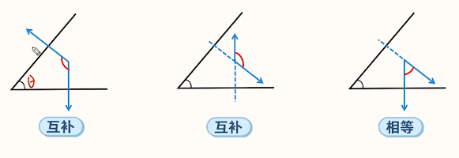

# 【数学】立体几何之建系法技巧方法

## 一般步骤

建系 $\to$ 写出点坐标 $\to$ 求向量坐标（直线方向向量，平面法向量） $\to $ 用向量解决问题。

## 建系

常见方法：

- 利用三垂直建系：题目中本来就有三条垂直的直线，则直接利用其建系。
- 利用**线面垂直**建系：直线（所在方向）为一条轴，平面内取**两条垂直直线**（所在方向）为另外两条轴。
- 利用**面面垂直**建系：两平面的**交线**为一条轴，两平面内分别作**交线的垂线**为另外两条轴。例如两个不同面的共底边的等边三角形，可以选择底边中点为原点。
- **圆柱、圆锥、圆台**建系：**高（所在方向）**作为一条轴，**底面**上选**两条垂直直线**作为另外两条轴。

原则：

1. 有已知的垂直就找已知的垂直，没有已知的垂直就自己画出垂直。
2. 建系后让图中点的坐标越简单越好。

## 点的坐标

有些点的坐标可以直接看出，有些点坐标是通过计算得到的。

一般有六种情况：

1. 坐标轴上的点：一般只需要找到距离原点的距离即可，往往能直接看出。

2. 坐标平面上的点：如果不能看出，则需要将坐标平面画出，然后向两个坐标作垂线求出两个坐标。

3. 平行四边形：借助向量的平行四边形法则，如下图所示，$\overrightarrow{AC} = \overrightarrow{AB} + \overrightarrow{AD}$，所以只需要知道 $A,B,C$ 的坐标即可求出 $D$ 点坐标。

4. 中点坐标：若 $C$ 是 $AB$ 中点，则 $C = \dfrac{A + B}{2}$。

5. 定比分点坐标：若点 $P$ 在线段 $AB$ 上，且 $\dfrac{AP}{BP}=\dfrac{m}{n}$，则 $A,P,B$ 的坐标满足 $P=\dfrac{n}{m+n}A+\dfrac{m}{m+n} B$。

6. 动点坐标：若 $P$ 为线段 $AB$ 上一个动点，则设 $\overrightarrow{AP} = t \overrightarrow{AB},0 \le t \le 1$，则 $P = (1 - t) A + t B$。

   题目中涉及动点坐标一般有两种情况：

   - 已知角度、距离：考虑列方程求出 $t$。
   - 求角的最大（最小）值，将所求角表示为 $t$ 的函数，求函数最值。

## 向量坐标

直线的方向向量：用末点坐标减去初点坐标。

先求出平面上两个不共线向量的坐标，然后根据法向量与平面上的向量垂直列方程求解。

主要介绍已知两个向量坐标 $(x_1,y_1,z_1)$ 和 $(x_2,y_2,z_2)$ 后，求解法向量的**叉乘**做法：

先将已知的两个向量坐标上下写两遍（可以考虑把两个向量同时化简约分后再计算），即：
$$
x_1~~~~~~y_1~~~~~~z_1~~~~~~x_1~~~~~~y_1~~~~~~z_1\\
x_2~~~~~~y_2~~~~~~z_2~~~~~~x_2~~~~~~y_2~~~~~~z_2
$$
然后删掉第一列和最后一列，即：

然后对于中间四列，每相邻两列做 左上 $\times$ 右下 $-$ 左下 $\times$ 右上：

得到：平面的一个法向量 $\overrightarrow{n}=(y_1\times z_2-y_2\times z_1,z_1\times x_2-z_2\times x_1,x_1\times y_2-x_2\times y_1)$。

然后再约分化为最简即可。

> 注意：
>
> - 某些容易直接看出来的法向量可以直接写出。（例如坐标平面的法向量、题目中已知某个向量垂直于某个平面等）
> - 在写两个向量坐标时，如果可约分则约分。

## 解决问题

### 位置关系

考虑转化为**直线方向向量**和**平面法向量**之间的关系求解。

### 求角度

先求**向量所成角**，再求目标角。

#### 异面直线所成角

设异面直线 $l_1,l_2$ 所成角为 $\theta$，则 $\cos \theta = |\cos <\vec{l_1},\vec{l_2}>|$。

> 注意：异面直线所成角的范围是 $\theta \in \left(0,\dfrac{\pi}{2}\right]$，向量夹角 $\in [0,\pi]$。

#### 线面角

设直线 $l$ 与平面 $\alpha$ 所成角为 $\theta$，$\vec{n}$ 为平面 $\alpha$ 的法向量，则 $\sin \theta = |\cos <\vec l,\vec n>|$。

#### 二面角

步骤：

1. 先求出 $\cos < \vec{n_1},\vec{n_2}>$。
2. 判断 $\theta$ 是锐角还是钝角，与 $<\vec{n_1},\vec{n_2}>$ 是相等还是互补。

注意事项：

由于二面角的范围是 $\theta \in [0,\pi]$，所以通过向量法求二面角时，需要考虑二面角是锐角还是钝角。

可以通过判断**二面角**与**两个法向量夹角**的关系来判断二面角余弦值的正负。

当二面角与法向量夹角相等时，二面角余弦值等于向量夹角余弦值；

当二面角与法向量夹角互补时，二面角余弦值是向量夹角余弦值的相反数。

具体判断可以采用画图的方法。例如：

> 如果是求二面角的正弦值则不需要判断，因为正弦值一定为正。

作图要点：

- 在二面角**内部**选择向量夹角的起点；
- 搞清楚从起点出发的法向量是穿过还是远离平面。

### 求距离

#### 点到平面的距离

求点 $A$ 到平面 $\alpha$ 的距离 $h$，在 $\alpha$ 上任取一点 $P$，则 $h = \dfrac{|\overrightarrow{AP}\cdot \vec n|}{|\vec n|}$。

#### 点到直线的距离

如图，点 $A$ 为直线 $BC$ 外一点，过点 $A$ 作 $AH\perp BC$ 于 $H$，则 $AH$ 为点 $A$ 到直线 $BC$ 的距离，且 $AH=\sqrt{|\overrightarrow{BA}|^2-\dfrac{(\overrightarrow{BA}\cdot \overrightarrow{BC})^2}{|\overrightarrow{BC}| ^2}}$。

## 旧

1. 建系法的一般步骤：建系 $\to$ 写出点坐标 $\to$ 求向量坐标（直线方向向量，平面法向量） $\to $ 用向量解决问题。

2. 求线段定比分点坐标：

   - 将线段之间关系转化为向量之间的关系，求出相关向量的坐标。然后将定比分点坐标用相关向量和另一个点表示，从而求出该定比分点的坐标。

   - 定比分点的坐标公式：

     若点 $P$ 在线段 $AB$ 上，且 $\dfrac{AP}{BP}=\dfrac{m}{n}$，则 $A,P,B$ 的坐标满足 $P=\dfrac{n}{m+n}A+\dfrac{m}{m+n} B$。

3. 求平面法向量：先求出平面上两个不共线向量的坐标，然后根据法向量与平面上的向量垂直列方程求解。

   主要介绍已知两个向量坐标 $(x_1,y_1,z_1)$ 和 $(x_2,y_2,z_2)$ 后，求解法向量的**叉乘**做法：

   先将已知的两个向量坐标上下写两遍（可以考虑把两个向量同时化简约分后再计算），即：
   $$
   x_1~~~~~~y_1~~~~~~z_1~~~~~~x_1~~~~~~y_1~~~~~~z_1\\
   x_2~~~~~~y_2~~~~~~z_2~~~~~~x_2~~~~~~y_2~~~~~~z_2
   $$
   然后删掉第一列和最后一列，即：

   

   然后对于中间四列，每相邻两列做 左上 $\times$ 右下 $-$ 左下 $\times$ 右上：

   

   得到：平面的一个法向量 $\overrightarrow{n}=(y_1\times z_2-y_2\times z_1,z_1\times x_2-z_2\times x_1,x_1\times y_2-x_2\times y_1)$。

   然后再约分化为最简即可。

   > 注意：
   >
   > - 某些容易直接看出来的法向量可以直接写出。（例如坐标平面的法向量、题目中已知某个向量垂直于某个平面等）
   > - 在写两个向量坐标时，如果可约分则约分。

4. 向量法证明直线与平面平行时，当求出对应方向向量与法向量垂直时，还要判断**直线不在平面内**才能确认直线平行于平面。

5. 证明 $A,B,C,D$ 四点共面，相当于证明 $D$ 在平面 $ABC$ 内，即证明 $\overrightarrow{AD} \perp \overrightarrow{n}$，其中 $\overrightarrow{n}$ 是平面 $ABC$ 的法向量。

6. 证明直线 $l$ 与平面 $\alpha$ 相交 $\Longrightarrow$ $\overrightarrow{l}\cdot \overrightarrow{n}\ne 0$。

7. 如图，证明直线 $AB$ 和直线 $CD$ 异面 $\Longrightarrow$ $\overrightarrow{AB}\cdot \overrightarrow{n}\ne 0$。

   

8. 建系法求角度的一般思路是①先求出对应向量夹角的余弦值②找到所求角和向量夹角之间的关系。

9. 由于二面角的范围是 $\theta \in [0,\pi]$，所以通过向量法求二面角时，需要考虑二面角是锐角还是钝角。

   可以通过判断**二面角**与**两个法向量夹角**的关系来判断二面角余弦值的正负。

   当二面角与法向量夹角相等时，二面角余弦值等于向量夹角余弦值；

   当二面角与法向量夹角互补时，二面角余弦值是向量夹角余弦值的相反数。

   具体判断可以采用画图的方法。例如：

   

   作图要点：

   - 在二面角内部选择向量夹角的起点；
   - 搞清楚从起点出发的法向量是穿过还是远离平面。

10. 空间内点到直线的距离公式：

11. 利用坐标法解决动点问题的一般思路是：

    - 已知角度、距离，求动点坐标：设出动点坐标 $\to$ 列方程 $\to$ 解方程。
    - 求角的最大最小值：把角度表示成有关动点坐标的函数。（例如下图中有可能会表示成 $t$ 的函数）

    需要注意的是当动点在**线段**上时，设出的点的坐标可能有范围，需要解方程时需要考虑未知数的范围求解。

    当一个点在一个斜线上时，可以通过三点共线的充要条件，即 $\overrightarrow{a}=\lambda \overrightarrow b$，设出 $\lambda$，然后列方程求解，若这个斜线对应的是一段线段，则 $0 \le \lambda \le 1$。然后利用求线段定比分点的方法求解。

    形式化地，如图，若 $P$ 为线段 $AB$ 上一动点，设 $\overrightarrow{AP}=t\overrightarrow{AB},0 \le t \le 1$，则 $P=(1-t)A + t B$。

    

12. 利用坐标法求空间中的位置关系时，首先要建系，就是说要找到三组两两垂直且公共端点的直线，可以先猜测可能的垂直关系，然后利用各种立体几何中证明线线垂直的方法证明。

    基本原则：若有已知的垂直通过已知的垂直建系，若没有已知的垂直，则自己画坐标轴建系。

    常见的技巧：

    - 利用**线面垂直**建系：若已知一条直线与一个平面垂直，那么可以将该直线的一个方向作为坐标系的其中一条轴。然后再在平面内取**两条垂直直线**所在的方向作为两外两条轴。

    - 利用**面面垂直**建系：可以选择以两平面的交线作为一条轴，两平面内分别做交线的垂线为另外两个轴。

      > 特殊情况：若这两个面上含有一对共底边的等腰三角形，可将**底边中点**作为原点，底边所在直线的一个方向作为一个坐标轴，原点与两个等腰三角形的顶点连线的所在方向作为另外两个坐标轴。

    - 若题目中已知**圆柱、圆锥、圆台**，可以将**高**所在的方向作为一条坐标轴，地面上选两条垂直直线作为另外两条轴。

13. 空间直角坐标系中，求点的坐标常见的有以下几种情况：

    - 坐标轴上的点：一般可以直接看出；

    - 坐标平面内的点：有时候可以直接看出，坐标平面不能直接看出来的，可以将其平面图画出来，从这个点向平面内两坐标轴作垂线，然后求解。

    - 对于平行四边形上的点，如图，有：$\overrightarrow{AC}= \overrightarrow{AB} + \overrightarrow{AD}$。

      

    - 中点坐标：可以利用中点坐标公式；

    - 定比分点坐标：见 2。

    - 动点坐标：同 11。

14. 已知线段之比，可以考虑根据比例设出线段长度。
