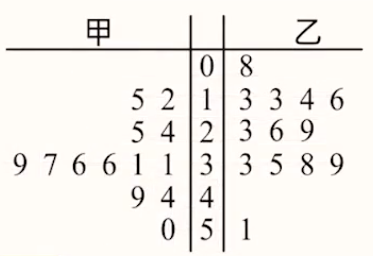
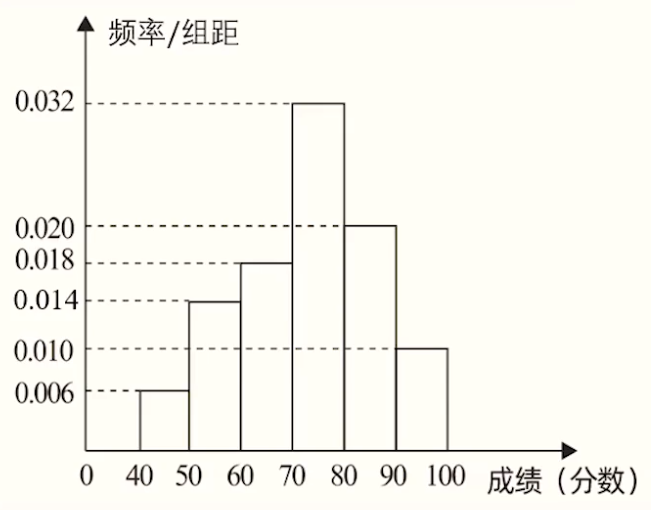
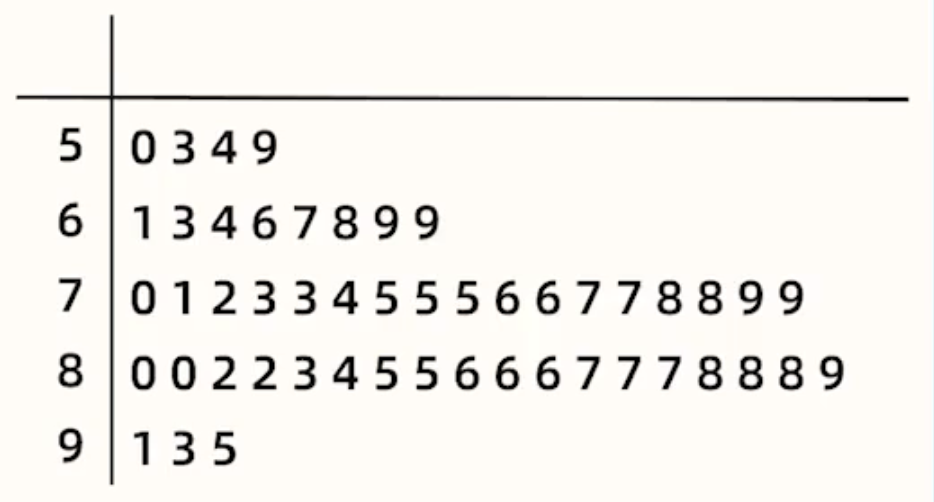

# 【数学】统计与概率

## 统计

### 定义

为了实现某种调查目的，进行**收集**数据，**整理**数据，**分析**数据。

### 收集数据

方法：全面调查和抽样调查。

全面调查：调查**所有**对象。优点：全面。缺点：工作量大。

抽样调查：从全体中**抽取一部分**样本调查。抽样调查必须保证**每个个体有相同的几率被抽到**。

高中阶段介绍了三种抽样调查：简单随机抽样、系统抽样和分层抽样。

#### 简单随机抽样

适用范围：当总体中的个体之间**差异程度较小**，并且总体中**个体数目较少**时，通常采用这种方法。

内容：抽签，随机数法。

#### 系统抽样（等距抽样）

适用范围：总体数量和需要抽取的数量都比较大。

内容：线分段在第一段中随机抽取一个，再依次加上分段间隔。

例如：在 $1000$ 名学生中抽取 $100$ 人，根据系统抽样，可以首先将 $1000$ 个人平均分为 $100$ 段，每段 $10$ 人，将每一段的所有人从 $1$ 到 $10$ 编号，然后在 $1$ 到 $10$ 中随机抽取一个编号，对每一段都抽取这个编号。则抽到的 $100$ 个人即为所求。

#### 分层抽样（按比例抽样）

适用范围：调查对象可分成**有明显差别的**、**互不重叠的**几部分。

内容：每一部分可称为层，在各层中按层在总体中所占比例进行随机抽样。

例如：某校有 $300$ 名男生，$700$ 名女生，需要抽取 $100$ 人调查身高情况。

由于身高与性别有关，所以需要分层。可以按照男女比例为 $3:7$ 抽取 $30$ 个男生，$70$ 个女生，调查身高。

### 整理数据

#### 茎叶图

以上图为例。中间一列叫做茎，表示高位数字，甲和乙共用。两边的列叫做叶，表示低位数字，甲和乙各自用。

观察时可一行一行看，那么甲对应的数为 $0,12,15,24,25,\cdots$，乙对应的数为 $8,13,13,14,16,23,26,29,\cdots$。

#### 频率分布直方图

频数：对应区间有几个对象（出现的次数）。

频率：对应区间占总人数的比（比值）。所有的频率之和为 $1$。

频数分布直方图的纵坐标表示频数，即每个组的个数；频率分布直方图纵坐标**不表示频率**，而表示 $\dfrac{频率}{组距}$，组距即为每一组对应区间的端点之差。

做有关频率分布直方图的问题时，应该先找到组距，再根据组距 $\times$ 纵坐标求得每一组的频率。

在频率分布直方图中，每个矩形的面积即为频率。

> 技巧方法：
>
> - 利用频率分布直方图估计**平均数**时，可以通过直方图求出每组的频率，然后通过每组频率 $\times$ 对应组的**组中值** 再相加的方式估算。注意：若题目告诉用每组的某个对应值代替每组的平均数，则直接代入即可；若没有告诉，则利用对应组的组中值代替平均数。
> - 利用频率分布直方图**比较两个平均数的大小**时，不一定非要计算出每一组的平均数然后再比较大小，有时候**作差法**更简便，只需要判断 $\overline{x_1} - \overline {x_2}$ 和 $0$ 的大小关系即可。
> - 利用频率分布直方图估计**中位数**时，由于每一组的矩形面积即为每一组的频率，则需要找到一条直线 $x = a$ 平分图中所有矩形面积，通过图形找出对应 $x = a$ 所在组然后根据面积估算即可。
> - 利用频率分布直方图**比较两个方差的大小**时，若非解答题，一般情况下可以不用计算出每组数的方差，只需要观察两组的频率分布直方图，找出两组数离散程度（分布的均匀程度）比较即可。

### 分析数据

#### 统计量

表示数据集中程度：平均数，中位数，众数。

表示数据离散程度：极差，方差，标准差。

#### 平均数

定义：给定一组数 $x_1,x_2, \cdots,x_n$，则其平均数为 $\overline x = \dfrac 1 n (x_1 + x_2 +\cdots + x_n)$，常记为 $\overline x = \dfrac 1 n \sum \limits_{i = 1}^n x_i$。

用频率计算平均数：将每个数与其出现的频率相乘，再相加。

性质：

- 把一组数同时加上 $b$，则平均数也加 $b$。
- 把一组数同时乘上 $a$，则平均数也乘 $a$。

#### 中位数

定义：

- 如果一组数有奇数个，且按照从小到大排列 $x_1,x_2,\cdots,x_{2n + 1}$，则 $x_{n+1}$ 为中位数。
- 如果一组数有偶数个，且按照从小到大排列 $x_1,x_2,\cdots,x_{2n}$，则 $\dfrac{x_n + x_{n + 1}}{2}$ 为中位数。

性质：

- 把一组数同时加上 $b$，则中位数也加 $b$。
- 把一组数同时乘上 $a$，则中位数也乘 $a$。

#### 众数

定义：一组数据中，出现次数最多的数据。众数可以不唯一。

> 如果所有数出现的次数相同，则**没有众数**。

性质：

- 把一组数同时加上 $b$，则众数也加 $b$。
- 把一组数同时乘上 $a$，则众数也乘 $a$。

#### 极差

定义：一组数的极差指的是这组数的最大值减去最小值的差。

性质：

- 把一组数同时加上常数 $b$，则极差不变。
- 把一组数同时乘上常数 $a$，则极差乘 $|a|$。

#### 方差和标准差

定义：如果 $x_1,x_2,\cdots,x_n$ 的平均数为 $\overline x$，则方差 $s^2 = \dfrac 1 n \sum \limits_{i = 1}^n (x_i - \overline x)^2$。其中方差的算术平方根 $s$ 称为标准差。

本质：方差表示的是一组数偏离平均数的偏离程度。

求方差的步骤：

1. 求平均数。
2. 每个数减去平均数再平方。
3. 求第二步得到的所有数的平均数。

用频率计算方差：用每个数减去平均数，然后乘上频率再相加，即 $s^2 = \sum \limits_{i = 1}^{n} (x_i - \overline x)^2\cdot p_i$。

方差的性质：

- 把一组数同时加上常数 $b$，则方差不变。
- 把一组数同时乘上常数 $a$，则方差乘 $a^2$。

标准差的性质：

- 把一组数同时加上常数 $b$，则标准差不变。
- 把一组数同时乘上常数 $a$，则标准差乘 $|a|$。

#### 性质规律总结

把一组数同时加上常数 $b$，则：平均数、中位数、众数都 $+b$，极差、标准差、方差都不变。

把一组数同时乘上常数 $a$，则：平均数、中位数、众数都 $\times a$，极差、标准差都 $\times |a|$，方差 $\times a^2$。

> 小技巧：求两组数平均数的差，除了可以将两者平均数分别算出再作差之外。当**两组数个数相同时**，还可以对两组数对应位置的数相减，再将得到的值相加，除以个数。

### 计算&书写技巧

1. 计算平均数时，对于数据较多，但**数据均分布在某个特定值 $x$ 附近**的样本，可以考虑先求出每个数 $x_i$ 和 $x$ 的差，然后对它们的差求平均数再加上 $x$。即 $\overline x = \dfrac 1 n \sum \limits_{i = 1}^n (x_i - x) +x$，且一般情况下多个 $s = (x_i - x)$ 相加，很多 $s$ 相同，可以直接抵消。
2. 计算方差 $s^2$ 时，书写过程时可以省略 $(x_i - \overline x)$，即直接把 $(x_i - \overline x)$ 的结果写在考卷上，且一般情况下 $(x_i - \overline x)$ 比较容易口算。

### 例题

例 1：$4$ 名同学各掷了 $5$ 次骰子，分别记录每次骰子出现的点数。若下列是根据 $4$ 名同学各自的统计结果的数字特征，则可以判断出一定没有点数 $6$ 的是（）

A. 平均数为 $3$，中位数为 $2$

B. 中位数为 $3$，众数为 $2$

C. 中位数为 $3$，方差为 $2.8$

D. 平均数为 $2$，方差为 $2.4$

---

分析：

对于选项 A，设五个数中其它三个数为 $a,b,c$，其中 $a,b \le 2$，$2 \le c \le 6$，则有 $a + b + 2 + c + 6 = 3 \times 5 = 15$，所以 $a + b + c = 7$，令 $a = 2,b = 2,c = 3$ 满足条件。

对于选项 B，假设出现了两次 $2$，则可以构造 $2,2,3,4,6$ 满足条件。

对于选项 C，设其它三个数为 $a,b,c$，则有 $(a - x)^2 + (b - x)^2 + (3 - x)^2 + (c - x)^2 + (6 - x)^2 = 2.8 \times 5 = 14$，且 $a + b + 3 + c + 6 = 5x$ 即 $(a - x) + (b - x) + (3 - x) + (c - x) + (6 - x) = 0$，令 $a = 1,b = 2,c = 3$ 满足条件。

对于选项 D，设其它四个数为 $a,b,c,d$，则从平均数的角度来说，有 $a + b + c + d + 6 = 10$，此时 $a = b = c = d = 1$，此时方差 $s^2 \ne 2.4$，故 D 一定没有点数 $6$；从方差的角度来说，有 $(a - 2)^2 + (b - 2)^x + (c - 2)^2 + (d - 2)^2 + (6 - 2)^2 = 2.4 \times 5 = 12$，由于 $4^2 = 16 > 12$，所以一定没有点数 $6$。

> 经验：一般此类题，错误选项都是涉及到**平均数和方差**的那个选项，所以考试的时候可以考虑先验证该选项。

---

例 2：如图所示， 在 $50$ 名样本中，从其成绩在 $80$ 分及以上的学生中随机抽取 $3$ 人，用 $X$ 表示其成绩在 $[90,100]$ 中的人数，用 $Y$ 表示其成绩在 $[80,90)$ 的人数，试判断方差 $D(X)$ 和 $D(Y)$ 的大小关系。

分析：

由题意可得 $X + Y = 3$，所以 $Y = -X + 3$，所以根据方差的性质可知，$D(Y) = (-1)^2 D(X) = D(X)$，所以 $D(Y) = D(X)$。

> 注意：大部分比较方差的题目，**不需要将具体的方差求出来**，可以通过「方差的定义」或「方差的性质」比较大小关系。

> 性质：若 $Y = aX + b$，则 $D(Y) = a^2 D(X)$。

## 概率

### 定义

事件发生可能性的大小。这里的事件指的是随机事件。

随机试验：结果随机/不确定的试验。

样本点与样本空间：我们把随机试验中每一种可能出现的结果，都称为**样本点**；把由所有样本点组成的集合称为**样本空间**，通常用大写希腊字母 $\Omega$ 表示。

随机事件：如果随机试验的样本空间为 $\Omega$，则随机事件 $A$ 是 $\Omega$ 的一个**子集**。而且若试验的结果是 $A$ 中的元素，则称 $A$ 发生（或出现等），否则，称 $A$ 不发生（或不出现等）。

### 事件中的三个概念

【互斥事件】

给定事件 $A,B$，若事件 $A$ 与 $B$ 不能同时发生，则称 $A$ 与 $B$ 互斥。所以互斥事件两个事件的交集为空。

一般地，如果 $A_1,A_2,\cdots,A_n$ 是两两互斥的事件，则 $P(A_1 + A_2 + \cdots + A_n) = P(A_1) + P(A_2) + \cdots + P(A_n)$，即 $n$ 个事件**至少发生一个的概率**等于每一个事件各自发生的概率之和。

【对立事件】

 给定事件 $A,B$，若事件 $A$ 与 $B$ 不能同时发生，且 $A$ 与 $B$ 必有一个会发生，则称 $A$ 与 $B$ 对立，$A$ 的对立事件记作 $\overline A$。所以对立事件中的两个事件互为补集。

所以对立事件**一定是互斥事件**，即对立事件是互斥事件的充分不必要条件，$A$ 与 $B$ 对立 $\implies A$ 与 $B$ 互斥。

对于一个事件 $A$，有 $P(A) + P(\overline A) = 1$。

【相互独立事件】

若事件 $A$ 是否发生对事件 $B$ 的发生概率无影响，则称事件 $A,B$ 相互独立。当 $P(AB) = P(A)P(B)$ 时，就称事件 $A$ 与 $B$ 相互独立（简称独立），即 $A$ 与 $B$ 相互独立 $\iff P(AB) = P(A)P(B)$，其中 $P(AB)$ 表示事件 $A,B$ 同时发生的概率。

计算每个事件发生的概率可以通过**目标事件数除以总事件数**，总事件数可以利用表格列举法求解。

### 计算概率的方法

【用频率估计概率】

一般地，如果在 $n$ 次重复进行的试验中，事件 $A$ 发生的概率为 $\dfrac m n$，则当 $n$ 很大时，可以认为事件 $A$ 发生的概率 $P(A)$ 的估计值为 $\dfrac m n$。

【用事件数计算概率（古典概型）】

古典概型：当结果有有限多个，且每种结果出现的可能性相等时即可用此方法。一般情况下题目会给定一个事件，问满足某些条件的概率是多少。

适用范围：题目当中没有给定任何**已知的概率**。
$$
P = \dfrac{目标事件数}{总事件数}
$$
> 辨析——**抽取类问题**不同类型：
>
> 【类型一：**有放回**抽取】
>
> 一般有「古典概型」和「独立事件」两种方法。大部分情况采用「古典概型」，少部分情况采用「条件概率」。
>
> 例：一个袋子中有 $3$ 各红球，$2$ 各白球，除颜色外均相同，从中**有放回**抽取 $2$ 个球，则抽到一红一白的概率是多少。
>
> 求解：这里采用古典概型。
> $$
> P = \dfrac{3 \times 2 + 2 \times 3}{5 \times 5} = \dfrac{12}{25}
> $$
> 即总事件数：两次抽取，每次都是从 $5$ 个球中等概率抽取，所以总事件数为 $5\times 5$；目标事件数：两种情况，先红后白，先白后红，两种情况的事件数分别相加即可。
>
> 【类型二：**不放回**抽取】
>
> 例：一个袋子中有 $3$ 各红球，$2$ 各白球，除颜色外均相同，从中**无放回**抽取 $2$ 个球，则抽到一红一白的概率是多少。
>
> 求解：同样用目标事件数除以总事件数，此时目标事件数不变，总事件数变成「先从 $5$ 个里面抽 $1$ 个，再从剩下 $4$ 个里面抽 $1$ 个」，如下：
> $$
> P = \dfrac{3 \times 2 + 2 \times 3}{5 \times 4} = \dfrac 3 5
> $$
> 注意：若将题目中「抽到一红一白的概率」改为「抽到两个红球的概率」，则**有放回**抽取和**不放回**抽取的目标事件数不同，此时 ，有放回抽取的概率为 $3 \times 3$，无放回抽取的概率是 $3\times 2$。
>
> 【类型三：一次性抽取】
>
> 一般情况下用**组合数**进行计算。
>
> 例：一个袋子中有 $3$ 各红球，$2$ 各白球，除颜色外均相同，从中**一次性**抽取 $2$ 个球，则抽到一红一白的概率是多少。
>
> 求解：总事件数是从 $5$ 个球里面抽 $2$ 个，即 $\mathrm C_5^2$，目标事件数是从 $3$ 个红球里面抽 $1$ 个，从 $2$ 个白球里面抽 $1$ 个，即 $\mathrm C_3 ^1 \times \mathrm C_2^1$，所以有：
> $$
> P = \dfrac{\mathrm C_3^1\cdot \mathrm C_2^1}{\mathrm C_5^2} = \dfrac 3 5
> $$
> 注：若题目没有明确说明抽取方式，只说从几个球里面抽几个，一般情况默认是「**一次性**抽取」。
>
> 观察上述例题发现，「不放回抽取」和「一次性抽取」计算所得的概率相同，实际上**多次抽取中**「不放回抽取」$\iff$「一次性抽取」。
>
> 但是有些情况只有在「不放回抽取」中存在，例如题目求「不放回抽取第二次抽到红球的概率」，此时只能按照一次性抽取算。

【用概率计算概率（独立事件）】

适用范围：①已知条件中会告诉某些概率；②某些事件相互独立（互不影响）。

内容：若 $A,B$ 独立，则 $P(AB) = P(A)P(B)$。

> 注意：利用独立事件求概率一定要拆解拆解成多个事件，再把每种事件的结果相乘求解。例如：求甲、乙两球至少有一个落入盒子的概率，则甲乙两球都有落入和不落入两种情况，原题可以拆解成甲落，乙落；甲落乙不落；甲不落乙落。三种情况各自分别用乘法计算，然后将三种情况下的概率相加即可。也可以反面计算，即用 $1$​ 减去两者均不落入盒子的概率。

### 解题&计算技巧

对于有些事件数较少用事件数计算概率的问题，有时候可以采用「表格法」将所有情况列出，解题时找到对应符合要求的情况计算概率再相加求解。

### 例题

例：在一个口袋中装有编号分别为 $1,1,2,3,4,5$ 的六张卡片，这些卡片除编号不同外其它都相同，从口袋中一次性抽 $3$ 张卡片。求抽出的 $3$ 长卡片编号之和为奇数的概率。

分析：

一次性抽取问题，考虑通过事件数来计算概率，使用组合数。

那么总事件数为六张卡片中选取三张，即 $\mathrm C_6^3 = 20$。由于六张卡片中有 $4$ 张奇数，$2$ 张偶数，所以要使得抽到的 $3$ 张卡片编号之和为奇数，那么只有 $3$ 奇 $0$ 偶和 $1$ 奇 $2$ 偶两种情况，所以目标事件数为 $\mathrm C_4^3 \cdot \mathrm C_2^0 + \mathrm C_4^1 \cdot \mathrm C_2^2 = 8$，所以概率为 $P = \dfrac 8 {20} = \dfrac 2 5$。

## 随机变量

### 定义

如果随机试验的样本空间为 $\Omega$，且对于 $\Omega$ 中的每一个样本点，变量 $X$ 都对应有唯一确定的实数值，就称 $X$ 为一个随机变量。

随机变量一般用大写英文字母 $X,Y,Z,\cdots$ 或小写希腊字母 $\xi,\eta,\cdots$ 表示。

随机变量所有可能的取值组成的集合，称为这个随机变量的取值范围。

例如，把扔骰子可能的结果记为 $X$，则 $X$ 可能为 $1,2,3,4,5,6$，这里的 $X$ 即为一个随机变量。

### 分布列

| $X$  | $x_1$ | $x_2$ | $\cdots$ | $x_k$ | $\cdots$ | $x_n$ |
| :--: | :---: | :---: | :------: | :---: | :------: | :---: |
| $P$  | $p_1$ | $p_2$ | $\cdots$ | $p_k$ | $\cdots$ | $p_n$ |

第一行表示随机变量 $X$ 的所有取值，第二行表示每个取值对应的概率。

离散型随机变量的分布列必须满足：

- $p_k \ge 0,k = 1,2,\cdots,n$。
- $\sum \limits_{k = 1}^n p_k = p_1 + p_2 + \cdots + p_n = 1$。

### 期望（均值）

| $X$  | $x_1$ | $x_2$ | $\cdots$ | $x_k$ | $\cdots$ | $x_n$ |
| :--: | :---: | :---: | :------: | :---: | :------: | :---: |
| $P$  | $p_1$ | $p_2$ | $\cdots$ | $p_k$ | $\cdots$ | $p_n$ |

对于上述分布列，则期望 $E(X) = \sum \limits_{i = 1}^n x_i p_i = x_1p_1 + x_2p_2 + \cdots + x_np_n$。

性质：若 $X$ 与 $Y$ 都是随机变量，且 $Y = aX + b(a \ne 0)$，则 $E(Y) = aE(x) + b,D(Y) = a^2 D(X)$。

### 方差

分布列同上。

对于上述分布列，方差 $D(X) = \sum \limits_{i = 1}^n [x_i - E(X)]^2 p_i = [x_1 - E(x)]^2 p1 + [x_2 - E(x)]^2 p2 + \cdots + [x_n - E(x)]^2 p_n$。

其中，$\sqrt{D(X)}$ 叫做随机变量 $X$ 的标准差。

性质：若 $X$ 与 $Y$ 都是随机变量，且 $Y = aX + b(a \ne 0)$，则 $D(Y) = a^2 D(X)$。

## 二项分布

### $n$ 次独立重复试验（$n$ 重伯努利试验）

将**同一**随机试验重复 $n$ 次，每次试验是独立的，每次试验只有 **$2$ 种结果**，每种结果的**概率是不变的**。

### 二项分布的定义

如果一次试验中，出现「成功」的概率为 $p$，且 $n$ 次独立重复试验中出现「成功」的次数为 $X$，称 $X$ 服从参数为 $n,p$ 的二项分布，记作 $X \sim B(n,p)$，其中 $X$ 的取值范围是 $\{0,1,\cdots,k,\cdots,n\}$。

则独立重复试验中出现 $k$ 次成功的概率即为 $P(X = k) = \mathrm C_n^k p^k(1 - p)^{n-k},k = 0,1,\cdots,n$。

> 二项分布求概率的一般方法：先找到随机变量 $X$ 所有的取值，观察需要计算的概率对应到随机变量的哪些取值，然后用加法或减法计算概率（一般选择情况较少的一种方法）。

### 二项分布的期望和方差

若 $X$ 服从参数为 $n,p$ 的二项分布，即 $X \sim B(n,p)$，则 $E(X) = np,D(X) = np(1 - p)$。

> 注意：求解二项分布的数学期望时，一般首先要说明 $X \sim B(n,p)$。

> 求解有关二项分布的题型时，可以考虑表格法，即画出每一次独立试验和对应成功/失败的概率，观察分析求解。

### 例题

例 1：一袋中有 $5$ 个白球，$3$ 个红球，现从袋中往外取球，每次任取一个记下颜色后放回，直到红球出现 $10$ 次时停止，设停止时共取了 $X$ 次球，则 $P(X = 12)$ 是多少。

分析：

题目求 $P(x = 12)$ 相当于求当抽到第 $12$ 次时，红球出现了 $10$ 次，求抽到 $12$ 次暂停的概率是多少。

由于当出现 $10$ 次红球时停止，所以**第 $12$ 次一定抽到的是红球**，所以只需要让前 $11$ 次总共抽到 $9$ 次红球，$2$ 次白球，所以概率 $P(X = 12) = \mathrm C_{11}^9 {\left(\dfrac{3}{8}\right)}^{10}\cdot {\left(\dfrac 5 8\right)}^2$。

> 注意：此类题目虽然看起来与二项分布很像，但并不是二项分布，注意观察题目条件的区别，不要硬套。

---

例 2：国庆期间，某大型服装团购会举办了一次「你消费我促销」活动，顾客消费满 $300$ 元（含 $300$ 元）可抽奖一次，抽奖方案有两种（顾客只能选择其中的一种）。

方案一：从装有 $5$ 个形状、大小完全相同的小球（其中红球 $1$ 个，黑球 $4$ 个）的抽奖盒中，有放回地摸出 $3$ 个球，每摸出 $1$ 次红球，立减 $100$ 元。

方案二：从装有 $10$ 个形状、大小完全相同的小球（其中红球 $2$ 个，白球 $1$ 个，黑球 $7$ 个）的抽奖盒中，不放回的摸出 $3$ 个球，中奖规则为：若摸出 $2$ 个红球，$1$ 个白球，则打 $5$ 折；若摸出 $1$ 个红球，$1$ 个白球和 $1$ 个黑球，则打 $7.5$ 折；其余情况不打折。

求：

1. 某顾客恰好消费 $300$ 元，选择抽奖方案一，求他实付金额的期望。
2. 若顾客消费 $500$ 元，试从实付金额的期望值分析顾客选择何种抽奖方案更合理？

---

分析：

对于第一问：

设抽到 $Y$ 次黑球，则 $Y \sim B\left(3, \dfrac 4 5\right)$，所以 $E(Y) = 3 \times \dfrac 4 5 = \dfrac{12} 5$。

设实付金额为 $X$，则根据题意可知随机变量 $X = 100Y$，所以 $E(X) = 100 E(Y) = 100 \times \dfrac{12}{5} = 240$。

> 总结：对于「有放回抽取」，有时转化为**二项分布**，那么求对应随机变量的期望，可以考虑看题目中要求的随机变量和二项分布的随机变量是否有关，如果有关系，就可以直接根据**期望的性质**直接得到所求的期望。

对于第二问：

设第一种方案实付金额为 $\xi$ 元，第二种方案实付金额 $\eta$ 元。

则由题意可知 $\xi = 200 + X$，所以根据第一问可知 $E(\xi) = 200 + E(X) = 440$。

## 超几何分布

一般地，若有总数为 $N$ 件的甲、乙两类物品，其中甲类 $M$ 件（$M < N$），从所有物品中随机取出 $n$ 件（$n \le N$），则这 $n$ 件中所含甲类物品数 $X$ 时一个离散型随机变量，称 $X$ 服从参数为 $N,n,M$ 的超几何分布，且 $E(X) = \dfrac{nM}{N}$。

直观理解：两类物品，每类物品的数量确定，从两类物品中共抽出固定数量的物品，$X$ 是抽出的物品中其中一类的数量，则 $X$ 的期望 $=$ 抽出的数量 $\times$ 这类物品的比例，一般概率利用组合数计算。

> 超几何分布计算概率一般可用 目标事件数除以总事件数 计算，求分布列可以列出所有随机变量 $X$ 可能的情况，再将每一种情况的概率计算求得。

## 二项分布与超几何分布的区别

二项分布：多次试验，每次试验有两种结果，每种结果的概率确定。

超几何分布：两类物品取固定数量，每类物品的数量确定。

简单来说，二项分布是**有放回的抽取**，而超几何分布是**一次性抽取**。

核心区别：

- 二项分布：**概率确定，数量不确定**，所以一般用**概率**计算概率。
- 超几何分布：**数量确定，概率不确定**，所以一般用**事件数**计算概率。

例如：扔 $100$ 次硬币，正面朝上和朝下的概率都是 $\dfrac 1 2$（概率确定），但正面朝上和朝下的具体**数量不确定**，这就属于二项分布；$50$ 名男生，$50$ 名女生，从中选 $40$ 人（数量确定），每次选到男生女生的**概率不确定**，这就属于超几何分布。

---

例：某精准扶贫帮扶单位，为帮助顶点扶贫村真正脱贫，坚持扶贫同扶智相结合，帮助精准扶贫户利用互联网电商渠道销售当地特产苹果。苹果单果直径不同单价不同，为了更好地销售，现从该精准扶贫户种植的苹果树上随即摘下 $50$ 个苹果测量其直径，经统计，其单果直径分布在区间 $[50,95]$ 内（单位：$\pu{mm}$），统计地茎叶图如图所示：

以此茎叶图中单果直径出现的频率代表概率，直径位于 $[65,90)$ 内的苹果称为优质苹果，对于该精准扶贫户的这批苹果，某电商提出两种收购方案：

方案 A：所有苹果均以 $5$ 元/千克收购；

方案 B：从这批苹果中随机抽取 $3$ 个苹果，若都是优质苹果，则按 $6$ 元/千克收购；若有 $1$ 个非优质苹果， 则按 $5$ 元/千克收购；若有 $2$ 个非优质苹果，则按 $4.5$ 元/千克收购；若有 $3$ 个非优质苹果，则按 $4$ 元/千克收购。

请你通过计算为该精准扶贫户推荐最好的方案。

---

分析：

所谓最好的方案，就是将方案 A 的苹果单价与方案 B 的**期望苹果单价**作比较，然后选择苹果单价更高的作为最好方案。

由于方案 A 的苹果单价已知，那么问题转化为计算方案 B 的期望苹果单价。

观察题目可知，方案 B 是从**这批苹果**中随机抽取 $3$ 个苹果，并不是从题目茎叶图已知的 $50$ 个苹果中抽取 $3$ 个，所以相当于**数量不确定**，又由于题目告诉了让用**频率代表概率**，所以相当于**概率确定**；又由于这批苹果的基数很大，所以抽取 $1$ 个苹果后不放回**对抽取下一个苹果的概率影响极小**，所以综合而言，可以近似认为它属于**二项分布**。

那么将茎叶图中的 $50$ 个苹果的直径分为在 $[65,90)$ 内和不在 $[65,90)$ 内的，发现有 $40$ 个优质苹果，$10$ 个非优质苹果，所以可以认为优质苹果的概率为 $\dfrac 4 5$，非优质苹果的概率为 $\dfrac 1 5$。设 B 方案的收购价格为 $X$，则：
$$
P(X = 6) = {\left(\dfrac 4 5\right)}^3 = \dfrac{64}{125}\\
P(X = 5) = \mathrm C_3^2 \cdot {\left(\dfrac 4 5\right)}^2 \cdot \dfrac 1 5 = \dfrac{48}{125}\\
P(X = 4.5) = \mathrm C_3^1 \cdot \left(\dfrac 4 5\right) \cdot {\left(\dfrac 1 5\right)}^2 = \dfrac{12}{125}\\
P(X = 4) = {\left(\dfrac 1 5\right)}^5 = \dfrac 1 {125}
$$
 由于二项分布的期望计算公式里的 $X$ 表示的是某种结果**出现的次数**，不适用于这里的收购价格，那么需要使用期望的定义求解。

则
$$
E(X) = 6 \times \dfrac{64}{125} + 5 \times \dfrac{48}{125} + 4.5 \times \dfrac{12}{125} + 4 \times \dfrac 1 {125} = 5.456 > 5
$$
推荐方案 B。

> 总结：
>
> 此类题目地特点：从全体中抽取一部分样本，已知样本数据。
>
> 如果题目是从**样本中**抽取几个，则样本**数量确定**，属于**超几何分布**，用事件数计算概率。
>
> 如果题目是从**全体中**抽取几个，且已知「用频率代替概率」，则属于**二项分布**，用概率（频率）计算概率。