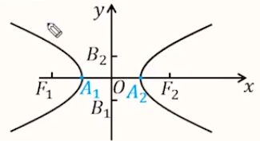
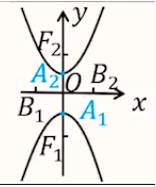
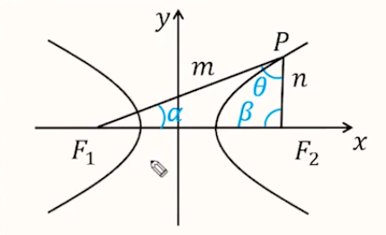

# 【数学】解析几何之双曲线

## 一些定义

1. 定义：如果 $F_1,F_2$ 是平面内的两个定点，$a$ 是一个正常数，且 $2a <|F_1F_2| = 2c$，则平面内满足 $||PF_1|-|PF_2||=2a$ 的动点 $P$ 的轨迹称为双曲线。其中，两个定点 $F_1,F_2$ 称为双曲线的焦点，两个焦点的距离 $|F_1F_2|$ 称为双曲线的焦距。

2. 拓展：
   - 若 $||PF_1|-|PF_2||=|F_1F_2|$，则点 $P$ 的轨迹是两条分别以 $F_1,F_2$ 为端点在直线 $F_1F_2$ 上的射线；
   - 若 $||PF_1|-|PF_1||> |F_1F_2|$，则点 $P$ 的轨迹是空集。

3. 标准方程：

   【重要等式】$c^2=a^2+b^2$。

   【判断焦点位置】$x^2,y^2$ 谁的系数为正，焦点就在对应的坐标轴上。

   【焦点在 $x$ 轴上】

   - 标准方程：$\dfrac{x^2}{a^2}-\dfrac{y^2}{b^2}=1(a>0,b>0)$；
   - 图形：
   - 焦点坐标：$F_1(-c,0),F_2(c,0)$；
   - 顶点坐标：$A_1(-a,0),A_2(a,0)$；
   - 渐近线方程：$y=\pm \dfrac{b}{a}x$

   【焦点在 $y$ 轴上】
   
   - 标准方程：$\dfrac{y^2}{a^2}-\dfrac{x^2}{b^2}=1(a>0,b>0)$
   
   - 图形：
   
   - 焦点坐标：$F_1(0,-c),F_2(0,c)$；
   
   - 顶点坐标：$A_1(0,-a),A_2(0,a)$；
   
   - 渐近线方程：$y=\pm \dfrac{a}{b}x$
   
   【实虚轴】

   线段 $A_1,A_2$ 叫做双曲线的实轴，它的长 $|A_1A_2|=2a$，实半轴为 $a$；

   线段 $B_1,B_2$ 叫做双曲线的虚轴，它的长 $|B_1B_2|=2b$，虚半轴为 $b$。

   【焦距】$|F_1F_2|=2c$，$c$ 是半焦距。

   【离心率】$e=\dfrac{c}{a},e\in (1,+\infty)$。

4. 标准方程统一式：$Ax^2+By^2=1(AB<0)$。

   - 焦点在 $x$ 轴上：$A>0,B<0$；
   - 焦点在 $y$ 轴上：$A<0,B<0$。
   - 注意：若题目中给的是 $Ax^2-By^2=1$，若表示双曲线则 $AB>0$。

5. 渐近线：

   - 已知双曲线方程求渐近线方程：等号右边的 $\lambda$ 变成 $0$，再化简，可得渐近线方程。
   	 即，若双曲线方程为 $\dfrac{x^2}{a}-\dfrac{y^2}{b}=\lambda(\lambda\ne 0)$，则渐近线方程是 $\dfrac{x^2}{a}-\dfrac{y^2}{b}=0$ 化简之后的结果。
   	
   - 已知渐近线方程求双曲线方程：先平方，再移项，$0$ 变成 $\lambda$。

     即，渐近线 $y=kx$，可设双曲线 $k^2x^2-y^2=\lambda(\lambda \ne 0)$ 或 $x^2-\dfrac{y^2}{k^2}=\lambda(\lambda \ne 0)$。

   - 对于双曲线 $\dfrac{x^2}{a^2}-\dfrac{y^2}{b^2}=\lambda(\lambda \ne 0)$，若 $\lambda >0$，则焦点在 $x$ 轴上；若 $\lambda <0$，则焦点在 $y$ 轴上。

   - 对于双曲线系方程 $\dfrac{x^2}{a^2}-\dfrac{y^2}{b^2}=\lambda(\lambda \ne 0)$，所表示的所有双曲线的渐近线相同。其中，$\dfrac{x^2}{a^2}-\dfrac{y^2}{b^2}=1$ 表示双曲线的标准方程。所以与 $\dfrac{x^2}{a^2}-\dfrac{y^2}{b^2}=1$ 有相同渐近线的双曲线可设为：$\dfrac{x^2}{a^2}-\dfrac{y^2}{b^2}=\lambda(\lambda \ne 0)$。

6. 焦点三角形：

   

   如图，在焦点三角形 $△PF_1F_2$ 中，$S_{\triangle PF_1F_2}=\dfrac{b^2}{\tan \dfrac{\theta}{2}}$，

7. 注意事项：
   - 若题目中提到两个曲线有公共焦点（双曲线或椭圆都可以），则说明①这两个曲线的 $c$ 相同；②这两个曲线焦点的位置相同（即要么都在 $x$ 轴上要么都在 $y$ 轴上）。
   - 做题时需要注意双曲线上点横坐标 $x$ 的取值范围是 $[c,+\infty)\cup(-\infty,c]$，所以求相关取值范围时最后还要与该范围取交集。
   - 遇到一些奇怪的式子可以考虑将其化简，再观察其性质。例如 $\overrightarrow{MB^2}=\overrightarrow{MN}\cdot \overrightarrow{MB}$ 可以化简为 $\overrightarrow{MB}\cdot \overrightarrow{NB}=0$，即 $MB \perp NB$。
   - 题目中已知两个向量模长的大小关系时，一般是用来排除增根的。
   - 题目中如果出现了焦点三角形，要想到双曲线的定义（这一点和椭圆相同）。
   - 解决圆锥曲线选择填空的一般方法是：如果题目中有明显的几何性质（例如椭圆和双曲线中的焦点三角形），那么先考虑几何方法，否则把条件代数化，通过代数方法解决。
   - 「几何条件代数化」时，能帮助容易设出**点坐标**的条件要优先考虑。
   - 解题目中有关 $a,b,c$ 的方程时，有时可以尝试猜测，并代入验证，这是一个比直接解方程组可能更快的方法。

