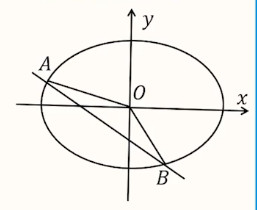

# 【数学】解析几何之圆锥曲线解答题解题套路技巧方法

## 轨迹方程

### 问题特征

已知某动点满足的几何条件，求该动点的轨迹方程（该动点形成的图形的方程）。即：**未知轨迹图形**。

### 求解方法

#### 定义法

1. 适用范围：可以直接看出/猜测出动点满足的轨迹**图形**，即题目给定的条件符合某种圆锥曲线的定义。例如题目中有明显的条件可以猜测动点对应的轨迹方程是椭圆/双曲线/抛物线。
2. 步骤：
   - 根据题目条件猜测是哪种圆锥曲线，并根据条件验证猜测的正确，或根据该种圆锥曲线的特点反推出题目条件是否满足该圆锥曲线；
   - 根据定义求出圆锥曲线的方程；
   - 排除掉不符合要求的点的集合：可以根据题目条件排除（双曲线的一支），或某些特殊点（圆锥曲线顶点、与两坐标轴交点）。

#### 代数法

1. 适用范围：题目给定的条件与某种曲线无关。

2. 步骤：

   求动点 $P$ 的轨迹方程：

   - 设点 $P$ 的坐标为 $P(x,y)$；
   - 对题目条件进行「几何条件代数化」，将几何条件翻译成对应的代数式，化简整理得到关于 $x,y$ 的方程。
   - 排除掉不符合要求的点的集合：可以根据题目条件排除（双曲线的一支），或某些特殊点（圆锥曲线顶点、与两坐标轴交点）。

   其中在第二步「几何条件代数化」时，有三种解题方法。

   【直译法】即，题目中已知的几何条件可以直接翻译成代数式，例如：告诉某两个直线的斜率之积为 $-\dfrac{1}{2}$，可以直接翻译为 $k_1 \cdot k_2 =-\dfrac{1}{2}$。一些小 trick：遇到圆中弦长考虑作弦心距利用垂径定理。

   【相关点法】一般运用于「多动点问题」，此时应该把**所有的动点**都设出来，要求的动点设为 $(x,y)$，其它动点可能可以用已知条件和已设出动点的坐标表示，也有可能需要重新设变量表示。特点是字母较多，可能需要更多的消元。
   
   【消参法】题目中有参数应该要最后消掉参数，同时求轨迹方程时还要考虑参数的范围，需要根据**参数**的范围求出轨迹方程中**自变量**的范围。

## 双动点问题（韦达定理）

1. 问题特征：直线和圆锥曲线有两个交点，且这两个交点均为动点。

2. 基本方法：

   - 设出直线方程；
   - 联立直线与圆锥曲线方程，得到一元二次方程；
   - 根据 $\Delta >0$ 利用韦达定理列式；
   - 将几何条件翻译为代数式，结合韦达定理，解决问题。

3. 设直线方程的要点：

   - 已知直线斜率为 $k$，设 $y=kx+b$；
   - 已知直线过 $y$ 轴上一点 $(0,b)$，设 $y=kx+b$，需要讨论斜率不存在（竖直直线）的情况；
   - 已知直线过 $x$ 轴上一点 $(t,0)$，设 $x=my+t$，需要讨论斜率 $=0$（水平直线）的情况；
   - 已知直线过非坐标轴上一点 $(x_0,y_0)$，设 $y-y_0=k(x-x_0)$，需要讨论斜率不存在的情况。

4. 得到一元二次方程后有关 $\Delta >0$ 要点：

   - 如果从几何上能直接判断直线与圆锥曲线必有两个交点，可以不写；

   - $\Delta >0$ 作用：

     【求值】验证是否满足 $\Delta >0$，不满足要舍去；

     【求范围】$\Delta>0$ 是答案的一部分，一个限制条件；

     【其它】保证不扣分。

5. 其它解题要点：

   - 联立直线与圆锥曲线方程，有分母的方程可以直接去掉简化运算；
   - 一般情况下，题目中已知的「等腰三角形」可以利用**三线合一**的性质进行转化。例如：若已知 $|PM|=|PN|$，则可以作 $PH \perp MN$，然后利用 $k_{PH}\cdot k_{MN}=-1$ 或其它几何条件求解；
   - 若已知两条直线 $l_1$ 和 $l_2$ 关于一条水平直线对称，则有 $k_{l_1}+k_{l_2}=0$。
   - 将几何条件翻译成代数式后，对代数式的计算为了防止出错可以先**消掉其中的 $x$ 或 $y$，保留需要的 $y$ 或 $x$**，计算时应该先合并同类项后再代入韦达定理算出来的结果。
   - 上一步消去参数时，除了可以选用「直线方程」，例如将 $y$ 用 $kx+b$ 替换，在抛物线中也可以选用「抛物线方程」。
   - 计算过程中遇到需要去分母的问题，要注意分母不能等于 $0$。
   - 若翻译后得到的代数式是**非对称方程**，可以通过解方程组的方法消元，消掉 $x$ 求得 $k$。

## 常见几何条件的转化方式

### 位置关系

1. 三点共线：例如，题目告诉 $A,P,Q$ 三点共线。一般情况下有以下三种转化方式：

   未知直线 $PQ$ 方程时：

   - $k_{AP} = k_{AQ}$，需要讨论斜率不存在，尽量可以选择不适用。
   - $\overrightarrow{AP}\parallel \overrightarrow{AQ}$；

   已知直线 $PQ$ 方程时：

   - $A\in l_{PQ}$，即点 $A$ 的坐标满足直线 $PQ$ 的方程。

2. 垂直关系：例如，在下图中，椭圆 $C:\dfrac{x^2}{4}+\dfrac{y^2}{3} = 1$，$l_{AB}:y=kx-1$，$A(x_1,y_1),B(x_2,y_2)$，已知 $OA\perp OB$（或点 $O$ 在以 $AB$ 为直径的圆上）。

   

   则有两种转化方式：

   - $k_{OA} \cdot k_{OB}=-1$；
   - $\overrightarrow{OA}\cdot \overrightarrow{OB}=0$。

### 角关系

1. 锐角：例如已知 $\angle AOB$ 为锐角（或点 $O$ 在以 $AB$ 为直径的圆外），可以翻译为：$\overrightarrow{OA}\cdot \overrightarrow{OB} >0$，且 $O,A,B$ 不共线；

2. 钝角：例如已知 $\angle AOB$ 为钝角（或点 $O$ 在以 $AB$ 为直径的圆内），可以翻译为：$\overrightarrow{OA}\cdot \overrightarrow{OB} <0$，且 $O,A,B$ 不共线；

3. 其它情况：利用倾斜角转化为斜率。具体而言：

   - 等角：当两个角相等，有一条公共边且这条边在 $x$ 轴或 $y$ 轴上时，两个角对应的另外两条边所在直线 $l_1$ 和 $l_2$ 满足 $k_{l_1}+k_{l_2}=0$。

   - 其它角：例如，在下图中，直线 $l_1$ 的斜率为 $k_1$，直线 $l_2$ 的斜率为 $k_2$，则：
     $$
     \tan \gamma = \tan (\beta - \alpha) = \dfrac{\tan \beta - \tan \alpha}{1 + \tan \beta \tan \alpha} = \dfrac{k_2 - k_1}{1 + k_1k_2}
     $$

### 等腰三角形

例：如图，已知椭圆 $C:\dfrac{x^2}{4} + \dfrac{y^2}{3} = 1,l_{AB}:y=kx-1,A(x_1,y_1),B(x_2,y_2)$，设点 $P(4,1)$，且 $|PA|=|PB|$。

转化方式：取 $AB$ 中点 $M$，则 $PM \perp AB$，即 $k_{PM}\cdot k_{AB} = -1$。

求解 $k_{PM}$ 时可以采用如下方法：

根据问题满足「双动点问题」的特征，可以利用韦达定理求出 $x_1 +x_2$ 和 $x_1\cdot x_2$，然后根据 $M$ 是 $AB$ 中点写出 $M$ 坐标与 $AB$ 坐标的等量关系并代入韦达定理表示，然后利用斜率公式求解。

### 平行四边形

例：如图，已知椭圆 $C:\dfrac{x^2}{4}+\dfrac{y^2}{3}=1,l_{AB}:y=kx-1,A(x_1,y_1),B(x_2,y_2)$，在椭圆上存在点 $M$，使得四边形 $OAMB$ 是四边形。

有两种常见的转化方式：

- $\overrightarrow{OB} = \overrightarrow{AM}$；
- $\overrightarrow{OA} + \overrightarrow{OB} = \overrightarrow{OM}$，且 $O,A,B$ 不共线。

> 说明：对于菱形/矩形可以转化为「平行四边形+邻边相等」和「平行四边形+邻边垂直」来处理。

### 对称关系

例：如图，已知椭圆 $C:\dfrac{x^2}{4} + \dfrac{y^2}{3} = 1$，椭圆上两点 $A,B$ 关于直线 $l:y=2x+6$ 对称，其中 $A(x_1,y_1),B(x_2,y_2)$。

有两种常见的转化方式：

- $AB \perp l$：$k_{AB}\cdot k_l=-1$，可以求出 $k_{AB}$，从而设出 $AB$ 方程与椭圆方程联立利用韦达定理。
- $AB$ 中点 $M$ 在直线 $l$ 上：在上一条的基础上，用 $A,B$ 坐标和 $l_{AB}$ 的方程表示出 $M$ 的坐标并带入到直线 $l$ 的方程，得到关于 $b$ 的方程。

### 弦长公式

例：如图，$A(x_1,y_1),B(x_2,y_2)$，$k$ 为 $l_{AB}$ 的斜率，$|AB|=5$。

转化方式：弦长公式，设横截式中 $m=\dfrac{1}{k}$，则：
$$
|AB|=\sqrt{1+k^2}|x_1-x_2|=\sqrt{1+\dfrac{1}{k^2}}|y_1-y_2|=\sqrt{1+m^2}|y_1-y_2|
$$
两种情况，第一种情况适用于斜截式，第二种情况适用于横截式。

其中，联立圆锥曲线方程与直线方程得到一元二次方程后，若方程未知数为 $x$，有 $|x_1-x_2|=\dfrac{\sqrt{\Delta}}{|a|}$，若方程未知数为 $y$，亦有：$|y_1-y_2|=\dfrac{\sqrt{\Delta}}{|a|}$。

> 说明：对于**相互垂直**且**共端点**的两条弦长所在直线，将其中一个利用弦长公式表达的弦长中的 $k$ 全部替换为 $\dfrac{1}{k}$，就可以得到第二个弦长表达式。
>
> 更一般地，对于直线方程 $l_1:y=k(x+b)$ 和 $l_2:y=(k+t)(x+b)$，将直线 $l_1$ 截椭圆得到的弦长利用弦长公式表示后，将其中的 $k$ 换成 $k+2$ 就是 $l_2$ 截得的弦长表达式。

> 注意：当两点之间的斜率已知时，也可以用弦长公式求两点间距离。

### 面积关系

1. 已知具体的面积：例：如图，已知椭圆 $C:\dfrac{x^2}{4} + \dfrac{y^2}{3}=1$，$l_{AB} : y=kx-1,A(x_1,y_1),B(x_2,y_2)$，已知 $S_{\triangle OAB}=4$。

   

   转化方式：过点 $O$ 作 $AB$ 的垂线，即为 $\triangle OAB$ 中 $AB$ 上的高 $h$，则 $|AB|=\sqrt{1+k^2}|x_1-x_2|,h=d_{0\to AB} = \dfrac{|-1|}{\sqrt{1+k^2}},S_{\triangle OAB}=\dfrac{1}{2}\cdot AB\cdot h=\dfrac{1}{2}|x_1-x_2|$。

   >  说明：若题目给定四边形的面积，可以将四边形切割成三角形进行转化。

2. 面积之比：例：同上图，已知椭圆 $C:\dfrac{x^2}{4} + \dfrac{y^2}{3}=1$，$l_{AB} : y=kx-1,A(x_1,y_1),B(x_2,y_2)$，已知直线 $AB$ 与 $x$ 轴交于点 $M$，且 $S_{\triangle AOM} = 4S_{\triangle BOM}$。

   转化方式：先将面积比转化成线段比，即 
   $$
   \dfrac{S_{\triangle AOM}}{S_{\triangle BOM}}=4 \implies \dfrac{AM}{BM} = 4 \implies \overrightarrow{AM} = 4\overrightarrow{MB}
   $$
   利用 $l_{AB}$ 的方程求出 $M$ 用 $k$ 表示的坐标，并代入上述式中。

### 三角形重心

例：如图，$G$ 是 $\triangle ABC$ 的重心。

转化方式：

- $x_G = \dfrac{1}{3}(x_A + x_B + x_C),y_G = \dfrac{1}{3}(y_A+y_B + y_C)$；
- $\overrightarrow{AM}=\overrightarrow{MB},\overrightarrow{BP} = \overrightarrow{PC},\overrightarrow{AQ} = \overrightarrow{QC}$；
- $|AG|:|GP|=|BG|:|GQ|=|CG|:|GM|=2:1$。

## 单动点问题

### 问题特征

直线和圆锥曲线有两个交点，且这两个交点一定一动。

### 求解方法

1. 设直线：

   【适用范围】较为常用、一般的解法，直线和圆锥曲线相交，几何条件不容易用点坐标翻译。

   【步骤】

   - 设出直线方程；
   - 联立直线与圆锥曲线方程，得到一元二次方程；
   - 根据 $\Delta >0$ 利用韦达定理列式；
   - 根据顶点坐标已知求出动点坐标（通常选择两根之积，已知的根为 $0$ 时选择两根之和），利用动点坐标解题。

2. 设点：

   【适用范围】

   - 动点数量较少，且几何条件容易用点坐标翻译；
   - 没有直线与圆锥曲线相交。

   【步骤】

   - 设出动点坐标；
   - **写出动点满足的圆锥曲线方程**；
   - 将题目中的几何条件用点翻译成代数式；
   - 利用翻译出来的式子观察求解。

## 范围类问题

### 解决方法

1. 不等式：适用于题目条件可以转化成不等式，例如：告诉锐角、点在椭圆内或 $\Delta >0$。
2. 函数：图形会运动，条件符合函数的定义，可以表示成某个东西的函数。注意：此时要求出函数的定义域。

**利用函数求解范围类问题的一般思路**

1. 将所求量表示成一个函数：通常设谁，就表示成谁（$k/m/x_0,y_0$）的函数。

   特别注意：找准函数的**定义域**（自变量的取值范围）。

2. 求函数值域/最值。

### 求值域/最值方法总结

【类型一：可以直接求解】

求解方法：按照函数计算顺序直接求解范围。

注意事项：需要注意题目中容易忽视的范围。例如反比例函数 $y= \dfrac{1}{x}$ 中，$y$ 恒大于 $0$；$y=\sqrt{x}$ 中 $x$ 恒大于等于 $0$ 等。

例：求函数 $y = \dfrac{1}{4k^2+3}$ 的范围。

那么：
$$
4k^2 + 3 \ge 3 \longrightarrow 0 < y \le \dfrac{1}{3}
$$
该函数由 $ x= 4k^2 + 3$ 和 $y=\dfrac{1}{x}$ 复合而成。**注意：$y>0$ 不要漏掉。**

*【类型二：分子不为常数的分式型函数】

核心技术：

- 拆分：处理分子或分母是单项式的函数；
- 分离系数：分子和分母都是多项式的函数。

辅助手段：

- 换元（注意写范围）；
- 均值不等式/对勾函数。

求解步骤：

- 先观察分子/分母有没有单项式：若有，则对分式进行拆分。

  若**分母**是单项式，**直接拆分**。

  例如：求 $y = \dfrac{3k^2+2k+1}{k^2}(k>0)$ 的范围。

  那么有：
  $$
  y = \dfrac{3k^2+2k+1}{k^2} = \dfrac{3k^2}{k^2} + \dfrac{2k}{k^2} + \dfrac{1}{k^2} = 3 + \dfrac{2}{k} + \dfrac{1}{k^2}
  $$
  将原函数转化为有关 $\dfrac{1}{k}$ 的二次函数。则令 $t=\dfrac{1}{k}$，那么 $t>0$（不要忘掉范围），有：
  $$
  y= t^2 + 2t + 3>3
  $$
  若**分子**是单项式，**分子分母同时除以分子**（需要考虑分子是否为 $0$）。

  例如：求 $y = \dfrac{k^4}{k^4 + k^2 + 1}$ 的范围。

  当 $k=0$ 时，$y=0$。

  当 $k\ne 0$ 时，有：
  $$
  y = \dfrac{1}{\dfrac{k^4 + k^2 +1}{k^4}} = \dfrac{1}{1 + \dfrac{1}{k^2} + \dfrac{1}{k^4}}
  $$
  令 $t = \dfrac{1}{k^2}(t>0)$，则：
  $$
  y = \dfrac{1}{t^2 + t +1} \ce{->[t^2 + t + 1>1]} 0<y<1
  $$
  综上，$y \in [0,1)$。

  化简函数之后不一定会转化为二次函数求值域，也可能转化为对勾函数或基本不等式。

  例如：求 $y = \dfrac{k^2}{k^4 + k^2 +1}$，$k \in [1,+\infty)$ 的最大值。

  则：
  $$
  y = \dfrac{1}{k^2 + \dfrac{1}{k^2} + 1}\ce{->[k^2 + \frac{1}{k^2}\ge 2\cdot\sqrt{k^2\cdot \frac{1}{k^2}}=2]} y_{\max} = \dfrac{1}{3}
  $$
  注意在使用基本不等式时，需要验证等号是否能取到，例如在此题中就是 $k^2 = \dfrac{1}{k^2}$ 时，$k = 1$，可以取到。

  若等号不能取到，则应利用对勾函数，根据对勾函数的图像求函数取值范围。

  对于分子/分母存在**绝对值**的函数，可以将其它没有绝对值的自变量也加上绝对值。

  例如：求 $S = \dfrac{36|k|}{4k^2 + 3}(k\ne 0)$ 的最大值。

  那么：
  $$
  S = \dfrac{36|k|}{4|k|^2 + 3} = \dfrac{36}{4|k| + \dfrac{3}{|k|}} \longrightarrow 4|k| +\dfrac{3}{|k|} \ge 2\sqrt{4|k| \cdot \dfrac{3}{|k|}} = 4\sqrt{3} \longrightarrow S_{\max} = \dfrac{36}{4\sqrt{3}}= 3\sqrt{3}
  $$
  等号成立时 $k = \pm \dfrac{3}{2}$，可以取到。

- 分子分母都是多项式时：

  观察分子或分母是否可以通过换元从而换成单项式，从而把另一个分母或分子用换元之后的自变量表示。

  例如：求 $S = 2\sqrt{3}\dfrac{\sqrt{1+k^2}}{4+k^2}$ 的范围。

  令 $t = \sqrt{1 + k^2}$，$t \ge 1$，则：
  $$
  S = 2 \sqrt{3}\cdot \dfrac{t}{t^2+3} 
  $$
  然后按照分子为单项式的方法求解即可。

  若另一个分子或分母不能用换元之后的自变量表示。则考虑使用**分离系数**。

  例：求 $y = \dfrac{2k^4 + 7k^2 + 10}{k^4 + 3k^2 + 4}$ 的最大值。

  则：
  $$
  y = \dfrac{2k^4 + 7k^2 + 10}{k^4 + 3k^2 + 4} = \dfrac{2(k^4 + 3k^2 + 4)+ k^2 +2}{k^4 + 3k^2 +4} = 2+ \dfrac{k^2 + 2}{k^4 + 3k^2 +4}
  $$
  令 $t= k^2 + 2$，$t\ge 2$，则 $k^2 = t-2$。

  那么：
  $$
  y = 2 + \dfrac{t}{(t-2)^2 + 3(t-2) + 4} = 2 + \dfrac{t}{t^2 - t +2} = 2 + \dfrac{1}{t+ \dfrac{2}{t} -1}
  $$
  再用对勾函数求解。

总结：

1. 若分子分母都为多项式（不都为多项式跳过此步）：观察分子或分母是否可以通过换元从而换成单项式，若不能换元，则用**分离常数**；反之将分子或分母换元成单项式。
2. 若分子/分母存在**绝对值**（无绝对值跳过此步）：将其它没有绝对值的自变量也加上绝对值。
3. 若分母是单项式：直接拆分。
4. 若分子是单项式：上下同时除以分子。
5. 最后利用二次函数值域/对勾函数/均值不等式求解。

【类型三：求导】笔者还未学习导数，学完导数再来补充。

【类型四：一类需要单独记忆的函数】

例：求 $f(k) = \dfrac{k^4 + 8k^2 + 1}{2k^3 + 2k}$，$k\ge 1$ 的最小值。

特点：

- 次数：
- 系数：，呈现对称/回文。

求解方法：分子分母同时除以 $k^2$，凑出 $k+ \dfrac{1}{k}$。

求解：
$$ {{}
f(k) = \dfrac{k^2 + \dfrac{1}{k^2} + 8}{2k+ \dfrac{2}{k}} = \dfrac{(k+ \dfrac{1}{k})^2 + 6}{2(k + \dfrac{1}{k})}
$$
设 $t = k + \dfrac{1}{k}$，则 $t\ge 2$。接下来直接利用分母是单项式的做法求解。

## 定值问题

### 问题特征

题目要求证明某个东西是个定值。

### 基本方法

直接计算出某个东西的值。

### 解题技巧

1. 对于经过**非坐标轴上点**的直线，不仅可以设点斜式，还可以直接设斜截式 $y=kx+b$，这样代入到圆曲方程中时有时可以简化运算。
1. 对于判断「是否存在常数 $\lambda$，使得某式为定值」问题时，对于整式，可以对式中非 $\lambda$ 的字母做合并同类项，然后令其系数为 $0$ 求出 $\lambda$ 的值；对于分式，除了利用「系数为 $0$」还可以考虑分子分母提出公因式，上下约分。即可以考虑上下对应系数成比例从而列出对应比例式建立方程求解。
1. 判断定值有时要考虑特殊情况：如斜率不存在，与 $x$ 轴平行等情况。
1. 一般有两种基本的解题思路：设点/设直线。对于题目中动点较多的情况， 观察圆锥曲线上有几个动点，若只有一个动点，则设该动点可能是最好的方法。
1. 解决定值问题一种常见的解题方法是「先猜后证」，一般可考虑通过**特殊位置**猜到对应的结论，然后再证明与猜想相同。
1. 对于要证明某个角是定值的问题，一般证明的角度都是**直角**，可用向量点乘 $=0$ 或斜率相乘为 $-1$ 求解。
1. 定值问题设直线时，对于横截式最后一定要讨论与 $x$ 轴平行的情况，对于斜截式一定要讨论斜率不存在的情况。

## 定点问题

### 问题特征

证明某个点是定点。

### 基本方法

**方法一**

消参法，求出定点坐标。

以求证直线 $l$ 过定点为例：

1. 求出直线方程（带有参数）；
2. 按参数整理，例如当参数为 $m$ 时，整理成 $am +b = c$ 的形式，令系数 $a$ 和 $c$ 为 $0$ 得定点。

**方法二**

先猜后证。

通常来讲，**先猜出定点所在的坐标轴**，再求定点。

> 例如：标答写法：由对称性，定点在 $x$ 轴上。

猜出定点所在坐标轴，主要有以下两种方法：

1. 特殊直线：一般指水平直线/竖直直线。例如：$l$ 与 $x$ 轴重合时，满足提议 $\to$ 定点在 $x$ 轴上。
2. 对称性：一般将直线关于坐标轴对称观察其对称后的直线是否满足题目要求。如果两坐标轴均不满足题目要求，则不能用此方法猜出定点位置。例如：将直线 $l$ 关于 $x$ 轴对称，得到的直线 $l'$ 依然满足题目所给的条件，而定点是 $l$ 和 $l'$ 的交点，所以定点在 $x$ 轴上。

证明主要的步骤是：

1. 表示出直线上两点；
2. 用两点坐标表示出直线方程：若定点在 $x$ 轴上，一般是横截式；若定点在 $y$ 轴上，一般是点斜式；
3. 根据定点所在坐标轴，令 $x=0$ 或 $y=0$ 将对应 $y$ 或 $x$ 的表达式化为最简形式，再代入直线上两点，化简得到定点坐标。

### 解题技巧

1. 对于多条直线与圆锥曲线有交点的问题，要考虑「需要设哪些直线」，以及「哪些直线设了之后计算更容易」。
2. 证明某个点在某条定直线上的问题，大概率求得的其横坐标或纵坐标有一个为常数。
3. 化简式子后若得到**非对称式**，可以考虑将 $x_1\cdot x_2$ 替换成 $x_1+x_2$，具体而言可以将 $x_1+x_2$ 除以 $x_1\cdot x_2$，得到两者的关系，并替换求解。
4. 涉及到圆与坐标轴的交点的问题，可以考虑先设出交点坐标，然后利用「直径所对的圆周角是直角」列出对应向量点乘为 $0$ 建立方程求解。

## 一些常见易错点与注意事项

1. 对于方程 $\dfrac{x^2}{4} + \dfrac{y^2}{2} = 1$，去分母时应为 $x^2 + 2y^2=4$，而非 $2x^2 + y^2 = 4$。
2. 计算包含 $x_1,x_2,y_1,y_2$ 的式子时，将所有的式子合并同类项为需要的 $x_1+x_2,x_1x_2$ 的方式再代入计算，这样不易出错。
3. 去分母每一项都要乘，分式平方上下都要平方。
4. 将圆锥曲线方程与直线方程联立之后得到的一元二次方程若为 $(1+4k^2)x^2 - 16kx +12 = 0$ 注意不要丢掉其中二次项系数 $4k^2$ 上面的平方。
5. 求解某直线方程时，若最后得到了一个关于 $k$ 的二次方程，若 $k^2$ 是一个常数，则 $k$ 有正负两个值，而不是一个。
6. 利用韦达定理时，$x_1+x_2=-\dfrac{b}{a}$，别忘记前面的负号。
7. 求两个数/线段的比值时，如果直接比无法求得结果，可以考虑将两者相加。
8. 若某两个未知数 $a$ 和 $b$ 以及另外两个点 $a$ 和 $c$ 的坐标满足一个形式相同的等式，例如 $\dfrac{|2+ab|}{\sqrt{1+(a+b)^2}}=1,\dfrac{|2+ac|}{\sqrt{1+(a+c)^2}}=1$，则说明 $b$ 和 $c$ 是方程 $\dfrac{|2+ax|}{\sqrt{1+(a+x)^2}}=1$ 的两根。
9. 利用弦长公式求解某线段长时，注意 $|x_1-x_2| = \dfrac{\sqrt{\Delta}}{|a|}$，而非 $\dfrac{\Delta}{|a|}$。
10. 对于抛物线 $y^2=4x$，设抛物线上点 $(t^2,2t)$ 可以简化运算。
11. 求圆内弦长一定要想到垂径定理。
12. 告诉某点在某直线上，除了可以将该点代入到直线方程中之外，还可以考虑该点和直线上其它两点共线，从而利用斜率相等解决问题，有时可以简化运算。
13. 题目涉及某个角的取值范围问题时，如果题目中有现成的三角形以该角为内角，可以考虑求出该三角形的其中一个三角函数值来判断其取值范围。
14. 一般情况下，尽量避免计算代数式中只包含 $x_1,y_1$ 但不包含 $x_2,y_2$ 的线段。
15. 当已知一条线段上两个点的横坐标/或纵坐标和线段所在直线的斜率，要求线段长时，要善用弦长公式。
16. 注意焦距为 $2$，说明 $2c=2$ 而非 $c=2$。
17. 直线与抛物线联立得到的一元二次方程，其二次项系数可能为 $0$，计算时需要考虑到这一点。
18. 解题时要多考虑题目隐含的条件，例如提到直线 $AB$ 说明 $A$ 不能与 $B$ 共点，提到直线 $l$ 与 $y$ 轴交于某点，说明 $l$ 不与 $y$ 轴平行。
19. 涉及到同时含有 $x_1$ 和 $y_1$ 的式子，最好在比较早的时候就把代数式消元，从而得到一个只含有 $x_1$ 或 $y_1$ 的代数式，更方便计算。
20. 解题过程中遇到分式计算，除了可以通分外，若分母为单项式，可考虑拆分计算。
21. 遇到抛物线的题目，最后得到同时含有 $x_1$ 和 $y_1$ 的式子，除了可以利用直线方程消元，还可利用抛物线方程消元，通常此种情况下反而更简单。
22. $(a+b+c)^2 = a^2+b^2+c^2+2ab+2ac+2bc$
23. 直线方程与圆锥曲线方程联立得到的一元二次方程，一定要弄清是关于 $y$ 的还是 $x$ 的不要弄反。

$$
(1+k^2)x_1x_2 + (kb-k-2)(x_1+x_2) + (b-1)^2+4=0\\
x_1x_2 = \dfrac{2b^2-6}{1+2k^2}\\
x_1+x_2 = - \dfrac{4kb}{1+2k^2}
$$
