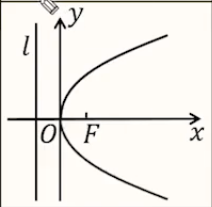
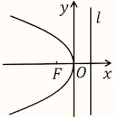

# 【数学】解析几何之抛物线

## 抛物线的定义及方程

1. 定义：设 $F$ 是平面内的一个定点，$l$ 是**不过点** $F$ 的一条定直线，则平面上到 $F$ 的距离与到 $l$ 的距离相等的点的轨迹称为抛物线。其中，定点 $F$ 称为抛物线的焦点，定直线 $l$ 称为抛物线的准线。

   【拓】若点 $F$ 在直线 $l$ 上，则轨迹为经过 $F$ 且垂直于 $l$ 的直线。

2. 几何性质：对于抛物线上一点 $P$，过点 $P$ 作 $PN \perp l$，那么有 $PN=PF$。

3. 标准方程：

   【开口向右】

   - 图形：
   - 焦点坐标：$(\dfrac{P}{2},0)$；
   - 准线方程：$x= - \dfrac{P}{2}$；

   【开口向左】

   - 图形：
   - 焦点坐标：$(-\dfrac{P}{2},0)$；
   - 准线方程：$x=\dfrac{P}{2}$；

   【结构】等号左边是二次项，右边是一次项；

 4. 开口方向判断：谁是一次项，焦点就在哪条轴上；一次项为正，开口向正半轴，一次项为负，开口向负半轴。

 5. 已知抛物线求焦点坐标：焦点坐标 $=\dfrac{一次项系数}{4}$。

 6. 根据焦点坐标求抛物线方程：一次项系数 $=$ 焦点坐标 $\times $ 4。

 7. 离心率：

    【定义】抛物线上一点到准线的距离和该点与焦点的距离之比；

    【求解】抛物线离心率 $e=1$。

## 有关抛物线的相关解题技巧

- 求抛物线上一点到**焦点**的距离，可以转化为该点到**准线**的距离，反之也是一样。

- 焦半径公式：

  【开口向右】$|PF|=x_0+\dfrac{p}{2}$；

  【开口向左】$|PF|=-x_0+\dfrac{p}{2}$；

  【开口向上】$|PF|=y_0+\dfrac{p}{2}$；

  【开口向下】$|PF|=-y_0+\dfrac{p}{2}$。
  
- 代数化：设点坐标，直线方程，几何条件转化为代数式。

- 若题目中已知圆锥曲线与某直线有**两个**交点，则一个比较常见的思路是设/求出圆锥曲线和直线方程，联立，化简得到一个一元二次方程，并利用韦达定理和 $\Delta >0$ 求解。

  > 注意：联立两个方程时，消去二次项可能会使得计算更加简便。

- 直线的横截式方程：

  【优点】减小计算量。

  【使用横截式方程的条件】已知直线经过 $x$ 轴上一点 $(t,0)$。

  若直线经过 $x$ 轴上一点 $(t,0)$，可设直线方程 $x=my+t$；

  其中，当直线斜率 $k$ 存在且不为 $0$ 时，$m=\dfrac{1}{k}$；

  当直线斜率 $k$ 不存在时，$m=0$；

  当直线斜率 $k=0$ 时，$m$ 不存在，即，**$x=my+t$ 不能表示水平直线（斜率为 $0$ 的直线）**。

  

