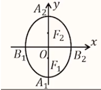

# 【数学】解析几何之椭圆

## 椭圆的定义及方程

1. 几何定义：如果 $F_1,F_2$ 是平面内的两个定点，$|F_1F_2|=2c$，$a$ 是一个常数，且 $2a>|F_1F_2|=2c$，则平面内满足 $|PF_1|+|PF_2|=2a$ 的动点 $P$ 的轨迹称为椭圆。

   两个定点 $F_1,F_2$ 称为椭圆的焦点，两个焦点之间的距离 $|F_1F_2|=2c$ 称为椭圆的焦距。

2. 标准方程：

   【重要等式】$a^2=b^2+c^2$，根据此可以判断焦点对应坐标轴，即 $x^2$ 和 $y^2$ 谁对应的分母更大，焦点就在其对应坐标轴上。

   【焦点在 $x$ 轴上】

   - 标准方程：$\dfrac{x^2}{a^2}+\dfrac{y^2}{b^2}=1(a>b>0)$；
   - 图形：
   - 焦点坐标：$F_1(-c,0),F_2(c,0)$；
   - 顶点坐标：$A_1(-a,0),A_2(a,0),B_1(0,-b),B_2(0,b)$；

   【焦点在 $y$ 轴上】

   - 标准方程：$\dfrac{y^2}{a^2}+\dfrac{x^2}{b^2}=1(a>b>0)$；
   - 图形：
   - 焦点坐标：$F_1(0,-c),F_2(0,c)$；
   - 顶点坐标：$A_1(0,-a),A_2(0,a),B_1(-b,0),B_2(b,0)$；

   【长轴】长轴 $A_1A_2=2a$，$a$ 是长半轴的长。

   【短轴】短轴 $B_1B_2=2b$，$b$ 是短半轴的长。

   【焦距】焦距 $F_1F_2=2c$，$c$ 是半焦距。

   【离心率】$e=\dfrac{c}{a},e \in (0,1)$。

3. 标准方程统一式：$Ax^2+By^2=1(A>0,B>0,A\ne B)$。

   当焦点在 $x$ 轴上时，$B>A>0$；当焦点在 $y$ 轴上时，$A>B>0$。

4. 点和椭圆的位置关系：

   对于点 $M(x_0,y_0)$，有：

   - 点 $M$ 在椭圆外 $\Longleftrightarrow$  $\dfrac{{x_0}^2}{a^2}+\dfrac{{y_0}^2}{b^2}>1$；
   - 点 $M$ 在椭圆上 $\Longleftrightarrow$  $\dfrac{{x_0}^2}{a^2}+\dfrac{{y_0}^2}{b^2}=1$；
   - 点 $M$ 在椭圆内 $\Longleftrightarrow$  $\dfrac{{x_0}^2}{a^2}+\dfrac{{y_0}^2}{b^2}<1$；

5. 焦点三角形：椭圆的两个焦点和椭圆上任意一点组成的三角形。

   

   【性质一】$PF_1+PF_2=2a$；

   【性质二】$F_1F_2=2c$；

   【性质三】$e=\dfrac{\sin{(\alpha +\beta)}}{\sin \alpha +\sin \beta}$。

   【一个小结论】

   

   【一个解题方法】

   如果题目要求某个式子的最大/最小值，且该式子中只出现了 $PF_1$ 和 $PF_2$ 中的一个，那么一般要把其中出现的 $PF_1$ 或 $PF_2$ 替换为 $2a-PF_2$ 或 $2a-PF_1$ 再进行计算。

6. 拓展：

   - 若 $|PF_1|+|PF_2|=|F_1F_2|$，则点 $P$ 的轨迹是线段 $F_1F_2$。
   - 若 $|PF_1|+|PF_2|< |F_1F_2|$，则点 $P$ 的轨迹是空集。

## 与椭圆有关的解题方法

1. 求椭圆方程：

   - 在已知 $e=\dfrac{c}{a}=\dfrac{m}{n}$（其中 $m,n$ 是常数）时，我们可以引入参数 $k$，设 $c=mk,a=nk$，建立方程求出 $a,b,c$，再求解。
   - 在已知椭圆上两点坐标时，可以直接设椭圆方程的统一式求解。
   - 利用题目已知信息列出有关参数的方程，并解方程求解。

2. 离心率解题要点：

   - $e=\dfrac{c}{a},e\in (0,1)$；
   - $a,b,c$ 的齐次方程 $\ce{->[b^2=a^2-c^2][e=\frac{c}{a}]}$ 只含 $e$ 的方程（例如一次方程直接计算，二次方程上下同时除以 $a^2$ 等）。
   - 无从下手时可以考虑「几何条件代数化」，观察并发现题目中没有利用的几何条件并利用，注意尤其要善于发现较为隐含的已知信息，例如「某点在某直线上」说明该点坐标满足该直线方程等。
   - 求解离心率 $e$ 的范围时，一般可以转化关于 $a,b,c$ 的不等式，然后同样按照前两个要点在不等式中代换出 $e$，求出 $e$ 的取值范围。
   - 遇到某两个点关于某直线对称的问题时，相当于告诉了两个信息：①这两个点连线与该直线垂直（斜率相乘为 $-1$）；②这两个点连线段中点在这条直线上（中点满足方程）；
   - 题目告诉两个向量之间的倍数关系时，例如 $\overrightarrow{AB}=\lambda \overrightarrow{BC}$，说明 $A,B,C$ 三点共线，则可以考虑设直线 $AC$ 的方程求解。

3. 求倾斜角：

   - 可以转化为 $k=\tan \theta$，放到一个直角三角形里用「对比邻」求解。
   - 也可以转化为求直线方程（斜截式或点斜式），即可求出 $k$。

4. 点差法：

   【适用范围】已知椭圆（双曲线、抛物线也可）上**两点中点坐标**时，可以使用点差法。

   【步骤】

   1. 设出两点坐标 $A(x_1,y_1),B(x_2,y_2)$。

   2. 若中点坐标 $P(x_0,y_0)$，经过点 $P$ 且与 $AB$ 垂直的直线为 $l$，则可根据相关中点的性质列出有关等式：

      $$
      \begin{cases}
      x_1+x_2=2x_0\\
      y_1+y_2=2y_0\\
      k_{AB}\cdot k_l=\dfrac{y_1-y_2}{x_1-x_2}\cdot k_l=-1
      \end{cases}
      $$

      并根据 $A,B$ 在椭圆上列出有关等式：
      $$
      \begin{aligned}
       \dfrac{{x_1}^2}{a^2}+\dfrac{{y_1}^2}{b^2}=1&~~~~~~~~~~~(1)\\
       \dfrac{{x_2}^2}{a^2}+\dfrac{{y_2}^2}{b^2}=1&~~~~~~~~~~~(2)
       \end{aligned}
      $$
       用 $(1)-(2)$ 得：
      $$
      \dfrac{(x_1+x_2)(x_1-x_2)}{a^2}+\dfrac{(y_1+y_2)(y_1-y_2)}{b^2}=0
      $$
      左右两边同时除以 $(x_1-x_2)$ 得：
      $$
      \dfrac{x_1+x_2}{a^2}+\dfrac{y_1+y_2}{b^2}\cdot\dfrac{y_1-y_2}{x_1-x_2}=0
      $$
      代入上述等式得：
      $$
      \dfrac{2x_0}{a^2}+\dfrac{2y_0}{b^2}\cdot (-\dfrac{1}{k_l})=0
      $$
      化简可得到 $a,b$ 的齐次方程。

      根据这种方法可以求解离心率（要点 2）。
      
   3. 已知一个椭圆的 $c$，和其上一点 $Q$ 的坐标，除了可以利用 $a^2 = b^2 + c^2$，并将 $Q$ 代入椭圆中联立求解之外，还可以考虑 $2a = |QF_1| + |QF_2|$ 从而联立求解。并且此时一般计算量更小。

5. 有用的小结论：

   若椭圆上一点 $P$ 的横坐标为 $c$，则 $P$ 的坐标是 $P(c,\dfrac{b^2}{a})$。