# 【物理】功与能

## 功

### 基础概念

#### 定义

一个物体在力的作用下，沿力的方向，通过一段距离（位移），则称这个力做了功。

#### 公式

功的定义式：
$$
W = Fx
$$
这里的 $x$ 指的是**物体沿力的方向上发生的位移**。由于力 $F$ 和位移 $x$ 都是矢量，所以得到的功 $W$ 是**标量**。

> 注意：虽然 $W$ 是标量，但是 $\pu{-5 J > 3 J}$，因为这里的负号表示**做负功**，或**阻力做功**。即对于所有变量，都按照数轴从左到右依次增大，功除外。

功的计算式：
$$
W = \overrightarrow F \cdot \overrightarrow x = Fx \cos \theta
$$
这里的 $x$ 指的是**实际位移**，$\theta$ 表示力与位移的夹角。功的单位是焦耳，字母表示为 $\pu J$。

---

例：如下图所示，一物体从斜面顶端滑到斜面底端，问重力做的功是多少。

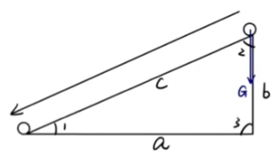

求解：

根据题意可知
$$
\begin{aligned}
W & = Fx \cos \theta\\
& = Gc \cos \angle 2\\
& = G b
\end{aligned}
$$
这道题中涉及了两个计算功的方法：

- 功的计算式，即 $W = Gc \cos \angle 2$，这里的 $c$ 指的是**实际位移**。
- 功的定义式，即 $W = Gb$，这里的 $b$ 指的是**在力的方向上发生的位移**。

> 对于功的计算式中 $\theta$ 的理解：
>
> 首先如下图所示：
>
> 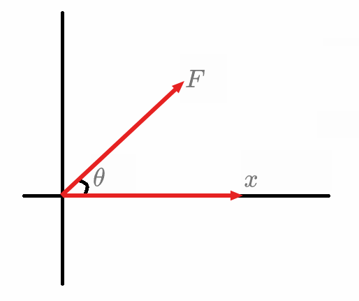
>
> 对于 $F$ 在 $x$ 方向上做的功，那么考虑将 $F$ 沿图中建系得到的两个方向分解为 $F_x$ 和 $F_y$，那么
> $$
> W_F = W_x + W_y = F \cos \theta \cdot x + 0 = Fx \cos \theta
> $$
> 由于在 $y$ 方向上位移为 $0$，所以 $W_F = W_x = Fx \cos \theta$。

### 计算

#### 恒力做功计算

求大小方向恒定的力做功（例如重力），一般有以下两种思路：

若物体做**直线**运动，则使用力的「计算式」，即 $W = Fx \cos \theta$，$x$ 表示**实际位移**。

若物体做**曲线**运动，则使用力的「定义式」，即 $W = Fx$，$x$ 表示**在力的方向上的位移**。

> 注意：求 $F$ 可能需要通过受力分析求出。

---

例：如图所示，一质量为 $m$ 的小球，用长为 $L$ 的轻绳悬挂于 $O$ 点，小球在水平力恒力 $F$ 作用下，从 $P$ 点移到 $Q$ 点，此时悬线与竖直方向夹角为 $\theta$，则求重力做的功是多少。

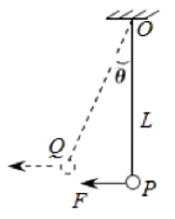

分析：

由于物体做**曲线运动**，所以考虑使用功的「定义式」，那么
$$
W = Fx = - m \mathrm g \cdot (L - L \cos \theta)
$$
这里力的方向上的位移是 $x = L - L \cos \theta$，这是常见的计算位移的方式。且由于物体位移向上，而重力向下，所以**功是负功**，这里需要注意功的正负。

#### 变力做功计算

特殊情况：若变力的方向与位移方向（速度方向）始终垂直，说明在力的方向上没有位移，所以不做功，即 $W_F = 0$。例如物体做圆周运动时提供向心力的力始终与速度方向垂直，不做功。

若变力只有方向改变、大小不改变（例如某些情况下的滑动摩擦力），可以通过 $W_F = Fs \cos \theta$ 计算，其中 $s$ 表示物体经过的路程，$\theta$ 表示 $F$ 与 $s$ 的夹角。**此时，$F$ 与 $s$ 的夹角一般始终保持固定，且一般情况下题目中二者的夹角大部分都是 $0^\circ$ 或 $180^\circ$**。

> 一个较为典型的例子：
>
> 考虑一物体在粗糙水平面上，向右以初速度 $v_0$ 的速度做直线运动，从某个起始点 $A$ 运动到 $B$ 然后折返回来到 $A$。整个过程中，物体始终受到一个向左的外力 $F$，大小始终不变。物体从 $A$ 到 $B$ 再回到 $A$ 的过程中，外力 $F$ 做的功整体上是多少，滑动摩擦力 $f$ 做的功整体上是多少。
>
> 分析：
>
> 首先对于外力 $F$，属于大小方向均不变的恒力：
>
> - 当物体由 $A$ 运动到 $B$ 的过程中，$F$ 与位移方向相反，做负功，这个过程 $W_F = - F x_{AB}$；
> - 当物体由 $B$ 折返回到 $A$ 的过程中，$F$ 与位移方向相同，做正功，这个过程 $W_F = F x_{AB}$。
>
> 那么两段路程做的功正负抵消，所以对于整个过程，外力 $F$ 做功为 $0$。
>
> 然后对于滑动摩擦力 $f$：
>
> - 当物体由 $A$ 运动到 $B$ 的过程中，此时 $f$ 与位移方向相反，做负功，这个过程 $W_f = - f x_{AB}$；
> - 当物体由 $B$ 折返回到 $A$ 的过程中，$f$ 与位移方向依然相反，做负功，这个过程 $W_f = - f x_{AB}$。
>
> 那么对于整个过程，滑动摩擦力 $f$ 做功为 $W_f = - 2 f x_{AB}$。

若变力只有大小改变，方向不改变，则可以考虑**图象法**。绘制 $F-x$ 的图象，此时图象围成的面积表示功 $W_F$。图象在 $x$ 轴上方的部分，$F$ 做正功；图象在 $x$ 轴下方的部分，$F$ 做负功。则直接根据图象求出对应面积即可求出功。

---

例：如图所示，某个力 $F$ 大小等于 $\pu{200 N}$ 保持不变，作用在半径为 $\pu{2 m}$ 的转盘边缘，方向时刻与此时的运动方向相同，当转盘转动一周时，力 $F$ 做了多少功？

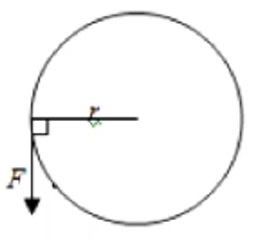

分析：

由于大小不变的力 $F$ 的方向时刻与运动方向相同，所以 $\theta = 0^\circ$，那么
$$
W = Fs = 20 \times 4 \pi = 80 \pi\ (\pu J)
$$

> 总结：本题属于变力满足方向改变，大小不变的题型，且 $F$ 与 $s$ 夹角始终不变且已知，所以考虑 $W = F s \cos \theta$。求解思想是**微元法**。

### 功的正负判断

#### 判断依据

根据 $W = Fx \cos \theta$ 可知：

- 当 $0^\circ \le \theta < 90^\circ$ 即力与位移夹角为锐角时，$\cos \theta > 0$，功为正。
- 当 $90^\circ < \theta \le 180^\circ$ 即力与位移夹角为钝角时，$\cos \theta < 0$，功为负；
- 当 $\theta = 90^\circ$ 即力与位移方向垂直时，$\cos \theta = 0$，不做功。

#### 常见力做功的正负

**摩擦力**

对于**单个**摩擦力可能做正功、负功，也可能不做功，下面是一些常见情形：

- 静摩擦力做正功：人握着话筒往上移动。
- 静摩擦力做负功：人握着话筒往下移动。
- 静摩擦力不做功：人握着话筒静止不动。
- 滑动摩擦力做正功：将一物体以初速度为 $0$ 放在正在运行的传送带上的初始状态。
- 滑动摩擦力做负功：在地上滑行的物体。
- 滑动摩擦力不做功：擦黑板，摩擦力**对黑板**不做功（对板擦做功）。

对于**一对**摩擦力：

- 一对**静**摩擦力：互为相互作用力，大小相同，方向相反，位移相同，考虑做功正负抵消，所以做功之和**一定为 $0$**。
- 一对**滑动**摩擦力：做功之和**一定小于 $0$**。（具体解释涉及到能量，这里不做赘述。）

**相互作用力**

误区：一个作用力做正功，另一个作用力一定做负功。

解释：由于一对相互作用力作用到的物体**不是同一个物体**，而是**两个不同的物体**，所以无法直接预估做功的正负。

下面是一些常见的情形（例如「一正一负」表示一个作用力做正功，另一个作用力做负功）：

- 一正一负：两块磁铁，一左一右，左往左动，右往左动。
- 一正一正：两块磁铁，一左一右，左往左动，右往右动。
- 一正一零：两块磁铁，一左一右，左往左动，右不动。
- 一负一负：两块磁铁，一左一右，左往右动，右往左动。
- 一负一零：两块磁铁，一左一右，左往右动，右不懂。
- 一零一零：两块磁铁，一左一右，都不动。

**重力**

重力做功的正负与高度有关：

- 高度变高：重力做负功。
- 高度变低：重力做正功。
- 高度不变：重力做功为 $0$。

**合外力**

根据合外力 $F$ 的方向与加速度 $a$ 的方向相同，位移 $x$ 的方向与速度 $v$ 方向相同可知：

- 速度变大：加速运动，$a,v$ 同向，$F,x$ 同向，合外力做正功。
- 速度变小：减速运动，$a,v$ 异向，$F,x$ 异向，合外力做负功。
- 速度不变：合外力不做功。

**平衡力**

一对平衡力做功，大小相等，方向相反，作用在同一个物体上，所以二者做功一正一负，根据同一个物体可知位移相同所以大小相同，做功之和一定为 $0$。

### 【经典题型】敲钉子做功的计算

问题模型：

用铁锤将一铁钉击入木块，设木块对铁钉的阻力与铁钉进入木块内的深度成正比，即 $F_f = kx$（其中 $x$ 为铁钉进入木块的深度），在铁锤击打第一次后，铁钉进入木块的深度为 $d$。则：

1. 求铁锤对铁钉做功的大小。
2. 若铁锤对铁钉每次做功都相等，求击打第二次时，铁钉还能进入的深度。

求解方法：图象法。

分析：

对于第一问，发现木块对铁钉的阻力 $F_f$ 实际上**方向不变，只有大小改变**，那么考虑图象法，绘制 $F_f-x$ 图象求解，如下图所示。

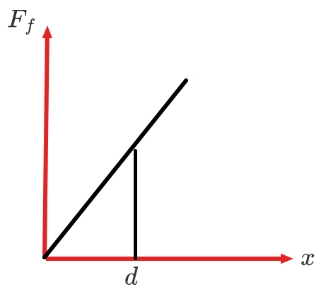

那么图中三角形围成的面积即为铁锤对铁钉做功的大小，所以
$$
W = S = \dfrac 1 2 d \cdot kd = \dfrac 1 2 kd^2
$$
对于第二问：

假设击打第二次时，铁钉此时的深度为 $d'$。根据下图可知 $S_1 = S_2$。

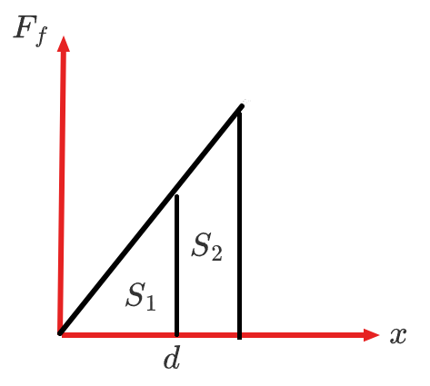

根据相似三角形可知：
$$
\dfrac{S}{S + S} = \dfrac{d^2}{{d’}^2} \implies \dfrac d {d'} = \dfrac 1 {\sqrt 2} \implies d' = \sqrt 2 d
$$
所以铁钉还能进入的深度 $\Delta d = (\sqrt 2 - 1) d$。

## 功率

### 基础概念

#### 定义

功率是描述做功快慢的物理量。功率越大，做功越快。

#### 公式

功率的定义式：
$$
P = \dfrac W t
$$
单位：焦耳每秒 $\pu{J*s-1}$ 或瓦特 $\pu W$。功率是**标量**。定义式中的功率表示的是**平均功率**，即平均每秒做功的多少，例如 $\pu{5 s}$ 内的平均功率。

功率的计算式：
$$
P = \dfrac W t = \dfrac{Fx \cos \theta}{t} = F v \cos \theta
$$
计算式中的功率表示的是**瞬时功率**，即某个时刻做功的多少，例如第 $\pu{5 s}$ 的功率；这里的 $v$ 表示某时刻的速度，即**瞬时速度**；$\theta$ 表示 $F$ 和 $v$ 的夹角。

> 一般情况下计算瞬时功率，求 $v$ 时，可能需要利用牛二力学和运动学中的相关知识。

所以某时刻的功率，与此时做功的力 $F$、瞬时速度 $v$ 和二者的夹角 $\theta$ 有关。

例如：如图所示，一小球在从 $A$ 端由静止移动到 $B$ 端，问从 $A$ 到 $B$ 的过程中重力的功率 $P_G$ 的变化。

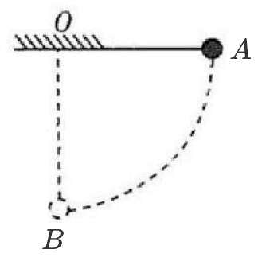

分析：

当小球在 $A$ 端时，$v = 0$，所以起初 $P_A = 0$；当小球在 $B$ 端时，此时重力竖直向下，速度水平向左，二者夹角为直角，所以 $\cos \theta = 0$，所以 $P_B = 0$；当小球在从 $A$ 到 $B$ 中间某个点时，分析可知此时 $P_G > 0$。那么整个过程中 $P_G$ 应该是先变大后变小。

### 汽车启动

#### 额定（恒定）功率启动

相关概念：「额定功率」指发动机的**最大**功率。一般情况下，这里的「额定功率」对应的是**牵引力**的功率。

问题模型：一辆汽车在以水平面上，以额定功率从静止开始运动，汽车质量为 $m$，运动过程中所受到的阻力 $f$ 大小恒定，牵引力为 $F$。

运动状态分析：

首先对启动后的汽车进行受力分析：
$$
\begin{cases}
ma = F - f\quad (1)\\
F_N = m \mathrm g
\end{cases}
$$
同时根据 $P = Fv$（此时 $\theta = 0$ 所以 $\cos \theta = 1$）可得 $F = \dfrac P v~ (2)$。

那么在最开始，由于物体从静止开始运动，所以物体有加速度 $a$，因为 $a,v$ 同向，所以 $v$ 增大，由于 $P$ 为额定功率始终不变，所以根据 $(2)$ 可知 $F$ 减小，那么根据 $(1)$，由于 $f$ 恒定，所以 $a$ 减小，那么汽车做加速度减小的加速运动。

当 $F$ 减小到与 $f$ 相同时，$a = 0$，所以物体速度不变，做匀速直线运动，其 $v - t$ 图象如下。

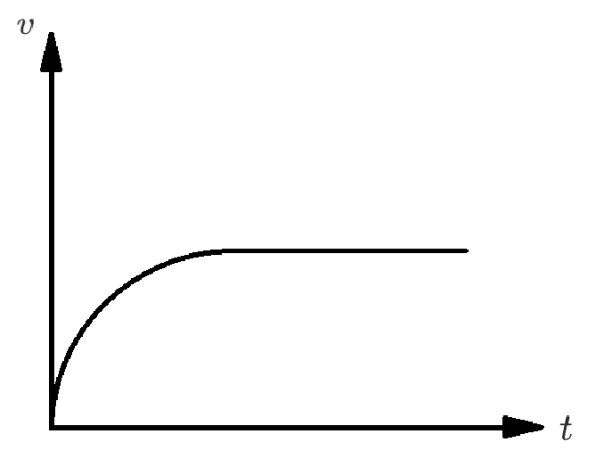

解题思路：

1. 找出研究对象。
2. 找出题目条件对应的运动段。
3. 画图，对该运动段的研究对象受力分析。
4. 列出对应的受力分析式（平衡/牛二）。

> 注意：一般情况下，无论题目求的是哪个运动段，**都要分析匀速运动阶段**。

书写：对「研究对象」的「某运动段」进行受力分析，如图（画出图像），列出「平衡式/牛二式」。

---

例：汽车发动机的额定功率为 $\pu{60 kW}$，汽车质量为 $\pu{5 t}$，运动中所受阻力的大小恒为车重的 $0.1$ 倍。（$\mathrm g$ 取 $\pu{10m/s^2}$），求：若汽车以额定功率启动，汽车所能达到的最大速度是多少？

分析：

涉及到「汽车所能到达的最大速度」，说明指的是汽车做匀速运动的运动段。

那么考虑对汽车的匀速运动阶段进行受力分析，如图所示。

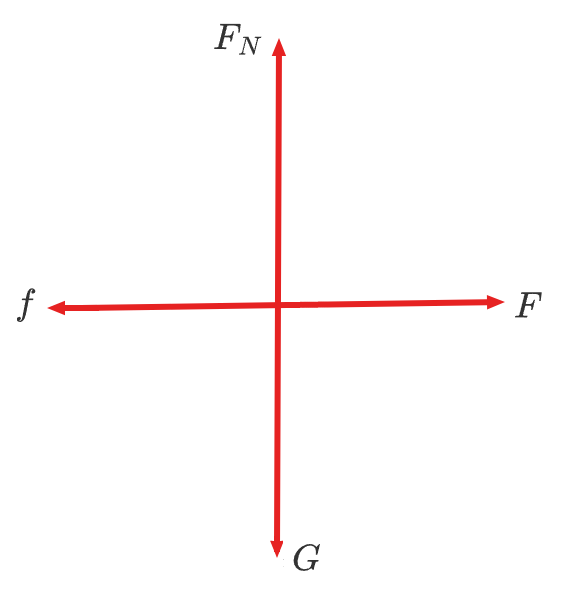

则：
$$
\begin{cases}
f = F\\
F_N = G
\end{cases}
\implies 
\begin{cases}
0.1 m \mathrm g = \dfrac P v\\
F_N = m \mathrm g
\end{cases}
\implies v = \pu{12 m/s}
$$

#### 恒定加速度启动

问题模型：一辆汽车在以水平面上，以**恒定加速度**从静止开始运动，汽车质量为 $m$，运动过程中所受到的阻力 $f$ 大小恒定，牵引力为 $F$。

运动状态分析：

受力分析同「额定（恒定）功率启动」。

那么当 $a$ 恒定时，根据 $(1)$ 和 $f$ 始终不变，可得 $F$ 保持不变。由于 $a,v$ 同向，所以 $v$ 增大，又根据 $(2)$，要使得 $F$ 不变，则 $P$ 增大，且 $v,P$ 等比例增大。

当 $P$ 达到汽车的最大功率时，由于受力不变，所以 $a$ 仍保持不变，那么 $v$ 仍然会增大；那么由于 $P$ 不变，所以 $F$ 减小。此时题目变成了 $P$ 恒定，所以后续与「额定（恒定）功率启动」情况相同。

那么整个过程中的 $v - t$ 图象如下：

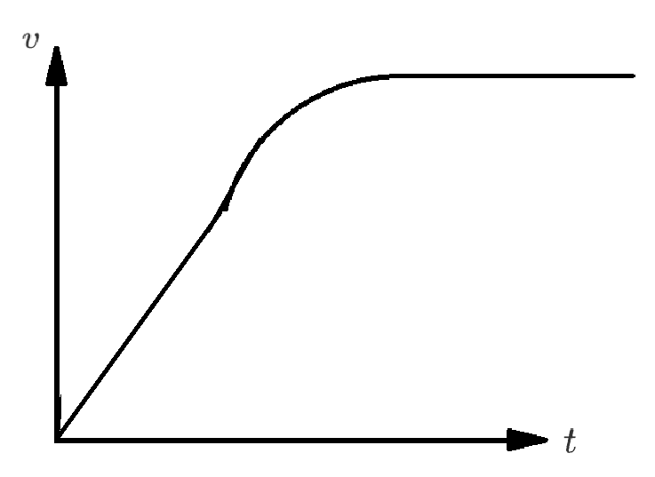

$P-t$ 图象如下：

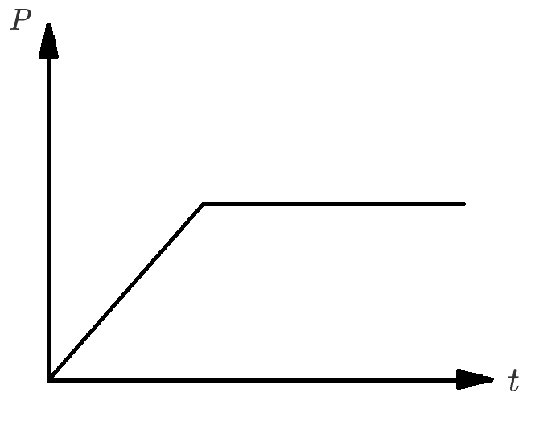

本质：起初 $a$ 不变，后来 $P$ 不变的运动。

解题思路：

一般要分析两个关键点：

1. 匀加速直线运动变成加速度减小的加速度运动的点；
2. 加速度减小的加速运动变成匀速直线运动的点（匀速直线运动阶段）。

书写同「额定（恒定）功率启动」。

#### $F - \dfrac 1 v$ 图象

