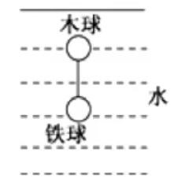

# 【物理】动量

## 冲量

### 基础概念

#### 定义

力在时间上的积累。冲量一般用字母 $I$  表示。

#### 公式

冲量 $I$ 的表达式如下：
$$
I = F\cdot t
$$
由于 $F$ 的单位是 $\pu N$，$t$ 的单位是 $s$，所以冲量的单位是 $\pu{Ns}$。根据表达式可知，冲量是矢量，方向与 $F$ 相同。

> 注意：
>
> - 冲量 $\ne$ 冲击力，例如自由下落的物体到达地面时，物体对地面的冲量为 $I = m \mathrm g t$，冲量是一个**过程量**。
> - 当且仅当 $F = 0$ 时，冲量 $I = 0$。原因：冲量作为「过程量」，时间 $t$ 不能为 $0$。且一般情况下题目中只有**摩擦力为 $0$** 和**合外力为 $0$** 两种情况，这两种情况中，要么合外力为 $0$ 要么摩擦力不存在。所以**只要有力就一定有冲量**。
> - 冲量的表达式为 $I = F\cdot t$，功的表达式 $W = F\cdot x \cdot \cos \theta$，二者非常相似。但功的表达式由于 $F$ 和 $x$ 都是矢量，所以存在 $\cos \theta$，而冲量不存在，是单纯的 $F$ 和 $t$ 相乘。

合冲量的计算式为
$$
I_合 = F_合 \cdot t\\
I_合 = I_1 + I_2 + I_3 + \cdots 
$$
第一种计算式中 $F_合$ 一般通过牛二来求。

第二种计算式的表达式中，冲量相加为**矢量相加**，而非**标量相加**。这里与合外力做功的计算方式不同（合外力做功是标量相加），原因是冲量是矢量，而功是标量。

#### 图像中的冲量

类比在 $F-x$ 图象中围成的面积是功 $W$，在 $F-t$ 图象中，图形围成的面积是冲量 $I$。

### 计算

#### 恒力的冲量

恒力的冲量可直接用表达式 $I = F\cdot t$ 计算，注意此时要代入 $F$ 的方向计算。

#### 变力的冲量

变力的冲量应该用合冲量的方式计算，即，讲变力分解为几段，这几段内部所求力的大小和方向均不变，然后再将每一段的冲量**矢量相加**。

#### 例题

例：竖直向上抛出一个物体，物体受到大小恒定的阻力 $f$，上升的时间为 $t_1$，上升的最大高度为 $h$，物体从最高点经过时间 $t_2$ 落回到抛出点。从抛出点回到抛出点的过程中，阻力做的功为 $W$，阻力的冲量为 $I_f$，重力的冲量为 $I_G$。则求问整个过程中，阻力的冲量表达式和重力冲量的表达式是什么？

分析：

定义正方向为竖直向上。

首先考虑阻力 $f$，阻力 $f$ 在整个过程中是方向改变，大小不变的**变力**，那么考虑分段求解。发现可以分为两段：从抛出点上升到最高点和从最高点下落到抛出点，这两段阻力的大小方向均不变，那么此时有
$$
I_f = I_1 + I_2 = -f\cdot t_1 + f \cdot t_2 = f(t_2 - t_1)
$$
然后再考虑重力 $G$，重力在整个过程中是**恒力**，则直接根据表达式有
$$
I_G = Gt = -m\mathrm g (t_1 + t_2)
$$

## 动量

### 基础概念

#### 定义

动量指的是这个物体在它的运动方向上保持运动的趋势。一般用字母 $P$ 表示。

#### 公式

动量 $P$ 的表达式为
$$
P = mv
$$
即动量 $P$ 等于质量 $m$ 乘速度 $v$，单位是 $\pu{kg m/s}$。根据表达式可知，动量 $P$ 是**矢量**，其方向与速度方向一致。

> 注：
>
> - 动能和动量都是物理中同时涉及到质量和速度的物理量，不同的是动能是标量，而动量是矢量。根据动量可以**更加精准的描述物体的方向**。
> - 描述物体运动状态的物理量目前学过的有三个：速度、动能和动量。其中，动量是描述其状态最准确的一个，其同时涉及到质量、速度和方向。

那么对于同一质量确定的物体而言，只要速度 $v$ 改变，那么动量 $P$ 一定改变。具体来说，当速度方向改变，动量 $P$ 的方向也改变；速度大小改变，动量 $P$ 的大小也改变。注意和动能做区分：只有**速度大小改变**，动能 $E_k$ 才会改变；只有速度方向改变时，动能 $E_k$ 不改变。

> 注意：题目中「动量变化率」的概念指的是合外力 $F_合$，具体将在「动量定理」中说明。

### 计算

#### 动量变化量

动量变化量 $\Delta P$ 的计算公式为
$$
\Delta P = P_末 - P_初 = m v_t - m v_0
$$
其中，$v_t$ 指的是末速度，$v_0$ 指的是初速度。

> 注意：该公式中 $P_末 - P_初$ 是**矢量相加减**，所以在最开始**必须规定正方向**。没有规定的情况下，**默认初速度方向为正方向**。同时当初速度和末速度方向**在同一直线上**时，可直接代入速度的数值计算；但若二者不在一条直线上，则需要通过画图计算出 $v_t - v_0$ 矢量相减的结果。

当初速度和末速度方向不在同一直线上时，动量变化量的方向为**由初速度指向末速度**，在平面上末速度减去初速度得到的矢量的大小即为动量变化量的大小，如下图所示，黑色有向线段的方向即为动量变化量的方向，黑色有向线段的长度即为动量变化量的大小。

当初速度和末速度在同一直线上时，末速度减去初速度的结果得到的速度方向即为**动量变化量的方向**。

#### 动量与动能的转化

已知动量 $P$，动能 $E_k$ 和质量 $m$，则
$$
\begin{cases}
P = mv\\
E_k = \dfrac 1 2 m v^2
\end{cases}
\implies
\dfrac{P^2}{2m} = E_k
$$

## 动量定理

### 相关概念

动量定理的表达式：
$$
F_合 \cdot t = mv_t - mv_0
$$
即冲量 $I$ 等于动量 $P$。

可根据牛二推导：
$$
\begin{aligned}
& F_合 = ma\\
\implies & F_合 \cdot t = mat\\
\implies & F_合 \cdot t = m\Delta v\\
\implies & F_合 \cdot t = m(v_t - v_0)\\
\implies & F_合 \cdot t = mv_t - mv_0
\end{aligned}
$$

> 由于根据变化率的定义可知，动量变化率应该是 $\dfrac{\Delta P}{t}$，根据动量定理可知，动量变化率即为 $F_合$。

用动量定理解释生活中的现象：手机从空中掉入沙发和水泥地上时，速度相同，且最终速度都要变为 $0$，则 $mv_t - mv_0$ 相同，所以 $F\cdot t$ 相同，由于手机落入沙发上相比水泥地有缓冲作用，所以其落入水泥地时间更小，沙发上时间更长，所以在水泥地 $F$ 大于在沙发上的 $F$，所以手机在水泥地上更容易碎。

---

例：关于下列几种现象描述正确的是（）

A. 拳击手比赛时所带的拳套是为了增强击打效果

B. 动量相同的两个物体受相同的制动力的作用，质量小的先停下来

C. 汽车安全气囊的作用是在汽车发生剧烈碰撞时，使人更快的停下来

D. 从越高的地方跳下，落地时越危险，是因为落地时人脚受到的冲量越大

分析：

对于 A 选项，拳套是为了在动量变化量不变的情况下，增大作用时间 $t$，从而减小外力 $F$，即**减弱击打效果**，A 错误。

对于 B 选项，初动量相同的两个物体，由于停下来时二者末速度都是 $0$，所以末动量也相同，所以动能变化量相同；同时由于受到相同的制动力，所以 $F$ 相同，那么根据动量定理可知 $t$ 相同，所以二者同时停下来，B 错误。

对于 C 选项，安全气囊的缓冲作用是为了延长作用时间 $t$，从而减小作用力 $F$，能使人更慢的停下来，C 错误。

对于 D 选项，从越高的地方跳下，落地时 $v$ 会较大，所以初动量较大，同时由于末动量不变（都是要变为 $0$），所以动能变化量更大，即冲量更大，D 正确。

### 应用

动量定理的适用范围：题目中已知时间 $t$ 相关的条件。注意与动能定理的适用范围区分：当题目中出现与位移 $x$ 有关的条件时，一般使用动能定理。

利用动量定理计算动量变化量：根据动量定理 $F_合 \cdot t = m v_t - m v_0 = \Delta P$ 可知，可以通过计算出冲量来计算出动能的变化量。冲量的方向是合外力的方向，也是动量变化量的方向。

利用动量定理解题的步骤：

1. 找出研究对象。
2. 找到对应的运动段：一般涉及到两个关键点，即从哪到哪。
3. 计算出 $F_合$：对小球受力分析，求出 $F_合$，一般用正方向的力 $-$ 负方向的力。
4. 列出动量定理的式子。

解题的语言描述：对「研究对象」的「从 $A$ 到 $B$ 的运动段」列出对应的动量定理表达式。

### 例题

例 1：质量为 $\pu{0.2 kg}$ 的小球以 $\pu{6 m/s}$ 的速度竖直向下落至水平地面，经 $\pu{0.2 s}$ 后，再以 $\pu{4 m/s}$ 的速度反向弹回。取竖直向上为正方向，$\mathrm g = \pu{10 m/s^2}$，求：小球受到地面的平均作用力大小。

分析：

题目涉及时间 $t$，考虑动量定理。

那么对小球从落入地面到反向弹回的运动段分析，有
$$
F_合 \cdot t = mv_t - mv_0 \implies F_合 = \dfrac{mv_t - mv_0}{t} = \dfrac{0.2 \times 4 - 0.2\times(-6)}{0.2} = \pu{10 N}
$$
设小球受到地面的平均作用力大小为 $F$，对小球受力分析可知
$$
F_合 = F - m \mathrm g \implies F = \pu{12 N}
$$

---

例 2：质量 $m = \pu{1 kg}$ 的小球从高 $h_1 = \pu{20 m}$ 处自由下落到软垫上，反弹后上升的最大高度 $h_2 = \pu{5 m}$，小球与软垫接触的时间 $t = \pu{1 s}$，不计空气阻力，$\mathrm g = \pu{10 m/s^2}$，以竖直向下为正方向，求：接触过程中软垫对小球的平均作用力大小。

分析：

解题思路几乎与例 1 相同，可以求得动能变化量为 $\Delta P = \pu{- 30 kg m/s}$，同时根据 $F_合 \cdot t = \Delta P$ 可知，$F_合 = G - F = \pu{-30 N}$，所以小球的平均作用力 $F = \pu{40 N}$。

> 注意：这里的 $\pu{40 N}$ 指的是 $F$ 的大小，不包含方向，因为方向在 $F_合 = G - F$ 里已经包含了（即正方向的 $G$ 减去反方向的 $F$）。

## 动量守恒定律

### 表达式

动量守恒定律的表达式为
$$
m_1 v_1 + m_2 v_2 = m_1 {v_1}' + m_2 {v_2}'
$$
推导：

如上图所示，木板 $B$ 在光滑地面上，上表面粗糙，有一物块 $A$ 在木板上。给物块 $A$ 一个向右的初速度 $v$，物块 $A$ 做向右减速运动，物块 $B$ 做向右的加速运动，在这个过程中：

对 $A$ 和 $B$ 分别运用动量定理有
$$
\begin{aligned}
-& ft = m_A {v_A}' - m_A v_A & (1)\\
& ft=m_B{v_B}' - m_B v_B & (2)
\end{aligned}
$$
$(1) + (2)$ 得：
$$
m_1v_1 + m_2v_2 = m_1{v_1}' + m_2{v_2}'
$$
### 判定

#### 动量守恒的判断方法

动量守恒的前提条件：系统不受外力，或系统外力矢量合为 $0$（合外力为 $0$），即 $F_合 = 0$。

衍生：

1. 若单一方向上 $F_合 = 0$，则该方向上动量守恒。
2. 内力远大于外力时，外力造成的影响可以忽略不计，可默认动量守恒。经典现象：碰撞、反弹、爆炸。

动量守恒的根本原因：系统之间相互作用力等大、反向、可以抵消。

系统动量守恒的判断：

1. 画出系统内所有物体的受力分析。
2. 抵消题目中涉及的**相互作用力**。
3. 判断是否水平方向上不存在任何力，即 $F_{水平}$ 是否等于 $0$。
4. 判断竖直方向上合外力矢量和是否等于 $0$，即 $F_{竖直}$ 是否等于 $0$。

#### 常见示例

例 1：如图所示，在光滑水平面上，子弹射入木块，判断子弹射入木块的过程中，子弹和木块组成的系统是否动量守恒。

分析：子弹射入木块属于强烈撞击，此时子弹与木块的撞击力远大于外力，外力造成的影响可忽略不计，所以默认动量守恒。

例 2：如图所示，小球以一定初速度向左平抛，落在沿光滑水平面向右匀速行驶的敞篷小车上，判断小球落在车上时，小球和车组成的系统动量是否守恒。

分析：同理一，小球与小车的撞击力远大于外力，外力造成的影响可忽略不急，默认动量守恒。

---

例 3：如图所示，物体沿光滑的接触面滑下，在这个过程中，判断小球和凹槽在运动过程中动量是否守恒。

分析：

首先对小球受力分析可知小球受到重力 $G_m$ 和凹槽对它的支持力 $F_N$，对凹槽受力分析可知凹槽受到重力 $G_M$、地面对它的支持力 $F_地$ 和小球对它的弹力 ${F_N}'$，$F_N$ 和 ${F_N}'$ 是一对相互作用力，可抵消。

那么此时水平方向上不受任何力，即 $F_{水平} = 0$，所以系统在水平方向上动量守恒。

竖直方向上，凹槽相对地面静止，所以凹槽在竖直方向上平衡；小球只受到重力，所以在竖直方向上不平衡。那么整个系统在竖直方向上受力不平衡，即系统在竖直方向上动量不守恒。

例 4：如图所示，$M$ 的斜面及与地面的接触面均光滑，判断物体 $m$ 沿斜面下滑的过程中，$m$ 和 $M$ 组成的系统动量是否守恒。

分析：同理例 3 可知，$m$ 和 $M$ 组成的系统在竖直方向上动量不守恒，水平方向上动量守恒。

> 注意：若 $M$ 斜面粗糙，则 $M$ 和 $m$ 有相互的摩擦力 $f$，由于此时二者摩擦力是一对相互作用力，可抵消，所以结论与例 4 的完全相同。

---

例 5：如图所示，水平面上有一斜面，其右边为固定挡板，判断木块沿光滑斜面由静止下滑的过程中，木块和斜面组成系统的动量是否守恒。

分析：

首先对小球受力分析可知，首先对小球受力分析可知小球受到重力 $G_m$ 和斜面对它的支持力 $F_N$，对斜面受力分析可知斜面受到重力 $G_M$、地面对它的支持力 $F_地$ 和小球对它的弹力 ${F_N}'$。同时由于在不考虑挡板时，斜面的合外力水平向右，所以斜面还受到挡板对其水平向左的弹力 $T$。$F_N$ 和 ${F_N}'$ 是一对相互作用力，可抵消。

那么此时水平方向上系统受到挡板对它水平向左的弹力 $T$，所以水平方向上动量不守恒。

同理例 3 可知斜面在竖直方向上动量不守恒。

---

例 6：如图所示，体积相同的两球匀速下降，细线断裂后，它们在水中运动，判断细线断裂后，木球和钢球组成的系统动量是否守恒。

分析：

两物体在水平方向上时刻保持平衡，所以水平方向上动量一定守恒。

对于竖直方向上，首先考虑细线断裂前两球匀速运动的过程。两球匀速下降时，两球保持共速，考虑对两球整体受力分析可知：
$$
G_木 + G_铁 = F_{木浮} + F_{铁浮}
$$
根据 $F_浮 = G_排 = \rho_{排} \mathrm g V_{排}$ 且 $V_木 = V_铁 = V_排$ 可知，$F_{木浮} = F_{铁浮} = F_浮$。那么移项得 $F_浮 - G_木 + F_浮 - G_铁 = 0$。

那么当绳子断裂时，木球受到 $G_木$ 和 $F_浮$，铁球受到 $G_铁$ 和 $F_浮$。由于 $\rho_木 < \rho_铁$，且 $V_木 = V_铁$，所以 $G_木 < G_铁$，那么木球所受合外力竖直向上，表达式为 $F_木 = F_浮 - G_木$；铁球所受的合外力竖直向下，表达式为 $F_铁 = G_铁 - F_浮$。

那么整个系统的合外力为
$$
F_合 = F_木 - F_铁 = F_浮 - G_木 - G_铁 + F_浮 = 0
$$
所以整个系统动量守恒。

#### 解题思路

若题目涉及的结构较为简单，或者是规则的几何图形，可直接使用「系统动量守恒的判断」中的四步法进行判断。

若题目涉及弹簧等结构或结构较为复杂，一般先**对整体受力分析**，水平方向上一般很好分析，竖直方向上需要考虑**有无加速度**。

往往判断动量守恒时，还需要判断机械能是否守恒，在此类题目中只需要判断是否存在发热即可。

> 注意：大部分题目涉及的系统结构都较为复杂，所以需要先对整体受力分析。

#### 例题

例 1：如图所示的装置中，木块 $B$ 与水平桌面间的接触是光滑的，子弹 $A$ 沿水平方向射入木块后留在木块内，将弹簧压缩到最短，现将子弹、木块合弹簧合在一起作为研究对象（系统），则此系统在从子弹即将射入木块到弹簧压缩至最短的过程中（）

A. 动量守恒，机械能守恒

B. 动量不守恒，机械能不守恒

C. 动量守恒，机械能不守恒

D. 动量不守恒，机械能守恒

分析：

题目涉及弹簧，考虑对整个系统整体受力分析，受到重力 $G$，地面对它的支持力 $F_N$ 和墙壁对它向左的弹力 $T$，那么该系统在水平方向上受力不平衡，所以动量不守恒。

由于子弹撞击木块存在发热，所以机械能不守恒。故选 B。

---

例 2：如图所示，在光滑的水平面上有一辆平板车，人和车都处于静止状态，一个人站在车上用大锤敲打车的左端。在连续的敲打下，下列说法正确的是（）

A. 车持续的向左运动

B. 车持续的向右运动

C. 大锤、人和车组成的系统动量守恒

D. 当大锤停止运动时，人和车也停止运动

分析：

本题涉及的系统结构较为复杂，考虑整体分析。对整个系统整体受力分析，受到重力 $G$，支持力 $F$，所以系统在水平方向上不受力，即水平方向上动量守恒；在竖直方向上，不能确定 $G$ 与 $F$ 的大小关系，而由于**大锤在竖直方向不断由静止变为运动，所以竖直方向上存在加速度**，即竖直方向上合外力不为零，动量不守恒。

由于系统在水平方向上动量守恒，所以在水平方向上列出动量守恒式为
$$
0 = m_锤 v_锤 + m_车 v_车
$$
当大锤从下到上运动时，实际上在水平方向上向左运动，那么根据上式可知车往右运动。同理，当大锤从上到下运动时，实际上在水平方向上向右运动，那么根据上式可知车往左运动。当大锤停止运动时，人和车也停止运动。

故选 D。

> 注意：对整体受力分析后，不能直接判断 $F$ 和 $G$ 的大小关系，需要进一步判断竖直方向上的加速度。

