# 【物理】天体运动

## 物理学史

1. 托勒密提出了「地心说」，认为太阳绕着地球转，太阳做匀速圆周运动。
2. 哥白尼提出了「日心说」，认为地球绕着太阳转，地球做匀速圆周运动。
3. 第谷通过多年观察行星，测量了大量**太阳系**范围内的观测数据。
4. 开普勒计算了第谷观测的数据，提出了「开普勒三大定律」。认为地球绕着太阳转，且运动轨迹是椭圆，太阳在该椭圆的一个焦点上。
5. 牛顿在前人研究的基础上，提出了**万有引力 $F$**，且提出了 $F \propto \dfrac{Mm}{r^2}$。
6. 卡文迪许通过**扭秤实验**，测得 $F = G \dfrac{Mm}{r^2}$，且 $G = \pu{6.67E-11}$。

## 开普勒三大定律

### 第一定律

地球（行星）绕着太阳（恒星）转，其轨迹是椭圆，太阳（恒星）在椭圆的一个焦点上。

### 第二定律

相同时间内，地球（行星）与太阳（恒星）连线扫过的面积相同。

如图所示，图中两部分阴影面积是相同时间内地球与太阳连线扫过的面积，那么这两部分面积相同。

由于在相同时间内，左侧运动时地球与太阳连线较短，弧长较长，右侧运动地球与太阳连线较长，弧长较短，所以**近日点速度较大，远日点速度较小**。

此时有 $v_1 r_1 = v_2 r_2$，$v$ 表示此时地球的速度，$r$ 表示地球与太阳连线长。

### 第三定律

地球（行星）公转周期 $T$ 的平方与半长轴 $a$ 的三次方成正比，即 $\dfrac{a^3}{T^2} = k$，其中 $k$ 是定值，只与中心天体（这里是太阳）的质量 $M$ 有关。

例如：金星和地球都绕着太阳转，所以它们公转的 $k$ 相同；月球和人造卫星绕着地球转，所以它们公转的 $k$ 相同。

在太阳系中，距离太阳越远的星球，对应椭圆轨道的 $a$ 越大，由于 $k$ 是定值，所以 $T$ 越大，即运动周期越长。

> 注意：
>
> - 开普勒第三定律是解决天体运动中**椭圆轨道**问题的**唯一公式**。
> - 一般情况下，题目中会将「椭圆轨道」近似当作「圆轨道」，那么此时椭圆中的半长轴 $a$ 就是圆中的半径 $r$，即 $\dfrac{r^3}{T^2} = k$。

## 万有引力

### 基本公式

$$
F_万 = G \dfrac{Mm}{r^2}
$$

其中，$G$ 是引力常数，大小大约是 $\pu{6.67E-11}$，单位是；$r$ 是质心间距。万有引力的方向**指向对方的质心**。

> 注意：$r$ 是**质心**间距，一般情况下题目所说「两球体相距 $x$ 米」指的**不是**质心间距，$x + r_1 + r_2$ 才是质心间距。其中 $r_1$ 和 $r_2$ 分别表示两球体的半径。

例：两材质相同的球体大球质量为 $m$，半径为 $R$，小球的半径为大球的一半，二者相距 $d$，求 $F_万$。

求解：

由于两球材质相同，所以密度相同，又由于小球的半径是大球的一半，根据 $V_球 = \dfrac 4 3 \pi R^3$ 可知，小球的质量是大球的 $\dfrac 1 8$。

所以
$$
F_万 = G \dfrac{Mm}{r^2} = G \dfrac{\dfrac 1 8 m^2}{\left(\dfrac 3 2 R + d\right)^2}
$$

### 割补法

适用范围：求**不规则**图形之间的万有引力。

公式：

转化为规则图形之间的万有引力相减，如下：
$$
F_万 = F_{万总} - F_{万空}
$$
例：一个质量为 $m$、半径为 $R$ 的小球被挖了一个半径为大球一半的小球，放在了距离大球 $d$ 位置处，求 $F_万$。

求解：

发现此时直接用基本公式时，不知道大球被挖去后的质心位置，所以不能用基本公式直接求解。

考虑割补法。挖掉小球后的大球与小球间的万有引力，等于 完整的大球与小球间的万有引力 $-$ 挖去部分与小球的万有引力，即 $F_万 = F_{万~1} - F_{万~2}$。具体计算不做赘述。

## 天体运动的引入&前置知识

球的体积公式：
$$
V = \dfrac 4 3 \pi R^3
$$
一些定义——区别「天上」与「地上」：

- 天上：可以认为**脱离地球**（不在地球上），且「转起来」。这里「转起来」指的是绕着某轨道（一般情况下是椭圆/圆）运动，不包含平抛运动等。
- 地上：除了「天上」的其它情况。

一些规定：

用 $R$ 表示**星球半径**；$r$ 表示**轨道半径**，或（一般在万有引力中称）**质心间距**；用 $h$ 表示**轨道高度**，即「卫星距离地球**表面**的距离」。那么有 $r = R + h$。如下图所示。

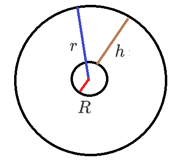

## 基本公式

### 「天上」圆轨道公式

以地球绕着太阳转为例（近似看成圆周运动）：

那么根据 $F_合 = F_向 = F_万$ 有：
$$
速度公式~v:G \dfrac{Mm}{r^2} = m \dfrac{v^2}{r} \implies v = \sqrt{\dfrac{GM}{r}}\\
角速度公式~ \omega: G \dfrac{Mm}{r^2} = m \omega^2 r \implies \omega = \sqrt{\dfrac{GM}{r^3}}\\
周期 ~T: T = \dfrac{2\pi}{\omega} = 2\pi \sqrt{\dfrac{r^3}{GM}} = T^2 M G = 4 \pi^2 r^3\\
加速度~a: a = \dfrac{F_合}{m} = \dfrac{F_万}{m} = \dfrac{GM}{r^2}
$$

> 周期公式 $T^2 M G = 4 \pi^2 r^3$ 巧记：踢踢母鸡等于死派派啊啊啊。

> 注意：这里虽然说的是圆轨道，但实际上在椭圆轨道依然适用，因为椭圆轨道也满足 $F_万 = F_向$。

### 「地上」公式

在地球上，不考虑地球自转，则 $F_万 = G = m \mathrm g$，那么有：
$$
G \dfrac{Mm}{r^2} = m \mathrm g \implies MG  = r^2 \mathrm g
$$
由于当物体在地球上时，质心间距 $r$ 恰好等于星球半径 $R$，所以上述公式也可以写为 $MG = R^2 \mathrm g$。

那么当题目给定的 $\mathrm g$ 是**地球表面**的重力加速度时，对应的公式就是 $MG = R^2 \mathrm g_表$；当题目给定的 $\mathrm g$ 是**距离地球表面一定高度**的重力加速度时，对应的公式应该为 $MG = (R + h)^2 \mathrm g_高$。

> 人距离地球越远重力加速度越小的原因：根据上述公式 $G \dfrac{Mm}{r^2} = m \mathrm g$ 可得，当人远离地球时，$r$ 增大，由于 $G,M,m$ 均不变，所以左边的式子整体减小，所以重力加速度 $\mathrm g$ 减小。

> 小鸡公式 $MG = r^2 \mathrm g$ 巧记：母鸡等于 $r^2$ 平方小鸡。看见小鸡 $\mathrm g$ 想母鸡 $MG$。

### 解题思路

判断是在「天上」还是「地上」：如果题目涉及「小鸡 $\mathrm g$」就用「小鸡（地上）公式」，没有「小鸡」就用「天上公式」。

## 与天体运动有关的题型

### 题目分类总结

$$
天体运动
\begin{cases}
天上 
\begin{cases}
圆轨道
\begin{cases}
比大小:两个卫星绕着同一个中心天体转，比较各种物理量(例如线速度~v、角速度~w) 的大小\\
比值:两个卫星绕着同一个中心天体转，求各物理量的比值。\\
具体计算:两个卫星绕着同一个中心天体转，求各物理量的具体值。
\end{cases}\\
椭圆轨道:只会涉及~\dfrac{a^3}{T^2} = k
\end{cases}\\
地上
\begin{cases}
不考虑地球自转
\begin{cases}
星球表面(考察最多)\\
星球高空(次之)\\
星球内部(考察最少)
\end{cases}\\
考虑地球自转
\end{cases}
\end{cases}
$$

> 有些题目会涉及从「天上」到「地上」的变轨过程。

主要考点：

1. 同步卫星的相关概念。
2. 第一、二、三宇宙速度的含义。
3. 星球密度的相关知识。
4. 多个星球的天体运动，一般涉及双星/三星天体、追及相遇、地球自转和星球内部的天体运动。

### 圆轨道比大小

前提（适用范围）：在天上且做圆周运动，本质上是 $F_向 = F_万$。

题型：

一物体绕着一中心天体沿圆轨道转动，当质心间距 $r$ 增大时：

- 由于 $v = \sqrt{\dfrac{GM}{r}}$，所以 $v$ 减小。
- 由于 $\omega = \sqrt{\dfrac{GM}{r^3}}$，所以 $\omega$ 减小。
- 由于 $T^2 MG = 4 \pi^2 r^3$，所以 $T$ 增大。
- 由于 $a = \dfrac{GM}{r^2}$，所以 $a$ 减小。

> 巧记：高轨（$r$ 变大）低速（线速度角速度角速度减小）大周期（周期减小）。

> 注意：判断多物体绕**同一个中心天体**做圆周运动的圆轨道比较大小也可以利用此方法，但是必须保证是**同一个中心天体**。

> 一个常识：月球的周期一般为 $1$ 个月左右。

例：2018 年 6 月 14 日 11 时 06 分，探月工程嫦娥四号任务「鹊桥」中继星成功实施轨道捕获控制，进入环绕距月球约 6.5 万公里的地月拉格朗日 $L_2$ 点的 Halo 使命轨道，成为世界首颗运行在地月 $L_2$ 点 Halo 轨道的卫星。地月 $L_2$ 是个「有趣」的位置，在这里中继星绕地球转动的周期相同。下列说法正确的是（）

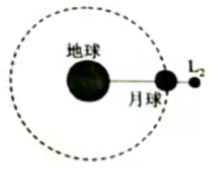

A. 「鹊桥」中继星绕地球转动的角速度比月球绕地球角速度大

B. 「鹊桥」中继星绕地球转动的线速度比月球绕地球线速度大

C. 「鹊桥」中继星绕地球转动的向心加速度比月球绕地球转动的向心加速度大

D. 「鹊桥」中继星绕地球转动的周期比地球的同步卫星周期短

---

分析：

首先此时不能按照「高轨低速大周期」来判断，因为此时中继星受到的 $F_合 \ne F_万$，中继星虽然绕着地球运动，但是它除了受到地球的万有引力外，还受到月球的万有引力，不符合按照「高轨低速大周期」判断的前提条件。

由于题目中已知「中继星绕地球转动的周期与月球绕地球转动的周期相同」：

- 根据 $T = \dfrac{2\pi}{\omega}$ 可知，月球与中继星的角速度相同，所以 A 错误。
- 根据 $v = r \omega$ 可知，中继星的线速度更大，所以 B 正确。
- 根据 $a = \omega^2 r$ 可知，中继星的向心加速度更大，所以 C 错误。
- 根据同步卫星相关的常识可知，同步卫星的周期与地球的周期相同，都是一天左右，因为中继星的周期合月球相同，都是一个月左右，所以同步卫星的周期更短，所以 D 错误。

> 总结：
>
> 对于涉及到一个物体受到**多个星球对它的万有引力**的问题，此时 $F_合 \ne F_万$，不符合使用「高轨低速大周期」的前提，不能直接套用该方法。

> 注意：一般情况下，同步卫星都**只受到**地球对它的万有引力，而对于此题，由于题目中已经说了「中继星绕地球转动的周期相同」，已经不符合「高轨低速大周期」的结论，所以**暗示了此时中继星不仅仅受到地球对它的万有引力，还有月球对它的万有引力**。所以不能直接用这个方法。

### 同步卫星

概念：

相对赤道静止的卫星，同步卫星的周期与**地球自转的周期**相同，为一天。

由于同步卫星相对地球静止，所以又叫**静止卫星**。

> 注意：
>
> - 由于同步卫星是**相对赤道静止**，所以同步卫星的轨道平面必须在赤道平面上。
> - 所有同步卫星的角速度相同，向心加速度大小相等，方向不同。

所用公式：
$$
T^2 M G = 4 \pi^2 r^3
$$
由于 $T,M,G$ 都是定值，所以同步卫星的轨道半径 $r$ 也是一个定值，是 $\pu{42400 km}$。

那要使得同步卫星相对于赤道静止，则它一定平行于赤道面做圆周运动，所以在下图中只有 A 可能是同步卫星。

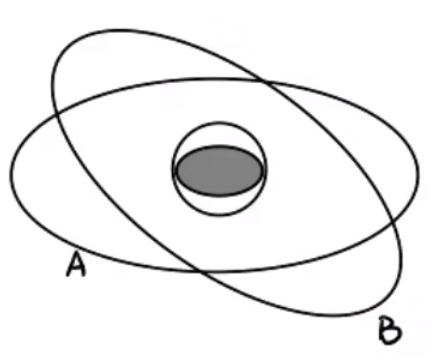

考点：

一般情况下，同步卫星会联系地面（上的物体）考察。由于同步卫星与地面相对静止，二者周期相同，所以根据 $T = \dfrac{2 \pi}{\omega}$ 可知地面（上的物体）与同步卫星的角速度 $\omega$ 相同，再通过圆周运动的基本公式 $v = r \omega$ 和 $a = \omega^2 r$ 即可比较出其它物理量的大小。即「同步卫星看地面」。

### 比值问题

#### 思想

题目问什么，用什么公式。

#### 题目类型分类

$$
比值问题
\begin{cases}
纯「天上」
\begin{cases}
中心天体相同,即~M~ 相同\\
中心天体不同,即~M~不同
\end{cases}\\
有「地上」(含有~\mathrm g)
\end{cases}
$$

同时每一类问题都含有「已知半径求其他物理量」和「未知半径，已知其它物理量求其它物理量」。

#### 「天上」——同一中心天体（$M$ 相同）

解题思路：如果给定半径之比，则直接写出相关公式根据公式求解；如果给定其它物理量之比，则将给定物理量之比转化为半径之比，再根据给定半径之比的方法求解。

题型：

已知半径 $r_1:r_2$：

- 根据 ${T_1}^2 M G = 4 \pi^2 {r_1}^3,{T_2} M G = 4 \pi^2 {r_2}^3$ 可得 $\dfrac{T_1}{T_2} = \sqrt{\dfrac{{r_1}^3}{{r_2}^3}}$。
- 根据 $v_1 = \sqrt{\dfrac{GM}{r_1}},v_2 = \sqrt{\dfrac{GM}{r_2}}$ 可得 $\dfrac{v_1}{v_2} = \sqrt{\dfrac{r_2}{r_1}}$。
- 根据 $\omega_1 = \sqrt{\dfrac{GM}{{r_1}^3}},\omega_2 = \sqrt{\dfrac{GM}{{r_2}^3}}$ 可得 $\dfrac{\omega_1}{\omega_2} = \sqrt{\dfrac{{r_2}^3}{{r_1}^3}}$。
- 根据 $a_1 = \dfrac{GM}{{r_1}^2},a_2 = \dfrac{GM}{{r_2}^2}$ 可得 $\dfrac{a_1}{a_2} = \dfrac{{r_2}^2}{{r_1}^2}$。 

已知速度 $v_1:v_2$，则根据上述 $\dfrac{v_1}{v_2} = \sqrt{\dfrac{r_2}{r_1}}$ 可得 $\dfrac{r_1}{r_2} = \dfrac{{v_2}^2}{{v_1}^2}$，所以周期之比 $\dfrac{T_1}{T_2} = \sqrt{\dfrac{{r_1}^3}{{r_2}^3}} = \dfrac{{v_2}^3}{{v_1}^3}$。

已知周期 $T_1:T_2$，则根据上述 $\dfrac{T_1}{T_2} = \sqrt{\dfrac{{r_1}^3}{{r_2}^3}}$ 可得 $\dfrac{r_1}{r_2} = \sqrt[3]{\dfrac{{T_1}^2}{{T_2}^2}}$，所以加速度之比 $\dfrac{a_1}{a_2} = \dfrac{{r_2}^2}{{r_1}^2} = \sqrt[3]{\dfrac{{T_2}^4}{{T_1}^4}}$。

#### 「天上」——不同中心天体（$M$ 不同）

> 一般情况下中心天体的质量 $M_1,M_2$ 已知，或可以求出。

解题思路：同「同一中心天体」的解题思路。

题型：

已知半径 $r_1:r_2$：

- 根据 ${T_1}^2 M_1 G = 4 \pi^2 {r_1}^3,{T_2} M_2 G = 4 \pi^2 {r_2}^3$ 可得 $\dfrac{T_1}{T_2} = \sqrt{\dfrac{M_2}{M_1} \cdot \dfrac{{r_1}^3}{{r_2}^3}}$。 
- 根据 $\omega_1 = \sqrt{\dfrac{GM_1}{{r_1}^3}},\omega_2 = \sqrt{\dfrac{GM_2}{{r_2}^3}}$ 可得 $\dfrac{\omega_1}{\omega_2} = \sqrt{\dfrac{M_1}{M_2}\cdot \dfrac{{r_2}^3}{{r_1}^3}}$。

> 注意：有时候求角速度 $\omega$ 之比时，如果已知 $T$ 之比，可以直接根据 $T = \dfrac{2 \pi}{\omega}$ 将 $\omega$ 之比转化为周期 $T$ 的反比计算，没必要回到最原始的公式 $\omega = \sqrt{\dfrac{GM}{r^3}}$。

#### 「地上」——含有 $\mathrm g$

解题思路：利用小鸡公式 $MG  = r^2 \mathrm g$ 根据 $M$ 之比和 $r$ 之比求得 $\mathrm g$ 之比。

题型：

已知质量之比 $M_1 : M_2$，行星半径之比 $R_1:R_2$，若卫星绕着这两个行星的表面运行，则根据 $M_1 G = {R_1}^2 \mathrm g_1,M_2 G = {R_2}^2 \mathrm {g_2}$ 可得 $\dfrac{\mathrm g_1}{\mathrm g_2} = \dfrac{M_1}{M_2} \cdot \dfrac{{R_2}^2}{{R_1}^2}$。

#### 含有同步卫星的相关题型

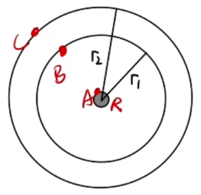

如图所示，物体 $A$ 在地球上，$B$ 是绕地球转动的一颗卫星，其轨道半径为 $r_1$，$C$ 是绕地球转动的一颗**同步卫星**，其轨道半径为 $r_2$，地球半径为 $R$。

那么根据同步卫星的相关知识可知，$T_A = T_C$，所以 $\omega_A = \omega_C$，那么 $\dfrac{v_A}{v_C} = \dfrac{R}{r_2}$。再根据「同一中心天体」中推导可知 $\dfrac{v_B}{v_C} = \sqrt{\dfrac{r_2}{r_1}}$，所以 
$$
\dfrac{v_A}{v_B} = \dfrac{v_A}{v_C}\cdot \dfrac{v_C}{v_B} = \dfrac{R}{r_2}\cdot \sqrt{\dfrac{r_1}{r_2}} = \sqrt{\dfrac{R^2 r_1}{{r_2}^3}}
$$

### 区分三类加速度&三类力

#### 三类加速度

加速度 $a$：来源于牛顿第二定律，由 $a = \dfrac{F_合}{m}$ 计算得到。

向心加速度 $a$：来源于向心力与圆周运动，由 $a_向 = \dfrac{F_向}{m}$ 计算得到。

重力加速度 $\mathrm g$：来源于重力，由 $\mathrm g = \dfrac G m$。

若在「天上」，且物体绕星体做圆周运动，则 $F_合 = F_向$，此时 $a = a_向$，加速度提供向心加速度。

若在「地上」，则 $F_万 = G$。

#### 三类力

$$
F_万 = G \dfrac{Mm}{r^2}\\
G = m \mathrm g\\
F_向 = m a_向 = m \dfrac{v^2}{r} = m \omega^2 r
$$

例：如图所示，物体 $A$ 和 $B$ 在距离地球等距离的轨道上，轨道半径为 $r$，物体 $A$ 在轨道上绕着地球做圆周运动，物体 $B$ 静止不动。

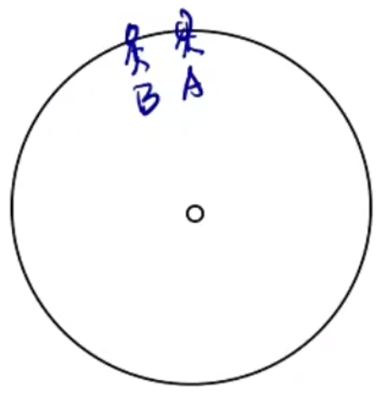

那么由于物体 $A$ 在「天上」，且绕地球沿着轨道做匀速圆周运动，所以对于 $A$ 只有万有引力提供向心力，即 $F_万 = F_向$。

物体 $B$ 可以认为在「地上」，那么此时 $F_万 = G$。

> 注意：
>
> - 物体 $A$ 所受的万有引力**不产生重力的效果**（即完全失重）。
> - 实际上在这个例子中，无论对物体 $A$ 还是 $B$，万有引力都等于重力。对于物体 $A$，实际上有 $F_万 = G = F_向$，重力就是万有引力，所以整体上有一个指向地球的恒力，做匀速圆周运动；而物体 $B$ 除了万有引力（重力）还应该受到其他力，物体 $B$ 整体上受力平衡，所以**不存在向心力**。

这三个力出现的先后顺序：先有万有引力，然后根据「万有引力**需要**提供的效果」，看是万有引力提供向心力还是重力，在「天上」提供向心力，在「地上」提供重力。

形式上，有 $\overrightarrow{F_万} = \overrightarrow{G} + \overrightarrow{F_向}$。在「天上」时，由于**重力效果为 $0$**，所以 $F_万 = F_向$；在「地上」时，不存在向心力，所以 $F_万 = G$。

> 注意：$\overrightarrow{F_万} = \overrightarrow G + \overrightarrow F_向$，在「天上」和在「地上」的参考系不同，这里在「天上」对于重力的定义与我们所理解的重力不同。
>
> 具体地，在「天上」，跟物体一起做圆周运动的物体，观测物体的运动，受力有 $F = F_万 - F_向$；而对于一个外太空观测者，观察到物体的运动，相当于受力为 $F_万$。重力其实是一个在「地上」为了方便精准刻画在地球上看到的受力情况而定义出的效果力，如果同样在「天上」也利用这个原则，那么此时的重力就为 $0$，即重力效果为 $0$，处于完全失重状态。
>
> 一般在高中，对于在「天上」的天体运动，实际上不需要考虑重力。

> 关于万有引力与重力的关系的拓展：
>
> 重力和向心力实际上都是万有引力的分力，如下图所示。
>
> 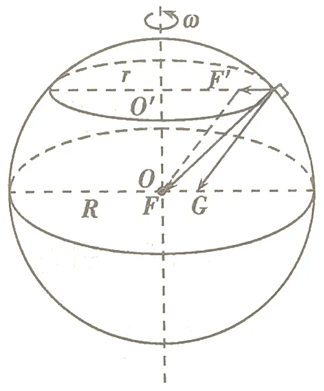
>
> 上图中，$F$ 表示万有引力，$F'$ 表示向心力，$G$ 表示重力。
>
> 根据上图可以看出：
>
> - 当物体在赤道上时，$F,G,F'$ 三力同向，此时 $F'$ 达到最大值 $F'_{\max} = m \omega^2 R$，重力达到最小值 $G_{\min} = F - F'_{\max} = G\dfrac{Mm}{R^2} - m \omega^2 R$。
> - 当物体在两极的极点时，$F'=0,F=G$，此时重力等于万有引力，重力达到最大值 $G_{\max} = G \dfrac{Mm}{R^2}$。
> - 当物体由赤道向两极移动的过程中，万有引力不变，向心力减小，重力增大。

### 三大宇宙速度

#### 大小

**地球**的第一宇宙速度为 $\pu{7.8 km/s}$，第二宇宙速度是 $\pu{11.2 km/s}$，第三宇宙速度是 $\pu{16.7 km/s}$。

> 注意：一般情况下**不同星体**的三大宇宙速度不同。

> 巧记：第二和第三宇宙速度可以通过**整数部分每一位相加等于小数部分**记忆。

#### 第二&第三宇宙速度

若卫星的速度超过第二宇宙速度，卫星就会脱离地球的束缚，发射进入太阳系（不一定会绕着太阳转）；若卫星的速度超过第三宇宙速度，卫星就会脱离太阳的舒服，飞往其它恒星系。

#### 第一宇宙速度

**圆周运动**中最大环绕（绕行）速度。根据 $v = \sqrt{\dfrac{GM}{r}}$ 可知，当 $r$ 约为地球的半径时，$r$ 取最小值，$v$ 取最大值，我们定义这个 $v_{\max}$ 为第一宇宙速度，此时 $r = R$，$v = \sqrt{\dfrac{GM}{r}} = \sqrt{\dfrac{GM}{R}}$。经计算可知，此时 $v = \pu{7.9 km/s}$。此时可以认为物体在「地上」，那么有 $MG = r^2 \mathrm g = R^2 \mathrm g$，所以 $v = \sqrt{\dfrac{GM}{R}} = \sqrt{\mathrm gR}$。所以根据上述过程，我们定义第一宇宙速度为「贴表飞行」的速度。

第一宇宙速度同时也是「最小发射速度」，即使得物体升入太空的最小速度。

> 注意：
>
> - 物体发射至太空，发射过程中做的**并不是**圆周运动。所以第一宇宙速度是**圆周运动中**的最大绕行速度，但是又是使得物体升入太空的**最小发射速度**。
> - 在太空中，物体绕行的轨道半径越大，需要的发射速度也越大。

### 星球密度

> 小 trick：一般情况下，涉及到与「宇航员」有关的问题，目的都是测量 $\mathrm g$。即一般情况下可以通过相关的内容算出 $\mathrm g$，然后根据「小鸡公式」$MG = r^2\mathrm g$ 计算。

#### 一般解法

基本公式：
$$
\rho = \dfrac M V = \dfrac M {\dfrac 4 3 \pi R^3}
$$
对于 $M$，若题目**不涉及** $\mathrm g$，则使用「天上」公式，一般遵循「给什么物理量就用对应物理量的公式」；若题目涉及 $\mathrm g$，则使用「小鸡公式」，即如果题目给定的是地球表面的重力加速度，则对应公式为 $MG = R^2 \mathrm g$。然后根据对应公式求出 $M$。

> 注意：$V = \dfrac 4 3 \pi R^3$ 而不是 $V = \dfrac 4 3 \pi R^2$。

#### 贴表飞行

「贴表飞行」说明物体在「天上」，且此时的速度是第一宇宙速度，此时 $r = R$。其它按照一般解法求解即可。

例：已知一卫星贴表飞行的周期为 $T$，万有引力常数为 $G$。求星球密度。

分析：

根据「贴表飞行」想到 $r = R$，根据题目出现周期 $T$ 想到 $T^2 MG = 4 \pi^2 r^3$，则：
$$
\rho = \dfrac M V = \dfrac{4 \pi^2 r^3}{\dfrac 4 3 \pi R^3 T^2 G} = \dfrac{4\pi R^3}{\dfrac 4 3 \pi R^3 T^2 G} = \dfrac{3 \pi}{T^2 G}
$$

#### 例题

例：科学家计划再 2025 将首批宇航员送往火星进行考察。假设在火星两极宇航员用弹簧测力计测量一质量为 $m$ 的物体，测得的读数为 $F_1$，再火星赤道上宇航员用同一把弹簧测力计测得同一物体，测得的读数为 $F_2$。通过天文观测测得火星的自转角速度为 $\omega$，设引力常数为 $G$，将火星堪称是质量分布均匀的球体，则火星的密度和半径分别是多少。

分析：

根据题意可得，宇航员分别在**两极**和**赤道**测量所得到的 $F_1$ 和 $F_2$ 实际上就是物体在该地的重力。

那么在两极有 $F_1 = G \dfrac{Mm}{R^2}$，在赤道有 $G \dfrac{Mm}{R^2} - F_2 = m \omega^2 R$，联立解得 $R = \dfrac{F_1 - F_2}{m \omega^2}$。

那么
$$
F_1 = G \dfrac{Mm}{R^2} \implies M = \dfrac{F_1 R^2}{Gm}
$$
那么有
$$
\rho = \dfrac M V = \dfrac M {\dfrac 4 3 \pi R^3} = \dfrac{F_1 R^2}{\dfrac 4 3 \pi R^3 Gm} = \dfrac{3 F_1}{4 \pi R G m} = \dfrac{3F_1 m \omega^2}{4 \pi (F_1 - F_2) G m} = \dfrac{3 F_1 \omega^2}{4 \pi(F_1 - F_2) G}
$$

> 注意：本题虽然涉及到宇航员的相关操作，但是**并不是为了求 $\mathrm g$**，所以上面的小 trick 只适用于**一般情况下**。对于此类比较复杂的问题，可以考虑把题目所给的条件尽量翻译成等量关系式然后求解。

### 基础大题

例 1：一艘宇宙飞船绕着某行星作匀速圆周运动，已知运动的轨道半径为 $r$，周期为 $T$，引力常数为 $G$，行星半径为 $R$。求：

1. 行星的质量 $M$；
2. 星球密度；
3. 行星表面的重力加速度 $\mathrm g$；
4. 行星的第一宇宙速度 $v$。

分析：

第一问，题目不涉及 $\mathrm g$，而涉及 $T$，那么：
$$
T^2 M G = 4 \pi^2 r^3 \implies M = \dfrac{4 \pi^2 r^3}{T^2 G}
$$
第二问，根据密度公式有：
$$
\rho = \dfrac M V = \dfrac{4 \pi^2 r^3}{\dfrac 4 3 \pi R^3 T^2G} = \dfrac{3 \pi r^3}{T^2 G R^3}
$$
第三问，涉及 $\mathrm g$，则考虑小鸡公式有：
$$
MG = R^2 \mathrm g \implies \mathrm g = \dfrac{4 \pi r^3}{T^2G}\cdot \dfrac{G}{R^2} = \dfrac{4 \pi r^3}{T^2 R^2}
$$
第四问，根据第一宇宙速度公式可知：
$$
v = \sqrt{\mathrm g R} = \sqrt{\dfrac{4 \pi r^3}{T^2 R^2} \cdot R} = \sqrt{\dfrac{4 \pi r^3}{T^2 R}}
$$

---

例 2：「嫦娥之父」欧阳自远透露：我国计划于 2020 年登陆火星。假如某志愿者登上火星后将一小球从高为 $h$ 的地方由静止释放，不计空气阻力，测得经过时间 $t$ 小球落在火星表面。已知火星的半径为 $R$，引力常数为 $G$，不考虑火星自转，求：

1. 火星的第一宇宙速度；
2. 火星的质量；
3. 火星的密度；
4. 贴表飞行卫星的周期。

分析：

首先题目出现有关宇航员的操作，可以通过其求出 $\mathrm g$，那么根据题目条件有：
$$
h = \dfrac 1 2 \mathrm g t^2 \implies \mathrm g = \dfrac{2h}{t^2}
$$
第一问，根据第一宇宙速度公式可知：
$$
v = \sqrt{\mathrm g R} = \sqrt{\dfrac{2h R}{t^2}}
$$
第二问，由于题目涉及到 $\mathrm g$，所以根据「小鸡公式」得：
$$
MG = R^2 \mathrm g \implies M = \dfrac{2R^2 h}{t^2 G}
$$
第三问，根据密度公式有：
$$
\rho = \dfrac M V = \dfrac{2 R^2 h}{\dfrac 4 3 \pi R^3} = \dfrac{3 h}{2 \pi R}
$$
第四问，卫星贴表飞行，所以 $r = R$，所以根据周期公式有：
$$
T^2 M G = 4\pi^2 r^3 \implies T = \sqrt{\dfrac{4 \pi^2 r^3}{M G}} = \sqrt{\dfrac{4 \pi^2 r^3 t^2 G}{2 R^2 h G}} = \sqrt{\dfrac{2 \pi^2 R^3  t^2}{2 R^2 h}} = \sqrt{\dfrac{\pi^2 R t^2}{h}}
$$

> 注意：题目中的 $h$ 相比于 $R$ 可以忽略不计，所以宇航员测得的 $\mathrm g$ 可以直接用于求解下面的问题中。

---

例 3：利用三颗位置适当的地球同步卫星，可使地球赤道上任意两点之间保持无线电通讯。目前，地球同步卫星的轨道半径约为地球半径的 $6.6$ 倍。假设地球的自转周期变小，若仍仅用三颗同步卫星来实现上述目的，则地球的自转周期最小值约为多少。

分析：

首先要搞清楚「仅用三颗地球同步卫星使地球赤道上任意两点之间保持无线电通讯」的含义，如下图所示。

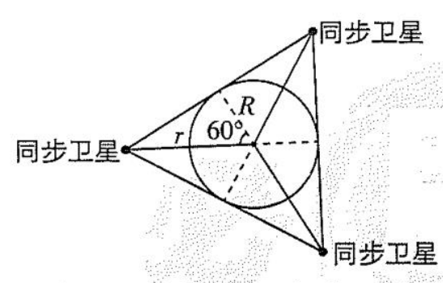

则此时是满足上述题意得**最小轨道半径**，即最小轨道半径 $r = 2R$。

那么设地球自转周期得最小值为 $T$，根据开普勒第三定律可知
$$
\dfrac{(6.6R)^3}{(2R)^3} = \dfrac{(\pu{24h})^2}{T^2} \implies T \approx \pu{4 h}
$$

> 总结：
>
> - 有些题目关键是要弄清题意所要表达的意思；看到周期除了想到「天上」公式中与 $T$ 有关的公式外。
> - 还要想到开普勒第三定律。

### 变轨问题

#### 变轨过程

从低轨变到高轨的步骤：

1. 点火加速，脱离低轨道，进入椭圆轨道。
2. 再次点火加速，进入高轨道。

#### 考点

如图所示，设低轨道 $1$ 与椭圆轨道的焦点为 $P$，椭圆轨道和高轨道 $2$ 的交点为 $Q$。

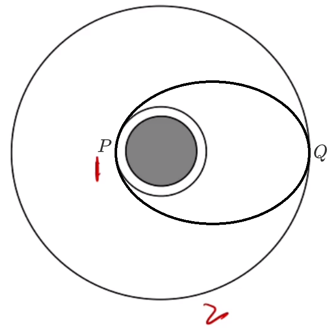

**速度**

比较速度 $v_1,v_2,v_P,v_Q$ 的大小关系：

根据「高轨低速大周期」可知 $v_1 > v_2$。接下来判断 $v_P$ 和 $v_Q$ 的大小关系，考虑从 $P$ 运动到 $Q$ 的过程中，速度与加速度的方向夹角，如下图：

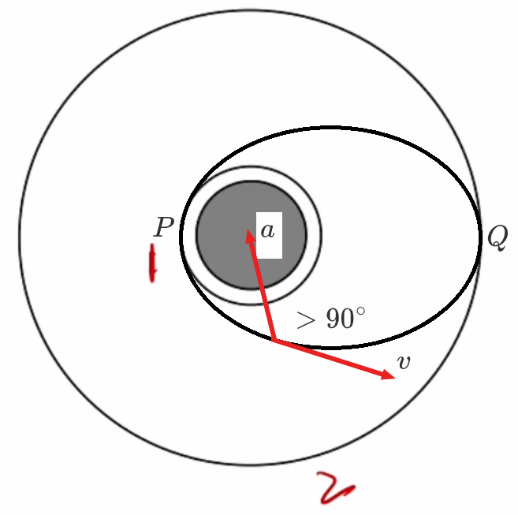

速度方向与加速度方向的夹角 $> 90^\circ$，所以从 $P$ 到 $Q$ 的过程中，做减速度运动，所以 $v_P > v_Q$。

由于从低轨道变速为椭圆轨道是加速，所以 $v_1 < v_P$；从椭圆轨道到高轨道是加速，所以 $v_Q < v_2$。

综上所述，通过排序得 $v_Q < v_2 < v_1 < v_P$。

> 巧记：椭圆速度在两极，高轨低速大周期。

**加速度**

比较 $a_P$ 与 $a_1$ 的大小关系（椭圆轨道上的速度和低轨道速度）：

首先注意，此时比较的 $a_P$ 指的是**在椭圆轨道的速度**，也就是说从低轨道**点火加速后**，**已经进入椭圆轨道**的速度。

那么由于 $F_合 = ma$，所以合外力越大，加速度越大。此时物体在两个位置都只受万有引力，根据 $F_万 = G \dfrac{Mm}{r^2}$ 可得，由于在低轨道的 点 $P$ 和在椭圆轨道上的点 $P$，二者**此时**的轨道半径 $r$ 相同，所以 $a_P = a_1$。同理 $a_Q = a_2$。

> 巧记：点火加速 $a$ 不变。

**周期**

比较 $T_1$ 和 $T_2$ 以及 $T_3$（椭圆轨道的周期）的大小关系：

考虑到「开普勒第三定律」既适用于圆轨道，又适用于椭圆轨道。那么根据 $\dfrac{a^3}{T^2} = k$ 可知，$T$ 的大小只与此时的半长轴 $a$ 有关。那么由于半长轴 $a_1 < a_3 < a_2$，则 $T_1 < T_3 < T_2$。

> 巧记：周期大小看长轴。

## 多星问题

### 双星系统

#### 双星现象

问题模型：两个星体 $A$ 和 $B$ 在太空中，$m_A$ 和 $m_B$ 相近（例如相差一倍两倍等），两物体由于受到各自的万有引力，绕两物体中间某一个点做圆周运动，这就是双星模型。

特征：在双星模型的两个物体，角速度相同，即 $\omega_A = \omega_B$。

#### 解题方法

设 $A,B$ 两星体质心间距为 $L$，对 $A,B$ 分别受力分析，有 $F_万 = F_向$，即：
$$
G \dfrac{M_AM_B}{L^2} = M_A \omega^2 r_A \implies \dfrac{GM_B}{L^2} = \omega^2 r_A \quad (1)\\
G \dfrac{M_AM_B}{L^2} = M_B \omega^2 r_B \implies \dfrac{GM_A}{L^2} = \omega^2 r_B \quad (2)
$$
其中 $r_A,r_B$ 表示 $A,B$ 的运转的轨道半径，**不是 $A,B$ 间的质心间距**。

若题目求的是「整体」物理量：

考虑 $(1) + (2)$ 得：
$$
\begin{aligned}
& \dfrac{GM_A}{L^2} + \dfrac{GM_B}{L^2} = \omega^2 (r_A + r_B) = \omega^2 L\\
\implies & G M_总 = \omega^2 L^3
\end{aligned}
$$
若题目求的是「部分」物理量：

那么由于二者的万有引力是**相互作用力**，所以 $F_{万~A} = F_{万~B}$，考虑 $\dfrac{(1)}{(2)}$，则：
$$
\dfrac{r_A}{r_B} = \dfrac{M_B}{M_A}
$$
半径之比等于质量的反比，则在下图中，$M_A > M_B$ 且 $r_A < r_B$。

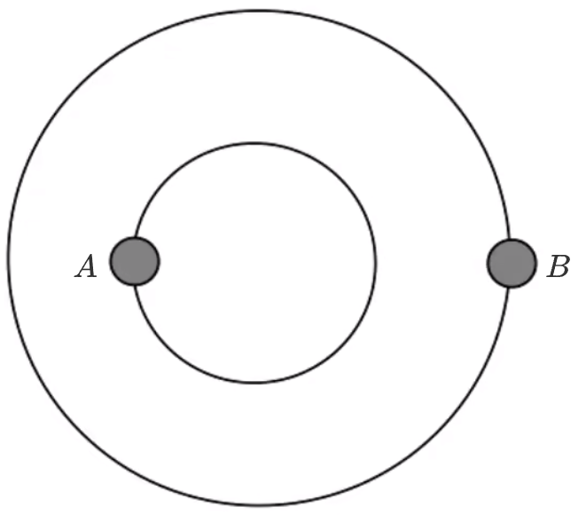

一般情况下，可通过联立 $\dfrac{r_A}{r_B} = \dfrac{M_B}{M_A}$ 和 $r_A + r_B = L$ 求得题目要求的物理量。

> 说明：这里的「整体」物理量是与两物体都有关系的物理量，例如两者质量之和 $M_总$，在双星模型中二者始终保持相同的 $\omega$，两者的质心间距（轨道半径之和）$L$ 等；「部分」物理量指的是与其中一个物体有关的物理量，例如 $M_A,M_B,r_A,r_B$ 等。

### 三星系统

问题模型：如图， 有三个质量均为 $m$ 的星体 $A,B,C$，在一个圆轨道上，且恰好处于等边三角形的三个顶点，绕着中间某个不存在的一点做匀速圆周运动，相邻两星球的间距相同，均为 $r$，求此时 $\omega$ 为多少。

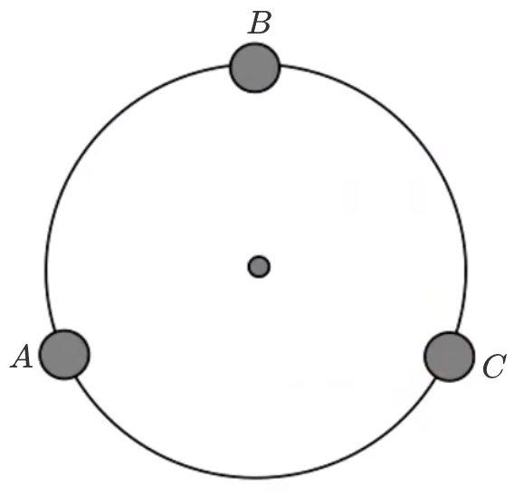

特征：与双星模型相同，同样有 $\omega_A = \omega_B = \omega_C$。

分析：

以星体 $A$ 为例，对 $A$ 受力分析有 $F_合 = F_向$，且此时 $A$ 受到 $B$ 和 $C$ 分别对它的万有引力 $F_B$ 和 $F_C$，由于 $r_{AB} = r_{AC}$，且 $m_A = m_B = m_C$，所以 $F_B = F_C = G \dfrac{m^2}{r^2}$，则：
$$
F_合 = \sqrt{3} ~G \dfrac{m^2}{r^2} = m \omega^2 r_A = \dfrac{\sqrt 3}3m \omega^2 r \implies \omega = \sqrt{\dfrac{3 Gm}{r^3}} \implies T = \dfrac{2\pi}{\omega} = 2 \pi \sqrt{\dfrac{r^3}{3 GM}}
$$

> 这里的 $r_A$ 是 $A$ 做圆周运动的轨道半径，**和问题模型中所给的 $r$ 含义不同**，根据几何关系可知二者的等量关系为 $r_A = \dfrac{\sqrt 3}{3} r$。

> 拓展：
>
> 若 $A,B,C$ 质量不同，将三者围绕转动的点叫做「质心」，下面以 $m_A = m,m_B = 2m,m_C = m$ 为例，求解质心的位置。
>
> 首先考虑 $A$ 和 $C$，则这两个星体的质心在二者连线段上，由于 $m_A = m_C$，所以质心在线段 $AC$ 的中点，设该点为 $D$，则可将 $A,C$ 星体抽象为点 $D$，且认为 $m_D = m_A + m_C = 2m$。
>
> 再考虑 $B$ 和 $D$，则这两个星体的质心在二者连线段上，由于 $m_B = m_D$，所以质心在线段 $BD$ 中点，设该点为 $E$，则可将 $B,D$ 星体抽象为点 $E$，且认为 $m_E = m_B + m_D = 4m$。
>
> 那么形式化地，设 $m_A = a m, m_B = bm,m_C = cm$，则可以首先考虑 $A$ 和 $C$，将线段 $AC$ 分为 $a + c$ 份，则二者质心 $D$ 在从左向右数第 $c$ 份的终点，再重复此步骤找到 $B$ 和 $D$ 的质心即可求解，多星质心同理。

### 追及相遇

问题模型：如图，有两个星体 $A$ 和 $B$，围绕同一个点进行圆周运动，此时 $A,B$ 的位置如下，求：

1. 经过多少时间 $A,B$ 再次距离最近（已知 $T_A,T_B$）？
2. 经过多少时间 $ A,B$ 距离最远（已知 $M,r_A,r_B$）？

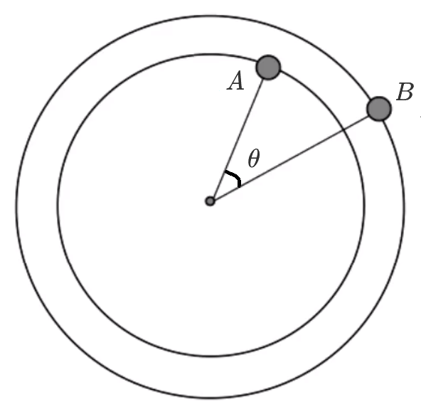

思路：把（角）速度较小的星体看成静止不动（将角速度较小的星体作为参考系），考虑另一个星体和它的相对运动。那么根据「高轨低速大周期」可知，$\omega_A > \omega_B$，所以把 $B$ 看作静止不动，考虑 $A$ 和 $B$ 的相对运动。

公式：
$$
t = \dfrac{\theta_{相对}}{\omega_{相对}} 
$$
即 $A$ 距离 $B$ 最近需要相对 $B$ 运动的角度，除以 $A$ 相对 $B$ 的角速度。

> 从这里可以看出，之所以选择 $\omega$ 小的星体作为参考系，是为了让分母的 $\omega_A - \omega_B$ 为正。

求解：

对于第一问：
$$
t = \dfrac{\theta_{相对}}{\omega_{相对}} = \dfrac{2 \pi - \theta + 2 k \pi}{\omega_A - \omega_B} = \dfrac{(2k + 2) \pi - \theta}{\dfrac{2 \pi}{T_A} - \dfrac{2 \pi}{T_B}}
$$
对于第二问：
$$
t = \dfrac{\theta_{相对}}{\omega_{相对}} = \dfrac{\pi - \theta + 2k \pi}{\omega_A - \omega_B} = \dfrac{(2k+1)\pi - \theta}{\sqrt{\dfrac{GM}{{r_A}^3}} - \sqrt{\dfrac{GM}{{r_B}^3}}}
$$

## 特殊题型

### 「地上」考虑自转

对应的知识点详见「与天体运动有关的题型 - 三类力 - 关于万有引力与重力的关系的拓展」，因为考虑到这两部分内容关联性比较大，而且这也是当时学那块的内容时我因为没搞懂一些题而补充的知识点，所以这里不做赘述，只放一道例题。

例：在地球两极和赤道的重力加速度大小分别为 $\mathrm {g_1,g_2}$，地球自转周期为 $T$，万有引力常量为 $G$，若把地球看作为一个质量均匀分布得圆球体，则地球的密度是多少？

分析：

对地球两极和赤道的物体分别进行受力分析得：
$$
\begin{cases}
G \dfrac{Mm}{R^2} = m \mathrm g_1\\
G \dfrac{Mm}{R^2} = m \mathrm g_2 + m \dfrac{4 \pi^2}{T^2}\cdot R
\end{cases}
\implies R = (\mathrm g_1 - \mathrm g_2) \cdot \dfrac{T^2}{4 \pi^2}
$$
同时在两极有 $MG = R^2 \mathrm g_1$，所以 $M = \dfrac{R^2 \mathrm g_1}{G}$，则：
$$
\rho = \dfrac{M}{V} = \dfrac{M}{\dfrac 4 3 \pi R^3} = \dfrac{R^2 \mathrm g_1}{\dfrac 4 3 \pi R^3 G} = \dfrac{3 \mathrm g_1}{4 \pi RG} = \dfrac{3 \times 4 \pi^2 \mathrm g_1}{4 \pi (\mathrm g_1 - \mathrm g_2) T^2 G} = \dfrac{3 \pi \mathrm g_1}{(\mathrm g_1 - \mathrm g_2)T^2G}
$$

### 「地上」星体内部

对「质量分布均匀的球壳对壳内物体的万有引力为零」的理解：

如下图所示，整个大圆表示一个球体，有一个小球在球体内轨道 $1$ 上运行，则图中的**蓝色部分不会对轨道上的小球产生万有引力，只有红色部分对轨道上的小球有万有引力作用**。

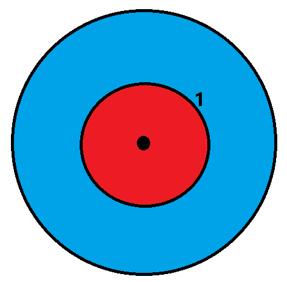

---

例（2016 天津模拟）理论上已经证明：质量分布均匀的球壳内物体的万有引力为零。现假设地球是一半径为 $R$、质量分布均匀的实心球体，$O$ 为球心，以 $O$ 为原点建立坐标轴 $O_x$。如图所示，一个质量一定的小物体（假设它能够在地球内部移动）在 $x$ 轴上各位置受到的引力大小用 $F$ 表示，则选项图所示的四个 $F$ 随 $x$ 的变化关系图正确的是（）

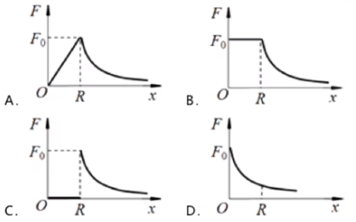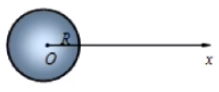

分析：

首先当质心间距 $r \ge R$ 时，有 $F_万 = G \dfrac{Mm}{r^2}$，此时 $M,m$ 不变，$r$ 增大时，$F_万$ 减小。

当质心间距 $0 < r < R$ 时，此时仍然有 $F_万 = G \dfrac{Mm}{r^2}$，但此时有 $M$ 和 $r$ 两个变量，所以不能使用 $r \ge R$ 的方法。

考虑到地球密度始终不变，那么根据 $\rho = \dfrac M V$ 可知 $M = \rho V = \dfrac 4 3 \rho \pi r^3$，那么
$$
F_万 = G \dfrac{Mm}{r^2} = G \dfrac{\dfrac 4 3 \rho m\pi r^3}{r^2} = \dfrac 4 3 \rho Gm\pi r
$$
那所以当 $r$ 增大时，$F_万$ 增大，且 $F_万 \propto r$，故选 A。

> 总结：小球在星体内部时，需要通过万有引力和密度公式求得 $F_万$ 与 $r$ 的关系，然后求解；当小球在星体表面或外部时，可以直接通过万有引力公式求得 $F_万$ 与 $r$ 的关系。

