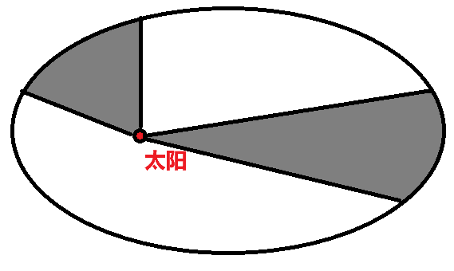

# 【物理】天体运动

## 物理学史

1. 托勒密提出了「地心说」，认为太阳绕着地球转，太阳做匀速圆周运动。
2. 哥白尼提出了「日心说」，认为地球绕着太阳转，地球做匀速圆周运动。
3. 第谷通过多年观察行星，测量了大量**太阳系**范围内的观测数据。
4. 开普勒计算了第谷观测的数据，提出了「开普勒三大定律」。认为地球绕着太阳转，且运动轨迹是椭圆，太阳在该椭圆的一个焦点上。
5. 牛顿在前人研究的基础上，提出了**万有引力 $F$**，且提出了 $F \propto \dfrac{Mm}{r^2}$。
6. 卡文迪许通过**扭秤实验**，测得 $F = G \dfrac{Mm}{r^2}$，且 $G = \pu{6.67E-11}$。

## 开普勒三大定律

### 第一定律

地球（行星）绕着太阳（恒星）转，其轨迹是椭圆，太阳（恒星）在椭圆的一个焦点上。

### 第二定律

相同时间内，地球（行星）与太阳（恒星）连线扫过的面积相同。

如图所示，图中两部分阴影面积是相同时间内地球与太阳连线扫过的面积，那么这两部分面积相同。

由于在相同时间内，左侧运动的弧长较短，右侧较长，所以**近日点速度较大，远日点速度较小**。

此时有 $v_1 r_1 = v_2 r_2$，$v$ 表示此时地球的速度，$r$ 表示地球与太阳连线长。

### 第三定律

地球（行星）公转周期 $T$ 的平方与半长轴 $a$ 的三次方成正比，即 $\dfrac{a^3}{T^2} = k$，其中 $k$ 是定值，只与中心天体（这里是太阳）的质量 $M$ 有关。

例如：金星和地球都绕着太阳转，所以它们公转的 $k$ 相同；月球和人造卫星绕着地球转，所以它们公转的 $k$ 相同。

在太阳系中，距离太阳越远的星球，对应椭圆轨道的 $a$ 越大，由于 $k$ 是定值，所以 $T$ 越大，即运动周期越长。

> 注意：
>
> - 开普勒第三定律是解决天体运动中**椭圆轨道**问题的**唯一公式**。
> - 一般情况下，题目中会将「椭圆轨道」近似当作「圆轨道」，那么此时椭圆中的半长轴 $a$ 就是圆中的半径 $r$，即 $\dfrac{r^3}{T^2} = k$。

## 万有引力

### 基本公式

$$
F_万 = G \dfrac{Mm}{r^2}
$$

其中，$G$ 是引力常数，大小大约是 $\pu{6.67E-11}$，单位是；$r$ 是质心间距。万有引力的方向**指向对方的质心**。

> 注意：$r$ 是**质心**间距，一般情况下题目所说「两球体相距 $x$ 米」指的**不是**质心间距，$x + r_1 + r_2$ 才是质心间距。其中 $r_1$ 和 $r_2$ 分别表示两球体的半径。

例：两材质相同的球体大球质量为 $m$，半径为 $R$，小球的半径为大球的一半，二者相距 $d$，求 $F_万$。

求解：

由于两球材质相同，所以密度相同，又由于小球的半径是大球的一半，根据 $V_球 = \dfrac 4 3 \pi R^3$ 可知，小球的质量是大球的 $\dfrac 1 8$。

所以
$$
F_万 = G \dfrac{Mm}{r^2} = G \dfrac{\dfrac 1 8 m^2}{\left(\dfrac 3 2 R + d\right)^2}
$$

### 割补法

适用范围：求**不规则**图形之间的万有引力。

公式：

转化为规则图形之间的万有引力相减，如下：
$$
F_万 = F_{万总} - F_{万空}
$$
例：一个质量为 $m$、半径为 $R$ 的小球被挖了一个半径为大球一半的小球，放在了距离大球 $d$ 位置处，求 $F_万$。

求解：

发现此时直接用基本公式时，不知道大球被挖去后的质心位置，所以不能用基本公式直接求解。

考虑割补法。挖掉小球后的大球与小球间的万有引力，等于 完整的大球与小球间的万有引力 $-$ 挖去部分与小球的万有引力，即 $F_万 = F_{万~1} - F_{万~2}$。具体计算不做赘述。

