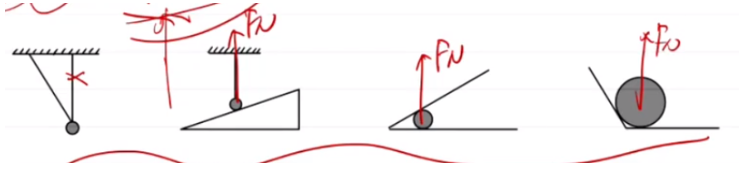
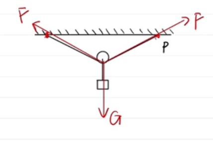
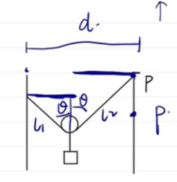

# 【物理】平衡力学

## 重力

1. 大小：$G=m\mathrm{g}$；
2. 方向：竖直向下；
3. $\mathrm{g}$：不是定值，与**高度**和**纬度**有关；高度越高，$\mathrm{g}$ 越小；纬度越高，$\mathrm{g}$ 越大。
4. 重心：
   - 测量方法：**悬挂法**。规则图形的重心在几何中心。
   - 误区：重心**不一定**在物体上。
5. 注意事项：一个装满水的气球下方开口漏水的过程中，重心先往下运动再往上运动。

## 弹力

1. 概念：产生形变的物体由于想要恢复原来的状态会对所接触的物体产生力的作用，一般用 $F_N$ 表示。

2. 弹力的方向：

   「平衡思想」：上下左右均有力。

   - 接触面类型：垂直于接触面指向受力物体；分为**面与面**、**面与点**、**点与点**接触。其中面与点接触关键是找到谁是面谁是点，这里的点是「端点」。点与点接触一般垂直于「点所在切线」指向受力物体。

   - 绳子：沿绳收缩（中心）方向，即从受力物体沿着绳子方向。

   - 活杆：沿杆方向（向内或向外），向外还是向内可以通过「平衡思想」，必须保证受力物体所受的力平衡。

   - 死杆：受力分析（二力平衡），例如除了弹力只受重力说明其方向竖直向上。

   - 特殊情况：某些情况下不能直接利用上述规律判断，即存在「接触但无力」的情况。判断到底**有没有力**的问题，需要通过「平衡思想」判断，必须保证受力物体在平衡状态下所受的力也平衡；同时也可以通过撤掉对应可能的施力物体，判断受力物体的运动状态是否改变，若运动状态改变则说明**有力**，反之则**无力**。

     常见情况：

     

## 摩擦力

1. 概念：两个相互作用的物体，当它们发生相对运动或具有相对运动的趋势时，就会产生阻碍相对运动的力。

2. 条件：①接触；②相对运动（趋势）；③粗糙；④挤压（有弹力）；

3. 类型：①静摩擦力（相对静止）；②最大静摩擦力；③滑动摩擦力（相对运动）。

   【注意】**计算**时，最大静摩擦力 = 滑动摩擦力；**实验**时，最大静摩擦力**略大于**滑动摩擦力。

4. 方向：平行于接触面，与物体相对运动的方向相反（受力物体与施力物体保持共速）。

5. 大小：

   - 静摩擦力：没有公式，根据受力分析得出。
   - 滑动摩擦力：$f_滑=\mu \cdot F_N$，其中 $\mu$ 表示滑动摩擦因数。

6. 有关摩擦力大小的计算步骤：

   - 先判断摩擦力种类：静摩擦/滑动摩擦；
   - 再判断摩擦力方向；
   - 最后求摩擦力大小：静摩擦力用受力分析；滑动摩擦力用摩擦力公式；如果是特殊的静摩擦（最大静摩擦力）既可以利用最大静摩擦力 = 滑动摩擦力，也可以直接根据静摩擦力的求解方法求解。

## 受力分析

1. 分析力的顺序：①外力（平移）；②一重二弹三摩擦（一重二接触）。
2. 要求：①同一个点；②画的长一点（出头）；③标字母；
3. 潜规则：默认粗糙。

## 正交分解

1. 平衡条件：从力的角度来说，上 = 下，左 = 右。
2. 步骤：
   - 建系：尽可能让多个力落在坐标轴上；
   - 分解：分解不在坐标轴上的力；
   - 列式：上 = 下，左 = 右（有时候只有某一个方向上平衡，那么只能在该方向上存在等式）。

## 斜面模型——物体在斜面上是否静止

判断 $G_x$（即 $G$ 在 $x$ 轴上的分力）与最大静摩擦力（滑动摩擦力）$f_滑$ 的大小关系：

- 若 $G_x>f_滑$：则做加速直线运动；
- 若 $G_x = f_滑$：则做匀速直线运动；
- 若 $G_x = f_静 < f_滑$：则保持静止。

## 弹簧专题

### 了解弹簧

1. 一般高中的弹簧指的是**质量不计**的轻弹簧；
2. 弹簧能够伸长的原因：两端受力；
3. 受力特点：平衡 $\to $ 两端受力大小相等。

### 受力分析

1. 方向：①$F$ 沿弹簧向外——弹簧压缩；②$F$ 沿着弹簧向内——弹簧伸长；
2. 注意事项：
   - **先画受力，再知状态**。
   - 在**多弹簧**模型中，可以先分析容易分析（例如受力较少的）物体，再分析不易分析的物体。
   - 对于难以判断弹力方向的题目，可以先假设弹簧的状态是**收缩**还是**伸长**，再推出各个物体的受力分析，若推出矛盾，则说明假设错误；反之，则假设正确。

### 胡克定律

1. 计算：$F_N=k\cdot \Delta x$，其中 $k$ 是劲度系数（弹性系数），单位是 $\pu{N/m}$，注意不是 $\pu{N/cm}$。 其中 $\Delta x$ 表示形变量。当压缩和伸长量相等时，对应的 $F_N$ 大小也相等，方向相反。

2. 拓展：$\Delta F = k \cdot \Delta x$，其中 $\Delta F$ 表示变化的力，$\Delta x$ 表示变化量。

   变化量与形变量的区别：变化量指的是**末状态的弹簧长度** $-$ **始状态的弹簧长度**，而形变量指的是**末状态的弹簧长度** $-$ **原长**。形变量相当于特殊的变化量，即起点是原长的变化量。

   $F_N$ 和 $\Delta F$ 同理。

### 【拓】弹簧串并联

1. 串联：
   - 受力分析：从物块出发，根据每个弹簧**受力大小相等**，分析弹簧所受的力以及形变量。
   - 结论：$\dfrac{1}{K}=\dfrac{1}{k_1}+\dfrac{1}{k_2}$，形变量 $\Delta x = \dfrac{F}{K}$。
2. 并联：
   - 受力分析：从物块出发，根据每个弹簧**形变量相同**，分析弹簧所受的力以及形变量。
   - 结论：$K=k_1+k_2$，形变量 $\Delta x = \dfrac{F}{K}$。

### 端点位移

> 定义「端点」表示弹簧问题中无法移动的一端。

1. 判断物块位移量：物块位移量 = 从该物块开始到端点的“路径”中，所有经过的弹簧的位移量之和；

2. 求解此类问题的一般方法——列表法：

   表示力时可规定弹簧伸长为 $+$，收缩为 $-$。
   $$
   \begin{array}{}
   弹簧& 1 & 2 \\
   施加弹力前&F_x&y\\
   施加弹力后&F_x'&y'\\
   变化量&\Delta F_x=F_x'-F_x&\Delta F_y=F_y'-F_y\\
   形变量&\dfrac{\Delta F_x}{k_1}&\dfrac{\Delta F_y}{k_2}
   \end{array}
   $$

## 力的合成

### 基础概念及求解方法

**概念**

将两个或多个力合成一个力；

**求解**

- 平行四边形法则：①共点力；②以要合成的两个力为邻边做平行四边形，以这两个力的公共作用点为起始点做出这条平行四边形的对角线，从公共点出发指向对角线的另一端点的力即为合力。适用于所有的矢量合成。
- 三角形法则：①首尾相连的力；②从第一个力的起点指向第二个力终点的力即为合力。

**矢量（合力）的特点**

- 可以平移。
- 一个矢量（合力）可以分解为多个矢量（合力）相加的结果。
- 合力分解之后的分力一定小于合力。

### 力的合成取值范围问题

**二力**

- 最大：根据两边之和大于第三边，两个力平行且方向相同时合力最大，合力大小的最大值为两个力的数值相加；
- 最小：同理，两个力平行且方向相反时合力最小，合力大小的最小值为两个力的数值之差的绝对值。

**三力**

- 最大：三个力平行且同向时最大，合力大小的最大值为三个力的数值相加；
- 最小：$0N$，三个力首尾相接，合力可以为 $\pu{0N}$；

**多个力**

- 最大：同上；
- 最小：①排除最大的力；②找剩下的力的范围；③与最大的力比较：若第二步的取值范围包含了最大的力，则答案是 $\pu{0 N}$，反之，答案则是最大的力减去第二步取值范围的最大值。

例如：$\pu{3 N, 4 N, 5 N}$ 三个力合成，最大值是 $3+4+5=\pu{12N}$，而最小值可以先排除 $\pu{5N}$，找到 $\pu{3N}$ 和 $\pu{4N}$ 合成的范围（根据二力合成范围可知是 $1\sim\pu{7N}$），由于 $\pu{1N < 5 N < 7 N}$，所以 $\pu{5N}$ 可以被抵消，即合力大小最小值为 $\pu{0 N}$。

> 说明：题目中问到「可能平衡的一组力」可以翻译为「这几个力的合力可能是 $0$」，可以直接转化为力的合成取值范围问题求解。

## 力的分解

**概念**

将一个合力分解为两个分力。

**求解方法**

1. 找到合力的起点和终点，分别作为两个力的其中一个端点；
2. 确定第一个力另一个端点的位置：
   - 若已知该力的大小，则以起点为圆心，力的大小为半径画圆；
   - 若已知该力的方向，则从起点开始，向着该力的方向做出一条射线。
3. 确定第二个力的位置，确定方法同第二步。
4. 由于两个力在三角形法则下是首尾相连的两个力，即两个力有一个公共端点，所以可以找到 2 3 步所画出的两个力可能位置的公共点，即为两个分力可能的公共点。

**力的分解可能的几种情况**

- 已知两个分力方向：则两个分力的公共端点是以起点和终点为端点的两条射线的交点，有 $1$ 种情况；

- 已知两个分力大小：则两个分力的公共端点是以起点和终点为圆心的两个圆的交点。若两个圆相交，则有 $2$ 种可能；两个圆相切，则有 $1$ 种可能；两个圆相离，则有无解。

- 已知一个分力的大小和另一个分力的方向：则两个分力的公共端点是以起点为端点的射线和以终点为圆心的圆的交点。设合力为 $F$，第一个分力与合力的夹角为 $\theta$，第二个分力为 $F_0$。

  若射线与圆相交，当 $F > F_0 > F\cdot \sin \theta$ 时，则有 $2$ 种可能；当 $F_0 \ge F$ 时，则有 $1$ 种可能；

  若射线与圆相切，即 $F_0 = F\cdot \sin \theta$，则有 $1$ 种可能；

  若射线与圆相离，即 $F_0<F\cdot \sin \theta$，则无解。

- 已知一个分力的大小和方向：这个力确定，则另一个力也确定，即有 $1$ 种情况。

## 动态平衡

### 单个物体

#### 动态三角形

【特殊方法】

大部分题目（一般有 $G$）适用。

1. 适用范围：三个力只有一个力方向改变。
2. 求解步骤：
   - 反向延长一个**方向不变**的力：一般**不选择**重力 $G$。
   - 竖直向下平移**方向改变**的力：使得三个力构成首尾相接的一个三角形。
   - 动态分析**方向改变**的力：考虑该力如何变化，从而判断出各个力的大小变化。

【一般方法】

适用于所有的情况（当然也适用于不适合用第一种做的情况）。

1. 适用范围：题目中存在一个定力（方向不变），一个恒力（大小方向均不变），变力（大小方向均改变）。
2. 求解步骤：
   - 反向延长定力。
   - 平移：向着恒力的方向平移，恒力不变，使得三个力构成首尾相接的三角形。
   - 动态分析。

#### 相似三角形

1. 适用范围：三个力有 $2$ 个力方向改变。
2. 求解步骤：
   - 反向延长一个**方向改变**的力：一般选择绳子作为**施力物体**的力。
   - 竖直向下平移另一个**方向改变**的力。
   - 找相似三角形：一般一个是「边的三角形」另一个是「力的三角形」，常用方法是反向延长弹力。
   - 列相似比：根据相似比判断对应边长度的改变或力大小的改变。

#### 等腰三角形

本质：$F$ 与绳子偏转的角度 $\theta$ 有关。

重要公式：$F=\dfrac{G}{2\cos \theta}$。

【定长】

1. 适用范围：涉及（定）滑轮（一根绳），且 $F$ 和 $\theta$ 会改变。

2. 求解方法：

   当固定绳子的一端**水平移动**时，如图：

   

   在上图中，当 $P$ 端**水平移动**时，会改变 $\theta$ 的大小，向右移动增大，向左移动减小。根据正交分解可得：
   $$
   F=\dfrac{G}{2\cos \theta}
   $$
   所以 $F$ 随着 $\theta$ 的增大而增大。

   当固定的绳子的一端会**上下平移**时，如图：

   

   $P$ 端上下移动，那么有：
   $$
   L_1\cdot \sin \theta + L_2\cdot \sin \theta = d \longrightarrow \sin \theta = \dfrac{d}{L_1 + L_2}=\dfrac{d}{L}
   $$
   由于 $d$ 和 $L$ 都不变，所以 $\theta$ 不变，所以 $F$ 不变。

   总结：水平移动角改变，竖直移动角不变，力与角变化相同。

【定力】

1. 适用范围：涉及（定）滑轮（一根绳），且 $F$ 保持不变。

2. 求解方法：

   同「定长」根据正交分解可得：
   $$
   F=\dfrac{G}{2\cos \theta}
   $$
   由于 $F$ 不变，且物体 $G$ 不变，所以 $\theta$ 不变。

#### 直角三角形（特殊的相似三角形）

1. 适用范围：有两个力（一般是支持力 $F_N$ 和摩擦力 $f$）始终垂直，一般题目中重力、摩擦力、支持力三力平衡。
2. 求解方法：
   - 利用**正交分解**列式：然后根据题目中某角度的变化，判断对应力的变化。
   - 画圆：通过将力平移，使得三个力构成首尾相接的三角形，这个时候可以根据 $G$ 保持不变，另外两个力在以 $G$ 为直径所在的圆上跑，然后动态分析力的变化。

#### 四力三角形

1. 适用范围：涉及四个力（一般是 $F_N,f,G,F$）平衡，物体在斜面/水平面上匀速运动，一般可以把 $F_N$ 和 $f$ 合为一个力，从而转化为三个力，利用「动态三角形」求解。

2. 求解步骤（以水平面为例）：

   - 将摩擦力 $f$ 和弹力 $F_N$ 合并为一个力 $F_地$，即地面对物体的作用力，则 $F_地$ 方向不变。
   - 此时四力变三力，$F_地$ 方向不变，$G$ 大小方向均不变，$F$ 方向改变，可以直接利用「动态三角形」的步骤求解。
   - 利用动态三角形求解完合并之后的三个力的变化情况后，被合并的力 $F_N$ 和 $f$ 变化情况与 $F_地$ 的变化情况相同。

3. 求解原理：

   由于物体在运动，所以受到的摩擦力是滑动摩擦力，所以 $f=\mu F_N$，所以 $f$ 的变化与 $F_N$ 变化同向，即 $F_N$ 增大或减小，$f$ 也增大或减小。所以它们合成的力 $F_地$ 怎么变化，$f$ 和 $F_N$ 也怎么变化，即这两个力的变化与 $F_地$ 的变化同向。

   同时，$\tan \theta = \dfrac{f}{F_N} = \dfrac{\mu F_N}{F_N} = \mu$，由于 $\mu$ 不变，所以 $F_地$ 的方向不变。

### 多物体

一般使用「动态三角形」求解。

求解步骤：

1. 对题目中所涉及的**每个**物体进行受力分析。
2. 对每个物体进行正交分解，建系并列式得到每个物体的受力情况。
3. 找出受力情况中需要求解的力，根据多个物体的受力情况找到对应的联系，从而将某个要求解的力转化为其它物体的力。
4. 将转化后的力，根据「动态三角形」的求解步骤求解。

一般情况下多物体动态平衡可结合使用隔离法和整体法，隔离法如上，而整体法就相当于将整个系统整体受力分析，忽略内力。整体法一般用于求解题目要求对整个系统做功的情况。

## 做题相关易错点及注意事项

1. 进行正交分解受力分析列式时，涉及到 $\mu$ 的题目注意计算式不要漏掉 $\mu$。
1. 正交分解建立坐标系若不好计算，可以考虑让 $x$ 和 $y$ 轴换一个方向。

