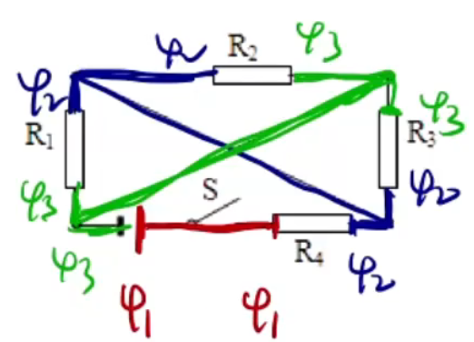

# 【物理】恒定电流

## 电流

### 基本概念

恒定电流：大小和方向都不变的电流。

直流电：方向不变的电流。

交流电：方向改变的电流。

### 电流相关

形成：电荷的定向移动。

方向：正电荷移动的方向，即负电荷的反方向，与电子运动方向相反。

定义：单位时间内通过的电荷量。

公式：
$$
I = \dfrac Q t
$$
单位是安培，用 $\pu A$ 表示。

> 注意：若题目给定了 $n$ 个电子，则此时电荷量 $Q$ 为 $n \cdot \pu{1.6E-19}\ \pu C$，那么电流就是这个电荷量除以时间。

### 电流的微观计算

#### 已知单位体积的电子数 $n$

步骤：

1. 取一段时间 $\Delta t$。
2. 计算这段时间通过某横截面的柱体体积 $V$：往往使用底面积乘高来计算。
3. 计算电荷量、电流。

题型：单位体积内有 $n$ 个电子，这些电子运动了时间 $t$ 后，求其电流的大小。

求解：

设总共经过的体积为 $V$，横截面积为 $S$，长度为 $L$，电流的速度为 $v$，则：

$$
\begin{aligned}
I & = \dfrac Q t \\
& = \dfrac{n V e}{t}\\
& = \dfrac{n S L e}{t}\\
& = neSv = nvSe
\end{aligned}
$$

> 注意：
>
> - 这里的 $n$ 个电子指的是「单位体积内有 $n$ 个电子」，若题目已知「单位长度内有 $n$ 个电子」不能直接套用此公式，所以不建议**直接记忆此公式**。
> - 求解某物理量时，往往有**宏观**和**微观**两条路可走，例如求通过导体的横截面积的自由电子数目 $N$ 可使用 $N = \dfrac q e = \dfrac{I \Delta t}{e}$ 或 $nSv \Delta t$ 求解。

#### 已知单位长度的电子数 $n$

步骤：

1. 取一段时间 $\Delta t$。
2. 计算这段时间通过某横截面的长度 $L$。
3. 计算电荷量、电流。

题型：单位长度内有 $n$ 个电子，这些电子运动了时间 $t$ 后，求其电流的大小。

求解：

设总长度为 $L$，则：
$$
\begin{aligned}
I & = \dfrac{Q}{t}\\
& = \dfrac{Lne}{t}\\
& = \dfrac{nevt}{t}\\
& = nev
\end{aligned}
$$

### 三种速度

电子定向移动的速率**数量级**是 $\pu{E-5 m/s}$。

电子热运动的速率**数量级**是 $\pu{E5 m/s}$。

电子的传导速率**数量级**是 $\pu{E8 m/s}$。

### 电路中的用电器

这里主要说明各用电器的电路符号。

电源：。

表头：。

电流表：。

电压表：。

电灯泡：。

电阻：。

电容器：。

电动机：。

## 电源

### 电动势

电动势描述的是非静电力做功的本领。

定义：数值上把 $\pu{1 C}$ 正电荷从负极搬回到正极所做的功。

符号：电源电动势一般用 $E$ 表示。

如图所示，干电池上方为正极，下方为负极，那么电流从正极流向负极，电动势就是将正电荷从负极搬回正极所做的功。

本质上电源的作用是为了确保电源正负极始终含有电势差，这样才能保证有恒定电流通过。

### 内阻

> 注意：电阻初中忽略不计，但高中需要考虑。一般只要题目未说明「内阻忽略不计」，都要考虑。

内阻表示电源内部的等效电阻。一般用字母 $r$ 表示。

做题时的等效电路图：。

#### 电路中的公式表

|  物理量  | 字母（单位） |                公式                |
| :------: | :----------: | :--------------------------------: |
|   电流   |  $I(\pu A)$  |   $I = \dfrac Q t = \dfrac U R$    |
|  电动势  |  $E(\pu V)$  |          $E = \dfrac W q$          |
|   电压   |  $U(\pu V)$  |              $U = IR$              |
|   电阻   | $R(\Omega)$  | $R = \dfrac U I = \rho \dfrac L S$ |
|  电功率  |  $P(\pu W)$  | $P = UI = I^2 R = \dfrac{U^2}{R}$  |
|  发热量  |  $Q(\pu J)$  |           $Q = I^2 R t$            |
| 供电效率 |    $\eta$    |      $\eta = \dfrac{UI}{EI}$       |

## 电路中的两条规律

### 欧姆定律

公式：
$$
I = \dfrac U R
$$
变形：
$$
U = IR\\R = \dfrac U I
$$
适用范围：**金属导体**和**电解液**中。

> 注意：小灯泡属于纯电阻，也可以使用欧姆定律计算。

### 串并联电路的规律

#### 串联电路

图象：

特点：

电流 $I$ 处处相同。

电压 $U = U_1 + U_2$，所以串联电路具有分压的作用。

等效电阻：

如上图，其中 $R = R_1 + R_2$。

列式：
$$
I_1 = I_2\\
\dfrac{U_1}{R_1} = \dfrac{U_2}{R_2} \implies \dfrac{U_1}{U_2} = \dfrac{R_1}{R_2}
$$
所以在串联电路中 $U$ 之比等于 $R$ 之比。

#### 并联电路

图象：

特点：

电压 $U$ 相同。

电流 $I = I_1 + I_2$，所以并联电路的作用是分流。

等效电路：

如上图，其中 $\dfrac 1 R = \dfrac 1 {R_1} + \dfrac 1 {R_2}$，整理得 $R = \dfrac{R_1\cdot R_2}{R_1 + R_2}$。

列式：
$$
U_1 = U_2\\
I_1 \cdot R_1 = I_2 R \implies \dfrac{I_1}{I_2} = \dfrac{R_2}{R_1}
$$
所以在并联电路中 $I$ 之比等于 $R$ 的反比。

## 运用电势的思想简化电路

两条准则：

1. 一根导线（未通过用电器）上的电势处处相等。
2. 电流通过用电器，电势降低。

作用：可以快速判断电路中两用电器并联（若判断不是并联则就是串联），即若电阻两边的电势相等，则这两个电阻并联。

例如：

如上图所示，根据两条准则分析可知 $R_1$ 和 $R_2$ 两边的电势差相等，所以 $R_1$ 和 $R_2$ 并联。

**例题**

例 1：

首先画出等电势的导线，那么 $R_1,R_2,R_3$ 两端的电势差相等，所以三者并联，然后根据电流从高电势流向低电势可知电流从 $\varphi_1$ 到 $\varphi_2$，那么等效电路为：

---

例 2：

首先画出等电势的导线，那么 $R_1,R_2,R_3$ 两端电势差相等，所以三者并联，$R_4$ 电势差与他们不相等，所以 $R_4$ 与他们串联，根据电流从高电势流向低电势，可知电流从 $\varphi_1$ 到 $\varphi_2$ 再到 $\varphi_3$，那么等效电路图为：

## 部分电路（无电源）相关题型

### 解题思路

可将电压恒定为 $U$ 的两点看成接一个电源电压为 $U$ 的电源，求某两点间的电压看成有一个电压表。

> 解题时需要注意运用等效电路的思想。

### 例题

例 1：如图所示的电路称为分压电路，当 $a、b$ 间电压恒为 $U$ 时，当滑动变阻器的滑片逐渐向上滑动的过程中 $c、d$ 间的电压 $U_{cd}$（）

A. 一直为 $U$

B. 一直为 $0$

C. 逐渐减小到 $0$

D. 逐渐增大到 $U$

---

分析：

根据电势分析有：

当滑片移动到电阻上端时，$\varphi_3 = \varphi_1$，那么 $U_{cd} = |\varphi_3 - \varphi_2| = |\varphi_1 - \varphi_2| = U$；当滑片移动到电阻下端时，$\varphi_3 = \varphi_2$，那么 $U_{cd} = |\varphi_3 - \varphi_2| = |\varphi_2 - \varphi_2| = 0$，所以向上移动电压 $U_{cd}$ 会逐渐增大到 $U$。故选 D。

> 注意：这里 $cd$ 间不能视为导线，应该视为电压表。

---

例 2：如图所示，当 $ab$ 端接入 $\pu{100 V}$ 电压时，用理想电压表测得 $cd$ 两端电压为 $\pu{20 V}$，当 $cd$ 两端接入 $\pu{100 V}$ 电压时，用理想电压表测得 $ab$ 两端电压为 $\pu{50 V}$，则 $R_1 : R_2 : R_3$ 等于多少。

分析：

当 $ab$ 端接入 $\pu{100 V}$ 电压时，$R_3$ 上不通过电流，所以其两端不存在电势差，那么整个电路相当于两个 $R_1$ 和 $R_2$ 串联，$cd$ 测 $R_2$ 电压。

根据串联电路中电阻特点可知：$2R_1 : R_2 = 80:20 = 4:1$，所以 $R_1:R_2 = 2:1$。

同理可知 $2R_3:R_2 = 50:50 = 1:1$，所以 $R_2:R_3 = 2 : 1$，综上 $R_1 : R_2 : R_3 = 4 : 2 : 1$。

> 注意：这里 $ab$ 接入电压时，$ab$ 相当于接入电源，$cd$ 接入电压表，所以电流不经过 $R_3$，所以 $R_3$ 两端dian'shi'cha

## 电表改装

### 表头

定义：一个有**微弱**电流就会偏转的仪器。是由灵敏电流表改装而成的。

电路符号：。

缺点：量程小，一般只有 $\pu{1 mA}$ 数量级。

最大电压量程：用电流量程乘上电阻得到。

### 电流表

电路符号：。

电路原理：由于电流（相比表头量程）过大，所以需要分流，那么根据并联电路可以分流的特点，需要给表头并联一个电阻；由于并联电路中电阻越小电流越大，所以需要并联一个**阻值较小的电阻**。

电路组成：

### 电压表

电路符号：。

电路原理：由于电压（相比表头电压量程）过大，所以需要分压，那么根据串联电路可以分压的特点，需要给表头串联一个电阻；在串联电路中电阻越大分到的电压越多，所以需要串联一个**较大的电阻**。

电路组成：

### 电表改装

做题步骤：

1. 判断是电流表还是电压表改装，并确定扩大倍数，确定是需要串联还是并联（电流相等还是电压相等）。
2. 计算在原有的基础上新加上的电阻需要分担多少电流 / 电压。
3. 根据串并联电路的规律列出等式：串联 $I$ 相等，$U,R$ 成正比，即 $\dfrac{R_1}{R_2} = \dfrac{U_1}{U_2}$；并联 $U$ 相等，$I,R$ 成反比，即 $\dfrac{R_1}{R_2} = \dfrac{I_2}{I_1}$。

### 指针偏转

#### 解题技巧

通过表头的电流来判断偏转角度，然后再同时根据电阻的分流判断度数。

#### 例题

例 1（多选）：如图所示，电流表 $\mathrm{A_1}$（$\ce{0\sim 3 A}$） 和 $\mathrm{A_2}$（$\ce{0\sim 0.6A}$） 由两个相同的电流计改装而成，现将这两个电流表并联后接入电路中，闭合开关 $\mathrm S$，调节滑动变阻器，那么  $\mathrm{A_1 : A_2}$ 的读数之比和指针偏转角度之比分别是多少？

求解：

由于两电流表由两个相同的电流计改装而成，所以两个电流表内部的表头阻值完全相同，由于二者并联，所以通过两个表头的电流相同，所以指针偏转角度相同。又由于两个电流表量程为 $5:1$，所以读数之比是 $5:1$。

---

例 2：用两个相同的小量程电流表分别改装成了两个量程为 $\pu{0.6 A}$ 的电流表 $\mathrm{A_1}$ 和 $\pu{3 A}$ 的电流表 $\mathrm{A_2}$，若把 $\mathrm {A_1,A_2}$ 采用串联的方式接入电路，如图所示，则闭合开关后，两电表示数和电表指针偏转角度之比分别为多少？

求解：

由于两电流表串联，所以通过两电流表的电流相同，所以示数相同，由于量程之比为 $1:5$，所以偏转角度之比为 $5:1$。

> 注意：有的时候如果可以直接判断，则不一定需要利用「通过表头的电流」来判断指针偏转角度。

## 伏安法测电阻

【原理】
$$
R = \dfrac U I
$$
【分类】根据电流表是否在电压表内部，分为电流表的**内接法**和**外接法**。

【内接法】

示意图：

误差分析：

根据图示可知，$I_A = I_R$，所以电流表测得的电流准确；电压表实际上测的是电流表和电阻的电压之和，即 $U = U_A + U_R$，所以不准确。

那么测得的电阻 $R_测 = \dfrac{U_A + U_R}{I} > R$，即测得的电阻比真实值大。

原因：电流表分压。

适用范围：适用于**大电阻**。（电阻越大分到的电压越多，越接近真实值）

【外接法】

示意图：

误差分析：

电压表测量准确，即 $U_V = U_R$；电流表测的是电压表和电阻的总电流，即 $I = I_V + I_R$，所以不准确。

那么测得的电阻 $R_测 = \dfrac{U}{I_V + I_R} < R$，即测得的电阻比真实值小。

原因：电压表分流。

适用范围：适用于小电阻。（电阻越小在并联电路中电流越多，即分到的电流越多）

> 拓展——给定电阻、电流表和电压表的阻值，判断适用于内接法 / 外接法：
>
> 判断 $R_x$ 与 $\sqrt{R_A R_V}$ 的大小关系（或判断 ${R_x}^2$ 与 $R_A R_V$ 的大小关系），若 ${R_x}^2 < R_A R_V$，则电阻较小，使用外接法；反之，使用内接法。

【总结】

|   种类   |                            内接法                            |                            外接法                            |
| :------: | :----------------------------------------------------------: | :----------------------------------------------------------: |
|  电路图  |  |  |
| 误差原理 |                          电流表分压                          |                          电压表分流                          |
| 测量比较 |                   $U_测$ 偏大，$R_测$ 偏大                   |                   $I_测$ 偏大，$R_测$ 偏小                   |
| 使用条件 |                 ${R_x}^2 \ge R_A \cdot R_V$                  |                 ${R_x}^2 \le R_A \cdot R_V$                  |

## 滑动变阻器的两种接法

引进：因为实验具有偶然性，为了降低实验误差，需要多组数据，滑动变阻器能够使得我们观察到连续的数据变化。

对比（以电流表内接法为例）：

|           种类           |                            限流式                            |                            分压式                            |
| :----------------------: | :----------------------------------------------------------: | :----------------------------------------------------------: |
|          电路图          |  |  |
|           优点           |                        电路简单，节能                        |            电压表可以从 $0$ 开始变化，变化幅度大             |
|           缺点           |            电压表不能从 $0$ 开始变化，变化幅度小             |                        电路复杂，耗能                        |
| 不同量程滑动变阻器的选择 |                        选择量程较大的                        |                        选择量程较小的                        |

说明：

1. 限流式由于滑动变阻器和电流表、电阻串联，电压表测电流表和滑动变阻器的电压，要使得电压表示数越小，则滑动变阻器阻值越大，但无论如何，由于滑动变阻器必须分压，所以电压表始终不为 $0$；而分压式中，当滑动变阻器指针位于右端，此时电压表两侧电势差为 $0$，即电压表示数可能为 $0$。
2. 若题目给定两个量程不同的滑动变阻器，量程分别为 $0\sim 20\ \Omega$ 和 $0 \sim 200\ \Omega$，限流式由于电压表不能从零开始，要使它从接近 $0$ 开始，那么要尽量保证滑动变阻器分到更多电压，则滑动变阻器需要选择量程较大的，而分压式需要选用量程较小的。
3. 若题目中没有明确说明，一般采用「分压式」接滑动变阻器；若题目提到「绿色环保」「节能减排」等，一般采用「限流式」。但具体情况还要具体分析。

## 伏安特性曲线

> 注意：$Y$ 轴为 $I$，$X$ 轴为 $U$。即随着电压的变化电流变化。

线性元件：$I-U$ 图像是过原点的直线。此时图像斜率 $k = \dfrac I U =  \dfrac 1 R$，此时 $k$ 是定值，$R$ 为定值。实例：电阻。

非线性元件：$I-U$ 图像不是过原点的直线。实例：电灯泡，电阻会随着温度 / 电流 / 电压 / 功率的增大而增大。

线性元件和非线性元件伏安特性曲线的对比：

|    种类    |                           线性元件                           |                          非线性元件                          |
| :--------: | :----------------------------------------------------------: | :----------------------------------------------------------: |
|    图像    |  |  |
| $R$ 的表示 |  |  |
| $P$ 的表示 |  |  |

说明：

1. 无论是线性元件还是非线性元件，都有 $R = \dfrac 1 k$，由于 $R = \dfrac U I$ 而非 $\dfrac{\Delta U}{\Delta I}$，所以这里的 $k$ 指的是**曲线上一点到原点的直线斜率**，与传统意义上**曲线上某点的切线斜率**不同，而当曲线恰好是过原点的直线时，这两种斜率的意义相同。由于线性元件的伏安特性曲线是过原点的直线，所以其图像上**某一点到原点的直线斜率**与**某一点的切线斜率**相同。
2. 非线性元件伏安特性曲线中，随着 $U$ 的增大，曲线上一点到原点的直线斜率 $k$ 在逐渐减小，那么根据 $R = \dfrac 1 k$，$R$ 在逐渐增大，所以 $R$ 随着 $U$ 的增大也在逐渐增大。
3. 根据 $P = UI$ 可知，线性元件和非线性元件在某点的功率 $P$ 都是该点向两坐标轴作垂线后所围成的矩形的面积。
4. 在物理中，不能简单的说 $k = \tan \theta$，因为这个结论成立的前提是两坐标轴的量度相同，但在伏安特性曲线中不一定相同。

> 拓展：
>
> 在下图中，若定义 $k$ 表示某点到原点所在直线的斜率，即 $k = \dfrac 1 R$，那么随着 $U$ 的增大，$k$ 逐渐增大，$R$ 逐渐减小。
>
> 

## 焦耳定律

### 内容

电流通过电阻时，电阻会发热，那么其发热量为
$$
Q = I^2 R t
$$

### 相关物理量及其公式

相关物理量的意义&公式：

|  物理量  |           意义           |         公式         |
| :------: | :----------------------: | :------------------: |
|   电功   |     电能转化为其他能     |     $W_电 = UIt$     |
|   电热   |      电能转化为热能      |     $Q = I^2 Rt$     |
|  电功率  | 电功率转化为其他能的功率 |     $P_电 = UI$      |
|  热功率  |  电功率转化成热能的功率  |    $P_热 = I^2R$     |
| 额定功率 |  正常工作时消耗的电功率  | $P_额 = P_机 + P_热$ |

常见物理量公式推导：

电功推导：
$$
W_电 = Uq = U It
$$
电功率推导：
$$
P_电 = \dfrac W t = UI
$$
那么有：
$$
W_电 = Q + E_{其它}
$$
当且仅当电势能完全转化为发热量，即 $E_{其它} = 0$ 时，$Q = W_电 = I^Rt = UIt$。在实际情况中即为**纯电阻电路**。

> 注意：一般题目中若求发热量，如果没有特殊条件，只使用 $I^2 Rt$ 求解。

热功率推导：
$$
P_热 = \dfrac Q t = I^2 R
$$
机械能功率机械功率为
$$
P_机 = P_电 - P_热 = UI - I^2 R
$$

### 例题

如图所示的电路中，输入电压 $U$ 恒为 $\pu{12 V}$，灯泡 $L$ 上标有「$\pu{6V、 12 W}$」字样，电动机线圈的电阻 $R_M = \pu{0.40 \Omega}$，若灯泡恰能正常发光，求：

1. 电动机的输入功率。
2. 电动机的输出功率。
3. 整个电路消耗的电功率。
4. 电动机若卡住不转动，灯泡将能否烧坏，请说明理由。

求解：

第一问：

电动机的输入功率一般指的是电动机的**电功率**。

因为灯泡正常发光，所以电路中电流 $I = \dfrac P U = \pu{2 A}$。又因为输入电压恒为 $\pu{12 V}$，灯泡两端的电压为额定电压 $\pu{6 V}$，所以加在电动机两端的电压为 $U = 12 - 6 = \pu{6 V}$，所以 $P_电 = UI = 6 \times 2 = \pu{12 W}$。

> 注意：根据 $P = UI$ 计算电功率时，这里的 $U$ 不能用 $U = I R_M = 2 \times 0.4 = \pu{0.8 V}$，因为这里计算得到的 $U$ 指的是线圈电阻两端的电压，**而非电动机的电压**。即用电器电阻的物理量不等于整个用电器的物理量。

第二问：

电动机的输出功率一般指的是电动机的**机械功率**。

那么
$$
P_机 = P_电 - P_热 = P_电 - I^2R_M = 12 - 1.6 = \pu{10.4 W}
$$

> 注意：这里求 $P_热$ 实际上也可以用 $UI$，但这里的 $U$ **不是电动机的电压，而是电动机线圈电阻两端的电压**。

> 说明：电动机正常工作情况下，其内部由线圈电阻和机械构成。灯泡正常工作下，线圈电阻的电压是 $\pu{0.8 V}$，主要作用是把电势能转化成热能；机械的电阻是 $\pu{5.2 V}$，主要作用是把电势能转化成机械能。若电势能全部转化成热能（即电势能减小是因为发热），则可以使用欧姆定律计算电功率，反之不能。

第三问：

整个电路消耗的电功率是电动机和灯泡的电动率之和，即 $12 + 12 = \pu{24 W}$。

第四问：

电动机卡住不转动，说明电势能没有转化成热能，所以电动机的电功率等于其内部线圈电阻的电功率。

那么此时电路中的总电阻是 $3 +  0.4 = \pu{3.4 \Omega}$，此时电路中的电流 $I_总 = \dfrac{12}{3.4} > \pu{2 A}$。所以灯泡会被烧坏。

## 闭合电路欧姆定律

### 认识闭合电路

【等效电路】

闭合电路中的等效电路：

例如：如下图所示的电路中，当滑动变阻器向右边滑动时，电阻增大，所以电流增大，电流表示数增大；同时串联电路中阻值增大，分压增大，所以电压表示数增大。

> 注意：这里和初中不同，初中这里不考虑电源内阻，所以电压表示数不变。

【相关概念】

在闭合电路（全电路）中包含内外两种电路，其中：

电源内部称为内电路，表达式：$U_内 = I_总 \cdot r_内$。

电源外部称为外电路。

外电压又称**路端电压**，用 $U_路/U_外$ 表示，表示的是电源两端的电压 $U$。

例如上图等效电路中电压表所测的就是路端电压，**并不是电源的电动势**，由于有内阻分压，**一般比电源电动势偏小**。

【闭合电路公式】
$$
E = U_外 + U_内 = U_外 + I_总 \cdot r_内
$$
即电源电动势等于外电压加内电压。

### 闭合电路的动态分析

#### 程序法

适用范围：适用于所有电路。

缺点：步骤复杂，耗时长。

解题步骤：

1. 判断电路中总电阻 $R_总$ 如何变化。
2. 通过总电阻的变化判断出总电流 $I_总$ 的变化，从而推得内电压 $U_内$ 的变化，再推得 $U_外$ 的变化。
3. 根据电路中总物理量的变化判断电路中每一个用电器的物理量变化，一般只能使用**欧姆定律**或**串并联电路的规律**，先考虑前者，前者不能使用则考虑后者。

#### 串反并同

适用范围：在电路中只有一个用电器物理量在自发的改变（例如只有一个电阻在改变），电源有内阻，且符合一般情况下电源本身变化的规律（题目没有对电源进行特殊说明）。

用法：判断电路中剩下的用电器与阻值改变的电阻 $R$ 是**串联**还是**并联**，若串联，则其电压、电流和功率与电阻 $R$ 的阻值变化相反；若并联，则其电压、电流和功率与电阻 $R$ 的阻值变化相同。

> 注意：
>
> - 这里的串并联和传统意义上理解的串并联稍微有点不同，当经过 $R$ 的电流也会经过某用电器，则说明该用电器和电阻 $R$ 串联。
> - 可以把电表和电源内阻 $r$ 也看做一个用电器判断与电阻 $R$ 的串并联关系，从而判断电表的示数变化。

例如：下图中，$R_3$ 和电源内阻 $r$ 与 $R_1$ 串联，$R_2$ 和电压表与 $R_1$ 并联，所以当滑动变阻器滑片向右移动时，$R_1$ 减小，$R_3$ 和 $r$ 的电压电流功率增大，$R_2$ 和电压表的电压电流功率减小。

说明：

1. 若题目问有关路端电压的信息，那么考虑在电源两端**并联上一个电压表**，相当于用来测路端电压，然后判断这个电压表和阻值改变的电阻 $R$ 是串联还是并联，从而求解。
2. 若题目问阻值改变的电阻 $R$ 自身的相关物理量，则考虑对它本身并联 / 串联上一个电压表 / 电流表，从而判断。

串反并同解决电流故障问题：

- 如果某用电器被短路，可以看作该用电器电阻减小为 $0$。
- 如果某用电器断路，可以看作该用电器电阻增大为无穷大。

从而将问题转化为电阻改变的动态分析，直接求解。

> 注意：断路时，有的电表示数可能为 $0$。

> 有关电流路径的一个注意事项：如下图，经过 $R_1$ 的电流不能再流过电压表，因为电流从高电势流向低电势，而这里电压表和 $R_1$ 左端电势相同。
>
> 

### 电源中的几种新的物理量

|       物理量       |               含义               |                         公式                         |
| :----------------: | :------------------------------: | :--------------------------------------------------: |
| 电源功率（总功率） |       电源提供的全部电功率       |                  $P = E \cdot I_总$                  |
|    电源输出功率    |        电源给外电路的功率        |                $P = U_外 \cdot I_总$                 |
|    电源消耗功率    |   电源内阻消耗的功率（热功率）   |               $P_热 = I^2 \cdot r_内$                |
|      供电效率      | 用电器得到的和电源提供的功率之比 | $\eta = \dfrac{U_外 I}{EI} = \dfrac{R_外}{R_外 + r}$ |

> 注：根据供电效率的公式可知，由于内阻 $r$ 不变，所以 $R_外$ 越大，供电效率越大。

三个功率的图像：

如上图，电源总功率 $P = E \cdot I_总$，其中 $E$ 为定值，相当于一次函数 $y = ax$ 的图像，所以是图中的红线；电源消耗功率（热功率）$P_热 = I^2 \cdot r_内$，$r_内$ 为定值，相当于二次函数 $y = bx^2$ 的图像，且开口向上经过原点，所以是图中的蓝色曲线；电源输出功率等于 $P = P_总 - P_热 = EI - I^2r$，相当于二次函数 $y = ax - bx^2$ 的图像，开口向下，即图中紫色曲线。

### 闭合电路的计算

思路：

直接看题目中描述电源的物理量，有两种情况：

- 若电源内阻和电动势已知：则利用**欧姆定律**建立一个方程求解。
- 若电源内阻和电动势未知：则根据 $E = U_外 + I_总 \cdot r$ 联立与这两个物理量有关的两个方程求解。

求解时画出闭合电路的简化电路更方便求解，简化电路时，不用画出电表，但需要画出电源内阻。

例如：下面两幅图中下图是上图的简化电路。

### $\dfrac{\Delta U}{\Delta I}$ 类型问题

看 $\Delta U$ 的研究对象是夹在谁两边的电压，有两种情况：

- 若研究对象是定值电阻 $R$，则 $\dfrac{\Delta U}{\Delta I} = R$。
- 若研究对象是非定值电阻，则 $\dfrac{\Delta U}{\Delta I} = R_{其它}$，这里的 $R_{其它}$ 指的是电路中的其它电阻之和，这里的其它电阻需要把**电源内阻 $r$ 包含在内**。

适用范围：适用于电路中只有一个电阻阻值改变**。

> 注意：
>
> - 一般情况下若研究对象是非定值电阻，那么 $R_{其它}$ 是定值电阻或定值电阻阻值之和，所以一般情况 $\dfrac{\Delta U}{\Delta I}$ 都不变。
> - 若题目问的是多个 $\Delta U$ 之间的大小关系，可以给所有 $\Delta U$ 同时除以 $\Delta I$，从而把 $\Delta U$ 的大小转化成 $\dfrac{\Delta U}{\Delta I}$ 的大小关系。

### 最值功率问题

看所求功率是哪个研究对象电阻的功率，有两种情况：

- 若研究对象是定值电阻，则根据 $P = I^2 R$ 可知，当 $I$ 最大时，$P$ 最大，即当变化阻值 $R_变 = 0$ 时，获得最大功率。
- 若研究对象是可变电阻，则当 $R_变 = R_{其它}$ 时，获得最大功率。

> 注：若题目求得是电源输出功率的最大值，那么研究对象相当于外电路，即外电路中的所有电阻之和（不包含 $r$）。

对于第二种情况的推导说明：

设 $P$ 表示研究对象电阻的功率，$R_1$ 表示研究对象电阻的阻值（可变），$R_2$ 表示电路中除了研究对象之外其他电阻的阻值和，一般情况此类问题中的电路往往是**串联电路**，所以这里以 $I_总$ 表示串联电路中的总电流，那么
$$
\begin{aligned}
P & = {I_总}^2R_1\\
& = \dfrac{E^2}{(R_1 + R_2)^2} \cdot R_1\\
& = \dfrac{E^2R_1}{{R_1}^2 + 2R_1R_2 + {R_2}^2}\\
& = \dfrac{E^2}{R_1 + 2R_2 + \dfrac{{R_2}^2}{R_1}}
\end{aligned}
$$
由于 $R_1 + \dfrac{{R_2}^2}{R_1} \ge 2\sqrt{R_1 \cdot \dfrac{{R_2}^2}{R_1}} = 2R_2$，所以 $P \le \dfrac{E^2}{4R_2}$，那么当 $R_1 = R_2$ 时，$P$ 取最大值，此时 $P_{\max} = \dfrac{E^2}{4R_2}$。

若题目求的是电源输出功率最大值时，此时研究对象为外电路所有电阻的阻值和，那么此时 $P_{\max} = \dfrac{E^2}{4r}$。

---

同时，当研究对象电阻改变时，其功率 $P$ 和它的电阻阻值 $R$ 的关系图像如下图所示：

根据此图像可以快速解题，例如：当 $R_变 = \pu{3 \Omega},R_{其它} = \pu{5 \Omega}$ 时，可变电阻增大时，的功率 $P$ 会先增大后减小。

### 闭合电路图像

闭合电路的外电压 $U$ 和电路中总电流 $I$ 的图像如下：

由于 $E = U_外 + I_总 \cdot r$，所以 $U_外 = -r \cdot I_总 + E$，那么在 $U-I$ 一次函数图像中，映射到 $y = kx + b$ 上，那么 $k = -r,b = E$。

图像中的物理意义：

1. 与 $y$ 轴的交点：当 $I_总 = 0$ 时，此时 $U_外 = E$，所以 $y$ 轴交点是电源电动势。实际情况是电压直接和电源相连，无其它用电器。
2. 与 $x$ 轴的交点：当 $U_外 =  0$ 时，此时 $I_总$ 最大，所以 $x$ 轴交点是电流最大值 $I_{\max} = \dfrac E r$。实际情况是电源短路，所以此时的电流也叫**短路电流**。
3. 图像斜率 $k$：根据闭合电路计算中的相关知识可知，$|k| = \dfrac{\Delta U_外}{\Delta I} = r$。那么 $U-I$ 直线越陡，$r$ 越大。
4. 图像**过原点的斜率** $k_0$：此时 $k_0 = \dfrac{U_外}{I} = R_外$。
5. 过图像某点分别做两坐标轴垂线，与两坐标轴围成的矩形的面积：同理「伏安特性曲线」中的知识，可知这个面积表示电源输出功率 $P_出$。
6. 过图像某点做 $y$ 轴的平行线，过图像与 $y$ 轴交点做 $x$ 轴平行线所围成矩形的面积：此时这个面积是 $EI$，即电源总功率 $P_总$。

5 和 6 中所描述的面积如下两幅图所示：

> 拓展：伏安特性曲线往往可以和闭合电路电源的 $U-I$ 图像一块考察，如下图所示，下图中的直线 $1$ 和 $2$ 分别表示两个电源的 $U-I$ 图像，过原点的直线是定值电阻 $R$ 的伏安特性曲线，那么根据伏安特性曲线与两图像的交点可知，$R$ 接在直线 $1$ 表示的电源上时 $U$ 更大。
>
> 
>
> 除此之外，闭合电路图像还可以和组织改变时电阻功率和阻值的关系图像一起考察，若题目涉及功率，往往需要通过 $P-R$ 图像判断变化规律，再结合 $U-I$ 图像计算。

> 注意：根据图像计算电源内阻 $r$ 时，要注意图像原点处的电压不一定是 $0$，如下图所示，原点处的电压为 $1$，那么计算内阻是 $\Delta U$ 应该是 $4 - 1 = 3$。
>
> 

例题：图甲为某电源的 $U-I$ 图线，图乙为某小灯泡的 $U-I$ 图线，那么如果把电源和小灯泡组成闭合回路，则小灯泡功率大约是多少？

求解：

考虑将小灯泡与电源的图像合为一个图像，由于电源的图像是直线且与坐标轴交点确定，考虑在小灯泡的图像中绘制电源图像，那么可以将图甲中两个关键点 $(0,1.5)$ 和 $(3,1.0)$ 在图乙中找到，然后用两点法绘制出电源的图像，如下图所示：

如图所示，则二者的交点所对应的电流和电压即为此时电路中总电流和外电压，那么小灯泡此时的功率约为 $0.5 \times 6 = \pu{3 W}$。

> 注意：若题目没有给定电源 $U-I$  图像，但给定了内阻和电动势，则可以根据短路电流 $I = \dfrac E r$ 算出短路电流，从而找到图像与坐标轴的两个交点，再根据两点法画出电源图像。

## 含容电路

### 含容电路简单计算

步骤：

1. 将电容器看成理想电压表（断路），画出电流。
1. 看电容器两端的电压：主要是为了考虑到后续计算 $Q$，利用 $Q = C\cdot U$ 计算。
1. 根据电压的变化计算出电荷量的变化。

> 第二步中看电容器两端的电压主要是为了看它测得是谁的电压，然后把电容器电压转化成所测用电器的电压。具体分析方法可以使用电势法，没有电流通过的用电器**两端电势相同**，两端电势与电容器两端电势相同的用电器即为电压和电容器电压相同的用电器。

> 注意：
>
> - 涉及电荷量变化的题目，需要分别计算出始末状态下的电压，然后根据 $\Delta Q = C \cdot \Delta U$ 计算。
> - 若电路不构成闭合电路，则电容器电压**不一定是电源电动势**，需要视情况而定，不能想当然。

例：如图所示，电阻 $R_1 = \pu{3 \Omega}$，$R_2 = \pu{6 \Omega}$，电容器的电容 $C = \pu{30 \mu F}$，电源电动势 $E = \pu{10 V}$，内阻 $r = \pu{1 \Omega}$。闭合开关 S，电路中电流稳定后，再断开开关 S，直到电路中电流再次问鼎，求通过 $R_1$ 的电荷量。

求解：

闭合开关前，电容器已经有了一部分电荷量；断开开关后，电源中的电荷量会继续流向电容器，途径 $R_1$，所以实际上题目所求的「通过 $R_1$ 的总电荷量」就是电容器在闭合开关和断开开关后**电荷量的变化量**。

闭合开关前，根据电势法分析可知，此时电容器的电压等于 $R_2$ 两端的电压，根据分压特点可知，此时 $R_2$ 两端电压为 $10 \times \dfrac{6}{1 + 3 + 6} = \pu{6 V}$。

断开开关后，此时电路不构成闭合回路，即整个电路中没有电流流过，可根据电流电势法分析，电容器的电压就等于外电压 $U_外$，根据 $E = U_外 + Ir$，此时 $I = 0$，所以 $E = U_外$，即电容器的电压等于电源电动势，即 $\pu{10 V}$。

那么可知通过 $R_1$ 的总电荷量就是电容器变化的电荷量，即 $\Delta Q = C \cdot \Delta U = \pu{30E-6}\times (10 - 6) = \pu{1.2E-4 C}$。

> 注意：这道题将通过 $R_1$ 的电荷量转化为电容器变化的电荷量，这是一种常用的转换方式。

### 含容电路电量分配

题型：经过电容器的电荷量经过多个支路后汇聚，求某个支路的电荷量。

思路：根据电荷量之比等于电流之比，电流之比等于电阻的反比，可以考虑把支路电阻之比求出来，从而推得电荷量之比。

例：如图所示电路，$A、B$ 两点间接上一个电动势为 $\pu{4 V}$、内电阻为 $\pu{1 \Omega}$ 的直流电源，三个电阻的阻值均为 $\pu{4 \Omega}$，电容器的电容为 $\pu{20 \mu F}$，电流表内阻不计，闭合开关 S 待示数稳定后，断开开关 S，那么通过 $R_2$ 的电荷量是多少？

根据电势法分析可知，闭合开关时，电容器的电压等于 $R_3$ 两端的电压，计算可知为 $\pu{3.2 V}$，根据 $Q = CU$ 可知电容器电荷量为 $\pu{6.4E-5 C}$；断开开关后，电路不形成闭合电路，电路中无电流通过，那么根据电势法分析，电容器两端电势差为 $0$，所以电容器电压为 $0$，所以从闭合开关到断开开关电容器一直在放电，且放电量为 $\pu{6.4E-5 C}$，那么此时电荷量流动的等效电路如下图所示：

由于 $R_1$ 和 $R_2$ 阻值相同，所以流经电流相同，那么通过 $R_2$ 的电荷量 $Q_2 = \dfrac 1 2 Q = \pu{3.2E-5 C}$。

> 拓展：
>
> 如下图，电源电动势是 $\pu{10 V}$，通过 $R_1$ 的电压是 $\pu{1 V}$，通过 $R_2$ 的电压是 $\pu{4 V}$，那么电容器两端的电压是多少？
>
> 
>
> 由于电源电动势为 $\pu{10 V}$，所以 $R_1$ 和 $R_2$ 左端的电压都是 $\pu{10 V}$，由于通过 $R_1$ 的电压是 $\pu{1 V}$，那么 $R_1$ 右端的电压是 $\pu{10 - 1 = 9 V}$，同理 $R_2$ 右端的电压是 $\pu{6 V}$，所以电容器两端的电压是 $\pu{9 - 6 = 3 V}$。

### 含容电路动态分析

思路：将电容器看成断路，将整个电路分析结束后，再看电容器和哪个用电器并联，即哪个用电器两端的电压等于电容器的电压。

> 注意：
>
> - 需要将电容器所在的支路或电容器所在部分的电路都看成断路，那么假如电容器在某支路上，该支路上还接有一个电阻 $R$，则最开始无需考虑电阻 $R$，可以将它和电容器一样看成断路。
> - 判断电容器所在支路的某用电器的电流流向时，可以通过判断电容器的电压是增大还是减小，若增大，则说明电容器处于充电状态，电流从电源正极流向电容器，再从电容器流回电源负极，可通过电容器的电流流向来判断途径用电器的电流流向。
