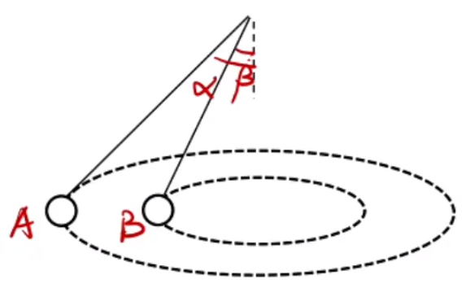
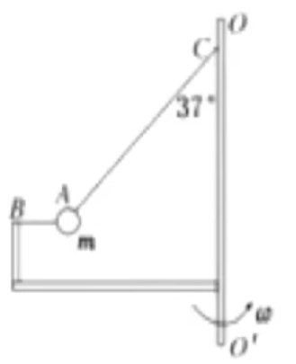

# 【物理】曲线运动

## 曲线运动

### 基础概念

物体做曲线运动的条件：有 $a$ 有 $v$，$a,v$ 不共线。由于合外力方向与加速度方向相同，所以这里的 $a$ 也可以替换成合外力 $F_合$。

运动轨迹的特点：$a(F_合)$ 指向凹侧，例如下图中曲线的凹侧为阴影部分，图中点合外力的方向大致指向阴影部分。

曲线运动的加速/减速：$a,v$ 夹角为锐角，则是加速运动；$a,v$ 夹角为钝角，则是减速运动；如果夹角为直角，则是匀速圆周运动。

方向：曲线运动一般研究两个方向，某个点的**切线**方向和**垂线**方向。

### 合运动与分运动

1. 水平方向匀速直线 $+$ 竖直方向匀速直线：由于无 $a$，所以一直做直线运动。
2. 水平方向匀速直线 $+$ 竖直方向匀变速直线：将两运动合成，可知速度方向既不水平也不竖直，加速度方向竖直，所以有 $a$ 有 $v$ 且 $a,v$ 不共线，所以一定做曲线运动。
3. 水平方向匀变速直线 $+$ 竖直方向匀变速直线：将两运动合成，有两种情况：①当合成后 $a,v$ 共线，即当 $\dfrac{v_y}{v_x} = \dfrac{a_y}{ax}$ 时，则做直线运动；②当合成后 $a,v$ 不共线，则做曲线运动。

> 注意：
>
> - 肉眼看不到分运动，只能看到合运动。
> - 水平和竖直方向上的分运动的**时间**一定相等，且两个分运动互不影响。

### 小船过河

问法：①求最短渡河时间；②求最短渡河位移。

水平速度的作用：让船横着动。

竖直速度的作用：让船渡河。

物理量：$v_船,v_水,v$ 分别表示船速，水速（始终保持水平），和实际运动的速度（即船与水的合速度），$v_x,v_y$ 分别表示水平合竖直方向的速度，$d$ 表示河宽，$x_平$ 表示水平方向的位移，$x$ 表示船的实际位移，$t_d$ 表示船运动到对岸（即渡河）所用的时间。

那么有
$$
\begin{cases}
x_平 = v_x t_d\\
t_d = \dfrac{d}{v_y}
\end{cases}
$$

#### $v_船 > v_水$

最短渡河时间：

由于 $d$ 不变，要使 $t_d$ 最短，则 $v_y$ 最大。$v_船$ 不变时，令 $v_船$ 与竖直方向夹角为 $\theta$，则 $v_y = v_船\cos \theta$。要使得 $v_y$ 最大，则 $v_y = v_船$，即 $v_船$ 的方向竖直，此时 $t_d = \dfrac{d}{v_船}$，如图所示：

最短渡河位移：

要使得 $x$ 最短，则 $x$ 始终竖直（垂直于河岸），那么 $v$ 始终竖直，即 $v_y = v$。令 $v_船$ 与水平方向夹角为 $\theta$，则 $v_y = v = v_船 \sin \theta$，如图所示：

此时，$v_船$ 是图中三角形斜边，所以**必须满足 $v_船 > v_水$**。

#### $v_水 > v_船$

最短渡河时间：由于**水平方向与竖直方向的运动互不影响**，渡河是竖直方向的运动，所以此时的情况同 $v_船 > v_水$ 中最短渡河时间的情况。

最短位移渡河：

如图所示，$v_水$ 的大小和方向均已知，如图中红色箭头。$v_船$ 大小已知，方向未知，所以它在图中的半圆上运动。则当方向 $v_船 \perp v$ 时，$x$ 最短。令 $v$ 与水平面的夹角为 $\theta$，则此时 $x = vt_d = v\cdot \dfrac{d}{v_y} = v\cdot \dfrac{d}{v\sin \theta} = \dfrac{d}{\sin \theta}$。

#### 关联速度

现象：①沿绳、沿杆方向速度大小相等；②垂直于接触面方向速度大小相等。

求解方法：

1. 判断合运动方向。
2. 分解合运动到沿绳、沿杆或垂直于接触面方向，即沿绳、沿杆或垂直于接触面建系。
3. 根据现象速度相等列等式求解问题。

> 注意：**沿杆模型**和**有杆的接触面模型**有时候易混，区别是沿杆模型中杆的**两端都是可以动的**，而**有杆的接触面**中，杆**有一端被固定，不能移动**。

## 平抛运动

### 本质（定义）

一个物体水平方向上有 $v_0$ 的初速度，且只受重力作用。

水平方向以 $v_0$ 的速度做匀速直线运动，水平位移 $v_平 = v_0 t$。

竖直方向是自由落体运动，运动时间 $t$ **只与高度有关**。

### 基础平抛计算

思路：将合运动分为水平和竖直方向上的两个分运动去解。

水平方向：$x = v_0 t$。

竖直方向：$h = \dfrac 1 2 \mathrm gt^2,v_t = \mathrm gt$。

对于图中经过多个点的平抛运动，考虑将**从起点开始**到中间每个点的水平方向和竖直方向上的等式都列出然后再代值求解。

### 带角度平抛计算

#### 求解思路

题目给的有角度的两类物理量：①位移；②速度。

思路：

1. 首先判断题目给定的角度是**位移**的角度还是**速度**的角度：如果能明确画出末速度方向，则给定的是速度角度。一般情况下会以两种方式告知：会告诉物体如何落地（比如垂直落在斜面上）或**恰好**落在某地（比如恰好相切）之类的词语。否则给定的是位移角度。
2. 列出对应的水平方向和竖直方向的等式：
   - 给定位移角度：通过水平方向上的 $x = v_0t$ 和竖直方向上的 $h = \dfrac 1 2 \mathrm gt^2$ 求出位移。
   - 给定速度角度：则通过水平方向上 $v_x = v_0$ 和竖直方向上 $v_y = \mathrm g t$ 求出速度。
3. 通过角度把 $xy$ 两个方向联系起来。
   - 位移角度：画出水平位移和竖直位移，找出位移角度。
   - 速度角度：画出水平速度和竖直速度，找速度角度。

#### 例题

例 1：如图，从倾角为 $\theta$ 的斜面顶端以初速 $v_0$ 水平抛出一个小球，小球落在斜面上，求：小球在空中飞行的时间。

---

分析：

发现题目中没有给定明确的速度角度信息，所以考虑分析位移角度。

那么有：
$$
\begin{cases}
x = v_0t\\
h = \dfrac 1 2 \mathrm g t^2
\end{cases}
$$
画图图象可知：

竖直位移比水平位移为 $\tan \theta$，即：
$$
\tan \theta = \dfrac h x = \dfrac{\dfrac 1 2 \mathrm gt^2}{v_0t} \implies t = \dfrac{2v_0\tan \theta}{\mathrm g}
$$

---

例 2：如图，水平速度抛出的物体，飞行 $\sqrt 3$ 秒时间后垂直撞在倾角为 $\theta = 30^\circ$ 的斜面上，空气阻力不计。（$\mathrm g$ 取 $\pu{10 m/s^2}$，本题运算结构可以保留根式），求：平抛的初速度 $v_0$。

---

分析：

由于题面给定物体垂直落在斜面上，说明给定了速度角度。

那么有：
$$
\begin{cases}
v_x = v_0\\
v_y = \mathrm gt
\end{cases}
$$
画图可知：

水平速度比竖直速度为 $\tan \theta$，即：
$$
\tan \theta = \dfrac{v_0}{\mathrm g t} \implies v_0 = \pu{10m/s}
$$

### 位移角度与速度角度的关系

推导：

如图所示，那么有：
$$
\tan \alpha = \dfrac h x = \dfrac{\dfrac 1 2 \mathrm g t^2}{v_0 t} = \dfrac{\mathrm gt}{2v_0}\\
\tan \theta = \dfrac{v_y}{v_0} = \dfrac{\mathrm g t}{v_0}
$$
所以 $\tan \theta = 2 \tan \alpha$，即**将末速度反向延长，过水平位移中点**，如图所示：

此结论可证明一小球从同一斜面的某个固定的点出发，以不同初速度，到达斜面的速度方向相同。

原因：位移角度不发生变化，所以位移角度不会发生变化。

### 斜面最远距离

问题模型：求小球从斜面顶端以水平初速度 $v_0$ 抛出最后落到斜面上的过程中，何时距离斜面的距离最大，及距离最大为多少。

思路：

首先以斜面方向和与斜面垂直的方向建系，然后将所有的物理量分解到这两个方向上。那么原来水平的初速度会有两个分速度 $v_x$ 和 $v_y$，原来竖直加速度也会有两个分速度 $a_x$ 和 $a_y$。在 $y$ 方向上，速度与加速度方向相反，沿着 $y$ 轴正方向做减速运动，所以当速度减小为 $0$ 时，即为该方向上位移最大的时刻，也就是小球与斜面间距离最大的时刻，如图所示。

计算：

以斜面与水平面夹角是 $30^\circ$ 为例，小球运动到速度减小为 $0$（与斜面距离最大）的时间 $t$ 为：
$$
t = \dfrac{\Delta v}{a} = \dfrac{0 - v_y}{- a_y} = \dfrac{v_0\sin 30^\circ}{\mathrm g \cos 30^\circ}
$$
小球与斜面间距离最大的高度 $h$ 为：
$$
- 2a_y h = 0 - {v_y}^2 \implies h = \dfrac{{v_y}^2}{2a_y}
$$

> 总结：建系方向与题目所研究的方向一致时，有时计算会更加简便。

### 斜抛运动

定义：沿着斜向上以一定初速度抛出一个物体的运动。

本质：初速度倾斜，只受重力。

运动：

- 水平方向：匀速直线运动。
- 竖直方向：竖直上抛运动。
- 从最高点到最低点的过程是平抛运动。

思路：

设初速度为 $v_0$，考虑将其分解到水平和竖直两个方向，则水平方向 $v_x = v_0 \cos \theta$，竖直方向上 $v_y = v_0 \sin \theta$。

所以水平方向的位移 $x = v_0 \sin \theta \cdot t$，竖直方向的的末速度 $v_t = v_0 \sin \theta - \mathrm g t$，位移 $y = v_0 \sin \theta \cdot t - \dfrac 1 2 \mathrm g t^2$（对于斜上抛且最后落地的运动而言，最终 $y = 0$）

最高点：

- 速度方向是水平方向。
- 速度大小等于此时水平的速度大小 $v = v_0 \cos \theta$。

> 对于斜抛运动而言，任何情况下，只要物体运动到最高点/最低点，$v_y$ 一定等于 $0$。

对称性：

运动轨迹关于最高点成轴对称，所以对称点的速度**大小相同，方向相反**，对称的路程所用的**时间相同**。

特征：

1. 斜抛运动的轨迹**与质量无关**。
2. 斜抛运动的射程与抛射的**初速度**和**角度**有关。

最远射程：

若角度固定，则 $v_0$ 越大，射程越大。

当 $v_0$ 固定，角度不同时，有：
$$
y = v_0 \sin \theta \cdot t - \dfrac 1 2 \mathrm g t^2 = 0 \implies t = \dfrac{2v_0 \sin \theta}{\mathrm g}
$$
又因为
$$
x = v_0 \cos \theta \cdot t = v_0 \cos \theta \cdot \dfrac{2v_0 \sin \theta}{\mathrm g} = \dfrac{2{v_0}^2 \sin \theta \cdot \cos \theta}{\mathrm g} = \dfrac{{v_0}^2 \sin 2\theta}{\mathrm g}
$$
所以当 $\sin 2\theta$ 最大时，$x$ 最大，由于 $y = \sin 2\theta$ 在 $\theta \in [0,90^\circ]$ 时，最大值为 $\sin 2\theta = 1$，即 $\theta = 45^\circ$，所以最远射程在 $\theta = 45^\circ$ 时取到，此时最大射程为 $x = \dfrac{{v_0}^2}{\mathrm g}$。

## 圆周运动

### 圆周运动的物理量

【线速度】

定义：弧长/时间。符号：$v_线$ 或 $v$。单位：$\pu{m/s}$。性质：矢量。公式：$v_线 = \dfrac{\overset \frown{AB}}{t}$

【角速度】

定义：角度/时间。符号：$\omega$。单位：$\pu{rad/s}$。性质：矢量。公式：$\omega = \dfrac{\theta}{t}$。

【周期】

定义：完成一次所用的时间。符号：$T$。单位：$\pu{s}$。性质：标量。

【频率】

定义：$\pu{1s}$ 完成的次数。与周期互为倒数。符号：$f$。单位：$\pu{Hz}$。性质：标量。

【转速】

定义：$\pu{1s}$ 完成的圈数。在圆周运动中与频率相同。符号：$n$。单位：$\pu{r/s}$。性质：标量。

### 匀速圆周运动

#### 概念

速度大小不变（方向改变）的圆周运动。

> 匀速圆周运动线速度和角速度大小均不变，同时角速度方向也不变。

#### 基础公式

以匀速圆周运动一圈为研究对象。
$$
\begin{cases}
v_线 = \dfrac{\overset\frown{AB}}{t} = \dfrac{2\pi R}{T}\\
\omega = \dfrac{\theta}{t} = \dfrac{2 \pi}{T}
\end{cases}
\implies 
v_线 = \omega R
$$

#### 次要公式

$$
T = \dfrac{2\pi}{\omega}\\
f = \dfrac 1 T\\
n = f
$$

周期 $T$，频率 $f$ 和转速 $n$，实际上都是变相表示时间的物理量，一般情况下将有关频率和转速的问题转化为周期的问题更容易求解。

### 传动装置

#### 同轴转动

**特征**

一个物体上所有的点，角速度 $\omega$ 相同。

**模型一**

如图，点 $A$ 和点 $B$ 经过的弧长不同（且 $B$ 经过的弧长更长），但角度相同，所以 $\omega_A = \omega_B,v_B > v_A$。

逻辑上，可以通过 $\omega_A = \omega_B$，且 $v = \omega R$，$R_A < R_B$，推出 $v_A < v_B$。

**模型二**

如图，则分析可知 $\omega_A = \omega_B$，再根据 $v = \omega R$，$R_A < R_B$，推出 $v_A < v_B$。

**模型三**

同理，$\omega_A = \omega_B$，由于 $A,B$ 沿轴转动的半径无法比较，所以二者的线速度无法比较。

> 注意：$B$ 所绕圆周的半径为图中的蓝线部分，而非球心到点 $B$ 的距离。

#### 共线转动

**特征**

多个物体之间，其**最外围**的线速度 $v$ 相同。

**模型一**

如图，则 $v_A = v_B$，根据 $v = \omega R$，$R_A < R_B$，所以 $\omega_A > \omega_B$。

**模型二**

同理，$v_A = v_B$，$R_A < R_B$，$\omega_A > \omega_B$。

> 对于齿轮问题，齿轮数之比 $=$ 周长之比 $=$ 半径之比。

### 圆周运动中的牛二

#### 推导过程

圆周运动 $\to$ $v$ 改变 $\to$ 存在 $a$ $\to$ 存在合外力。

#### 圆周运动研究的两个方向

圆心方向和切线方向。所以一般以这两个方向为 $x,y$ 轴建系，将其它物理量分解到这两个方向上。

那么如图所示：

假设速度 $v$ 方向沿切线向上，合外力 $F_合$ 方向如图所示。则将 $F_合$ 分别沿着 $x,y$ 轴方向分解得到 $F_x$ 和 $F_y$。

那么在 $x$ 轴方向上，物体做加速度不变的匀减速直线运动。所以**切线方向 $F_x$ 的合外力只改变速度的大小，不改变速度的方向**。

在 $y$ 轴方向上（即圆心方向上），合外力 $F_y$ **只改变速度的方向**。

#### 向心力与向心加速度

依照上图，将物体所受合外力 $F_合$ 在竖直方向上（即圆心方向）的分力 $F_y$ 取名为向心力。向心力**本身并不存在**，所以物体**不会受到向心力**。

将物体加速度 $a$ 在竖直方向上（即圆心方向）的分加速度 $a_y$ 取名为向心加速度。

在**匀速圆周运动**中，$a_x = 0$，$F_x = 0$。所以合外力 $F_合 = $ 向心力 $F_y$，加速度 $a =$ 向心加速度 $a_y$。

#### 公式

$$
a_向 = \dfrac{v^2}{r} = \dfrac{(\omega r)^2}{r} = \omega^2 r = \left(\dfrac{2\pi}{T}\right)^2 r\\
F_向 = ma_向 = m\cdot \dfrac{v^2}{r} = m\omega^2 r
$$

> 上述两个公式适用于任何圆周运动。

### 物体中各点线速度角速度的大小比较

方法：列表法。

求解步骤：

1. 填列：有几个物体就写几列。
2. 填行：根据对应物体的物理量填行。第一行填半径 $r$；第二行填角速度 $\omega$；第三行填线速度 $v$；第四行填加速度 $a$。
3. 找相同角速度：找题中相同 $\omega$ 的点，设其 $\omega = 1$。
4. 找相同线速度：找题中相同 $v$ 的点，根据列表和 $v = \omega R$ 求得前三步中未求出的 $\omega$。
5. 求加速度：根据 $a = \dfrac{v^2}{r}$ 求出加速度之比。

> 若题目求周期 $T$ 之比，则有 $T_1:T_2:T_3 = \dfrac{1}{\omega_1}:\dfrac{1}{\omega_2}:\dfrac{1}{\omega_{3}}$。

## 匀速圆周运动中的模型

### 解题思路

特征：匀速圆周运动绝大多数出现在**水平面**上的运动，非匀速圆周运动大多出现在竖直面上的运动。

关键：通过受力分析将运动学与力学联系起来。

建系：以切线方向和圆心方向分别作为 $x,y$ 轴建系。

列式：利用正交分解列式，其中 $x$ 轴（切线方向）受力一定平衡，$y$ 轴（圆心方向）受力一定不平衡。
$$
\begin{cases}
x:F_左 = F_右\\
y:F_合 = F_大 - F_小
\end{cases}
$$
求解：求出 $r$，然后根据 $F_合 = F_向 = m\dfrac{v^2}{r} = m\omega^2r$ 将力学与运动学联系起来求解。

### 【模型一】圆锥摆基础模型

如图，有一长度为 $L$ 的绳子，拉着小球在虚线所在平面做匀速圆周运动，设倾角为 $\theta$，求角速度 $\omega$。

求解：

以圆心方向为 $x$ 轴方向建系：
$$
\begin{cases}
F_合 = T\sin \theta\\
T \cos \theta = m \mathrm g
\end{cases}
$$
再根据 $F_合 = F_向$ 可知 $T \sin \theta = m\omega^2r$，且 $r = L \sin \theta$，将相关值代入得 $m \mathrm g \tan \theta = m\omega^2 L\sin \theta$，化简得 $\omega = \sqrt{\dfrac{\mathrm g \tan \theta}{L\sin \theta}} = \sqrt{\dfrac{\mathrm g}{L \cos \theta}}$。

#### **情况一：$v$ 相同**

如图，长为 $L$ 的悬线固定在 $0$ 点，在 $O$ 点正下方有一钉子 $C$，把悬线另一端的小球拉到跟悬点在同一水平面上无初速度地释放，小球运动到悬点正下方时悬线碰到钉子，则小球的加速度 $a$ 和角速度 $\omega$ 会如何变化？

分析：

首先，当小球碰到钉子时，小球的**线速度 $v$ 不变**。原因：一般情况下题目会告知「系统的能量损失忽略不计」，那么此时动能没有损失，所以线速度不变。

同时当小球碰到钉子时，小球圆周运动的半径变小，根据 $v$ 不变，且 $a = \dfrac{v^2}{r}$，所以 $a$ 增大；又因为 $v = r \omega$，所以当 $v$ 不变，$r$ 减小时，$\omega$ 增大。

#### 情况二：同角不同面（$a$ 相同）

如图所示，在一个漏斗内壁里，有两个小球，分别在不同高度的水平面上做匀速圆周运动，这两个小球的质量分别为 $m_A$ 和 $m_B$（上方为 $A$），且 $m_A > m_B$，漏斗内壁与竖直直线的夹角为 $\theta$。要求比较 $A,B$ 两个小球角速度 $\omega$，加速度 $a$，线速度 $v$，所受到支持力 $F_N$ 和向心力 $F_向$ 的大小关系。

分析：

对小球受力分析可得：
$$
\begin{cases}
F_合 = F_N\cdot \cos \theta\\
F_N \cdot \sin \theta = m\mathrm g
\end{cases}
\implies a = \mathrm g \cot \theta
$$
由于小球 $A$ 和 $B$ 对应的 $\theta$ 相同，所以他们的 $a$ 相同。

那么由于 $a$ 相同，根据 $a = \omega^2 r$，$r_A > r_B$，所以 $\omega_A < \omega_B$。又由于 $a = \dfrac{v^2}{r}$，$r_A > r_B$，所以 $v_A > v_B$。

根据受力分析可知 $F_N = \dfrac{m \mathrm g}{\sin \theta}$，因为 $m_A > m_B$，所以 $F_{NA} > F_{NB}$。

由于 $F_向 = ma$，$m_A > m_B$，所以 $F_{向 ~A} > F_{向 ~B}$。

---

对于任意同角不同面的匀速圆周运动模型，都有 $a$ 相同的结论，例如下图，两根绳子分别连接末端与小球 $A$，小球 $A$ 与小球 $B$，则二者加速度相同。

#### **情况三：同面不同角（$\omega$ 相同）**

如图所示，两小球 $A,B$ 在同一平面上做匀速圆周运动，其中 $A$ 所连的绳子与竖直直线的夹角为 $\alpha$，$B$ 所连绳子与竖直直线的夹角为 $\beta$。要求比较 $A,B$ 两个小球角速度 $\omega$，加速度 $a$，线速度 $v$ 和所受到绳子拉力 $T$ 大小关系。

根据之前推得得结论可知 $\omega = \sqrt{\dfrac{\mathrm g}{L\cos \theta}}$，其中 $L$ 表示绳长，$\theta$ 是绳子与竖直直线的夹角。

根据图示可知，$L\cos \theta = h$，即绳子末端距离水平面的高度，那么 $\omega = \sqrt{\dfrac{\mathrm g}{h}}$，由于 $h_A = h_B$，所以 $\omega_A = \omega_B$。

根据 $a = \omega^2 r$ 且 $r_A > r_B$ 可知，$a_A > a_B$；根据 $v = r\omega $ 且 $r_A > r_B$ 可知，$v_A > v_B$；根据受力分析可知 $T_A >T_B$。

### 【模型二】圆锥摆临界模型

临界问题最重要的是首先要排除是否有接触面给物体的支持力 $F_N$。一般情况下，对临界时的系统进行受力分析求出临界时的角速度 $\omega$，从而根据题意判断题目条件下小球是否脱离接触面，据此解决问题。

#### 类型一

如图所示，一个绳子拉着一个小球在圆锥的外表面上做匀速圆周运动。求当角速度 $\omega$ 为多少时，小球恰好脱离圆锥摆接触面。

分析：当小球刚好要与接触面分离时，受到的接触面对小球的支持力 $F_N = 0$。

设圆锥摆壁与竖直直线的夹角为 $\theta$，那么此时对小球受力分析有：
$$
\begin{cases}
m \mathrm g = T \cos \theta\\
F_合 = T \sin \theta
\end{cases}
$$
又因为 $F_合 = F_向$ 则有 $T \sin \theta = m \omega^2 r$，所以 $\omega = \sqrt{\dfrac{T \sin \theta}{mr}} = \sqrt{\dfrac{\mathrm g \tan \theta}{r}}$。

#### 类型二

如图所示，一个绳子拉着一个小球在水平面上做匀速圆周运动，求当角速度 $\omega$ 为多少时，小球恰好脱离水平面。

分析：当小球恰好要脱离水平面时，受到的水平面对小球的支持力为 $F_N = 0$。设绳子与竖直直线的夹角为 $\theta$，同类型一的受力分析可知 $\omega = \sqrt{\dfrac{\mathrm g \tan \theta}{r}}$。

#### 易错点

1. 当求出临界情况下的 $\omega$ 后，需要将题目已知的 $\omega'$ 与 $\omega$ 做对比，判断是否存在 $F_N$，然后**必须重新受力分析**。
2. 以上述类型二为例，当题目中的 $w' > w$ 时，小球离开接触面，且此时绳子与竖直直线的夹角**不再是 $\theta$**，而是新的角度。
3. 题目中出现「恰好绳子拉直」之类的字眼，一般视为此时绳子对物体的力为 $0$。

#### 例题

例 1：如图所示，在光滑的圆锥顶用长为 $L$ 的细线悬挂一质量为 $m$ 的小球，圆锥顶角为 $2\theta$，若要小球的角速度为 $\omega = \sqrt{\dfrac{\mathrm g}{2 L \cos\theta}}$，求绳子拉力 $T$ 合圆锥摆对小球的支持力 $F_N$。

分析：

首先求出对临界状态时的小球受力分析，求出小球脱离接触面临界状态时的 $\omega = \sqrt{\dfrac{\mathrm g}{L \cos \theta}}$。

由于 $\sqrt{\dfrac{\mathrm g}{2 L \cos \theta}} < \sqrt{\dfrac{\mathrm g}{L \cos \theta}}$，所以小球会受到圆锥摆对其支持力。

对小球受力分析得：
$$
\begin{cases}
F_合 = T \sin \theta - F_N \cos \theta \\
T \cos \theta + F_N \sin \theta = m \mathrm g
\end{cases}
$$
又因为 $F_合 = F_向 = m \omega^2 r = m \cdot \dfrac{\mathrm g}{2 L \cos \theta}\cdot L \sin \theta = \dfrac 1 2 m \mathrm g \tan \theta$ 代入上述式中得：
$$
\begin{cases}
T \sin \theta - F_N \cos \theta = \dfrac 1 2 m \mathrm g \tan \theta & (1) \\
T \cos \theta + F_N \sin \theta = m\mathrm g & (2)
\end{cases}
$$
将 $(1) \times \sin \theta + (2) \times \cos \theta$ 得：
$$
T = \dfrac 1 2 m \mathrm g \tan \theta \sin \theta + m \mathrm g \cos \theta
$$
同理可得到 $F_N$，这里不做赘述。

---

例 2：如图所示，小球 $A$ 可视为质点，装置静止时轻质细线 $AB$ 水平，轻质细线 $AC$ 与竖直方向的夹角 $\theta = 37^\circ$，已知小球的质量为 $m$，细线 $AC$ 长为 $L$，$B$ 点距 $C$ 点的水平和竖直距离相等，装置 $BOO'$ 能以任意角度绕竖直轴 $OO'$ 转动，且小球始终在 $BOO'$ 平面内，那么在角速度从零缓慢增大的过程中（）

A. 两细线张力均增大

B. 细线 $AB$ 中张力一直变小，直到为零

C. 细线 $AC$ 中张力先不变，后变大

D. 当 $AB$ 中张力为零时，角速度可能为 $\sqrt{\dfrac{5\mathrm g}{4L}}$

---

分析：

首先考虑对角速度为 $0$ 时的小球 $A$ 受力分析得：
$$
\begin{cases}
T_C \sin 37^\circ = T_B\\
T_C \cos 37^\circ = m \mathrm g
\end{cases}
$$
当 $\omega$ 逐渐增大时，有：
$$
\begin{cases}
F_合 = T_C\sin 37^\circ - T_B\\
T_C \cos 37^\circ = m \mathrm g
\end{cases}
$$
再根据 $F_合 = F_向 = m \omega^2 r$ 得 $m \omega^2 r = T_C \sin 37^\circ - T_B$，由于小球在竖直方向上保持平衡，所以 $T_C$ 保持不变，又由于 $\omega$ 增大，所以 $T_B$ 减小。

当 $T_B$ 减小到 $0$ 时，由于 $\omega$ 增大，所以 $T_C$ 只能增大，此时竖直方向受力不平衡，绳子飘起，小球会向上运动。

当小球向上运动时，根据几何关系可知，绳子 $AB$ 处于松弛状态。当向上运动到一定高度时，绳子 $AB$ 会再次拉紧，根据几何关系可知，此时 $AB$ 恰好竖直。

再对此时的小球受力分析得：
$$
\begin{cases}
F_合 = T_C \sin 53^\circ \\
T_C \cos 53^\circ = T_B + m \mathrm g
\end{cases}
$$
由于 $F_合 = m \omega^2 r$ 增大，所以 $T_C$ 增大，$T_B$ 增大。

所以整个过程中 $T_C$ 先不变，后增大；$T_B$ 先减小为 $0$，后不变（保持为 $0$），再增大。

观察选项可知 AB 错误，C 正确。

对于 D 选项，可知小球从初始状态（即将向上运动）到 AB 垂直（刚刚运动到垂直状态）的这段过程中，$AB$ 张力为 $0$，由于这个过程中 $\omega$ 始终在增大，所以考虑对张力为 $0$ 时的两个临界状态受力分析可得：
$$
\begin{cases}
\omega_{\min} = \sqrt{\dfrac{\mathrm g}{L \cos 37^\circ}} = \sqrt{\dfrac{5 \mathrm g}{4L}}\\
\omega_{\max} = \sqrt{\dfrac{\mathrm g}{L \cos 53^\circ}} = \sqrt{\dfrac{5 \mathrm g}{3L}} 
\end{cases}
\implies \sqrt{\dfrac{5 \mathrm g}{4L}} \le \omega \le \sqrt{\dfrac{5 \mathrm g}{3L}}
$$
所以 D 正确。

> 总结：对于此类较复杂的圆锥摆问题，可以考虑将每个阶段的情况均受力分析，分段求解。

### 【模型三】圆盘模型

#### 向心运动与离心运动

当物体在如下图所示的圆盘上做匀速圆周运动时，有 $f = F_向 = m \omega^2 r$，且此时 $f$ 为静摩擦力，当 $\omega$ 增大时，$f$ 也增大，又由于 $f_静 \le f_滑 = \mu F_N = \mu m \mathrm g$，所以当 $f_静 = f_滑$ 时，物体会与圆盘发生相对运动，由于此时 $f_滑$ 的方向指向圆心，根据滑动摩擦力方向与相对运动方向相反可知，物体做**离心运动**，此时 $F_向 > F_合 = f_滑$（$f_滑$ 是定值，但 $\omega$ 可以无限增大，所以 $F_合$ 可以无限增大）。

同理，当 $F_合 > F_向$ 时，物体做**向心运动**。

#### 多物体模型之发生相对滑动的先后

如图所示，圆盘上有两个物体 $A,B$，$m_A = m_B$，$\mu_A = \mu_B$，两物体在圆盘上做匀速圆周运动，问当 $\omega$ 不断增大时，两物体谁先开始发生相对滑动？

对二者分别受力分析可得：
$$
f_A = m \omega^2 r_A\\
f_B = m \omega^2 r_B
$$
由于 $r_A > r_B$，所以 $f_A > f_B$，又由于 $m_A = m_B,\mu_A = \mu_B$，所以二者最大静摩擦力 $f_{\max}$ 相同，那么由于匀速圆周运动时二者静摩擦力 $f_A > f_B$，所以 $A$ 会比 $B$ 先打到 $f_{\max}$，即 $A$ 先发生相对滑动。

---

当 $m_A \ne m_B$ 时，可以考虑将两物体发生相对滑动时需要的角速度 $\omega_A$ 和 $\omega_B$ 求出来，然后比较大小，那么角速度更小的物体，会先发生相对滑动。

那么当 $\mu_A = \mu_B$ 时，对 $A,B$ 分别进行受力分析，得到 $\omega_A = \sqrt{\dfrac{\mu \mathrm g}{r_A}},\omega_B = \sqrt{\dfrac{\mu \mathrm g}{r_B}}$。由于 $r_A > r_B$，所以 $\omega_A < \omega_B$，所以 $A$ 先发生相对滑动。

#### 多物体模型之同侧两物体

问题模型：如图，$A$ 和 $B$ 两个物体在圆盘上，两物体在圆盘**同侧**，一根绳子连接 $A$ 和 $B$，初始时无拉力，两个物体的质量相同，均为 $m$，动摩擦因数均为 $\mu$。圆盘角速度从 $0$ 开始增大，两物体在圆盘上做匀速圆周运动，求：

1. 绳子什么时候开始有拉力？
2. $A,B$ 何时发生相对滑动？
3. 若剪断绳子，问 $A,B$ 会做什么类型的运动？

思路：一般从 $\omega = 0$ 开始分析每一段过程，分段思考。

分析：

对 $\omega = 0$ 时的两物体进行受力分析得 $F_N = G$。

当 $\omega$ 从 $0$ 开始增大时，两物体应该先产生摩擦力，再产生绳子拉力。对刚刚开始做圆周运动时的物体进行受力分析，则两物体都有指向圆心的摩擦力 $f_A$ 和 $f_B$，但根据 $f = m \omega^2 r$ 可知两物体 $r$ 不同，所以 $f$ 不同。又由于两物体 $\mu$ 相同，所以两物体最大静摩擦力（滑动摩擦力）相同，因为 $r_A > r_B$，所以 $A$ 物体会首先达到最大静摩擦力。

所以当 $A$ 物体摩擦力达到最大时，$B$ 的摩擦力还没有达到最大，此时会出现绳子拉力。

对此时的 $A$ 受力分析，$F_合 = f_A + T$，此时 $f_A$ 为滑动摩擦力。

对此时的 $B$ 受力分析，$F_合 = f_B - T$，此时 $f_B$ 为静摩擦力。当 $\omega$ 增大时，$F_合$ 增大，$f_A$ 不变，$T$ 增大，所以 $f_B$ 增大。当 $f_B$ 也增大到滑动摩擦力（最大静摩擦力）时，其摩擦力不能继续增大，此时会发生相对滑动。

那么对于第一问，当 $A$ 达到最大静摩擦力 $f_{\max}$ 时，开始有拉力。对 $A$ 物体进行受力分析则 $f_A = \mu m \mathrm g = m \omega^2 r_A$，可得到 $\omega_1 = \sqrt{\dfrac{\mu \mathrm g}{r_A}}$，所以当角速度为 $\omega_1$ 时绳子有拉力。

对于第二问当 $A,B$ 的摩擦力都达到最大静摩擦力时，开始发生相对滑动。对 $A,B$ 受力分析得：
$$
\begin{cases}
T+ \mu m \mathrm g = m \omega^2r_A\\
\mu m \mathrm g - T = \mu \omega^2 r_B
\end{cases}
\implies 2\mu m \mathrm g = m \omega^2(r_A + r_B) \implies \omega = \sqrt{\dfrac{2 \mu \mathrm g}{r_A + r_B}}
$$
对于第三问，可对 $A,B$ 剪断绳子后单独受力分析，求得 $A,B$ 与圆盘不发生相对滑动时的最大角速度 $\omega_A$ 和 $\omega_B$，与 $\omega$ 作比较，若 $\omega$ 更大，则发生相对滑动；若 $\omega$ 更小，则 $A,B$ 不会与圆盘发生相对滑动，则做匀速圆周运动。

#### 多物体模型之异侧两物体

问题模型：如图，$A$ 和 $B$ 两个物体在圆盘上，两物体在圆盘**异侧**，一根绳子连接 $A$ 和 $B$，初始时无拉力，两个物体的质量相同，均为 $m$，动摩擦因数均为 $\mu$。圆盘角速度从 $0$ 开始增大，两物体在圆盘上做匀速圆周运动，求：

1. 绳子什么时候开始有拉力？
2. 什么时候物体不受摩擦力？
3. 什么时候发生相对滑动？

分析：

同样对 $\omega = 0$ 的初始状态的 $A,B$ 进行受力分析可得 $F_N = G$，同理同侧物体可知两物体最大静摩擦力相同，且 $A$ 先达到最大静摩擦力。当 $A$ 达到静摩擦力，$B$ 还没有达到静摩擦力时，产生绳子拉力。

那么当 $A$ 达到滑动摩擦力后，随着 $\omega$ 的增大，对 $A$ 物体受力分析得 $F_合 = F_向 = T + f_A$，受到的滑动摩擦力 $f_A$ 和绳子拉力 $T$ 共同提供向心力。由于此时 $A$ 受到的绳子拉力 $T$ 指向圆心，所以 $B$ 受到的绳子拉力 $T$ 也指向圆心，由于 $B$ **原来的摩擦力没有达到最大静摩擦力，本来就可以提供向心力，当存在绳子拉力 $T$ 时，为了使 $B$ 仍然做匀速直线运动（保持原来的向心力不变），那么 $B$ 的摩擦力一定减小，方向不变**。

那么当 $\omega$ 继续增大时，对应的绳子拉力 $T$ 也会继续增大，假设原来的角速度是 $\omega_1$，新的角速度为 $\omega_2$ 根据 $A$ 的受力分析 $F_向 = T + f_A$ 可得 $T = F_向 - f_A$，那么原来的绳子拉力 $T_1 = m {\omega_1}^2 r_A$，新的绳子拉力 $T_2 = m {\omega_2}^2 r_A$，所以 $\Delta T = m ({\omega_2}^2 - {\omega_1}^2)r_A$。对 $B$ 有 $F_向 = m \omega^2 r_B$，那么原来的向心力 $F_1 = m {\omega_1}^2 r_B$，新的向心力 $F_2 = m {\omega_2}^2 r_B$，所以向心力的变化量 $\Delta F_向 = m ({\omega_2}^2 - {\omega_1}^2) r_B$，由于 $r_A > r_B$，所以 $\Delta T > \Delta F_向$。对 $B$ 受力分析有 $F_合 = F_向 = T + f_B$，由于 $T$ 的变化量比向心力的变化量大，所以要保持 $B$ 做匀速圆周运动，则 $f_B$ 会减小。

那么随着 $\omega$ 越来越大，$f_B$ 越来越小，当 $f_B$ 减小到 $0$ 时，向心力仅由 $T$ 提供，$B$ 物体不受摩擦力。

当 $\omega$ 继续再增大时，$T$ 继续增大，那么为使 $B$ 的 $F_合 = F_向$，则 $f_B$ 与原来反向，且随着 $\omega$ 的继续增大，$f_B$ 反向继续增大。当反向的静摩擦力达到最大时，$B$ 与圆盘发生相对滑动，$f_B$ 变成滑动摩擦力。

那么对于第一问，当 $A$ 达到最大静摩擦力 $f_{\max}$ 时，开始有拉力。对 $A$ 物体进行受力分析则 $f_A = \mu m \mathrm g = m \omega^2 r_A$，可得到 $\omega_1 = \sqrt{\dfrac{\mu \mathrm g}{r_A}}$，所以当角速度为 $\omega_1$ 时绳子有拉力。

那么对于第二问，当 $B$ 物体的 $T = F_向$ 时，物体 $B$ 不受摩擦力。对 $A,B$ 受力分析有
$$
\begin{cases}
m \omega^2 r_A = T + f = T + \mu m \mathrm g\\
T = m \omega^2 r_B
\end{cases}
\implies \mu m \mathrm g = m \omega^2 (r_A - r_B) \implies \omega = \sqrt{\dfrac{\mu \mathrm g}{r_A - r_B}}
$$
对于第三问，当 $A,B$ 均达到最大静摩擦力 $f_{\max}$ 时，发生相对滑动。对 $A,B$ 受力分析有
$$
\begin{cases}
T + f_A = T + \mu m \mathrm g = m \omega^2 r_A\\
T - f_B = T - \mu m \mathrm g = m \omega^2 r_B
\end{cases}
\implies 2 \mu m \mathrm g = m \omega^2 (r_A - r_B) \implies \omega = \sqrt{\dfrac{2 \mu \mathrm g}{r_A - r_B}}
$$

### 【模型四】火车拐弯

问题模型：如图所示，一火车在如图 1 所示的倒立圆台**内壁**沿着红线做圆周运动，其弯道处的内外轨结构图示如图 2。问要使得火车车轮对内外规均无挤压作用，火车速度 $v_0$ 应该是多少。

分析：

对火车车轮受力分析，建立如图所示的坐标系：

那么有：
$$
\begin{cases}
ma_0 = F_N \sin \theta\\
F_N \cos \theta = m \mathrm g
\end{cases}
\implies
\begin{cases}
F_N = \dfrac{m \mathrm g}{\cos \theta}\\
a_0 = \mathrm g \tan \theta
\end{cases}
$$
根据 $a_0 = \dfrac{v^2}{r}$ 可得 $v_0 = \sqrt{\mathrm g r \tan \theta}$。

设火车车轮的速度为 $v$，向心加速度为 $a$。

则当 $v > v_0$ 时，$a > a_0$，所以向心力增大，那么 $F_向 > F_合$，车轮做离心运动，则车轮受到外轨对它的压力；

当 $v < v_0$ 时，$a < a_0$，向心力减小，那么 $F_合 > F_向$，车轮做向心运动；则车轮受到内轨对它的压力。

### 【模型五】绳模型与杆模型

#### 绳模型

问题模型：一小球被**绳**连接沿着如图所示的圆做匀速圆周运动，求小球运动到最高点时的最小速度至少为多少。

分析：对最高点的小球受力分析得 $m \mathrm g + T = m \dfrac{v^2}{r}$，其中 $T$ 表示绳子拉力。则要使得 $v$ 最小，$T$ 应该为 $0$，所以 $v_{\min} = \sqrt{\mathrm gr}$。

结论：要使得小球做圆周运动，则最高点最小速度至少为 $v_{\min} = \sqrt{\mathrm g r}$。

#### 杆模型

问题模型：一小球被**杆**连接沿着如图所示的圆做匀速圆周运动，求小球运动到最高点时的最小速度至少为多少。

分析：对最高点小球受力分析得 $m \mathrm g + F = m \dfrac{v^2}{r}$，其中 $F$ 表示杆对小球的支持力。则当 $v$ 最小时，$v = 0$，即 $F = - m \mathrm g$，即杆对小球的支持力向上且大小等于重力。

> 总结——绳与杆的区别：绳子最高点**无支撑**，杆最高点**有支撑**。

**题型：求杆对小球的力 $F$ 大小及类型**

首先求出当小球运动到最高点，$F=0$ 时的临界速度 $v_0$。那么对小球受力分析可得 $v = \sqrt{\mathrm g r}$。

设小球运动到最高点时的速度为 $v$，则：

- 当 $v > v_0$ 时，小球受到杆对其**向上的支持力（压力）**。
- 当 $v < v_0$ 时，小球受到杆对其**向下的拉力**。

计算步骤：

1. 首先算出临界速度 $v_0 = \sqrt{\mathrm g r}$。
2. 然后将小球速度 $v$ 与 $v_0$ 的大小关系作比较，判断出所受 $F$ 的类型（拉力/压力）。
3. 对小球受力分析，求得 $F$。

#### 环模型

一般而言，有以下两种类型：

左边由于在最高点**有支撑**，所以属于杆模型，那么最高点的最小速度 $v_0 = 0$。

右边由于在最高点**无支撑**，所以属于绳模型，那么最高点的最小速度 $v_0 = \sqrt{\mathrm g r}$。

题型：求解左边模型下，速度为 $v$ 时，小球会受到内环还是外环对它的力。

分析：首先，小球**不可能同时**受到内环和外环对它的力。考虑首先算出小球不受内外环对它的力时的速度 $v_0$，然后再根据杆模型的题型做题方法求解。
