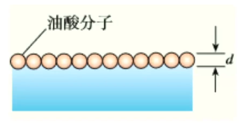
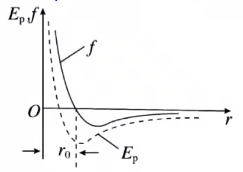
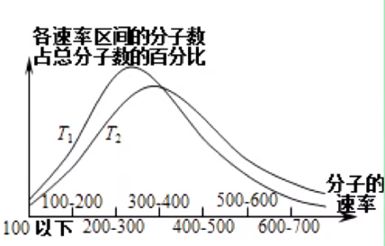
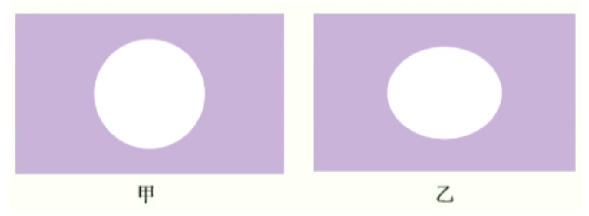
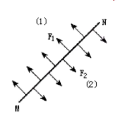
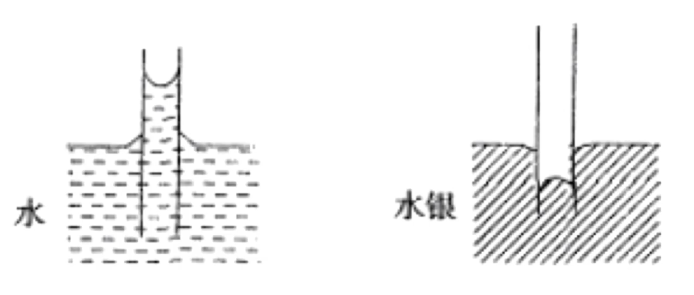
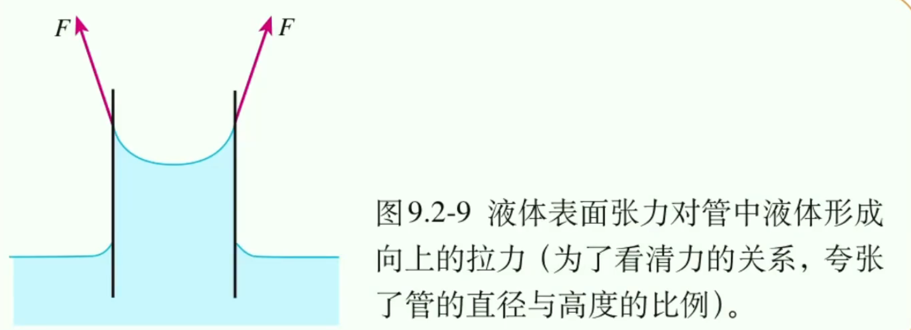
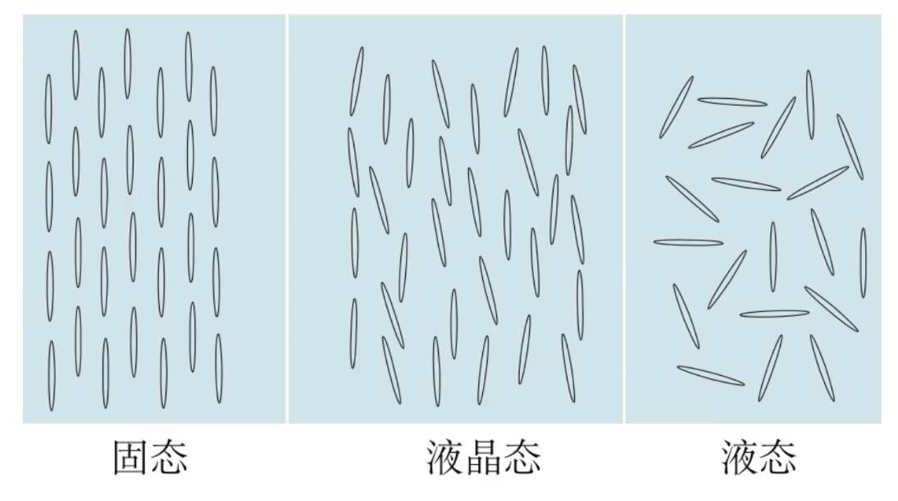

# 【物理】热力学

## 分子动理论

### 物体是由分子构成的

#### 分子的大小

1. 分子直径数量级：$\pu{10^-10 m}$。
2. 分子质量数量级：$\pu{10^-26 kg}$。
3. 测量分子的方法：油膜法。

#### 分子的两种模型

**球体模型**

内容：认为分子是一个个紧挨着的球体。

适用对象：固体、液体。

分子体积的计算：
$$
V = \dfrac{4}{3} \pi R^3 = \dfrac{4}{3}\pi \left(\dfrac{D}{2}\right)^3
$$
**立方体模型**

内容：认为分子是一个个紧挨着的立方体。

适用对象：气体。

分子体积的计算：

已知两个分子之间的距离为 $d$，则：
$$
V = d^3
$$

#### 【实验】油膜法测分子的大小（直径）

**大致思路**

滴一滴油酸摊开在水面上，近似堪称是**单分子层**。根据公式 体积 $=$ 厚度 $\times$ 面积 求得直径。

**构造模型**

认为油酸分子是**球体模型**。

**技术难点**

1. 测量一滴油酸的体积：滴 $100$ 滴，若 $100$ 滴对应的是 $x\ \pu{mL}$，则一滴是 $\dfrac{x}{100}\ \pu{mL}$。
2. 观察油酸：撒痱子粉。具体：先撒粉后滴。
3. 测量面基：数格子。不足半格记为 $0$，超过半格记为 $1$。

**实验步骤**

【稀释】

操作：将 $\pu{1 mL}$ 油酸溶液配置成 $\pu{500 mL}$ 油酸酒精溶液。

目的：形成单分子层。

使用酒精的原因：①有机溶剂；②酒精具有挥发性，可被挥发掉，从而减小由于酒精的存在对实验造成误差。

【测量】

操作：取酒精溶液滴 $100$ 滴测得体积为 $\pu{1 mL}$。所以 $1$ 滴油酸体积是 $\dfrac{1}{100}\times \dfrac{1}{500}\ \pu{mL}$。

【撒粉】撒痱子粉或细石膏粉在水面上。

【滴液】注射器往水面上滴 $1$ 滴油酸酒精溶液。

【描边】稳定后拿出玻璃板盖上进行描边，得到油膜的面基。

【计算】
$$
d = \dfrac{V}{s} \Longrightarrow V_{分子} = \dfrac{4}{3}\pi \left(\dfrac{d}{2}\right)^3
$$
同时可以得到 
$$
d = \sqrt[3]{\dfrac{6M}{\pi \rho N_A}}
$$
**注意事项**

1. 先撒粉后描边；
2. 注意单位之间的换算：尤其是题目中所给的可能是 $\pu{mL}$ 求的是 $\pu{m3}$。

#### 微观量估算

**物理量**

1. 分子层面：单个分子的质量 $m_0$，单个分子的体积 $V_0$。

2. 化学层面：摩尔质量 $M_{摩尔}$，摩尔体积 $V_{摩尔}$。

3. 实际层面：物体质量 $m$，物体体积 $V$。

**物理量之间的关系**

【公式一】
$$
m_0 = \dfrac{M_{摩尔}}{N_A}
$$
$M_{摩尔}$：摩尔质量，表示 $\pu{1 mol}$ 里有多少克分子。

$N_A$：表示 $\pu{1 mol}$ 里有多少个分子。

【公式二】
$$
V_0 = \dfrac{V_{摩尔}}{N_A}
$$
易错点：**不适用于气体分子**。气体用该公式计算得到的是「一个分子所占的空间大小」。

> 有关气体密度的理解
>
> - 气体分子的密度 $\rho_{分子}$：单个气体分子的密度。
> - 气体的密度 $\rho_{气体}$：表示的是气体分子及其所占空间的密度；
>
> 所以 $\rho_{分子} \ll \rho_{气体}$。一般题目中给定某气体的密度指的是 $\rho_{气体}$。 

**解题步骤**

1. 首先判断给定的密度 $\rho$ 是 $\rho_气$ 还是 $\rho_{分子}$。
2. 判断给定的质量 $m$ 是什么层面（化学层面还是分子层面还是实际层面）。
3. 判断给定的 $m$ 除以 $\rho$ 计算得到的是什么层面的 $V$：
   - 给定 $\rho_气$ 和 $M_{摩尔}$，得到摩尔体积 $V_{摩尔}$。
   - 给定 $\rho_气$ 和 $m_0$，得到分子所占空间 $V_{占}$。
   - 给定 $\rho_{分子}$ 和 $m_0$，得到分子的体积 $V_{分子}$。

例：某气体的摩尔质量 $M$，分子质量为 $m$，若 $1$ 摩尔该气体的体积为 $V_m$，密度为 $\rho$。

则
$$
\dfrac{N_A}{V_m} = \dfrac{M}{mV_m} = 该气体单位体积的分子数
$$
且
$$
\dfrac{\rho  N_A}{m} = \dfrac{N_A}{V}\\
\dfrac{\rho N_A}{M} = \dfrac{N_A}{V_m}
$$
其中第一个式子中的 $V$ 表示的是气体分子及所占空间的体积，所得的结果不是「该气体单位体积的分子数」。第二个得到的是「该气体单位体积分子数」。

### 分子热运动

#### 扩散现象

【前提】浓度不同。

【定义】相互接触的不同物质能够彼此进入对方。

【解释】

- 扩散现象并不是因为宏观受力的作用下发生的，且各个状态下都会存在扩散现象。
- 扩散现象**直接**反应了分子的无规则运动。
- 气体和气体之间、液体和液体之间、固体和固体之间都会发生扩散现象。

【影响因素】

- 扩散现象的快慢与物体的状态有关：一般情况下，气体 $>$ 液体 $>$ 固体。
- 扩散现象的快慢与温度有关：一般温度越高，扩散越快。

#### 布朗运动

【定义】悬浮在液体（或气体）中的**微粒**的无规则运动。本质上是宏观层面。

【实验背景】布朗通过显微镜看水中的花粉。

【原因】水分子对布朗微粒撞击的不平衡。

【结论】

- 微粒越小，布朗运动越明显。
- 温度越高，布朗运动越明显。

【易错点】布朗运动**不是**分子运动，**间接**反应了**液体/气体**分子的无规则运动。

【扩散现象与布朗运动对比】

- 不同点：扩散现象是肉眼可见的现象。而布朗运动是光学显微镜观察得到的。
- 相同点：二者都是**微观分子**的热运动所形成**宏观**现象。

### 分子间的作用力与能量

#### 分子间的作用力

【内容】

- 分子虽然有空隙，大量的分子却能聚集起来形成固体或液体说明了分子之间存在**引力**。
- 用力压缩物体，物体内会产生反抗压缩的弹力，说明了分子之间存在**斥力**。

> 注意：给汽车轮胎打气越来越吃力**并不是**体现了「分子间斥力」，而是体现了「气体压强」。

【总结】分子之间引力和斥力同时存在。

【影响因素】

- 引力和斥力都随着分子间距离的增大而减小。
- 斥力的变化比引力要大。

【结论】

- 当分子距离比较近的时候体现斥力。
- 当分子距离比较远的时候体现引力。
- 当分子的距离 $r > 10r_0$ 时，斥力、引力忽略不计。其中 $r_0$ 的数量级时 $\pu{10^-10 m}$。

【分子力图像的理解】

其中，上方的虚线表示排斥力，下方的虚线表示吸引力，实线表示分子间作用力。

- 当 $r = r_0$ 时，$F_引 = F_斥$，$F_合 = 0$。
- 当 $r > r_0$ 时，$F_引 > F_斥$，$F_合$ 表现为引力。
- 当 $r < r_0$ 时，$F_引 < F_斥$，$F_合$ 表现为斥力。
- 当 $r > 10r_0$ 时，$F_引 \approx F_斥 \approx 0$，$F_合 \approx 0$。
- $F_合$ 变化：先减小再增大再减小。

> 注意：该图不能表示气体分子力与分子间距变化的规律。因为气体中分子间的作用力一般很小，可以忽略。

### 分子之间的能量

#### 引入

两分子从靠近到逐渐相互远离的过程中：

- 起初，分子力体现排斥力，位移方向与力的方向相同，做正功，消耗能量，分子势能减小。
- 当分子间距离达到一定距离后，分子力体现吸引力，位移方向与力的方向相反，做负功，增加能量，分子势能增加。

所以整个过程中先做正功再做负功，分子势能先减小后增加。  

#### 分子势能 

【核心观点】做正功势能减少，做负功势能增大。

【默认规定】取无穷远的地方势能为 $0$。  

【结论】从无穷远逐渐靠近的过程中，分子力先是引力，然后是斥力，分子力先做正功，后做负功，分子势能先减小后增大。

【图像】

其中，$f$ 表示分子力，$E_p$ 表示分子势能。

所以当 $r = r_0$ 时，$f$ 最小（为 $0$），分子势能最小（不为 $0$）。

【分子势能的体现】

- 在微观上：分子势能与位置有关。
- 在宏观上：分子势能与体积有关。

 #### 分子动能

【定义】分子动能时分子**热运动**所具有的能量。

> 注意：不是「机械运动」。

【分子平均动能】所有分子动能的平均值。研究单个分子的动能没有意义，所以研究的动能时分子的平均动能。

【影响因素（平均动能）】**温度**。

 【易错点】

- 不同物质，只要温度相同，平均动能**一定相同**。
- 在研究分子动能时，物体的实际速度无关。
- 对于单个分子来说，温度越高，动能**不一定**越大。

【图像】

规律：

- 中间高，两边低。
- 温度高低看最高点的横坐标 $x$（**分子的速率**）。
- 无论温度如何，图像围成的面基为 $1$。

### 温度和温标

#### 气体的状态参量

几何性质：体积 $V$。

力学性质：压强。

热学性质：温度。

> 三个物理量中有一个发生改变，则说明气体的状态发生改变。
>
> 三者之间存在以下关系：
> $$
> \dfrac{PV}{T} = C
> $$
> 其中，$C$ 是常数，与质量 $m$ 和气体的种类有关。

#### 温度

【意义】宏观上表示物体的冷热程度，微观上表示的是分子热运动的剧烈程度。

【绝对零度】是低温的极限，只能接近不能达到，所以热力学温度没有负数。

【温标】生活中的温度为**摄氏温度 $t$**，但在热力学计算的时候选用**热力学温度 $T$，单位 $K$**。它是国际单位制中的基本单位。

【温度转换】
$$
T = t + 273.15
$$

> 注：
>
> - 一般忽略小数点后的数字。
> - 达到热平衡的两个物体，温度相同。

### 内能

#### 概念

物体所有分子的热运动动能与分子势能的总和。

> 其中分子动能取决于「平均动能」和「分子个数」，「平均动能」与温度有关，「分子个数」与质量（物质的量）有关，势能与体积有关。

#### 内能决定因素

- 微观上：分子个数，分子势能，平均动能。
- 宏观上：质量，体积，温度。

#### 分子势能

由分子的位置决定，在微观上与分子间距相关，在宏观上与体积相关。

#### 分子平均动能

决定分子平均动能的唯一因素是温度。

#### 理想气体

【概念】有质量，无体积，分子之间没有作用力的气体。

【无体积的意义】理想气体可以无限压缩。（气体分子有质量无体积）

【分子间没有作用力的意义】（一定质量的）理想气体内能只有动能（没有势能），即理想气体的内能大小只和温度有关。

## 物态与物态变化

### 固体

#### 分类

根据有无熔点分为**晶体**和**非晶体**。

晶体中，根据有无规则的外形分为**单晶体**和**多晶体**。

常见的晶体：石英、食盐、明矾、云母。

常见的非晶体：蜂蜡、橡胶、玻璃。

#### 转换

单晶体、多晶体、非晶体之间可以相互转换。

举例：

- 甘蔗受潮后会黏在一起形成糖块，糖块是多晶体，组成糖块的颗粒是单晶体。
- 天然水晶是晶体，熔化后再凝固得到的玻璃是非晶体。

#### 各向异性和各向同性

各向异性：同一个物体，各个方向的物理性质不同。单晶体属于各向异性。

各向同性：同一个物体，各个方向的物理性质相同。多晶体与非晶体属于各向同性。

> 有关单晶体是各向异性的解释：因为有规则，所以从各个方向看起来是不一样的。
>
> 有关多晶体和非晶体是各向同性的解释：因为没有规则，所以从各个方向看都是一样乱的。

【经典易错实验】

把熔化了的蜂蜡稀薄涂在云母片（单晶体）上，把一根针烧热接触使蜂蜡熔化，观察形状为乙。

解释：蜂蜡是为了验证云母片的导热性，由于云母片是单晶体，具有各向异性，所以观察到的蜂蜡形状应该不是完全规则均匀的。

结论：云母是单晶体。

#### 总结

|          |  单晶体  |  多晶体  |  非晶体  |
| :------: | :------: | :------: | :------: |
|   外形   |    有    |    无    |    无    |
|   熔点   |    有    |    有    |    无    |
| 物理性质 | 各向异性 | 各向同性 | 各向同性 |

> 注意：
>
> - 「晶体具有各向同性/异性」这句话是正确的。
> - 单晶体具有各向异性，仅指某些物理性质，并不是所有物理性质都是各向异性的，故当晶体某一物理性质显示各向异性，并不意味着该物质一定不是单晶体。 

### 液体

#### 液体的表面张力

【生活中的现象】早晨叶子上的球形露珠，水面上的水黾。

【作用】液体的表面张力使得液体具有收缩的趋势。

【效果】使得表面积趋于最小，而在 $V$ 相同的情况下，球体的表面积最小。

【形成原因】表面层水分子由于蒸发导致间距较大，从而使得分子力体现为引力。

【方向】与液体表面相切/平行，与液体的分界线垂直。如图所示：

【大小】温度越高，张力越小；有杂质时的张力较小。

> 注意：一根针放在水的表面没有沉下去，原因是**水的表面张力**而非**浮力**，因为针的材料是金属，金属的密度大于水的密度，如果因为浮力一定会沉入水底。

#### 浸润和不浸润

【生活中的现象】

浸润现象：毛巾洗脸，下雨衣服湿了，试管凹液面。

不浸润现象：荷叶上的水滴，水银凸液面。

【形成原因】

浸润：附着层 固体分子对液体分子的吸引力 $>$ 液体分子对液体分子的吸引力，导致附着层上面的液体分子的间距较小，体现了排斥力。

不浸润：附着层 固体分子对液体分子的的吸引力 $<$ 液体分子对液体分子的吸引力 ，导致附着层上面的液体分子间距较大，体现了吸引力。

> 附着层：容器固体和液体之间所联系的地方叫附着层。

【本质】分子间作用力的宏观体现。

> 注意：对于同一种液体，可能对不同的固体既有浸润也有不浸润。

【浸润与不浸润的作用——毛细现象】

概念：浸润液体在细管中上升，不浸润液体在细管中下降。

特点：管子越细毛细现象越明显。原因：管子越细，上升到相同高度时，水的重力越小，所以管壁固体对液体的吸引力越大，浸润现象越大。

易错判断：

- 下雨时应该踩土，保护树木。
- 干旱时应该刨土，保护树木。

#### 液晶

【概念】像液体一样具有流动性，光学性质与单晶体相似具有各向异性，表现为在不同的电场强度下，会形成或发出不同的颜色的光。

## 理想气体

### 气体压强

【概念】气体分子对容器的不断撞击。

【推导】

已知单位体积下的分子数为 $n$，单个分子的质量为 $m_0$，分子的热运动速度为 $v$，则：
$$
\begin{aligned}
F t &= m\Delta v \\\implies Ft &= 个数 \cdot m_0 \cdot \Delta v \\ \implies Ft &= n\cdot V\cdot m_0\cdot \Delta V \\ \implies Ft&= n\cdot S\cdot h\cdot m_0\cdot \Delta v
\end{aligned}
$$
两边同时除以时间 $t$ 得：
$$
F = \dfrac{n\cdot S\cdot h \cdot m_0 \cdot \Delta v}{t} = n\cdot S \cdot v \cdot m_0 \cdot \Delta v
$$
两边同时除以 $S$ 得
$$
P = \dfrac{F}{S} = nm_0v \Delta v = nm_0 v^2
$$
【影响因素】

- 从推导过程可以发现：对于同一个气体而言，影响压强的因素是 $n$ 和 $v$。
- 实质上的影响因素是**体积**和**温度**。
