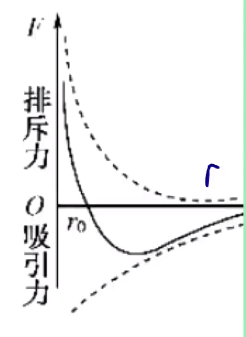

# 【物理】热力学

## 分子动理论

### 物体是由分子构成的

#### 分子的大小

1. 分子直径数量级：$\pu{10^-10 m}$。
2. 分子质量数量级：$\pu{10^-26 kg}$。
3. 测量分子的方法：油膜法。

#### 分子的两种模型

**球体模型**

内容：认为分子是一个个紧挨着的球体。

适用对象：固体、液体。

分子体积的计算：
$$
V = \dfrac{4}{3} \pi R^3 = \dfrac{4}{3}\pi \left(\dfrac{D}{2}\right)^3
$$
**立方体模型**

内容：认为分子是一个个紧挨着的立方体。

适用对象：气体。

分子体积的计算：

已知两个分子之间的距离为 $d$，则：
$$
V = d^3
$$

#### 【实验】油膜法测分子的大小（直径）

**大致思路**

滴一滴油酸摊开在水面上，近似堪称是**单分子层**。根据公式 体积 $=$ 厚度 $\times$ 面积 求得直径。

**构造模型**

认为油酸分子是**球体模型**。

**技术难点**

1. 测量一滴油酸的体积：滴 $100$ 滴，若 $100$ 滴对应的是 $x\ \pu{mL}$，则一滴是 $\dfrac{x}{100}\ \pu{mL}$。
2. 观察油酸：撒痱子粉。具体：先撒粉后滴。
3. 测量面基：数格子。不足半格记为 $0$，超过半格记为 $1$。

**实验步骤**

【稀释】

操作：将 $\pu{1 mL}$ 油酸溶液配置成 $\pu{500 mL}$ 油酸酒精溶液。

目的：形成单分子层。

使用酒精的原因：①有机溶剂；②酒精具有挥发性，可被挥发掉，从而减小由于酒精的存在对实验造成误差。

【测量】

操作：取酒精溶液滴 $100$ 滴测得体积为 $\pu{1 mL}$。所以 $1$ 滴油酸体积是 $\dfrac{1}{100}\times \dfrac{1}{500}\ \pu{mL}$。

【撒粉】撒痱子粉或细石膏粉在水面上。

【滴液】注射器往水面上滴 $1$ 滴油酸酒精溶液。

【描边】稳定后拿出玻璃板盖上进行描边，得到油膜的面基。

【计算】
$$
d = \dfrac{V}{s} \Longrightarrow V_{分子} = \dfrac{4}{3}\pi \left(\dfrac{d}{2}\right)^3
$$
同时可以得到 
$$
d = \sqrt[3]{\dfrac{6M}{\pi \rho N_A}}
$$
**注意事项**

1. 先撒粉后描边；
2. 注意单位之间的换算：尤其是题目中所给的可能是 $\pu{mL}$ 求的是 $\pu{m3}$。

#### 微观量估算

**物理量**

1. 分子层面：单个分子的质量 $m_0$，单个分子的体积 $V_0$。

2. 化学层面：摩尔质量 $M_{摩尔}$，摩尔体积 $V_{摩尔}$。

3. 实际层面：物体质量 $m$，物体体积 $V$。

**物理量之间的关系**

【公式一】
$$
m_0 = \dfrac{M_{摩尔}}{N_A}
$$
$M_{摩尔}$：摩尔质量，表示 $\pu{1 mol}$ 里有多少克分子。

$N_A$：表示 $\pu{1 mol}$ 里有多少个分子。

【公式二】
$$
V_0 = \dfrac{V_{摩尔}}{N_A}
$$
易错点：**不适用于气体分子**。气体用该公式计算得到的是「一个分子所占的空间大小」。

> 有关气体密度的理解
>
> - 气体分子的密度 $\rho_{分子}$：单个气体分子的密度。
> - 气体的密度 $\rho_{气体}$：表示的是气体分子及其所占空间的密度；
>
> 所以 $\rho_{分子} \ll \rho_{气体}$。一般题目中给定某气体的密度指的是 $\rho_{气体}$。 

**解题步骤**

1. 首先判断给定的密度 $\rho$ 是 $\rho_气$ 还是 $\rho_{分子}$。
2. 判断给定的质量 $m$ 是什么层面（化学层面还是分子层面还是实际层面）。
3. 判断给定的 $m$ 除以 $\rho$ 计算得到的是什么层面的 $V$：
   - 给定 $\rho_气$ 和 $M_{摩尔}$，得到摩尔体积 $V_{摩尔}$。
   - 给定 $\rho_气$ 和 $m_0$，得到分子所占空间 $V_{占}$。
   - 给定 $\rho_{分子}$ 和 $m_0$，得到分子的体积 $V_{分子}$。

例：某气体的摩尔质量 $M$，分子质量为 $m$，若 $1$ 摩尔该气体的体积为 $V_m$，密度为 $\rho$。

则
$$
\dfrac{N_A}{V_m} = \dfrac{M}{mV_m} = 该气体单位体积的分子数
$$
且
$$
\dfrac{\rho  N_A}{m} = \dfrac{N_A}{V}\\
\dfrac{\rho N_A}{M} = \dfrac{N_A}{V_m}
$$
其中第一个式子中的 $V$ 表示的是气体分子及所占空间的体积，所得的结果不是「该气体单位体积的分子数」。第二个得到的是「该气体单位体积分子数」。

### 分子热运动

#### 扩散现象

【前提】浓度不同。

【定义】相互接触的不同物质能够彼此进入对方。

【解释】

- 扩散现象并不是因为宏观受力的作用下发生的，且各个状态下都会存在扩散现象。
- 扩散现象**直接**反应了分子的无规则运动。
- 气体和气体之间、液体和液体之间、固体和固体之间都会发生扩散现象。

【影响因素】

- 扩散现象的快慢与物体的状态有关：一般情况下，气体 $>$ 液体 $>$ 固体。
- 扩散现象的快慢与温度有关：一般温度越高，扩散越快。

#### 布朗运动

【定义】悬浮在液体（或气体）中的**微粒**的无规则运动。本质上是宏观层面。

【实验背景】布朗通过显微镜看水中的花粉。

【原因】水分子对布朗微粒撞击的不平衡。

【结论】

- 微粒越小，布朗运动越明显。
- 温度越高，布朗运动越明显。

【易错点】布朗运动**不是**分子运动，**间接**反应了**液体/气体**分子的无规则运动。

【扩散现象与布朗运动对比】

- 不同点：扩散现象是肉眼可见的现象。而布朗运动是光学显微镜观察得到的。
- 相同点：二者都是**微观分子**的热运动所形成**宏观**现象。

### 分子间的作用力与能量

#### 分子间的作用力

【内容】

- 分子虽然有空隙，大量的分子却能聚集起来形成固体或液体说明了分子之间存在**引力**。
- 用力压缩物体，物体内会产生反抗压缩的弹力，说明了分子之间存在**斥力**。

> 注意：给汽车轮胎打气越来越吃力**并不是**体现了「分子间斥力」，而是体现了「气体压强」。

【总结】分子之间引力和斥力同时存在。

【影响因素】

- 引力和斥力都随着分子间距离的增大而减小。
- 斥力的变化比引力要大。

【结论】

- 当分子距离比较近的时候体现斥力。
- 当分子距离比较远的时候体现引力。
- 当分子的距离 $r > 10r_0$ 时，斥力、引力忽略不计。其中 $r_0$ 的数量级时 $\pu{10^-10 m}$。

【分子力图像的理解】

其中，上方的虚线表示排斥力，下方的虚线表示吸引力，实线表示分子间作用力。

- 当 $r = r_0$ 时，$F_引 = F_斥$，$F_合 = 0$。
- 当 $r > r_0$ 时，$F_引 > F_斥$，$F_合$ 表现为引力。
- 当 $r < r_0$ 时，$F_引 < F_斥$，$F_合$ 表现为斥力。
- 当 $r > 10r_0$ 时，$F_引 \approx F_斥 \approx 0$，$F_合 \approx 0$。
- $F_合$ 变化：先减小再增大再减小。

> 注意：该图不能表示气体分子力与分子间距变化的规律。因为气体中分子间的作用力一般很小，可以忽略。

### 分子之间的能量

#### 引入

两分子从靠近到逐渐相互远离的过程中：

- 起初，分子力体现排斥力，位移方向与力的方向相同，做正功，消耗能量，分子势能减小。
- 当分子间距离达到一定距离后，分子力体现吸引力，位移方向与力的方向相反，做负功，增加能量，分子势能增加。

所以整个过程中先做正功再做负功，分子势能先减小后增加。

#### 分子势能

【核心观点】做正功势能减少，做负功势能增大。

【默认规定】取无穷远的地方势能为 $0$。

【结论】从无穷远逐渐靠近的过程中，分子力先是引力，然后是斥力，分子力先做正功，后做负功，分子势能先减小后增大。

【图像】

其中，$f$ 表示分子力，$E_p$ 表示分子势能。

所以当 $r = r_0$ 时，$f$ 最小（为 $0$），分子势能最小（不为 $0$）。

【分子势能的体现】

- 在微观上：分子势能与位置有关。
- 在宏观上：分子势能与体积有关。

 #### 分子动能

【定义】分子动能时分子**热运动**所具有的能量。

> 注意：不是「机械运动」。

【分子平均动能】所有分子动能的平均值。研究单个分子的动能没有意义，所以研究的动能时分子的平均动能。

【影响因素（平均动能）】**温度**。

 【易错点】

- 不同物质，只要温度相同，平均动能**一定相同**。
- 在研究分子动能时，物体的实际速度无关。
- 对于单个分子来说，温度越高，动能**不一定**越大。

【图像】

规律：

- 中间高，两边低。
- 温度高低看最高点的横坐标 $x$（**分子的速率**）。
- 无论温度如何，图像围成的面基为 $1$。

