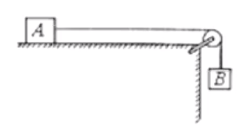

# 【物理】牛二力学

## 牛顿第二定律

1. 公式：$F_合 = ma$。其中 $F_合$ 指的是合外力，即物体所受的所有力合成的力。
2. 方向：$F_合$ 的方向与 $a$ 的方向一致。

## 牛二正交分解

1. 建系：建立合适的坐标系，让尽可能多的力在坐标轴上。**一般以 $a$ 的方向为 $x$ 轴，与 $a$ 方向垂直的方向为 $y$ 轴**。（这样可以保证 $y$ 轴上的力一定平衡）
2. 分解：分解不在坐标轴上的力。
3. 列式：对于**某方向平衡时**：上 = 下 或 左 = 力；对于**某方向不平衡时**，$F_合 = 大 - 小$。

## 求解拉力作用最短时间的方法技巧

定义：位移 $x$ 一定，对物体施加一个拉力，让其从开始运动到中间某一时刻后，撤去外力，让它自行减速滑到终点，当滑到终点时速度恰好为 $0$（恰好静止），此时整个过程中拉力作用的时间即为拉力作用的最短时间。

运动过程：

- 匀加速直线运动：从起点出发，到撤去外力前；
- 匀减速直线运动：从撤去外力开始，到最后静止。

方法：

1. 对「撤去外力前」的物体进行受力分析，求得加速过程中的加速度 $a_1$；

2. 对「恰好撤去外力时」的物体进行受力分析，求得减速过程中的加速度 $a_2$；

3. 画出「整个运动过程」的 $v-t$ 图像：先加速后减速，如图所示。

   

4. 设所求为 $t$，根据图像列式求解得到 $t$。（此时图像中封闭的三角形面积等于位移）

## 【模型】弹簧运动模型

判断加速/减速的方法：看 $a,v$ 符号：①$a,v$ 同号 $\to$ 加速运动；②$a,v$ 异号 $\to$ 减速运动。

其中加速度 $a$ 的方向与 $F_合$ 方向相同，速度 $v$ 的方向与物体运动的方向相同。

过程分析：

- 物体刚接触到弹簧时：受到**较大**的重力 $G$ 和**较小**的弹簧弹力 $F_N$，$F_合$ 竖直向下，加速度 $a$ 竖直向下，速度 $v$ 竖直向下，做加速运动；
- 从物体接触到弹簧到向下运动（$F_N < G$）时：受到**较大**的重力 $G$ 和**较小**的弹簧弹力 $F_N$，且 $F_N$ 随着弹簧压缩量 $x$ 的增大而增大，$F_合$ 竖直向下，大小逐渐减小，加速度 $a$ 竖直向下，速度 $v$ 竖直向下，做**加速度减小**的加速运动。
- 临界点（$F_N = G$）时：当 $F_N$ 增大到与 $G$ 大小相等时，$F_合 = 0$，物体处于平衡状态，$a=0$，此时速度 $v$ 达到**最大值**。
- 从临界点到速度减小为 $0$ 前：受到**较小**的重力 $G$ 和**较大**的弹簧弹力 $F_N$，且 $F_N$ 随着弹簧压缩量 $x$ 的增大而增大，$F_合$ 竖直向上，大小逐渐增大，加速度 $a$ 竖直向上，速度 $v$ 竖直向下，做**加速度增大**的减速运动。
- 速度减小为 $0$ 时：弹簧压缩量达到最大，$F_N$ 达到最大，$F_合$ 达到最大，$v=0$。

## 【模型】绳子倾角模型

问题模型：如图，已知绳子倾角 $\theta$，求小车的加速度 $a$ 的大小。

受力分析：小球受自身重力 $G$ 和绳子拉力 $T$。

所以根据受力分析可以求出物体的加速度 $a$ 的大小为 $\mathrm g\tan \theta$。

问题：

- 运动状态：根据受力分析可知，$F_合$ 水平向右。所以当物体向左运动时，$v$ 向左，做减速运动；当物体向右运动时，$v$ 向右，做加速运动。
- 对于与之相关的其他物体的受力分析：根据小球的 $F_合$ 求出 $a$ 的加速度方向，从而判断出其他物体受力（大概率是摩擦力）的受力方向。

## 斜面多段运动

将整个运动分为多过程，对于每个过程都进行受力分析，计算求解。

## 有关牛二运动学基础计算的常见易错点及注意事项

1. $f= \mu F_N$ 代入 $F_N$ 的表达式计算 $f$ 时，不要忘记前面的 $\mu$。
2. 代入值计算时，例如 $a = \mu \mathrm g$ 中 $g$ 表示的是重力加速度而非质量。
3. 对于有斜面的问题时，若题目求得是**高度**不要求成**长度**。
4. 当某物体从斜面上冲上，到达最高点，判断能否下滑时，应该判断 $\mu$ 和 $\tan \theta$ 的大小关系：
   - 当 $\mu < \tan \theta$ 时，能继续下滑；
   - 当 $\mu \ge \tan \theta$ 时，不能继续下滑。
5. 对于与运动学结合的题目，要善用速度位移公式 $2ax = v^2 - {v_0}^2$

## 超重与失重

**超重**

加速度 $a$ 的方向向上时（或在竖直方向有向上的分加速度），物体处于超重状态。

**失重**

加速度 $a$ 的方向向下时（或在竖直方向有向下的分加速度），物体处于失重状态。

> 当加速度 $a = \mathrm g$ 时（大小方向均相等），处于完全失重状态。

**解题技巧及注意事项**

1. 受力分析时一般分析与其他物体接触最少的物体。
2. 对于「某人在地面上最多能举起质量为 $\pu{80kg}$ 的重物」的理解：手对物体的支持力为 $\pu{800N}$。
3. 加速度 $a$ 的方向始终与合外力 $F_合$ 的方向相同，有时可以根据这个判断是否存在摩擦力以及摩擦力的方向。

## 单物体弹簧突变

**特点**

弹簧弹力无法突变。

原因：$F = k\Delta x$，所以只有位移产生明显变化时，$F$ 才会改变，在弹簧断裂的一瞬间 $x$ 还没有发生明显变化，所以 $F$ 不会突变。

**解题方法**

1. 计算弹簧弹力；
2. 把弹簧弹力看成外力，重新受力分析。

**易错点及注意事项**

1. 受力分析得到的 $F_合 = ma$ 中，注意 $m$ 前面的系数，例如 $2m$ 不要写成 $m$。
2. 若**剪断弹簧**，则弹簧的弹力变为 $0$。
3. 遇到需要正交分解求解加速度的问题，可以考虑受力分析时正交分解和力的合成求出 $F_合$ 的方向及大小。
4. 对于未知物体状态（运动还是静止）的题目求摩擦力，首先应该判断物体受静摩擦还是滑动摩擦（或者物体的运动状态）。

## 分解加速度

**建系优先级**

1. 若题目所求的两个力相互垂直，则按照这两个力的方向为坐标轴建系。注意：此时需要分解不在坐标轴上的**所有物理量**，例如除了力还可能有加速度 $a$。
2. 否则按照加速度 $a$ 的方向建系。

## 多物体牛二

### 解题思路

1. 先后顺序：首先考虑接触面少的物体进行受力分析。
2. 相互作用：画出与已分析的物体会产生相互作用的力的物体对应的力。
3. 不断重复第二步。

### 解题方法——整体法

【使用条件】加速度 $a$ 相同。

【目的】快速求加速度 $a$​ 或求外力。

> 做题时，一般可以先考虑能否用整体法，**优先考虑整体法，再考虑隔离法**。

### 【模型】一静一动模型

含义：一个物体平衡（加速度为 $0$）另一个物体加速度不为 $0$。静：静止不动（相对地面），即加速度为 $0$ 且速度为 $0$。

求解：按照上述解题方法进行受力分析列式求解。

### 【模型】连接体

#### 推导

> 其中模型一 ~ 模型五属于同一类（绳子时直的），模型六~模型八属于同一类（绳子是弯的）。
>
> 一般前一类可以用整体法，后一类一般只能用隔离法。

**模型一**

如图所示，已知 $m_A,m_B,F$，求绳子拉力 $T$ 和加速度 $a$（水平地面光滑）。

首先判断两物体加速度是否相同。一般有两种判断方法：

1. 题目中有「一起」或「共同」运动之类的字眼。
2. 分类讨论两个物体之间的加速度的大小关系（大于、小于和等于）。

此题考虑分类讨论：

- 当 $a_A > a_B$ 时，$v_A$ 会逐渐超过 $v_B$，绳子会出现松弛，所以物体 $A$ 只受到重力和支持力，在竖直方向上平衡，就不可能有加速度，所以这种情况不可能出现。
- 当 $a_A < a_B$ 时，$v_B$ 会逐渐超过 $v_A$，绳子会断掉，所以这种情况也不可能出现。

综上所述，一定有 $a_A = a_B$。

对 $A,B$ 整体受力分析得：
$$
\begin{cases}
(m_A + m_B)a = F\\
F_支 = (m_A + m_B)\mathrm g
\end{cases}
\implies a = \dfrac F {m_A + m_B}
$$
由于 $A$ 的接触面更少，所以接下来对 $A$ 受力分析得：
$$
\begin{cases}
m_A a = T\\
F_支 = m_A\mathrm g
\end{cases}
\implies 
T = m_A a = \dfrac{m_A}{m_A + m_B}F
$$
**模型二**

如图所示，已知 $m_A,m_B,F$，求绳子拉力 $T$ 和加速度 $a$。

同理可知 $a_A = a_B$。所以对 $A,B$​ 整体受力分析：
$$
(m_A + m_B)a = F - (m_A + m_B)\mathrm g \implies a = \dfrac{F}{m_A + m_B} - \mathrm g
$$

> 注意加速度的表达式尽量化到最简。

对 $B$ 受力分析：
$$
m_Ba = T - m_B \mathrm g \implies T = \dfrac {m_B} {m_A + m_B}F
$$
**模型三**

如图所示，已知 $m_A,m_B,F,\theta$，求绳子拉力 $T$ 和加速度 $a$（斜面光滑）。

对 $A,B$ 整体受力分析得：
$$
\begin{cases}
(m_A + m_B)a = F - (m_A + m_B)\mathrm g \sin \theta\\
F_N = (m_A + m_B)\mathrm g
\end{cases}
\implies
a = \dfrac{F}{m_A + m_B} - \mathrm g \sin\theta
$$
对 $A$ 受力分析得：
$$
\begin{cases}
m_Aa = T - m_A\mathrm g\sin \theta\\
F_N = m_A\mathrm g \cos \theta
\end{cases}
\implies 
T = \dfrac{m_A}{m_A + m_B}F
$$
**模型四**

如图所示，已知 $m_A,m_B,F$，求绳子拉力 $T$ 和加速度 $a$（水平地面粗糙）。

对 $A,B$ 整体受力分析得：
$$
\begin{cases}
(m_A + m_B)a = F - \mu F_N\\
F_N = (m_A + m_B)\mathrm g
\end{cases}
\implies
a = \dfrac{F}{m_A + m_B} - \mu \mathrm g
$$
对 $A$ 受力分析得：
$$
\begin{cases}
m_Aa = T - \mu F_N\\
F_N = m_A\mathrm g
\end{cases}
\implies 
T = \dfrac{m_A}{m_A + m_B} F
$$
**模型五**

如图所示，已知 $m_A,m_B,F,\theta$，求绳子拉力 $T$ 和加速度 $a$（斜面粗糙）。

对 $A,B$ 受力分析得：
$$
\begin{cases}
(m_A + m_B)a = F - \mu F_N - (m_A + m_B)\mathrm g \sin \theta\\
F_N = (m_A + m_B)\mathrm g \cos \theta
\end{cases}
\implies a = \dfrac{F}{m_A + m_B} - \mathrm g\sin \theta - \mu \mathrm g \cos \theta
$$
对 $A$ 受力分析得：
$$
\begin{cases}
m_A a = T - m_A \mathrm g\sin\theta - \mu F_N\\
F_N = m_A\mathrm g\cos \theta
\end{cases}
\implies
F = \dfrac{m_A}{m_A + m_B}F
$$
**模型六**

如图所示，已知 $m_A,m_B$，$B$ 物体加速下滑，求绳子拉力 $T$ 和加速度 $a$（地面光滑）。

**由于此时 $a_A$ 和 $a_B$​ 的方向不同，所以不能采用整体法**，故采用隔离法。

对 $A$ 受力分析：
$$
m_A a = T\qquad (1)
$$
对 $B$ 受力分析：
$$
m_B a = m_B\mathrm g - T \qquad (2)
$$
$(1) + (2)$ 得：
$$
a = \dfrac{m_B\mathrm g}{m_A + m_B}
$$
代入 $(1)$ 得：
$$
T = \dfrac{m_A m_B \mathrm g}{m_A + m_B}
$$
**模型七**

如图所示，已知 $m_A,m_B$，$A$ 物体加速下滑，求绳子拉力 $T$ 和加速度 $a$。

此时 $a_A$ 与 $a_B$ 加速度方向相反，大小相同。

对 $A$ 受力分析：
$$
m_A a = m_A\mathrm g -T\qquad (1)
$$
对 $B$ 受力分析：
$$
m_Ba = T - m_B\mathrm g\qquad (2)
$$
$(1) + (2)$ 得：
$$
a = \dfrac{m_A \mathrm g - m_B\mathrm g}{m_A + m_B}
$$
代入 $(2)$ 得：
$$
T = \dfrac{2m_B m_A \mathrm g}{m_A + m_B}
$$
**模型八**

如图所示，已知 $m_A,m_B$，$A$ 物体加速下滑，求绳子拉力 $T$ 和加速度 $a$（鞋面光滑）。

对 $B$ 受力分析：
$$
m_Ba = T - m_B\mathrm g \sin \theta \qquad (1)
$$
对 $A$​ 受力分析：
$$
m_A a = m_A \mathrm g - T \qquad (2)
$$
$(1) + (2)$ 得：
$$
a = \dfrac{m_A \mathrm g - m_B \mathrm g \sin\theta}{m_A + m_B}
$$
代入 $(2)$ 得：
$$
T = \dfrac{m_A m_B \mathrm g + m_A m_B\mathrm g \sin \theta}{m_A + m_B}
$$

#### 例题

如图所示，$n$ 个质量为 $m$ 的木块并列放在光滑水平地面上，当用水平力 $F$ 推木块 $1$ 时，木块 $3$ 与木块 $4$ 之间的相互作用力大小是多少。

分析：

发现 $1 \sim n$ 的所有物体加速度相同，以所有物体为研究对象受力分析得：
$$
a = \dfrac F {nm}
$$
由于求的是木块 $3$ 和木块 $4$ 之间的作用力，所以考虑以 $4\sim n$ 的所有物体为整体受力分析得：
$$
(n-3)ma = N \implies N = \dfrac{(n-3)F}{n}
$$

> 技巧&总结：当物体的数量较多时，可以考虑隔离其中一部分物体作为整体利用整体法求解。

### 【模型】多物体弹簧突变

#### 解题方法

1. 计算弹簧弹力；
2. 把弹簧弹力看成外力，重新受力分析。

> 一般情况下，受力分析中只有「外力」和「重力」可以直接明确算出大小，其他均需要通过受力分析求出。

#### 例题

如图所示，吊篮 $A$，物体 $B$，物体 $C$ 的质量分别为 $m,3m,2m$，$B$ 和 $C$ 分别固定在弹簧两端，弹簧的质量不计。$B$ 和 $C$ 在吊篮的水平底板上处于静止状态，将悬挂吊篮的轻绳剪断的瞬间（）

A. 吊篮 $A$ 的加速度大小为 $\mathrm g$

B. 物体 $B$ 的加速度大小为 $\mathrm g$​

C. 物体 $C$ 的加速度大小为 $\pu{2g}$

D. $A、B、C$ 的加速度大小都等于 $\mathrm g$

---

分析：

对 $B$ 物体受力分析可求得弹簧弹力 $F_N = \pu{3mg}$​。

将弹簧弹力当成外力，再对装置各个部分受力分析。

首先以 $B$ 为研究对象受力分析可得
$$
m_B a = m_B\mathrm g - F_N \implies a = 0
$$
对 $C$ 受力分析发现它受到 $A$ 对它自身的支持力 $F_支$ 未知，对 $A$ 受力分析也无法求出 $F_支$，考虑 $A,C$ 能否使用整体法，从而避免求出两者之间的内力。

分类讨论 $a_A$ 和 $a_C$ 的大小关系如下：

- 若 $a_A > a_C$，则 $v_A > v_C$，此时 $A$ 与 $C$ 不接触，那么 $A$ 只受重力，此时加速度为 $\mathrm g$，$C$ 受到弹簧的外力和自身重力，可求得此时重力为 $\pu{2.5g}$，与 $a_A > a_C$ 矛盾，舍去。
- 若 $a_A < a_C$，则 $v_A < v_C$，此时物体 $C$ 会穿透物体 $A$​，不符合逻辑，舍去。

所以 $a_A = a_C$，可以整体法分析。

对 $A,C$ 整体受力分析得：
$$
3ma = 6m\mathrm g \implies a = 2g
$$
故选 C。
