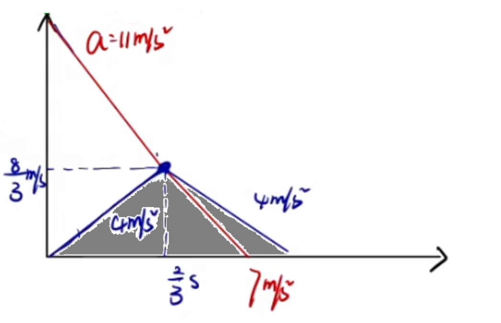

# 【物理】牛二力学

## 牛顿第二定律

### 公式

$$
F_合 = ma
$$

其中 $F_合$ 指的是合外力，即物体所受的所有力合成的力。

### 方向

$F_合$ 的方向与 $a$ 的方向一致。

## 牛二正交分解

1. 建系：建立合适的坐标系，让尽可能多的力在坐标轴上。**一般以 $a$ 的方向为 $x$ 轴，与 $a$ 方向垂直的方向为 $y$ 轴**。（这样可以保证 $y$ 轴上的力一定平衡）
2. 分解：分解不在坐标轴上的力。
3. 列式：对于**某方向平衡时**：上 = 下 或 左 = 力；对于**某方向不平衡时**，$F_合 = 大 - 小$。

## 求解拉力作用最短时间的方法技巧

定义：位移 $x$ 一定，对物体施加一个拉力，让其从开始运动到中间某一时刻后，撤去外力，让它自行减速滑到终点，当滑到终点时速度恰好为 $0$（恰好静止），此时整个过程中拉力作用的时间即为拉力作用的最短时间。

运动过程：

- 匀加速直线运动：从起点出发，到撤去外力前；
- 匀减速直线运动：从撤去外力开始，到最后静止。

方法：

1. 对「撤去外力前」的物体进行受力分析，求得加速过程中的加速度 $a_1$；

2. 对「恰好撤去外力时」的物体进行受力分析，求得减速过程中的加速度 $a_2$；

3. 画出「整个运动过程」的 $v-t$ 图像：先加速后减速，如图所示。

   

4. 设所求为 $t$，根据图像列式求解得到 $t$。（此时图像中封闭的三角形面积等于位移）

## 【模型】弹簧运动模型

判断加速/减速的方法：看 $a,v$ 符号：①$a,v$ 同号 $\to$ 加速运动；②$a,v$ 异号 $\to$ 减速运动。

其中加速度 $a$ 的方向与 $F_合$ 方向相同，速度 $v$ 的方向与物体运动的方向相同。

过程分析：

- 物体刚接触到弹簧时：受到**较大**的重力 $G$ 和**较小**的弹簧弹力 $F_N$，$F_合$ 竖直向下，加速度 $a$ 竖直向下，速度 $v$ 竖直向下，做加速运动；
- 从物体接触到弹簧到向下运动（$F_N < G$）时：受到**较大**的重力 $G$ 和**较小**的弹簧弹力 $F_N$，且 $F_N$ 随着弹簧压缩量 $x$ 的增大而增大，$F_合$ 竖直向下，大小逐渐减小，加速度 $a$ 竖直向下，速度 $v$ 竖直向下，做**加速度减小**的加速运动。
- 临界点（$F_N = G$）时：当 $F_N$ 增大到与 $G$ 大小相等时，$F_合 = 0$，物体处于平衡状态，$a=0$，此时速度 $v$ 达到**最大值**。
- 从临界点到速度减小为 $0$ 前：受到**较小**的重力 $G$ 和**较大**的弹簧弹力 $F_N$，且 $F_N$ 随着弹簧压缩量 $x$ 的增大而增大，$F_合$ 竖直向上，大小逐渐增大，加速度 $a$ 竖直向上，速度 $v$ 竖直向下，做**加速度增大**的减速运动。
- 速度减小为 $0$ 时：弹簧压缩量达到最大，$F_N$ 达到最大，$F_合$ 达到最大，$v=0$。

## 【模型】绳子倾角模型

问题模型：如图，已知绳子倾角 $\theta$，求小车的加速度 $a$ 的大小。

受力分析：小球受自身重力 $G$ 和绳子拉力 $T$。

所以根据受力分析可以求出物体的加速度 $a$ 的大小为 $\mathrm g\tan \theta$。

问题：

- 运动状态：根据受力分析可知，$F_合$ 水平向右。所以当物体向左运动时，$v$ 向左，做减速运动；当物体向右运动时，$v$ 向右，做加速运动。
- 对于与之相关的其他物体的受力分析：根据小球的 $F_合$ 求出 $a$ 的加速度方向，从而判断出其他物体受力（大概率是摩擦力）的受力方向。

## 斜面多段运动

将整个运动分为多过程，对于每个过程都进行受力分析，计算求解。

## 有关牛二运动学基础计算的常见易错点及注意事项

1. $f= \mu F_N$ 代入 $F_N$ 的表达式计算 $f$ 时，不要忘记前面的 $\mu$。
2. 代入值计算时，例如 $a = \mu \mathrm g$ 中 $g$ 表示的是重力加速度而非质量。
3. 对于有斜面的问题时，若题目求得是**高度**不要求成**长度**。
4. 当某物体从斜面上冲上，到达最高点，判断能否下滑时，应该判断 $\mu$ 和 $\tan \theta$ 的大小关系：
   - 当 $\mu < \tan \theta$ 时，能继续下滑；
   - 当 $\mu \ge \tan \theta$ 时，不能继续下滑。
5. 对于与运动学结合的题目，要善用速度位移公式 $2ax = v^2 - {v_0}^2$

## 超重与失重

**超重**

加速度 $a$ 的方向向上时（或在竖直方向有向上的分加速度），物体处于超重状态。

**失重**

加速度 $a$ 的方向向下时（或在竖直方向有向下的分加速度），物体处于失重状态。

> 当加速度 $a = \mathrm g$ 时（大小方向均相等），处于完全失重状态。

**解题技巧及注意事项**

1. 受力分析时一般分析与其他物体接触最少的物体。
2. 对于「某人在地面上最多能举起质量为 $\pu{80kg}$ 的重物」的理解：手对物体的支持力为 $\pu{800N}$。
3. 加速度 $a$ 的方向始终与合外力 $F_合$ 的方向相同，有时可以根据这个判断是否存在摩擦力以及摩擦力的方向。

## 单物体弹簧突变

**特点**

弹簧弹力无法突变。

原因：$F = k\Delta x$，所以只有位移产生明显变化时，$F$ 才会改变，在弹簧断裂的一瞬间 $x$ 还没有发生明显变化，所以 $F$ 不会突变。

**解题方法**

1. 计算弹簧弹力；
2. 把弹簧弹力看成外力，重新受力分析。

**易错点及注意事项**

1. 受力分析得到的 $F_合 = ma$ 中，注意 $m$ 前面的系数，例如 $2m$ 不要写成 $m$。
2. 若**剪断弹簧**，则弹簧的弹力变为 $0$。
3. 遇到需要正交分解求解加速度的问题，可以考虑受力分析时正交分解和力的合成求出 $F_合$ 的方向及大小。
4. 对于未知物体状态（运动还是静止）的题目求摩擦力，首先应该判断物体受静摩擦还是滑动摩擦（或者物体的运动状态）。

## 分解加速度

**建系优先级**

1. 若题目所求的两个力相互垂直，则按照这两个力的方向为坐标轴建系。注意：此时需要分解不在坐标轴上的**所有物理量**，例如除了力还可能有加速度 $a$。
2. 否则按照加速度 $a$ 的方向建系。

## 多物体牛二

### 解题思路

1. 先后顺序：首先考虑接触面少的物体进行受力分析。
2. 相互作用：画出与已分析的物体会产生相互作用的力的物体对应的力。
3. 不断重复第二步。

### 解题方法——整体法

【使用条件】加速度 $a$ 相同。

【目的】快速求加速度 $a$​ 或求外力。

> 做题时，一般可以先考虑能否用整体法，**优先考虑整体法，再考虑隔离法**。

### 【模型】一静一动模型

含义：一个物体平衡（加速度为 $0$）另一个物体加速度不为 $0$。静：静止不动（相对地面），即加速度为 $0$ 且速度为 $0$。

求解：按照上述解题方法进行受力分析列式求解。

### 【模型】连接体

#### 推导

> 其中模型一 ~ 模型五属于同一类（绳子时直的），模型六~模型八属于同一类（绳子是弯的）。
>
> 一般前一类可以用整体法，后一类一般只能用隔离法。

**模型一**

如图所示，已知 $m_A,m_B,F$，求绳子拉力 $T$ 和加速度 $a$（水平地面光滑）。

首先判断两物体加速度是否相同。一般有两种判断方法：

1. 题目中有「一起」或「共同」运动之类的字眼。
2. 分类讨论两个物体之间的加速度的大小关系（大于、小于和等于）。

此题考虑分类讨论：

- 当 $a_A > a_B$ 时，$v_A$ 会逐渐超过 $v_B$，绳子会出现松弛，所以物体 $A$ 只受到重力和支持力，在竖直方向上平衡，就不可能有加速度，所以这种情况不可能出现。
- 当 $a_A < a_B$ 时，$v_B$ 会逐渐超过 $v_A$，绳子会断掉，所以这种情况也不可能出现。

综上所述，一定有 $a_A = a_B$。

对 $A,B$ 整体受力分析得：
$$
\begin{cases}
(m_A + m_B)a = F\\
F_支 = (m_A + m_B)\mathrm g
\end{cases}
\implies a = \dfrac F {m_A + m_B}
$$
由于 $A$ 的接触面更少，所以接下来对 $A$ 受力分析得：
$$
\begin{cases}
m_A a = T\\
F_支 = m_A\mathrm g
\end{cases}
\implies 
T = m_A a = \dfrac{m_A}{m_A + m_B}F
$$
**模型二**

如图所示，已知 $m_A,m_B,F$，求绳子拉力 $T$ 和加速度 $a$。

同理可知 $a_A = a_B$。所以对 $A,B$​ 整体受力分析：
$$
(m_A + m_B)a = F - (m_A + m_B)\mathrm g \implies a = \dfrac{F}{m_A + m_B} - \mathrm g
$$

> 注意加速度的表达式尽量化到最简。

对 $B$ 受力分析：
$$
m_Ba = T - m_B \mathrm g \implies T = \dfrac {m_B} {m_A + m_B}F
$$
**模型三**

如图所示，已知 $m_A,m_B,F,\theta$，求绳子拉力 $T$ 和加速度 $a$（斜面光滑）。

对 $A,B$ 整体受力分析得：
$$
\begin{cases}
(m_A + m_B)a = F - (m_A + m_B)\mathrm g \sin \theta\\
F_N = (m_A + m_B)\mathrm g
\end{cases}
\implies
a = \dfrac{F}{m_A + m_B} - \mathrm g \sin\theta
$$
对 $A$ 受力分析得：
$$
\begin{cases}
m_Aa = T - m_A\mathrm g\sin \theta\\
F_N = m_A\mathrm g \cos \theta
\end{cases}
\implies 
T = \dfrac{m_A}{m_A + m_B}F
$$
**模型四**

如图所示，已知 $m_A,m_B,F$，求绳子拉力 $T$ 和加速度 $a$（水平地面粗糙）。

对 $A,B$ 整体受力分析得：
$$
\begin{cases}
(m_A + m_B)a = F - \mu F_N\\
F_N = (m_A + m_B)\mathrm g
\end{cases}
\implies
a = \dfrac{F}{m_A + m_B} - \mu \mathrm g
$$
对 $A$ 受力分析得：
$$
\begin{cases}
m_Aa = T - \mu F_N\\
F_N = m_A\mathrm g
\end{cases}
\implies 
T = \dfrac{m_A}{m_A + m_B} F
$$
**模型五**

如图所示，已知 $m_A,m_B,F,\theta$，求绳子拉力 $T$ 和加速度 $a$（斜面粗糙）。

对 $A,B$ 受力分析得：
$$
\begin{cases}
(m_A + m_B)a = F - \mu F_N - (m_A + m_B)\mathrm g \sin \theta\\
F_N = (m_A + m_B)\mathrm g \cos \theta
\end{cases}
\implies a = \dfrac{F}{m_A + m_B} - \mathrm g\sin \theta - \mu \mathrm g \cos \theta
$$
对 $A$ 受力分析得：
$$
\begin{cases}
m_A a = T - m_A \mathrm g\sin\theta - \mu F_N\\
F_N = m_A\mathrm g\cos \theta
\end{cases}
\implies
F = \dfrac{m_A}{m_A + m_B}F
$$
**模型六**

如图所示，已知 $m_A,m_B$，$B$ 物体加速下滑，求绳子拉力 $T$ 和加速度 $a$（地面光滑）。

**由于此时 $a_A$ 和 $a_B$​ 的方向不同，所以不能采用整体法**，故采用隔离法。

对 $A$ 受力分析：
$$
m_A a = T\qquad (1)
$$
对 $B$ 受力分析：
$$
m_B a = m_B\mathrm g - T \qquad (2)
$$
$(1) + (2)$ 得：
$$
a = \dfrac{m_B\mathrm g}{m_A + m_B}
$$
代入 $(1)$ 得：
$$
T = \dfrac{m_A m_B \mathrm g}{m_A + m_B}
$$
**模型七**

如图所示，已知 $m_A,m_B$，$A$ 物体加速下滑，求绳子拉力 $T$ 和加速度 $a$。

此时 $a_A$ 与 $a_B$ 加速度方向相反，大小相同。

对 $A$ 受力分析：
$$
m_A a = m_A\mathrm g -T\qquad (1)
$$
对 $B$ 受力分析：
$$
m_Ba = T - m_B\mathrm g\qquad (2)
$$
$(1) + (2)$ 得：
$$
a = \dfrac{m_A \mathrm g - m_B\mathrm g}{m_A + m_B}
$$
代入 $(2)$ 得：
$$
T = \dfrac{2m_B m_A \mathrm g}{m_A + m_B}
$$
**模型八**

如图所示，已知 $m_A,m_B$，$A$ 物体加速下滑，求绳子拉力 $T$ 和加速度 $a$（鞋面光滑）。

对 $B$ 受力分析：
$$
m_Ba = T - m_B\mathrm g \sin \theta \qquad (1)
$$
对 $A$​ 受力分析：
$$
m_A a = m_A \mathrm g - T \qquad (2)
$$
$(1) + (2)$ 得：
$$
a = \dfrac{m_A \mathrm g - m_B \mathrm g \sin\theta}{m_A + m_B}
$$
代入 $(2)$ 得：
$$
T = \dfrac{m_A m_B \mathrm g + m_A m_B\mathrm g \sin \theta}{m_A + m_B}
$$

#### 例题

如图所示，$n$ 个质量为 $m$ 的木块并列放在光滑水平地面上，当用水平力 $F$ 推木块 $1$ 时，木块 $3$ 与木块 $4$ 之间的相互作用力大小是多少。

分析：

发现 $1 \sim n$ 的所有物体加速度相同，以所有物体为研究对象受力分析得：
$$
a = \dfrac F {nm}
$$
由于求的是木块 $3$ 和木块 $4$ 之间的作用力，所以考虑以 $4\sim n$ 的所有物体为整体受力分析得：
$$
(n-3)ma = N \implies N = \dfrac{(n-3)F}{n}
$$

> 技巧&总结：当物体的数量较多时，可以考虑隔离其中一部分物体作为整体利用整体法求解。

### 【模型】多物体弹簧突变

#### 解题方法

1. 计算弹簧弹力；
2. 把弹簧弹力看成外力，重新受力分析。

> 一般情况下，受力分析中只有「外力」和「重力」可以直接明确算出大小，其他均需要通过受力分析求出。

#### 例题

如图所示，吊篮 $A$，物体 $B$，物体 $C$ 的质量分别为 $m,3m,2m$，$B$ 和 $C$ 分别固定在弹簧两端，弹簧的质量不计。$B$ 和 $C$ 在吊篮的水平底板上处于静止状态，将悬挂吊篮的轻绳剪断的瞬间（）

A. 吊篮 $A$ 的加速度大小为 $\mathrm g$

B. 物体 $B$ 的加速度大小为 $\mathrm g$​

C. 物体 $C$ 的加速度大小为 $\pu{2g}$

D. $A、B、C$ 的加速度大小都等于 $\mathrm g$

---

分析：

对 $B$ 物体受力分析可求得弹簧弹力 $F_N = \pu{3mg}$​。

将弹簧弹力当成外力，再对装置各个部分受力分析。

首先以 $B$ 为研究对象受力分析可得
$$
m_B a = m_B\mathrm g - F_N \implies a = 0
$$
对 $C$ 受力分析发现它受到 $A$ 对它自身的支持力 $F_支$ 未知，对 $A$ 受力分析也无法求出 $F_支$，考虑 $A,C$ 能否使用整体法，从而避免求出两者之间的内力。

分类讨论 $a_A$ 和 $a_C$ 的大小关系如下：

- 若 $a_A > a_C$，则 $v_A > v_C$，此时 $A$ 与 $C$ 不接触，那么 $A$ 只受重力，此时加速度为 $\mathrm g$，$C$ 受到弹簧的外力和自身重力，可求得此时重力为 $\pu{2.5g}$，与 $a_A > a_C$ 矛盾，舍去。
- 若 $a_A < a_C$，则 $v_A < v_C$，此时物体 $C$ 会穿透物体 $A$​，不符合逻辑，舍去。

所以 $a_A = a_C$，可以整体法分析。

对 $A,C$ 整体受力分析得：
$$
3ma = 6m\mathrm g \implies a = 2g
$$
故选 C。

### 【模型】叠加体

> 与连接体的区别：连接体是靠弹力连接物体，叠加体靠摩擦力连接物体。

#### 推导

**模型一**

如图所示，已知 $m,M,F$，两物体一起向右做加速运动，求 $m$ 的摩擦力是多少（地面光滑）？

由于两物体相对静止，所以他们之间的摩擦力是静摩擦力，同时两物体加速度相同，可利用整体法。

对两物体整体受力分析：
$$
(m + M)a = F \implies a = \dfrac{F}{m + M}
$$
由于 $m$ 的接触面更少，所以对 $m$ 隔离单独进行受力分析：
$$
ma = f \implies f = \dfrac{m}{m+ M}F
$$
**模型二**

如图所示，已知 $m,M,F$，两物体一起向右做加速运动，求 $m$ 的摩擦力是多少（地面光滑）？

对两物体整体受力分析：
$$
(m + M)a = F \implies a = \dfrac{F}{m + M}
$$
对 $M$ 受力分析：
$$
Ma = f \implies \dfrac M{m+ M}F
$$
**模型三**

如图所示，已知 $m,M,F$，两物体沿斜面向上做匀加速运动，求 $m$ 的摩擦力是多少（地面光滑）？

对两物体整体受力分析：
$$
(m+ M)a = F - (m+M)\mathrm g \sin\theta \implies a = \dfrac F {m + M} - \mathrm g\sin \theta
$$
对 $m$ 受力分析：
$$
ma = f - m\mathrm g \sin \theta \implies f = \dfrac m {m+M}F
$$
**模型四**

如图所示，已知 $m,M,F$，两物体沿斜面向上做匀加速运动，求 $m$ 的摩擦力是多少（地面粗糙）？

对两物体整体受力分析：
$$
(m + M)a = F - \mu (m + M)\mathrm g \implies a = \dfrac{F}{m + M} - \mu \mathrm g
$$
对 $m$ 受力分析：
$$
ma = f \implies f = \dfrac{m}{m + M}F - \mu m \mathrm g
$$

#### 叠加体相对滑动临界问题

 **解题思路**

1. 找到**不受外力**的物体。
2. 通过隔离法求出 1 中物体的最大加速度 $a$。
3. 整体法求外力 $F$。

#### 例题

 如图所示，光滑水面上放置质量分别为 $m$ 和 $2m$ 的四个木块，其中两个质量为 $2m$ 的木块间用一根不可伸长的轻绳相连，木块间的最大静摩擦力是 $2\mu m \mathrm g$，现用水平拉力 $F$ 拉其中一个质量为 $m$ 的木块，使四个木块以同一加速度运动，则轻绳对 $2m$ 木块的最大拉力是多少？

分析：

当 $F$ 过大时，由于摩擦力有最大值，会导致 $F$ 所作用的物体 $m$ 与和它接触的 $2m$ 发生相对滑动，

由于题目中涉及两对木块会产生摩擦力，所以需要分类讨论哪一对先达到最大摩擦力 $2\mu m \mathrm g$。可以考虑将 $2\mu m \mathrm g$ 分别代入两对木块将其作为它们的摩擦力，分别计算出对应的 $F$，则得到的 $F$ 更小的一对即为先达到最大静摩擦力的一对。

若左边这对木块间的摩擦力是 $2 \mu m \mathrm g$，考虑对质量为 $m$ 进行受力分析：
$$
ma = 2\mu m \mathrm g \implies a = 2\mu \mathrm g
$$
对整个装置整体受力分析：
$$
6ma = F \implies F = 12\mu m \mathrm g
$$
若右边这对木块间的摩擦力是 $2\mu m \mathrm g$，考虑对质量为 $2m$ 的物体进行受力分析可求得两物体的摩擦力水平向右，发现此时对任何单独物体隔离都无法直接求出 $a$（因为有外力 $F$ 和绳子拉力 $T$ 未知），考虑重新利用整体法。

如图所示，考虑将红框部分作为一个整体受力分析：
$$
5ma = 2\mu \mathrm g \implies a = \dfrac 2 5 \mu \mathrm g
$$
对整个装置作为整体受力分析：
$$
6ma = F \implies F = \dfrac{12}5 \mu \mathrm g
$$
由于 $\dfrac{12}{5}\mu m \mathrm g < 12\mu m \mathrm g$，所以右边的两个木块先达到最大摩擦力 $2\mu m \mathrm g$。

对右边下方质量为 $2m$ 的物体受力分析：
$$
2ma = f_{\max} - T \implies T = f_{\max} - 2ma = \dfrac{6}{5} \mu m \mathrm g
$$

> 另解：
>
> 根据连接体的推导可知，如果我们将上图中**整个红框**看作一个整体，那么相当于红框部分不受外力，非红框部分受到向右的外力 $F$，令红框部分与非红框部分的摩擦力为 $f_1$，那么有：
> $$
> f_1 = \dfrac 5 6 F
> $$
> 同时将两边两个叠加木块分别看作一个整体，相当于左边两个木块叠加整体不受外力，令绳子拉力为 $T$，则：
> $$
> T = \dfrac{1}{2}F
> $$
> 再将下图红框部分作为一个整体。
>
> 
>
> 令红框部分与非红框部分是 $f_2$，则：
> $$
> f_2 = \dfrac 1 6 F
> $$
> 由于木块间最大摩擦力 $f_{\max}$ 是 $2\mu m \mathrm g$，随着 $F$ 的逐渐增大，$f_1$ 会先达到最大值 $f_{\max}$。
>
> 考虑计算此时的最大拉力 $T$，那么有：
> $$
> T = \dfrac 1 2 F = \dfrac 1 2 \times \dfrac 6 5 f_1 = \dfrac 3 5 f_{\max} = \dfrac{6}{5}\mu m \mathrm g
> $$
> 

> 技巧&总结：
>
> 要善用整体思想，例如：求上图左侧两物体之间的摩擦力，考虑将红框作为一个整体看待；求绳子拉力 $T$，考虑将绳子左右两边隔开分别当作一个整体来看。

## 【模型】等时圆

### 基本思想

设物理量：

- 一般要设题目给定的「不变量」，例如下面的模型一，斜面高相同（不变），所以设高度；模型二，斜面底相同（不变），所以设底面长度。
- 遇到圆要设半径 $R$。
- 一般还需要设斜面倾斜角度 $\theta$。

### 模型一

如图所示，一小球从点 $O$ 分别无初速度释放，沿斜面 $OA,OB,OC$ 滑动到 $A,B,C$，求从点 $O$ 到 $A,B,C$ 中哪个点的用时最短（斜面光滑）。

设斜面与水平面的夹角为  $\theta$，$OP = H$，则对小球受力分析可知此时 $a = \mathrm g \sin \theta$，小球初速度 $v_0 = 0$。

根据运动学公式 $2ax = {v_t}^2 - {v_0}^2$ 可知：
$$
2\cdot \mathrm g\sin \theta \cdot \dfrac{H}{\sin \theta} = {v_t}^2 - 0 \implies v_t = \sqrt{2\mathrm g H}
$$
所以小球从三个斜面上滑下末速度相同。

又由于 $t = \dfrac{\Delta v}{a} = \dfrac{v_t}{\mathrm g \sin \theta}$，所以斜面倾斜角度 $\theta$ 越大，$t$ 越小，所以从斜面 $OA$ 滑下用时最短。

### 模型二

如图所示，一小球分别从 $A,B,C$ 三点无初速度释放，沿着斜面 $AO,BO,CO$ 滑动到 $O$ 点，求从哪个斜面滑下用时最短（斜面光滑）。

设斜面与水平面的夹角为 $\theta$，$OP = L$，则对小球受力分析可知此时 $a = \mathrm g \sin \theta$，小球初速度 $v_0 = 0$。

根据运动学公式 $x = \dfrac 1 2 a t^2$ 可知：
$$
\dfrac{L}{\cos \theta}  = \dfrac 1 2 \mathrm g \sin \theta \cdot t^2 \implies t = \sqrt{\dfrac{2L}{\mathrm g \sin \theta \cos \theta}} = \sqrt{\dfrac{4L}{\mathrm g \sin 2 \theta}}
$$
当 $\theta \in [0^\circ,90 ^\circ]$ 时，$2\theta \in [0^\circ,180^\circ]$，此时 $\sin 2\theta$ 在 $[0^\circ,45^\circ]$ 上单调递增，在 $(45^\circ,90^\circ]$ 上单调递减。所以 $t$ 在 $[0^\circ,45^\circ]$ 上单调递减，在 $(45^\circ,90^\circ]$ 上单调递增。若三个斜面倾斜角度分别是 $30^\circ,45^\circ,60^\circ$，则 $30^\circ$ 与 $\ce{60^\circ}$ 结果相同，都大于 $45^\circ$ 的用时。

### 模型三

如图所示，在该圆的最高点 $O$ 静止释放一个小球，分别沿斜面 $OA,OB,OC$ 滑下，则到达 $A,B,C$ 的用时大小关系是什么（斜面光滑）。

设圆的半径为 $R$，设斜面与竖直直线 $OA$ 的夹角为 $\theta$，则对小球受力分析可知 $a = \mathrm g \cos \theta$，小球初速度 $v_0 = 0$。

根据直径所对圆周角是直角，可得斜面长度 $x = 2R \cos \theta$，根据 $x = \dfrac 1 2 a t^2$ 可知：
$$
2R \cos \theta = \dfrac 1 2 \mathrm g \cos \theta \cdot t^2\implies t = \sqrt{\dfrac{4R}{\mathrm g}}
$$
所以时间 $t$ 只与半径 $R$ 有关，故在同一个圆内，到达 $A,B,C$ 用时相同。

### 模型四

如图所示，在该圆的 $A,B,C$ 三点分别静止释放一个小球，分别沿着斜面 $AO,BO,CO$ 滑下，则到达 $O$ 点的用时大小关系是什么（斜面光滑）。

设圆的半径为 $R$，设斜面与竖直直线 $OB$ 的夹角为 $\theta$，则对小球受力分析可知 $a = \mathrm g \cos \theta$，小球初速度 $v_0 = 0$。

根据直径所对圆周角是直角，可得斜面长度 $x = 2R\cos \theta$，根据 $x = \dfrac 1 2 a t^2$ 可知：
$$
2R\cos \theta = \dfrac 1 2 \mathrm g \cos \theta \cdot t^2 \implies t = \sqrt{\dfrac{4R}{\mathrm g}}
$$
所以时间 $t$ 只与半径 $R$ 有关，故在同一个圆内，到达 $O$ 点用时相同。

> 注意：等时圆必须保证起点或终点在**圆上最高点或最低点**。

## 【模型】斜面滑块

基本思路&步骤与多物体牛二的解题思路相同。

> 注意：
>
> - 计算斜面滑块问题时，如果题目未说明物块的运动状态，需要先判断物块是静止还是运动。（见下方例题）
> - 对于受力分析时摩擦力方向不能直接确定时，可以考虑假设一个方向，然后求出摩擦力，根据求出的正负判断。

### 例题

如图所示，已知木块质量 $m = \pu{1 kg}$，斜面质量为 $M = \pu{3 kg}$，斜面的倾角 $\theta = 37^\circ$，斜面上表面 $\mu = 0.5$，地面粗糙，现静止释放 $m$，$M$ 始终不动，问 $M$ 受到的静摩擦力为多大？

由于题目未告诉 $m$ 的运动状态，所以需要先判断它与 $M$ 是否相对静止。

对 $m$ 受力分析可知 $G_x = m \mathrm g \sin \theta$，最大静摩擦力（滑动摩擦力）$f_{\max} = \mu m \mathrm g \cos \theta$，求得 $G_x > f_{\max}$，所以物块 $m$ 沿斜面向下滑动。

对 $m$ 受力分析可知：
$$
F_N = m \mathrm g \cos \theta\\
$$
对 $M$ 受力分析，假设 $M$ 受到地面的摩擦力 $f$ 方向水平向右，则：
$$
\mu F_N \cos \theta = F_N \sin \theta + f \implies f = \mu m \mathrm g \cos^2 \theta - m \mathrm g \cos \theta \sin \theta = m \mathrm g\cos \theta(\mu \cos \theta - \sin \theta)
$$
由于 $\mu \cos \theta - \sin \theta < 0$，所以 $f$ 方向应该水平向左。所以  $f = m \mathrm g \cos \theta \sin \theta - \mu m \mathrm g\cos^2 \theta$。

### 判断摩擦力方向

#### 方法技巧

当受力分析时不能确定某个力的方向（一般是摩擦力 $f$）时，可以考虑将某两个力合成求解问题。

#### 例题

例 1：如图所示，木块在斜面上，斜面（粗糙）始终静止。求以下情况地面对 $M$ 的摩擦力方向：

- 木块在斜面上恰好可以匀速下滑。
- 木块在斜面上加速下滑。
- 木块在斜面上减速下滑。

---

分析：

当木块在斜面上可以匀速下滑时：

对木块 $m$ 进行受力分析，此时木块保持平衡状态，可得到木块受到的支持力 $F_N$ 和 $M$ 对它的摩擦力 $f$ 的合力 $F$ 与其重力 $m\mathrm g$ 大小相等，方向相反，作用在同一直线上，且这个合力 $F$ 的施力物体只有 $M$。

再对斜面 $M$ 进行受力分析，根据「力的作用是相互的」可知木块 $m$ 对 $M$ 的作用力 $F'$ 与 $F$ 的大小相等，方向相反，作用在同一直线上。此时 $M$ 在水平方向上相当于不受力。所以要使得 $M$ 保持静止，那么对应水平方向上受力平衡，所以不可能存在地面对 $M$ 的摩擦力。

当木块在斜面上加速下滑时：

对木块 $m$ 进行受力分析，并合成支持力 $F_N$ 和 $M$ 得到 $F$，由于木块加速度向下，所以可推出 $F$ 在竖直线左边，即左上方向。

再对斜面 $M$ 进行受力分析，此时 $M$ 受到 $m$ 的作用力合力 $F'$ 的方向是右下方向，即在竖直线右边， 所以在 $x$ 轴正方向有分力，要使得 $M$ 静止，则 $f$ 水平向左。

同理可知，当木块在斜面上减速下滑时：$f$ 水平向右。

---

例 2：如图所示，木块在斜面上匀速下滑，斜面（粗糙）始终静止。则在此方向上对木块 $m$ 施加一个外力 $F$，则此时地面对 $M$ 的摩擦力方向是什么。

首先考虑施加外力前，根据上题第一种情况的分析可知，$m$ 对 $M$ 的作用力合力竖直向下，$M$ 在水平方向上不受力。

施加外力 $F$，会增大竖直向下方向上的分力，所以竖直方向上其他力不变的情况下，由于竖直方向受力平衡，竖直向上的 $F_N$ 就会增大，同时由于 $f = \mu F_N$ 所以 $f$ 与 $F_N$ 等比例增大，所以他们的合力也会方向不变的等比例增大，那么 $m$ 对 $M$ 的作用力合力方向依然竖直向下，$M$ 在水平方向上依旧不受力，所以地面对 $M$ 的摩擦力不会存在。

> 通过上面两道例题可以看出：
>
> - 当斜面粗糙程度不变（即例 1 的第一种情况和例 2）只改变外力时，不会影响地面对 $M$ 的摩擦力；
> - 只有粗糙程度改变（例 1 的三种情况），才会影响地面对 $M$ 的摩擦力。

## 【模型】传送带

### 求解步骤

1. 受力分析：先对**初始状态**下的物体进行受力分析，再对与**传送带共速**时的物体进行受力分析（因为共速时的摩擦力的性质可能会发生变化）。
2. 根据受力分析列式子求加速度。
3. 根据所求加速度画出 $v-t$ 图象。
4. 根据图象求解问题。

> 注意：
>
> - 在计算**共速时摩擦力**时，需要计算比较最大静摩擦力（滑动摩擦力）与 $G_x$ 的关系。
> - 对于解答题，$v-t$ 图象是解答题过程的一部分，需要写在卷面上。
> - 对于判断传送到从某地到某地时间的问题，一般可以通过初始状态时的受力分析和 $v-t$ 图象先判断到达终点时加速度是否改变，再分段求解。

### 相对位移

物体相对传送带的位移计算公式为：
$$
x_{相} = x_{物} - x_{传}
$$
一般物体的位移 $x_物$ 题目会直接告诉，传送带由于始终匀速，所以其位移 $x_传 = vt$。

### 划痕

问题模型：一煤块被放上传送带，经过某段距离后，离开传送带，问其对传送带的划痕是多少。

一般有两种情况。

#### 情况一——单方向位移

物体始终相对于传送带只进行了「一段位移」，即物体相对于传送带只发生了一次单方向位移。

一般情况下是物体初始时速度 $v_物<$ 传送带 $v_0$，后 $v_物 = v_0$。

求解：实际上划痕可以转化为物块相对于传送带的位移**大小**，即 $|x_相|$。

那么有：
$$
|x_相| = |x_物 - x_传|
$$
在 $v-t$ 图像上表示如下（其中 $v_0$ 表示传送带的速度，煤块从 $0$ 开始加速至与传送带共速）：

则划痕表示为图中灰色阴影部分面积。

#### 情况二——多方向位移

物体相对于传送带进行了「多段位移」，即物体相对于传送带多次在不同方向发生位移。

一般情况下是物体初速度 $v_物 <$ 传送带 $v_0$，后 $v_物 > v_0$。

求解：此时划痕为多段位移 $x_1,x_2,\cdots$ 中位移大小最大的一次，即 $|x_{\max}|$。所以只需要求出所有的位移，比较大小即可。

### 最短通过时间

问题模型：将一物体放在传送带的起点，问：如果物体想要以**最短时间**由起点到终点，则传送带**至少**要多大的速度传送。

第一段运动：物体从初速度为 $0$ 到与传送带共速的加速阶段，由于物体加速度 $a$ 与传送带速度无关，所以不管传送带的速度是多少，$a$ 始终保持不变，做加速度确定的匀加速直线运动。

第二段运动：当物体的速度与传送带相同时，物体要么与传送带保持共速，要么做加速度 $<$ 原加速度的减速运动。

要使得物体通过传送带的时间最短，则须保证「第一段运动」尽可能长，又要传送带速度最小，则 $v_{\min} =  \sqrt{2ax}$，其中 $a$ 表示第一段运动的加速度，$x$ 表示传送带起点到终点的距离。 

### 物体末速度

> 注：此类型的题目一般在选择题中出现。

问题模型：物体以一初速度 $v_0$ 送上传送带起点，问传送带速度为 $v_传$ 时，物体达到终点时的末速度是多少。

**这里以水平传送带为例**。

求解：

- 当 $v_0 = v_传$ 时，则全程物体保持匀速直线运动，物体速度保持不变。

- 当 $v_0 < v_传$ 时，物体有加速度，且此时加速度大小与传送带速度无关。所以可以先受力分析求出加速度 $a$，再根据公式 $2ax = {v_t}^2 - {v_0}^2$ 求出物体到达终点时的末速度 $v_t$。

  分析可知：当 $v_t \le v_传$ 时，物体全程会保持同一加速度加速至终点，末速度为 $v_t$；当 $v_t > v_传$ 时，物体会先加速到 $v_传$ 然后以 $v_传$ 匀速直线运动至终点，末速度为 $v_传$。

- 当 $v_0 > v_传$ 是，物体会以和上一种情况大小相同，方向相反的加速度减速运动，同样可以受力分析求出 $a$，根据上述公式求出到达终点时的末速度 $v_t$。

  分析可知：当 $v_t \ge v_传$ 时，物体全程会保持同一加速度减速至终点，末速度为 $v_t$，当 $v_t < v_传$ 时，物体会先减速到 $v_传$ 然后以 $v_传$ 匀速直线运动至终点，末速度为 $v_传$。

## 【模型】板块模型

### 分类

板块模型的题目：

- 按照有无外力分为「有外力」和「无外力」两种类型，其中「无外力」情况中一般物体会有初速度。
- 按照粗糙/光滑分为「地面光滑」、「地面粗糙 $+$ $\mu_地 < \mu_滑$」和「地面粗糙 $+$ $\mu_地 > \mu_滑$」三种类型。

### 做题思路

工具：

1. 受力分析：「初始状态」、「共速状态」和「突发状态」三种情况需要受力分析。
2. 图象：$v-t$ 图象。其中位移是用图形围成的面积所表示，且 $x$ 轴下方的位移是**负**的。

方法：钩子法（先整体后隔离）。

适用范围：共速且不受外力。

内容：

首先假设滑块木板能够一起向右运动，则对整体受力分析，可知 $a_1 = \mu_地 \mathrm g$，此时滑块木板一起向右做减速运动。再隔离滑块，对其受力分析，可知 $a_2 = \mu_滑 \mathrm g$。这里的 $a_2$ 相当于单个滑块所能达到的最大加速度，$a_1$ 相当于滑块木板一起运动的加速度。

此时有两种情况：

当 $a_2 < a_1$ 时，即 $\mu_滑 < \mu_地$ 时，滑块和木板之间发生相对滑动，此时滑块和木板的加速度不同，所以只能使用**隔离法**。

当 $a_2 > a_1$ 时，当 $\mu_滑 > \mu_地$ 时，滑块和木板一起运动，此时滑块和木板加速度相同，可以使用**整体法**。

### 无外力 $+$ 地面光滑

如图所示，一足够长的木板在水平地面上滑动，速度 $v = \pu{10 m/s}$ 时，将一相对地面静止的物块轻放在木板右端，物块的质量 $m = \pu{1 kg}$，木板的质量 $M = \pu{2 kg}$，地面光滑，物块与木块间的动摩擦因数 $\mu_1 = 0.4$，$\mathrm g$ 取 $\pu{10 m/s^2}$。

1. 经过多长时间物块相对木块停止运动？
2. 木块相对于木板的位移是多少米？

---

分析：

初始状态，考虑先对物块受力分析可得物块的加速度 $a_1 = \mu_1 \mathrm g = \pu{4 m/s^2}$，再对木板受力分析得木板加速度 $a_2 = \dfrac{\mu_1 m g}{M} = \pu{2m/s^2}$。此时物块向右做加速运动，木板向右做减速运动，两者最后会共速。绘制出 $v-t$ 图象如下：

所以在交点对应位置，两者共速（即物块相对木板停止运动）。

设物块初速度为 $v_0$，木板初速度为 $v_1$，那么此时有：
$$
v_物 = v_木 \implies v_0 + a_1 t = v_1 + a_2 t \implies t = \dfrac 5 3\ \pu{s}
$$
木块相对于木板的位移
$$
x_相 = x_物 - x_木  
$$
在 $v-t$ 上对应以下阴影部分：

此时 $x_相 = \dfrac 1 2 \times \dfrac 5 3 \times 10 = \dfrac {25} 3\ \pu m$。

### 无外力 $+$ 地面粗糙

#### $\mu_地 < \mu_滑$

如图所示，一足够长的木板在水平地面上滑动，速度 $v = \pu{10 m/s}$ 时，将一相对地面静止的物块轻放在木板右端，物块的质量 $m = \pu{1 kg}$，木板的质量 $M = \pu{2 kg}$，物块与木块间的动摩擦因数 $\mu_1 = 0.4$，木板与地面间的动摩擦因数 $\mu_2 = 0.1$，$\mathrm g$ 取 $\pu{10 m/s^2}$。

1. 木板和物块相对静止后还能向前滑行的距离是多少？
2. 整个过程中木板的位移、物块的位移和木块相对木板的位移分别是多大？

---

分析：

初始状态，先对物块受力分析得物块加速度 $a_1 = \mu_1 \mathrm g = \pu{4 m/s^2}$，再对木板受力分析得模板加速度 $a_2 = \dfrac{\mu_1 m \mathrm g + \mu_2(M\mathrm g + m\mathrm g)}{M} = \pu{3.5 m/s^2}$。此时物块向右做加速运动，木块向右做减速运动，最后两者共速。

两者共速时，不受外力，所以考虑使用「钩子法」，由于此时 $\mu_1 > \mu_2$，所以物块和木板保持共速，对它们整体受力分析得整体得加速度 $a = \pu{1 m/s^2}$。绘制 $v-t$ 图象如下：

设物块初速度为 $v_0$，木板初速度为 $v_1$，那么此时有：
$$
v_物 = v_木 \implies v_0 + a_1 t = v_1 + a_2 t \implies t = \dfrac 4 3\ \pu{s}
$$
所以可求出交点处两者速度为 $v = a_1 t = \dfrac {16} 3\ \pu{m/s}$。

那么两者相对静止后向前滑动的时间 $t = \dfrac v a = \dfrac {16}{3}\ \pu{s}$，此时位移为下方阴影部分面积：

所以位移 $x = \dfrac 1 2\times \dfrac {16} 3 \times \dfrac {16} 3 = \dfrac {128} 9\ \pu m$。

物体运动的位移就是下方阴影部分面积：

所以 $x_物 = \dfrac 1 2\times \dfrac {20} 3 \times \dfrac {16} 3 =\dfrac{160}{9}\ \pu m$。同理可求出木板的位移&木块相对木板的位移，这里不做赘述。

#### $\mu_地 > \mu_滑$

如图所示，一足够长的木板在水平地面上滑动，速度 $v = \pu{10 m/s}$ 时，将一相对地面静止的物块轻放在木板右端，物块的质量 $m = \pu{1 kg}$，木板的质量 $M = \pu{2 kg}$，物块与木块间的动摩擦因数 $\mu_1 = 0.4$，木板与地面间的动摩擦因数 $\mu_2 = 0.6$，$\mathrm g$ 取 $\pu{10 m/s^2}$。

1. 物块与木板何时共速？
2. 物块、木板和物块相对木板的位移是多大？
3. 要使得物块全程不滑出木板，木板最少要多长？
4. 物块对木板的划痕有多长。

---

分析：

初始状态，先对物块受力分析得物块加速度 $a_1 = \pu{4 m/s^2}$，再对木板受力分析得木板加速度 $a_2 = \pu{11 m/s^2}$。物块向右做加速运动，木板向右做减速运动，若干时间后两者共速。

此时两者共速，且不受外力，考虑「钩子法」，由于 $\mu_1 < \mu_2$，所以物块与木板产生相对滑动，采用隔离法对他们单独受力分析。

首先对共速时得物块受力分析，此时物块为了与木板保持共速（即一起向右做加速度减小的减速运动，加速度向左），会受到木板对它**向左的摩擦力**，得物块加速度 $a_3 = \pu{4m/s^2}$，方向与 $a_1$ **相反**。再对共速时的木板受力分析，求得木板此时的加速度 $a_4 = \pu{7m/s^2}$。

设物块初速度为 $v_0$，木板初速度为 $v_1$，那么此时有：
$$
v_物 = v_木 \implies v_0 + a_1 t = v_1 + a_2 t \implies t = \dfrac 2 3\ \pu{s}
$$
绘制 $v-t$ 图象如下：

那么此时木块的位移用下图阴影部分表示：

所以 $x_物 = \dfrac 1 2 \times \dfrac 8 3 \times \dfrac 4 3 = \dfrac {16}9\ \pu m$。同理可求得 $x_木$，这里不做赘述。

那么物块相对木板的位移就是 $x_物 - x_{木}$。

起初物块的速度 $<$ 木板的速度，所以物块相对木板向后运动，当两者共速时，物体相对木块向后运动的距离最大，紧接着物体的速度 $>$ 木块的速度，所以物体开始相对于物块向前运动。那么木块最短长度即为两者共速之前物块相对木板向后运动的距离。

所以木板最短长度应该为下图阴影面积：

划痕则为下图两部分阴影面积中较大的一块：

### 有外力

#### 做题思路

首先求出外力 $F$ 的最大值 $F_{\max}$。

具体：

1. 找到加速度 $a$ 能够最大的物体（一般是不受外力的物体）。
2. 将其隔离进行受力分析。
3. 求出它的加速度 $a$。
4. 对整体受力分析求出 $F_{\max}$。

那么若实际外力 $F > F_{\max}$，则物块与木板之间发生相对滑动，采用隔离法；若 $F \le F_{\max}$，则物块和木板之间不发生相对滑动，二者保持共速。

#### 例题

如图所示，光滑水平面上静止放着长 $L = \pu{1.6 m}$，质量为 $M = \pu{3 kg}$ 的木板（厚度不计），一个质量为 $m = \pu{1 kg}$ 的小物体放在木板的最右端，$m$ 和 $M$ 之间的动摩擦因数 $\mu = 0.1$，今对木板施加一水平向右的拉力 $F$ （$\mathrm g$ 取 $\pu{10 m/s^2}$），如果拉力 $F = \pu{10 N}$，要使小物体从木板上掉下去，拉力 $F$ 的作用时间至少为多少？

---

由于 $B$ 的加速度存在最大值，所以先对 $B$ 单独受力分析，可得到最大加速度 $a = \pu{1m/s^2}$，再对 $AB$ 整体受力分析得 $F_{\max} = \pu{4N}$。

由于 $F = \pu{10 N > 4 N}$，所以 $A$ 与 $B$ 会发生相对滑动，所以此时 $a_B = \pu{1m/s^2}$，对 $A$ 受力分析可得 $a_A = \dfrac{F-\mu m\mathrm g}{M} = \pu{3 m/s^2}$。

随着时间增大，$v_A > v_B$，$A$ 比 $B$ 快，$B$ 相对于 $A$ 向后运动。此时撤去外力 $F$ 时，$v_B$ 仍然大于 $v_A$，且 $v_B$ 做减速运动，$A$ 相对于 $B$ 仍然有向后的相对位移。考虑对撤去外力 $F$ 时的 $A$ 物体进行受力分析得到 $a$ 物体新的加速度为 ${a_B}' = \dfrac 1 3 \ \pu{m/s^2}$，方向向后，所以 $A$ 物体以该加速度做减速运动，此时 $B$ 依然保持原来的加速度做加速运动，所以某时刻两物体会共速。

两物体共速时，不受外力。所以考虑使用「钩子法」，由于下表面光滑，下表面粗糙，所以二者能够保持共速一起运动。整体法对 $AB$ 进行受力分析可知二者处于平衡状态，所以它们会一起向右做匀速直线运动。

绘制 $v-t$ 图象如下：

要使得小物块恰好从木板上滑下，则图中阴影部分面积应该为 $\pu{1.6 m}$。拉力 $F$ 作用的时间即为图中的 $t$。

当时间为 $t$ 时，$B$ 物体的末速度为 $t\ \pu{m/s}$，$A$ 物体的末速度为 $3t\ \pu{m/s}$，所以图中的蓝线（即直线将原阴影部分面积分成的两个三角形的公共底）应该是 $2t\ \pu{m/s^2}$。设从 $t$ 开始到 $A$ 和 $B$ 达到共速时经过的时间为 $t_0$，那么根据共速有 
$$
t + t_0 = 3t - \dfrac 1 3 t_0 \implies t_0 = 1.5 t
$$
那么有
$$
S_{\triangle~左} + S_{\triangle~右} = \dfrac 1 2 \cdot 2t\cdot t + \dfrac 1 2 \cdot 2t \cdot \dfrac 3 2 t \implies t = \pu{0.8 s}
$$
