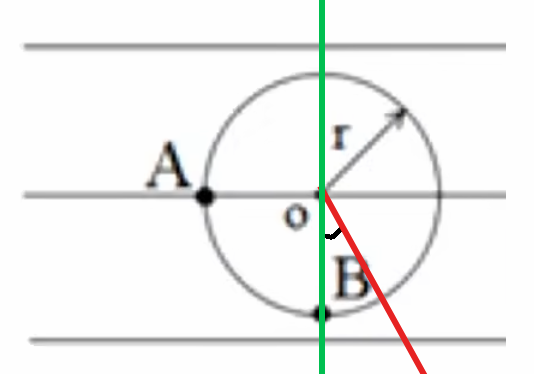

# 【物理】电场

## 前置知识

绝缘体：本质是物体内部电荷无法自由移动。

导体：本质是物体内部电荷可以自由移动。

电荷的移动：导体内部能够发生自由移动的电荷**只有负电荷**。

显电性：显示的电性，是内部的正负电荷中和之后的结果，不是一定带有几个单位的正电荷或负电荷。

## 相关概念

###  电荷和元电荷

正电荷与负电荷：

- 被**丝绸**摩擦过的玻璃棒**带正电**，丝绸带**负电**。
- 被**毛皮**摩擦过的橡胶棒**带负电**，毛皮带**正电**。

电荷：用字母 $Q$ 表示，单位是库仑，符号为 $\mathrm C$，是**标量**。

元电荷：一个质子或电子的带电量的大小，大小为 $\pu{1.6E-19 C}$。**所有物体的带电量都是元电荷的整数倍**。

比荷：荷质比，即 $\dfrac q m$。

性质：

- 同种电荷相互排斥，异种电荷相互吸引。
- 带电体可以吸附轻小物体。

### 起电的三种方式

#### 摩擦起电

条件：两物体都是**绝缘体**。

原因：不同物体对电子的束缚能力不同。

例如：被丝绸摩擦力过的玻璃棒带正电，是因为丝绸对于电子的束缚能力更强，玻璃棒对电子的束缚能力较弱，所以玻璃棒的负电子会转移到丝绸上，从而使得玻璃棒带正电，丝绸带正电。

#### 接触起电

条件：两物体都是**导体**。

概念：两个对电子吸引能力完全的导体，带电不同，碰撞后两物体带电相同。

计算：两物体接触后导体的带电量的多少可以通过「先中和后平分」计算，例如带电量 $+6$ 和 $-2$ 的两个相同小球，接触后二者带电量都为 $+2$。

#### 感应起电

条件：两物体都是导体。

现象：如下图所示，一个带有很多正电荷的小球 $C$，靠近导体棒，二者不发生接触。靠近后，发现在导体外表面，$A$ 端带有负电，$B$ 端带有与 $A$ 端等量的正电。

原因：不同种电荷相互吸引，小球 $C$ 将导体棒内的电子产生了吸引作用，使得导体棒 $A$ 端带负电，所以 $B$ 端减少了等量的电子，所以 $B$ 端带等量正电。即小球 $C$ 的吸引作用使得导体内部的电子重新分布。

#### 总结

起点的三种方式体现了**电荷守恒**，即电荷只能从一个物体转移到另一个物体，或者从一个物体的一个部分转移到另一个部分，但总量保持不变，电荷不可能凭空消失，也不可能凭空产生。

## 库仑定律

### 库仑力

将真空中两个静止点电荷之间的相互作用力叫做库仑力，用 $F_库$ 表示。

### 库仑定律

表达式：

$$
F_库 = k \dfrac{Q_1 Q_2}{r^2}
$$

其中 $Q_1$ 和 $Q_2$ 分别表示两个电荷的带电量，$r$ 表示两电荷间的距离。$k$ 是静电力常数，大小为 $\pu{9E9}$。通过表达式可知 $F_库 \propto \dfrac 1 {r^2}$。

适用范围：由于涉及到两电荷间的距离，所以该公式只适用于**点电荷**。所以当 $r \to 0$ 时，点电荷自身的体积无法忽略，不能使用库伦定律，但两个电荷之间的库仑力仍然存在。

> 对比记忆：
>
> 库仑力的表达式与万有引力的表达式 $F_万 = G \dfrac{Mm}{r^2}$ 很相似，在电学中，带电量 $Q$ 等价于力学中的质量 $m$，万有引力中的常数 $G$ 相当于这里的常数 $k$。
>
> 由于 $k \gg G$，所以在微观粒子中，库仑力 $\gg$ 万有引力。

## 电场与电场强度

### 电场

性质：真实存在，但看不见，摸不着。

特点：对于两个点电荷 $A,B$，$A$ 会激发出电场，作用在 $B$ 上 ，从而使得 $B$ 受到库仑力的作用。

试探电荷：试探是否受到电场力的带点离子，若受到电场力，则存在电场。

场源电荷：激发出电场的电荷。

### 电场强度

用 $E$ 表示电场强度，$F_电$ 表示电场力，$q$ 表示试探电荷的带电量，那么有：

$$
E = \dfrac{F_电}{q}
$$

这是电场强度 $E$ 的**比值定义**，即**计算式**，所以可以**计算**出电场强度，但不能**决定**电场强度。所以电场强度 $E$ 既不与 $F_电$ 有关，也不与 $q$ 有关，是电场本身的性质，为定值。

场强 $E$ 的方向与电场中**正电荷**所受电场力 $F_电$ 的方向相同。

> 类比记忆：场强相当于牛二力学中的重力加速度 $\mathrm g$。

## 电场线

### 基础知识

特点：

1. 实际上不存在。
2. 电场线不能相交。
3. 电场可以叠加。

作用：描述电场。主要可以描述电场的**方向**和电场**强弱**，其中电场线的**箭头方向**表示的是电场的方向，电场线的**疏密**表示的是电场的强度。

由于电场方向是正的试探电荷所受力的方向，所以电场线的箭头方向也是正的试探电荷所受力的方向。

### 四大电场

#### 点电荷

**正电荷**

方向：光芒四射。

强度：沿着电场线方向，电场强度越来越弱。

**负电荷**

方向：万箭穿心。

强度：同上。

#### 异种电荷

根据初中利用较多数量小磁针绘制磁感线的方法，我门可以利用同样的方法绘制出正负电荷形成电场的电场线。

等量的异种电荷形成的电场的电场线如下图所示：

特征：

- 电场线从正电荷出发，指向负电荷。（可类比磁感线 $N$ 出 $S$ 进）
- 电场线上某点所受合外力的方向是**电场线的切线方向**。

#### 同种电荷

同上可知等量的同种电荷形成的电场的电场线如下图所示：

特征：电场线上某点所受合外力的方向是**电场线的切线方向**。

#### 匀强电场

概念：电场强度处处相等的电场。

匀强电场的电场线是相互平行且等距的直线，如下图所示：

## 电场中的功能势

### 电势能

如下图所示，一个电荷量为 $q$ 的点电荷，在场强为 $E$ 的匀强电场中，从 $A$ 点沿直线运动到 $B$ 点，求在这个过程中，电场做了多少功？

求解：

在场强为 $E$ 的匀强电场中，无论点电荷在哪里，其所受到的电场力 $F_电$ 方向均竖直向下，且大小为 $F_电 = E \cdot q$，由于电荷量和场强始终不变，所以 $F_电$ 也始终不变。

设 $W_电$ 是电场力做的功，$A$ 到 $B$ 的竖直高度为 $H$。那么在这个过程中有：

$$
\begin{aligned}
W_电 & = F_电 \cdot x \cdot \cos \theta\\
& = E \cdot q \cdot H
\end{aligned}
$$

若点电荷的运动轨迹改为从 $A$ 到 $B$ 沿着图中 $a$ 曲线，可知电场力做功仍然不变。

联想到功与能中重力做功的相关知识，我们引入物理量**电势能** $E_{P~电}$，表示在点电荷运动过程中电场力做功消耗的能量，那么类比重力势能可知：

$$
W_电 = - E_{P~电}
$$

那么电场力做功与电势能的关系为：

- 电场力做正功，电势能减小。
- 电场力做负功，电势能增大。

### 电势

电势描述的是电场的「环境」，带有电荷的物体放入电场中，物体就有了能量，即电势能。不随着放入电场中电荷的电荷量的改变而改变。

电势用字母 $φ$ 表示，是**标量**。

计算式：

$$
φ = \dfrac{E_{P~电}}{q} = E\cdot H
$$

## 【模型】枕形导体

知识点：起点的三种方式。

模型：如图所示，不带电的枕形导体的 $A、B$ 两端各贴有一对金箔。

问题：

1. 让 $C$ 与 $A$ 接触，$A$ 端带什么电？$B$ 端带什么电？
2. 让 $C$ 与 $A$ 接触，再分开 $AB$，$A$ 端带什么电？$B$ 端带什么电？
3. 让 $C$ 靠近 $A$，$A$ 端带什么电？$B$ 端带什么电？
4. 让 $C$ 靠近 $A$，再移开 $C$，$A$ 端带什么电？$B$ 端带什么电？
5. 让 $C$ 靠近 $A$，分开 $AB$，$A$ 端带什么电？$B$ 端带什么电？
6. 让 $C$ 靠近 $A$，分开 $AB$，再移开 $C$，$A$ 端带什么电？$B$ 端带什么电？
7. 让 $C$ 靠近 $A$，并将 $B$ 端接地，$A$ 端带什么电？$B$ 端带什么电？
8. 让 $C$ 靠近 $A$，并将 $A$ 端接地，$A$ 端带什么电？$B$ 端带什么电？
9. 让 $C$ 靠近 $A$，用手触摸 $A$ 端再松开，移去 $C$，$A$ 端带什么电？$B$ 端带什么电？
10. 让 $C$ 靠近 $A$，用手触摸 $B$ 端再松开，移去 $C$，$A$ 端带什么电？$B$ 端带什么电？

求解：

对于第一问，属于接触起电，那么根据「先中和后平分」可知，$C$ 的正电荷会分一部分到枕形导体，所以 $AB$ 都带正电。

对于第二问，前面同上，分开后，$AB$ 仍然带正电。

对于第三问，属于感应起电，$C$ 端带正电，那么 $A$ 端会被感应出负电，$B$ 端被感应出等量正电。

对于第四问，$C$ 被移开后，感应起电的「感应源」不再存在，所以枕形导体不带电，$AB$ 端均不带电。

对于第五问，前面同第三问，分开后，$A$ 端仍然带负电，$B$ 端仍然带负电。

对于第六问，若 $AB$ 不分开，则枕形导体会内部中和从而整体不带电；分开后，$AB$ 两端无法中和，所以即便移开 $C$，两端电性仍然不变，即$A$ 端仍然带负电，$B$ 端仍然带负电。

对于第七问，接地后，$A$ 端由于 $C$ 端的感应起电，原来的负电荷会依然由于吸引处于 $A$ 端不变；$B$ 端由于带正电，根据「只有负电荷能发生移动」和「异种电荷相互吸引」，大地中的负电荷会进入 $B$ 端，使得 $B$ 端不带电。所以 $A$ 端带负电，$B$ 端不带电。

对于第八问，接地后，$A$ 端由于 $C$ 端的感应起电，原来的负电荷会依然由于吸引处于 $A$ 端不变；$B$ 端由于带正电，根据「只有负电荷能发生移动」和「异种电荷相互吸引」，大地中的负电荷会进入 $B$ 端，使得 $B$ 端不带电。所以 $A$ 端带负电，$B$ 端不带电。

> 注意：第八问中虽然 $A$ 端接地，但只要是对整个枕形导体接地，就能「作用于」整个导体，所以 $B$ 端依然可以与大地发生电荷的移动。所以第八问和第七问相同。
>
> 结论：只要接地，远离感应起电的一端**一定不带电**，靠近感应起电的一端电性与原来不变。

对于第九问，首先「用手触摸导体」和「使得导体接地」等价，那么用手触摸 $A$ 端后，$B$ 端不带电，$A$ 端带负电；移去 $C$ 后，导体内部发生中和，由于之前接地使得 $B$ 端不带电，所以中和后整体仍然带负电，所以 $A$ 端和 $B$ 端都带负电。

对于第十问，结论同第九问。

## 库仑定律相关题型

### 三点一线问题

#### 基本模型

如图，光滑平面上有三个带电小球 $A,B,C$，它们在平面上处于平衡状态。

1. 求每个小球带电的正负性。
2. 求每个小球带电量。
3. 求 $C$ 和 $A$ 在距离 $B$ 不同时，带电量的大小。

求解：

对于第一问，根据「同种电荷相互排斥，异种电荷相互吸引可知」，当且仅当 $A,C$ 带正电，$B$ 带负电，或 $A,C$ 带负电，$B$ 带正电时，三个小球才能保持平衡。即**带电正负**一定是「两同夹一异」。

对于第二问，以 $A,B,C$ 分别带正、负、正电为例，设 $C$ 对 $A$ 的作用力为 $F_C$，$B$ 对 $A$ 的作用力为 $F_B$，那么要使得 $A$ 平衡，则 $F_B = F_C$，又由于 $F = k \dfrac{Qq}{r^2}$，且 $r_{AC} > r_{AB}$，则 $Q_C > Q_B$；同理对 $C$ 分析可知 $Q_A > Q_B$，所以三者带电量的特点为「两大夹一小」。

对于第三问，对 $B$ 受力分析，则有 $F_A = F_C$，假设 $r_{AB} > r_{BC}$，根据库仑定律可知 $Q_A > Q_C$，所以问题中距离的特点是「近小远大」。

#### 例题

例 1：如下图所示，平面上有两个带电的小球 $B$ 和 $C$，带电量分别为 $+Q$ 和 $-4Q$，二者间距离为 $L$。现要在平面内再放一个小球 $A$，求小球 $A$ 放到哪里且带电量为多少时能够使得三个小球在平面内均保持平衡。

求解：

首先根据「两同夹一异」和「两大夹一小」可知，$A$ 只能放在 $B$ 的左边，且带负电。

设 $A$ 点带电量为 $q$，$A,B$ 间的距离为 $x$，那么对 $A$ 受力分析有：

$$
\begin{aligned}
& F_B = F_C\\
\implies & k \dfrac{Q q}{x^2} = k \dfrac{4Q q}{(L+x)^2}\\
\implies & x = L
\end{aligned}
$$

所以 $AB$ 间距离为 $L$，即需要将 $A$ 放到 $B$ 左边 $L$ 处。

再对 $B$ 受力分析有：

$$
\begin{aligned}
& F_A = F_C\\
\implies & k \dfrac{Qq}{L^2} = k \dfrac{4Q \cdot Q}{L^2}\\
\implies & q = 4 Q
\end{aligned}
$$

所以 $A$ 的带电量为 $-4Q$。

> 注意：在利用库仑定律 $F_库 = k \dfrac{Q_1 Q_2}{r^2}$ 计算时，这里的 $Q_1$ 和 $Q_2$ 只需要带入带电量的**大小**，例如这里 $C$ 的带电量为 $-4Q$，代入公式只需要代入 $4Q$，因为 $Q$ 是标量，这里的符号表示的是**正负**，而非方向。**一般情况下，当公式里涉及到力，所有的 $Q$ 都只带入大小，而不需要加上符号。除此之外，都需要带上符号**

---

例 2：如下图所示，平面上有三个质量相等且都为 $m$ 的带点小球 $A,B,C$，其中两两之间的距离为 $L$，$A,B$ 的带电量分别为 $+10q$ 和 $+q$，现给 $C$ 施加一个水平向右的外力 $F$，$A,B,C$ 三个小球以相同的加速度做匀加速直线运动，求 $C$ 的带电量和外力 $F$ 的大小。

求解：

考虑到三个小球以相同加速度做匀加速直线运动，那么考虑**整体法**。

设加速度为 $a$，$C$ 的带电量为 $Q$。那么对整体受力分析有：

$$
F = 3ma \quad (1)
$$

所以要求 $F$ 要先求出 $A$，那么再考虑隔离法。由于 $A,B$ 带电量已知且不受外力，考虑从 $A,B$ 入手分析。

对 $A$ 受力分析有：

$$
ma = k \dfrac{10qQ}{4L^2} - k \dfrac{10q^2}{L^2}\quad (2)
$$

对 $B$ 受力分析有：

$$
ma = k \dfrac{10q^2}{L^2} + k \dfrac{qQ}{L^2}\quad (3)
$$

联立 $(2)(3)$ 得：

$$
\begin{cases}
Q = \dfrac{40}{3} q\\
a = k \dfrac{70q^2}{3 m L^2}
\end{cases}
$$

将求得的 $a$ 代入 $(1)$ 可得：

$$
F = 3ma = k \dfrac{70q^2}{L^2}
$$

### 电场强度问题

注意事项：

1. 库仑定律只适用于**点电荷**，否则不能使用。
2. 库仑定律中的 $q_1$ 和 $q_2$ 只代入电荷量**大小**，**不代入符号**。（一般情况下，只要公式中出现了矢量，就不需要代入符号。）
3. 电场强度的定义式适用于**所有电场**。
4. 电场强度的定义式中，电荷量 $q$ 只需要代入电荷量**大小**，**不代入符号**。
5. 电场强度定义式中的 $q$ 指的是**试探电荷**的 $q$，而不是**场源电荷**。
6. 电场强度的**决定式**是 $E = k \dfrac{Q}{r^2}$，可由库仑定律代入电场强度定义式推导得出，只适用于**点电荷**。
7. 电场强度的**决定式**中的 $Q$ 指的是**场源电荷**的 $Q$。
8. 根据电场强度的**决定式**可知，越靠近场源电荷，电场强度越大。
9. 电场中，带正电荷的试探电荷的受力方向与电场（线）方向相同，反之相反。
10. $F-q$ 图象中，斜率表示的是电场强度 $E$，斜率越大电场强度越大。

### 等量异种 / 同种电荷总结

#### 通过电场线判断电场强度

方法：看电场线的疏密程度。

等量异种电荷：

如上图所示，从负电荷到正电荷的连线段上，电场强度先减小后增大。从正负电荷两点连线段的中垂线的中点到两头，电场强度逐渐减小。

等量同种电荷：

如上图所示，从负电荷到正电荷的连线段上，电场强度先减小后增大。从正负电荷两点连线段的中垂线的中点到两头，电场强度先增大后减小。

#### 未知电场线判断电场强度

考虑将一带有**正电荷的**试探电荷放入到电场中，然后对这个试探电荷进行受力分析，那么此时该试探电荷所受力的方向即为电场线方向。

等量异种电荷：

正负电荷两点连线上，试探电荷正负电荷的中间到靠近两边，由于 $F \propto \dfrac 1 {r^2}$，所以越靠近电荷，试探电荷所受的力增大的越明显，即此时电场强度越强。

中垂线上，从中间到两头，由于 $r$ 减小，所以试探电荷所受到的吸引力和排斥力越小；同时试探电荷所受到的排斥力和吸引力**夹角变大**，所以得到的合力也变小，即此时电场强度变小。

等量同种电荷：

两正电荷连线上，同理等量异种电荷，试探电荷靠近电荷时，所受库仑力会比在中间时更大，电场强度更强。

中垂线上，首先当试探电荷处于两点电荷中点时，根据受力分析可知此时所受力为 $0$ 即电场强度为 $0$；当试探电荷距离两正电荷无穷远，试探电荷仍然受力为 $0$，电场强度为 $0$。所以在中垂线上电场强度先增大后减小。

## 动态平衡

例 1：放在水平地面上的光滑绝缘圆筒内有两个带正电小球，$A$ 位于筒底靠在左侧壁处，$B$ 在右侧筒壁上受到 $A$ 的斥力作用下静止，如图所示。若 $A$ 的电量保持不变，$B$ 由于漏电而下降少许重新平衡，下列说法正确的是（）

A. $A$ 对筒底的压力变小

B. $B$ 对筒壁的压力变大

C. $A、B$ 间的库仑力变小

---

求解：

由题目可知属于「多物体动态平衡」问题，那么考虑多物体动态平衡的解决思路。

对 $A$ 受力分析有：

$$
\begin{cases}
F_X = N_A\\
F_地 = G_A + F_Y
\end{cases}
$$

对 $B$ 受力分析有：

$$
\begin{cases}
N_B = F_X\\
F_Y = G_B
\end{cases}
$$

然后由于 $B$ 受三个力，且 $N_B$ 和 $G_B$ 方向不变，$F$ 方向改变，那么反向延长 $N_B$，平移 $F$ 构成「动态三角形」，发现 $F$ 变大，$N_B$ 变大。那么 B 正确，C 错误。

由于 $N_A = F_X = N_B$，所以 $N_B$ 也变大，A 错误。

---

例 2：如图所示，两个带有同种电荷的小球，用绝缘体细绳悬挂于 $O$ 点，若 $q_1 > q_2$，$L_1 > L_2$，平衡时两球到过 $O$ 点的竖直线的距离相等，则 $m_1$ 与 $m_2$ 的关系是什么？

求解：

首先对 $A,B$ 分别受力分析，得到：

考虑反向延长 $T_1,T_2$，平移 $F$，可得到：

那么根据相似三角形可知：

$$
\dfrac{G_1}{OC} = \dfrac{F}{AC}\\
\dfrac{G_2}{OC} = \dfrac{F}{CB}
$$

所以 $G_1 = G_2$，那么 $m_1 = m_2$。

> 注意：如果题目中已知某些几何上的长度关系，且三个力围成的向量三角形可找到题目中有另一个三角形与之相似，那么可以使用「相似三角形」。

## 场强叠加

本质：电场力的合成。

求解方法：

1. 将场强叠加转化为力的合成，即某点场强为该点上正的试探电荷所受的电场力除以其电荷量。
2. 某点的场强为该点所受所有电场的场强的**矢量和**，那么可以先求出每个电场的场强，然后矢量相加计算。**注：每个电场的场强可以直接通过公式 $E = k \dfrac{Q}{r^2}$ 求解。**

> 注意：判断两点的场强是否相等，除了判断大小是否相等，还需要判断**方向是否相同**。

### 基础场强叠加

例 1：如图，真空中 $xoy$ 平面直角坐标系上的 $A,B,C$ 三点构成等边三角形，变成 $L = \pu{2.0 m}$。若将电荷量均为 $q = \pu{+2.0E-6 C}$ 的两点电荷分别固定在 $A,B$ 点，已知静电力常量 $k = \pu{9.0E9 N*m/C2}$，求 $C$ 点的电场强度的大小和方向。

求解：

给 $C$ 点放一正的试探电荷，设其电荷量为 $Q$，那么对 $C$ 受力分析可知其受到 $A,B$ 的排斥力，有：

$$
F = \sqrt 3 \cdot k \dfrac{qQ}{L^2}
$$

那么 $C$ 点的电场强度 $E$ 为：

$$
E = \dfrac F Q = \sqrt 3 \cdot k \dfrac{q}{L^2} = \dfrac{9 \sqrt 3}{2} \times 10^3\ \pu{N/C}
$$

> 求某点的电场强度，可以转化为该点正电荷所受到合力的大小，再除以正电荷的电荷量。

---

例 2：如图所示，点电荷 $A$ 和 $B$，分别带正电和负电，电荷量分别为 $4Q$ 和 $Q$，$A,B$ 两点的距离为 $L$。在 $A,B$ 连线上，电场强度为 $0$ 的地方在哪？并画出 $A,B$ 构成电场的电场线。

求解：

第一问有两种求解思路：

- 思路一——试探电荷法：考虑在平面上放一正的试探电荷，对其受力分析，则其受力平衡时电场强度为 $0$。发现当试探电荷位于 $B$ 的左侧时受力可为 $0$，所以电场强度为 $0$ 的地方一定在 $B$ 左侧。然后设试探电荷到 $B$ 的距离为 $x$，那么受力分析有 $F_B = F_A$，列式可求出 $x$，从而知道电场强度为 $0$ 的点的精确位置。具体计算不做赘述。
- 思路二——三点一线法：电场强度为 $0$，实际上等价于三点一线平衡，那么可以参考三点一线法求解。具体计算不做赘述。

关于第二问：

首先从 $A$ 到 $B$ 的连线上，显然电场线从 $A$ 指向 $B$；在 $A$ 的右侧，显然电场线指向右边。

对于 $B$ 左侧，电场线方向从 $B$ 开始应该是先向右后向左。可以通过试探电荷法分析。

> 一种极限法：当试探电荷在 $B$ 左侧，距离 $A,B$ 无限远，此时 $L$ 可以忽略不计，那么约等于 $A,B$ 到试探电荷的距离相同。那么由于 $A$ 的电荷量更大，所以 $A$ 对试探电荷的排斥力大于 $B$ 对它的吸引力，所以合外力方向向左，电场强度方向向左。

### 特殊场强叠加

#### 常见类型

**圆环**

一个金属圆环均匀带上正电荷，则金属圆环的内部，**只有圆心场强为 $0$**。

如下图，从圆环中点到无穷远处，起初电场强度为 $0$，距离圆环无穷远处电场强度也为 $0$。且从圆心开始移动，电场强度会增加。所以整体上**电场强度先增大后减小。**

**圆球**

一个空心的表面均匀带电的圆球，有以下两个结论：

- **圆球外部场强**可以看成一个球心处放一点电荷，其带电量为圆球上所有电荷之和。
- **圆球内部场强**圆球内部处处为 $0$。

> 误区——球体和球体的区别：
>
> - 二者外部场强都可以看成点电荷。
> - 但内部场强，球壳内部处处为 $0$，球体内部只有中心为 $0$，其余不为 $0$。

**金属板**

一金属板接地，旁边有一正的点电荷。那么其电场等价于**等量异种电荷**的电场。

原因：首先正电荷相当于场源电荷，那么会在周围产生电场，从而导致金属板靠近正电荷的一侧感应出负电荷。所以二者产生的场强是点电荷和金属板一侧的负电荷共同产生的，即等量异种电荷产生的电场线，如下图所示。

设右侧正电荷距离金属板为 $L$，那么此时相当于距离金属板左侧 $L$ 处有一负的点电荷，与右侧正点电荷形成的等量异种电荷的电场。

**非点电荷电场**

若题目给定的电场是**不能看成点电荷**的物质产生的电场（例如不规则图形），那么一般要用到**对称**。

**多点电荷电场**

若题目给定的电场是**很多**点电荷产生的电场。假设有 $n$ 个点电荷，那么可以将其中 $n-1$ 个点电荷看成一个整体，再考虑跟另一个点电荷的关系，从而求解。

#### 金属板场强叠加

例：$y$ 轴上放置着一块不带电的无限大接地金属板，现在 $x$ 轴上的 $(L,0)$ 点放一电量为 $q$ 的正点电荷，它们之间的电场线分布如图甲所示。两个相距为 $2L$ 的电量均为 $q$ 的等量异种点电荷之间的电场线分别分布如图乙所示。某同学警告探究之后发现图甲所示的电场线分布与图乙中虚线（两点电荷连线的中垂线）右侧的电场线分布相同，则 $P(2L,0)$ 点的电场强度的大小是多少？

求解：

由于图甲种电场线分布与图乙相同，那么可以对图乙中和 $P$ 点等价的位置进行分析，有：

$$
E = k \dfrac{q}{L^2} - k \dfrac{q}{9L^2} = k \dfrac{8q}{9L^2}
$$

> 推论：
>
> 如下图所示，在水平接地的金属板上，放置一个带正电的电荷量为 $q$ 的小球 $A$，质量为 $m$，同时竖直向上距离它 $L$ 的地方也有一个带电量为 $q$ 的小球 $B$，求金属板对 $A$ 的支持力。
>
> 
>
> 求解：由于此时相当于距离金属板下方 $L$ 处有一负的点电荷，与右侧正点电荷形成的等量异种电荷的电场。
>
> 那么对于 $A$ 受力分析可知：
>
> $$
> F_N = G + F_正 + F_负 = m \mathrm g + k \dfrac{q^2}{r^2} + k \dfrac{q^2}{r^2}
> $$

#### 非点电荷电场

题目特征：形成电场的电荷不是点电荷，也不是学过的常见模型中的电荷（例如圆环、圆球等），没有直接能求出场强的公式。

思路：利用对称性，将所求的场强转化为其它能够求出或已知的场强。

**例题**

例 1：如图，一半径为 $R$ 的圆盘上均匀分布着电荷量为 $Q$ 的电荷，在垂直于圆盘且过圆心 $c$ 的轴线上又 $a,b,c,d$ 四个点，$a$ 和 $b$、$b$ 和 $c$、$c$ 和 $d$ 之间的距离均为 $R$，在 $a$ 点处有一电荷量为 $q(q > 0)$ 的固定点电荷。已知 $b$ 点处的场强为零，则 $d$ 点处场强的大小是多少？（$k$ 为静电力常数）

求解：

由题意可知 $d$ 点的场强由 $a$ 点电荷产生的场强和圆盘产生的场强叠加而成，前者可以直接利用库仑定律计算，后者无法直接计算，考虑「对称转换」。

发现 $b,d$ 关于圆盘对称，那么圆盘对 $b$ 点的场强和圆盘对 $d$ 点的场强大小相同，方向相反，那么考虑先求出圆盘对 $b$ 点的场强然后转换。

对 $b$ 点分析，那么有：

$$
\begin{aligned}
& E_{a \to b} = E_{圆盘}\\
\implies & k \dfrac{q}{R^2} = E_{圆盘}
\end{aligned}
$$

且圆盘对 $b$ 点场强方向水平向左。

那么对 $d$ 点分析有：

$$
E_d = E_{a\to d} + E_{圆盘} = k \dfrac{q}{9R^2} + k \dfrac{q}{R^2} = k \dfrac{10q}{9R^2}
$$

---

例 2：均匀带电的球壳在球外空间产生的电场等效于电荷集中于球心处产生的电场。如图所示，在半球面 $AB$ 上均匀分布正电荷，总电荷量为 $q$，球面半径为 $R$，$CD$ 为通过半球顶点于球心 $O$ 的轴线，在轴线上有 $M、N$ 两点，$OM = ON = 2R$。已知 $M$ 点的场强大小为 $E$，则 $N$ 点的场强大小为多少？（$k$ 为静电力常数）

求解：

题目求 $N$ 点的场强，实际上求的是左半球壳对 $N$ 点的场强。那么根据对称性可知，**左半**球壳对 $N$ 点的场强就等于**右半**球壳对 $M$ 点的场强。所以只需要求出右半球壳对 $M$ 点的场强即可。

那么考虑根据对称性将球壳补全。补全后，根据「均匀带电的球壳在球外空间产生的电场等效于电荷集中于球心处产生的电场」，对 $M$ 点分析有：

$$
\begin{aligned}
& E_{球 \to M} = E_{O\to M} = k \dfrac{2q}{4R^2} = k \dfrac{q}{2R^2} = E_{左 \to M} + E_{右 \to M} = E + E_{右 \to M}\\
\implies & E_N = E_{左\to M} =  E_{右 \to M} = k \dfrac{q}{2R^2} -E
\end{aligned}
$$

#### 多点电荷电场

题目特征：求多个点电荷构成的电场的电场强度。点电荷数量很多一般不能用库仑定律和普通的场强叠加求解。

思路：假设有 $n$ 个点电荷，那么可以选择一个「特殊点电荷」，将除了「特殊点电荷」剩下 $n-1$ 个点电荷看成一个整体，再根据 $E = E_1 + E_{n - 1}$ 求解。例如，若 $16$ 个点电荷产生的电场强度为 $0$，那么可以将其看成其中一个点电荷产生的电场和剩下十五个整体产生的总场强平衡得到的结果，从而可以计算出这十五个点电荷整体产生的总场强。

**例题**

例 1：$N(N > 1)$ 个电荷量均为 $q(q > 0)$ 的小球，均匀分布在半径为 $R$ 的圆周上，示意如图，若移去位于圆周上 $P$ 点的一个小球，则圆心 $O$ 点处的电场强度大小为多少？方向是什么？（已知静电力常数为 $k$）

求解：

题目求的是除去 $P$ 点的小球后的电场强度，那么考虑将所有的小球分为 $P$ 点的小球和其它位置的小球整体。

那么原来 $N$ 个小球均匀分布在圆周上时，属于圆环模型，此时 $O$ 点场强 $E = 0$。所以 $P$ 点小球对 $O$ 点的场强和其它所有对 $O$ 点场强大小相等方向相反。那么对 $O$ 点分析有：

$$
\begin{aligned}
& E = E_P + E_{N - 1}\\
\implies & 0 = k \dfrac q{R^2} + E_{N - 1}\\
\implies & E_{N - 1} = - k \dfrac{q}{R^2}
\end{aligned}
$$

即除去 $P$ 点小球后，$O$ 点所受电场强度方向水平向右，大小为 $k \dfrac{q}{R^2}$。

---

例 2：如图所示，$A,B,C,D,E$ 是半径为 $r$ 的圆周上等间距的五个点，在这些点上各固定一个点电荷，除 $A$ 点处的电量为 $- q$ 外，其余各点处的电量均为 $+q$，则圆心 $O$ 处的场强大小是多少？方向是什么？（静电力常数为 $k$）

求解：

考虑若 $A$ 点的电量也为 $+q$，则 $O$ 点的场强大小 $E = 0$，此时有：

$$
\begin{aligned}
& E = E_A + E_{其它}\\
\implies & 0 = k \dfrac{q}{r^2} + E_{其它}\\
\implies & E_{其它} = - k \dfrac{q}{r^2}
\end{aligned}
$$

即其它四个点整体对于 $O$ 点场强方向竖直向上，大小为 $k \dfrac{q}{r^2}$。

那么将 $A$ 点变为负电荷，电量不变后，分析可知其对于 $O$ 点的场强与原来大小相等方向相反，所以圆心 $O$ 处有：

$$
E' = k \dfrac{2q}{r^2}
$$

且此时方向沿着 $OA$ 方向。

> 总结：
>
> - 此题中，为了求 $A$ 点为负电荷时的场强，通过将未知转为已知，转化为 $A$ 点为正电荷时的场强，因为 $A$ 点为正电荷时场强可以直接根据圆环模型性质得出。启示我们做题时要擅长联系学过的模型，将未知转化为已知。
> - 多点电荷场强的叠加问题中，选用的「特殊点电荷」往往题目中会有隐含的信息，例如例 1 中就是除去的那个点电荷，例 2 中是唯一电性相反的点电荷。

## 电势

### 电势的规律

> 注：默认无穷远处电势为 $0$。

#### 规律一

**沿着电场线，电势降低。**

原因：

比较电势的大小，根据 $φ = \dfrac{E_p}{q}$，实际上就是比较电势能 $E_p$ 的大小，也就是比较电场力做功的大小。

利用正电荷推理：

如下图所示，一正电荷从 $A$ 到 $B$ 沿着电场力的方向，根据 $W = F\cdot x$ 可知，电场力 $F$ 和位移方向 $x$ 相同，那么从 $A$ 到 $B$ 电场力做正功，所以电势能减小，又由于 $q$ 不变，**且 $q$ 为正**，所以 $φ$ 减小。

利用负电荷推理：

如下图所示，一负电荷从 $A$ 到 $B$ 沿着电场力的方向，根据 $W = F\cdot x$ 可知，电场力 $F$ 和位移方向 $x$ 相反，那么从 $A$ 到 $B$ 电场力做负功，所以电势能增大，又由于 $q$ 不变，**且 $q$ 为负**，所以 $φ$ 减小。

> 注意：这里推电势的变化时，**需要考虑 $q$ 的正负**，即 $q$ 必须带符号运算，因为 **$φ = \dfrac{E_p}{q}$ 是标量式，而非矢量式**。

#### 规律二

**电场同一位置，正负电子的电势能不同，电势相同。**

由于电势表示的是电场的「环境」，不随着放入电荷的改变而改变，所以电厂同一位置电势相同。由于 $E_P = φ \cdot q$，而正负电子的电荷量 $q$ 不同，所以电势能不同。

#### 推论

**正电荷周围，电势 $φ$ 为正；负电荷周围，电势 $φ$ 负。**

**越靠近正电荷，电势越大；越靠近正电荷，电势越小。**

原因：

正电荷产生的电场线，从正电荷向外，由于无穷远处电势为 $0$，从无穷远处到正电荷所在的地方，是逆着电场线方向，所以电势增加，即电势为正。

负电荷产生的电场线指向负电荷，由于无穷远处电势为 $0$，从无穷远处到正电荷所在的地方，是沿着电场线方向，所以电势降低，即电势为负。

### 电势的比较大小

等量异种电荷电场：

如上图所示，越靠近正电荷电势越大，所以从负电荷到正电荷两点连线上**电势增大**；由于正负电荷两点的中垂线上，没有沿着电场线运动，所以**电势不变**，且由于中垂线上距离正负电荷距离相等，那么正负电荷产生的电势相互抵消，所以**中垂线上电势为 $0$**。

等量同种电荷电场：

由于从一个正电荷到另一个正电荷的连线上，先远离第一个正电荷，再靠近第二个正电荷，所以电势**先减小后增大**；在中垂线上，从中点往两边走，距离正电荷越来越远，所以**电势逐渐减小**。

> 一般情况下，若题目涉及到**电场强度、受力、加速度等力学相关的问题**，则一般是要求**电场强度**，再转化为其它物理量：若题目涉及**电势、电势能、做功正负等能量相关的问题**，则一般是要求**电势**，再转化为其它物理量。

### 电势差

两个不同电势的位置，电势之间的差值叫做电势差，字母用 $U$ 来表示（相当于初中的电压），单位是伏特，用字母 $\pu V$ 表示。

表达式：

$$
U_{ab} = φ_a - φ_b
$$

> 注意：高中一般的变化物理量都是**末 - 初**，而电势差是**初 - 末**。

### 等势面

#### 基本知识

概念：所有电势相等的点构成的面称为等势面。

特点：

1. 电场线和等势面**总是垂直**。
2. 沿着等势面移动电荷，电场力**不做功**。
3. 等差等势面越密，电场强度**越大**。

> 等差等势面指的是相邻两个等势面之间的电势差相等，第三个特点可以理解为靠近场源电荷的等差等势面越密集，电场强度越大。

#### 几种常见的等势面

点电荷的等势面：

如上图所示，距离负电荷相等的点构成等势面，所以等势面是多个圆（圆上各点距离负电荷相同）。

匀强电场的等势面：

即匀强电场等势线垂直于电场方向。

学会根据等势面画出电场线：

根据**等势面垂直于电场线**，等势面应该如上图所示。

等量同种 / 异种电荷的等势面：

上方是等量同种电荷的等势面，下方是等量异种电荷的等势面，可类比等高线理解。

二者区别：等量异种电荷的两电荷连线中垂线是一条等势线。可用此来区分等量同种电荷和异种电荷的等势面。

### 例题

例 1：位于 $A、B$ 处的两个带有不等量负电的点电荷在平面内电势分布如图所示，图中实线表示等势线，则（）

A. $a$ 点和 $b$ 点的电场强度相同

B. 正电荷从 $c$ 点移到 $d$ 点，电场力做正功

C. 负电荷从 $a$ 点移到 $c$ 点

D. 正电荷从 $c$ 点沿图中虚线移到 $f$ 点，电势能先减小后增大

---

求解：

选项 A：在 $a,b$ 两点分别放一正的试探电荷，对他们分别进行受力分析，可知两电荷所受合力方向不同，所以电场强度不同。A 错误。

选项 B：正电荷从 $c$ 点移到 $d$ 点，远离负电荷，所以电势增大，由于是正电荷，所以电势能增大，那么电场力做负功。B 错误。

选项 C：负电荷从 $a$ 点移到 $c$ 点，远离负电荷，所以电势增大，由于是负电荷，所以电势能减小，那么电场力做负功。C 正确。

选项 D：正电荷从 $c$ 到 $f$，是先靠近负电荷再远离正电荷，电势先减小后增大，由于是正电荷，所以电势能先减小后增大。D 正确。

故选 CD。

---

例 2：如图为某静电场中一区域内的等势线，相邻等势线的电势差相等。某时刻一带电量为 $+q$ 的粒子经过 $a$ 点（速度方向如图所示），此后的一小段时间内粒子做减速运动。不计粒子重力，$a、b$ 两点的电场强度大小为 $E_a$ 和 $E_b$，电势分别为 $φ_a$ 和 $φ_b$，求 $E_a$ 和 $E_b$，$φ_a$ 和 $φ_b$ 的大小关系。

求解：

首先由于 $a$ 点电场线比 $b$ 点稀疏，所以电场强度 $E_a < E_b$。

由于粒子做减速运动，所以动能减少，根据能量守恒电视能增加，又由于是正电荷，所以电势增加，所以 $φ_a < φ_b$。

---

例 3：如图所示，在两等量异种点电荷的电场中，$MN$ 为两电荷连线的中垂线，$a、b、c$ 三点所在直线平行于两电荷的连线，且 $a$ 与 $c$ 关于 $MN$ 对称，$b$ 点位于 $MN$ 上，$d$ 点位于两电荷的连线上。以下判断正确的是（）

A. $b$ 点场强大于 $d$ 点场强

B. $b$ 点场强小于 $d$ 点场强

C. $a、b$ 两点的电势差等于 $b、c$ 两点间的电势差

D. 试探电荷 $+q$ 在 $a$ 点的电势能小于在 $c$ 点的电势能

---

求解：

选项 AB：设正负电荷连线与 $MN$ 的交点为 $o$，那么放试探电荷进行受力分析可知，$E_d > E_o$，在 $MN$ 中垂线上，$E_o > E_b$，所以 $E_d > E_b$。A 错误，B 正确。

选项 C：由于 $a,c$ 距离 $MN$ 左右对称，所以在该等量异种电荷场强中，$a$ 和 $b$ 的电势互为相反数，由于 $b$ 在中垂线 $MN$ 上，所以 $b$ 点电势为 $0$。C 正确。

选项 D：由于 $a$ 比 $c$ 更靠近正电荷，所以 $a$ 点电势大于 $c$ 点，试探电荷为正，所以在 $a$ 点电势能大于 $c$ 点。D 错误。

### 两个重要公式

#### 公式一

$$
W_{A \to B} = U_{AB}q
$$

推导：

$$
\begin{aligned}
W_{A \to B} & = - \Delta E_p\\
& = - (E_{pB} - E_{pA})\\
& = E_{pA} - E_{pB}\\
& = φ_A \cdot q - φ_B \cdot q\\
& = (φ_A - φ_B)\cdot q\\
& = U_{AB} \cdot q
\end{aligned}
$$

> 注意：这里的 $q$ 需要带上符号计算，因为公式中不含矢量，是**标量式**。

#### 公式二

> 注意：此公式适用于**匀强电场**。

$$
E = \dfrac{U}{d}
$$

推导：

$$
\begin{aligned}
& W_{A \to B} = F\cdot x \cdot \cos \theta\\
\implies & U_{A\to B}\cdot q = E \cdot q \cdot x \cdot \cos \theta\\
\implies & E = \dfrac{U}{x\cdot \cos \theta} = \dfrac{U}{d}
\end{aligned}
$$

> 注意：这里的 $d$ 指的是**沿着电场线方向的位移**。

> 可以通过此大致理解「等差等势面越密，电场强度越大」：
>
> 等差等势面说明 $U$ 相同，那么等势面越密，说明 $d$ 越小，所以 $E$ 越大。

#### 例题

例 1：一个带负电的质点，带电量为 $\pu{2.0E-9 C}$，在电场中将它由 $a$ 点移到 $b$ 点，除了电场力之外，其它力做功 $\pu{6.0E-5 J}$，质点的动能增加了 $\pu{8.0E-5 J}$，则 $a、b$ 两点间的电势差 $φ_A - φ_B$ 是多少？

求解：

根据 $W = \Delta E_k$ 可知 $W_电 = \pu{2.0E-5 J}$。

然后根据 $W = U_{AB} q$ 可知：

$$
φ_A - φ_B = \dfrac W q = \dfrac{\pu{2.0E-5}}{-\pu{2.0E-9}} = \pu{-10000 V}
$$

> 注意：质点带**负电**，这里的负号需要代入公式计算。

---

例 2：有一个电量 $q = - \pu{3E-6 C}$ 的点电荷，从某电场中的 $A$ 点移动到 $B$ 点，电荷克服电场力做了 $\pu{6E-4 J}$，从 $B$ 点到 $C$ 点，电场力对电荷做了 $\pu{9E-4 J}$ 的功，设 $B$ 为零电势，求：$A、C$ 两点的电势 $φ_a$ 和 $φ_c$ 各为多少？

求解：

由题意可得：

$$
U_{AB} = \dfrac{- \pu{6E-4}}{- \pu{3E-6}} = \pu{200 V}\\
U_{BC} = \dfrac{- \pu{9E-4}}{- \pu{3E-6}} = \pu{-300V}
$$

由于 $φ_B = 0$，所以 $φ_a = \pu{200 V}$，$φ_c = \pu{300 V}$。

> 注意：
>
> - 从 $A$ 到 $B$ **克服**电场力做功 $\pu{6E-4 J}$，则电场力做功为 $ \pu{-6E-4 J}$。
> - 若题目中告诉「$B$ 点接地」，也可以说明 $B$ 为零电势。

> 总结：
>
> 一般而言，求电势有两种思路：
>
> - 使用公式 $U_{ab} = φ_a - φ_b$。此时一般可以通过公式 $W = U_{ab} q$ 求出 $U_{ab}$，即一般涉及**做功**的题目用此类思路求解。
> - 使用公式 $φ = \dfrac{E_p}{q}$。一般涉及到**能量**的题目用此类思路求解。

---

例 3：带有等量异种电荷、相距 $\pu{10 cm}$ 的平行板 $A$ 和 $B$ 之间有一个匀强电场，电场强度 $E = \pu{2.0E4 N/C}$，方向向下。电场中 $C$ 点距离 $B$ 板 $\pu{3 cm}$，$D$ 点距离 $A$ 板 $\pu{2 cm}$，则 $C、D$ 两点的电势差 $U_{CD}$ 为多少？

求解：

由于 $BC = \pu{3 cm},AD = \pu{2 cm}$，所以 $CD = \pu{5 cm}$，那么有

$$
U_{CD} = E \cdot d_{CD} = 2 \times 10^4 \cdot(- 5 \times 10^{-2}) = -1000\ \pu V
$$

> 注意：$d_{CD}$ 是 $\pu{-5E-2 m}$ 而不是 $\pu{5E-2 m}$，因为 $C$ 到 $D$ 逆着电场线方向，即 $CD$ 的位移和电场方向夹角为 $\pu{180^\circ}$。可以通过**提前判断二者电势的大小判断正负**，例如此题中由于 $D$ 到 $C$ 沿着电场线，所以 $φ_C < φ_D$，小 - 大一定为负。

## 电场公式总结

## 多边形中的电势与场强问题

### 重要推论

匀强电场中等势面的特点：等间距之间的等势面，电势差相等。

匀强电场中的重要推论：

1. 一条边上，电压与长度成比例。可根据 $E = \dfrac U d$ 推得。如下图，$L_1:L_2 = 1:2$，所以前两点之间的电势差与后两者之间的电势差之比也是 $1:2$。

   
2. 两平行边，电压与长度成比例。如下图，$AB \parallel CD$，则 $\dfrac{AB}{CD} = \dfrac{U_{AB}}{U_{CD}}$。可以将 $AB$ 平移使得 $A$ 与 $C$ 重合，然后利用推论 $1$ 推出。

   
3. 非匀强电场，无法具体计算，但可比较大小。如下图，$A,B,C,D$ 四个点在一正电荷形成的电场中，$AB = BC$，$φ_A = \pu{10 V}$，$\varphi_C = \pu{8 V}$，比较 $\varphi_B$ 与 $\pu{9 V}$ 的大小关系。

   

   根据 $E = \dfrac{U}{d}$，由于 $AB = BC$，所以 $E$ 越大，电势差 $U$ 越大，那么由于正电荷附近，距离正电荷越近场强 $E$ 越大，所以 $U_{AB} > U_{BC}$，即 $\varphi_A - \varphi_B > \varphi_B - \varphi_C$，代值可得到 $\varphi_B < \pu{9 V}$。

作用：已知平面内某几个点的电势，求平面内另一个点的电势（或判断其大小）。

### 找等势面

通过推论我们可以计算出多边形中某点的电势，但无法求出电场强度 $E$，原因是**公式 $E = \dfrac U d$ 中的 $d$ 是沿着电场线方向的位移**，而一般题目给定的只是两点之间的间距，**不一定是沿着电场线方向的位移**。那么我们需要找等势面求解。

适用范围：已知匀强电场所在平面内某几个点的电势，要求电场强度。

方法：找到两个不同点，但 $φ$ 相同，连接两点构成等势面，此时 $d$ 的方向**垂直于等势面**。

示例：如图所示，圆心为 $O$ 半径为 $R = \pu{0.2 m}$ 的圆所在平面内有匀强电场，$a、b、c、d$ 是圆上的四个等分点，已知 $b、c、d$ 三点电势分别为 $φ_b = \pu{0 V}$，$φ_c = \pu{6 V}$，$φ_d = \pu{12 V}$，则 $a$ 点电势是多少？该电场强度 $E$ 是多少，方向由 $O$ 点指向图中的哪个点？

求解：

首先根据上面的推论 $2$ 可知 $φ_a = \pu{6 V}$。

发现 $a,c$ 两点电势相等，那么两点连线即为等势面，所以场强的方向垂直于等势面，即 $b,d$ 连线。再根据沿着电场线电势降低，可知电场方向从 $O$ 指向 $b$。

所以电场强度 $E$ 为：

$$
E = \dfrac{U_{bd}}{bd} = \pu{30 V/m}
$$

> 若题目中没有给出现成的两个电势相同的点，可以利用下面例子的方法画出等势面和电场线。
>
> 例：如下图所示，$A,B,C,D,E,F$ 为匀强电场中一个正六边形的六个顶点，$A,B,C$ 三点的电势分别为 $\pu{1 V}、\pu{2 V}、\pu{5 V}$。则 $D,E,F$ 三点的电势是多少，在图中画出一个等势面和等势线。
>
> 
>
> 求解：
>
> 首先根据上述的三个推论可得到 $\varphi_D = \pu{7 V},\varphi_E = \pu{6 V},\varphi_F = \pu{3 V}$。
>
> 然后选择合适的三个点，这里选择 $A,C,F$，将三个点中电势最大的点和最小的点连接，即连接 $AC$，然后再根据「一条边上，电压与长度成比例」可知，电压等于 $\varphi_F$ 的点，恰好是 $AC$ 中点，那么取 $AC$ 中点 $O$，连接 $OF$，则 $OF$ 即为一个等势面，那么与之垂直的直线即为电场线，如下图所示。
>
> 
>
> 在具体题目中，找合适的三个点要根据题目情况而定，一般选择最低点和最高点在同一水平直线或竖直直线上可能会相对更容易计算。

## 轨迹问题

轨迹问题中的三线：电场线、等势线、轨迹线。

三线关系：

1. 电场线与等势线一定垂直。
2. 电场线和等势线的疏密都能反应场强 $E$。同时根据电场中的公式，已知场强后，也可以推出电场力 $F_电$，从而推出加速度 $a$。电场线越密集，场强越大，电场力越大，加速度也越大。
3. 当且仅当电场线是**直线**，且**初速度 $v_0$ 方向与 $F$ 的方向相同**时，轨迹线与电场线重合。证明：反证法，若电场线不是直线，且轨迹线与电场线重合那么当一点电荷从一点释放，此时所受到的电场力方向和速度方向都与电场线（轨迹线）相切，那么点电荷会做直线运动，与轨迹线不是直线矛盾。

> 一般可能会给定其中的两个，也有可能给定三个。

解题思路：

1. 画出某点的受力方向：如果给定电场线，则是该点的**切线方向**；如果给定等势线，则是该点的**垂线方向**。再通过力指向**轨迹线的凹侧**（曲线运动知识），就可以画出受力方向。画出某点的速度方向：即画出轨迹的切线。从而根据力（加速度）与速度的夹角判断做**加速还是减速运动**。
2. 判断动能变化：通过加速还是减速判断动能变化。
3. 判断电势能变化：通过动能变化和能量守恒判断电势能变化。

> 根据上述，我们只需要判断题目给的是三线中的哪些，即可求出场强、电场力和速度等。

> 注意：
>
> - 如果是点电荷形成的电场，则直接连接点电荷与该点，然后根据轨迹线凹侧判断力的方向即可。
> - 如果遇到点电荷形成的电场，某个物理量的变化可能不是单一的增大或减小，有可能是**先增大后减小**或**先减小后增大**。
> - 在点电荷形成电场的题目，经常可以利用「同一电荷在等势面上电势能相同」根据**对称性**来做题。
>
> 例：如图所示，在点电荷 $Q$ 形成的电场中，带电粒子 $q$ 仅受电场力作用，运动轨迹为 $MEGFN$ 曲线，其中 $G$ 点与等势面 $a$ 相切，$E、F$ 两点在等势面 $b$ 上，$M、N$ 两点在等势面 $c$ 上。
>
> 
>
> 分析：
>
> 首先对 $M$ 点，连接其与点电荷，根据力指向轨迹线凹侧可知受力方向为 $MO$ 方向，速度方向相切于轨迹线，那么从 $M$ 到 $G$ 力的方向与速度方向为锐角，做加速运动，同理可分析知从 $G$ 到 $N$ 做减速运动，所以在从 $M$ 运动到 $N$ 的过程中速度先增大后减小，那么电势能先减小后增大。
>
> 同时由于 $M,N$ 在同一等势面上，所以 $\varphi_M = \varphi_N$，所以 $E_{pM} = E_{pN}$，根据能量守恒可知 $E_{kM} = E_{kN}$，对于 $E,F$ 点有同样的结论，可以根据该对称性做题。

物理量分类：

- 一级物理量：只知道三线即可判断，不需要知道题目中的其他条件。有电场力 $F$、速度大小 $v$、加速度大小 $a$，电场强度 $E$、动能 $E_k$ 和电势能 $E_p$。
- 二级物理量：必须知道题目中的其他条件才能判断。有带电量的正负 $q$，电场线方向，$φ$ 大小，这三个物理量必须知道其中一个，才能求出来另外两个，即「知一求二」。

例题：如图，实线表示某电场的电场线（方向未标出），虚线是一带负电的粒子只在电场力作用下的运动轨迹，设 $M$ 点和 $N$ 点的电势分别为 $\varphi_M$、$\varphi_N$，粒子在 $M$ 点和 $N$ 点时的加速度大小分别为 $a_M$、$a_N$，速度大小分别为 $v_M$、$v_N$，电势能分别为 $E_{pM}$、$E_{pN}$。请比较这些物理量的大小关系。

求解：

取 $MN$ 与电场线交点 $O$，由于实线表示电场线，所以 $O$ 点所受力相切于电场线，且指向虚线（轨迹线）凹侧，同时速度方向相切于 $MN$，如下：

那么从 $N$ 到 $M$，力和速度方向夹角为锐角，所以做加速运动，所以 $v_M > v_N$，所以 $E_{kM} > E_{k N}$，根据能量守恒可知 $E_{pM} < E_{p N}$。

根据电场线疏密可知 $E_M < E_N$，那么 $F_M < F_N$，所以 $a_M < a_N$。

再根据粒子带负电，那么因为 $E_{pM} < E_{pN}$，所以 $\varphi_M > \varphi_N$，且电场线方向与力的方向相反。

## 图像问题

解决方法：画电场线。

### $E-x$ 图象

在 $E-x$ 图像中，若图象在 $x$ 轴上方，表示 $E$ 为正，反之 $E$ 为负。

那么用 $x$ 轴正方向表示电场为正，可以画出电场线的大致方向，例如：

上图中 $x$ 轴右边 $E$ 在 $x$ 轴上方，所以为正，$x$ 左边为负。

结论：根据 $U = Ed$ 可知，$E-x$ 图象中的面积表示电势差的绝对值，即 $S = \varphi_2 - \varphi_1$。

### $\varphi - x$ 图象

画线依据：顺着电场线电势逐渐减小。

例如：下图中，从 $O$ 到 $2L$ 处，电势一直在减小，所以从 $O$ 到 $2L$ 沿着电场线方向。

结论：在 $\varphi-x$ 图象中，斜率代表了场强的**大小**。

### 例题

两电荷量分别为 $q_1$ 和 $q_2$ 的点电荷固定在 $x$ 轴上的 $A、B$ 两点，两电荷连线上各点电势 $\varphi$ 随着坐标 $x$ 变化的关系图象如图所示，其中 $P$ 点电势最高，且 $x_{AP} < x_{PB}$，则（）

A. $q_1$ 和 $q_2$ 都是正电荷

B. $q_1$ 的电荷量大于 $q_2$ 的电荷量

C. 在 $A、B$ 之间将一负点电荷沿着 $x$ 轴从 $P$ 点左侧移到右侧，电势能先减小后增大

D. 一点电荷只在电场力作用下沿 $x$ 轴从$P$ 点运动到 $B$ 点，加速度逐渐变小

---

求解：

首先画出电场线方向：

那么只有 $q_1$ 和 $q_2$ 都是负电荷时，才能形成如上电场线。A 错误。

由于 $P$ 点电势最高，所以 $P$ 点所在的斜率为 $0$，那么此时场强 $E = 0$。在 $P$ 点放试探电荷，则说明其所受合外力 $F = 0$，那么 $A$ 对该试探电荷的电场力和 $B$ 对它的电场力大小相等方向相反。设试探电荷的电荷量为 $q$，则：

$$
k \dfrac{qq_1}{{r_1}^2} = k \dfrac{q q_2}{{r_2}^2}
$$

由于 $AP < PB$，即 $r_1 < r_2$，所以 $q_1 < q_2$。B 错误。

> B 也可以用三点一线中的「近小远大」判断。

若在 $A、B$ 之间将一负点电荷沿着 $x$ 轴从 $P$ 点左侧移动到右侧时，电势先增大后减小，由于是**负电荷**，所以电势能先减小后增大。C 正确。

一点电荷只在电场力作用下沿着 $x$ 轴从 $P$ 点运动到 $B$ 点时，由于在图像上斜率增大，所以场强增大，所以所受电场力 $F$ 增大， 那么加速度增大。D 错误。

## 电容器

### 电容器的概念

电容器由**两块金属板**加上**绝缘介质**组成。

功能：储存电量。

### 电容的概念

定义：单位电压下的电荷量。

本质：表示电容器储存电量的能力。

公式：
$$
C = \dfrac{Q}{U} = \dfrac{\Delta Q}{\Delta U}
$$
定义方式：比值定义。

单位：$\pu{C/U}$ 或法拉 $\pu F$。常用单位：微法 $\pu{\mu F}$ 和皮法 $\pu{pF}$。换算：$\pu{1 F} = \pu{1E6 \mu F} = \pu{1E12 pF}$。

> 注意：
>
> - 电容是电容器本身的属性，不随着 $Q$ 和 $U$ 的改变而改变。
> - 电容是 $Q - U$ 图象的斜率。

### 影响电容的因素

电容的决定式：
$$
C = \dfrac{\varepsilon S}{4 \pi k d}
$$
其中，$\varepsilon$ 指的是相对介电常数，不同的绝缘介质，$\varepsilon$ 不同，**空气的相对介电常数最小**。所以将一个绝缘介质放在只有电容器中，$\varepsilon$ 一定变大；相反地，将绝缘介质拿开，$\varepsilon$ 一定变小。

$S$ 表示两金属板的正对面积，$d$ 表示板间间距，$k$ 是静电力常数。

> 注意：将一个金属板，插入到电容器中，如下图，会改变板间间距，会使得 $d$ 减小，$C$ 增大。**不会改变 $\varepsilon$，因为 $\varepsilon$ 指的是绝缘介质，而金属板不是绝缘介质。**
>
> 
>
> 如果插入的是陶瓷，则会改变 $\varepsilon$，使得 $\varepsilon$ 变大，从而使得 $C$ 变大。
>
> 结论：在电容器中插入一个物质，不管插入的是什么，**一定会使得 $C$ 变大**。

> 电容器存电荷的方式：如下图所示，上面的金属板带有一定电量的正电荷，同时根据静电感应可知下面的金属板会感应出等量的负电荷，从而存储电量。
>
> 

### 静电计

如下图所示是一个静电计，主要作用是测电压 $U$ 。

静电计上夹角 $\theta$ 越大， $U$ 越大。

> 注意：在电路中，静电计可以看成断路，那么若一个电容器的一端接静电计，静电计再接地，则只能说明静电计接地，**不能看成是电容器接地**。

### 电容器的电路

电容器的符号：。

电容器在**稳定电路中**相当于**理想电压表**。

电容器中的充电放电现象：

电容器在电路中，既可以充电，又可以放电。如下图所示，当开关在 $1$ 处时，电容器充电，电容器 $Q$ 增大，由于 $C$ 不变，根据 $C = \dfrac Q U$ 可知，$U$ 增大，那么当 $U$ 增大到与电源电压相同时，电压保持不变，此时电路**变为稳定电路**；当开关在 $2$ 处时，电容器放电。

> 注意：电容器**充电**或**放电**时，都不是稳定电路，电路中一般有电流通过。

### 电容器电路中的动态变化

#### 相关公式

$$
C = \dfrac Q U\\
C = \dfrac{\varepsilon S}{4\pi kd}\\
E = \dfrac U d
$$

#### 题型一——恒定电压

特征：一般题目会告诉电路图，若电路图中**接了电源**，则说明问题中电压 $U$ 恒定。

模型：如下图所示的电路，闭合开关，若将上极板往上移动，$C,Q,E$ 如何变化？

闭合开关说明接了电源，首先上极板往上移动，说明 $d$ 增大，那么根据 $C = \dfrac{\varepsilon S}{4\pi kd}$ 可知 $C$ 减小，由于 $U$ 不变，根据 $C = \dfrac{Q}{U}$ 可知 $Q$ 减小，同时根据 $E = \dfrac U d$ 可知 $E$ 减小。

#### 题型二——恒定电量

特征：一般题目中的电路**不接电源**，则说明问题中电荷量 $Q$ 恒定。

模型：如下图所示的电路，断开开关，若将上极板往上移动，$C,Q,E$ 如何变化？

断开开关说明不接电源，首先上极板往上移动，说明 $d$ 增大，那么根据 $C = \dfrac{\varepsilon S}{4\pi kd}$ 可知 $C$ 减小，由于 $Q$ 不变，根据 $C = \dfrac{Q}{U}$ 可知 $U$ 增大。

对于 $E$ 有 $E = \dfrac U d$，发现 $U$ 和 $d$ 都增大，无法判断，考虑变形。

如下：
$$
E = \dfrac U d = \dfrac{Q}{C d} = \dfrac{Q}{\dfrac{\varepsilon S}{4\pi k d}\cdot d} = \dfrac{4\pi k Q}{\varepsilon S}
$$
从而可知场强 $E$ 不变。

#### 电势相关问题

一般需要根据公式 $U_{AB} = U_A - U_B$，将求电势转化为求电势差，即电压，所以只需要找到另一个点的电势判断电势和电势差的变化，从而判断电势的变化。

> 注：这里「另一个点的电势」一般选择**位置不动的点**，因为可以保证 $d$ 不变，方便后面的求解。

模型：如图所示，平行板电容器与电源相连，求下面两种情况下的 $P$ 点电势 $\varphi_P$ 的变化。

求解：

第一种情况：

根据 $E = \dfrac U d$ 且 $d$ 减小可知，$E$ 增大。然后考虑将 $\varphi_P$ 转化为电势差求解，由于 $B$ 不动，所以选择 $U_{BP} = \varphi_B - \varphi_P$，因为 $B$ 与电源正极相连，所以 $\varphi_P$ 的变化与 $U_{BP}$ 相反。根据 $U_{BP} = E \cdot d_{BP}$，因为 $d_{BP}$ 不变，$E$ 增大，所以 $U_{BP}$ 增大，那么 $\varphi_P$ 减小。

第二种情况：

同理第一种情况可知 $E$ 减小，根据 $U_{PA} = \varphi_P - \varphi_A$ 可知 $\varphi_P$ 变化与 $U_{PA}$ 变化相同。根据 $U_{PA} = E \cdot d_{PA}$，因为 $d_{PA}$ 不变，$E$ 减小，所以 $U_{PA}$ 减小，那么 $\varphi_P$ 减小。

>注意：第一种情况如果使用 $U_{PB} = \varphi_P - \varphi_A$，则在使用 $U_{PB} = E \cdot d_{PB}$ 判断 $U_{PB}$ 的变化趋势时，由于 $d_{PB}$ 的方向和电场方向相反，所以 $E$ 增大时 $U_{PB}$ 应该减小，$\varphi_P$ 应该减小。经常容易不考虑 $d$ 的方向与电场方向是否相反，规避的方法是选择两点电势差 $U_{AB}$ 时，让 $A \to B$ 恰好和电场方向相同，这样可以在之后使用 $U = Ed$ 判断时避免 $d$ 的方向与电场方向不同的问题。

#### 例题

例 1：如图所示是一个由电池、电阻 $R$ 与平行板电容器组成的串联电路。在增大电容器两极板间的距离的过程中（）

A. 电阻 $R$ 中没有电流

B. 电容器的电容变小

C. 电阻 $R$ 中有从 $a$ 流向 $b$ 的电流

D. 电阻 $R$ 中有从 $b$ 流向 $a$ 的电流

---

求解：

当 $d$ 增大时，根据电容决定式可知 $C$ 减小，接电源说明 $U$ 不变，那么根据电容计算式可知 $Q$ 减小，根据 $E = \dfrac U d$ 可知 $E$ 减小。

由于 $Q$ 减小，说明电容器在放电，电路不处于稳定状态，电阻中会有电流通过。由于充电时，电流从正极出发到电容器，再到负电荷，所以放电时电流应该从电容器到正电荷，所以 $R$ 中有从 $a$ 流向 $b$ 的电流。

综上，选 BC。

---

例 2：如图所示，在开关 $S$ 闭合时，质量为 $m$ 的带电液滴处于静止状态，那么如果将开关 $S$ 断开，极板间的距离减小，则带点液滴会如何运动？

求解：

开关断开后，$Q$ 不变，极板间的距离减小，说明 $d$ 减小，根据电容的决定式可知 $C$ 增大，根据电容的计算式可知 $U$ 减小，同时可推得 $E$ 不变。

对开关断开前的 $m$ 进行受力分析，可知其受到向下的重力 $m \mathrm g$ 和向上的电场力。由于 $S$ 闭合时，上极板带正电，下极板带负电，所以当且仅当 $m$ 带负电时，所受电场力向上。

那么当开关断开后，由于 $F = Eq$，$E,q$ 均不变，所以 $m$ 所受电场力仍不变，由于其受到重力不变，所以受力情况不变，所以 $m$ 不会移动。

---

例 3（电势相关问题）：平行板电容器充电后与电源断开，负极板接地，两板间有一个正电荷固定在 $P$ 点，如图所示 ，以 $E$ 表示两板间的场强，$U$ 表示电容器两板间的电压，$\varphi$ 表示 $P$ 点的电势，$E_P$ 表示正电荷在 $P$ 点的电势能。若保持负极板不动，将正极板向下移到图示的虚线位置，则（）

A. $E$ 变大

B. $E_P$ 不变

C. $\varphi$ 变大

D. $U$ 不变

求解：

首先由于 $d$ 变小，所以根据 $C = \dfrac{\varepsilon S}{4 \pi d}$ 可知 $C$ 增大，再根据 $C = \dfrac Q U$ 且电源断开 $Q$ 不变可知，$U_{AB}$ 减小，同时根据 $E = \dfrac U d$ 推导得出 $E$ 不变，排除 AD。

根据负极板接地可知 $\varphi_B = 0$，再根据 $U_{PB} = \varphi_P - \varphi_B = \varphi_P$ 可知，$\varphi_P$ 的变化与 $U_{PB}$ 变化相同。又由于匀强电场重 $U_{PB} = E \cdot d_{PB}$，$E$ 和 $d_{PB}$ 都不变，所以 $U_{PB}$ 也不变，所以 $\varphi_P$ 不变，那么正电荷在 $P$ 点的电势能 $E_P$ 也不变。故选 B。

> 注意：在此题中，要区分开 $U_{AB}$ 和 $U_{PB}$，一个是两极板的电势差，一个是 $PB$ 之间的电势差，且 $d_{AB}$ 改变，$d_{PB}$ 不变。

## 带电粒子在电场中的运动

### 直线运动

#### 加速电场内直线运动

模型：如下图所示，平行板电容器的 $A,B$ 两个电极板分别带正电和负电，二者形成了一个匀强电场，一个正电荷从 $A$ 板上某点出发运动到 $B$ 点，已知该点电荷的电荷量是 $q$，质量是 $m$，$A,B$ 两板之间的电势差为 $U$，忽略电荷的重力影响，求从 $A$ 运动到 $B$ 点后速度为多少。

求解：

根据动能定理可知：

$$
\begin{aligned}
& W_电 = \dfrac 1 2 m {v_B}^2\\
\implies & Uq = \dfrac 1 2 m {v_B}^2\\
\implies & v_B = \sqrt{\dfrac{2 Uq}{m}}
\end{aligned}
$$

> 注意：
>
> - 若求的不是 $A$ 到 $B$ 的速度，而是电容器中其中一段的速度，那么应该选取的 $U$ 是所求两点的电势差，而不是电容器两极板间的电势差。例如电容器中两点的电势差为 $U_{CD}$，那么可以根据 $\dfrac{U_{CD}}{U_{AB}} = \dfrac {CD}{AB}$ 求解。
> - 理论上在 $W = Uq$ 中 $U$ 和 $q$ 都必须带符号计算。那么要么直接代入 $U$ 和 $q$ 的正负计算，要么先都代入正值计算，求出做功大小，然后判断做正功还是负功，求出做功做功。

#### 加速电场之电荷穿过电容器

模型：如图所示，平行板电容器中，$A,B$ 两电极板分别与电源正负极相连，两板的中央各有一个小孔 $M$ 和 $N$。现有一带电质点，自 $A$ 板上方相距为 $d$ 的 $P$ 点由静止自由下落（$P、M、N$ 三点在同一竖直线上），不计空气阻力，到达 $N$ 点时速度恰好为 $0$，求：

1. （电压 $U$ 不变）让上极板 $A$ 向下移动一段距离，$P$ 点从同样的位置静止下落，是否能到达 $N$ 点？
2. （电压 $U$ 不变）让下极板 $B$ 向下移动一段距离，$P$ 点从同样的位置精致下落，是否能到达 $N$ 点？
3. （电荷量 $Q$ 不变）若将电源断开，让上极板 $A$ 向下移动一段距离，$P$ 点从同样的位置静止下落，是否能到达 $N$ 点？
4. （电荷量 $Q$ 不变）若将电源断开，让下极板 $B$ 向下移动一段距离，$P$ 点从同样的位置精致下落，是否能到达 $N$ 点？

求解：

对带电质点从 $P$ 到 $N$ 的运动段，根据动能定理有：
$$
\begin{aligned}
& W_G + W_电 = 0\\
\implies & m\mathrm g \cdot 2d + Uq = 0
\end{aligned}
$$
所以重力做功的大小与电场力做功的大小相等。

对于第一问：

假设带电质点能到达 $N$ 点，那么当上极板下移时，因为重力和下降的距离都不变，且**由于接电源所以两极板间的电势差 $U$ 不变**，所以重力做功和电场力做功都不变，那么到达 $N$ 点时速度不变，即可以到达 $N$ 点且速度为 $0$。

对于第二问：

假设带电质点能到达 $N$ 点，那么当下极板下移时，重力不变，但下降距离增大，电场力做功不变，所以重力做功的大小大于电场力做功的大小，那么到达 $N$ 点时速度大于 $0$，能到达 $N$ 点。

> 同理，当下极板上移时，重力做功变小，电场力做功不变，所以无法到达 $N$ 点。类似的题目可以依照这样的思路分析。

对于第三问：

将电源断开后，**电容器的电荷量 $Q$ 不变**，那么根据「电容器 - 电容器电路中的动态变化 - 题型二——恒定电量」中的相关知识可知，此时场强 $E$ 不变，所以电场力 $F$ 不变，那么加速度 $a$ 不变。那么对带电质点从 $P$ 到 $N$ 的运动段，根据动能定理有：
$$
\begin{aligned}
& W_G + W_电 = 0\\
\implies & m\mathrm g \cdot 2d + Fx = 0
\end{aligned}
$$
那么当正极板下移时，重力做功不变，$x$ 减小，所以电场力做功减小，那么重力做功大小大于电场力做功大小，可以到达 $N$ 点，且速度不为 $0$。

> 同理，正极板上移时，不能到达 $N$ 点。

对于第四问：

设下极板下移的距离为 $\Delta x$，那么有：
$$
\begin{aligned}
& W_G + W_电 = 0\\
\implies & m\mathrm g \cdot (2d + \Delta x) + F(x + \Delta x) = 0
\end{aligned}
$$
下极板下移前，电场力做功大小等于重力做功大小，那么由于 $2d > x$，所以 $m\mathrm g < F$。那么下极板下移后，重力做功和电场力做功都增大，但由于 $F > m \mathrm g$，所以电场力做功增大的程度更多，所以电场力做功最终会大于重力做功，所以不能到达 $N$ 点。

> 拓展：第四问中，虽然下极板下移，但由于下极板下移前和下极板下移后，带电质点的受力分析始终相同，所以从 $P$ 点出发，依然会到达原来下极板所在 $N$ 点的位置（不是下极板改变后 $N$ 点的位置）。

> 总结：
>
> - 一般平行板电容器中，电荷穿过电容器的问题可以分为 $U$ 不变和 $Q$ 不变两类问题，两类问题一般都通过动能定理来解决。
> - $U$ 不变时，计算电场力做功主要是通过 $W = Uq$；$Q$ 不变时，计算电场力做功主要通过 $W = Fx$。
> - 两类问题中，只要下极板位置不变，只改变上极板，电荷都能顺利到达 $N$ 点，且此规律适用于所有此类题目。

#### 交变电场

模型：如下图所示，平行板电容器的 $A、B$ 电极板间距为 $d$，两板间的电势差 $U$ 随时间 $t$ 变化的图象如右图所示。在两板的中间放一电荷为 $e$ 的电荷，忽略重力影响，设 $t$ 表示电荷从中间由静止开始运动的时间，画出当 $t = \pu{0 s},t = \pu{0.25 s},t = \pu{0.125 s},t = \pu{0.0625 s}$ 的 $v-t$ 图象。

求解：

根据图象可以看出，$U$ 随着 $t$ 的变化，大小始终不变。那么首先对于加速度 $a$ 有
$$
a = \dfrac{F}{m} = \dfrac{Eq}{m} = \dfrac{qU}{md}
$$
所以 $a \propto U$，所以 $U-t$ 图象的变化趋势与 $a-t$ 图象变化相同。

当 $t = \pu{0 s}$ 时：

前 $\pu{0.25 s}$ 中加速度为正，且不变，那么 $v-t$ 图象斜率为正，且斜率大小不变；从 $\pu{0.25 s}$ 到 $\pu{5 s}$ 中加速度为负，且不变，那么 $v - t$ 图象斜率为负，大小不变。且两个过程中 $a$ 的大小相同，那么速度方向起初为正，然后为负，$t = \pu{0.5s}$ 时速度为 $0$，同时可以根据周期性推出后续图象。那么有 $v-t$ 图象：

假设向右为正方向，那么随着时间增大，电荷一定会碰到 $A$ 电极板。

当 $t = \pu{0.25 s}$ 时：

$\pu{0.25 s}$ 到 $\pu{0.5 s}$ 的过程中，加速度为负，所以速度为负，斜率为负，大小不变；从 $\pu{0.5 s}$ 到 $\pu{0.75 s}$ 的过程中，加速度为正，速度为负，斜率为正，大小不变。且 $\pu{0.75 s}$ 时速度大小为 $0$，然后根据周期性推出后续图象。如下：

假设向右为正方向，那么随着时间的增大，电荷一定会碰到 $B$ 电极板。

当 $t = \pu{0.125 s}$ 时，同理可得到如下图象：

假设向右为正方向，则电荷先向右运动再向左运动，然后如此做往返运动。且每次往返运动后，都会回到起始点。

那么可以将电荷每次向右最多移动多少距离（即图中蓝色三角形面积）与 $\dfrac d 2$ 比较来判断是否能到达 $A$ 电极板。

达能 $t = \pu{0.0625 s}$ 时，有：

假设向右为根据图象可知，一个周期结束，电荷向右移动的距离为上图中 $x$ 轴上方的蓝色大三角减去 $x$ 轴下方的蓝色小三角的面积。

### 曲线运动

#### 基础知识

一般合运动曲线运动是由两个分运动（直线运动）合成。

描述运动的物理量：$v_0,v_t,a,t,x$，一般「知三求二」。

在匀变速直线运动中一般涉及上述五个物理量，在匀速直线运动中一般只涉及 $v,t,x$ 三个物理量。

思路：

若 $a$ 未知，则通过牛二求出 $a$，若牛二不容易求出 $a$，且 $t$ 未知，则看另一个分运动方向的时间 $t$，根据两个 $t$ 相同（等时性）求解。

若 $a,t$ 都未知，则题目一般会告诉 $\theta$ 这个物理量，可以将两个物理量联系起来。

例题：如图所示，在范围很大的水平向右的匀强电场中，一个电荷量为 $+q$ 的油滴，从 $A$ 点以速度 $v$ 竖直向上射入电场，已知油滴质量为 $m$，重力加速度为 $\mathrm g$，当油滴到达运动轨迹的最高点时，测得它的速度也为 $v$，问：

1. 到达最高点需要的时间为多少？
2. 电场强度 $E$ 是多大？
3. $A$ 点至最高点的电势差的大小是多少？

求解：

对于第一问：

求的是时间，根据「等时性」既可以是水平方向的时间也可以是竖直方向的时间，由于竖直方向情况更简单考虑从竖直方向考虑。

从速度为 $v$ 到速度为 $0$，说明整个过程中该方向做的是匀变速直线运动，那么考虑从 $v_0,v_t,a,t,x$ 五个物理量分析。

首先 $v_0 = v$，$v_t = 0$，$a$ 未知。那么考虑利用牛二求出加速度，对竖直方向油滴进行受力分析，只受到重力，求解得 $a = - \mathrm g$。那么 $t = \dfrac v {\mathrm g}$。

对于第二问：

电场强度是水平方向的物理量，那么考虑从水平方向分析。

水平方向的运动是匀变速直线运动，那么考虑从 $v_0,v_t,a,t,x$ 五个物理量分析。

首先 $v_0=0$，$v_t = v$，$a$ 通过牛二受力分析表示得到 $a = \dfrac{Eq}{m}$，$t$ 在另一个方向已经求到是 $t = \dfrac {v}{\mathrm g}$，那么对 $a$ 有 $a = \dfrac{\Delta v}{t}$，即 $\dfrac{Eq}{m} = \dfrac{v\mathrm g}{v}$，所以 $E = \dfrac{m \mathrm g }{q}$。

对于第三问：

已知电场强度 $E$ 求电势差，那么根据 $U = E\cdot d$，我们只需要求出电场方向上的位移，即水平位移。

水平方向上位移
$$
d = \dfrac 1 2 a t^2 = \dfrac 1 2 \cdot \dfrac{Eq}{m} \cdot \left(\dfrac{v}{\mathrm g}\right)^2 = \dfrac 1 2 \cdot \dfrac{m \mathrm g q}{mq} \cdot \dfrac{v^2}{{\mathrm g}^2} = \dfrac 1 2 \cdot\dfrac{v^2}{\mathrm g} = \dfrac{v^2}{2 \mathrm g}
$$
所以
$$
U = E\cdot d = \dfrac{m \mathrm g}{q} \cdot \dfrac{v^2}{2 \mathrm g} = \dfrac{mv^2}{2q}
$$

#### 偏转电场之基础模型

模型：如图所示，在水平放置的平行板平行板电容器中，一带电粒子从电容器左端以初速度为 $v_0$ 进入电场，忽略带电粒子的重力影响，实线是它的运动轨迹。

思想：把合运动曲线分解成两个方向上的直线运动，分别对两个方向上的分运动分析求解。

水平方向：水平方向不受力的作用，有初速度 $v_0$，所以做**匀速直线运动**。

竖直方向：只收到竖直向下的电场力 $F_电$ 的作用，无初速度，做初速度为 $0$ 的**匀变速直线运动**。

思路：

求解：先写运动学公式，再将加速度 $a$ 利用牛二展开计算。

对于加速度 $a$ 有：
$$
a = \dfrac{F_合}{m} = \dfrac{F_电}{m} = \dfrac{Eq}{m} = \dfrac{Uq}{dm} = \dfrac{qU}{md}
$$
其中 $U,d$ 分别表示两板之间的电压和两板之间的距离。

巧记：~~去你 md~~。

注意事项：

1. 若题目直接告诉场强 $E$，则 $a$ 不需要通过 $\dfrac{qU}{md}$ 计算，可以直接通过 $\dfrac{Eq}{m}$ 计算。
2. 一般在加速电场中通过**动能定理**进行求解，因为加速电场是直线运动；在偏转电场中一般通过**牛二和运动学**求解，因为偏转电场是平抛运动，一般通过合运动分运动进行求解。
3. 如果要在偏转电场中使用动能定理，那么有 $Uq = \dfrac 1 2 m {v_t}^2 - \dfrac 1 2 m {v_0}^2$，这里的 $U$ 指的是在选取运动段的起点和终点之间的 $U$，**而不是板间电压**。计算这里的电压 $U$ 时需要根据「匀强电场电压与长度成比值关系」计算，即 $\dfrac{y}{d} = \dfrac{U}{U_板}$。
4. 当偏转电场中的两个分运动相互垂直时，可以单独对一个方向使用动能定理。但这种方法不能直接写在大题中，可以用于演算大题，也可以用于快速做选择题。

**例题**

例 1：如图所示，在真空中水平放置一对金属板，两板间的电压为 $U$，板间距为 $d$，板长为 $L$，一个质量为 $m$，电量为 $q$ 的带电粒子以水平速度 $v_0$ 沿两板中线射入电场并能射出电场，忽略粒子所受的重力，下列说法正确的是（）

A. 粒子同构电场的时间 $t = \dfrac{d}{v_0}$

B. 粒子同构电场的时间 $t = d \sqrt{\dfrac{m}{qU}}$

C. 粒子射出电场的速度大小 $v = \dfrac{qUL}{mdv_0}$

D. 粒子在电场中的竖直偏移距离 $y = \dfrac{qUL^2}{2md{v_0}^2}$

---

求解：

对于 AB：

粒子通过电场的时间可以从两个方向上的分运动求解。

对于水平方向有 $L = v_0 t$，所以 $t = \dfrac{L}{v_0}$，A 错误。

对于竖直方向，当粒子**恰好**射出电场时，竖直方向位移为 $\dfrac d 2$，根据 $y = \dfrac 1 2 a t^2$ 可知 $\dfrac d 2 = \dfrac 1 2 \cdot \dfrac{qU}{md} t^2$，求得 $t = d \sqrt{\dfrac{m}{qU}}$，但由于粒子不一定恰好射出电场，所以 B 错误。

对于 C：

粒子射出电场的速度大小实际上是 $v_y$ 和 $v_x = v_0$ 的矢量和，所以考虑先求出 $v_y$。

那么有
$$
v_y = at = \dfrac{qU}{md}\cdot \dfrac{L}{v_0} = \dfrac{qUL}{md v_0}
$$
那么矢量合成之后 $v$ 一定不等于 $v_y$，所以 C 错误。

对于 D：
$$
y = \dfrac 1 2 a t^2 = \dfrac{qUL^2}{2md{v_0}^2}
$$
D 正确。故选 D。

---

例 2：如图所示，偏转电场可看作匀强电场，极板间电压为 $U$，极板长度为 $L$，间距为 $d$。电子由静止开始经加速电场加速后，沿平行于极板的方向射入偏转电场，并从另一侧射出。已知电子质量为 $m$，电荷量为 $e$，加速电场电压为 $U_0$，忽略电子所受重力。电子射入偏转电场时初速度 $v_0$ 和从偏转电场射出时沿垂直板面方向的偏转距离 $\Delta y$ 分别是多少？

求解：

首先对于加速电场有：
$$
U_0 q = \dfrac 1 2 m {v_0}^2 \implies v_0 = \sqrt{\dfrac{2 U_0 e}{m}}\\
\Delta y = \dfrac 1 2 a t^2 = \dfrac 1 2 \dfrac{qU}{md}\cdot \dfrac{L^2}{{v_0}^2} = \dfrac 1 2 \dfrac{eU}{md}\cdot \dfrac{L^2m}{2U_0 e} = \dfrac{UL^2}{4U_0d}
$$

> 总结：根据上述可看出，对于此类「加速电场 + 偏转电场」的题目，竖直位移 $y$ 与质荷比 $\dfrac{q}{m}$ 无关，偏转电场内的运动时间 $t$ 与质荷比有关，所以对于不同的粒子，经过同一个加速电场和偏转电场的系统后，其射出偏转电场的**位置不变**，**时间改变**。

#### 偏转电场之多段运动

题型：题目一般是偏转电场和其它类型运动结合的多段运动，求相关物理量。

求解：分段求解，再合并。

例题：水平放置的两块平行金属板长 $L$，两板间距 $d$，两板间电压为 $U$，且上板为正，一个电子沿水平方向以速度 $v_0$ 从两板中间射入，电子的电荷量为 $q$，质量为 $m$，不计重力影响，如图。电子离开电场后，打在屏上的 $P$ 点，若 $S$ 已知，求 $OP$ 的长度。

求解：

【法一】

在偏转电场内部，电子做曲线运动，竖直方向是匀变速直线运动，水平方向是匀速直线运动；射出偏转电场后，电子不受力，所以做匀速直线运动。

那么 $OP = y + PM$，在偏转电场里，$y = \dfrac 1 2 a t^2 = \dfrac{qUL^2}{2md{v_0}^2}$，射出电场后，$PM = v_y\cdot t_后 = a t_前 \cdot t_后 = \dfrac{qULS}{md{v_0}^2}$，所以 $OP = \dfrac{qUL(L + 2S)}{2md{v_0}^2} $。

【法二】

如上图，根据平抛运动中「速度的反向延长线一定过位移中点」可知：
$$
\dfrac{\dfrac 1 2 L}{\dfrac 1 2 L + S} = \dfrac{y}{OP} \implies OP = \dfrac{qUL(L + 2S)}{2md{v_0}^2}
$$

> 总结：
>
> - 法一是一般方法，遇到多段运动时一般分段求解，然后再合并；法二是特殊方法，需要用到平抛运动的图象特点。
> - 若考虑电子重力，则射出电场后的运动是匀变速直线运动。

> 拓展：求电子最高能够打在距离 $O$ 点上方多少米的地方？
>
> 求解：当电子恰好经过电场边缘时（恰好射出电场），能够打在最高点。可以利用同样的做法求解。

#### 偏转电场之带角度电场

题型：给定位移夹角或速度夹角，求相关物理量。

思路：利用「平抛运动中带角度计算」的相关知识点，通过角度 $\theta$ 联系水平和竖直方向上的物理量（例如 $a,t$ 等），列出相关等量关系求解。

例题：如图所示，带有小孔的平行极板 $A、B$ 间存在匀强电场，电场强度为 $E_0$，极板间距离为 $L$。其右侧有与 $A、B$ 垂直的平行极板 $C、D$，极板长度为 $L$，$C、D$ 板加不变的电压。现有一质量为 $m$，带电量为 $q$ 的电子（重力不计），从 $A$ 板处由静止释放。经电场加速后通过 $B$ 板的小孔飞出：经 $C、D$ 板间的电场偏转后从电场的右侧边界 $M$ 点飞出电场区域，速度方向与边界夹角为 $60^\circ$，求：

1. 电子在 $A、B$ 间的运动时间。
2. $C、D$ 间匀强电场啊的电场强度。

求解：

对于第一问：

根据运动学公式有：
$$
L = \dfrac 1 2 a t^2\implies t = \sqrt{\dfrac{2L}{a}} = \sqrt{\dfrac{2mL}{E_0q}}
$$

> 另解：
>
> 其实还可以使用动能定理。
>
> 根据动能定理有：
> $$
> E_0L q = \dfrac 1 2 m {v_0}^2 \implies v_0 = \sqrt{\dfrac{2E_0 L q}{m}}
> $$
> 根据 $v_0 = at$ 可知
> $$
> t = \dfrac{v_0}{a} = \sqrt{\dfrac{2E_0Lq}{m}}\cdot \dfrac{m}{E_0q} = \sqrt{\dfrac{2mL}{E_0q}}
> $$
> 当然这个方法相对来说比较复杂，且**一般涉及到求时间选用运动学而非功能**，不过可能先求出 $v_0$ 对后续的计算有帮助。

对于第二问：

设 $C、D$ 间匀强电场的电场强度为 $E$，由于给定的是速度夹角，所以有：
$$
\tan 60^\circ = \dfrac{v_x}{v_y} = \dfrac{v_0}{at} = \dfrac{\sqrt{\dfrac{2E_0 L q}{m}}}{\dfrac{Eq}{m}\cdot \dfrac{L}{v_0}} = \dfrac{\dfrac{2E_0Lq}{m}}{\dfrac{EqL}{m}} = \dfrac{2E_0}{E} \implies E = \dfrac{2\sqrt 3}{3}E_0
$$

#### 偏转电场之是否射出电场

题型：求偏转电场中电子是否能够顺利射出电场。

思路：假设电子能够顺利射出，求出其**竖直位移 $y$**，判断 $y$ 和电子和下极板的距离 $d$ 的大小关系，若 $y \le d$，则说明可以顺利射出，反之不能。

例题：如图所示，两块长 $\pu{3 cm}$ 的平行金属板 $AB$ 相距 $\pu{1 cm}$，并与 $\pu{300 V}$ 直流电源的两极相连接，$\varphi_A < \varphi_B$，如果在两板正中间有一电子（$m = \pu{9E-31 kg},e = \pu{1.6E-19 C}$），沿着垂直于电场线方向以 $\pu{2E7 m/s}$ 的速度飞入，则：

1. 电子能否飞离平行金属板正对空间？
2. 如果由 $A$ 到 $B$ 分布宽 $\pu{1 cm}$ 的电子带通过此电场，能飞离的电子数占总数的百分之几？

求解：

对于第一问：

假设该电子能飞离平行金属板，那么有
$$
y = \dfrac 1 2 a t^2 = \dfrac 1 2 \cdot \dfrac{qU}{md} \cdot \left(\dfrac{L}{v_0}\right)^2 = \pu{0.6 cm}
$$
因为 $0.6 > 0.5$，所以不能飞离平行金属板。

对于第二问：

由于飞离电场的水平位移相等，所以第一问求出的 $y$ 是通用的，当且仅当电子距离下极板的距离 $\ge \pu{0.6 cm}$ 时可以飞离电场，因为平行金属板间距离为 $\pu{1 cm}$，所以能飞离电场的电子数占总数的 $40\%$。

### 等效重力场

#### 抛体运动

关键：将复杂的曲线合运动分为竖直和水平方向上的两个分运动，分开讨论。

题型：在电场方向水平向右的匀强电场中，一带电小球从 $A$ 点竖直向上抛出，其运动的轨迹如图所示，小球运动的轨迹上 $A、B$ 两点在同一水平线上，$M$ 为轨迹的最高点，不计空气阻力。

分析：

【时间关系】

首先，从 $A$ 到 $M$ 和从 $M$ 到 $B$ 两段运动，在竖直方向上是竖直上抛运动的向上阶段和回落阶段，所以两段的时间相等，即 $t_上 = t_下$。

若从 $A$ 点竖直上抛时的初速度为 $v_0$，那么 $t_{AM} = t_{MB} = \dfrac{v_0}{\mathrm g}$。

【位移关系】

在水平方向上，对小球受力分析可知其在水平方向上做初速度为 $0$ 的匀加速直线运动，又因为 $x_1$ 和 $x_2$ 两段时间相同，根据「匀加速直线运动中的等时位移比特点」可知 $x_1 : x_2 = 1:3$。

【功能关系】

关键：认识到重力和电场力做功与路径无关，画出新的路径，将重力做功和电场力做功分开处理。

如图，重新绘制出路径。假设小球抛出时的动能为 $\pu{8 J}$，在 $M$ 点的动能为 $\pu{6 J}$。

因为重力和电场力做功与路径无关，所以从 $A$ 到 $M$ 再到 $B$ 的运动段，与从 $A \to C \to M \to D \to B$ 这个路径上重力、电场力做功等效。

从 $A$ 到 $C$，电势不变，所以电势能不变，那么从 $A$ 到 $C$ 只有重力做功，即只有动能转化为重力势能，从 $A$ 到 $C$ 相当于竖直上抛运动到最高点，速度为 $0$，所以动能为 $0$。

从 $C$ 到 $M$，高度不变，所以重力势能不变，那么从 $C$ 到 $M$ 只有电势能转化为动能。

从 $M$ 到 $D$，根据上述分析同理可知也只有电势能转化为动能，由于 $x_1:x_2 = 1:3$，所以 $M\to D$ 的动能变化也是 $C \to M$ 动能变化的三倍，因为 $M$ 点动能是 $\pu{8 J}$，所以 $D$ 点动能是 $8 + 24 = \pu{32 J}$。

从 $D$ 到 $B$，动能变化等价于从 $C$ 到 $A$，所以 $B$ 点动能是 $\pu{38 J}$。

#### 圆周运动

核心思想：**等效重力场**。

模型：一个带电粒子在匀强电场中同时受到电场力和重力的作用，求相关物理量。

思路：考虑将重力场和电场通过场强叠加合成为一个场，然后利用求得的合电场求解问题。

例题：如图所示，半径为 $r$ 的绝缘光滑圆环，固定在竖直平面内，环上套有一个质量为 $m$、带正电的小球（可视为质点），空间存在水平向右的匀强电场，小球所受的电场力是其重力的 $\dfrac 3 4$ 倍，将小球从环上 $A$ 点由静止释放。求小球在整个过程中所获得的最大动能。

求解：

当小球只受到重力作用时，相当于只有一个重力场，当小球运动到环上重力场最低点时，动能最大。

当小球同时受到重力和电场力时，相当于同时含有重力场和电场，考虑通过场强叠加将两个场合并为一个场，如下：

那么根据力的合成可知，得到的合力的大小为 
$$
F = \sqrt{(m \mathrm g)^2 + \left(\dfrac 3 4 m \mathrm g\right)^2} = \dfrac 5 4 m \mathrm g
$$
$F$ 与竖直方向夹角为 $\theta = 37^\circ$，所以得到的合场强的方向与竖直方向夹角也为 $37^\circ$。

类比重力场可知，当小球运动到环上合电场最低点时，动能最大，此时小球在力（电场）的方向上经过的位移时 $r + r \sin \theta$。

根据动能定理可知：
$$
\dfrac 5 4 m \mathrm g (r + r \sin \theta) = E_k \implies E_k = 2m \mathrm g r
$$
所以最大动能为 $2 m \mathrm g r$。

> 拓展：
>
> 在合成的新的电场中，等效最低点和最高点分别是下图的 $C$ 和 $D$。
>
> 
>
> 问题一：那么若小球要做完整的圆周运动，则其通过等效最高点 $D$ 的最小速度是多大？
>
> 答：应该是 $\sqrt{\dfrac 5 4 \mathrm g r}$，原因是在重力场中，通过最高点的最小速度是 $\sqrt{\mathrm g r}$，合成的新的电场的等效加速度是 $\dfrac 5 4 \mathrm g$。
>
> ---
>
> 问题二：如上图所示，若**未知电场强度**，小球从 $B$ 点由静止释放，运动到 $E$ 点速度恰好为 $0$，已知 $OE$ 与竖直方向夹角为 $\theta = 74^\circ$，求场强 $E$。
>
> 
>
> 答：联想到在重力场中，从一个点出发，运动到与它高度相等的另一个点时，速度为 $0$，此时这两点连线恰好和重力场的方向垂直。那么同理，在这道题中， $BE$ 一定与合场强的方向垂直，分析可知合场强的方向一定是 $BE$ 的中垂线，即 $\angle BOE$ 的角平分线，那么合场强方向与竖直方向夹角应该是 $\alpha = \dfrac{\theta}{2} = 37^\circ$，然后可根据场强分解求出电场强度 $E$。

## 示波器

### 特征

电子会偏向高电势的地方（或偏向带正电的地方）。

### 解题方法

思路：根据 $y = \dfrac 1 2 a t^2$ 和 $a = \dfrac{qU}{md}$ 可知，$U$ 越大，$a$ 越大，$y$ 越大，所以 $U$ 的大小可以反应 $y$ 的大小，即电压大小可以反应位移（坐标）的大小。

步骤：

1. 确定偏转方向，电子往电势高的地方偏。
2. 描点 $(U_{XX'},U_{YY'})$。

> 在描点时，需要规定 $U_{XX'}$ 中 $X$ 为正方向，$y$ 轴同理，若示波器原理图上 $X$ 不为正，则需要在坐标前面添负号。

### 例题

例 1：示波管是示波器的核心部件，它由电子枪、偏转电极和荧光屏组成，如图所示。如果在荧光屏上 $P$ 点吹按亮斑（亮斑图是从右往左看屏），那么示波管中的 $XY$ 分别带什么电。

求解：由于 $P$ 在水平方向上偏向于 $X$，所以 $X$ 带正电；在竖直方向偏向于 $Y$，所以 $Y$ 带正电。

---

例 2：图 $(a)$ 为示波器的原理图。如果在电极 $XX'$ 之间所加的电压按图 $(b)$ 所示的规律变化，在电极 $YY'$ 之间所加的电压按图 $(c)$ 所示的规律变化，则在荧光屏上回看到的图片是（）

A. 

B. 

C. 

D. 

求解：

当 $t = 0$ 时，可看出此时 $x = 0,y = -d$，坐标为 $(0,-d)$，起始点在 $(0,-d)$ 的只有 CD，排除 AB。

当 $t = \dfrac{t_1}{2}$ 时，此时坐标为 $\left(d,-\dfrac d 2\right)$，故选 C。

## 静电屏蔽

### 基础知识

静电平衡现象：

如上图所示。

起初，带正电的小球有水平向右的电场线，那么导体内的负电荷会受到水平向左的电场力，从而往导体的左端移动，那么导体的左端开始带有负电，同时根据感应起电，导体的右端开始带有正电。

在负电荷向左移动的过程中，导体内部会产生从右向左的电场线，可以逐渐抵消带正电的小球产生的从左向右的电场线。

当且仅当导体内部向左的电场线与小球向右的电场线完全抵消时，导体内部不再有负电荷向左移动，即达到静电平衡状态。

总结：

1. 带电导体的带电量只会分布在导体的**表面**。
2. 处于静电平衡的导体，内部场强为 $0$。（这里指的是合场强为 $0$）。例如上图中 $A,B$ 两点的场强相等且均为 $0$。
3. 处于静电平衡的导体，是一个**等势体**。
4. 处于静电平衡的导体，电场线合表面**垂直**。

> 注：题目中涉及第二点较多。

结论：

1. 接地时，靠近电荷的近端感应起电，远端不带电。
2. 接地的导体电势为 $0$。
3. 电势为 $0$ 不代表不带电。

电流形成的条件：有电势差。

电流的方向：从高电势流向低电势。

### 【模型】枕形导体

例题：如图所示，把一个架在绝缘支架上的枕形导体放在正电荷形成的电场中。导体处于静电平衡时，下列说法正确的是（）

A. $A、B$ 两点电势不相等

B. $A、B$ 两点电场强度不相等

C. 感应电荷产生的附加电场电场强度 $E_A > E_B$

D. 当电键 $S$ 闭合时，电子从导体沿导线向大地移动。

---

求解：

A 选项：导体内部电势相等，且不为 $0$，导体的电势与下图中 $O$ 点电势相等。A 错误。

B 选项：$A、B$ 两点电场强度相等且为 $0$。B 错误。

C 选项：实际上是比较 $A、B$ 两点点电荷产生场强的大小，由于 $A$ 距离点电荷更近，所以点电荷在 $A$ 点的场强大于 $B$ 点场强，即 $E_A > E_B$。C 正确。

D 选项：感应起电后，$A$ 端带负电，所以 $B$ 端带正电，为了让 $B$ 端不带电，则大地的电子会流向导体。或者也可以通过导体电势大于 $0$，大地电势 $=0$，电流从高电势流向低电势，所以电子从低电势流向高电势，所以电子从大地流向导体判断。D 错误。

故选 C。

> 注意：若点电荷是负电荷，则电场线方向相反。

### 【模型】空球壳

重要知识：

带电导体的带电量只会分布在导体的**外表面**。

特例：若空球壳内部有电荷且不接触，则其内表面会感应起电。

当内部有正电荷的电场线如下图所示：

若球壳外表面接地接地，则内表面带负电，外表面不带电，如图所示：

若内表面接地，结论相同。注意此时外部没有电场线。

那么有结论：球壳**金属内部**电场强度为 $0$，球壳外电场强度为 $0$，球壳整体带负电。

---

**例题**

例 1：如图所示，把一个带正电的小球放入原来不带电的金属空腔球壳内并与内壁接触，其结果是（）

A. 只有球壳外表面带正电

B. 只有球壳内表面带正电

C. 球壳的内外表面都带正电

D. 球壳的内表面带正电，外表面带负电

求解：带电导体的带电量只会分布在导体的**外表面**，选 A。

---

例 2：导体球壳 $B$ 带有正电荷 $Q$，其中放有导体球 $A$，用细金属丝通过 $B$ 上的小孔与地相连（细金属丝不与球壳 $B$ 相碰），如图，则导体球 $A$ 会带什么电（或不带电）？

求解：

$A$ 的电势大于 $0$，大地电势等于 $0$，根据电流从高电势到低电势，电子从低电势到高电势，电子会从大地流向 $A$，会让 $A$ 带负电。

### 静电屏蔽现象

####  屏蔽外电场

如图所示，封闭金属壳（网）内部不受外界电场影响。

> 注意：屏蔽外电场只要是封闭的金属壳就行，所以无论金属壳（网）内部是否有电荷都可以屏蔽。

#### 屏蔽内电场

如图所示，金属壳（网）**内部有电荷**，**接地**后，外部场强为 $0$。

