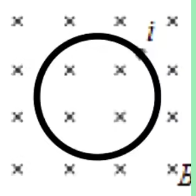

# 【物理】电磁感应

## 磁通量

### 基础知识

定义：磁感应强度与垂直 $B$ 方向上的面积的乘积，表示穿过面积的条数。

字母：$\phi$。磁通量是标量，但**有正负**。

计算：
$$
\phi = BS_{\perp}
$$
其中 $S$ 表示垂直于磁感线方向上的面积。

单位：韦伯，即 $\mathrm{wb}$；

---

### 对磁通量定义的理解

【关于面积 $S$】

对于**垂直于磁感线方向**的理解：

如下图所示，图中所求的磁通量 $\phi$ 的面积应该是 $S'$，而不是 $S$。即 $\phi = B S'$。

对于**面积范围**的理解：

如下两幅图所示，阴影部分表示磁场区域，那么左图由于磁场区域与圆的重合部分是正方形区域，那么 $\phi_1 = B S_正$，而右图二者重合区域是圆形区域，所以 $phi_2 = B S_圆$。

> 总结：所以 $S$ 的范围是题目中磁场区域与所求对象重合的部分。

【关于磁通量 $\phi$】

磁通量是标量，其正负表示**穿入或穿出**磁场，一般可规定一个方向为正，正负可相互抵消，

### 例题

如图所示，套在条形磁铁外的三个线圈，其面积 $S_1 > S_2 = S_3$，1 和 2 在同一平面内，3 线圈在磁铁正中间。设各线圈中的磁通量以此为 $\phi_1,\phi_2,\phi_3$，则它们的大小关系是什么？

求解：

考虑从 $\mathrm N$ 极向 $\mathrm S$ 极看，其视野应该是这样：

由于磁感线从 $\mathrm N$ 极指向 $\mathrm S$ 极，所以在条形磁铁内部磁感线是点出的，在外部是叉进的，且由于磁通量穿入穿出可相互抵消，则内部叉进和点出的「数量」相同，所以在圆形内部，点出的条数大于叉进的条数。

对比线圈 1 和 2，由于 1 的面积更大，所以 1 中叉进的条数大于 2 中叉进的条数，又由于二者点出的条数相同（是同一个条形磁铁），所以 1 叉进将点出的抵消条数更多，所以 1 的磁通量更小，即 $\phi_1 < \phi_2$。

对比线圈 2 和 3，由于 3 在条形磁铁中间，根据条形磁铁外部磁感线越稀疏磁感应强度越小可知，条形磁铁中间外部磁感应强度最小，所以外部电场中 3 的磁感应强度小于 2，那么 3 叉进的条数小于 2 中的条数，所以 $\phi_3 > \phi_2$。

综上可知 $\phi_1 < \phi_2 < \phi_3$。

> 注意：条形磁铁中间外部磁感应强度最小。

## 感应电流的产生条件

感应电流的产生有两个条件：

1. 闭合电路。
2. 磁通量 $\phi$ 改变。

例如，下图中直导线在圆形线圈正中央的上方，根据右手定则，直导线产生的磁感线会从圆形线圈中穿入再穿出，且穿入穿出相互抵消，所以圆形线圈的磁通量始终为 $0$，所以不会产生感应电流。

---

**例题**

例 1：如图，一有界的匀强磁场宽度为 $d$，若将一个边长为 $l$ 的正方形导线框以速度 $v$ 匀速地通过磁场区域，已知 $d > l$，则导线框中无感应电流地时间是多少？

求解：

导线框整体完全在磁场中时，无感应电流，从完全进入磁场区域到开始离开磁场区域，运动了下图中红色线段的长度，所以时间为 $\dfrac{d - l}{v}$。

---

例 2：在如图所示的闭合铁芯上绕有一组线圈，与滑动变阻器、电池构成闭合回路，$a、b、c$ 为三个闭合金属圆环，假定线圈产生的磁场全部集中在铁芯内，则当滑动变阻器的滑片向右滑动的过程中，下列说法正确的是（）

A. $a、b$ 两个环的磁通量始终相同

B. $b$ 环磁通量始终是 $c$ 环的一半

C. $a、c$ 两个环中都有感应电流

D. $b、c$ 两个环中都有感应电流

求解：

根据右手螺旋定则可知，在铁芯上磁感线如下图所示。

那么有多少磁感线从 $b$ 穿过就有同样多的磁感线从 $a$ 穿过，所以 $a,b$ 两个环的磁通量相同。A 正确。

由于对于 $c$ 环同时有磁感线从 $c$ 穿入和穿出，且穿入穿出相互抵消，所以 $c$ 环磁通量为 $0$，无感应电流。BCD 错误。

故选 A。

## 楞次定律

### 内容

感应电流的方向总是要**阻碍**原磁通量 $\phi$ 的变化。

> 注意：这里是「阻碍」而非「阻止」，即它实际上还是不能完全阻止原磁通量的变化。

程序分析法判断感应电流的方向：

1. 判断原磁场的变化。
2. 根据「感应电流的方向总是要**阻碍**原磁通量 $\phi$ 的变化」通过阻碍磁场变化来得出感应磁场的方向。
3. 通过逆用右手螺旋定则得到感应电流的方向。
4. 通过左手定则判断出感应电流在磁场中受到的安培力方向。

例：如图所示，若 $B$ 增加，感应电流的方向是什么？线圈有什么趋势？

首先由于原磁场叉进增多，感应电流要阻碍这个趋势，那么感应电流会产生点出的磁感应强度来抵消叉进。所以感应磁场的磁感应强度是是点出的。

那么逆用右手螺旋定则可知感应电流的方向是逆时针。根据原磁场叉进，感应电流方向是逆时针，通过左手定则可判断出安培力向内，即线圈有收缩趋势。

> 注意：
>
> - 这里判断线圈的安培力时要通过**原磁场的磁感应强度**来判断，而不是**感应磁场**，因为它求的是感应电流在原磁场中受到的安培力作用。
> - 线圈内磁场的磁感应强度会**变大**，因为原磁场叉进增多，感应电流**虽然会「阻碍」原磁场变化但不能「阻止」**，所以结果线圈内磁场的磁感应强度仍然会增大，这里有点类似化学里的「勒夏特列原理」。（？大概）
> - 对「线圈有收缩趋势」的感性理解：线圈内磁场的磁感应强度变大，那么为了「阻碍」磁场变化，根据 $\phi = B S$，为了不让磁通量增大的那么明显，在 $B$ 增大时，可以适当减小 $S$，即收缩线圈。

---

楞次定律的特征：增反减同，增缩减扩，来拒去留。

解释：

例：如图所示，磁铁下方为 $\mathrm N$ 极，当磁场向下运动时判断：

1. 感应电流的方向（从上往下看）。
2. 线圈有何趋势。
3. 地面给线圈的支持力如何变化。

求解：

第一问：线圈处在有向下分量的磁场中，当磁铁向下运动时，向下的磁感应强度增大，那么感应出向上的磁感应强度，即**增反减同**。逆用右手螺旋定则可判断出从上往下看感应电流的方向是逆时针。

第二问：若磁感应强度增大，线圈有收缩的趋势去阻碍线圈磁通量增大，即**增缩减扩**。

第三问：由于线圈上感应磁场的磁感应强度方向向上，所以线圈可以等效成一个上方为 $\mathrm N$ 极的条形磁铁，那么两个条形磁铁互相排斥，受力分析可知地面给线圈的支持力会变大。感性理解：磁感应强度增大，线圈有向下运动的趋势去阻碍线圈的磁通量增大，所以桌面给线圈的支持力会增大，即**来拒去留**。

> 拓展：若下方是 $\mathrm S$ 极，则支持力同样增大，同样遵循「来拒去留」。

### 基础例题

例：如图，通有恒定电流的固定直导线右侧有一矩形线圈，导线与线圈置于同一光滑水平面。若增大导线中的电流强度，线圈将如何运动？

求解：电流增大，磁感应强度增大，为了阻碍增大的趋势，线圈需要远离直导线从而使得磁感应强度变小，所以要向右平移。

> 为了排除转动也能阻碍增大趋势，可以通过程序法运用左右手定则判断安培力的方向（安培力只有向左或向右的力，不存在垂直纸面的力）。

### 多过程分析

思路：从开始发生变化的位置对每一个运动段分别分析，最后求解。

**例题**

例 1：为寻找「磁生电」现象，英国物理学家法拉第在 1831 年把两个线圈绕在同一个软铁环上（如图所示），一个线圈 $A$ 连接电池 $E$ 和开关 $K$，另一个线圈 $B$ 闭合，并在其中一段直导线正下方放置一小磁针。闭合开关 $K$ 前，小磁针静止且与直导线平行。当闭合开关 $K$ 后，从上往下看（）

A. 小磁针沿顺时针方向偏转了一下，最终复原

B. 小磁针沿逆时针方向偏转了一下，最终复原

C. 小磁针沿顺时针方向偏转了一下，并一直保持这种偏转状态

D. 小磁针沿逆时针方向偏转了一下，并一直保持这种偏转状态

求解：

闭合开关 $K$ 后，线圈左边的电路通入电流，根据右手螺旋定则可知线圈内部的磁感应强度方向为顺时针。根据楞次定律，右边的导线会由于磁场感应出电流，那么为了阻碍磁场变化，形成的感应磁场的磁感应强度方向应该是逆时针。再逆用右手螺旋定则可知右导线中电流方向为顺时针。再根据右手螺旋定则可知右导线产生的磁感线方向，即在小磁针一侧（直导线下方）磁感线是叉进的。根据小磁针 $\mathrm N$ 极会靠近磁感线方向，从上往下看小磁针会沿着顺时针方向偏转。

又由于闭合开关电流稳定后，由于 $\phi = BS$，$B$ 和 $S$ 均不再发生改变，则右导线不会再出现感应电流，那么也就不会出现磁场，所以小磁针不会继续偏转，而是最终复原。

故选 A。

> 注意：再求得线圈中的磁感线方向时，不能直接利用右手定则判断右导线的电流方向，而应该先利用感应电流的产生条件判断出是否存在感应电流，再判断感应磁场的方向（根据楞次定律判断），然后再利用右手螺旋定则判断右导线电流的方向。

---

例 2：一水平放置的矩形闭合线圈 $abcd$，在细长磁铁的 $\mathrm N$ 极附近数值下落，由图示位置 I 经过位置 II 到位置 III，位置 I 和位置 III 都很靠近位置 II。在这个过程中，线圈中感应电流如何流动？

求解：

首先画出条形磁铁的磁感线，如下图所示。

那么由于位置 II 的线圈与磁感线平行，所以磁通量为 $0$。所以从位置 I 到 II，磁感应强度方向向上，逐渐减小为 $0$，那么根据「增反减同」，线圈应该感应出向上的感应磁场；同理，从位置 II 到 II，磁感应方向向下，逐渐增大，那么线圈同样会感应出向上的感应磁场。

所以从 I 到 III，感应磁场的方向始终向上，根据右手螺旋定则可知感应电流应该沿着 $abcd$ 流动。

> 注意：遇到类似例 2 这样的问题可以考虑先画出条形磁铁附近的磁感线求解。
