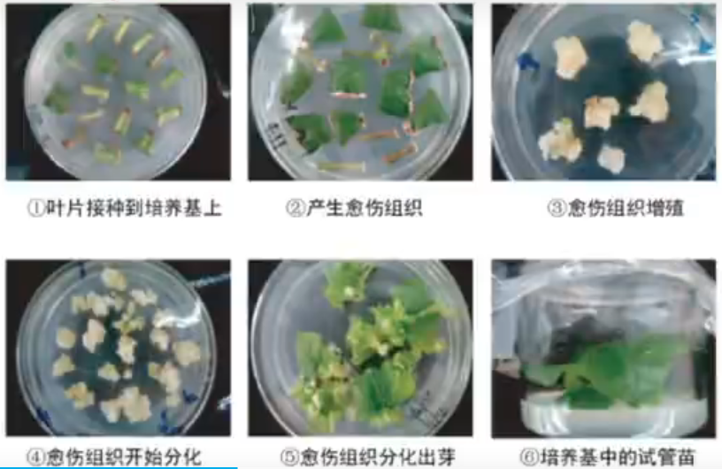
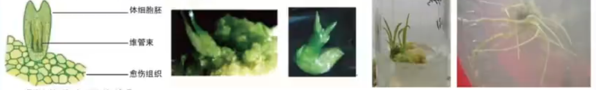
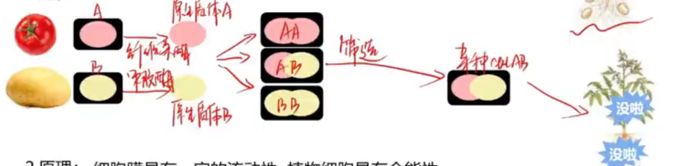
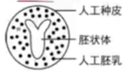

# 【生物】选必三：植物细胞工程

## 植物组织培养技术

### 介绍

1. 概念：是指将离体的植物器官、组织或细胞等，培养在人工配制的培养基上，给予适宜的培养条件，诱导其形成完整植株的技术。

2. 原理：植物细胞的全能性。

3. 植物细胞的全能性：

   - 定义：细胞经过分裂和分化之后，仍然具有产生完整生物体或分化成其他各种细胞的潜能（例如胡萝卜的表皮细胞经过组织培养产生植株）。在生物的生长发育过程中，并不是所有的细胞都表现出全能性，而是分化成各种组织和器官。这是因为细胞在特定的时间和空间条件下，细胞中的基因会选择性表达。
   - 细胞具有全能性的原因：细胞含有该种生物的全部遗传信息。
   - 表现条件：
     1. 具有完整的细胞结构。
     2. 处于**离体**状态。
     3. 提供一定的营养、激素和其他适宜的条件。
   - 体内细胞不能表现全能性：
     1. 实例：芽原基的细胞只能发育为芽，叶原基的细胞只能发展为叶；
     2. 原因：在特定的时间和空间下，细胞中的基因会选择性表达。

4. 培养过程：

   外植体（离体的组织、器官或细胞）$\ce{->[脱分化]}$ 愈伤组织 $\ce{->[再分化]}$ 根、芽或胚状体 $\longrightarrow$ 完整植株。

   

   说明：

   - 外植体：离体培养的植物器官、组织或细胞。一般取植物幼嫩部位（如茎尖）或花药等。
   
   - 如果用花药组织培养，得到的是单倍体植株。
   
   - 愈伤组织：
     - 定义：在一定的激素和营养等条件的诱导下，**已经分化**的细胞可以经过脱分化，即失去其特有的结构和功能，转变成**未分化**的细胞，进而形成不定形的薄壁组织团块，这称为愈伤组织。
     
     - 特点：**排列疏松、无规则、高度液泡化、呈无定形状态的薄壁细胞**，具有分裂和未分化特性。
     
     - 诱导形成条件：
     
       【1 使用顺序不同，结果不同】
     
       |            使用顺序            |             实验结果             |
       | :----------------------------: | :------------------------------: |
       | 先食用生长素，后使用细胞分裂素 | 有利于细胞分裂，但不利于细胞分化 |
       | 先食用细胞分裂素，再使用生长素 |         细胞既分裂又分化         |
       |            同时使用            |           分化频率提高           |
     
       【2 生长素和细胞分裂素的用量比例对植物细胞发育方向的影响】
     
       | 生长素用量：细胞分裂素用量 |       植物细胞发育方向       |
       | :------------------------: | :--------------------------: |
       |           比值高           | 有利于根的分化，抑制芽的形成 |
       |           比值低           | 有利于芽的分化，抑制根的形成 |
       |          比值适中          |      促进愈伤组织的生成      |
     
   - 注意：愈伤组织不需要光照。但诱导再分化需要光照。
   
   - 胚状体：离体培养条件下，没有经过受精过程，但是经过了胚胎发育过程中所形成的胚状类似物，一般专指在组织培养条件下产生的非合子胚。
   
     
   
     合子胚：就是受精卵，经过了受精过程。
   
   - 脱分化：已分化的细胞经过诱导后失去其特有结构和功能而转变成未分化细胞的过程。
   
   - 再分化：愈伤组织能重新分化成芽、根等器官的过程。

### 实验操作（以菊花的组织培养为例）

1. 操作过程：制备 MS 固体培养基 $\to$ 外植体消毒 $\to$ 接种 $\to $ 培养 $\to$ 转接 $\to$ 移栽。

   【外植体消毒】

   用酒精擦拭双手和超净工作台台面。

   将流水充分冲洗后的外植体（幼嫩的茎段）用酒精消毒 $\mathrm{30s}$，然后立即用无菌水清洗 $2\sim3$ 次；

   再用次氯酸钠溶液处理 $\mathrm{30min}$ 后，立即用无菌水清洗 $2\sim 3$ 次。

   > 注意：这里消毒用的不是乙醇和次氯酸钠的混合溶液；外植体只能**消毒**不能**杀菌**。

   【接种】

   1. 将消过毒的外植体置于无菌的培养皿中，用无菌滤纸吸取表面的水分。用解剖刀将外植体切成 $\mathrm{0.5\sim 1 cm}$ 长的小段。
   2. 在酒精灯火焰旁，将外植体的 $1/3\sim 1/2$ 插入诱导愈伤组织的培养基中，用封口膜或瓶盖封盖瓶口，并在培养瓶上作好标记。**注意：插入外植体需要保证形态学上端朝上，形态学下端朝下。用封口膜封口可以防止外界杂菌侵入，但不能阻止平内外的气体交换。**

   【培养】

   将接种了外植体的锥形瓶或植物组织培养瓶置于 $\mathrm{18\sim 22 ℃}$ 的培养箱中培养，在培养过程中，定期观察和记录愈伤组织的生长情况。

   【转接】

   培养 $\mathrm{15 \sim 20d}$ 后，将生长良好的愈伤组织转接到**诱导生芽的培养基**上。长出芽后，再将其转接到**诱导生根的培养基**上，进一步诱导试管苗。注意：必须先**生芽**再**生根**，先生根再转移到诱导生芽的培养基中容易导致转移过程中根断裂。

   【移栽】

   移栽前先打开封口膜或瓶盖，让试管苗在培养箱内生长几日。用流水清洗掉根部的培养基后，将幼苗移植到消过毒的蛭石或珍珠岩的环境下，待其长壮后后再移栽入土。

   每天观察并记录幼苗的生长情况，适时浇水、施肥，直至开花。

   > 选用蛭石或珍珠岩作为栽培基质的原因是蛭石带菌量低，但注意**蛭石无营养**。

2. 说明：

   - MS 固体培养基中应该加入琼脂和蔗糖，加入蔗糖的作用：①给外植体提供营养；②调节渗透压。
   - MS 固体培养基不一定非要加入生长激素和细胞分裂素。
   - 培养基实验前需要通过高压蒸汽灭菌法灭菌。

## 植物体细胞杂交技术

1. 概念： 将**不同种**的植物细胞，在一定条件下融合成杂种细胞，并把杂种细胞培育成新的植物体的技术。

2. 过程：

   

   【说明】

   - 去除番茄细胞的细胞壁用纤维素酶，去除土豆细胞的细胞壁用果胶酶。
   - 原生质层和原生质体的区别：原生质体只不包含细胞壁，但包含液泡，而原生质层不包含液泡，只包含细胞膜，液泡膜和中间的部分；
   - 通过原生质体融合得到的有三种杂交体，我们可以用染色体数目不同等标志来区分不同的杂交体以便筛选出目标杂交体。
   - 得到杂交体后可以采用植物组织培养技术进行杂交植株的培养。

3. 原理：

   - 细胞膜具有一定的流动性；
   - **植物细胞**具有全能性。

4. 优点：打破生殖隔离，实现远缘杂交育种。

5. 植物体细胞杂交中遗传物质的变化

   - 遗传特性：杂种植株中含有两种植物的遗传物质，故杂种植株具备两种植物的遗传特性；

   - 染色体组数：

     染色体组数 = 两种植物体细胞内染色体组数之和。

     植物体细胞杂交形成的杂种植株，有几个染色体组就称为几倍体。

6. 注意事项：

   - 植物体细胞去壁的方法：最常用**酶解法**。在较温和的条件下（较高渗透压）通过纤维素酶来去除番茄细胞壁，通过果胶酶来去除土豆细胞壁（同时也可以去除其他植物细胞的细胞壁）；

   - 植物体细胞融合原生质体的方法：**人工诱导**。

     【物理法】离心法、电融合法；

     【化学法】如，聚乙二醇（PEG）融合法，高 $\ce{Ca^{2+}}$ 高 $\ce{pH}$ 融合法等。

   - 植物体细胞融合完成的标志：生成新的细胞壁。

   - 细胞融合的本质：细胞核的融合。

   - 植物体细胞杂交的终点：得到杂交体植株（注意不是**杂交体细胞**）。

## 植物细胞工程的应用

### 植物繁殖的新途径

1. 快速繁殖（微型繁殖技术）

   【方法】利用植物组织培养技术快速繁殖优良品种。

   【优点】

   - 采用**无性生殖**，保留了亲本的优良品种；
   - 使用材料少，培养周期短，繁殖率高，便于自动化管理。

   【实例】一些优良的观赏植物、经济林木、无性繁殖作物和濒危植物都实现了利用快速繁殖技术来提供苗木。

2. 作物脱毒：

   【含义】选取植物病毒极少甚至无病毒的组织，如茎尖，进行组织培养，再生的植株可能不带病毒，从而获得脱毒植物。

   【优点】获得高产、优质的植株。

   【实例】马铃薯、草莓、大蒜、甘蔗、菠萝和香蕉等。

3. 人工种子：

   【制备】

   以植物组织培养得到的胚状体、不定芽、顶芽和叶芽等为材料，经过人工薄膜包装得到。

   > 注意：人工种子不能包裹愈伤组织，因为它只能包裹已分化的组织，而愈伤组织未分化。

   【结构】

   如图

   人工胚乳除含胚状体发育所需的营养物质外，还可以添加各种附加成分，如固氮细菌、防病虫农药、植物激素、除草剂等。

   【优点】

   - 保持优良品种的优良特性；

   - 生产上不受季节、气候和地域等的限制；

   - 便于储存和运输；

   - 解决了某些作物品种繁殖能力差、结子困难或发芽率低等问题。

### 作物新品种的培育

1. 单倍体植株

   【方法】花药离体培养。

   【过程】花药（或花粉）$\ce{->[离体培养]}$ 单倍体植株 $\ce{->[人工诱导][染色体加倍]}$ 纯合二倍体 $\ce{->[选择]}$ 稳定遗传的优良品种。

   【原理】整个单倍体育种过程的原理是**染色体变异**，其中花药离体培养的原理是**植物细胞的全能性**。

   【优点】

   ①明显缩短了培育周期，节约了大量人力、物力；②后代稳定遗传，都是纯合体；③可以作为进行体细胞诱变育种和研究遗传突变的理想材料。

   【实例】

   我国成功培育出世界上第一个单倍体作物新品种——单育 1 号烟草，水稻、玉米、油菜、甘蓝和甜椒等作物新品种的育种。

2. 突变体的利用

   【原理】**基因突变**和**植物细胞全能性**。

   【突变体来源】植物离体培养过程中，细胞一直处于分裂状态，容易受到培养条件和诱变因素（如射线、化学物质等）的影响而产生突变，可以从突变体中筛选出对人类有用的突变体培育出新品种。

   【过程】 

   ​                           诱变处理

   ​                                $\ce{v}$

   外植体 $\ce{->[脱分化]}$ 愈伤组织 $\to$ 突变体 $\ce{->[筛选][培育]}$ 新品种

   ​                                            $\ce{^}$

   ​                                      诱导分化

   【优点】

   ①对于偶然出现的优良变异可通过植物组织培养使其稳定遗传。

   ②提高愈伤组织的突变率，而且在较小的空间内一次可处理大量材料。

   ③可以获得高产、优质、高抗、抗逆的新品种，加快了育种的进程。

   【缺点】突变具有不定向性和低频性，因此需要大量处理实验材料，而且符合人们需要、有利的品种比较小。

   【实例】抗花叶病毒的甘蔗、抗盐碱的烟草等品种已经用于生产。

3. 转基因植物的培养

4. 植物体细胞杂交

### 细胞产物的工厂化生产

1. 植物的代谢产物：

   - 初生代谢产物：初生代谢是指植物生长和生存所必需的代谢活动，初生代谢物有糖类、脂质、蛋白质、核酸等。

   - 次生代谢产物：

     【概念】植物代谢会产生一些一般认为不是植物基本的生命活动所必需的产物。

     【化学本质】一类小分子化合物（如酚类、萜类和含氮化合物等）。

     【作用】在植物抗虫、抗病等方面发挥重要作用，也是很多药物、香料和色素等的重要来源。

     【特点】

     ①植物的次生代谢物的含量很低；

     ②有些产物不能或难以通过化学合成途径得到。

2. 细胞产物的工厂化生产

   - 概念：通过植物组织培养来获得目标产物，获得的细胞产物包括蛋白质、脂肪、糖类、药物（如人参皂苷、紫杉醇、紫草宁）、香料、生物碱等。

   - 过程——植物细胞培养：在离体条件下对单个植物细胞或细胞团进行培养使其增殖的技术，培养过程一般为：

     外植体 $\ce{->[脱分化]}$ 愈伤组织 $\ce{->[分散开]}$ 细胞悬液 $\ce{->[发酵提取]}$ 细胞产物

   - 优点：不占用耕地，几乎不受季节、天气等的限制，因此对于社会、经济环境保护具有重要意义。

   - 实例：紫草宁、紫杉醇、人参皂苷等的
