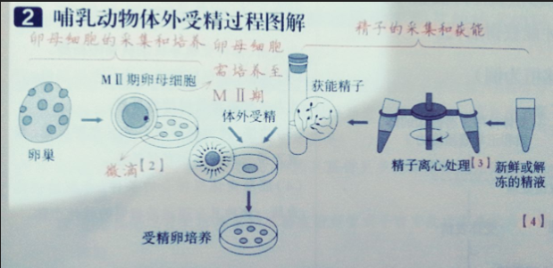

# 【生物】选必三：胚胎工程

## 胚胎工程简介

概念：对动物**早期胚胎**或**配子**所进行的多种**显微**操作和处理技术，如体外受精、胚胎移植、胚胎分割、胚胎干细胞培养灯技术。经过处理后获得的胚胎，还需移植到雌性动物体内生产后代，以满足人类的各种需求。

## 体内受精和早期胚胎的发育

1. 精子的产生：哺乳动物精子的发生是在**睾丸**内完成的，雄性动物从**初情期**（相当于人的青春期）开始，直到生殖机能衰退，在睾丸的**曲细精管**内不断进行着生殖细胞的增殖，源源不断地产生精子。

   各种家畜精子产生的过程分为如下三个阶段：

   - 第一阶段，位于曲细精管内的精原细胞进行**游戏分裂**，产生大量的精原细胞，其中部分精原细胞通过**染色体复制和其他物质的合成**，进一步形成**初级精母细胞**；

   - 第二阶段，初级精母细胞经过两次减数分裂（M I 和 M II）；第一次产生两个**次级精母细胞**，第二次产生两个含有**单倍染色体**的精细胞。

   - 第三阶段，精细胞逐渐变形成为精子。其中，细胞核变成**精子头的主要部分**，高尔基体发育为**头部的顶体**，中心体演变为**精子的尾**，线粒体聚集在尾的基部形成**线粒体鞘**。同时，细胞内的其他物质浓缩为球状，叫做原生质滴，随精子的成熟过程向后移动，直到最后脱落。

     

   

   说明：家畜每次射精排出的精子数以亿计，这是因为在自然繁殖的条件下，需要这种行为进行繁殖后代、延续物种的生理保障机制；并且在自然条件下，精子从雌性生殖道经子宫移动到输卵管的过程中，大量的精子途中死亡。最后到达受精部位的精子只剩百余个，与卵子完成受精的只有一个。

2. 卵子的发生

   

   受精的重要标志：在卵细胞膜和透明带之间观察到两个机体。

3. 精子发生和卵子发生的比较

   

4. 受精

   概念：是精子和卵子结合形成合子（即受精卵）的过程。它包括受精前的准备阶段和受精阶段。在自然条件下，受精是在雌性的输卵管内完成的。

   【准备阶段 1——精子获能】

   刚刚排出的精子，不能立即与卵子受精，必须在雌性动物生殖道发生相应的生理变化后，才能获得受精能力，称为”精子获能“。

   【准备阶段 2——卵子的准备】

   卵子一般在排除 2~3h 才能被精子传入。动物排除的卵子成熟程度不同，有的是初级精母细胞，如马、犬等，有的可能是次级卵母细胞，如猪、羊等。但它们都要在输卵管内进一步成熟，当达到 M II 中期时，才具备与精子受精的能力。

   【受精阶段】

   

   

   1. **获能后**的精子与卵子相遇时，首先发生**顶体反应**，使顶体内的酶释放出来。放射冠是包围在卵子透明带外的卵丘细胞群，精子所释放的**顶体酶**可直接溶解卵丘细胞之间的物质，形成精子穿越**放射冠**的通路。
   2. 穿过放射冠的精子立即与**透明带**接触，顶体酶随后将透明带溶出一条孔道，精子借自身运动穿越透明带，并接触卵细胞膜。在精子触及卵细胞膜的瞬间，会产生阻止后来的精子进入透明带的生理反应，这个反应称做**透明带反应**，它是防止多个精子进入透明带，引起多精子入卵受精的**第一道屏障**。
   3. 只有穿过透明带的精子才能与卵细胞膜接触。由于卵细胞膜表面有大量的微绒毛，当精子与卵细胞膜接触时，立即被微绒毛抱合。随后，精子外膜和卵细胞膜相互融合，精子入卵。
   4. 精子入卵后，卵细胞膜会立即发生一种生理反应，拒绝其他精子在进入卵内，这种生理反应叫做**卵细胞膜反应**，这是防止多精入卵受精的**第二道屏障**。
   5. 精子入卵后的另一个变化，是尾部脱离，并且原有的核膜破裂，随后，精子进入一个新的核膜，最后形成一个比原来精子核还大的核，叫做**雄原核**。与此同时，精子入卵后被激活的卵子完成了**减数第二次分裂**，排出第二极体后，形成**雌原核**，雌原核一般略小于雄原核。多数哺乳动物的第一极体不进行减数第二次分裂。
   6. 雄、雌原核充分发育后，相向移动，彼此接触，二者体积缩小、合并，两组核染色体合为一组，形成一个含二倍染色体的合子，也就是受精卵。受精过程至此结束。

   图示：

   

5. 早期胚胎的发育：

   

   一些概念：

   - 桑椹胚：当胚胎细胞数目达到 32 个左右时，胚胎形成致密的细胞团，形似桑葚，叫做桑葚胚。实验证实，这一阶段前的每一个细胞都具有发育成完整胚胎的潜能，属于全能细胞。

   - 囊胚：桑葚胚进一步发育，细胞开始出现分化。聚集在胚胎一端，个体较大的细胞，称为**内细胞团**，将来发育成**胎儿的各种组织**，而沿透明带内壁扩展和排列的、个体较小的细胞，称为**滋养层**细胞，它们将来发育成**胎盘和胎膜**。

   - 囊胚腔：随着胚胎进一步发育，胚胎的内部出现了含有液体的囊腔——**囊胚腔**，这个时期的胚胎叫做囊胚。囊胚的进一步扩大，会导致透明带的破裂，胚胎从其中伸展出来，这一过程叫做**孵化**。

     

   - 原肠胚：囊胚孵化后，再进一步发育，内细胞团表层的细胞形成**外胚层**，下方的细胞形成**内胚层**。这时的胚胎称为原肠胚，由内胚层包围的囊腔叫做原肠腔。滋养层则发育为胎儿的胎膜和胎盘。

     

     

   说明：

   - 细胞分裂方式：有丝分裂；
   - 细胞数目：增加；
   - 胚胎总体积：不增加或略有减少；
   - 每个细胞体积：减少；
   - 胚胎总有机物：减小；
   - 胚胎总 DNA 数：增加；
   - 每个细胞具有发育的全能性。

## 体外受精和早期胚胎的发育

### 体外受精

1. 过程：哺乳动物的体外受精技术主要包括**卵母细胞的采集**、**精子的获取和受精**等步骤。

   卵母细胞的采集和培养方法：

   - 超数排卵技术：从输卵管中冲取卵子，已经发育至减数第二次分裂中期，可直接与获能的精子进行受精作用；
   - 从卵巢中采卵：初级卵母细胞，需在体外培养至减数第二次分裂中期，才能进行体外受精。

   

   精子获能处理前离心处理的目的：除去精浆以利于精子获能。

   举例：试管动物

   - 试管动物的培育过程：获得卵母细胞和精子 $\to$ 体外受精 $\to $ 体外胚胎培养 $\to $ 早期胚胎 $\to $ 胚胎移植 $\to $ 产生个体。
   - 生殖方式：**有性生殖**。（与克隆动物的生殖方式不同）

2. 原理：人工模拟体内环境（包括营养、温度、$\ce{pH}$ 等），使卵母细胞成熟、精子获能，最终完成受精和胚胎保存。

3. 意义：体外受精技术是提高动物繁殖能力的有效措施，还可以为胚胎移植提供可用的胚胎。

### 胚胎移植

1. 概念：将体外受精及其他方式得到的胚胎，移植到**同种的**、**生理状态相同**的**雌性**动物体内，使之发继续发育为新个体的技术。

   说明：

   - 胚胎来源：通过转基因、核移植、体外受精、体内受精等技术获得的胚胎；
   - 供体：提供胚胎的个体。主要职能：产生具有优良遗传特性的胚胎；
   - 受体：接受胚胎的个体。主要职能：繁重而漫长的妊娠和育仔任务；
   - 胚胎受体应符合的条件：与胚胎供体为同一物种且生理状态相同的雌性个体。

2. 实质：

   - 从过程看：实际上是产生胚胎的**供体**和孕育胚胎的**受体**共同繁殖后代的过程；
   - 从结果看：早期胚胎在**相同生理环境条件下空间位置的转移**。

3. 地位：

   胚胎移植是胚胎工程的最终技术环节。在胚胎工程中通过任何一项技术，如转基因、核移植或体外受精等技术获得的胚胎，都必须移植给受体才能获得后代。

4. 程序（以牛的胚胎移植为例）

   

   1. 对供体、受体母牛进行同期发情处理
      - 原因：使它们的生理条件达到同步或一致，这样才能使供体的胚胎移入受体后有相似的生理环境；
      - 方法：对供体、受体母牛注射雌激素（或孕激素）；
   2. 对供体母牛进行超数排卵处理
      - 方法：注射促性腺激素；
      - 目的：诱发卵巢排出比自然情况下更多的成熟卵子；
   3. 胚胎的收集、检查、培养或保存
      - 胚胎的收集：用特制的冲卵装置，把供体母牛子宫内的胚胎冲洗出来（也叫**冲卵**）；
      - 胚胎检查：对胚胎进行质量检查，这时的胚胎应发育到**桑葚胚**或**囊胚**阶段；
      - 胚胎培养：在发育培养液中培养；
      - 胚胎保存：放入 $-196~\mathrm{℃}$ 的**液氮**中保存；
   4. 胚胎移植：移入同种生理状况一致的受体中。

   小结：

   - 两次使用激素：①用雌激素对供、受体母牛进行同期发情处理；②用促性腺激素使供体母牛超数排卵；
   - 两次检查：①对收集的胚胎进行质量检查；②对受体母牛是否妊娠进行检查。

5. 优势：

   - 可以充分发挥雌性优良个体的繁殖潜力；
   - 大大缩短了供体本身的繁殖周期；
   - 使供体的后代数目成倍增加。

6. 意义：

   - 牛羊的胚胎移植大大促进了我国畜牧业的发展；
   - 胚胎移植作为胚胎工程的最终环节，将推动胚胎工程其他技术的研究和开发。

### 胚胎分割

1. 概念：采用机械方法将早期胚胎切割成 $2$ 等份、$4$ 等份或 $8$ 等份等，经移植获得同卵双胎或多胎的技术。

2. 繁殖方式：无性繁殖（克隆）。

3. 对象：桑葚胚或囊胚阶段的胚胎。桑葚胚阶段尚未出现细胞分化，具有发育的全能性；囊胚阶段的内细胞团具有发育的全能性。

4. 基础和特点：

   - 理论基础：细胞的全能性；
   - 物质基础：每个细胞核具有相同的遗传物质。
   - 特点：每个后代都具有相同的遗传物质。

5. 过程：将发育良好的、形态正常的桑葚胚或囊胚移入含操作液的培养皿中 $\to$ 在显微镜下用分割刀或分割针分割 $\to$ 分割后的胚胎直接移植给受体或体外培养到囊胚阶段再移植给受体。

6. 胚胎性别鉴定和分割：

   

   分割胚胎必须强调内细胞团均等分裂的原因：内细胞团将来发育成胎儿的各种组织，若不均等分裂，会影响分割后胚胎的恢复和进一步发育；

   鉴定胚胎性别取样滋养层的目的：滋养层日后发育成胎盘、胎膜。取滋养层细胞做 DNA 分析鉴定性别，不会影响胎儿的发育。

7. 胚胎分割的优点

   - 可以促进优良动物品种的繁殖；
   - 产生的遗传形状相同的后代是进行遗传学研究的宝贵材料；
   - 在胚胎移植前，进行性别鉴别、遗传病筛查等，对于人工控制动物性别、动物繁殖健康后代有重要意义。

8. 局限性：

   - 采用胚胎分割技术产生同卵多胎的可能性是有限的，分割次数越多，分割后胚胎成活概率越小；
   - 存在刚出生的动物体重偏低，毛色、斑纹可能存在差异等问题。