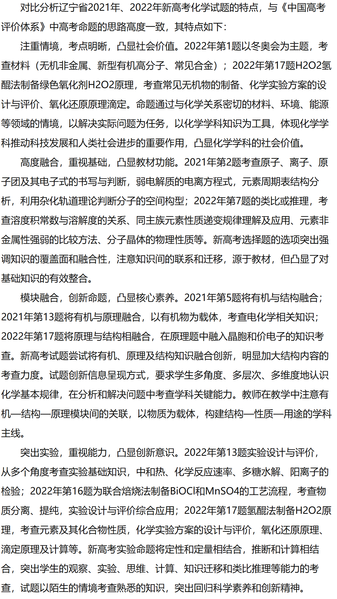

# 近几年新高考题型分析

## 化学

整体上：

- 陕西作为最后一届改革新高考的省份，明年大概率会自命题试卷，对比近 4 年全国各省市高考试卷使用情况，研究重庆市和辽宁省的新高考对陕西新高考命题走向有重要参考价值。
- 对于山西和河南，这两个省份虽采用新教材学习，但考察形式仍然是老高考形式，即物化生合卷作为理综，300 分，且时间和题型结构均与老高考相同（比如仍然是 11 道题，其中有 7 道选择），所以对于陕西明年新高考的参考价值并不大。
- 新高考总题数由旧高考的 11 道改为 18~19 道，主要增加在选择题上。

题型上：

填空题：

- 老高考 3 道必选 + 1 道二选一，3 道必选分别是实验题、工艺流程题、化学反应原理大题，1 道二选一是有机合成推断题和结构化学题二选一。
- 新高考除山东外 4 道必选，分别是实验题、工艺流程题、化学反应原理大题、有机合成推断题。

选择题：

- 老高考 7 道选择，新高考 14~15 道选择，分值由 6 分/题变为 3 分/题。
- 新增了化学反应速率、结构化学、元素及化合物性质等知识的考查，化学与 STSE、有机化学、电化学考查题量有所增加。化学用语、化学基础实验、原子结构推断、化学平衡图像、水溶液中的平衡、反应机理等知识依然是新高考的重要考点。

命题特点：

## 物理

整体上：

- 选择题是 7+3 模式（即 7 道单选 + 3 道多选），单选 4 分，多选 6 分。共 46 分。
- 非选择题 5 道大题，共 54 分。

题型上：

参考辽宁省近三年新高考改革物理试题如下：

- 近三年与力学有关的题目（包括纯力学和力电结合）分数上占比分别为：46%，68%，72%。相对来说占比较高。
- 纯运动学考察方式一般不会与力结合，但涉及电磁一般都与力结合。

